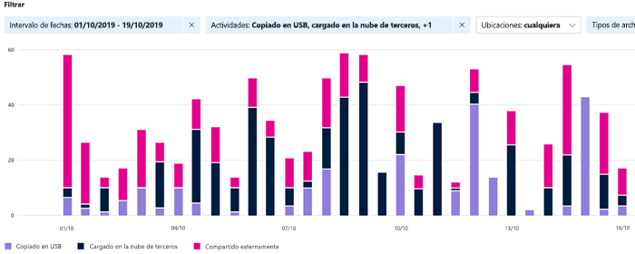

# Introducción al explorador de actividadGet started with activity explorer

La [introducción a la](data-classification-overview.md) clasificación de datos y las pestañas del [explorador](data-classification-content-explorer.md) de contenido le dan visibilidad sobre qué contenido se ha detectado y etiquetado, y dónde está ese contenido.The [data classification overview](data-classification-overview.md) and [content explorer](data-classification-content-explorer.md) tabs give you visibility into what content has been discovered and labeled, and where that content is. El explorador de actividad complementa este conjunto de funciones permitiéndole supervisar lo que se lleva a cabo con el contenido de la etiqueta.Activity explorer rounds out this suite of functionality by allowing you to monitor what's being done with your labeled content. El explorador de actividades proporciona una vista histórica de las actividades en el contenido etiquetado.Activity explorer provides a historical view of activities on your labeled content. La información de actividad se recopila Microsoft 365 registros de auditoría unificados, transformados y puestos a disposición en la interfaz de usuario del explorador de actividades.The activity information is collected from the Microsoft 365 unified audit logs, transformed and made available in the Activity explorer UI. 

Hay más de 30 filtros diferentes disponibles, estos son algunos:There are over 30 different filters available for use, some are:

- Intervalo de fechas:date range
- TIPO DE ACTIVIDADactivity type
- Ubicaciónlocation
- Usuariouser
- Etiqueta de confidencialidadsensitivity label
- Etiqueta de retención:retention label
- ruta de acceso del archivofile path
- Directiva DLPDLP policy

## Requisitos previosPrerequisites

Todas las cuentas que tengan acceso a la clasificación de datos y la usen deben tener una licencia asignada de una de estas suscripciones:Every account that accesses and uses data classification must have a license assigned to it from one of these subscriptions:

- Microsoft 365 (E5)Microsoft 365 (E5)
- Office 365 (E5)Office 365 (E5)
- Complemento de cumplimiento avanzado (E5)Advanced Compliance (E5) add-on
- Complemento de inteligencia de amenazas avanzado (E5)Advanced Threat Intelligence (E5) add-on
- Gobernanza y protección de la información de Microsoft 365 E5/A5Microsoft 365 E5/A5 Info Protection & Governance
- Cumplimiento de Microsoft 365 E5/A5 Microsoft 365 E5/A5 Compliance

### PermisosPermissions

 Para obtener acceso a la pestaña explorador de actividades, se debe asignar explícitamente la pertenencia a una cuenta en cualquiera de estos grupos de roles o concederla explícitamente.In order to get access to the activity explorer tab, an account must be explicitly assigned membership in any one of these role groups or explicitly granted the role.

<!--
> [!IMPORTANT]
> Access to Activity explorer via the Security reader or Device Management role groups or other has been removed-->

**Grupos de roles de Microsoft 365****Microsoft 365 role groups**

- Administrador globalGlobal administrator
- Administrador de cumplimientoCompliance administrator
- Administrador de seguridadSecurity administrator
- Administrador de datos de cumplimientoCompliance data administrator

**Microsoft 365 roles****Microsoft 365 roles**

- Administrador de cumplimientoCompliance administrator
- Administrador de seguridadSecurity administrator

## Tipos de actividadActivity types

El explorador de actividades recopila información de actividad de los registros de auditoría en varios orígenes de actividades.Activity explorer gathers activity information from the audit logs on multiple sources of activities. Para obtener información más detallada sobre qué actividad de etiquetado la convierte en explorador de actividades, vea [Labeling events available in Activity explorer](data-classification-activity-explorer-available-events.md).For more detailed information on what labeling activity makes it to Activity explorer, see [Labeling events available in Activity explorer](data-classification-activity-explorer-available-events.md).

**Actividades de etiquetas** de confidencialidad y actividades de etiquetado de retención de aplicaciones nativas de Office, complemento de Azure Information Protection, SharePoint Online, Exchange Online (solo etiquetas de confidencialidad) y OneDrive. **Sensitivity label activities** and **Retention labeling activities** from Office native applications, Azure Information Protection add-in, SharePoint Online, Exchange Online (sensitivity labels only) and OneDrive. Por ejemplo:Some examples are:

- etiqueta aplicadalabel applied
- etiqueta cambiada (actualizada, degradada o eliminada)label changed (upgraded, downgraded, or removed)
- simulación de etiquetado automáticoauto-labeling simulation
- archivo leídofile read 

**Escáner de Azure Information Protection (AIP) y clientes AIP****Azure Information Protection (AIP) scanner and AIP clients**

- protección aplicadaprotection applied
- protección modificadaprotection changed
- protección eliminadaprotection removed
- archivos detectadosfiles discovered 

El explorador de actividades también recopila eventos de coincidencias de directivas **DLP** de Exchange Online, SharePoint Online, OneDrive, chat y canal de Teams (versión preliminar), carpetas y bibliotecas de SharePoint locales y recursos compartidos de archivos locales y dispositivos Windows 10 mediante prevención de pérdida de datos de extremo **(DLP).**Activity explorer also gathers **DLP policy matches** events from Exchange Online, SharePoint Online, OneDrive, Teams Chat and Channel (preview), on-premises SharePoint folders and libraries, and on-premises file shares, and Windows 10 devices via **Endpoint data loss prevention (DLP)**. Algunos ejemplos de eventos de Windows 10 dispositivos son archivos:Some examples events from Windows 10 devices are file:

- eliminacionesdeletions
- creacionescreations
- copiado en el Portapapelescopied to clipboard
- modificado modified
- readread
- impresoprinted
- nombre cambiadorenamed
- copiado en el recurso compartido de redcopied to network share
- a la que se accede mediante una aplicación sin alambraraccessed by unallowed app 

El valor de comprender qué acciones se están haciendo con el contenido etiquetado confidencial es que puede ver si los controles que ya ha puesto en marcha, como la prevención de pérdida de datos son [efectivos](dlp-learn-about-dlp.md) o no.The value of understanding what actions are being taken with your sensitive labeled content is that you can see if the controls that you have already put into place, such as [data loss prevention](dlp-learn-about-dlp.md) are effective or not. Si no es así, o si se detecta algo inesperado, como un gran número de elementos etiquetados `highly confidential`y se degradan`general`, puede administrar las distintas directivas y llevar a cabo nuevas acciones para restringir el comportamiento no deseado.If not, or if you discover something unexpected, such as a large number of items that are labeled `highly confidential` and are downgraded `general`, you can manage your various policies and take new actions to restrict the undesired behavior.

> [!NOTE]
> El explorador de actividad no supervisa actualmente las actividades de retención de Exchange Online.Activity explorer doesn't currently monitor retention activities for Exchange Online.

## Recursos adicionalesSee also

- [Información sobre las etiquetas de confidencialidadLearn about sensitivity labels](sensitivity-labels.md)
- [Más información sobre las directivas y las etiquetas de retenciónLearn about retention policies and retention labels](retention.md)
- [Obtener más información acerca de los tipos de información confidencialLearn about sensitive information types](sensitive-information-type-learn-about.md)
- [Obtenga información sobre la clasificación de datos.Learn about data classification](data-classification-overview.md)
