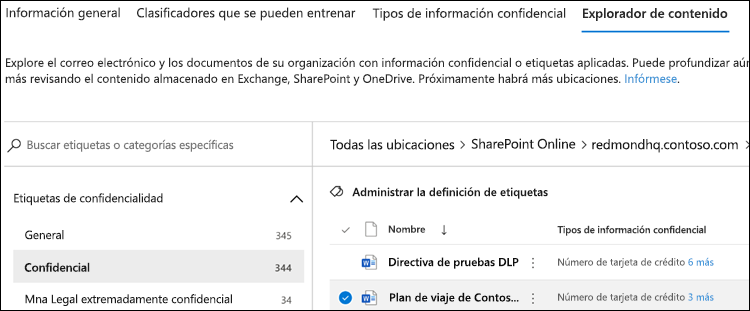

# Usar el explorador de contenido de clasificación de datos (vista previa)

El explorador de contenido de la clasificación de datos le permite ver de forma nativa los elementos que se resumiendo en la página información general.

## Explorador de contenido

El explorador de contenido muestra una instantánea actual de los elementos que tienen una etiqueta de confidencial, una etiqueta de retención o que se han clasificado como un tipo de información confidencial en la organización.

### Tipos de información confidencial

Una [directiva DLP](data-loss-prevention-policies.md) puede ayudar a proteger información confidencial, lo que se define como un **tipo de información confidencial**. Microsoft 365 incluye [definiciones para muchos tipos comunes de información confidencial](what-the-sensitive-information-types-look-for.md), en muchas regiones diferentes y listas para su uso. Por ejemplo, un número de tarjeta de crédito, números de cuenta bancaria, números de identificación nacionales y números de servicio de Windows Live ID.

### Etiquetas de confidencialidad

Una [etiqueta de confidencialidad](sensitivity-labels.md) es simplemente una etiqueta que indica el valor que tiene el elemento para su organización. Se puede aplicar manualmente o automáticamente. Una vez aplicada, se inserta en el documento y se adhiere a él dondequiera que vaya. Una etiqueta de confidencialidad habilita varios comportamientos de protección, como, por ejemplo, la marca de agua o el cifrado obligatorios. Con la protección del punto de conexión habilitada, podrá incluso evitar que un elemento abandone el control de la organización.

Las etiquetas de confidencialidad deben habilitarse para los archivos de SharePoint y OneDrive para que los datos correspondientes aparezcan en la página de clasificación de datos. Para más información, vea[ habilitar etiquetas de confidencialidad para los archivos de Office en SharePoint y OneDrive (vista previa)](sensitivity-labels-sharepoint-onedrive-files.md)

### Etiquetas de retención

Una [etiqueta de retención](labels.md) le permite definir durante cuánto tiempo se conserva un elemento con una etiqueta y los pasos que se deben seguir antes de eliminarlo. Se puede aplicar manualmente o automáticamente mediante directivas. Puede ayudar a su organización a mantener el cumplimiento normativo y los requerimientos legales.

### Permisos

Hay dos roles que otorgan acceso al explorador de contenido:

- **Visor de listas del explorador de contenido**: la pertenencia a este grupo de roles permite ver cada elemento y su ubicación. El rol `data classification list viewer` se ha asignado previamente a este grupo de roles.

- **Visor de contenido del explorador de contenido**: la pertenencia a este grupo de roles permite ver el contenido de cada elemento de la lista. El rol `data classification content viewer` se ha asignado previamente a este grupo de roles.

La cuenta que use para tener acceso al explorador de contenido debe estar en uno de los grupos de roles o en ambos. Estos son grupos de roles independientes y no son acumulativos. Por ejemplo, si desea conceder a una cuenta la capacidad para ver los elementos y sus ubicaciones únicamente, conceda a los derechos de visores de listas de explorador de contenido. Si desea que esa misma cuenta también pueda ver el contenido de los elementos de la lista, conceda los derechos de visor de contenido de explorador de contenido.

También puede asignar uno o ambos roles a un grupo de roles personalizado para ajustar el acceso a Content Explorer.

### Cómo usar el explorador de contenido

1. Abra **Centro de cumplimiento de Microsoft 365 **  > **de la clasificación de datos ** > **El explorador de contenido**.
2. Si sabe el nombre de la etiqueta o el tipo de información confidencial, puede escribirlo en el cuadro de búsqueda.
3. De forma alternativa, puede buscar el elemento expandiendo el tipo de etiqueta y seleccionando la etiqueta de la lista; a continuación se muestra un elemento de la parte de la lista correspondiente a la etiqueta de retención.
4. Seleccione una ubicación en **todas las ubicaciones** y profundice en la estructura de carpetas hasta el elemento.
5. Haga doble clic para abrir el elemento de forma nativa en el explorador de contenido.

## Recursos adicionales

- [Etiquetas de confidencialidad](sensitivity-labels.md)
- [Etiquetas de retención](labels.md)
- [Qué buscan los tipos de información confidencial](what-the-sensitive-information-types-look-for.md)
- [Información general sobre las directivas de retención](retention-policies.md)
- [Información general sobre la prevención de pérdida de datos](data-loss-prevention-policies.md)
