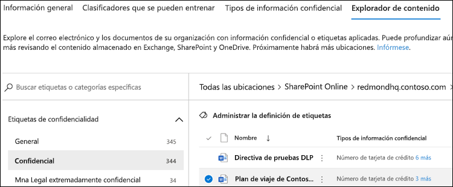

# Usar el explorador de contenido de clasificación de datos (vista previa)Using data classification content explorer (preview)

El explorador de contenido de la clasificación de datos le permite ver de forma nativa los elementos que se resumiendo en la página información general.The data classification content explorer allows you to natively view the items that were summarized on the overview page.

## Explorador de contenidoContent explorer

El explorador de contenido es una instantánea actual de los elementos que tienen una etiqueta de sensibilidad, una etiqueta de retención o que se han clasificado como un tipo de información confidencial en la organización.Content explorer is a current snapshot of the items that have a sensitivity label, a retention label or have been classified as a sensitive information type in your organization.

### PermisosPermissions

Hay dos roles que otorgan acceso al explorador de contenido:There are two roles that grant access to Content explorer:

- **Visor de listas del explorador de contenido**: la pertenencia a este rol permite ver cada elemento y su ubicación.**Content Explorer List viewer**: Membership in this role allows you to see each item and its location.

- **Visor de contenido del explorador de contenido**: la pertenencia a este rol permite ver el contenido de cada elemento de la lista.**Content Explorer Content viewer**: Membership in this role allows you to view the contents of each item in the list.

La cuenta que use para tener acceso al explorador de contenido debe estar en uno de los roles o en ambos.The account you use to access Content explorer must be in one or both of the roles. Este es un rol independiente y no es acumulativa.These are independent roles and are not cumulative. Por ejemplo, si desea conceder a una cuenta la capacidad para ver los elementos y sus ubicaciones únicamente, conceda a los derechos de visores de listas de explorador de contenido.For example, if you want to grant an account the ability to view the items and their locations only, grant Content Explorer List viewer rights. Si desea que esa misma cuenta también pueda ver el contenido de los elementos de la lista, conceda los derechos de visor de contenido de explorador de contenido.If you want that same account to also be able to view the contents of the items in the list, grant Content Explorer Content viewer rights as well.

### Cómo usar el explorador de contenidoHow to use content explorer

1. Abra \*\*Centro de cumplimiento de Microsoft 365 \*\*  > \*\*de la clasificación de datos \*\* > **El explorador de contenido**.Open **Microsoft 365 compliance center**  > **Data classification** > **Content explorer**.
2. Si sabe el nombre de la etiqueta o el tipo de información confidencial, puede escribirlo en el cuadro de búsqueda.If you know the name of the label, or the sensitive information type, you can type that into the search box.
3. De forma alternativa, puede buscar el elemento expandiendo el tipo de etiqueta y seleccionando la etiqueta de la lista; a continuación se muestra un elemento de la parte de la lista correspondiente a la etiqueta de retención.Alternately, you can browse for the item by expanding the label type and selecting the label from the list, an item from the retention label portion of the list is show below.
4. Seleccione una ubicación en **todas las ubicaciones** y profundice en la estructura de carpetas hasta el elemento.Select a location under **All locations** and drill down the folder structure to the item.
5. Haga doble clic para abrir el elemento de forma nativa en el explorador de contenido.Double click to open the item natively in content explorer.

## Vea tambiénSee also

- [Etiquetas de confidencialidadSensitivity labels](sensitivity-labels.md)
- [Etiquetas de retenciónRetention labels](labels.md)
- [Qué buscan los tipos de información confidencialWhat the sensitive information types look for](what-the-sensitive-information-types-look-for.md)
- [Información general sobre las directivas de retenciónOverview of retention policies](retention-policies.md)
