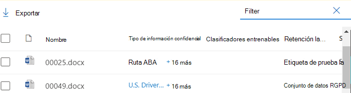

# Introducción al explorador de contenido

El explorador de contenido de la clasificación de datos le permite ver de forma nativa los elementos que se resumiendo en la página información general.

## Requisitos previos

Todas las cuentas que tengan acceso a la clasificación de datos y la usen deben tener una licencia asignada de una de estas suscripciones:

- Microsoft 365 (E5)
- Office 365 (E5)
- Complemento de cumplimiento avanzado (E5)
- Complemento de inteligencia de amenazas avanzado (E5)
- Gobernanza y protección de la información de Microsoft 365 E5/A5
- Cumplimiento de Microsoft 365 E5/A5 

### Permisos

Para obtener acceso a la pestaña del explorador de contenido, una cuenta debe tener asignada una suscripción en uno de estos roles o grupos de roles. 

**Grupos de roles de Microsoft 365**

- Administrador global
- Administrador de cumplimiento
- Administrador de seguridad
- Administrador de datos de cumplimiento

> [!IMPORTANT]
> La pertenencia a estos grupos de roles no le permite ver la lista de elementos en el explorador de contenido o ver el contenido de los elementos en el explorador de contenido.

### Permisos necesarios para acceder a elementos en el explorador de contenido

El acceso al explorador de contenidos está altamente restringido porque permite leer el contenido de los archivos digitalizados.

> [!IMPORTANT]
> Estos permisos reemplazan los permisos que se asignan a los elementos de forma local, lo que permite ver el contenido. 

Hay dos roles que conceden acceso al explorador de contenido y se otorgan mediante el [Centro de seguridad y cumplimiento de Microsoft](https://protection.office.com/permissions):

- **Visor de listas del explorador de contenido**: la pertenencia a este grupo de roles permite ver cada elemento y su ubicación en la vista de lista. El rol `data classification list viewer` se ha asignado previamente a este grupo de roles.

- **Visor de contenido del explorador de contenido**: la pertenencia a este grupo de roles permite ver el contenido de cada elemento de la lista. El rol `data classification content viewer` se ha asignado previamente a este grupo de roles.

La cuenta que use para tener acceso al explorador de contenido debe estar en uno de los grupos de roles o en ambos. Estos son grupos de roles independientes y no son acumulativos. Por ejemplo, si desea conceder a una cuenta la capacidad para ver los elementos y sus ubicaciones únicamente, conceda a los derechos de visores de listas de explorador de contenido. Si desea que esa misma cuenta también pueda ver el contenido de los elementos de la lista, conceda los derechos de visor de contenido de explorador de contenido.

También puede asignar uno o ambos roles a un grupo de roles personalizado para ajustar el acceso a Content Explorer.

Un administrador global, un administrador de cumplimiento o un administrador de datos pueden asignar el visor de listas del explorador de contenido cuando sea necesario y la pertenencia al grupo de funciones del visor del explorador de contenido.

## Explorador de contenido

El explorador de contenido muestra una instantánea actual de los elementos que tienen una etiqueta de confidencial, una etiqueta de retención o que se han clasificado como un tipo de información confidencial en la organización.

### Tipos de información confidencial

Una [directiva DLP](data-loss-prevention-policies.md) puede ayudar a proteger información confidencial, lo que se define como un **tipo de información confidencial**. Microsoft 365 incluye [definiciones para muchos tipos comunes de información confidencial](sensitive-information-type-entity-definitions.md) de muchas regiones diferentes y listas para su uso. Por ejemplo, un número de tarjeta de crédito, números de cuenta bancaria, números de identificación nacionales y números de servicio de Windows Live Id.  

> [!NOTE]
> Actualmente, el explorador de contenido no busca ningún tipo de información confidencial en Exchange Online.

### Etiquetas de confidencialidad

Una [etiqueta de confidencialidad](sensitivity-labels.md) es simplemente una etiqueta que indica el valor que tiene el elemento para su organización. Se puede aplicar manualmente o automáticamente. Una vez aplicada, se inserta en el documento y se adhiere a él dondequiera que vaya. Una etiqueta de confidencialidad habilita varios comportamientos de protección, como, por ejemplo, la marca de agua o el cifrado obligatorios.

Las etiquetas de confidencialidad deben habilitarse para los archivos de SharePoint y OneDrive para que los datos correspondientes aparezcan en la página de clasificación de datos. Para más información, vea [Habilitar etiquetas de confidencialidad para los archivos de Office en SharePoint y OneDrive](sensitivity-labels-sharepoint-onedrive-files.md).

### Etiquetas de retención

Una [etiqueta de retención](retention.md) le permite definir durante cuánto tiempo se conserva un elemento con una etiqueta y los pasos que se deben seguir antes de eliminarlo. Se puede aplicar manualmente o automáticamente mediante directivas. Puede ayudar a su organización a mantener el cumplimiento normativo y los requerimientos legales.

### Cómo usar el explorador de contenido

1. Abra **Centro de cumplimiento de Microsoft 365**  > **de la clasificación de datos** > **El explorador de contenido**.
2. Si sabe el nombre de la etiqueta o el tipo de información confidencial, puede escribirlo en el cuadro de filtro.
3. De forma alternativa, puede buscar el elemento expandiendo el tipo de etiqueta y seleccionando la etiqueta de la lista.
4. Seleccione una ubicación en **todas las ubicaciones** y profundice en la estructura de carpetas hasta el elemento.
5. Haga doble clic para abrir el elemento de forma nativa en el explorador de contenido.

### Exportar
El control de **Exportación** creará un archivo .csv que contiene una lista de lo que se muestra en el panel **Todas las ubicaciones**.

### Búsqueda

Cuando profundiza en una ubicación, como una carpeta de Exchange o un sitio de SharePoint o de OneDrive, aparece la herramienta de **búsqueda**.

El ámbito de la herramienta de búsqueda es lo que se muestra en el panel **Todas las ubicaciones** y lo que puede buscar varía en función de la ubicación seleccionada. 

Cuando **Exchange** es la ubicación seleccionada, puede buscar en la dirección de correo completa del buzón, por ejemplo `user@domainname.com`.

Cuando **SharePoint** o **OneDrive** están seleccionados, la herramienta de búsqueda aparecerá cuando profundice en nombres de sitio, carpetas y archivos. 

> [!NOTE]
> **OneDrive** Hemos escuchado sus valiosos comentarios sobre la integración de OneDrive durante nuestro programa de versión preliminar. En base a los comentarios, la funcionalidad de OneDrive permanecerá en la versión preliminar hasta que todas las correcciones estén instaladas. Según el espacio empresarial, es posible que algunos clientes no vean OneDrive como una ubicación. Agradecemos su continuo apoyo en esto.

Puede buscar en:

|valor|ejemplo  |
|---------|---------|
|nombre completo del sitio    |`https://contoso.onmicrosoft.com/sites/sitename`    |
|nombre de carpeta raíz (obtiene todas las subcarpetas)    | `/sites`        |
|nombre de archivo    |    `RES_Resume_1234.txt`     |
|texto al principio del nombre de archivo| `RES`|
|texto después de un carácter de subrayado (_) en el nombre de archivo|`Resume` o `1234`| 
|extensión de archivo|`txt`|

## Recursos adicionales

- [Información sobre las etiquetas de confidencialidad](sensitivity-labels.md)
- [Información sobre las directivas de retención y las etiquetas de retención](retention.md)
- [Definiciones de entidad de tipos de información confidencial.md](sensitive-information-type-entity-definitions.md)
- [Información general sobre la prevención de pérdida de datos](data-loss-prevention-policies.md)
