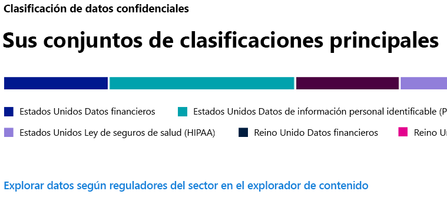
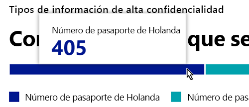
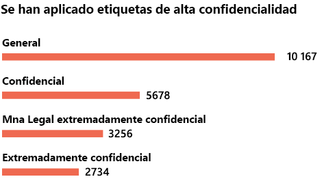
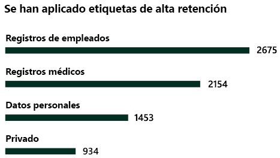

# Información general sobre la clasificación de datos (vista previa)Data classification overview (preview)

Como administrador de Microsoft 365 o administrador de cumplimiento, puede evaluar y etiquetar el contenido de la organización para controlar el lugar al que se dirige, protegerla sea cual sea su ubicación y garantizar que se conserve y elimine en función de las necesidades de la organización.As a Microsoft 365 administrator or compliance administrator, you can evaluate and then tag content in your organization in order to control where it goes, protect it no matter where it is and to ensure that it is preserved and deleted according your your organizations needs. Para ello, puede aplicar [etiquetas de confidencialidad](sensitivity-labels.md) y [etiquetas de retención](labels.md) y clasificar la información según el tipo de confidencialidad.You do this through the application of [sensitivity labels](sensitivity-labels.md), [retention labels](labels.md), and sensitive information type classification. Hay varias formas de llevar a cabo la detección, la evaluación y el etiquetado, pero es posible que el resultado final sea un gran número de documentos y mensajes de correo electrónico marcados y clasificados con una o ambas etiquetas.There are various ways to do the discovery, evaluation and tagging, but the end result is that you may have very large numbers of documents and emails that are tagged and classified with one or both of these labels. Después de aplicar las etiquetas de retención y de confidencialidad, le interesará ver cómo se utilizan las etiquetas en el espacio empresarial y qué se hace con esos elementos.After you apply  your retention labels and sensitivity labels, you’ll want to see how the labels are being used across your tenant and what is being done with those items. La página de clasificación de datos ofrece información sobre ese contenido, en particular:The data classification page provides visibility into that body of content, specifically:

- el número de elementos que se han clasificado como tipo de información sensible y cuáles son esas clasificaciones;the number items that have been classified as a sensitive information type and what those classifications are
- las etiquetas principales de confidencialidad aplicadas en Microsoft 365 y Azure Information Protection;the top applied sensitivity labels in both Microsoft 365 and Azure Information Protection
- las etiquetas principales de retención aplicadasthe top applied retention labels
- un resumen de las actividades que los usuarios llevan a cabo con el contenido confidencial;a summary of activities that users are taking on your sensitive content
- las ubicaciones de los datos confidenciales y retenidos.the locations of your sensitive and retained data

Puede encontrar la clasificación de los datos en el **Centro de cumplimiento de Microsoft 365** o en el **Centro de seguridad de Microsoft 365** > **Clasificación** > **Clasificación de datos**.You can find label analytics in the **Microsoft 365 compliance center** or **Microsoft 365 security center** > **Classification** > **Label analytics**.

## Tipos de información confidencial más usados en el contenido.Sensitive information types used most in your content

Microsoft 365 dispone de un gran número de definiciones de tipos de información confidencial, como, por ejemplo, para elementos que contengan números de la seguridad social o números de tarjetas de crédito.Microsoft 365 comes with many definitions of sensitive information types, such as an item containing a social security number or a credit card number. Para obtener más información sobre los tipos de información confidencial, vea [Qué buscan los tipos de información confidencial](what-the-sensitive-information-types-look-for.md).For more information on sensitive information types, see [What the sensitive information types look for](what-the-sensitive-information-types-look-for.md).

En la tarjeta del tipo de información confidencial se muestran los tipos de información confidencial principales que se han encontrado y etiquetado en la organización.The sensitive information type card shows the top sensitive information types that have been found and labeled across your organization.

Para averiguar cuántos elementos hay en una categoría de clasificación determinada, mueva el puntero sobre la barra de la categoría.To find out how many items are in any given classification category, hover over the bar for the category.

> [!NOTE]
> Si la tarjeta muestra el mensaje "No se ha encontrado ningún dato que contenga información confidencial".If the card displays the message "No data found with sensitive information". Significa que no hay ningún elemento de la organización que se haya clasificado como un tipo de información confidencial o que no se ha rastreado ningún elemento.It means that there are no items in your organization that have been classified as being a sensitive information type or no items that have been crawled. Para comenzar a usar las etiquetas, vea:To get started with Windows PowerShell, see these topics:
>- [Etiquetas de confidencialidadSensitivity labels](sensitivity-labels.md)
>- [Etiquetas de retenciónRetention labels](labels.md)
>- [Qué buscan los tipos de información confidencialWhat the sensitive information types look for](what-the-sensitive-information-types-look-for.md)

## Etiquetas principales de confidencialidad que se aplican al contenidoTop sensitivity labels applied to content

Al aplicar una etiqueta de confidencialidad a un elemento a través de Microsoft 365 o de Azure Information Protection (AIP), ocurren dos cosas:When you apply a sensitivity label to an item either through Microsoft 365 or Azure Information Protection (AIP), two things happen:

- se incrusta en el documento una etiqueta que indica el valor que tiene el elemento para la organización y que acompañará al documento a cualquier lugar al que vaya;a tag that indicates the value of the item to your org is embedded in the document and will follow it everywhere it goes
- la presencia de la etiqueta habilita varios comportamientos de protección, como, por ejemplo, la marca de agua o el cifrado obligatorios.the presence of the tag enables various protective behaviors, such as mandatory watermarking or encryption. Con la protección del punto de conexión habilitada, podrá incluso evitar que un elemento abandone el control de la organización.With end point protection enabled you can even prevent an item from leaving your organizational control.

Para obtener más información sobre las etiquetas de confidencialidad, vea [Información general de etiquetas de retención](sensitivity-labels.md).For more information, see [Overview of sensitivity labels](sensitivity-labels.md).

La tarjeta de la etiqueta de confidencialidad muestra el número de elementos (correo electrónico o documento) por nivel de confidencialidad.The sensitivity label card shows the number of items (email or document) by sensitivity level.

> [!NOTE]
> Si no ha creado ni publicado ninguna etiqueta de confidencialidad o si el contenido no tiene ninguna etiqueta de confidencialidad aplicada, esta tarjeta mostrará el mensaje "No se ha detectado ninguna etiqueta de confidencialidad".If you haven't created or published any sensitivity labels or no content has had a sensitivity label applied, this card will display the message "No sensitivity labels detected". Para comenzar a usar las etiquetas, vea:To get started with Windows PowerShell, see these topics:
>- [etiquetas de confidencialidad](sensitivity-labels.md) o, para AIP, [Configuración de la directiva de Azure Information Protection](https://docs.microsoft.com/azure/information-protection/configure-policy)[sensitivity labels](sensitivity-labels.md) or for AIP [Configure the Azure information protection policy](https://docs.microsoft.com/azure/information-protection/configure-policy)

## Etiquetas principales de retención que se aplican al contenidoTop retention labels applied to content

Las etiquetas de retención se usan para administrar la eliminación de contenido en la organización.Retention labels are used to manage the disposition of content in your organization. Cuando se aplican, pueden usarse para controlar cuánto tiempo se conservará un documento antes de eliminarlo una vez que expire el período de retención, independientemente de si debe revisarse antes de eliminarlo, o si debe marcarse como un registro que no puede eliminarse nunca.When applied, they can be used to control how long a document will be kept before deletion, whether it should be reviewed prior to deletion, when it's retention period expires, or whether it should be marked as a record which can never be deleted. Para obtener más información, vea [Introducción a las etiquetas de retención](labels.md).For more information about labels, see [Overview of retention labels](labels.md).

La tarjeta de etiquetas principales de retención aplicadas muestra el número de elementos que tienen una etiqueta de retención determinada.The top applied retention labels card shows you how many items have a given retention label.

> [!NOTE]
> Si esta tarjeta muestra el mensaje "No se ha detectado ninguna etiqueta de retención", significa que no se ha creado ni publicado ninguna etiqueta de retención o que no hay ningún contenido con una etiqueta de retención aplicada.If this card displays the message, "No retention labels detected, it means you haven't created or published any retention  labels or no content has had a retention label applied. Para comenzar a usar las etiquetas de retención, vea:To get started with retention labels, see:
>- [Introducción a las etiquetas de retenciónOverview of retention labels](labels.md)

## Actividades principales detectadasTop activities detected

Esta tarjeta ofrece un breve resumen de las acciones más comunes que llevan a cabo los usuarios con los elementos etiquetados como confidenciales.This card provides a quick summary of the most common actions that users are taking on the sensitivity labeled items. Puede usar el [Explorador de actividad](data-classification-activity-explorer.md) para ver los detalles de las ocho diferentes actividades de las que Microsoft 365 realiza el seguimiento en el contenido etiquetado y en el contenido que se encuentra en los puntos de conexión de Windows 10.You can use the [Activity explorer](data-classification-activity-explorer.md) to drill deep down on eight different activities that Microsoft 365 tracks on labeled content and content that is located on Windows 10 endpoints.

> [!NOTE]
> Si esta tarjeta muestra el mensaje "No se ha detectado ninguna actividad", significa que no ha habido ninguna actividad en los archivos o que no está activada la auditoría de usuarios y administradores.If this card displays the message, "No activity detected" it means that there's been no activity on the files or that user and admin auditing isn't turned on. Para activar los registros de auditoría, vea:To turn the audit logs on , see:
>- [Buscar el registro de auditoría en el Centro de seguridad y cumplimientoSearch the audit log in security & compliance center](search-the-audit-log-in-security-and-compliance.md)

## Datos con etiquetas de confidencialidad y retención por ubicaciónSensitivity and retention labeled data by location

El informe de la clasificación de datos tiene la finalidad de ofrecer información sobre el número de elementos etiquetados y su ubicación.The point of the data classification reporting is to provide visibility into the number of items that have which label as well as their location. Estas tarjetas le permiten saber cuántos elementos etiquetados hay en Exchange, SharePoint y OneDrive, entre otros.These cards let you know how many labeled items the are in Exchange, SharePoint, and OneDrive etc.

> [!NOTE]
> Si esta tarjeta muestra el mensaje "No se ha detectado ninguna ubicación", significa que no se ha creado ni publicado ninguna etiqueta de confidencialidad o que no hay ningún contenido con una etiqueta de retención aplicada.If this card displays the message, "No locations detected, it means you haven't created or published any sensitivity labels or no content has had a retention label applied. Para empezar a usar las etiquetas de confidencialidad, vea:To get started with sensitivity labels, see:
>- [Etiquetas de confidencialidadSensitivity labels](sensitivity-labels.md)

## Vea tambiénSee also

- [Ver actividad de la etiqueta (vista previa)View label activity (preview)](data-classification-activity-explorer.md)
- [Ver contenido etiquetado (vista previa)View labeled content (preview)](data-classification-content-explorer.md)
- [Etiquetas de confidencialidadSensitivity labels](sensitivity-labels.md)
- [Etiquetas de retenciónRetention labels](labels.md)
- [Qué buscan los tipos de información confidencialWhat the sensitive information types look for](what-the-sensitive-information-types-look-for.md)
- [Información general sobre las directivas de retenciónOverview of retention policies](retention-policies.md)
