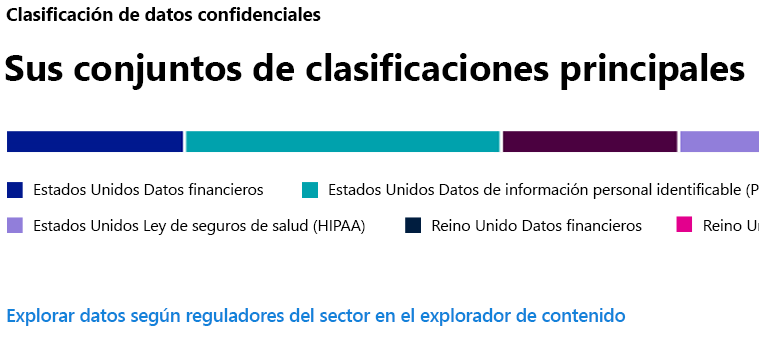
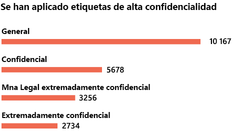
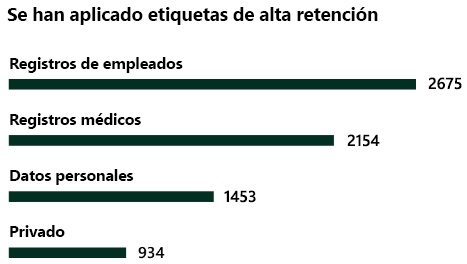

# Información general sobre la clasificación de datos (vista previa)

Como administrador de Microsoft 365 o administrador de cumplimiento, puede evaluar y etiquetar el contenido de la organización para controlar el lugar al que se dirige, protegerla sea cual sea su ubicación y garantizar que se conserve y elimine en función de las necesidades de la organización. Para ello, puede aplicar [etiquetas de confidencialidad](sensitivity-labels.md) y [etiquetas de retención](labels.md) y clasificar la información según el tipo de confidencialidad. Hay varias formas de llevar a cabo la detección, la evaluación y el etiquetado, pero es posible que el resultado final sea un gran número de documentos y mensajes de correo electrónico marcados y clasificados con una o ambas etiquetas. Después de aplicar las etiquetas de retención y de confidencialidad, le interesará ver cómo se utilizan las etiquetas en el espacio empresarial y qué se hace con esos elementos. La página de clasificación de datos ofrece información sobre ese contenido, en particular:

- el número de elementos que se han clasificado como tipo de información sensible y cuáles son esas clasificaciones;
- las etiquetas principales de confidencialidad aplicadas en Microsoft 365 y Azure Information Protection;
- las etiquetas principales de retención aplicadas
- un resumen de las actividades que los usuarios llevan a cabo con el contenido confidencial;
- las ubicaciones de los datos confidenciales y retenidos.

Puede encontrar la clasificación de los datos en el **Centro de cumplimiento de Microsoft 365** o en el **Centro de seguridad de Microsoft 365** > **Clasificación** > **Clasificación de datos**.

## Tipos de información confidencial más usados en el contenido.

Microsoft 365 dispone de un gran número de definiciones de tipos de información confidencial, como, por ejemplo, para elementos que contengan números de la seguridad social o números de tarjetas de crédito. Para obtener más información sobre los tipos de información confidencial, vea [Qué buscan los tipos de información confidencial](what-the-sensitive-information-types-look-for.md).

En la tarjeta del tipo de información confidencial se muestran los tipos de información confidencial principales que se han encontrado y etiquetado en la organización.

Para averiguar cuántos elementos hay en una categoría de clasificación determinada, mueva el puntero sobre la barra de la categoría.

> [!NOTE]
> Si la tarjeta muestra el mensaje "No se ha encontrado ningún dato que contenga información confidencial". Significa que no hay ningún elemento de la organización que se haya clasificado como un tipo de información confidencial o que no se ha rastreado ningún elemento. Para comenzar a usar las etiquetas, vea:
>- [Etiquetas de confidencialidad](sensitivity-labels.md)
>- [Etiquetas de retención](labels.md)
>- [Qué buscan los tipos de información confidencial](what-the-sensitive-information-types-look-for.md)

## Etiquetas principales de confidencialidad que se aplican al contenido

Al aplicar una etiqueta de confidencialidad a un elemento a través de Microsoft 365 o de Azure Information Protection (AIP), ocurren dos cosas:

- se incrusta en el documento una etiqueta que indica el valor que tiene el elemento para la organización y que acompañará al documento a cualquier lugar al que vaya;
- la presencia de la etiqueta habilita varios comportamientos de protección, como, por ejemplo, la marca de agua o el cifrado obligatorios. Con la protección del punto de conexión habilitada, podrá incluso evitar que un elemento abandone el control de la organización.

Para obtener más información sobre las etiquetas de confidencialidad, vea: [Información general de etiquetas de confidencialidad](sensitivity-labels.md).

Las etiquetas de confidencialidad deben habilitarse para los archivos de SharePoint y OneDrive para que los datos correspondientes aparezcan en la página de clasificación de datos. Para más información, vea[ habilitar etiquetas de confidencialidad para los archivos de Office en SharePoint y OneDrive (vista previa)](sensitivity-labels-sharepoint-onedrive-files.md)

La tarjeta de la etiqueta de confidencialidad muestra el número de elementos (correo electrónico o documento) por nivel de confidencialidad.

> [!NOTE]
> Si no ha creado ni publicado ninguna etiqueta de confidencialidad o si el contenido no tiene ninguna etiqueta de confidencialidad aplicada, esta tarjeta mostrará el mensaje "No se ha detectado ninguna etiqueta de confidencialidad". Para comenzar a usar las etiquetas, vea:
>- [etiquetas de confidencialidad](sensitivity-labels.md) o, para AIP, [Configuración de la directiva de Azure Information Protection](https://docs.microsoft.com/azure/information-protection/configure-policy)

## Etiquetas principales de retención que se aplican al contenido

Las etiquetas de retención se usan para administrar la eliminación de contenido en la organización. Cuando se aplican, pueden usarse para controlar cuánto tiempo se conservará un documento antes de eliminarlo una vez que expire el período de retención, independientemente de si debe revisarse antes de eliminarlo, o si debe marcarse como un registro que no puede eliminarse nunca. Para obtener más información, vea [Introducción a las etiquetas de retención](labels.md).

La tarjeta de etiquetas principales de retención aplicadas muestra el número de elementos que tienen una etiqueta de retención determinada.

> [!NOTE]
> Si esta tarjeta muestra el mensaje "No se ha detectado ninguna etiqueta de retención", significa que no se ha creado ni publicado ninguna etiqueta de retención o que no hay ningún contenido con una etiqueta de retención aplicada. Para comenzar a usar las etiquetas de retención, vea:
>- [Introducción a las etiquetas de retención](labels.md)

## Actividades principales detectadas

Esta tarjeta ofrece un breve resumen de las acciones más comunes que llevan a cabo los usuarios con los elementos etiquetados como confidenciales. Puede usar el [Explorador de actividad](data-classification-activity-explorer.md) para ver los detalles de las ocho diferentes actividades de las que Microsoft 365 realiza el seguimiento en el contenido etiquetado y en el contenido que se encuentra en los puntos de conexión de Windows 10.

> [!NOTE]
> Si esta tarjeta muestra el mensaje "No se ha detectado ninguna actividad", significa que no ha habido ninguna actividad en los archivos o que no está activada la auditoría de usuarios y administradores. Para activar los registros de auditoría, vea:
>- [Buscar el registro de auditoría en el Centro de seguridad y cumplimiento](search-the-audit-log-in-security-and-compliance.md)

## Datos con etiquetas de confidencialidad y retención por ubicación

El informe de la clasificación de datos tiene la finalidad de ofrecer información sobre el número de elementos etiquetados y su ubicación. Estas tarjetas le permiten saber cuántos elementos etiquetados hay en Exchange, SharePoint y OneDrive, entre otros.

> [!NOTE]
> Si esta tarjeta muestra el mensaje "No se ha detectado ninguna ubicación", significa que no se ha creado ni publicado ninguna etiqueta de confidencialidad o que no hay ningún contenido con una etiqueta de retención aplicada. Para empezar a usar las etiquetas de confidencialidad, vea:
>- [Etiquetas de confidencialidad](sensitivity-labels.md)

## Vea también

- [Ver actividad de la etiqueta (vista previa)](data-classification-activity-explorer.md)
- [Ver contenido etiquetado (vista previa)](data-classification-content-explorer.md)
- [Etiquetas de confidencialidad](sensitivity-labels.md)
- [Etiquetas de retención](labels.md)
- [Qué buscan los tipos de información confidencial](what-the-sensitive-information-types-look-for.md)
- [Información general sobre las directivas de retención](retention-policies.md)
