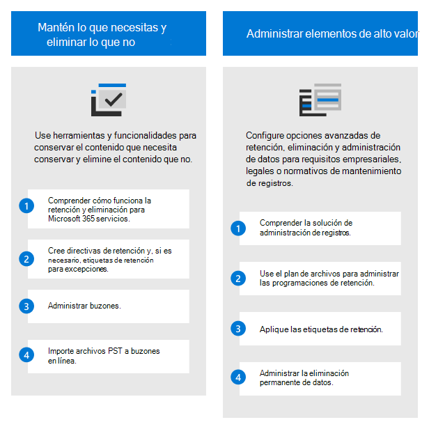
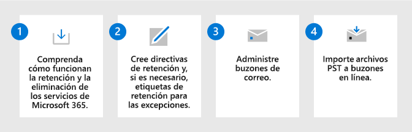
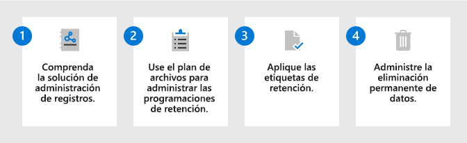

# Implementación de una solución de gobierno de datos con Microsoft Purview

>*[Instrucciones de licencias de Microsoft 365 para la seguridad y el cumplimiento](/office365/servicedescriptions/microsoft-365-service-descriptions/microsoft-365-tenantlevel-services-licensing-guidance/microsoft-365-security-compliance-licensing-guidance).*

Use la **Administración del ciclo de vida de los datos de Microsoft Purview** (anteriormente, Gobernanza de información de Microsoft) y la **Administración de registros de Microsoft Purview** para controlar los datos de Microsoft 365 según los requisitos normativos o de cumplimiento.

Para la gobernanza de datos que asigna y administra datos en todo el patrimonio de datos, incluidas varias nubes y software como servicio (SaaS), use el [Mapa de datos de Microsoft Purview, el Catálogo de datos de Microsoft Purview y las Conclusiones del estado de los datos de Microsoft Purview](/azure/purview/overview).

Para obtener una solución de protección de datos, consulte [Implementar una solución de protección de la información con Microsoft Purview](information-protection-solution.md).

## Licencias

Para saber cuáles son los requisitos y opciones de licencia, consulte la información de la guía de Microsoft 365 de seguridad y cumplimiento, en la sección [Administración del ciclo de vida de datos de Microsoft Purview y Administración de registros de Microsoft Purview](/office365/servicedescriptions/microsoft-365-service-descriptions/microsoft-365-tenantlevel-services-licensing-guidance/microsoft-365-security-compliance-licensing-guidance#microsoft-purview-data-lifecycle-management--microsoft-purview-records-management), para conocer los requisitos de licencia de nivel de característica.

## Conserve lo que necesita y elimine lo que no

Use la **Administración del ciclo de vida de los datos de Microsoft Purview** (anteriormente, Gobernanza de información de Microsoft) para conservar lo que necesita y eliminar lo que no necesita.

|Paso|Descripción|Más información|
|:---|:----------|:---------------|
|1 | Comprenda cómo funcionan la retención y la eliminación de los servicios de Microsoft 365.    Después de comprender cómo puede usar las directivas de retención y las etiquetas de retención, identifique las cargas de trabajo que necesitan una directiva de retención y si necesita crear etiquetas de retención para las excepciones. | [Información sobre las directivas de retención y las etiquetas de retención](retention.md)|
|2| Cree directivas de retención y, si es necesario, etiquetas de retención para las excepciones.    Las directivas de retención más usadas son para Exchange, SharePoint, Teams, Grupos de Microsoft 365 y Yammer. Puede configurar las excepciones para documentos y correos electrónicos. | [Crear directivas de retención](create-retention-policies.md) 
 [Crear y aplicar etiquetas de retención para las excepciones](create-retention-labels-information-governance.md)|
|3 | Administre buzones de correo.    Habilite los buzones para archivar y expandir automáticamente el archivado, tenga en cuenta si necesita personalizar cuándo se mueven los correos electrónicos al buzón de archivo y deje los buzones inactivos cuando los usuarios abandonan la organización.| [Habilitar buzones de archivo](enable-archive-mailboxes.md) 
 [Habilitar el archivado de ampliación automática](enable-autoexpanding-archiving.md) 
 [Crear y administrar buzones inactivos](create-and-manage-inactive-mailboxes.md)|
|4| Importe archivos PST a buzones en línea.     Si tiene archivos PST que contienen los datos que desea controlar, puede importarlos mediante la carga en red o el envío de unidades.| [Usar la carga en la red para importar los archivos PST de su organización](use-network-upload-to-import-pst-files.md) 
 [Usar el envío de unidades para importar los archivos PST de su organización](use-drive-shipping-to-import-pst-files-to-office-365.md)|

Para obtener más información sobre las funcionalidades de esta solución, consulte [Obtener más información sobre la administración del ciclo de vida de los datos](information-governance.md).

## Administrar elementos de alto valor

Use la **Administración de registros de Microsoft Purview** para administrar los elementos de gran valor de su organización para requisitos empresariales, legales o de mantenimiento de registros normativos.

|Paso|Descripción|Más información|
|:---|:----------|:---------------|
|1 | Comprenda la solución de administración de registros.    Use etiquetas de retención con opciones de configuración más flexibles y, cuando sea necesario, declare los elementos como registros. | [Más información sobre la administración de registros](records-management.md)|
|2| Use el plan de archivos para administrar las programaciones de retención.    El plan de archivos le permite crear etiquetas de retención de forma interactiva o importarlas en masa, y exportarlas para su análisis. Las etiquetas que se crean con el plan de archivos admiten información administrativa adicional para ayudarle a identificar y realizar un seguimiento de los requisitos normativos o empresariales. | [Usar el plan de archivos para crear y administrar etiquetas de retención](file-plan-manager.md)|
|3 | Aplique las etiquetas de retención.    Las etiquetas de retención se pueden publicar y aplicar de forma manual o automática en aplicaciones, o bien aplicarse automáticamente en función de información confidencial, palabras clave o propiedades que se pueden buscar, clasificadores capacitados o datos adjuntos en la nube. |[Publicar etiquetas de retención y aplicarlas en aplicaciones](create-apply-retention-labels.md) 
 [Aplicar una etiqueta de retención automáticamente al contenido](apply-retention-labels-automatically.md)|
|4| Administre la eliminación permanente de datos.    Conocida como eliminación de datos, puede requerir una revisión manual del contenido antes de que se elimine permanentemente y proporcionar una prueba de eliminación para los registros. |[Administrar la eliminación de contenido](disposition.md)|

> [!TIP]
> Compruebe la lista de [escenarios comunes](get-started-with-records-management.md#common-scenarios) para obtener configuraciones adicionales compatibles con la administración de registros.

Para obtener más información sobre las funcionalidades de esta solución, consulte [Obtener más información sobre la administración de registros](records-management.md).

## Recursos de aprendizaje

Módulos de aprendizaje para consultores y administradores:

- [Introducción a la protección de la información y la administración del ciclo de vida de los datos en Microsoft Purview](/learn/modules/m365-compliance-information-governance)
- [Administrar el ciclo de vida de los datos en Microsoft Purview](/learn/modules/m365-compliance-information-govern-information/)
- [Administrar registros en Microsoft Purview](/learn/modules/m365-compliance-information-manage-records/)

Para obtener documentación que admita a los usuarios cuando se implementan estas soluciones, consulte las secciones de documentación del usuario final para la [administración del ciclo de vida de los datos](get-started-with-information-governance.md#end-user-documentation) y la [administración de registros](get-started-with-records-management.md#end-user-documentation).