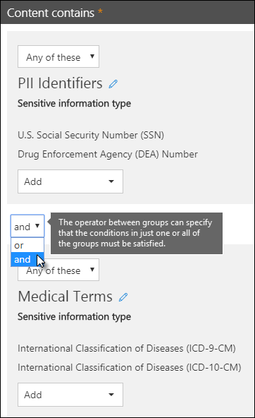
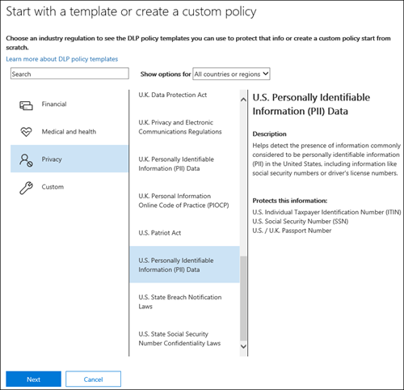
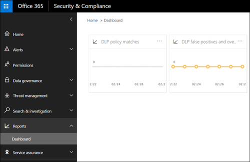

# Información general sobre la prevención de pérdida de datosOverview of data loss prevention
<!-- this topic needs to be split into smaller, more coherent ones. It is confusing as it is. -->
<!-- move this note to a more appropriate place, no topic should start with a note -->
> [!NOTE]
> Las funciones de prevención de pérdida de datos se han agregado recientemente a los mensajes de conversaciones y canales de Microsoft Teams para usuarios con licencia de Cumplimiento avanzado de Office 365, que está disponible como opción independiente y se incluye en Cumplimiento de Microsoft 365 E5 y Office 365 E5.Data loss prevention capabilities were recently added to Microsoft Teams chat and channel messages for users licensed for Office 365 Advanced Compliance, which is available as a standalone option and is included in Office 365 E5 and Microsoft 365 E5 Compliance. Para obtener más información sobre los requisitos de licencias, consulte [Instrucciones de licencias de Microsoft 365 del nivel de espacio empresarial](/office365/servicedescriptions/microsoft-365-service-descriptions/microsoft-365-tenantlevel-services-licensing-guidance).To learn more about licensing requirements, see [Microsoft 365 Tenant-Level Services Licensing Guidance](/office365/servicedescriptions/microsoft-365-service-descriptions/microsoft-365-tenantlevel-services-licensing-guidance).

Para cumplir con los estándares de la empresa y las normativas del sector, las organizaciones deben proteger información confidencial e impedir su divulgación involuntaria.To comply with business standards and industry regulations, organizations must protect sensitive information and prevent its inadvertent disclosure. La información confidencial puede incluir datos financieros o información de identificación personal (PII), tales como números de tarjeta de crédito, números de seguridad social o registros médicos.Sensitive information can include financial data or personally identifiable information (PII) such as credit card numbers, social security numbers, or health records. Con una directiva de prevención de pérdida de datos (DLP) del Centro de seguridad y cumplimiento de Office 365, puede identificar, supervisar y proteger automáticamente información confidencial en todo Office 365.With a data loss prevention (DLP) policy in the Office 365 Security &amp; Compliance Center, you can identify, monitor, and automatically protect sensitive information across Office 365.
  
Con una directiva DLP, puede:With a DLP policy, you can:
  
- **Identificar información confidencial en varias ubicaciones, como Exchange Online, SharePoint Online, OneDrive para la Empresa y Microsoft Teams.****Identify sensitive information across many locations, such as Exchange Online, SharePoint Online, OneDrive for Business, and Microsoft Teams.**
    
    Por ejemplo, puede identificar cualquier documento que contenga un número de tarjeta de crédito y que esté almacenado en un sitio de OneDrive para la Empresa, o puede supervisar solo los sitios de OneDrive de determinadas personas.For example, you can identify any document containing a credit card number that's stored in any OneDrive for Business site, or you can monitor just the OneDrive sites of specific people.
    
- **Evitar el uso compartido accidental de información confidencial**.**Prevent the accidental sharing of sensitive information**. 
    
    Por ejemplo, puede identificar cualquier documento o correo electrónico que contenga un registro médico compartido con personas de fuera de su organización y, a continuación, bloquear automáticamente el acceso a dicho documento o el envío del correo electrónico.For example, you can identify any document or email containing a health record that's shared with people outside your organization, and then automatically block access to that document or block the email from being sent.
    
- **Supervisar y proteger información confidencial en las versiones de escritorio de Excel, PowerPoint y Word.****Monitor and protect sensitive information in the desktop versions of Excel, PowerPoint, and Word.**
    
    Al igual que en Exchange Online, SharePoint Online y OneDrive para la Empresa, estos programas de escritorio de Office incluyen las mismas capacidades para identificar información confidencial y aplicar directivas DLP.Just like in Exchange Online, SharePoint Online, and OneDrive for Business, these Office desktop programs include the same capabilities to identify sensitive information and apply DLP policies. DLP proporciona supervisión continua cuando las personas comparten contenido en estos programas de Office.DLP provides continuous monitoring when people share content in these Office programs.
    
- **Ayudar a los usuarios a aprender a cumplir las directivas sin interrumpir el flujo de trabajo.****Help users learn how to stay compliant without interrupting their workflow.**
    
    Puede educar a sus usuarios acerca de las directivas DLP y ayudar a que sigan manteniendo el cumplimiento normativo sin bloquear su trabajo.You can educate your users about DLP policies and help them remain compliant without blocking their work. Por ejemplo, si un usuario intenta compartir un documento que contiene información confidencial, una directiva DLP puede enviarle una notificación por correo electrónico y mostrarle una sugerencia de directiva en el contexto de la biblioteca de documentos que le permite invalidar la directiva si tiene una justificación comercial.For example, if a user tries to share a document containing sensitive information, a DLP policy can both send them an email notification and show them a policy tip in the context of the document library that allows them to override the policy if they have a business justification. Las mismas sugerencias de directiva también aparecen en Outlook en la Web, Outlook, Excel, PowerPoint y Word.The same policy tips also appear in Outlook on the web, Outlook, Excel, PowerPoint, and Word.
    
- **Ver alertas e informes de DLP con contenido que coincida con las directivas DLP de su organización.****View DLP alerts and reports showing content that matches your organization’s DLP policies.**
    
    Para ver las alertas y los metadatos relacionados con las directivas DLP, puede usar el [Panel de administración de alertas de DLP](dlp-configure-view-alerts-policies.md).To view alerts and metadata related to your DLP policies you can use the [DLP Alerts Management Dashboard](dlp-configure-view-alerts-policies.md). También puede ver los informes de coincidencias de directivas para evaluar cómo su organización cumple con una directiva DLP.You can also view policy match reports to assess how your organization is complying with a DLP policy. Si una directiva DLP permite a los usuarios invalidar una sugerencia de directiva y notificar un falso positivo, también puede ver sobre qué han informado los usuarios.If a DLP policy allows users to override a policy tip and report a false positive, you can also view what users have reported
    
Para crear y administrar las directivas DLP, vaya a la página sobre la prevención de pérdida de datos del Centro de cumplimiento de Microsoft 365.You create and manage DLP policies on the Data loss prevention page in the Microsoft 365 Compliance center.
  

  
## Qué contiene una directiva DLPWhat a DLP policy contains

Una directiva DLP contiene unas pocas cosas básicas:A DLP policy contains a few basic things:
  
- Dónde proteger el contenido: **ubicaciones** como Exchange Online, SharePoint Online y sitios de OneDrive para la Empresa, así como mensajes de chat y canales de Microsoft Teams.Where to protect the content: **locations** such as Exchange Online, SharePoint Online, and OneDrive for Business sites, as well as Microsoft Teams chat and channel messages. 
    
- Cuándo y cómo proteger el contenido aplicando **reglas** compuestas de:When and how to protect the content by enforcing **rules** comprised of: 
    
  - **Condiciones** que el contenido debe cumplir antes de que se aplique la regla.**Conditions** the content must match before the rule is enforced. Por ejemplo, una regla se puede configurar para que busque solo contenido que incluya números de seguridad social y que se haya compartido con personas de fuera de su organización.For example, a rule might be configured to look only for content containing Social Security numbers that's been shared with people outside your organization. 
    
  - **Acciones** que quiere que la regla realice automáticamente cuando se encuentra contenido que coincide con las condiciones.**Actions** that you want the rule to take automatically when content matching the conditions is found. Por ejemplo, una regla se puede configurar para bloquear el acceso a un documento y enviar una notificación por correo electrónico al usuario y al responsable de cumplimiento.For example, a rule might be configured to block access to a document and send both the user and compliance officer an email notification. 
    
Puede usar una regla para satisfacer un requisito de protección específico y después usar una directiva DLP para agrupar los requisitos de protección comunes, como todas las reglas necesarias para cumplir una normativa específica.You can use a rule to meet a specific protection requirement, and then use a DLP policy to group together common protection requirements, such as all of the rules needed to comply with a specific regulation.
  
Por ejemplo, podría tener una directiva DLP que ayude a detectar la presencia de información sujeta a la Ley de transferencia y responsabilidad de seguros de salud (HIPAA).For example, you might have a DLP policy that helps you detect the presence of information subject to the Health Insurance Portability and Accountability Act (HIPAA). Esta directiva DLP podría ayudar a proteger los datos HIPAA (el qué) en todos los sitios de SharePoint Online y OneDrive para la Empresa (el dónde) al buscar cualquier documento que contenga información confidencial y que se comparte con personas de fuera de la organización (las condiciones) y, a continuación, bloquear el acceso al documento y enviar una notificación (las acciones).This DLP policy could help protect HIPAA data (the what) across all SharePoint Online sites and all OneDrive for Business sites (the where) by finding any document containing this sensitive information that's shared with people outside your organization (the conditions) and then blocking access to the document and sending a notification (the actions). Estos requisitos se almacenan como reglas individuales y se agrupan de forma conjunta como directiva DLP para simplificar la administración y la creación de informes.These requirements are stored as individual rules and grouped together as a DLP policy to simplify management and reporting.
  

  
### UbicacionesLocations

Las directivas DLP son aplicados a elementos confidenciales de las ubicaciones de Microsoft 365 y se pueden definir otros límites como se detalla en esta tabla.DLP policies are applied to sensitive items across Microsoft 365 locations and can be further scoped as detailed in this table.

|UbicaciónLocation | Incluir/excluir porInclude/exclude by|
|---------|---------|
|Correo electrónico de ExchangeExchange email| grupos de distribucióndistribution groups|
|Sitios de SharePointSharePoint sites |sitiossites |
|Cuentas de OneDriveOneDrive accounts |cuentasaccounts |
|Mensajes de canales y chats de TeamsTeams chat and channel messages |cuentasaccounts |
|Dispositivos Windows 10Windows 10 devices |usuario o grupouser or group |
|Microsoft Cloud App SecurityMicrosoft Cloud App Security |instanciainstance |

Si elige incluir grupos de distribución que son específicos en Exchange, la directiva de DLP se aplicará solo a los miembros de ese grupo.If you choose to include specific distribution groups in Exchange, the DLP policy will be scoped only to the members of that group. Igualmente, la exclusión de un grupo de distribución excluirá a todos los miembros de dicho grupo de distribución de la evaluación de la directiva.Similarly excluding a distribution group will exclude all the members of that distribution group from policy evaluation. Puede escoger entre definir una directiva para los miembros de las listas de distribución, los grupos de distribución dinámicos y los grupos de seguridad.You can choose to scope a policy to the members of distribution lists, dynamic distribution groups, and security groups. Una directiva DLP no puede contener más de 50 de estas inclusiones y exclusiones.A DLP policy can contain no more than 50 such inclusions and exclusions.

Si elige incluir o excluir sitios de SharePoint, una directiva DLP no podrá contener más de 100 inclusiones y exclusiones.If you choose to include or exclude specific SharePoint sites, a DLP policy can contain no more than 100 such inclusions and exclusions. Aunque este límite exista, puede superarlo si aplica una directiva para toda la organización o aplicada a ubicaciones completas.Although this limit exists, you can exceed this limit by applying either an org-wide policy or a policy that applies to entire locations.

Si decide incluir o excluir grupos o cuentas de OneDrive específicas, una directiva DLP no puede contener más de 100 cuentas de usuario o 50 grupos como inclusión o exclusión.If you choose to include or exclude specific OneDrive accounts or groups, a DLP policy can contain no more than 100 user accounts or 50 groups as inclusion or exclusion.

> [!NOTE]
> El ámbito de la directiva de OneDrive para la Empresa con cuentas o grupos está en versión preliminar pública.OneDrive for business policy scoping using accounts or groups is in public preview. Durante esta fase, puede o bien incluir o bien excluir grupos y cuentas de usuario como parte de una directiva DLP.During this phase, you can either include or exclude user accounts and groups as part of a DLP policy. Sin embargo, no se permite incluir y excluir como parte de la misma directiva.Both inclusion and exclusion as part of the same policy is not supported.
  
### ReglasRules

> [!NOTE]
> Si no hay ninguna alerta configurada, el comportamiento predeterminado de una directiva DLP es no activarse ni alertar.The default behavior of a DLP policy, when there is no alert configured, is not to alert or trigger. Esto solo se aplica a los tipos de información predeterminados.This applies only to default information types. En el caso de los tipos de información personalizados, el sistema alertará aunque no se defina ninguna acción en la directiva.For custom information types, the system will alert even if there is no action defined in the policy.

Las reglas son las que aplican los requisitos empresariales en el contenido de su organización.Rules are what enforce your business requirements on your organization's content. Una directiva contiene una o más reglas, y cada regla consta de las condiciones y acciones.A policy contains one or more rules, and each rule consists of conditions and actions. Para cada regla, cuando se cumplen las condiciones, las acciones se realizan automáticamente.For each rule, when the conditions are met, the actions are taken automatically. Las reglas se ejecutan secuencialmente, comenzando por la regla de mayor prioridad de cada directiva.Rules are executed sequentially, starting with the highest-priority rule in each policy.
  
Una regla también proporciona opciones para notificar a los usuarios (con sugerencias de directiva y notificaciones por correo electrónico) y los administradores (con informes de incidentes por correo electrónico) de que el contenido ha coincidido con la regla.A rule also provides options to notify users (with policy tips and email notifications) and admins (with email incident reports) that content has matched the rule.
  
Estos son los componentes de una regla, explicados detalladamente a continuación.Here are the components of a rule, each explained below.
  

  
#### CondicionesConditions

Las condiciones son importantes porque determinan los tipos de información que está buscando y cuándo se debe realizar una acción.Conditions are important because they determine what types of information you're looking for, and when to take an action. Por ejemplo, puede optar por omitir el contenido que contiene números de pasaporte a menos que el contenido contenga más de 10 de esos números y se comparta con personas fuera de la organización.For example, you might choose to ignore content containing passport numbers unless the content contains more than 10 such numbers and is shared with people outside your organization.
  
Las condiciones se centran en el **contenido**, como el tipo de información confidencial que está buscando, y también en el **contexto**, como con quién se comparte el documento.Conditions focus on the **content**, such as what types of sensitive information you're looking for, and also on the **context**, such as who the document is shared with. Puede usar condiciones para asignar acciones diferentes a distintos niveles de riesgo.You can use conditions to assign different actions to different risk levels. Por ejemplo, el contenido confidencial compartido internamente podría ser de menor riesgo y necesitar menos acciones que el contenido confidencial compartido con personas de fuera de la organización.For example, sensitive content shared internally might be lower risk and require fewer actions than sensitive content shared with people outside the organization. 
  

  
Las condiciones disponibles ahora pueden determinar si:The conditions now available can determine if:
  
- El contenido incluye un tipo de información confidencial.Content contains a type of sensitive information.
    
- El contenido incluye una etiqueta.Content contains a label. Para obtener más información, consulte la sección [Usar una etiqueta de retención como condición en una directiva DLP](#using-a-retention-label-as-a-condition-in-a-dlp-policy).For more information, see the below section [Using a retention label as a condition in a DLP policy](#using-a-retention-label-as-a-condition-in-a-dlp-policy).
    
- El contenido se comparte con personas de fuera o dentro de la organización.Content is shared with people outside or inside your organization.

  > [!NOTE]
  > Los usuarios que tienen cuentas que no son de invitado en el espacio empresarial de Active Directory o de Azure Active Directory de una organización anfitriona se consideran como personas dentro de la organización.Users who have non-guest accounts in a host organization's Active Directory or Azure Active Directory tenant are considered as people inside the organization.
    
#### Tipos de información confidencialTypes of sensitive information

Una directiva DLP puede ayudar a proteger información confidencial, lo que se define como un **tipo de información confidencial**.A DLP policy can help protect sensitive information, which is defined as a **sensitive information type**. Microsoft 365 incluye definiciones para muchos tipos comunes de información confidencial en muchas regiones diferentes que están listas para su uso, como números de tarjeta de crédito, números de cuentas bancarias, números de identificación nacionales y números de pasaporte.Microsoft 365 includes definitions for many common sensitive information types across many different regions that are ready for you to use, such as a credit card number, bank account numbers, national ID numbers, and passport numbers. 
  

  
Cuando una directiva DLP busca un tipo de información confidencial, como un número de tarjeta de crédito, no solamente busca un número de 16 dígitos.When a DLP policy looks for a sensitive information type such as a credit card number, it doesn't simply look for a 16-digit number. Cada tipo de información confidencial se define y se detecta mediante una combinación de:Each sensitive information type is defined and detected by using a combination of:
  
- Palabras clave.Keywords.
    
- Funciones internas para validar las sumas de comprobación o composición.Internal functions to validate checksums or composition.
    
- Evaluación de expresiones regulares para buscar coincidencias de patrón.Evaluation of regular expressions to find pattern matches.
    
- Otros exámenes de contenidoOther content examination.
    
Esto ayuda a que la detección de DLP alcance un alto grado de precisión reduciendo el número de falsos positivos que pueden interrumpir el trabajo de las personas.This helps DLP detection achieve a high degree of accuracy while reducing the number of false positives that can interrupt peoples' work.
  
#### AccionesActions

Cuando el contenido coincide con una condición en una regla, puede aplicar acciones para proteger automáticamente el contenido.When content matches a condition in a rule, you can apply actions to automatically protect the content.
  

  
Con las acciones ahora disponibles, podrá:With the actions now available, you can:
  
- **Restringir el acceso al contenido** en función de sus necesidades. Puede restringir el acceso al contenido de tres formas:**Restrict access to the content** Depending on your need, you can restrict access to content in three ways:

  1. Restringir el acceso al contenido para todos los usuarios.Restrict access to content for everyone.
  2. Restringir el acceso al contenido a personas ajenas a la organización.Restrict access to content for people outside the organization.
  3. Restringir el acceso a "Cualquier persona con el vínculo".Restrict access to "Anyone with the link."

  Para el contenido del sitio, esto significa que los permisos del documento están restringidos para todos los usuarios excepto el administrador de la colección de sitios, el propietario del documento y la persona que lo modificó por última vez.For site content, this means that permissions for the document are restricted for everyone except the primary site collection administrator, document owner, and person who last modified the document. Estas personas pueden eliminar la información confidencial del documento o realizar otras acciones correctivas.These people can remove the sensitive information from the document or take other remedial action. Cuando el documento cumple la normativa, los permisos originales se restauran automáticamente.When the document is in compliance, the original permissions are automatically restored. Cuando se bloquea el acceso a un documento, este aparece con un icono de sugerencia de directiva especial en la biblioteca del sitio.When access to a document is blocked, the document appears with a special policy tip icon in the library on the site. 
    
  
  
  Para el contenido del correo electrónico, esta acción evita que se envíe el mensaje.For email content, this action blocks the message from being sent. Según la configuración de la regla DLP, el remitente ve un NDR o, si la regla usa una notificación, una notificación por correo electrónico y la sugerencia de directiva.Depending on how the DLP rule is configured, the sender sees an NDR or (if the rule uses a notification) a policy tip and/or email notification.
    
  
  
#### Notificaciones de usuario e invalidaciones de usuarioUser notifications and user overrides

Puede utilizar notificaciones de usuario e invalidaciones de usuario para concienciarles sobre las directivas DLP y ayudarles a que sigan manteniendo el cumplimiento normativo sin bloquear su trabajo.You can use notifications and overrides to educate your users about DLP policies and help them remain compliant without blocking their work. Por ejemplo, si un usuario intenta compartir un documento que contiene información confidencial, una directiva DLP puede enviarle una notificación por correo electrónico y mostrarle una sugerencia de directiva en el contexto de la biblioteca de documentos que le permite invalidar la directiva si tiene una justificación comercial.For example, if a user tries to share a document containing sensitive information, a DLP policy can both send them an email notification and show them a policy tip in the context of the document library that allows them to override the policy if they have a business justification.
  

  
El correo electrónico puede notificar a la persona que envió, compartió o modificó el contenido por última vez y, para el contenido del sitio, al administrador de la colección de sitios primaria y al propietario del documento.The email can notify the person who sent, shared, or last modified the content and, for site content, the primary site collection administrator and document owner. Además, puede agregar a cualquier persona a la notificación por correo electrónico o quitarla de ella.In addition, you can add or remove whomever you choose from the email notification.
  
Además de enviar una notificación por correo electrónico, la notificación de usuario muestra una sugerencia de directiva:In addition to sending an email notification, a user notification displays a policy tip:
  
- En Outlook y Outlook en la WebIn Outlook and Outlook on the web.
    
- Para el documento en un sitio de SharePoint Online o OneDrive para la Empresa.For the document on a SharePoint Online or OneDrive for Business site.
    
- En Excel, PowerPoint y Word, cuando el documento está almacenado en un sitio que se incluye en una directiva DLP.In Excel, PowerPoint, and Word, when the document is stored on a site included in a DLP policy.
    
La notificación por correo electrónico y la sugerencia de directiva explican por qué el contenido entra en conflicto con una directiva DLP.The email notification and policy tip explain why content conflicts with a DLP policy. Si lo elige, la sugerencia de directiva y la notificación por correo electrónico pueden permitir que los usuarios invaliden una regla al informar de un falso positivo o proporcionar una justificación comercial.If you choose, the email notification and policy tip can allow users to override a rule by reporting a false positive or providing a business justification. Esto puede ayudar a educar a los usuarios sobre las directivas DLP y aplicarlas sin impedir que los usuarios realicen su trabajo.This can help you educate users about your DLP policies and enforce them without preventing people from doing their work. La información sobre invalidaciones y falsos positivos también se registra para los informes (consulte a continuación sobre los informes de DLP) y se incluye en los informes de incidentes (sección siguiente), a fin de que el responsable de cumplimiento normativo pueda revisar periódicamente esta información.Information about overrides and false positives is also logged for reporting (see below about the DLP reports) and included in the incident reports (next section), so that the compliance officer can regularly review this information.
  
Así es como se muestra una sugerencia de directiva en una cuenta de OneDrive para la Empresa.Here's what a policy tip looks like in a OneDrive for Business account.
  

 Para obtener más información sobre las notificaciones de usuario y las sugerencias de directiva en directivas DLP, Vea [usar las notificaciones y las sugerencias de directiva](use-notifications-and-policy-tips.md).To learn more about user notifications and policy tips in DLP policies, see [Use notifications and policy tips](use-notifications-and-policy-tips.md).

#### Alertas e informes de incidentesAlerts and Incident reports

Cuando una regla coincide, puede enviar un correo de alerta a su responsable de cumplimento normativo (o a la persona que elija) con los detalles de la alerta.When a rule is matched, you can send an alert email to your compliance officer ( or any person(s) you choose) with details of the alert. Este correo electrónico de alerta contendrá un vínculo del [Panel de administración de alertas DLP](dlp-configure-view-alerts-policies.md) el que el funcionario encargado de la conformidad pueda ir para ver los detalles de los eventos y las alertas.This alert email will carry a link of the [DLP Alerts Management Dashboard](dlp-configure-view-alerts-policies.md) which the compliance officer can go to view the details of alert and events. El panel contiene detalles del evento que activó la alerta, junto con detalles de la Directiva DLP que coincide y el contenido confidencial detectado.The dashboard contains details of the event that triggered the alert along with details of the DLP policy matched and the sensitive content detected.

Además, también puede enviar un informe de incidentes con detalles sobre el evento.In addition, you can also send an incident report with details of the event. Este informe incluye información sobre el elemento que ha coincidido, el contenido que ha coincidido con la regla y el nombre de la persona que ha modificado el contenido por última vez.This report includes information about the item that was matched, the actual content that matched the rule, and the name of the person who last modified the content. Para los mensajes de correo electrónico, el informe también incluye el mensaje original que coincide con una directiva DLP como datos adjuntos.For email messages, the report also includes as an attachment the original message that matches a DLP policy.

> [!div class="mx-imgBorder"]
> 

DLP analiza el correo electrónico de forma diferente desde elementos en SharePoint Online o en OneDrive para la Empresa.DLP scans email differently from items in SharePoint Online or OneDrive for Business. En SharePoint Online y OneDrive para la Empresa, DLP analiza los elementos existentes, así como los nuevos, y genera un informe de incidentes y una alerta cada vez que se encuentra una coincidencia.In SharePoint Online and OneDrive for Business, DLP scans existing items as well as new ones and generates an alert and incident report whenever a match is found. En Exchange Online, DLP solo analiza los nuevos mensajes de correo electrónico y genera un informe si hay una coincidencia de directiva.In Exchange Online, DLP only scans new email messages and generates a report if there is a policy match. DLP ***no*** analiza ni busca coincidencias en elementos de correo electrónico anteriormente existentes que estén almacenados en un buzón de correo o archivo.DLP ***does not*** scan or match previously existing email items that are stored in a mailbox or archive.
  
## Operadores lógicos y de agrupaciónGrouping and logical operators

A menudo, la directiva DLP tiene un requisito sencillo, como, por ejemplo, identificar todo el contenido que incluya un número de la seguridad social de Estados Unidos.Often your DLP policy has a straightforward requirement, such as to identify all content that contains a U.S. Social Security Number. Sin embargo, en otros escenarios, la directiva DLP podría necesitar identificar datos definidos de forma más flexible.However, in other scenarios, your DLP policy might need to identify more loosely defined data.
  
Por ejemplo, para identificar el contenido sujeto a la Ley de seguros de salud (HIPAA) de Estados Unidos, debe buscar:For example, to identify content subject to the U.S. Health Insurance Act (HIPAA), you need to look for:
  
- Contenido que incluye tipos concretos de información confidencial, como un Número de la Seguridad social o un Número de la Agencia antidroga (DEA) de Estados Unidos.Content that contains specific types of sensitive information, such as a U.S. Social Security Number or Drug Enforcement Agency (DEA) Number.
    
    YAND
    
- Contenido que es más difícil identificar, como las comunicaciones sobre la atención a un paciente o las descripciones de los servicios médicos proporcionados.Content that's more difficult to identify, such as communications about a patient's care or descriptions of medical services provided. La identificación de este tipo de contenido requiere que coincida con las palabras clave de una lista muy grande, como la Clasificación internacional de enfermedades (ICD-9-CM o ICD-10-CM).Identifying this content requires matching keywords from very large keyword lists, such as the International Classification of Diseases (ICD-9-CM or ICD-10-CM).
    
Puede identificar fácilmente estos datos definidos de manera imprecisa mediante el uso de operadores lógicos y de agrupación (Y, O).You can easily identify such loosely defined data by using grouping and logical operators (AND, OR). Al crear una directiva DLP, se puede:When you create a DLP policy, you can:
  
- Agrupar tipos de información confidencialGroup sensitive information types.
    
- Elegir el operador lógico entre los tipos de información confidencial dentro de un grupo y entre los propios gruposChoose the logical operator between the sensitive information types within a group and between the groups themselves.
    
### Elegir el operador dentro de un grupoChoosing the operator within a group

Dentro de un grupo, puede elegir si se deben cumplir algunas o todas las condiciones de ese grupo para que el contenido coincida con la regla.Within a group, you can choose whether any or all of the conditions in that group must be satisfied for the content to match the rule.
  

  
### Adición de un grupoAdding a group

Puede agregar rápidamente un grupo, que puede tener sus propias condiciones y operador dentro de ese grupo.You can quickly add a group, which can have its own conditions and operator within that group.
  

  
### Elección del operador entre gruposChoosing the operator between groups

Entre los grupos, puede elegir si se deben cumplir las condiciones de un solo grupo o de todos los grupos para que el contenido coincida con la regla.Between groups, you can choose whether the conditions in just one group or all of the groups must be satisfied for the content to match the rule.
  
Por ejemplo, la directiva **HIPAA de Estados Unidos** tiene una regla que usa un operador **Y** entre los grupos para identificar el contenido que incluya lo siguiente:For example, the built-in **U.S. HIPAA** policy has a rule that uses an **AND** operator between the groups so that it identifies content that contains: 
  
- del grupo **Identificadores PII** (por lo menos un número de SSN **O** número DEA)from the group **PII Identifiers** (at least one SSN number **OR** DEA number) 
    
    **Y****AND**
    
- del grupo **Términos médicos** (por lo menos una palabra clave ICD-9-CM **O** ICD-10-CM)from the group **Medical Terms** (at least one ICD-9-CM keyword **OR** ICD-10-CM keyword) 
    

  
## Prioridad por la que se procesan las reglasThe priority by which rules are processed

Al crear reglas en una directiva, a cada regla se le asigna una prioridad en el orden en que se crea (es decir, la regla creada en primer lugar tiene la máxima prioridad, la regla creada en segundo lugar tiene una prioridad secundaria, etc.).When you create rules in a policy, each rule is assigned a priority in the order in which it's created — meaning, the rule created first has first priority, the rule created second has second priority, and so on.

> [!div class="mx-imgBorder"]
> 
  
Una vez que haya configurado más de una directiva DLP, puede cambiar la prioridad de una o más directivas.After you have set up more than one DLP policy, you can change the priority of one or more policies. Para hacerlo, seleccione una directiva, elija **Editar directiva** y use la lista de **Prioridad** para especificar la prioridad.To do that, select a policy, choose **Edit policy**, and use the **Priority** list to specify its priority.

> [!div class="mx-imgBorder"]
> 

Cuando se evalúa el contenido frente a reglas, estas se procesan en orden de prioridad.When content is evaluated against rules, the rules are processed in priority order. Si el contenido coincide con varias reglas, estas se procesan en orden de prioridad y se aplica la acción más restrictiva.If content matches multiple rules, the rules are processed in priority order and the most restrictive action is enforced. Por ejemplo, si el contenido coincide con todas las reglas siguientes, se aplica la Regla 3 porque es la regla más restrictiva y con mayor prioridad:For example, if content matches all of the following rules, Rule 3 is enforced because it's the highest priority, most restrictive rule:
  
- Regla 1: solo notifica a los usuariosRule 1: only notifies users
    
- Regla 2: notifica a los usuarios, restringe el acceso y permite invalidaciones de usuarioRule 2: notifies users, restricts access, and allows user overrides
    
- Regla 3: notifica a los usuarios, restringe el acceso y no permite invalidaciones de usuarioRule 3: notifies users, restricts access, and does not allow user overrides
    
- Regla 4: solo notifica a los usuariosRule 4: only notifies users
    
- Regla 5: restringe el accesoRule 5: restricts access
    
- Regla 6: notifica a los usuarios, restringe el acceso y no permite invalidaciones de usuarioRule 6: notifies users, restricts access, and does not allow user overrides
    
En este ejemplo, tenga en cuenta que las coincidencias de todas las reglas se graban en los registros de auditoría y se muestran en los informes DLP, aunque se aplique solo la regla más restrictiva.In this example, note that matches for all of the rules are recorded in the audit logs and shown in the DLP reports, even though only the most restrictive rule is enforced.
  
En relación con las sugerencias de directiva, tenga en cuenta lo siguiente:Regarding policy tips, note that:
  
- Solo se mostrará la sugerencia de directiva de la regla más restrictiva y con mayor prioridad.Only the policy tip from the highest priority, most restrictive rule will be shown. Por ejemplo, una sugerencia de directiva de una regla que bloquea el acceso al contenido se mostrará por encima de una sugerencia de directiva de una regla que simplemente envía una notificación.For example, a policy tip from a rule that blocks access to content will be shown over a policy tip from a rule that simply sends a notification. Esto impide que las personas vean una cascada de sugerencias de directiva.This prevents people from seeing a cascade of policy tips.
    
- Si las sugerencias de directiva en la regla más restrictiva permite que los usuarios invaliden la regla, la invalidación de esta regla invalida también otras reglas que coinciden con el contenido.If the policy tips in the most restrictive rule allow people to override the rule, then overriding this rule also overrides any other rules that the content matched.
    
## Ajustar reglas para que sea más fácil o más difícil que coincidanTuning rules to make them easier or harder to match

Después de crear y activar sus directivas DLP, a veces los usuarios se encuentran con estos problemas:After people create and turn on their DLP policies, they sometimes run into these issues:
  
- Demasiado contenido que **no es** información confidencial coincide con las reglas (es decir, demasiados falsos positivos).Too much content that **is not** sensitive information matches the rules — in other words, too many false positives. 
    
- Muy poco contenido que **es** información confidencial coincide con las reglas.Too little content that **is** sensitive information matches the rules. Es decir, las acciones de protección no se están aplicando en la información confidencial.In other words, the protective actions aren't being enforced on the sensitive information. 
    
Para solucionar estos problemas, puede ajustar las reglas al modificar el recuento de instancias y la precisión de coincidencia para que sea más fácil o más difícil que el contenido coincida con las reglas.To address these issues, you can tune your rules by adjusting the instance count and match accuracy to make it harder or easier for content to match the rules. Todos los tipos de información confidencial que se usan en una regla tienen un recuento de instancias y precisión de coincidencia.Each sensitive information type used in a rule has both an instance count and match accuracy.
  
### Recuento de instanciasInstance count

El recuento de instancias significa simplemente qué número de apariciones de un determinado tipo de información confidencial debe estar presente en el contenido para que coincida con la regla.Instance count means simply how many occurrences of a specific type of sensitive information must be present for content to match the rule. Por ejemplo, el contenido coincide con la regla que se muestra a continuación si se identifican entre 1 y 9 números únicos de pasaporteFor example, content matches the rule shown below if between 1 and 9 unique U.S. or U.K. de los Estados Unidos o Reino Unido.passport numbers are identified.

> [!NOTE]
> El número de instancias incluye solo coincidencias **únicas** con palabras clave y tipos de información confidenciales.The instance count includes only **unique** matches for sensitive information types and keywords. Por ejemplo, si un correo electrónico contiene diez veces el mismo número de tarjeta de crédito, esas diez cuentan como una única instancia de un número de tarjeta de crédito.For example, if an email contains 10 occurrences of the same credit card number, those 10 occurrences count as a single instance of a credit card number.
  
Las instrucciones para usar el recuento de instancias para ajustar las reglas son sencillas:To use instance count to tune rules, the guidance is straightforward:
  
- Para facilitar que la regla coincida, disminuya el recuento **mín** o aumente el recuento **máx**.To make the rule easier to match, decrease the **min** count and/or increase the **max** count. También puede establecer **máx** en **cualquiera** si elimina el valor numérico.You can also set **max** to **any** by deleting the numerical value. 
    
- Para que sea más difícil que la regla coincida, aumente el recuento **mín**.To make the rule harder to match, increase the **min** count. 
    
Normalmente, se usan acciones menos restrictivas, como el envío de notificaciones de usuario, en una regla con un recuento de instancias inferior (por ejemplo, 1-9).Typically, you use less restrictive actions, such as sending user notifications, in a rule with a lower instance count (for example, 1-9). Y se usan acciones más restrictivas, como restringir el acceso al contenido sin permitir invalidaciones de usuario, en una regla con un recuento de instancias superior (por ejemplo, de 10 a cualquiera).And you use more restrictive actions, such as restricting access to content without allowing user overrides, in a rule with a higher instance count (for example, 10-any).
  

  
### Precisión de coincidenciaMatch accuracy

Como se describió anteriormente, un tipo de información confidencial se define y detecta mediante una combinación de distintos tipos de evidencia.As described above, a sensitive information type is defined and detected by using a combination of different types of evidence. Frecuentemente, un tipo de información confidencial se define mediante esas combinaciones, denominadas patrones.Commonly, a sensitive information type is defined by multiple such combinations, called patterns. Un patrón que requiere menos evidencia tiene una precisión de coincidencia (o nivel de confianza) inferior, mientras que un patrón que requiere más evidencia tiene una precisión de coincidencia (o nivel de confianza) mayor.A pattern that requires less evidence has a lower match accuracy (or confidence level), while a pattern that requires more evidence has a higher match accuracy (or confidence level). Para obtener más información sobre los patrones y niveles de confianza reales que usa cada tipo de información confidencial, consulte [Definiciones de entidad de tipos de información confidencial](sensitive-information-type-entity-definitions.md).To learn more about the actual patterns and confidence levels used by every sensitive information type, see [Sensitive information type entity definitions](sensitive-information-type-entity-definitions.md).
  
Por ejemplo, el tipo de información confidencial denominado Número de tarjeta de crédito se define mediante dos patrones:For example, the sensitive information type named Credit Card Number is defined by two patterns:
  
- Un patrón con un 65 % de confianza que requiere:A pattern with 65% confidence that requires:
    
  - Un número en el formato de un número de tarjeta de crédito.A number in the format of a credit card number.
    
  - Un número que pasa la suma de comprobación.A number that passes the checksum.
    
- Un patrón con un 85 % de confianza que requiere:A pattern with 85% confidence that requires:
    
  - Un número en el formato de un número de tarjeta de crédito.A number in the format of a credit card number.
    
  - Un número que pasa la suma de comprobación.A number that passes the checksum.
    
  - Una palabra clave o una fecha de expiración en el formato correcto.A keyword or an expiration date in the right format.
    
Puede usar estos niveles de confianza (o precisión de coincidencia) en sus reglas.You can use these confidence levels (or match accuracy) in your rules. Normalmente, se usan acciones menos restrictivas, como el envío de notificaciones de usuario, en una regla con una precisión de coincidencia inferior.Typically, you use less restrictive actions, such as sending user notifications, in a rule with lower match accuracy. Y se usan acciones más restrictivas, como restringir el acceso al contenido sin permitir invalidaciones de usuario, en una regla con una precisión de coincidencia superior.And you use more restrictive actions, such as restricting access to content without allowing user overrides, in a rule with higher match accuracy.
  
Es importante comprender que, cuando se identifica en el contenido un tipo específico de información confidencial (como un número de tarjeta de crédito), se devuelve solo un único nivel de confianza:It's important to understand that when a specific type of sensitive information, such as a credit card number, is identified in content, only a single confidence level is returned:
  
- Si todas las coincidencias son para un único patrón, se devuelve el nivel de confianza de ese patrón.If all of the matches are for a single pattern, the confidence level for that pattern is returned.
    
- Si hay coincidencias para más de un patrón (es decir, hay coincidencias con dos niveles de confianza diferentes), se devuelve un nivel de confianza superior a cualquiera de los patrones únicos independientes.If there are matches for more than one pattern (that is, there are matches with two different confidence levels), a confidence level higher than any of the single patterns alone is returned. Esta es la parte complicada.This is the tricky part. Por ejemplo, para una tarjeta de crédito, si se cumplen los patrones del 65 % y del 85 %, el nivel de confianza que devuelve ese tipo de información confidencial es mayor al 90 % porque más evidencia implica más confianza.For example, for a credit card, if both the 65% and 85% patterns are matched, the confidence level returned for that sensitive information type is greater than 90% because more evidence means more confidence.
    
Por lo tanto, si quiere crear dos reglas que se excluyan mutuamente para tarjetas de crédito, una para la precisión de coincidencia del 65 % y otra para la precisión de coincidencia del 85 %, los intervalos de la precisión de coincidencia tendrían el siguiente aspecto.So if you want to create two mutually exclusive rules for credit cards, one for the 65% match accuracy and one for the 85% match accuracy, the ranges for match accuracy would look like this. La primera regla selecciona solo coincidencias del patrón del 65 %.The first rule picks up only matches of the 65% pattern. La segunda regla selecciona coincidencias con **al menos una** coincidencia del 85 % y **puede tener** otras coincidencias con un nivel menor de confianza.The second rule picks up matches with **at least one** 85% match and **can potentially have** other lower-confidence matches. 
  

  
Por estas razones, las instrucciones para crear reglas con diferentes precisiones de coincidencia son:For these reasons, the guidance for creating rules with different match accuracies is:
  
- Normalmente, el nivel inferior de confianza usa el mismo valor para **mín** y **máx** (no un rango).The lowest confidence level typically uses the same value for **min** and **max** (not a range). 
    
- El nivel superior de confianza suele ser un rango desde el nivel de confianza inferior hasta 100.The highest confidence level is typically a range from just above the lower confidence level to 100.
    
- Por lo general, los niveles de confianza intermedios oscilan entre justo después del nivel de confianza inferior y justo antes del nivel de confianza superior.Any in-between confidence levels typically range from just above the lower confidence level to just below the higher confidence level.
    
## Usar una etiqueta de retención como condición en una directiva DLPUsing a retention label as a condition in a DLP policy

Al usar una [etiqueta de retención](retention.md#retention-labels) que haya creado y publicado con anterioridad como condición en una directiva DLP, debe tener en cuenta lo siguiente:When you use a previously created and published [retention label](retention.md#retention-labels) as a condition in a DLP policy, there are some things to be aware of:

- Antes de intentar usarla como una condición en una directiva DLP, debe haber creado, publicado y aplicado previamente la etiqueta de retención.The retention label must be created and published before you attempt to use it as a condition in a DLP policy.
- Las etiquetas de retención publicadas pueden tardar de uno a siete días en sincronizarse. Para obtener más información, consulte [¿Cuándo están disponibles las etiquetas de retención para su aplicación?](create-apply-retention-labels.md#when-retention-labels-become-available-to-apply) para las etiquetas de retención publicadas en una directiva de retención y [¿Cuánto tardarán las etiquetas de retención en surtir efecto?](apply-retention-labels-automatically.md#how-long-it-takes-for-retention-labels-to-take-effect) para las etiquetas de retención que se publiquen automáticamente.Published retention labels can take from one to seven days to sync. For more information, see [When retention labels become available to apply](create-apply-retention-labels.md#when-retention-labels-become-available-to-apply) for retention labels published in a retention policy, and [How long it takes for retention labels to take effect](apply-retention-labels-automatically.md#how-long-it-takes-for-retention-labels-to-take-effect) for retention labels that are auto-published.
- El uso de una etiqueta de retención en una directiva \*\*solo es compatible con los elementos de SharePoint y OneDrive\*\*\*.Using a retention label in a policy \*\*is only supported for items in SharePoint and OneDrive\*\*\*.

  

  Es posible que quiera usar una etiqueta de retención en una directiva DLP si tiene elementos en retención y eliminación, y también desea aplicarles otros controles, por ejemplo:You might want to use a retention label in a DLP policy if you have items that are under retention and disposition, and you also want to apply other controls to them, for example:

  - Publicó una etiqueta de retención denominada **año fiscal 2018**, que, cuando se aplica a los documentos de impuestos de 2018 que se almacenan en SharePoint, los retiene durante 10 años, para después eliminarlos.You published a retention label named **tax year 2018**, which when applied to tax documents from 2018 that are stored in SharePoint retains them for 10 years then disposes of them. Tampoco quiere que los elementos se compartan fuera de la organización, lo que puede hacer con una directiva DLP.You also don't want those items being shared outside your organization, which you can do with a DLP policy.

  > [!IMPORTANT]
  > Si especifica una etiqueta de retención como una condición en una directiva DLP e incluye también Exchange y/o Teams como una ubicación, recibirá el siguiente mensaje de error: **"No se admite la protección del contenido etiquetado en mensajes de correo electrónico y de Teams. Quite la etiqueta siguiente o desactive Exchange y Teams como una ubicación".**You'll get this error if you specify a retention label as a condition in a DLP policy and you also include Exchange and/or Teams as a location: **"Protecting labeled content in email and teams messages isn't supported. Either remove the label below or turn off Exchange and Teams as a location."** Esto se debe a que el transporte de Exchange no evalúa los metadatos de la etiqueta durante el envío y entrega de mensajes.This is because Exchange transport does not evaluate the label metadata during message submission and delivery. 

### Usar una etiqueta de confidencialidad como condición en una directiva DLPUsing a sensitivity label as a condition in a DLP policy

La etiqueta de confidencialidad como condición en las directivas DLP actualmente es una versión preliminar.Sensitivity label as a condition in DLP policies is currently in preview. [Más información](./dlp-sensitivity-label-as-condition.md).[Learn more](./dlp-sensitivity-label-as-condition.md).
  
### Cómo esta característica se relaciona con otras característicasHow this feature relates to other features

Varias características pueden aplicarse al contenido que incluye información confidencial:Several features can be applied to content containing sensitive information:
  
- Una [etiqueta de retención y una directiva de retención](retention.md) pueden aplicar acciones de **retención** a este contenido.A [retention label and a retention policy](retention.md) can both enforce **retention** actions on this content. 
    
- Una directiva DLP puede aplicar acciones de **protección** en este contenido.A DLP policy can enforce **protection** actions on this content. Y antes de aplicar estas acciones, una directiva DLP puede requerir que se cumplan otras condiciones además del contenido que contiene una etiqueta.And before enforcing these actions, a DLP policy can require other conditions to be met in addition to the content containing a label. 
    

  
Tenga en cuenta que una directiva DLP tiene una capacidad de detección más profunda que una directiva de retención o etiqueta aplicada a la información confidencial.Note that a DLP policy has a richer detection capability than a label or retention policy applied to sensitive information. Una directiva DLP puede aplicar acciones de protección al contenido que incluye información confidencial y si se elimina la información confidencial del contenido, esas acciones de protección se desharán la próxima vez que se examine el contenido.A DLP policy can enforce protective actions on content containing sensitive information, and if the sensitive information is removed from the content, those protective actions are undone the next time the content's scanned. Sin embargo, si una directiva de retención o etiqueta se aplica al contenido que incluye información confidencial, esta será una acción única que no se puede deshacer, incluso aunque se quite de la información confidencial.But if a retention policy or label is applied to content containing sensitive information, that's a one-time action that won't be undone even if the sensitive information is removed.
  
Al usar una etiqueta como una condición en una directiva DLP, puede aplicar acciones de retención y protección en el contenido con esa etiqueta.By using a label as a condition in a DLP policy, you can enforce both retention and protection actions on content with that label. Puede considerar el contenido que incluya una etiqueta exactamente igual al que incluye información confidencial: una etiqueta y un tipo de información confidencial son propiedades que se usan para clasificar contenido, por lo que se pueden aplicar acciones a ese contenido.You can think of content containing a label exactly like content containing sensitive information - both a label and a sensitive information type are properties used to classify content, so that you can enforce actions on that content.
  

  
## Configuraciones simples y configuraciones avanzadasSimple settings vs. advanced settings

Cuando cree una directiva DLP, tendrá que seleccionar entre configuración simple o avanzada:When you create a DLP policy, you'll choose between simple or advanced settings:
  
- La **configuración simple** facilita la creación del tipo más común de directiva DLP sin usar el editor de reglas para crearlas o modificarlas.**Simple settings** make it easy to create the most common type of DLP policy without using the rule editor to create or modify rules. 
    
- La **configuración avanzada** usa el editor de reglas para darle un control completo sobre cada configuración de la directiva DLP.**Advanced settings** use the rule editor to give you complete control over every setting for your DLP policy. 
    
No se preocupe, en realidad, las opciones simples y las avanzadas funcionan exactamente igual, ejecutando reglas compuestas de condiciones y acciones. La única diferencia es que con la configuración simple, no verá el editor de reglas.Don't worry, under the covers, simple settings and advanced settings work exactly the same, by enforcing rules comprised of conditions and actions—only with simple settings, you don't see the rule editor. Es una forma rápida de crear una directiva DLP.It's a quick way to create a DLP policy.
  
### Configuración simpleSimple settings

De lejos, el escenario DLP más común es crear una directiva para ayudar a proteger el contenido con información confidencial para que no se comparta con personas de fuera de su organización y realizar una acción correctiva automática, como restringir quién puede tener acceso al contenido, enviar notificaciones de administrador o de usuario final y auditar el evento para una futura investigación.By far, the most common DLP scenario is creating a policy to help protect content containing sensitive information from being shared with people outside your organization, and taking an automatic remediating action such as restricting who can access the content, sending end-user or admin notifications, and auditing the event for later investigation. Los usuarios usan DLP para evitar la divulgación involuntaria de información confidencial.People use DLP to help prevent the inadvertent disclosure of sensitive information.
  
Para facilitar el cumplimiento de este objetivo, cuando cree una directiva DLP, puede elegir **usar la configuración simple**.To simplify achieving this goal, when you create a DLP policy, you can choose **Use simple settings**. Esta configuración proporciona todo lo que necesita para implementar la directiva DLP más común, sin tener que utilizar el editor de reglas.These settings provide everything you need to implement the most common DLP policy, without having to go into the rule editor.
  

  
### Configuración avanzadaAdvanced settings

Si necesita crear directivas DLP más personalizadas, puede elegir **usar la configuración avanzada**.If you need to create more customized DLP policies, you can choose **Use advanced settings**.
  
La configuración avanzada le muestra el editor de reglas, con el que tiene pleno control sobre cada opción posible, incluido el recuento de instancias y la precisión de coincidencia (nivel de confianza) para cada regla.The advanced settings present you with the rule editor, where you have full control over every possible option, including the instance count and match accuracy (confidence level) for each rule.
  
Para saltar a una sección rápidamente, haga clic en un elemento de la navegación superior del editor de reglas para ir a esa sección.To jump to a section quickly, click an item in the top navigation of the rule editor to go to that section below.
  

  
## Plantillas de directiva de DLPDLP policy templates

El primer paso para crear una directiva DLP consiste en elegir la información que se protegerá.The first step in creating a DLP policy is choosing what information to protect. Al partir de una plantilla DLP, se ahorra el trabajo de crear un nuevo conjunto de reglas desde cero y de averiguar qué tipos de información deben incluirse de forma predeterminada.By starting with a DLP template, you save the work of building a new set of rules from scratch, and figuring out which types of information should be included by default. A continuación, puede agregar estos requisitos o modificarlos para ajustar la regla de modo que satisfaga los requisitos específicos de su organización.You can then add to or modify these requirements to fine tune the rule to meet your organization's specific requirements.
  
Una plantilla de directiva DLP preconfigurada le ayuda a detectar tipos concretos de información confidencial, como datos HIPAA, datos PCI-DSS, datos de la ley Gramm-Leach-Bliley o incluso información de identificación personal (P.I.) específica de una ubicación.A preconfigured DLP policy template can help you detect specific types of sensitive information, such as HIPAA data, PCI-DSS data, Gramm-Leach-Bliley Act data, or even locale-specific personally identifiable information (P.I.). Para facilitar la búsqueda y la protección de tipos comunes de información confidencial, las plantillas de directiva que se incluyen en Microsoft 365 ya contienen los tipos más comunes de información confidencial necesarios para comenzar.To make it easy for you to find and protect common types of sensitive information, the policy templates included in Microsoft 365 already contain the most common sensitive information types necessary for you to get started.
  

  
Su organización también puede tener requisitos específicos propios, en cuyo caso puede crear una directiva DLP desde cero eligiendo la opción **Directiva personalizada**.Your organization may also have its own specific requirements, in which case you can create a DLP policy from scratch by choosing the **Custom policy** option. Una directiva personalizada está vacía y no contiene reglas predefinidas.A custom policy is empty and contains no premade rules. 
  
## Implementar las directivas DLP gradualmente con el modo de pruebaRoll out DLP policies gradually with test mode

Cuando crea directivas DLP, considere la posibilidad de implementarlas gradualmente para evaluar su impacto y probar su eficacia antes de aplicarlas completamente.When you create your DLP policies, you should consider rolling them out gradually to assess their impact and test their effectiveness before fully enforcing them. Por ejemplo, no es deseable que una nueva directiva DLP bloquee accidentalmente el acceso a miles de documentos a los que las personas necesitan acceso para realizar su trabajo.For example, you don't want a new DLP policy to unintentionally block access to thousands of documents that people require access to in order to get their work done.
  
Si está creando directivas DLP con un gran impacto potencial, se recomienda seguir esta secuencia:If you're creating DLP policies with a large potential impact, we recommend following this sequence:
  
1. **Inicie en modo de prueba sin sugerencias de directiva** y, a continuación, use los informes DLP para evaluar el impacto.**Start in test mode without Policy Tips** and then use the DLP reports and any incident reports to assess the impact. Los informes DLP le sirven para ver el número, la ubicación, el tipo y la gravedad de las coincidencias de directivas.You can use DLP reports to view the number, location, type, and severity of policy matches. En función de los resultados, puede ajustar las reglas según sea necesario.Based on the results, you can fine tune the rules as needed. En el modo de prueba, las directivas DLP no afectarán a la productividad de las personas que trabajan en su organización.In test mode, DLP policies will not impact the productivity of people working in your organization. 
    
2. **Cambie a modo de prueba con notificaciones y sugerencias de directivas** para que pueda comenzar a enseñar a los usuarios las directivas de cumplimiento y prepararlos para las reglas que se van a aplicar. En esta fase, también puede solicitar a los usuarios que informen de falsos positivos para que pueda perfeccionar las reglas de los usuarios.**Move to Test mode with notifications and Policy Tips** so that you can begin to teach users about your compliance policies and prepare them for the rules that are going to be applied. At this stage, you can also ask users to report false positives so that you can further refine the rules. 
    
3. **Comience el cumplimiento completo de las directivas** para que se apliquen las acciones en las reglas y se proteja el contenido.**Start full enforcement on the policies** so that the actions in the rules are applied and the content's protected. Continúe supervisando los informes DLP y los informes de incidentes o las notificaciones para asegurarse de que los resultados sean los deseados.Continue to monitor the DLP reports and any incident reports or notifications to make sure that the results are what you intend. 

    

    Puede desactivar una directiva DLP en cualquier momento, lo que afecta a todas las reglas de la directiva.You can turn off a DLP policy at any time, which affects all rules in the policy. No obstante, también es posible desactivar reglas individuales mediante el botón de alternancia de estado del editor de reglas.However, each rule can also be turned off individually by toggling its status in the rule editor.

    

    También puede cambiar la prioridad de varias reglas en una directiva.You can also change the priority of multiple rules in a policy. Para hacerlo, abra una directiva para editarla.To do that, open a policy for editing. En una fila de una regla, elija el signo de puntos suspensivos (**...**) y elija una opción, como **Bajar** o **Llevar al final**. In a row for a rule, choose the ellipses (**...**), and then choose an option, such as **Move down** or **Bring to last**.

    > [!div class="mx-imgBorder"]
    > 
  
## Informes de DLPDLP reports

Después de crear y activar las directivas DLP, deberá comprobar que su funcionamiento es el deseado y que le ayudan a cumplir las normativas.After you create and turn on your DLP policies, you'll want to verify that they're working as you intended and helping you stay compliant. Con los informes de DLP, puede ver rápidamente el número de directivas DLP y coincidencias de regla a lo largo del tiempo, así como el número de falsos positivos e invalidaciones.With DLP reports, you can quickly view the number of DLP policy and rule matches over time, and the number of false positives and overrides. En cada informe, las coincidencias se pueden filtrar por ubicación, período de tiempo e incluso se puede especificar una directiva, una regla o una acción concretas.For each report, you can filter those matches by location, time frame, and even narrow it down to a specific policy, rule, or action.
  
Con los informes de DLP, puede obtener información de la empresa y:With the DLP reports, you can get business insights and:
  
- Centrarse en períodos de tiempo específicos y comprender las causas de los picos y las tendencias.Focus on specific time periods and understand the reasons for spikes and trends.
    
- Descubrir los procesos de negocio que infringen las directivas de cumplimiento de su organización.Discover business processes that violate your organization's compliance policies.
    
- Comprender cualquier impacto de negocio de las directivas DLP.Understand any business impact of the DLP policies.
    
Además, puede usar los informes de DLP para ajustar sus directivas DLP mientras las ejecuta.In addition, you can use the DLP reports to fine tune your DLP policies as you run them.
  

  
## Cómo funcionan las directivas DLPHow DLP policies work

DLP detecta información confidencial mediante un análisis profundo del contenido (no solo un análisis de texto simple). Este análisis profundo del contenido usa coincidencias de palabras clave, coincidencias de diccionario, la evaluación de expresiones regulares, funciones internas y otros métodos para detectar el contenido que coincide con las directivas DLP. Posiblemente solo un pequeño porcentaje de los datos se considera confidencial. Una directiva DLP puede identificar, supervisar y proteger automáticamente solo esos datos, sin obstaculizar o afectar a las personas que trabajan con el resto del contenido.DLP detects sensitive information by using deep content analysis (not just a simple text scan). This deep content analysis uses keyword matches, dictionary matches, the evaluation of regular expressions, internal functions, and other methods to detect content that matches your DLP policies. Potentially only a small percentage of your data is considered sensitive. A DLP policy can identify, monitor, and automatically protect just that data, without impeding or affecting people who work with the rest of your content.
  
### Las directivas se sincronizanPolicies are synced

Después de crear una directiva DLP en el Centro de seguridad y cumplimiento, esta se almacena en un almacén central de directivas y después se sincroniza con los distintos orígenes de contenido, entre ellos:After you create a DLP policy in the Security &amp; Compliance Center, it's stored in a central policy store, and then synced to the various content sources, including:
  
- Exchange Online y de ahí a Outlook en la web y Outlook.Exchange Online, and from there to Outlook on the web and Outlook.
    
- Sitios de OneDrive para la EmpresaOneDrive for Business sites.
    
- Sitios de SharePoint Online.SharePoint Online sites.
    
- Programas de escritorio de Office (Excel, PowerPoint y Word).Office desktop programs (Excel, PowerPoint, and Word).

- Mensajes de conversaciones y canales de Microsoft Teams.Microsoft Teams channels and chat messages.
    
Después de que la directiva se sincroniza en las ubicaciones adecuadas, empieza a evaluar el contenido y a aplicar las acciones.After the policy's synced to the right locations, it starts to evaluate content and enforce actions.
<!-- what is the time delay for first deployment of a policy and what is the sync schedule? -->
  
### Evaluación de la directiva en sitios de OneDrive para la Empresa y SharePoint OnlinePolicy evaluation in OneDrive for Business and SharePoint Online sites

En los sitios de SharePoint Online y OneDrive para la Empresa, los documentos cambian todo el tiempo: se crean, se modifican y se comparten continuamente.Across all of your SharePoint Online sites and OneDrive for Business sites, documents are constantly changing — they're continually being created, edited, shared, and so on. Esto significa que los documentos pueden entrar en conflicto o pasar a ser conformes con una directiva DLP en cualquier momento.This means documents can conflict or become compliant with a DLP policy at any time. Por ejemplo, una persona puede cargar un documento que no contenga información confidencial a su sitio de grupo, pero más adelante, puede editar el mismo documento y agregar información confidencial.For example, a person can upload a document that contains no sensitive information to their team site, but later, a different person can edit the same document and add sensitive information to it.
  
Por este motivo, las directivas DLP buscan frecuentemente y en segundo plano coincidencias de directivas en los documentos.For this reason, DLP policies check documents for policy matches frequently in the background. Puede considerarlo como una evaluación asincrónica de directiva.You can think of this as asynchronous policy evaluation.
<!-- what is the frequency? looks like it is tied to the search crawl schedule -->
  
#### Cómo funcionaHow it works
 
A medida que los usuarios agregan o cambian documentos en sus sitios, el motor de búsqueda analiza el contenido, para que pueda buscarlo más adelante.As people add or change documents in their sites, the search engine scans the content, so that you can search for it later. Cuando esto ocurre, también se busca información confidencial en el contenido y se comprueba si se ha compartido.While this is happening, the content's also scanned for sensitive information and to check if it's shared. La información confidencial encontrada se almacena de forma segura en el índice de búsqueda para que solo el equipo de cumplimiento pueda tener acceso a ella, pero no los usuarios normales.Any sensitive information that's found is stored securely in the search index, so that only the compliance team can access it, but not typical users. Cada directiva DLP activada se ejecuta en segundo plano (asincrónicamente), comprobando la búsqueda con frecuencia de cualquier contenido que coincida con una directiva y aplicando acciones para protegerla de pérdidas accidentales.Each DLP policy that you've turned on runs in the background (asynchronously), checking search frequently for any content that matches a policy, and applying actions to protect it from inadvertent leaks.
  

  
<!-- conflict with a DLP policy is bad wording --> Por último, los documentos pueden entrar en conflicto con una directiva DLP, pero también pueden cumplir con una directiva DLP. Por ejemplo, si una persona agrega números de tarjeta de crédito a un documento, podría hacer que una directiva DLP bloquee el acceso al documento de forma automática. Pero si la persona elimina más adelante la información confidencial, la acción (en este caso, el bloqueo) se deshace automáticamente la próxima vez que se evalúa el documento con la directiva. Finally, documents can conflict with a DLP policy, but they can also become compliant with a DLP policy. For example, if a person adds credit card numbers to a document, it might cause a DLP policy to block access to the document automatically. But if the person later removes the sensitive information, the action (in this case, blocking) is automatically undone the next time the document is evaluated against the policy.
  
DLP evalúa el contenido que se puede indexar.DLP evaluates any content that can be indexed. Para obtener más información sobre los tipos de archivo que se rastrean de forma predeterminada, consulte [Extensiones de nombre de archivo y tipos de archivo analizados predeterminados en SharePoint Server](/SharePoint/technical-reference/default-crawled-file-name-extensions-and-parsed-file-types).For more information on what file types are crawled by default, see [Default crawled file name extensions and parsed file types in SharePoint Server](/SharePoint/technical-reference/default-crawled-file-name-extensions-and-parsed-file-types).

> [!NOTE]
> El uso compartido externo de archivos nuevos en SharePoint se puede bloquear de forma predeterminada, hasta que al menos una directiva DLP explore el elemento nuevo.External sharing of new files in SharePoint can be blocked by default until at least one DLP policy scans the new item. Para obtener más información, consulte [Marcar archivos nuevos como confidenciales de forma predeterminada](/sharepoint/sensitive-by-default).See, [Mark new files as sensitive by default](/sharepoint/sensitive-by-default) for detailed information. 
  
### Evaluación de la directiva en Exchange Online, Outlook y Outlook en la WebPolicy evaluation in Exchange Online, Outlook, and Outlook on the web

Cuando se crea una directiva DLP que incluye Exchange Online como ubicación, la directiva se sincroniza desde el Centro de seguridad y cumplimiento de Office 365 con Exchange Online y, después, desde Exchange Online con Outlook en la Web y Outlook.When you create a DLP policy that includes Exchange Online as a location, the policy's synced from the Office 365 Security &amp; Compliance Center to Exchange Online, and then from Exchange Online to Outlook on the web and Outlook.
  
Cuando se redacta un mensaje en Outlook, el usuario puede ver sugerencias de directiva mientras el contenido creado se evalúa según las directivas DLP.When a message is being composed in Outlook, the user can see policy tips as the content being created is evaluated against DLP policies. Y cuando se envía un mensaje, este se evalúa según las directivas DLP como una parte normal del flujo de correo, junto con las reglas de flujo de correo de Exchange (también conocidas como reglas de transporte) y las directivas DLP creadas en el centro de administración de Exchange.And after a message is sent, it's evaluated against DLP policies as a normal part of mail flow, along with Exchange mail flow rules (also known as transport rules) and DLP policies created in the Exchange admin center. Las directivas DLP escanean tanto el mensaje como los archivos adjuntos.DLP policies scan both the message and any attachments.
  
### Evaluación de la directiva en los programas de escritorio de OfficePolicy evaluation in the Office desktop programs

<!-- same capability to identify sensitive information line conflates sensitive information types and such -->
Excel, PowerPoint y Word incluyen la misma capacidad para identificar información confidencial y aplicar directivas DLP que SharePoint Online y OneDrive para la Empresa.Excel, PowerPoint, and Word include the same capability to identify sensitive information and apply DLP policies as SharePoint Online and OneDrive for Business. Estos programas de Office sincronizan sus directivas DLP directamente desde el almacén central de directivas y evalúan continuamente el contenido con las directivas DLP cuando los usuarios trabajan con documentos abiertos desde un sitio que se incluye en una directiva DLP.These Office programs sync their DLP policies directly from the central policy store, and then continuously evaluate the content against the DLP policies when people work with documents opened from a site that's included in a DLP policy.
  
La evaluación de directivas DLP en Office está diseñada para no afectar al rendimiento de los programas ni a la productividad de las personas que trabajan en el contenido.DLP policy evaluation in Office is designed not to affect the performance of the programs or the productivity of people working on content. Si están trabajando en un documento de gran tamaño o el equipo del usuario está ocupado, tardará unos segundos en aparecer una sugerencia de directiva.If they're working on a large document, or the user's computer is busy, it might take a few seconds for a policy tip to appear.

### Evaluación de directivas en Microsoft TeamsPolicy evaluation in Microsoft Teams
 <!--what do you mean that it's synched to user accounts?  I thought DLP policies were applied to locations not users like sensitivity labels are  -->

Cuando crea una directiva DLP que incluye Microsoft Teams como ubicación, la directiva se sincroniza desde el Centro de seguridad y cumplimiento de Office 365 con las cuentas de usuario y mensajes de chat y de canales de Microsoft Teams.When you create a DLP policy that includes Microsoft Teams as a location, the policy's synced from the Office 365 Security &amp; Compliance Center to user accounts and Microsoft Teams channels and chat messages. En función de cómo estén configuradas las directivas DLP, cuando un usuario intenta compartir información confidencial en un mensaje de chat o canal de Microsoft Teams, el mensaje se puede bloquear o revocar.Depending on how DLP policies are configured, when someone attempts to share sensitive information in a Microsoft Teams chat or channel message, the message can be blocked or revoked. Y los documentos que contienen información confidencial y que se comparten con invitados (usuarios externos) no se abrirán para estos usuarios.And, documents that contain sensitive information and that are shared with guests (external users) won't open for those users. Para obtener más información, vea [Prevención de pérdida de datos y Microsoft Teams](dlp-microsoft-teams.md).To learn more, see [Data loss prevention and Microsoft Teams](dlp-microsoft-teams.md).
 
## PermisosPermissions

Los miembros de su equipo de cumplimiento que vayan a crear directivas DLP necesitan permisos para el Centro de seguridad y cumplimiento.Members of your compliance team who will create DLP policies need permissions to the Security &amp; Compliance Center. De forma predeterminada, el administrador de espacios empresariales tendrá acceso a esta ubicación y puede conceder a los responsables de cumplimiento y a otros usuarios acceso al Centro de seguridad y cumplimiento, sin darles todos los permisos de un administrador de espacios empresariales. Para hacerlo, le recomendamos:By default, your tenant admin will have access to this location and can give compliance officers and other people access to the Security &amp; Compliance Center, without giving them all of the permissions of a tenant admin. To do this, we recommend that you:
  
1. Crear un grupo en Microsoft 365 y adición de responsables de cumplimiento.Create a group in Microsoft 365 and add compliance officers to it.
    
2. Crear un grupo de roles en la página **Permisos** del Centro de seguridad y cumplimiento.Create a role group on the **Permissions** page of the Security &amp; Compliance Center. 

3. Durante la creación del grupo de roles, utilice la sección **Elegir roles** para añadir el rol siguiente al grupo de roles: **Administración de cumplimiento DLP**.While creating the role group, use the **Choose Roles** section to add the following role to the Role Group: **DLP Compliance Management**.
    
4. Use la sección **Elegir miembros** para añadir el grupo de Microsoft 365 que creó antes del grupo de roles.Use the **Choose Members** section to add the Microsoft 365 group you created before to the role group.

También puede crear un grupo de roles solo con privilegios de lectura para las directivas DLP y los informes DLP asignando el rol de **Administración de cumplimiento DLP de solo lectura**.You can also create a role group with view-only privileges to the DLP policies and DLP reports by granting the **View-Only DLP Compliance Management** role.

Para más información, vea [Conceder acceso a los usuarios al Centro de cumplimiento de Office 365](../security/office-365-security/grant-access-to-the-security-and-compliance-center.md).For more information, see [Give users access to the Office 365 Compliance Center](../security/office-365-security/grant-access-to-the-security-and-compliance-center.md).
  
Estos permisos son necesarios solo para crear y aplicar una directiva de DLP.These permissions are required only to create and apply a DLP policy. La aplicación de directivas no requiere acceso al contenido.Policy enforcement does not require access to the content.
  
## Encontrar los cmdlets DLPFind the DLP cmdlets

Para usar la mayoría de los cmdlets para el Centro de seguridad y cumplimiento, necesita:To use most of the cmdlets for the Security &amp; Compliance Center, you need to:
  
1. [Conectarse al &amp;Centro de seguridad y cumplimiento de Office 365 mediante PowerShell remoto](/powershell/exchange/connect-to-scc-powershell)[Connect to the Office 365 Security &amp; Compliance Center using remote PowerShell](/powershell/exchange/connect-to-scc-powershell).
    
2. Usar cualquiera de estos [cmdlets policy-and-compliance-dlp](/powershell/module/exchange/export-dlppolicycollection)Use any of these [policy-and-compliance-dlp cmdlets](/powershell/module/exchange/export-dlppolicycollection).
    
Sin embargo, los informes de DLP necesitan extraer datos de todo Microsoft 365, incluido Exchange Online.However, DLP reports need pull data from across Microsoft 365, including Exchange Online. Por este motivo, **los cmdlets para los informes de DLP están disponibles en el PowerShell de Exchange Online. no en el PowerShell del Centro de seguridad y cumplimiento**.For this reason, **the cmdlets for the DLP reports are available in Exchange Online Powershell -- not in Security &amp; Compliance Center Powershell**. Por lo tanto, para usar los cmdlets para los informes de DLP, debe:Therefore, to use the cmdlets for the DLP reports, you need to:
  
1. [Conectarse a Exchange Online mediante PowerShell remoto](/powershell/exchange/connect-to-exchange-online-powershell).[Connect to Exchange Online using remote PowerShell](/powershell/exchange/connect-to-exchange-online-powershell).
    
2. Use cualquiera de estos cmdlets para los informes de DLP:Use any of these cmdlets for the DLP reports:
    
    - [Get-DlpDetectionsReportGet-DlpDetectionsReport](/powershell/module/exchange/Get-DlpDetectionsReport)

    - [Get-DlpDetailReportGet-DlpDetailReport](/powershell/module/exchange/Get-DlpDetailReport)
    
## Más informaciónMore information

- [Crear una directiva DLP desde una plantillaCreate a DLP policy from a template](create-a-dlp-policy-from-a-template.md)
    
- [Enviar notificaciones y mostrar sugerencias de directivas para directivas DLPSend notifications and show policy tips for DLP policies](use-notifications-and-policy-tips.md)
    
- [Crear una directiva DLP para proteger documentos con FCI u otras propiedadesCreate a DLP policy to protect documents with FCI or other properties](protect-documents-that-have-fci-or-other-properties.md)
    
- [Qué incluyen las plantillas de directiva DLPWhat the DLP policy templates include](what-the-dlp-policy-templates-include.md)
    
- [Definiciones de entidad de tipos de información confidencialSensitive information type entity definitions](sensitive-information-type-entity-definitions.md)
    
- [Qué buscan las funciones de DLPWhat the DLP functions look for](what-the-dlp-functions-look-for.md)
    
- [Crear un tipo personalizado de información confidencialCreate a custom sensitive information type](create-a-custom-sensitive-information-type.md)
