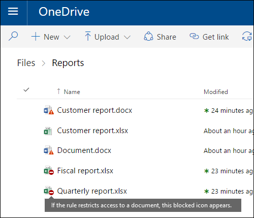
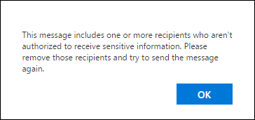
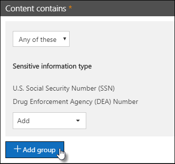
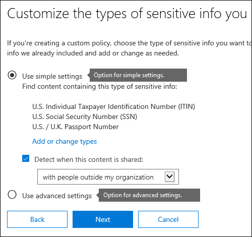

# Referencia de prevención de pérdida de datos

> [!IMPORTANT]
> Este es el tema de referencia ya no es el recurso principal para Microsoft 365 de prevención de pérdida de datos (DLP). El conjunto de contenido DLP se está actualizando y reestructurando. Los temas tratados en este artículo se trasladarán a artículos nuevos y actualizados. Para obtener más información acerca de DLP, vea [Learn about data loss prevention](dlp-learn-about-dlp.md).

<!-- this topic needs to be split into smaller, more coherent ones. It is confusing as it is. -->
<!-- move this note to a more appropriate place, no topic should start with a note -->
> [!NOTE]
> Las funciones de prevención de pérdida de datos se han agregado recientemente a los mensajes de conversaciones y canales de Microsoft Teams para usuarios con licencia de Cumplimiento avanzado de Office 365, que está disponible como opción independiente y se incluye en Cumplimiento de Microsoft 365 E5 y Office 365 E5. Para obtener más información sobre los requisitos de licencias, consulte [Instrucciones de licencias de Microsoft 365 del nivel de espacio empresarial](/office365/servicedescriptions/microsoft-365-service-descriptions/microsoft-365-tenantlevel-services-licensing-guidance).

<!-- MOVED TO LEARN ABOUT To comply with business standards and industry regulations, organizations must protect sensitive information and prevent its inadvertent disclosure. Sensitive information can include financial data or personally identifiable information (PII) such as credit card numbers, social security numbers, or health records. With a data loss prevention (DLP) policy in the Office 365 Security &amp; Compliance Center, you can identify, monitor, and automatically protect sensitive information across Office 365.

With a DLP policy, you can:

- **Identify sensitive information across many locations, such as Exchange Online, SharePoint Online, OneDrive for Business, and Microsoft Teams.**

    For example, you can identify any document containing a credit card number that's stored in any OneDrive for Business site, or you can monitor just the OneDrive sites of specific people.

- **Prevent the accidental sharing of sensitive information**.

    For example, you can identify any document or email containing a health record that's shared with people outside your organization, and then automatically block access to that document or block the email from being sent.

- **Monitor and protect sensitive information in the desktop versions of Excel, PowerPoint, and Word.**

    Just like in Exchange Online, SharePoint Online, and OneDrive for Business, these Office desktop programs include the same capabilities to identify sensitive information and apply DLP policies. DLP provides continuous monitoring when people share content in these Office programs.

- **Help users learn how to stay compliant without interrupting their workflow.**

    You can educate your users about DLP policies and help them remain compliant without blocking their work. For example, if a user tries to share a document containing sensitive information, a DLP policy can both send them an email notification and show them a policy tip in the context of the document library that allows them to override the policy if they have a business justification. The same policy tips also appear in Outlook on the web, Outlook, Excel, PowerPoint, and Word.

- **View DLP alerts and reports showing content that matches your organization’s DLP policies.**

    To view alerts and metadata related to your DLP policies you can use the [DLP Alerts Management Dashboard](dlp-configure-view-alerts-policies.md). You can also view policy match reports to assess how your organization is complying with a DLP policy. If a DLP policy allows users to override a policy tip and report a false positive, you can also view what users have reported

-->
## Crear y administrar directivas DLP

Para crear y administrar las directivas DLP, vaya a la página sobre la prevención de pérdida de datos del Centro de cumplimiento de Microsoft 365.

<!-- MOVED TO LEARN ABOUT ## What a DLP policy contains

A DLP policy contains a few basic things:

- Where to protect the content: **locations** such as Exchange Online, SharePoint Online, and OneDrive for Business sites, as well as Microsoft Teams chat and channel messages.

- When and how to protect the content by enforcing **rules** comprised of:

  - **Conditions** the content must match before the rule is enforced. For example, a rule might be configured to look only for content containing Social Security numbers that's been shared with people outside your organization.

  - **Actions** that you want the rule to take automatically when content matching the conditions is found. For example, a rule might be configured to block access to a document and send both the user and compliance officer an email notification.

You can use a rule to meet a specific protection requirement, and then use a DLP policy to group together common protection requirements, such as all of the rules needed to comply with a specific regulation.

For example, you might have a DLP policy that helps you detect the presence of information subject to the Health Insurance Portability and Accountability Act (HIPAA). This DLP policy could help protect HIPAA data (the what) across all SharePoint Online sites and all OneDrive for Business sites (the where) by finding any document containing this sensitive information that's shared with people outside your organization (the conditions) and then blocking access to the document and sending a notification (the actions). These requirements are stored as individual rules and grouped together as a DLP policy to simplify management and reporting.

 -->

<!-- MOVED TO LEARN ABOUT ### Locations

DLP policies are applied to sensitive items across Microsoft 365 locations and can be further scoped as detailed in this table.

|Location | Include/exclude by|
|---------|---------|
|Exchange email| distribution groups|
|SharePoint sites |sites |
|OneDrive accounts |accounts |
|Teams chat and channel messages |accounts |
|Windows 10 devices |user or group |
|Microsoft Cloud App Security |instance |
 -->

<!-- moved to dlp-policy-reference.md
If you choose to include specific distribution groups in Exchange, the DLP policy will be scoped only to the members of that group. Similarly excluding a distribution group will exclude all the members of that distribution group from policy evaluation. You can choose to scope a policy to the members of distribution lists, dynamic distribution groups, and security groups. A DLP policy can contain no more than 50 such inclusions and exclusions.

If you choose to include or exclude specific SharePoint sites, a DLP policy can contain no more than 100 such inclusions and exclusions. Although this limit exists, you can exceed this limit by applying either an org-wide policy or a policy that applies to entire locations.

If you choose to include or exclude specific OneDrive accounts or groups, a DLP policy can contain no more than 100 user accounts or 50 groups as inclusion or exclusion.

### Rules

> [!NOTE]
> The default behavior of a DLP policy, when there is no alert configured, is not to alert or trigger. This applies only to default information types. For custom information types, the system will alert even if there is no action defined in the policy.

Rules are what enforce your business requirements on your organization's content. A policy contains one or more rules, and each rule consists of conditions and actions. For each rule, when the conditions are met, the actions are taken automatically. Rules are executed sequentially, starting with the highest-priority rule in each policy.

A rule also provides options to notify users (with policy tips and email notifications) and admins (with email incident reports) that content has matched the rule.

Here are the components of a rule, each explained below.

#### Conditions

Conditions are important because they determine what types of information you're looking for, and when to take an action. For example, you might choose to ignore content containing passport numbers unless the content contains more than 10 such numbers and is shared with people outside your organization.

Conditions focus on the **content**, such as what types of sensitive information you're looking for, and also on the **context**, such as who the document is shared with. You can use conditions to assign different actions to different risk levels. For example, sensitive content shared internally might be lower risk and require fewer actions than sensitive content shared with people outside the organization.

The conditions now available can determine if:

- Content contains a type of sensitive information.

- Content contains a label. For more information, see the below section [Using a retention label as a condition in a DLP policy](#using-a-retention-label-as-a-condition-in-a-dlp-policy).

- Content is shared with people outside or inside your organization.

  > [!NOTE]
  > Users who have non-guest accounts in a host organization's Active Directory or Azure Active Directory tenant are considered as people inside the organization.

#### Types of sensitive information

A DLP policy can help protect sensitive information, which is defined as a **sensitive information type**. Microsoft 365 includes definitions for many common sensitive information types across many different regions that are ready for you to use, such as a credit card number, bank account numbers, national ID numbers, and passport numbers.

When a DLP policy looks for a sensitive information type such as a credit card number, it doesn't simply look for a 16-digit number. Each sensitive information type is defined and detected by using a combination of:

- Keywords.

- Internal functions to validate checksums or composition.

- Evaluation of regular expressions to find pattern matches.

- Other content examination.

This helps DLP detection achieve a high degree of accuracy while reducing the number of false positives that can interrupt peoples' work.

#### Actions

When content matches a condition in a rule, you can apply actions to automatically protect the content.

With the actions now available, you can:

- **Restrict access to the content** Depending on your need, you can restrict access to content in three ways:

  1. Restrict access to content for everyone.
  2. Restrict access to content for people outside the organization.
  3. Restrict access to "Anyone with the link."

  For site content, this means that permissions for the document are restricted for everyone except the primary site collection administrator, document owner, and person who last modified the document. These people can remove the sensitive information from the document or take other remedial action. When the document is in compliance, the original permissions are automatically restored. When access to a document is blocked, the document appears with a special policy tip icon in the library on the site.

  

  For email content, this action blocks the message from being sent. Depending on how the DLP rule is configured, the sender sees an NDR or (if the rule uses a notification) a policy tip and/or email notification.

  

#### User notifications and user overrides

You can use notifications and overrides to educate your users about DLP policies and help them remain compliant without blocking their work. For example, if a user tries to share a document containing sensitive information, a DLP policy can both send them an email notification and show them a policy tip in the context of the document library that allows them to override the policy if they have a business justification.

The email can notify the person who sent, shared, or last modified the content and, for site content, the primary site collection administrator and document owner. In addition, you can add or remove whomever you choose from the email notification.

In addition to sending an email notification, a user notification displays a policy tip:

- In Outlook and Outlook on the web.

- For the document on a SharePoint Online or OneDrive for Business site.

- In Excel, PowerPoint, and Word, when the document is stored on a site included in a DLP policy.

The email notification and policy tip explain why content conflicts with a DLP policy. If you choose, the email notification and policy tip can allow users to override a rule by reporting a false positive or providing a business justification. This can help you educate users about your DLP policies and enforce them without preventing people from doing their work. Information about overrides and false positives is also logged for reporting (see below about the DLP reports) and included in the incident reports (next section), so that the compliance officer can regularly review this information.

Here's what a policy tip looks like in a OneDrive for Business account.

 To learn more about user notifications and policy tips in DLP policies, see [Use notifications and policy tips](use-notifications-and-policy-tips.md).

#### Alerts and Incident reports

When a rule is matched, you can send an alert email to your compliance officer (or any person(s) you choose) with details of the alert. This alert email will carry a link of the [DLP Alerts Management Dashboard](dlp-configure-view-alerts-policies.md) which the compliance officer can go to view the details of alert and events. The dashboard contains details of the event that triggered the alert along with details of the DLP policy matched and the sensitive content detected.

In addition, you can also send an incident report with details of the event. This report includes information about the item that was matched, the actual content that matched the rule, and the name of the person who last modified the content. For email messages, the report also includes as an attachment the original message that matches a DLP policy.

> [!div class="mx-imgBorder"]
> 

DLP scans email differently from items in SharePoint Online or OneDrive for Business. In SharePoint Online and OneDrive for Business, DLP scans existing items as well as new ones and generates an alert and incident report whenever a match is found. In Exchange Online, DLP only scans new email messages and generates a report if there is a policy match. DLP ***does not*** scan or match previously existing email items that are stored in a mailbox or archive.

## Grouping and logical operators

Often your DLP policy has a straightforward requirement, such as to identify all content that contains a U.S. Social Security Number. However, in other scenarios, your DLP policy might need to identify more loosely defined data.

For example, to identify content subject to the U.S. Health Insurance Act (HIPAA), you need to look for:

- Content that contains specific types of sensitive information, such as a U.S. Social Security Number or Drug Enforcement Agency (DEA) Number.

    AND

- Content that's more difficult to identify, such as communications about a patient's care or descriptions of medical services provided. Identifying this content requires matching keywords from very large keyword lists, such as the International Classification of Diseases (ICD-9-CM or ICD-10-CM).

You can easily identify such loosely defined data by using grouping and logical operators (AND, OR). When you create a DLP policy, you can:

- Group sensitive information types.

- Choose the logical operator between the sensitive information types within a group and between the groups themselves.

### Choosing the operator within a group

Within a group, you can choose whether any or all of the conditions in that group must be satisfied for the content to match the rule.

### Adding a group

You can quickly add a group, which can have its own conditions and operator within that group.

### Choosing the operator between groups

Between groups, you can choose whether the conditions in just one group or all of the groups must be satisfied for the content to match the rule.

For example, the built-in **U.S. HIPAA** policy has a rule that uses an **AND** operator between the groups so that it identifies content that contains:

- from the group **PII Identifiers** (at least one SSN number **OR** DEA number)

    **AND**

- from the group **Medical Terms** (at least one ICD-9-CM keyword **OR** ICD-10-CM keyword)

## The priority by which rules are processed

When you create rules in a policy, each rule is assigned a priority in the order in which it's created — meaning, the rule created first has first priority, the rule created second has second priority, and so on.

> [!div class="mx-imgBorder"]
> 

After you have set up more than one DLP policy, you can change the priority of one or more policies. To do that, select a policy, choose **Edit policy**, and use the **Priority** list to specify its priority.

> [!div class="mx-imgBorder"]
> 

When content is evaluated against rules, the rules are processed in priority order. If content matches multiple rules, the rules are processed in priority order and the most restrictive action is enforced. For example, if content matches all of the following rules, Rule 3 is enforced because it's the highest priority, most restrictive rule:

- Rule 1: only notifies users

- Rule 2: notifies users, restricts access, and allows user overrides

- Rule 3: notifies users, restricts access, and does not allow user overrides

- Rule 4: only notifies users

- Rule 5: restricts access

- Rule 6: notifies users, restricts access, and does not allow user overrides

In this example, note that matches for all of the rules are recorded in the audit logs and shown in the DLP reports, even though only the most restrictive rule is enforced.

Regarding policy tips, note that:

- Only the policy tip from the highest priority, most restrictive rule will be shown. For example, a policy tip from a rule that blocks access to content will be shown over a policy tip from a rule that simply sends a notification. This prevents people from seeing a cascade of policy tips.

- If the policy tips in the most restrictive rule allow people to override the rule, then overriding this rule also overrides any other rules that the content matched.

-->

## Ajustar reglas para que sea más fácil o más difícil que coincidan

Después de crear y activar sus directivas DLP, a veces los usuarios se encuentran con estos problemas:

- Demasiado contenido que **no es** información confidencial coincide con las reglas (es decir, demasiados falsos positivos).

- Muy poco contenido que **es** información confidencial coincide con las reglas. Es decir, las acciones de protección no se están aplicando en la información confidencial.

Para solucionar estos problemas, puede ajustar las reglas al modificar el recuento de instancias y la precisión de coincidencia para que sea más fácil o más difícil que el contenido coincida con las reglas. Todos los tipos de información confidencial que se usan en una regla tienen un recuento de instancias y precisión de coincidencia.

### Recuento de instancias

El recuento de instancias significa simplemente qué número de apariciones de un determinado tipo de información confidencial debe estar presente en el contenido para que coincida con la regla. Por ejemplo, el contenido coincide con la regla que se muestra a continuación si se identifican entre 1 y 9 números únicos de pasaporte de los Estados Unidos o Reino Unido.

> [!NOTE]
> El número de instancias incluye solo coincidencias **únicas** con palabras clave y tipos de información confidenciales. Por ejemplo, si un correo electrónico contiene diez veces el mismo número de tarjeta de crédito, esas diez cuentan como una única instancia de un número de tarjeta de crédito.

Las instrucciones para usar el recuento de instancias para ajustar las reglas son sencillas:

- Para facilitar que la regla coincida, disminuya el recuento **mín** o aumente el recuento **máx**. También puede establecer **máx** en **cualquiera** si elimina el valor numérico.

- Para que sea más difícil que la regla coincida, aumente el recuento **mín**.

Normalmente, se usan acciones menos restrictivas, como el envío de notificaciones de usuario, en una regla con un recuento de instancias inferior (por ejemplo, 1-9). Y se usan acciones más restrictivas, como restringir el acceso al contenido sin permitir invalidaciones de usuario, en una regla con un recuento de instancias superior (por ejemplo, de 10 a cualquiera).

### Precisión de coincidencia

Como se describió anteriormente, un tipo de información confidencial se define y detecta mediante una combinación de distintos tipos de evidencia. Frecuentemente, un tipo de información confidencial se define mediante esas combinaciones, denominadas patrones. Un patrón que requiere menos evidencia tiene una precisión de coincidencia (o nivel de confianza) inferior, mientras que un patrón que requiere más evidencia tiene una precisión de coincidencia (o nivel de confianza) mayor. Para obtener más información sobre los patrones y niveles de confianza reales que usa cada tipo de información confidencial, consulte [Definiciones de entidad de tipos de información confidencial](sensitive-information-type-entity-definitions.md).

Por ejemplo, el tipo de información confidencial denominado Número de tarjeta de crédito se define mediante dos patrones:

- Un patrón con un 65 % de confianza que requiere:

  - Un número en el formato de un número de tarjeta de crédito.

  - Un número que pasa la suma de comprobación.

- Un patrón con un 85 % de confianza que requiere:

  - Un número en el formato de un número de tarjeta de crédito.

  - Un número que pasa la suma de comprobación.

  - Una palabra clave o una fecha de expiración en el formato correcto.

Puede usar estos niveles de confianza (o precisión de coincidencia) en sus reglas. Normalmente, se usan acciones menos restrictivas, como el envío de notificaciones de usuario, en una regla con una precisión de coincidencia inferior. Y se usan acciones más restrictivas, como restringir el acceso al contenido sin permitir invalidaciones de usuario, en una regla con una precisión de coincidencia superior.

Es importante comprender que, cuando se identifica en el contenido un tipo específico de información confidencial (como un número de tarjeta de crédito), se devuelve solo un único nivel de confianza:

- Si todas las coincidencias son para un único patrón, se devuelve el nivel de confianza de ese patrón.

- Si hay coincidencias para más de un patrón (es decir, hay coincidencias con dos niveles de confianza diferentes), se devuelve un nivel de confianza superior a cualquiera de los patrones únicos independientes. Esta es la parte complicada. Por ejemplo, para una tarjeta de crédito, si se cumplen los patrones del 65 % y del 85 %, el nivel de confianza que devuelve ese tipo de información confidencial es mayor al 90 % porque más evidencia implica más confianza.

Por lo tanto, si quiere crear dos reglas que se excluyan mutuamente para tarjetas de crédito, una para la precisión de coincidencia del 65 % y otra para la precisión de coincidencia del 85 %, los intervalos de la precisión de coincidencia tendrían el siguiente aspecto. La primera regla selecciona solo coincidencias del patrón del 65 %. La segunda regla selecciona coincidencias con **al menos una** coincidencia del 85 % y **puede tener** otras coincidencias con un nivel menor de confianza.

Por estas razones, las instrucciones para crear reglas con diferentes precisiones de coincidencia son:

- Normalmente, el nivel inferior de confianza usa el mismo valor para **mín** y **máx** (no un rango).

- El nivel superior de confianza suele ser un rango desde el nivel de confianza inferior hasta 100.

- Por lo general, los niveles de confianza intermedios oscilan entre justo después del nivel de confianza inferior y justo antes del nivel de confianza superior.

## Usar una etiqueta de retención como condición en una directiva DLP

Al usar una [etiqueta de retención](retention.md#retention-labels) que haya creado y publicado con anterioridad como condición en una directiva DLP, debe tener en cuenta lo siguiente:

- Antes de intentar usarla como una condición en una directiva DLP, debe haber creado, publicado y aplicado previamente la etiqueta de retención.
- Las etiquetas de retención publicadas pueden tardar de uno a siete días en sincronizarse. Para obtener más información, consulte [¿Cuándo están disponibles las etiquetas de retención para su aplicación?](create-apply-retention-labels.md#when-retention-labels-become-available-to-apply) para las etiquetas de retención publicadas en una directiva de retención y [¿Cuánto tardarán las etiquetas de retención en surtir efecto?](apply-retention-labels-automatically.md#how-long-it-takes-for-retention-labels-to-take-effect) para las etiquetas de retención que se publiquen automáticamente.
- El uso de una etiqueta de retención en una directiva **solo es compatible con los elementos de SharePoint y OneDrive***.

  

  Es posible que quiera usar una etiqueta de retención en una directiva DLP si tiene elementos en retención y eliminación, y también desea aplicarles otros controles, por ejemplo:

  - Publicó una etiqueta de retención denominada **año fiscal 2018**, que, cuando se aplica a los documentos de impuestos de 2018 que se almacenan en SharePoint, los retiene durante 10 años, para después eliminarlos. Tampoco quiere que los elementos se compartan fuera de la organización, lo que puede hacer con una directiva DLP.

  > [!IMPORTANT]
  > Si especifica una etiqueta de retención como una condición en una directiva DLP e incluye también Exchange y/o Teams como una ubicación, recibirá el siguiente mensaje de error: **"No se admite la protección del contenido etiquetado en mensajes de correo electrónico y de Teams. Quite la etiqueta siguiente o desactive Exchange y Teams como una ubicación".** Esto se debe a que el transporte de Exchange no evalúa los metadatos de la etiqueta durante el envío y entrega de mensajes.

### Usar una etiqueta de confidencialidad como condición en una directiva DLP

[Obtenga más información](./dlp-sensitivity-label-as-condition.md) sobre cómo usar la etiqueta de confidencialidad como condición en las directivas DLP.

### Cómo esta característica se relaciona con otras características

Varias características pueden aplicarse al contenido que incluye información confidencial:

- Una [etiqueta de retención y una directiva de retención](retention.md) pueden aplicar acciones de **retención** a este contenido.

- Una directiva DLP puede aplicar acciones de **protección** en este contenido. Y antes de aplicar estas acciones, una directiva DLP puede requerir que se cumplan otras condiciones además del contenido que contiene una etiqueta.

Tenga en cuenta que una directiva DLP tiene una capacidad de detección más profunda que una directiva de retención o etiqueta aplicada a la información confidencial. Una directiva DLP puede aplicar acciones de protección al contenido que incluye información confidencial y si se elimina la información confidencial del contenido, esas acciones de protección se desharán la próxima vez que se examine el contenido. Sin embargo, si una directiva de retención o etiqueta se aplica al contenido que incluye información confidencial, esta será una acción única que no se puede deshacer, incluso aunque se quite de la información confidencial.

Al usar una etiqueta como una condición en una directiva DLP, puede aplicar acciones de retención y protección en el contenido con esa etiqueta. Puede considerar el contenido que incluya una etiqueta exactamente igual al que incluye información confidencial: una etiqueta y un tipo de información confidencial son propiedades que se usan para clasificar contenido, por lo que se pueden aplicar acciones a ese contenido.

## Configuraciones simples y configuraciones avanzadas

Cuando cree una directiva DLP, tendrá que seleccionar entre configuración simple o avanzada:

- La **configuración simple** facilita la creación del tipo más común de directiva DLP sin usar el editor de reglas para crearlas o modificarlas.

- La **configuración avanzada** usa el editor de reglas para darle un control completo sobre cada configuración de la directiva DLP.

No se preocupe, en realidad, las opciones simples y las avanzadas funcionan exactamente igual, ejecutando reglas compuestas de condiciones y acciones. La única diferencia es que con la configuración simple, no verá el editor de reglas. Es una forma rápida de crear una directiva DLP.

### Configuración simple

De lejos, el escenario DLP más común es crear una directiva para ayudar a proteger el contenido con información confidencial para que no se comparta con personas de fuera de su organización y realizar una acción correctiva automática, como restringir quién puede tener acceso al contenido, enviar notificaciones de administrador o de usuario final y auditar el evento para una futura investigación. Los usuarios usan DLP para evitar la divulgación involuntaria de información confidencial.

Para facilitar el cumplimiento de este objetivo, cuando cree una directiva DLP, puede elegir **usar la configuración simple**. Esta configuración proporciona todo lo que necesita para implementar la directiva DLP más común, sin tener que utilizar el editor de reglas.

### Configuración avanzada

Si necesita crear directivas DLP más personalizadas, puede elegir **usar la configuración avanzada**.

La configuración avanzada le muestra el editor de reglas, con el que tiene pleno control sobre cada opción posible, incluido el recuento de instancias y la precisión de coincidencia (nivel de confianza) para cada regla.

Para saltar a una sección rápidamente, haga clic en un elemento de la navegación superior del editor de reglas para ir a esa sección.

## Plantillas de directiva de DLP

El primer paso para crear una directiva DLP consiste en elegir la información que se protegerá. Al partir de una plantilla DLP, se ahorra el trabajo de crear un nuevo conjunto de reglas desde cero y de averiguar qué tipos de información deben incluirse de forma predeterminada. A continuación, puede agregar estos requisitos o modificarlos para ajustar la regla de modo que satisfaga los requisitos específicos de su organización.

Una plantilla de directiva DLP preconfigurada le ayuda a detectar tipos concretos de información confidencial, como datos HIPAA, datos PCI-DSS, datos de la ley Gramm-Leach-Bliley o incluso información de identificación personal (P.I.) específica de una ubicación. Para facilitar la búsqueda y la protección de tipos comunes de información confidencial, las plantillas de directiva que se incluyen en Microsoft 365 ya contienen los tipos más comunes de información confidencial necesarios para comenzar.

Su organización también puede tener requisitos específicos propios, en cuyo caso puede crear una directiva DLP desde cero eligiendo la opción **Directiva personalizada**. Una directiva personalizada está vacía y no contiene reglas predefinidas.

<!-- ## Roll out DLP policies gradually with test mode

rehomed to Plan for DLP

When you create your DLP policies, you should consider rolling them out gradually to assess their impact and test their effectiveness before fully enforcing them. For example, you don't want a new DLP policy to unintentionally block access to thousands of documents that people require access to in order to get their work done.

If you're creating DLP policies with a large potential impact, we recommend following this sequence:

1. **Start in test mode without Policy Tips** and then use the DLP reports and any incident reports to assess the impact. You can use DLP reports to view the number, location, type, and severity of policy matches. Based on the results, you can fine tune the rules as needed. In test mode, DLP policies will not impact the productivity of people working in your organization.

2. **Move to Test mode with notifications and Policy Tips** so that you can begin to teach users about your compliance policies and prepare them for the rules that are going to be applied. At this stage, you can also ask users to report false positives so that you can further refine the rules.

3. **Start full enforcement on the policies** so that the actions in the rules are applied and the content's protected. Continue to monitor the DLP reports and any incident reports or notifications to make sure that the results are what you intend.

    

    You can turn off a DLP policy at any time, which affects all rules in the policy. However, each rule can also be turned off individually by toggling its status in the rule editor.

    

    You can also change the priority of multiple rules in a policy. To do that, open a policy for editing. In a row for a rule, choose the ellipses (**...**), and then choose an option, such as **Move down** or **Bring to last**.

    > [!div class="mx-imgBorder"]
    > -->

## Informes de DLP

Después de crear y activar las directivas DLP, deberá comprobar que su funcionamiento es el deseado y que le ayudan a cumplir las normativas. Con los informes de DLP, puede ver rápidamente el número de directivas DLP y coincidencias de regla a lo largo del tiempo, así como el número de falsos positivos e invalidaciones. En cada informe, las coincidencias se pueden filtrar por ubicación, período de tiempo e incluso se puede especificar una directiva, una regla o una acción concretas.

Con los informes de DLP, puede obtener información de la empresa y:

- Centrarse en períodos de tiempo específicos y comprender las causas de los picos y las tendencias.

- Descubrir los procesos de negocio que infringen las directivas de cumplimiento de su organización.

- Comprender cualquier impacto de negocio de las directivas DLP.

Además, puede usar los informes de DLP para ajustar sus directivas DLP mientras las ejecuta.

## Cómo funcionan las directivas DLP

DLP detecta información confidencial mediante un análisis profundo del contenido (no solo un análisis de texto simple). Este análisis profundo del contenido usa coincidencias de palabras clave, coincidencias de diccionario, la evaluación de expresiones regulares, funciones internas y otros métodos para detectar el contenido que coincide con las directivas DLP. Posiblemente solo un pequeño porcentaje de los datos se considera confidencial. Una directiva DLP puede identificar, supervisar y proteger automáticamente solo esos datos, sin obstaculizar o afectar a las personas que trabajan con el resto del contenido.

### Las directivas se sincronizan

Después de crear una directiva DLP en el Centro de seguridad y cumplimiento, esta se almacena en un almacén central de directivas y después se sincroniza con los distintos orígenes de contenido, entre ellos:

- Exchange Online y de ahí a Outlook en la web y Outlook.

- Sitios de OneDrive para la Empresa

- Sitios de SharePoint Online.

- Programas de escritorio de Office (Excel, PowerPoint y Word).

- Mensajes de conversaciones y canales de Microsoft Teams.

Después de que la directiva se sincroniza en las ubicaciones adecuadas, empieza a evaluar el contenido y a aplicar las acciones.
<!-- what is the time delay for first deployment of a policy and what is the sync schedule? -->

### Evaluación de la directiva en sitios de OneDrive para la Empresa y SharePoint Online

En los sitios de SharePoint Online y OneDrive para la Empresa, los documentos cambian todo el tiempo: se crean, se modifican y se comparten continuamente. Esto significa que los documentos pueden entrar en conflicto o pasar a ser conformes con una directiva DLP en cualquier momento. Por ejemplo, una persona puede cargar un documento que no contenga información confidencial a su sitio de grupo, pero más adelante, puede editar el mismo documento y agregar información confidencial.

Por este motivo, las directivas DLP buscan frecuentemente y en segundo plano coincidencias de directivas en los documentos. Puede considerarlo como una evaluación asincrónica de directiva.<!-- what is the frequency? looks like it is tied to the search crawl schedule -->

#### Cómo funciona

A medida que los usuarios agregan o cambian documentos en sus sitios, el motor de búsqueda analiza el contenido, para que pueda buscarlo más adelante. Cuando esto ocurre, también se busca información confidencial en el contenido y se comprueba si se ha compartido. La información confidencial encontrada se almacena de forma segura en el índice de búsqueda para que solo el equipo de cumplimiento pueda tener acceso a ella, pero no los usuarios normales. Cada directiva DLP activada se ejecuta en segundo plano (asincrónicamente), comprobando la búsqueda con frecuencia de cualquier contenido que coincida con una directiva y aplicando acciones para protegerla de pérdidas accidentales.

<!-- conflict with a DLP policy is bad wording --> Por último, los documentos pueden entrar en conflicto con una directiva DLP, pero también pueden cumplir con una directiva DLP. Por ejemplo, si una persona agrega números de tarjeta de crédito a un documento, podría hacer que una directiva DLP bloquee el acceso al documento de forma automática. Pero si la persona elimina más adelante la información confidencial, la acción (en este caso, el bloqueo) se deshace automáticamente la próxima vez que se evalúa el documento con la directiva.

DLP evalúa el contenido que se puede indexar. Para obtener más información sobre los tipos de archivo que se rastrean de forma predeterminada, consulte [Extensiones de nombre de archivo y tipos de archivo analizados predeterminados en SharePoint Server](/SharePoint/technical-reference/default-crawled-file-name-extensions-and-parsed-file-types).

> [!NOTE]
> Para evitar que los documentos se compartan antes de que las directivas DLP tuvieran la oportunidad de analizarlos, el uso compartido de nuevos archivos en SharePoint puede bloquearse hasta que su contenido se haya indizado. Para obtener más información, consulte [Marcar archivos nuevos como confidenciales de forma predeterminada](/sharepoint/sensitive-by-default).

### Evaluación de la directiva en Exchange Online, Outlook y Outlook en la Web

Cuando se crea una directiva DLP que incluye Exchange Online como ubicación, la directiva se sincroniza desde el Centro de seguridad y cumplimiento de Office 365 con Exchange Online y, después, desde Exchange Online con Outlook en la Web y Outlook.

Cuando se redacta un mensaje en Outlook, el usuario puede ver sugerencias de directiva mientras el contenido creado se evalúa según las directivas DLP. Y cuando se envía un mensaje, este se evalúa según las directivas DLP como una parte normal del flujo de correo, junto con las reglas de flujo de correo de Exchange (también conocidas como reglas de transporte) y las directivas DLP creadas en el centro de administración de Exchange. Las directivas DLP escanean tanto el mensaje como los archivos adjuntos.

### Evaluación de la directiva en los programas de escritorio de Office

<!-- same capability to identify sensitive information line conflates sensitive information types and such -->
Excel, PowerPoint y Word incluyen la misma capacidad para identificar información confidencial y aplicar directivas DLP que SharePoint Online y OneDrive para la Empresa. Estos programas de Office sincronizan sus directivas DLP directamente desde el almacén central de directivas y evalúan continuamente el contenido con las directivas DLP cuando los usuarios trabajan con documentos abiertos desde un sitio que se incluye en una directiva DLP.

La evaluación de directivas DLP en Office está diseñada para no afectar al rendimiento de los programas ni a la productividad de las personas que trabajan en el contenido. Si están trabajando en un documento de gran tamaño o el equipo del usuario está ocupado, tardará unos segundos en aparecer una sugerencia de directiva.

### Evaluación de directivas en Microsoft Teams
 <!--what do you mean that it's synched to user accounts?  I thought DLP policies were applied to locations not users like sensitivity labels are  -->

Cuando crea una directiva DLP que incluye Microsoft Teams como ubicación, la directiva se sincroniza desde el Centro de seguridad y cumplimiento de Office 365 con las cuentas de usuario y mensajes de chat y de canales de Microsoft Teams. En función de cómo estén configuradas las directivas DLP, cuando un usuario intenta compartir información confidencial en un mensaje de chat o canal de Microsoft Teams, el mensaje se puede bloquear o revocar. Y los documentos que contienen información confidencial y que se comparten con invitados (usuarios externos) no se abrirán para estos usuarios. Para obtener más información, vea [Prevención de pérdida de datos y Microsoft Teams](dlp-microsoft-teams.md).

## Permisos

De forma predeterminada, los administradores globales, los administradores de seguridad y los administradores de cumplimiento tendrán acceso para crear y aplicar una directiva DLP. Otros miembros del equipo de cumplimiento que crearán directivas DLP necesitan permisos en el Centro de &amp; cumplimiento de seguridad. De forma predeterminada, el administrador de inquilinos tendrá acceso a esta ubicación y puede conceder a los responsables de cumplimiento y a otras personas acceso al Centro de cumplimiento de seguridad, sin darles todos los permisos de un administrador &amp; de inquilinos. Para ello, le recomendamos que:

1. Crear un grupo en Microsoft 365 y adición de responsables de cumplimiento.

2. Crear un grupo de roles en la página **Permisos** del Centro de seguridad y cumplimiento.

3. Durante la creación del grupo de roles, utilice la sección **Elegir roles** para añadir el rol siguiente al grupo de roles: **Administración de cumplimiento DLP**.

4. Use la sección **Elegir miembros** para añadir el grupo de Microsoft 365 que creó antes del grupo de roles.

También puede crear un grupo de roles solo con privilegios de lectura para las directivas DLP y los informes DLP asignando el rol de **Administración de cumplimiento DLP de solo lectura**.

Para más información, vea [Conceder acceso a los usuarios al Centro de cumplimiento de Office 365](../security/office-365-security/grant-access-to-the-security-and-compliance-center.md).

Estos permisos son necesarios solo para crear y aplicar una directiva de DLP. La aplicación de directivas no requiere acceso al contenido.

## Encontrar los cmdlets DLP

Para usar la mayoría de los cmdlets para el Centro de seguridad y cumplimiento, necesita:

1. [Conectarse al &amp;Centro de seguridad y cumplimiento de Office 365 mediante PowerShell remoto](/powershell/exchange/connect-to-scc-powershell)

2. Usar cualquiera de estos [cmdlets policy-and-compliance-dlp](/powershell/module/exchange/export-dlppolicycollection)

Sin embargo, los informes de DLP necesitan extraer datos de todo Microsoft 365, incluido Exchange Online. Por este motivo, **los cmdlets para los informes de DLP están disponibles en el PowerShell de Exchange Online. no en el PowerShell del Centro de seguridad y cumplimiento**. Por lo tanto, para usar los cmdlets para los informes de DLP, debe:

1. [Conectarse a Exchange Online mediante PowerShell remoto](/powershell/exchange/connect-to-exchange-online-powershell).

2. Use cualquiera de estos cmdlets para los informes de DLP:

    - [Get-DlpDetectionsReport](/powershell/module/exchange/Get-DlpDetectionsReport)

    - [Get-DlpDetailReport](/powershell/module/exchange/Get-DlpDetailReport)

## Más información

- [Crear una directiva DLP desde una plantilla](create-a-dlp-policy-from-a-template.md)

- [Enviar notificaciones y mostrar sugerencias de directivas para directivas DLP](use-notifications-and-policy-tips.md)

- [Crear una directiva DLP para proteger documentos con FCI u otras propiedades](protect-documents-that-have-fci-or-other-properties.md)

- [Qué incluyen las plantillas de directiva DLP](what-the-dlp-policy-templates-include.md)

- [Definiciones de entidad de tipos de información confidencial](sensitive-information-type-entity-definitions.md)

- [Qué buscan las funciones de DLP](what-the-dlp-functions-look-for.md)

- [Crear un tipo personalizado de información confidencial](create-a-custom-sensitive-information-type.md)
