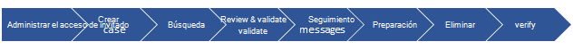
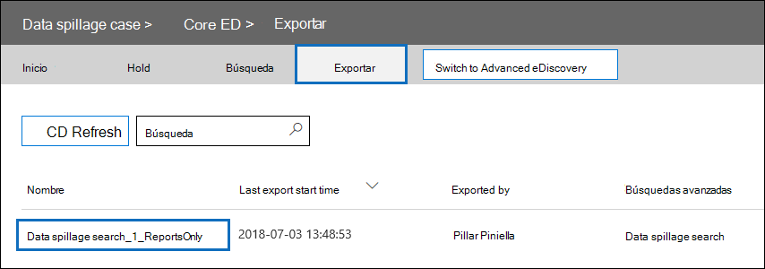

# Serie de soluciones de exhibición de documentos electrónicos: escenario de derrame de datos: búsqueda y purga

 **¿Qué es el derrame de datos y por qué debe importarle?** El derrame de datos se hace cuando un documento confidencial se libera en un entorno que no es de confianza. Cuando se detecta un incidente de derrame de datos, es importante evaluar rápidamente el tamaño y las ubicaciones del derrame, examinar las actividades del usuario a su alrededor y, a continuación, purgar permanentemente los datos que se han derramado del sistema. 
  
## Escenario de derrame de datos

Es un responsable de seguridad de la información principal en Contoso. Se le informa de una situación de derrame de datos en la que un empleado compartió sin conocimiento un documento altamente confidencial con varias personas a través del correo electrónico. Desea evaluar rápidamente quién recibió este documento de forma interna y externa. Una vez identificado, le gustaría compartir los resultados de casos con otros investigadores para revisar y, a continuación, quitar permanentemente los datos de Office 365. Una vez completada la investigación, desea generar un informe con la evidencia de eliminación permanente y otros detalles del caso para cualquier referencia futura.
  
### Ámbito de este artículo

Este documento proporciona una lista de instrucciones sobre cómo quitar permanentemente un mensaje de Microsoft 365 para que no sea accesible ni recuperable. Para eliminar un mensaje y hacerlo recuperable hasta que expire el período de retención de elementos eliminados, vea Buscar y eliminar mensajes de correo [electrónico en la organización.](search-for-and-delete-messages-in-your-organization.md)
  
## Flujo de trabajo para administrar incidentes de derrame de datos

Este es un ejemplo de cómo administrar un incidente de derrame de datos:

  
[(Opcional) Paso 1: Administrar quién puede acceder al caso y establecer límites de cumplimiento](#optional-step-1-manage-who-can-access-the-case-and-set-compliance-boundaries) 
[Paso 2: Crear un caso de exhibición de documentos electrónicos](#step-2-create-an-ediscovery-case) 
[Paso 3: Buscar los datos derramados](#step-3-search-for-the-spilled-data) 
[Paso 4: Revisar y validar los resultados de casos](#step-4-review-and-validate-case-findings) 
[Paso 5: Usar el registro de seguimiento de mensajes para comprobar cómo se compartieron los datos derramados](#step-5-use-message-trace-log-to-check-how-spilled-data-was-shared) 
[Paso 6: Preparar los buzones](#step-6-prepare-the-mailboxes) 
[Paso 7: Eliminar permanentemente los datos derramados](#step-7-permanently-delete-the-spilled-data) 
[Paso 8: Comprobar, proporcionar una prueba de eliminación y auditoría](#step-8-verify-provide-a-proof-of-deletion-and-audit) 

## Cosas que debe saber antes de empezar

- Cuando un buzón está en espera, un mensaje eliminado permanece en la carpeta Elementos recuperables hasta que expira el período de retención o se libera la suspensión. [En el paso 6](#step-6-prepare-the-mailboxes) se describe cómo quitar la retención de los buzones. Consulte con los departamentos legales o de administración de registros antes de quitar la retención. Es posible que la organización tenga una directiva que defina si un buzón de correo en espera o un incidente de derrame de datos tiene prioridad. 
    
- Para controlar qué buzones de usuario puede buscar y administrar quién puede tener acceso al caso, puede configurar los límites de cumplimiento y crear un grupo de roles personalizado, que se describe en el paso [1](#optional-step-1-manage-who-can-access-the-case-and-set-compliance-boundaries). Para ello, debe ser miembro del grupo de roles Administración de la organización o tener asignado el rol de administración de roles. Si usted o un administrador de su organización ya ha establecido límites de cumplimiento, puede omitir el paso 1.
    
- Para crear un caso, debe ser miembro del grupo de roles administrador de exhibición de documentos electrónicos o ser miembro de un grupo de roles personalizado al que se haya asignado el rol de administración de casos. Si no es miembro, pida a un administrador de Microsoft 365 que le agregue al grupo de roles administrador de exhibición [de documentos electrónicos](assign-ediscovery-permissions.md).
    
- Para crear y ejecutar una búsqueda de contenido, tiene que ser miembro del grupo de roles Administrador de eDiscovery o tener asignado el rol de administración Búsqueda de cumplimiento. Para eliminar mensajes, tiene que ser miembro del grupo de roles Administración de la organización o tener asignado el rol de administración Búsqueda y eliminación. Para más información sobre cómo agregar usuarios a un grupo de roles, consulte [ Asignar permisos de eDiscovery en el Centro de seguridad y cumplimiento](./assign-ediscovery-permissions.md).
    
- Para buscar en las actividades de exhibición de documentos electrónicos del registro de auditoría en el paso 8, la auditoría debe estar activada para su organización. Puede buscar actividades realizadas en los últimos 90 días. Para obtener más información sobre cómo habilitar y usar la auditoría, vea la sección [Auditing the data spillage investigation process](#auditing-the-data-spillage-investigation-process) in Step 8. 
    
## (Opcional) Paso 1: Administrar quién puede acceder al caso y establecer límites de cumplimiento

Según la práctica organizativa, debe controlar quién puede tener acceso al caso de exhibición de documentos electrónicos usado para investigar un incidente de derrame de datos y configurar límites de cumplimiento. La forma más sencilla de hacerlo es agregar investigadores como miembros de un grupo de roles existente en el Centro de seguridad y cumplimiento de & y, a continuación, agregar el grupo de roles como miembro del caso de exhibición de documentos electrónicos. Para obtener información sobre los grupos de roles de exhibición de documentos electrónicos [integrados](assign-ediscovery-permissions.md)y cómo agregar miembros a un caso de exhibición de documentos electrónicos, vea Asignar permisos de exhibición de documentos electrónicos .
  
También puede crear un nuevo grupo de roles que se alinee con las necesidades de la organización. Por ejemplo, es posible que desee que un grupo de investigadores de derrame de datos de la organización acceda y colabore en todos los casos de derrame de datos. Para ello, cree un grupo de roles "Data Spillage Researcher", asigne los roles adecuados (Export, RMS Decrypt, Review, Preview, Compliance Search y Case Management), agregue los investigadores de derrame de datos al grupo de roles y, a continuación, agregue el grupo de roles como miembro del caso de exhibición de documentos electrónicos de derrame de datos. Consulte [Configurar límites de cumplimiento](set-up-compliance-boundaries.md) para las investigaciones de exhibición de documentos electrónicos en Office 365 para obtener instrucciones detalladas sobre cómo hacerlo. 
  
## Paso 2: Crear un caso de exhibición de documentos electrónicos

Un caso de exhibición de documentos electrónicos proporciona una forma eficaz de administrar la investigación de derrame de datos. Puede agregar miembros al grupo de roles que creó en el paso 1, agregar el grupo de roles como miembro de un nuevo caso de exhibición de documentos electrónicos, realizar búsquedas iterativas para buscar los datos derramados, exportar un informe para compartir, realizar un seguimiento del estado del caso y, a continuación, consultar los detalles del caso si es necesario. Considere la posibilidad de establecer una convención de nomenclatura para los casos de exhibición de documentos electrónicos usados para incidentes de derrame de datos y proporcione tanta información como pueda en el nombre y la descripción del caso para que pueda localizar y hacer referencia en el futuro si es necesario.
  
Para crear un nuevo caso, puede usar la exhibición de documentos electrónicos en el Centro de seguridad y cumplimiento. Vea "Crear un nuevo caso" en [Introducción a la exhibición de](get-started-core-ediscovery.md#step-3-create-a-core-ediscovery-case)documentos electrónicos principal.
  
## Paso 3: Buscar los datos derramados

Ahora que ha creado un caso y el acceso administrado, puede usar el caso para buscar iterativamente los datos que se han derramado e identificar los buzones que contienen los datos derramados. Usará la misma consulta de búsqueda que usó para buscar los mensajes de correo electrónico para eliminar esos mismos mensajes en el [paso 7](#step-7-permanently-delete-the-spilled-data).
  
Para crear una búsqueda de contenido asociada a un caso de exhibición de documentos electrónicos, vea Buscar contenido en un caso de [exhibición de documentos electrónicos principal](search-for-content-in-core-ediscovery.md).
  
> [!IMPORTANT]
> Las palabras clave que use en la consulta de búsqueda pueden contener los datos reales que está buscando. Por ejemplo, si busca documentos que contengan un número de seguridad social y lo usa como palabra clave de búsqueda, debe eliminar la consulta posteriormente para evitar más derrames. Consulte [Eliminar la consulta de búsqueda](#deleting-the-search-query) en el paso 8.
  
## Paso 4: Revisar y validar los resultados de casos

Después de crear una búsqueda de contenido, debe revisar y validar que los resultados de la búsqueda y comprobar que solo constan de los mensajes de correo electrónico que deben eliminarse. En una búsqueda de contenido, puede obtener una vista previa de un muestreo aleatorio de 1.000 mensajes de correo electrónico sin exportar los resultados de la búsqueda para evitar más derrames de datos. Puede leer más sobre las limitaciones de vista previa en [Limits for Content Search](limits-for-content-search.md).
  
Si tiene más de 1.000 buzones o más de 100 mensajes de correo electrónico por buzón para revisar, puede dividir la búsqueda inicial en varias búsquedas mediante palabras clave o condiciones adicionales, como intervalo de fechas o remitente/destinatario, y revisar los resultados de cada búsqueda individualmente. Asegúrese de tener en cuenta todas las consultas de búsqueda que se deben usar al eliminar mensajes en el [paso 7](#step-7-permanently-delete-the-spilled-data).

Si a un administrador o usuario final se le asigna una licencia Office 365 E5, puede examinar hasta 10 000 resultados de búsqueda a la vez mediante Advanced eDiscovery. Si hay más de 10 000 mensajes de correo electrónico que revisar, puede dividir la consulta de búsqueda por intervalo de fechas y revisar cada resultado individualmente a medida que los resultados de la búsqueda se ordenan por fecha. En Advanced eDiscovery, puede etiquetar los resultados de búsqueda mediante la característica **Etiqueta** como en el panel de vista previa y filtrar el resultado de la búsqueda por la etiqueta etiquetada. Esto es útil cuando colaboras con un revisor secundario. Al usar herramientas de análisis adicionales en Advanced eDiscovery, como el reconocimiento óptico de caracteres, el subproceso de correo electrónico y la codificación predictiva, puede procesar y revisar rápidamente miles de mensajes y etiquetarlos para su revisión posterior. Consulte [Configuración rápida para Advanced eDiscovery](./get-started-with-advanced-ediscovery.md).

Cuando encuentre un mensaje de correo electrónico que contenga datos derramados, compruebe los destinatarios del mensaje para determinar si se ha compartido externamente. Para seguir rastreando un mensaje, puede recopilar información del remitente y intervalos de fechas para que pueda usar los registros de seguimiento de mensajes. Este proceso se describe en [el paso 5](#step-5-use-message-trace-log-to-check-how-spilled-data-was-shared).

Después de comprobar los resultados de la búsqueda, es posible que desee compartir los resultados con otros usuarios para una revisión secundaria. Las personas que asignó al caso en el paso 1 pueden revisar el contenido del caso en eDiscovery y Advanced eDiscovery y aprobar los resultados de casos. También puede generar un informe sin exportar el contenido real. También puede usar este mismo informe como prueba de eliminación, que se describe en [el paso 8](#step-8-verify-provide-a-proof-of-deletion-and-audit).
  
 **Para generar un informe estadístico:**
  
1. Vaya a la **página Búsqueda** en el caso de exhibición de documentos electrónicos y haga clic en la búsqueda para la que desea generar un informe. 
    
2. En la página desplegable, haga clic en **Más > Exportar informe**.
 
      Se muestra la página Exportar informe.

    
    
3. Seleccione **Todos los elementos, incluidos** los que tienen formato no reconocido, están cifrados o no se indizaron por otros motivos y, a continuación, haga clic en **Generar informe**.

4. En el caso de exhibición de documentos electrónicos, haga clic **en Exportar** para mostrar la lista de trabajos de exportación. Es posible que tenga que hacer clic **en Actualizar** para actualizar la lista para mostrar el trabajo de exportación que creó.

5. Haga clic en el trabajo de exportación y, a continuación, haga clic **en Descargar** informe en la página desplegable.
 
    

El **informe Exportar resumen** contiene el número de ubicaciones encontradas con los resultados y el tamaño de los resultados de la búsqueda. Puede usar esto para comparar con el informe generado después de la eliminación y proporcionar como prueba de eliminación. El **informe de** resultados contiene un resumen más detallado de los resultados de la búsqueda, incluidos el asunto, el remitente, los destinatarios, si se leyó el correo electrónico, las fechas y el tamaño de cada mensaje. Si alguno de los detalles de este informe contiene los datos reales que se han derramado, asegúrese de eliminar permanentemente el archivo Results.csv una vez completada la investigación.

Para obtener más información acerca de la exportación de informes, vea [Export a Content Search report](export-a-content-search-report.md).
    
## Paso 5: Usar el registro de seguimiento de mensajes para comprobar cómo se compartieron los datos derramados

Para investigar aún más si se compartió el correo electrónico con datos filtrados, puede consultar los registros de seguimiento de mensajes con la información del remitente y la información del intervalo de fechas que recopiló en el paso 4. El período de retención para el seguimiento de mensajes es de 30 días para los datos en tiempo real y 90 días para los datos históricos.
  
Puede usar el seguimiento de mensajes en el centro de seguridad y cumplimiento o usar los cmdlets correspondientes en Exchange Online PowerShell. Es importante tener en cuenta que el seguimiento de mensajes no ofrece garantías completas sobre la integridad de los datos devueltos. Para obtener más información acerca del uso del seguimiento de mensajes, vea: 
  
- [Seguimiento de mensajes en el Centro de seguridad y cumplimiento](../security/office-365-security/message-trace-scc.md)
    
- [Nuevo seguimiento de mensajes en el Centro de & seguridad](https://techcommunity.microsoft.com/t5/exchange-team-blog/new-message-trace-in-office-365-security-038-compliance-center/ba-p/607893)
    
## Paso 6: Preparar los buzones

Después de revisar y validar que los resultados de la búsqueda contienen solo los mensajes que deben eliminarse, debe recopilar una lista de las direcciones de correo electrónico de los buzones afectados que se usarán en el paso 7 al eliminar los datos que se han derramado. Es posible que también tenga que preparar los buzones para poder eliminar permanentemente los mensajes de correo electrónico en función de si la recuperación de elementos únicos está habilitada en los buzones que contienen los datos que se han derramado o si alguno de esos buzones está en espera.
  
### Obtener una lista de direcciones de buzones con datos desbordados

Hay dos maneras de recopilar una lista de direcciones de correo electrónico de buzones con datos derramados.

**Opción 1: Obtener una lista de direcciones de buzones con datos derramados**

1. Abra el caso de exhibición de documentos electrónicos, vaya a la **página Búsqueda** y seleccione la búsqueda de contenido adecuada. 
    
2. En la página desplegable, haga clic **en Ver resultados**.
    
3. En la lista desplegable de **resultados individuales**, haga clic en **Estadísticas de búsqueda**.
    
4. En la lista desplegable **Tipo,** haga clic **en Ubicaciones superiores.**
    
    

    Se muestra una lista de buzones que contienen resultados de búsqueda. También se muestra el número de elementos de cada buzón que coinciden con la consulta de búsqueda.
    
5. Copie la información de la lista y guárdela en un archivo o haga clic en Descargar **para** descargar la información en un archivo CSV. 
    
**Opción 2: Obtener ubicaciones de buzones del informe de exportación**

Abra el informe Exportar resumen que descargó en [el paso 4](#step-4-review-and-validate-case-findings). En la primera columna del informe, la dirección de correo electrónico de cada buzón aparece en **Ubicaciones**.
  
### Preparar los buzones para poder eliminar los datos derramados

Si se habilita la recuperación de un solo elemento o si se coloca un buzón en espera, se conservará un mensaje eliminado (purgado) permanentemente en la carpeta Elementos recuperables. Por lo tanto, antes de poder purgar datos derramados, debe comprobar las configuraciones de buzones existentes y deshabilitar la recuperación de elementos únicos y quitar cualquier directiva de retención o retención. Tenga en cuenta que puede preparar un buzón a la vez y, a continuación, ejecutar el mismo comando en distintos buzones o crear un script de PowerShell para preparar varios buzones al mismo tiempo.

- Vea "Paso 1: Recopilar información  sobre el buzón" en Eliminar elementos de la carpeta Elementos recuperables de buzones basados en la nube en espera para obtener instrucciones sobre cómo comprobar si la recuperación de elementos únicos está habilitada o si el buzón está en espera o está asignado a una directiva de retención. 

- Vea "Paso 2: Preparar  el buzón" en Eliminar elementos de la carpeta Elementos recuperables de buzones basados en la nube en espera para obtener instrucciones sobre cómo deshabilitar la recuperación de elementos individuales. 

- Vea "Paso 3: Quitar todas las  retenciones del buzón" en Eliminar elementos de la carpeta Elementos recuperables de buzones basados en la nube en espera para obtener instrucciones sobre cómo quitar una directiva de retención o retención de un buzón. 

- Vea "Paso 4: Quitar la retención  de retraso del buzón" en Eliminar elementos de la carpeta Elementos recuperables de buzones basados en la nube en espera para obtener instrucciones sobre cómo quitar la retención de retraso que se coloca en el buzón después de quitar cualquier tipo de retención.

> [!IMPORTANT]
> Consulte con los departamentos legales o de administración de registros antes de quitar una directiva de retención o retención. Su organización puede tener una directiva que defina si un buzón de correo en espera o un incidente de derrame de datos tiene prioridad. 
  
Asegúrese de revertir el buzón a configuraciones anteriores después de comprobar que los datos se han eliminado de forma permanente. Vea los detalles del [paso 7](#step-7-permanently-delete-the-spilled-data).

## Paso 7: Eliminar permanentemente los datos derramados

Con las ubicaciones de buzones de correo que recopiló y preparó en el paso 6 y la consulta de búsqueda que se creó y refinó en el paso 3 para buscar mensajes de correo electrónico que contengan los datos derramados, ahora puede eliminar permanentemente los datos derramados.  Como se explicó anteriormente, para eliminar mensajes, debe ser miembro del grupo de roles Administración de la organización o tener asignado el rol de administración Buscar y purgar. Para más información sobre cómo agregar usuarios a un grupo de roles, consulte [ Asignar permisos de eDiscovery en el Centro de seguridad y cumplimiento](./assign-ediscovery-permissions.md).

Para eliminar los mensajes derramados, vea [Buscar y eliminar mensajes de correo electrónico.](search-for-and-delete-messages-in-your-organization.md)

Tenga en cuenta los siguientes límites al eliminar los datos derramados:

- El número máximo de buzones de una búsqueda que puede usar para eliminar elementos mediante una acción de búsqueda y purga es de 50 000. Si la búsqueda que cree en el paso 3 busca más de 50.000 buzones, se producirá un error en la acción de purga. Hacer la búsqueda en más de 50 000 buzones en una sola búsqueda suele ocurrir cuando se configura para que incluya a todos los buzones de la organización. Esta restricción aplica incluso cuando haya menos de 50 000 buzones que contengan elementos que coincidan con la consulta de la búsqueda.

- Se puede eliminar un máximo de 10 elementos por buzón a la vez. Como la función de buscar y quitar mensajes está diseñada para ser una herramienta de respuesta a incidentes, este límite ayuda a garantizar que los mensajes se quitan rápidamente de los buzones. Esta característica no está diseñada para limpiar buzones de usuarios.

> [!IMPORTANT]
> Los elementos de correo electrónico en un conjunto de revisiones en un caso de eDiscovery avanzado no se pueden eliminar utilizando los procedimientos de este artículo. Esto se debe a que los elementos de un conjunto de revisión son copias de elementos del servicio en directo que se copian y almacenan en una Azure Storage de revisión. Esto significa que no se devolverán mediante una búsqueda de contenido que cree en el paso 3. Para eliminar elementos en un conjunto de revisiones, tiene que eliminar el caso de eDiscovery avanzado que contiene el conjunto de revisiones. Para más información, consulte [Cerrar o eliminar un caso de eDiscovery avanzado](close-or-delete-case.md).
  
## Paso 8: Comprobar, proporcionar una prueba de eliminación y auditoría

El último paso en el flujo de trabajo para administrar un incidente de derrame de datos es comprobar que los datos derramados se quitaron permanentemente del buzón yendo al caso de exhibición de documentos electrónicos y rerunning la misma consulta de búsqueda que se usó para eliminar los datos para confirmar que no se devuelven resultados. Después de confirmar que los datos se han quitado permanentemente, puede exportar un informe e incluirlo (junto con el informe original) como prueba de eliminación. A [continuación, puede cerrar el caso,](close-reopen-delete-core-ediscovery-cases.md) lo que le permitirá volver a abrirlo si tiene que hacer referencia a él en el futuro. Además, también puede revertir los buzones a su estado anterior, eliminar la consulta de búsqueda usada para buscar los datos derramados y buscar registros de auditoría de las tareas realizadas al administrar el incidente de derrame de datos.
  
### Revertir los buzones a su estado anterior

Si cambió cualquier configuración de buzón en el paso 6 para preparar los buzones antes de que se eliminaran los datos derramados, tendrá que revertirlos a su estado anterior. Vea "Paso 6: Revertir el buzón a su estado anterior" en Eliminar elementos de la carpeta Elementos recuperables de buzones basados en la [nube en espera.](delete-items-in-the-recoverable-items-folder-of-mailboxes-on-hold.md#step-6-revert-the-mailbox-to-its-previous-state)
  
### Eliminación de la consulta de búsqueda

Si las palabras clave de la consulta de búsqueda que creó y usó en el paso 3 contienen algunos de los datos reales que se han derramado, debe eliminar la consulta de búsqueda para evitar que se derramen más datos.
  
1. En el Centro de seguridad y cumplimiento, abra el caso de exhibición de documentos electrónicos, vaya a la **página** Búsqueda y seleccione la búsqueda de contenido adecuada.

2. En la página desplegable, haga clic en **Eliminar**.

    

### Auditoría del proceso de investigación de derrame de datos

Puede buscar en el registro de auditoría las actividades de exhibición de documentos electrónicos que se realizaron durante la investigación. También puede buscar en el registro de auditoría para devolver los registros de auditoría del comando **New-ComplianceSearchAction -Purge** que ejecutó en el paso 7 para eliminar los datos derramados. Para más información, consulte:

- [Buscar en el registro de auditoría](search-the-audit-log-in-security-and-compliance.md)

- [Buscar actividades de eDiscovery en el registro de auditoría](search-for-ediscovery-activities-in-the-audit-log.md)
