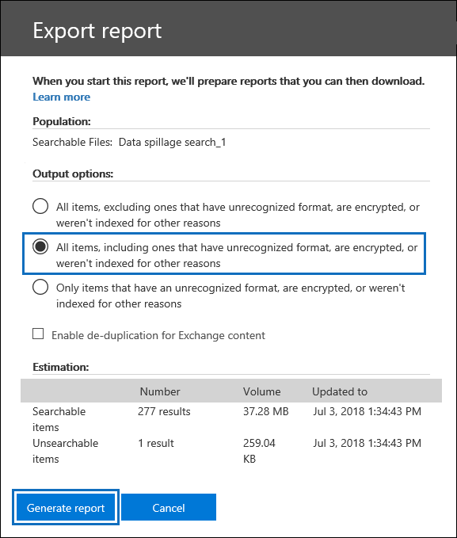

# Serie de soluciones de exhibición de documentos electrónicos: escenario de derrame de datos: búsqueda y purgaeDiscovery solution series: Data spillage scenario - Search and purge

 **¿Qué es el derrame de datos y por qué debe importarle?****What is data spillage and why should you care?** El derrame de datos se hace cuando un documento confidencial se libera en un entorno que no es de confianza.Data spillage is when a confidential document is released into an untrusted environment. Cuando se detecta un incidente de derrame de datos, es importante evaluar rápidamente el tamaño y las ubicaciones del derrame, examinar las actividades del usuario a su alrededor y, a continuación, purgar permanentemente los datos que se han derramado del sistema.When a data spillage incident is detected, it's important to quickly assess the size and locations of the spillage, examine user activities around it,  and then permanently purge the spilled data from the system. 
  
## Escenario de derrame de datosData spillage scenario

Es un responsable de seguridad de la información principal en Contoso.You're a lead information security officer at Contoso. Se le informa de una situación de derrame de datos en la que un empleado compartió sin conocimiento un documento altamente confidencial con varias personas a través del correo electrónico.You are informed of a data spillage situation where an employee unknowingly shared a highly confidential document with multiple people through email. Desea evaluar rápidamente quién recibió este documento de forma interna y externa.You want to quickly assess who received this document internally and externally. Una vez identificado, le gustaría compartir los resultados de casos con otros investigadores para revisar y, a continuación, quitar permanentemente los datos de Office 365.Once identified, you would like to share case findings with other investigators to review, and then permanently remove the data from Office 365. Una vez completada la investigación, desea generar un informe con la evidencia de eliminación permanente y otros detalles del caso para cualquier referencia futura.After the investigation is complete, you want to generate a report with the evidence of permanent removal and other case details for any future reference.
  
### Ámbito de este artículoScope of this article

Este documento proporciona una lista de instrucciones sobre cómo quitar permanentemente un mensaje de Microsoft 365 para que no sea accesible ni recuperable.This document provides a list of instructions on how to permanently remove a message from Microsoft 365 so that it's not accessible or recoverable. Para eliminar un mensaje y hacerlo recuperable hasta que expire el período de retención de elementos eliminados, vea Buscar y eliminar mensajes de correo [electrónico en la organización.](search-for-and-delete-messages-in-your-organization.md)To delete a message and make it recoverable until the deleted item retention period expires, see [Search for and delete email messages in your organization](search-for-and-delete-messages-in-your-organization.md).
  
## Flujo de trabajo para administrar incidentes de derrame de datosWorkflow for managing data spillage incidents

Este es un ejemplo de cómo administrar un incidente de derrame de datos:Here's a how to manage a data spillage incident:

  
[(Opcional) Paso 1: Administrar quién puede acceder al caso y establecer límites de cumplimiento(Optional) Step 1: Manage who can access the case and set compliance boundaries](#optional-step-1-manage-who-can-access-the-case-and-set-compliance-boundaries) 
[Paso 2: Crear un caso de exhibición de documentos electrónicosStep 2: Create an eDiscovery case](#step-2-create-an-ediscovery-case) 
[Paso 3: Buscar los datos derramadosStep 3: Search for the spilled data](#step-3-search-for-the-spilled-data) 
[Paso 4: Revisar y validar los resultados de casosStep 4: Review and validate case findings](#step-4-review-and-validate-case-findings) 
[Paso 5: Usar el registro de seguimiento de mensajes para comprobar cómo se compartieron los datos derramadosStep 5: Use message trace log to check how spilled data was shared](#step-5-use-message-trace-log-to-check-how-spilled-data-was-shared) 
[Paso 6: Preparar los buzonesStep 6: Prepare the mailboxes](#step-6-prepare-the-mailboxes) 
[Paso 7: Eliminar permanentemente los datos derramadosStep 7: Permanently delete the spilled data](#step-7-permanently-delete-the-spilled-data) 
[Paso 8: Comprobar, proporcionar una prueba de eliminación y auditoríaStep 8: Verify, provide a proof of deletion, and audit](#step-8-verify-provide-a-proof-of-deletion-and-audit) 

## Cosas que debe saber antes de empezarThings to know before you start

- Cuando un buzón está en espera, un mensaje eliminado permanece en la carpeta Elementos recuperables hasta que expira el período de retención o se libera la suspensión.When a mailbox is on hold, a deleted message remains in the Recoverable Items folder until the retention period expires or the hold is released. [En el paso 6](#step-6-prepare-the-mailboxes) se describe cómo quitar la retención de los buzones.[Step 6](#step-6-prepare-the-mailboxes) describes how to remove hold from the mailboxes. Consulte con los departamentos legales o de administración de registros antes de quitar la retención.Check with your records management or legal departments before removing the hold. Es posible que la organización tenga una directiva que defina si un buzón de correo en espera o un incidente de derrame de datos tiene prioridad.Your organization might have a policy that defines whether a mailbox on hold or a data spillage incident takes priority. 
    
- Para controlar qué buzones de usuario puede buscar y administrar el investigador de derrame de datos, puede configurar límites de cumplimiento y crear un grupo de roles personalizado, que se describe en el paso [1](#optional-step-1-manage-who-can-access-the-case-and-set-compliance-boundaries).To control which user mailboxes an data spillage investigator can search and manage who can access the case, you can set up compliance boundaries and create a custom role group, which is described in [Step 1](#optional-step-1-manage-who-can-access-the-case-and-set-compliance-boundaries). Para ello, debe ser miembro del grupo de roles Administración de la organización o tener asignado el rol de administración de roles.To do this, you have to be a member of the Organization Management role group or be assigned the role management role. Si usted o el administrador de su organización ya ha establecido límites de cumplimiento, puede omitir el paso 1.If you or in administrator in your organization has already set compliance boundaries, you can skip Step 1.
    
- Para crear un caso, debe ser miembro del grupo de roles administrador de exhibición de documentos electrónicos o ser miembro de un grupo de roles personalizado al que se haya asignado el rol de administración de casos.To create a case, you must be a member of the eDiscovery Manager role group or be a member of a custom role group that's assigned the Case Management role. Si no es miembro, pida a un administrador de Microsoft 365 que le agregue al grupo de roles administrador de [exhibición de documentos electrónicos](assign-ediscovery-permissions.md).If you're not a member, ask a Microsoft 365 administrator to [add you to the eDiscovery manager role group](assign-ediscovery-permissions.md).
    
- Para crear y ejecutar una búsqueda de contenido, tiene que ser miembro del grupo de roles Administrador de eDiscovery o tener asignado el rol de administración Búsqueda de cumplimiento.To create and run a Content Search, you have to be a member of the eDiscovery Manager role group or be assigned the Compliance Search management role. Para eliminar mensajes, tiene que ser miembro del grupo de roles Administración de la organización o tener asignado el rol de administración Búsqueda y eliminación.To delete messages, you have to be a member of the Organization Management role group or be assigned the Search And Purge management role. Para más información sobre cómo agregar usuarios a un grupo de roles, consulte [ Asignar permisos de eDiscovery en el Centro de seguridad y cumplimiento](./assign-ediscovery-permissions.md).For information about adding users to a role group, see [Assign eDiscovery permissions in the Security & Compliance Center](./assign-ediscovery-permissions.md).
    
- Para buscar en las actividades de exhibición de documentos electrónicos del registro de auditoría en el paso 8, la auditoría debe estar activada para su organización.To search the audit log eDiscovery activities in Step 8, auditing must be turned on for your organization. Puede buscar actividades realizadas en los últimos 90 días.You can search for activities that were performed within the last 90 days. Para obtener más información sobre cómo habilitar y usar la auditoría, vea la sección [Auditing the data spillage investigation process](#auditing-the-data-spillage-investigation-process) in Step 8.To learn more about how to enable and use auditing, see the [Auditing the data spillage investigation process](#auditing-the-data-spillage-investigation-process) section in Step 8. 
    
## (Opcional) Paso 1: Administrar quién puede acceder al caso y establecer límites de cumplimiento(Optional) Step 1: Manage who can access the case and set compliance boundaries

Según la práctica organizativa, debe controlar quién puede tener acceso al caso de exhibición de documentos electrónicos usado para investigar un incidente de derrame de datos y configurar límites de cumplimiento.Depending on your organizational practice, you need to control who can access the eDiscovery case used to investigate a data spillage incident and set up compliance boundaries. La forma más sencilla de hacerlo es agregar investigadores como miembros de un grupo de roles existente en el Centro de seguridad y cumplimiento de & y, a continuación, agregar el grupo de roles como miembro del caso de exhibición de documentos electrónicos.The easiest way to do this is to add investigators as members of an existing role group in the Security & Compliance Center and then add the role group as a member of the eDiscovery case. Para obtener información sobre los grupos de roles de exhibición de documentos electrónicos [integrados](assign-ediscovery-permissions.md)y cómo agregar miembros a un caso de exhibición de documentos electrónicos, vea Asignar permisos de exhibición de documentos electrónicos .For information about the built-in eDiscovery role groups and how to add members to an eDiscovery case, see [Assign eDiscovery permissions](assign-ediscovery-permissions.md).
  
También puede crear un nuevo grupo de roles que se alinee con las necesidades de la organización.You can also create a new role group that aligns with your organizational needs. Por ejemplo, es posible que desee que un grupo de investigadores de derrame de datos de la organización acceda y colabore en todos los casos de derrame de datos.For example, you might want a group of data spillage investigators in the organization to access and collaborate on all data spillage cases. Para ello, cree un grupo de roles "Data Spillage Researcher", asigne los roles adecuados (Export, RMS Decrypt, Review, Preview, Compliance Search y Case Management), agregue los investigadores de derrame de datos al grupo de roles y, a continuación, agregue el grupo de roles como miembro del caso de exhibición de documentos electrónicos de derrame de datos.You can do this by creating a "Data Spillage Investigator" role group, assigning the appropriate roles (Export, RMS Decrypt, Review, Preview, Compliance Search, and Case Management), adding the data spillage investigators to the role group, and then adding the role group as a member of the data spillage eDiscovery case. Consulte Configurar límites de cumplimiento para investigaciones de exhibición de documentos electrónicos en [Office 365](tagging-and-assessment-in-advanced-ediscovery.md) para obtener instrucciones detalladas sobre cómo hacerlo.See [Set up compliance boundaries for eDiscovery investigations in Office 365](tagging-and-assessment-in-advanced-ediscovery.md) for detailed instructions on how to do this. 
  
## Paso 2: Crear un caso de exhibición de documentos electrónicosStep 2: Create an eDiscovery case

Un caso de exhibición de documentos electrónicos proporciona una forma eficaz de administrar la investigación de derrame de datos.An eDiscovery case provides an effective way to manage your data spillage investigation. Puede agregar miembros al grupo de roles que creó en el paso 1, agregar el grupo de roles como miembro de un nuevo caso de exhibición de documentos electrónicos, realizar búsquedas iterativas para buscar los datos derramados, exportar un informe para compartir, realizar un seguimiento del estado del caso y, a continuación, consultar los detalles del caso si es necesario.You can add members to the role group that you created in Step 1, add the role group as a member of new a eDiscovery case, perform iterative searches to find the spilled data, export a report to share, track the status of the case, and then refer back to the details of the case if needed. Considere la posibilidad de establecer una convención de nomenclatura para los casos de exhibición de documentos electrónicos usados para incidentes de derrame de datos y proporcione tanta información como pueda en el nombre y la descripción del caso para que pueda localizar y hacer referencia en el futuro si es necesario.Consider establishing a naming convention for eDiscovery cases used for data spillage incidents, and provide as much information as you can in the case name and description so you can locate and refer to in the future if necessary.
  
Para crear un nuevo caso, puede usar la exhibición de documentos electrónicos en el Centro de seguridad y cumplimiento.To create a new case, you can use eDiscovery in the security and compliance center. Vea "Crear un nuevo caso" en [Introducción a la exhibición de](get-started-core-ediscovery.md#step-3-create-a-core-ediscovery-case)documentos electrónicos principal.See "Create a new case" in [Get started with Core eDiscovery](get-started-core-ediscovery.md#step-3-create-a-core-ediscovery-case).
  
## Paso 3: Buscar los datos derramadosStep 3: Search for the spilled data

Ahora que ha creado un caso y el acceso administrado, puede usar el caso para buscar iterativamente los datos que se han derramado e identificar los buzones que contienen los datos derramados.Now that you've created a case and managed access, you can use the case to iteratively search to find the spilled data and identify the mailboxes that contain the spilled data. Usará la misma consulta de búsqueda que usó para buscar los mensajes de correo electrónico para eliminar esos mismos mensajes en el [paso 7](#step-7-permanently-delete-the-spilled-data).You will use the same search query that you used to find the email messages to delete those same messages in [Step 7](#step-7-permanently-delete-the-spilled-data).
  
Para crear una búsqueda de contenido asociada a un caso de exhibición de documentos electrónicos, vea Buscar contenido en un caso de [exhibición de documentos electrónicos principal](search-for-content-in-core-ediscovery.md).To create a content search associated with an eDiscovery case, see [Search for content in a Core eDiscovery case](search-for-content-in-core-ediscovery.md).
  
> [!IMPORTANT]
> Las palabras clave que use en la consulta de búsqueda pueden contener los datos reales que está buscando.The keywords that you use in the search query may contain the actual spilled data that you're searching for. Por ejemplo, si busca documentos que contengan un número de seguridad social y lo usa como palabra clave de búsqueda, debe eliminar la consulta posteriormente para evitar más derrames.For example, if you searching for documents containing a social security number and you use the it as search keyword, you must delete the query afterwards to avoid further spillage. Consulte [Eliminar la consulta de búsqueda](#deleting-the-search-query) en el paso 8.See [Deleting the search query](#deleting-the-search-query) in Step 8.
  
## Paso 4: Revisar y validar los resultados de casosStep 4: Review and validate case findings

Después de crear una búsqueda de contenido, debe revisar y validar que los resultados de la búsqueda y comprobar que solo constan de los mensajes de correo electrónico que deben eliminarse.After you create a content search, you need to review and validate that the search results and verify that they consist only of the email messages that must be deleted. En una búsqueda de contenido, puede obtener una vista previa de un muestreo aleatorio de 1.000 mensajes de correo electrónico sin exportar los resultados de la búsqueda para evitar más derrames de datos.In a content search, you can preview a random sampling of 1,000 email messages without exporting the search results to avoid further data spillage. Puede leer más sobre las limitaciones de vista previa en [Limits for Content Search](limits-for-content-search.md).You can read more about the preview limitations at [Limits for Content Search](limits-for-content-search.md).
  
Si tiene más de 1.000 buzones o más de 100 mensajes de correo electrónico por buzón para revisar, puede dividir la búsqueda inicial en varias búsquedas mediante palabras clave o condiciones adicionales, como intervalo de fechas o remitente/destinatario, y revisar los resultados de cada búsqueda individualmente.If you have more than 1,000 mailboxes or more than 100 email messages per mailbox to review, you can divide the initial search into multiple searches by using additional keywords or conditions such as date range or sender/recipient and review the results of each search individually. Asegúrese de tener en cuenta todas las consultas de búsqueda que se deben usar al eliminar mensajes en el [paso 7](#step-7-permanently-delete-the-spilled-data).Make sure to note down all search queries to use when you delete messages in [Step 7](#step-7-permanently-delete-the-spilled-data).

Si a un administrador o usuario final se le asigna una licencia de Office 365 E5, puede examinar hasta 10 000 resultados de búsqueda a la vez mediante eDiscovery avanzado.If a custodian or end user is assigned an Office 365 E5 license, you can examine up to 10,000 search results at once using Advanced eDiscovery. Si hay más de 10 000 mensajes de correo electrónico que revisar, puede dividir la consulta de búsqueda por intervalo de fechas y revisar cada resultado individualmente a medida que los resultados de la búsqueda se ordenan por fecha.If there are more than 10,000 email messages to review, you can divide the search query by date range and review each result individually as search results are sorted by date. En Exhibición de documentos electrónicos avanzada, puede etiquetar los resultados de la búsqueda mediante la característica **Etiqueta** como en el panel de vista previa y filtrar el resultado de la búsqueda por la etiqueta etiquetada.In Advanced eDiscovery, you can tag search results using the **Label as** feature in the preview panel and filter the search result by the tag you labeled. Esto es útil cuando colaboras con un revisor secundario.This is helpful when you collaborate with a secondary reviewer. Al usar herramientas de análisis adicionales en eDiscovery avanzada, como el reconocimiento óptico de caracteres, el subproceso de correo electrónico y la codificación predictiva, puede procesar y revisar rápidamente miles de mensajes y etiquetarlos para su revisión.By using additional analytics tools in Advanced eDiscovery, such as optical character recognition, email threading, and predictive coding, you can quickly process and review thousands of messages and tag them for further review. Consulte [Configuración rápida para eDiscovery avanzada.](./get-started-with-advanced-ediscovery.md)See [Quick setup for Advanced eDiscovery](./get-started-with-advanced-ediscovery.md).

Cuando encuentre un mensaje de correo electrónico que contenga datos derramados, compruebe los destinatarios del mensaje para determinar si se ha compartido externamente.When you find an email message that contains spilled data, check the recipients of the message to determine if it was shared externally. Para seguir rastreando un mensaje, puede recopilar información del remitente y el intervalo de fechas para que pueda usar los registros de seguimiento de mensajes, que se describen en [el paso 5](#step-5-use-message-trace-log-to-check-how-spilled-data-was-shared).To further trace an message, you can collect sender information and date range so you can use the message trace logs, which is described in [Step 5](#step-5-use-message-trace-log-to-check-how-spilled-data-was-shared).

Después de comprobar los resultados de la búsqueda, es posible que desee compartir los resultados con otros usuarios para una revisión secundaria.After you verified the search results, you may want to share your findings with others for a secondary review. Las personas que asignó al caso en el paso 1 pueden revisar el contenido del caso en eDiscovery y eDiscovery avanzada y aprobar los resultados de casos.People who you assigned to the case in Step 1 can review the case content in both eDiscovery and Advanced eDiscovery and approve case findings. También puede generar un informe sin exportar el contenido real.You can also generate a report without exporting the actual content. También puede usar este mismo informe como prueba de eliminación, que se describe en [el paso 8](#step-8-verify-provide-a-proof-of-deletion-and-audit).You can also use this same report as a proof of deletion, which is described in [Step 8](#step-8-verify-provide-a-proof-of-deletion-and-audit).
  
 **Para generar un informe estadístico:****To generate a statistical report:**
  
1. Vaya a la **página Búsqueda** en el caso de exhibición de documentos electrónicos y haga clic en la búsqueda para la que desea generar un informe.Go to the **Search** page in the eDiscovery case, and click the search that you want to generate a report for. 
    
2. En la página desplegable, haga clic en **Más > Exportar informe**.On the flyout page, click **More > Export report**.
 
      Se muestra la página Exportar informe.The Export report page is displayed.

    
    
3. Seleccione **Todos los elementos, incluidos** los que tienen formato no reconocido, están cifrados o no se indizaron por otros motivos y, a continuación, haga clic en **Generar informe**.Select **All items, including ones that have unrecognized format, are encrypted, or weren't indexed for other reasons** and then click **Generate report**.

4. En el caso de exhibición de documentos electrónicos, haga clic **en Exportar** para mostrar la lista de trabajos de exportación.In the eDiscovery case, click **Export** to display the list of export jobs. Es posible que tenga que hacer clic **en Actualizar** para actualizar la lista para mostrar el trabajo de exportación que acaba de crear.You may have to click **Refresh** to update the list to display the export job you just created.

5. Haga clic en el trabajo de exportación y, a continuación, haga clic **en Descargar** informe en la página desplegable.Click the export job, and then click **Download** report on the flyout page.
 
    

El **informe Exportar resumen** contiene el número de ubicaciones encontradas con los resultados y el tamaño de los resultados de la búsqueda.The **Export Summary** report contains the number of locations found with results and the size of the search results. Puede usar esto para comparar con el informe generado después de la eliminación y proporcionar como prueba de eliminación.You can use this to compare with the report generated after deletion and provide as a proof of deletion. El **informe de** resultados contiene un resumen más detallado de los resultados de la búsqueda, incluidos el asunto, el remitente, los destinatarios, si se leyó el correo electrónico, las fechas y el tamaño de cada mensaje.The **Results** report contains a more detailed summary of the search results, including the subject, sender, recipients, if the email was read, dates, and size of each message. Si alguno de los detalles de este informe contiene los datos reales que se han derramado, asegúrese de eliminar permanentemente el archivo Results.csv una vez completada la investigación.If any of the details in this report contains that actual spilled data, be sure to permanently delete the Results.csv file when the investigation is complete.

Para obtener más información acerca de la exportación de informes, vea [Export a Content Search report](export-a-content-search-report.md).For more information about exporting reports, see [Export a Content Search report](export-a-content-search-report.md).
    
## Paso 5: Usar el registro de seguimiento de mensajes para comprobar cómo se compartieron los datos derramadosStep 5: Use message trace log to check how spilled data was shared

Para investigar aún más si se compartió el correo electrónico con datos filtrados, puede consultar los registros de seguimiento de mensajes con la información del remitente y la información del intervalo de fechas que recopiló en el paso 4.To further investigate if email with spilled data was shared, you can optionally query the message trace logs with the sender information and the date range information that you gathered in Step 4. Tenga en cuenta que el período de retención para el seguimiento de mensajes es de 30 días para los datos en tiempo real y 90 días para los datos históricos.Note that the retention period for message trace is 30 days for real time data and 90 days for historical data.
  
Puede usar el seguimiento de mensajes en el centro de seguridad y cumplimiento o usar los cmdlets correspondientes en Exchange Online PowerShell.You can use Message trace in the security and compliance center or use the corresponding cmdlets in Exchange Online PowerShell. Es importante tener en cuenta que el seguimiento de mensajes no ofrece garantías completas sobre la integridad de los datos devueltos.It's important to note that message tracing doesn't offer full guarantees on the completeness of data returned. Para obtener más información acerca del uso del seguimiento de mensajes, vea:For more information about using Message trace, see: 
  
- [Seguimiento de mensajes en el Centro de seguridad y cumplimientoMessage trace in the Security & Compliance Center](../security/defender-365-security/message-trace-scc.md)
    
- [Nuevo seguimiento de mensajes en el Centro de & seguridadNew Message Trace in Security & Compliance Center](https://blogs.technet.microsoft.com/exchange/2018/05/02/new-message-trace-in-office-365-security-compliance-center/)
    
## Paso 6: Preparar los buzonesStep 6: Prepare the mailboxes

Después de revisar y validar que los resultados de la búsqueda contienen solo los mensajes que deben eliminarse, debe recopilar una lista de las direcciones de correo electrónico de los buzones afectados para usarlos en el paso 7 al eliminar los datos derramados.After you review and validate that the search results contains only the messages that must be deleted, you need to collect a list of the email addresses of the impacted mailboxes to use in Step 7 when you delete the spilled data. Es posible que también tenga que preparar los buzones para poder eliminar permanentemente los mensajes de correo electrónico en función de si la recuperación de elementos únicos está habilitada en los buzones que contienen los datos que se han derramado o si alguno de esos buzones está en espera.You may also have to prepare the mailboxes before you can permanently delete email messages depending on whether single item recovery is enabled on the mailboxes that contain the spilled data or if any of those mailboxes are on hold.
  
### Obtener una lista de direcciones de buzones con datos desbordadosGet a list of addresses of mailboxes with spilled data

Hay dos maneras de recopilar una lista de direcciones de correo electrónico de buzones con datos derramados.There are two ways to collect a list of email addresses of mailboxes with spilled data.

**Opción 1: Obtener una lista de direcciones de buzones con datos derramados****Option 1: Get a list of addresses of mailboxes with spilled data**

1. Abra el caso de exhibición de documentos electrónicos, vaya a la **página Búsqueda** y seleccione la búsqueda de contenido adecuada.Open the eDiscovery case, go to the **Search** page and select the appropriate content search. 
    
2. En la página desplegable, haga clic **en Ver resultados**.On the flyout page, click **View results**.
    
3. En la lista desplegable de **resultados individuales**, haga clic en **Estadísticas de búsqueda**.In the **Individual results** drop down list, click **Search statistics**.
    
4. En la lista desplegable **Tipo,** haga clic **en Ubicaciones superiores.**In the **Type** drop down list, click **Top locations**.
    
    

    Se muestra una lista de buzones que contienen resultados de búsqueda.A list of mailboxes that contain search results is displayed. También se muestra el número de elementos de cada buzón que coinciden con la consulta de búsqueda.The number of items in each mailbox that match the search query is also displayed.
    
5. Copie la información de la lista y guárdela en un archivo o haga clic en Descargar **para** descargar la información en un archivo CSV.Copy the information in the list and save it to a file or click **Download** to download the information to a CSV file. 
    
**Opción 2: Obtener ubicaciones de buzones del informe de exportación****Option 2: Get mailbox locations from the export report**

Abra el informe Exportar resumen que descargó en [el paso 4](#step-4-review-and-validate-case-findings).Open the Export Summary report that you downloaded in [Step 4](#step-4-review-and-validate-case-findings). En la primera columna del informe, la dirección de correo electrónico de cada buzón aparece en **Ubicaciones**.In the first column in the report, the email address of each mailbox is listed under **Locations**.
  
### Preparar los buzones para poder eliminar los datos derramadosPrepare the mailboxes so you can delete the spilled data

Si se habilita la recuperación de un solo elemento o si se coloca un buzón en espera, se conservará un mensaje eliminado (purgado) permanentemente en la carpeta Elementos recuperables.If single item recovery is enabled or if a mailbox is placed on hold, a permanently deleted (purged) message will be retained in Recoverable Items folder. Por lo tanto, antes de poder purgar datos derramados, debe comprobar las configuraciones de buzones existentes y deshabilitar la recuperación de elementos únicos y quitar cualquier directiva de retención o retención.So before you can purge spilled data, you need to check the existing mailbox configurations and disable single item recovery and remove any hold or retention policy. Tenga en cuenta que puede preparar un buzón a la vez y, a continuación, ejecutar el mismo comando en distintos buzones o crear un script de PowerShell para preparar varios buzones al mismo tiempo.Keep in mind that you can prepare one mailbox at a time, and then run the same command on different mailboxes or create a PowerShell script to prepare multiple mailboxes at the same time.

- Vea "Paso 1: Recopilar información  sobre el buzón" en Eliminar elementos de la carpeta Elementos recuperables de buzones basados en la nube en espera para obtener instrucciones sobre cómo comprobar si la recuperación de elementos únicos está habilitada o si el buzón está en espera o está asignado a una directiva de retención.See "Step 1: Collect information about the mailbox" in [Delete items in the Recoverable Items folder of cloud-based mailboxes on hold](delete-items-in-the-recoverable-items-folder-of-mailboxes-on-hold.md#step-1-collect-information-about-the-mailbox) for instructions about how to check if single item recovery is enabled or if the mailbox is placed on hold or it's assigned to a retention policy. 

- Vea "Paso 2: Preparar  el buzón" en Eliminar elementos de la carpeta Elementos recuperables de buzones basados en la nube en espera para obtener instrucciones sobre cómo deshabilitar la recuperación de elementos individuales.See "Step 2: Prepare the mailbox" in [Delete items in the Recoverable Items folder of cloud-based mailboxes on hold](delete-items-in-the-recoverable-items-folder-of-mailboxes-on-hold.md#step-2-prepare-the-mailbox) for instructions about disabling single item recovery. 

- Vea "Paso 3: Quitar todas las  retenciones del buzón" en Eliminar elementos de la carpeta Elementos recuperables de buzones basados en la nube en espera para obtener instrucciones sobre cómo quitar una directiva de retención o retención de un buzón.See "Step 3: Remove all holds from the mailbox" in [Delete items in the Recoverable Items folder of cloud-based mailboxes on hold](delete-items-in-the-recoverable-items-folder-of-mailboxes-on-hold.md#step-3-remove-all-holds-from-the-mailbox) for instructions about how to remove a hold or retention policy from a mailbox. 

- Vea "Paso 4: Quitar la retención  de retraso del buzón" en Eliminar elementos de la carpeta Elementos recuperables de buzones basados en la nube en espera para obtener instrucciones sobre cómo quitar la retención de retraso que se coloca en el buzón después de quitar cualquier tipo de retención.See "Step 4: Remove the delay hold from the mailbox" in [Delete items in the Recoverable Items folder of cloud-based mailboxes on hold](delete-items-in-the-recoverable-items-folder-of-mailboxes-on-hold.md#step-4-remove-the-delay-hold-from-the-mailbox) for instructions about removing the delay hold that is placed on the mailbox after any type of hold is removed.

> [!IMPORTANT]
> Consulte con los departamentos legales o de administración de registros antes de quitar una directiva de retención o retención.Check with your records management or legal departments before removing a hold or retention policy. Su organización puede tener una directiva que defina si un buzón de correo en espera o un incidente de derrame de datos tiene prioridad.Your organization may have a policy that defines whether a mailbox on hold or a data spillage incident takes priority. 
  
Asegúrese de revertir el buzón a configuraciones anteriores después de comprobar que los datos se han eliminado de forma permanente.Be sure to revert the mailbox to previous configurations after you verify that the spilled data has been permanently deleted. Vea los detalles del [paso 7](#step-7-permanently-delete-the-spilled-data).See the details in [Step 7](#step-7-permanently-delete-the-spilled-data).

## Paso 7: Eliminar permanentemente los datos derramadosStep 7: Permanently delete the spilled data

Con las ubicaciones de buzones de correo que recopiló y preparó en el paso 6 y la consulta de búsqueda que se creó y refinó en el paso 3 para buscar mensajes de correo electrónico que contengan los datos derramados, ahora puede eliminar permanentemente los datos derramados.Using the mailbox locations that you collected and prepared in Step 6 and the search query that was created and refined in Step 3 to find email messages that contain the spilled data, you can now permanently delete the spilled data.  Como se explicó anteriormente, para eliminar mensajes, debe ser miembro del grupo de roles Administración de la organización o tener asignado el rol de administración Buscar y purgar.As previously explained, to delete messages, you have to be a member of the Organization Management role group or be assigned the Search And Purge management role. Para más información sobre cómo agregar usuarios a un grupo de roles, consulte [ Asignar permisos de eDiscovery en el Centro de seguridad y cumplimiento](./assign-ediscovery-permissions.md).For information about adding users to a role group, see [Assign eDiscovery permissions in the Security & Compliance Center](./assign-ediscovery-permissions.md).

Para eliminar los mensajes derramados, consulte los pasos 2 & 3 en [Buscar y eliminar mensajes de correo electrónico](./search-for-and-delete-messages-in-your-organization.md)To delete the spilled messages, see steps 2 & 3 in [Search for and delete email messages](./search-for-and-delete-messages-in-your-organization.md)

> [!IMPORTANT]
> Los elementos de correo electrónico en un conjunto de revisiones en un caso de eDiscovery avanzado no se pueden eliminar utilizando los procedimientos de este artículo.Email items in a review set in an Advanced eDiscovery case can't be deleted by using the procedures in this article. Esto se debe a que los elementos de un conjunto de revisión son copias de elementos del servicio en directo que se copian y almacenan en una ubicación de Azure Storage.That's because items in a review set are copies of items in the live service that are copied and stored in an Azure Storage location. Esto significa que no se devolverán mediante una búsqueda de contenido que cree en el paso 3.This means they won't be returned by a content search that you create in Step 3. Para eliminar elementos en un conjunto de revisiones, tiene que eliminar el caso de eDiscovery avanzado que contiene el conjunto de revisiones.To delete items in a review set, you have to delete the Advanced eDiscovery case that contains the review set. Para más información, consulte [Cerrar o eliminar un caso de eDiscovery avanzado](close-or-delete-case.md).For more information, see [Close or delete an Advanced eDiscovery case](close-or-delete-case.md).
  
## Paso 8: Comprobar, proporcionar una prueba de eliminación y auditoríaStep 8: Verify, provide a proof of deletion, and audit

El último paso del flujo de trabajo para administrar un incidente de derrame de datos es comprobar que los datos derramados se quitaron permanentemente del buzón yendo al caso de exhibición de documentos electrónicos y ejecutando de nuevo la misma consulta de búsqueda que se usó para eliminar los datos para confirmar que no se devuelve ningún resultado.The final step in the workflow to manage a data spillage incident is to verify that the spilled data was permanently removed from the mailbox by going to the eDiscovery case and re-running the same search query that was used to delete that data to confirm that no results are returned. Después de confirmar que los datos se han quitado permanentemente, puede exportar un informe e incluirlo (junto con el informe original) como prueba de eliminación.After you confirm the spilled data has been permanently removed, you can export a report and include it (along with the original report) as a proof of deletion. A [continuación, puede cerrar el caso,](close-reopen-delete-core-ediscovery-cases.md) lo que le permitirá volver a abrirlo si lo ha hecho en el futuro.Then you can [close the case](close-reopen-delete-core-ediscovery-cases.md) which will allow you to re-open it if you have refer to it in the future. Además, también puede revertir los buzones a su estado anterior, eliminar la consulta de búsqueda usada para buscar los datos derramados y buscar registros de auditoría de las tareas realizadas al administrar el incidente de derrame de datos.Additionally, you can also revert mailboxes to their previous state, delete the search query used to find the spilled data, and search for auditing records of tasks performed when managing the data spillage incident.
  
### Revertir los buzones a su estado anteriorReverting the mailboxes to their previous state

Si cambió cualquier configuración de buzón en el paso 6 para preparar los buzones antes de que se eliminaran los datos derramados, tendrá que revertirlos a su estado anterior.If you changed any mailbox configuration in Step 6 to prepare the mailboxes before the spilled data was deleted, you will need to revert them to their previous state. Vea "Paso 6: Revertir el buzón a su estado anterior" en Eliminar elementos de la carpeta Elementos recuperables de buzones basados en la [nube en espera.](delete-items-in-the-recoverable-items-folder-of-mailboxes-on-hold.md#step-6-revert-the-mailbox-to-its-previous-state)See "Step 6: Revert the mailbox to its previous state" in [Delete items in the Recoverable Items folder of cloud-based mailboxes on hold](delete-items-in-the-recoverable-items-folder-of-mailboxes-on-hold.md#step-6-revert-the-mailbox-to-its-previous-state).
  
### Eliminación de la consulta de búsquedaDeleting the search query

Si las palabras clave de la consulta de búsqueda que creó y usó en el paso 3 contienen algunos de los datos reales que se han derramado, debe eliminar la consulta de búsqueda para evitar que se derramen más datos.If the keywords in the search query that you created and used in Step 3 contains some of all of the actual spilled data, you should delete the search query to prevent further data spillage.
  
1. En el Centro de seguridad y cumplimiento, abra el caso de exhibición de documentos electrónicos, vaya a la **página** Búsqueda y seleccione la búsqueda de contenido adecuada.In the security and compliance center, open the eDiscovery case, go to the **Search** page, and select the appropriate content search.
    
2. En la página desplegable, haga clic en **Eliminar**.On the flyout page, click **Delete**.

    
    
### Auditoría del proceso de investigación de derrame de datosAuditing the data spillage investigation process

Puede buscar en el registro de auditoría las actividades de exhibición de documentos electrónicos que se realizaron durante la investigación.You can search the audit log for the eDiscovery activities that were performed during the investigation. También puede buscar en el registro de auditoría para devolver los registros de auditoría del comando **New-ComplianceSearchAction -Purge** que ejecutó en el paso 7 para eliminar los datos derramados.You can also search the audit log to return the audit records for the **New-ComplianceSearchAction -Purge** command that you ran in Step 7 to delete the spilled data. Para más información, vea:For more information, see:

- [Buscar en el registro de auditoríaSearch the audit log](search-the-audit-log-in-security-and-compliance.md)

- [Buscar actividades de eDiscovery en el registro de auditoríaSearch for eDiscovery activities in the audit log](search-for-ediscovery-activities-in-the-audit-log.md)
