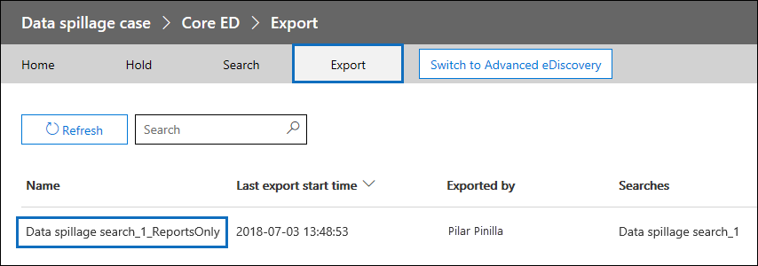

# Serie de soluciones de exhibición de documentos electrónicos: escenario de pérdida de datos: búsqueda y depuración

 **¿Qué es el derrame de datos y por qué debería interesarse?** El derrame de datos se hace cuando se libera un documento confidencial en un entorno que no es de confianza. Cuando se detecta un incidente de desbordamiento de datos, es importante evaluar rápidamente el tamaño y las ubicaciones del derrame, examinar las actividades del usuario a su alrededor y, a continuación, purgar de forma permanente los datos que se han desbordado del sistema. 
  
## Escenario de pérdida de datos

Es responsable de seguridad de la información en Contoso. Se le informa de una situación de pérdida de datos en la que, sin saberlo, un empleado compartió un documento extremadamente confidencial con varias personas a través del correo electrónico. Desea evaluar rápidamente quién recibió este documento interna y externamente. Una vez identificado, le gustaría compartir los resultados de casos con otros investigadores para revisar y, a continuación, quitar permanentemente los datos de Office 365. Una vez completada la investigación, desea generar un informe con la evidencia de eliminación permanente y otros detalles del caso para cualquier referencia futura.
  
### Ámbito de este artículo

Este documento proporciona una lista de instrucciones sobre cómo quitar permanentemente un mensaje de Microsoft 365 para que no sea accesible o recuperable. Para eliminar un mensaje y hacer que sea recuperable hasta que expire el período de retención de elementos eliminados, vea Buscar y eliminar mensajes de correo electrónico [en su organización.](search-for-and-delete-messages-in-your-organization.md)
  
## Flujo de trabajo para administrar incidentes de pérdida de datos

Este es un ejemplo de cómo administrar un incidente de pérdida de datos:

  
[(Opcional) Paso 1: Administrar quién puede tener acceso al caso y establecer límites de cumplimiento](#optional-step-1-manage-who-can-access-the-case-and-set-compliance-boundaries) 
[Paso 2: Crear un caso de exhibición de documentos electrónicos](#step-2-create-an-ediscovery-case) 
[Paso 3: Buscar los datos desbordados](#step-3-search-for-the-spilled-data) 
[Paso 4: Revisar y validar los resultados de casos](#step-4-review-and-validate-case-findings) 
[Paso 5: Usar el registro de seguimiento de mensajes para comprobar cómo se compartieron los datos desbordados](#step-5-use-message-trace-log-to-check-how-spilled-data-was-shared) 
[Paso 6: Preparar los buzones](#step-6-prepare-the-mailboxes) 
[Paso 7: Eliminar permanentemente los datos que se han desbordado](#step-7-permanently-delete-the-spilled-data) 
[Paso 8: Comprobar, proporcionar una prueba de eliminación y auditoría](#step-8-verify-provide-a-proof-of-deletion-and-audit) 

## Cosas que debe saber antes de empezar

- Cuando un buzón está en suspensión, un mensaje eliminado permanece en la carpeta Elementos recuperables hasta que expira el período de retención o se libera la retención. [En el paso 6](#step-6-prepare-the-mailboxes) se describe cómo quitar la retención de los buzones. Consulte con los departamentos legales o de administración de registros antes de quitar la retención. Es posible que su organización tenga una directiva que defina si un buzón de correo en espera o un incidente de pérdida de datos tiene prioridad. 
    
- Para controlar qué buzones de usuario un investigador de pérdida de datos puede buscar y administrar quién puede tener acceso al caso, puede configurar límites de cumplimiento y crear un grupo de roles personalizado, que se describe en el paso [1.](#optional-step-1-manage-who-can-access-the-case-and-set-compliance-boundaries) Para ello, debe ser miembro del grupo de roles Administración de la organización o tener asignado el rol de administración de roles. Si usted o el administrador de su organización ya ha establecido límites de cumplimiento, puede omitir el paso 1.
    
- Para crear un caso, debe ser miembro del grupo de roles administrador de exhibición de documentos electrónicos o ser miembro de un grupo de roles personalizado que tenga asignada la función Administración de casos. Si no es miembro, pida a un administrador de Microsoft 365 que lo agregue al grupo de roles de administrador de [exhibición de documentos electrónicos.](assign-ediscovery-permissions.md)
    
- Para crear y ejecutar una búsqueda de contenido, tiene que ser miembro del grupo de roles Administrador de eDiscovery o tener asignado el rol de administración Búsqueda de cumplimiento. Para eliminar mensajes, tiene que ser miembro del grupo de roles Administración de la organización o tener asignado el rol de administración Búsqueda y eliminación. Para más información sobre cómo agregar usuarios a un grupo de roles, consulte [ Asignar permisos de eDiscovery en el Centro de seguridad y cumplimiento](https://docs.microsoft.com/microsoft-365/compliance/assign-ediscovery-permissions).
    
- Para buscar las actividades de exhibición de documentos electrónicos del registro de auditoría en el paso 8, la auditoría debe estar activada para su organización. Puede buscar actividades realizadas en los últimos 90 días. Para obtener más información sobre cómo habilitar  y usar la auditoría, vea la sección Auditoría del proceso de investigación de pérdida de datos en el paso 8. 
    
## (Opcional) Paso 1: Administrar quién puede tener acceso al caso y establecer límites de cumplimiento

Según la práctica de la organización, debe controlar quién puede tener acceso al caso de exhibición de documentos electrónicos usado para investigar un incidente de pérdida de datos y establecer límites de cumplimiento. La forma más sencilla de hacerlo es agregar investigadores como miembros de un grupo de roles existente en el Centro de seguridad y cumplimiento de & y, a continuación, agregar el grupo de roles como miembro del caso de exhibición de documentos electrónicos. Para obtener información sobre los grupos de roles de exhibición de documentos electrónicos integrados y cómo agregar miembros a un caso de exhibición de documentos electrónicos, vea Asignar permisos de [exhibición de documentos electrónicos.](assign-ediscovery-permissions.md)
  
También puede crear un nuevo grupo de roles que se alinee con las necesidades de su organización. Por ejemplo, es posible que desee que un grupo de investigadores de pérdida de datos de la organización accedan y colaboren en todos los casos de pérdida de datos. Para ello, cree un grupo de roles "Investigación de desbordamiento de datos", asigne los roles adecuados (Exportar, Descifrar RMS, Revisar, Vista previa, Búsqueda de cumplimiento y Administración de casos), agregue los investigadores de derrame de datos al grupo de roles y, a continuación, agregue el grupo de roles como miembro del caso de exhibición de documentos electrónicos de pérdida de datos. Consulte Configurar límites de cumplimiento para investigaciones de exhibición de documentos electrónicos en [Office 365](tagging-and-assessment-in-advanced-ediscovery.md) para obtener instrucciones detalladas sobre cómo hacerlo. 
  
## Paso 2: Crear un caso de exhibición de documentos electrónicos

Un caso de exhibición de documentos electrónicos proporciona una forma eficaz de administrar la investigación de los derrames de datos. Puede agregar miembros al grupo de roles que creó en el paso 1, agregar el grupo de roles como miembro de un nuevo caso de exhibición de documentos electrónicos, realizar búsquedas iterativas para encontrar los datos sobresaltos, exportar un informe para compartir, realizar un seguimiento del estado del caso y, a continuación, volver a consultar los detalles del caso si es necesario. Considere la posibilidad de establecer una convención de nomenclatura para los casos de exhibición de documentos electrónicos usados para incidentes de pérdida de datos y proporcione toda la información que pueda en el nombre y la descripción del caso para que pueda localizar y hacer referencia a estos en el futuro si es necesario.
  
Para crear un nuevo caso, puede usar la exhibición de documentos electrónicos en el centro de seguridad y cumplimiento. Vea "Crear un nuevo caso" en casos [de exhibición de documentos electrónicos.](ediscovery-cases.md#step-2-create-a-new-case)
  
## Paso 3: Buscar los datos desbordados

Ahora que ha creado un caso y un acceso administrado, puede usar el caso para buscar de forma iterativa los datos que se han desbordado e identificar los buzones que contienen los datos que se han desbordado. Usará la misma consulta de búsqueda que usó para buscar los mensajes de correo electrónico para eliminar esos mismos mensajes en el [paso 7.](#step-7-permanently-delete-the-spilled-data)
  
Para crear una búsqueda de contenido asociada a un caso de exhibición de documentos electrónicos, vea "Crear y ejecutar una búsqueda de contenido asociada a un caso" en casos [de exhibición de documentos electrónicos.](ediscovery-cases.md#step-5-create-and-run-a-content-search-associated-with-a-case)
  
 **Importante:** Las palabras clave que use en la consulta de búsqueda pueden contener los datos desbordados reales que está buscando. Por ejemplo, si busca documentos que contengan un número de la seguridad social y lo usa como palabra clave de búsqueda, debe eliminar la consulta posteriormente para evitar más derrames. Vea [Eliminar la consulta de búsqueda](#deleting-the-search-query) en el paso 8. 
  
## Paso 4: Revisar y validar los resultados de casos

Después de crear una búsqueda de contenido, debe revisar y validar que los resultados de la búsqueda y comprobar que solo constan de los mensajes de correo electrónico que deben eliminarse. En una búsqueda de contenido, puede obtener una vista previa de un muestreo aleatorio de 1.000 mensajes de correo electrónico sin exportar los resultados de la búsqueda para evitar más pérdidas de datos. Puede obtener más información sobre las limitaciones de la versión preliminar en [Límites para la búsqueda de contenido.](limits-for-content-search.md)
  
Si tiene más de 1.000 buzones o más de 100 mensajes de correo electrónico por buzón para revisar, puede dividir la búsqueda inicial en varias búsquedas mediante palabras clave o condiciones adicionales, como intervalo de fechas o remitente o destinatario, y revisar los resultados de cada búsqueda individualmente. Asegúrese de tener en cuenta todas las consultas de búsqueda que se usarán al eliminar mensajes en el [paso 7.](#step-7-permanently-delete-the-spilled-data)

Si se asigna una licencia de Office 365 E5 a un administrador o usuario final, puede examinar hasta 10 000 resultados de búsqueda a la vez con eDiscovery avanzado. Si hay más de 10 000 mensajes de correo electrónico para revisar, puede dividir la consulta de búsqueda por intervalo de fechas y revisar cada resultado individualmente a medida que los resultados de la búsqueda se ordenan por fecha. En eDiscovery avanzado, puede etiquetar  los resultados de la búsqueda con la etiqueta como característica en el panel de vista previa y filtrar el resultado de la búsqueda por la etiqueta etiquetada. Esto resulta útil cuando colabora con un revisor secundario. Al usar herramientas de análisis adicionales en eDiscovery avanzado, como reconocimiento óptico de caracteres, subprocesos de correo electrónico y codificación predictiva, puede procesar y revisar rápidamente miles de mensajes y etiquetarlos para su revisión. Vea [Configuración rápida de eDiscovery avanzado.](quick-setup-for-advanced-ediscovery.md)

Cuando encuentre un mensaje de correo electrónico que contenga datos desbordados, compruebe los destinatarios del mensaje para determinar si se compartió externamente. Para seguir rastreando un mensaje, puede recopilar información del remitente y el intervalo de fechas para poder usar los registros de seguimiento de mensajes, que se describen en el [paso 5](#step-5-use-message-trace-log-to-check-how-spilled-data-was-shared).

Después de comprobar los resultados de la búsqueda, es posible que desee compartir los resultados con otros usuarios para una revisión secundaria. Las personas que asignó al caso en el paso 1 pueden revisar el contenido del caso en eDiscovery y eDiscovery avanzado y aprobar los resultados de casos. También puede generar un informe sin exportar el contenido real. También puede usar este mismo informe como prueba de eliminación, que se describe en el [paso 8.](#step-8-verify-provide-a-proof-of-deletion-and-audit)
  
 **Para generar un informe estadístico:**
  
1. Vaya a la **página de** búsqueda en el caso de eDiscovery y haga clic en la búsqueda para la que desea generar un informe. 
    
2. En la página desplegable, haga clic en **Más > Exportar informe.**
 
      Se muestra la página Exportar informe.

    
    
3. Seleccione **Todos los elementos, incluidos** los que tienen un formato no reconocido, están cifrados o no se indexaron por otros motivos y, a continuación, haga clic en **Generar informe.**

4. En el caso de eDiscovery, haga clic **en Exportar** para mostrar la lista de trabajos de exportación. Es posible que tenga que hacer clic **en Actualizar** para actualizar la lista y mostrar el trabajo de exportación que acaba de crear.

5. Haga clic en el trabajo de exportación y, a continuación, haga **clic en Descargar** informe en la página desplegable.
 
    

El **informe de resumen de** exportación contiene el número de ubicaciones encontradas con los resultados y el tamaño de los resultados de la búsqueda. Puede usarlo para comparar con el informe generado después de la eliminación y proporcionar como una prueba de eliminación. El **informe de** resultados contiene un resumen más detallado de los resultados de la búsqueda, incluido el asunto, el remitente, los destinatarios, si se leyó el correo electrónico, las fechas y el tamaño de cada mensaje. Si alguno de los detalles de este informe contiene los datos reales que se han desbordado, asegúrese de eliminar de forma permanente el archivo Results.csv una vez completada la investigación.

Para obtener más información acerca de la exportación de informes, vea [Exportar un informe de búsqueda de contenido.](export-a-content-search-report.md)
    
## Paso 5: Usar el registro de seguimiento de mensajes para comprobar cómo se compartieron los datos desbordados

Para investigar si se compartió el correo electrónico con datos desbordados, puede consultar opcionalmente los registros de seguimiento de mensajes con la información del remitente y la información del intervalo de fechas que recopile en el paso 4. Tenga en cuenta que el período de retención para el seguimiento de mensajes es de 30 días para los datos en tiempo real y de 90 días para los datos históricos.
  
Puede usar el seguimiento de mensajes en el Centro de seguridad y cumplimiento o usar los cmdlets correspondientes en Exchange Online PowerShell. Es importante tener en cuenta que el seguimiento de mensajes no ofrece garantías completas sobre la integridad de los datos devueltos. Para obtener más información acerca del uso del seguimiento de mensajes, vea: 
  
- [Seguimiento de mensajes en el Centro de seguridad y cumplimiento](https://docs.microsoft.com/microsoft-365/security/office-365-security/message-trace-scc)
    
- [Nuevo seguimiento de mensajes en el Centro de & cumplimiento](https://blogs.technet.microsoft.com/exchange/2018/05/02/new-message-trace-in-office-365-security-compliance-center/)
    
## Paso 6: Preparar los buzones

Después de revisar y validar que los resultados de la búsqueda contienen solo los mensajes que deben eliminarse, debe recopilar una lista de las direcciones de correo electrónico de los buzones afectados que se usarán en el paso 7 al eliminar los datos que se han desbordado. Es posible que también tenga que preparar los buzones para poder eliminar permanentemente los mensajes de correo electrónico en función de si la recuperación de elementos individuales está habilitada en los buzones que contienen los datos que se han desbordado o si alguno de esos buzones está en retención.
  
### Obtener una lista de direcciones de buzones con datos desbordados

Hay dos formas de recopilar una lista de direcciones de correo electrónico de buzones de correo con datos desbordados.

**Opción 1: Obtener una lista de direcciones de buzones con datos desbordados**

1. Abra el caso de eDiscovery, vaya a la **página de** búsqueda y seleccione la búsqueda de contenido adecuada. 
    
2. En la página desplegable, haga clic **en Ver resultados.**
    
3. En la lista desplegable de **resultados individuales**, haga clic en **Estadísticas de búsqueda**.
    
4. En la **lista desplegable** Tipo, haga clic en **Ubicaciones superiores.**
    
    

    Se muestra una lista de buzones que contienen resultados de búsqueda. También se muestra el número de elementos de cada buzón que coinciden con la consulta de búsqueda.
    
5. Copie la información de la lista y  guárdela en un archivo o haga clic en Descargar para descargar la información en un archivo CSV. 
    
**Opción 2: Obtener ubicaciones de buzones del informe de exportación**

Abra el informe de resumen de exportación que descargó en el [paso 4.](#step-4-review-and-validate-case-findings) En la primera columna del informe, la dirección de correo electrónico de cada buzón aparece en **Ubicaciones**.
  
### Preparar los buzones para que pueda eliminar los datos que se han desbordado

Si la recuperación de un solo elemento está habilitada o si se coloca un buzón en retención, se conservará un mensaje eliminado permanentemente (purgado) en la carpeta Elementos recuperables. Por lo tanto, para poder purgar los datos que se han desbordado, debe comprobar las configuraciones de buzón existentes, deshabilitar la recuperación de elementos individuales y quitar cualquier directiva de retención o retención. Tenga en cuenta que puede preparar un buzón cada vez y, a continuación, ejecutar el mismo comando en buzones diferentes o crear un script de PowerShell para preparar varios buzones al mismo tiempo.

- Consulte el "Paso 1: Recopilar información sobre el buzón" en Eliminar elementos de la carpeta Elementos recuperables de buzones de correo basados en la nube en espera para obtener instrucciones sobre cómo comprobar si la recuperación de elementos [individuales](delete-items-in-the-recoverable-items-folder-of-mailboxes-on-hold.md#step-1-collect-information-about-the-mailbox) está habilitada o si el buzón está en suspensión o está asignado a una directiva de retención. 

- Consulte el "Paso 2:  Preparar el buzón" en Eliminar elementos de la carpeta Elementos recuperables de los buzones de correo basados en la nube en espera para obtener instrucciones sobre cómo deshabilitar la recuperación de elementos individuales. 

- Consulte "Paso 3: Quitar todas las  retenciones del buzón" en Eliminar elementos de la carpeta Elementos recuperables de los buzones de correo basados en la nube en espera para obtener instrucciones sobre cómo quitar una retención o directiva de retención de un buzón. 

- Consulte "Paso 4: Quitar la retención  con retraso del buzón" en Eliminar elementos de la carpeta Elementos recuperables de los buzones de correo basados en la nube en espera para obtener instrucciones sobre cómo quitar la retención retrasada que se coloca en el buzón después de quitar cualquier tipo de retención.

> [!IMPORTANT]
> Consulte con los departamentos legales o de administración de registros antes de quitar una directiva de retención o retención. Es posible que su organización tenga una directiva que defina si un buzón de correo en espera o un incidente de pérdida de datos tiene prioridad. 
  
Asegúrese de revertir el buzón a configuraciones anteriores después de comprobar que los datos que se han desbordado se han eliminado permanentemente. Vea los detalles del [paso 7.](#step-7-permanently-delete-the-spilled-data)

## Paso 7: Eliminar permanentemente los datos que se han desbordado

Con las ubicaciones de buzones que recopiló y preparó en el paso 6 y la consulta de búsqueda que se creó y refinó en el paso 3 para buscar mensajes de correo electrónico que contengan los datos que se han desbordado, ahora puede eliminar permanentemente los datos que se han desbordado.  Como se ha explicado anteriormente, para eliminar mensajes, debe ser miembro del grupo de roles Administración de la organización o tener asignado el rol de administración Buscar y purgar. Para más información sobre cómo agregar usuarios a un grupo de roles, consulte [ Asignar permisos de eDiscovery en el Centro de seguridad y cumplimiento](https://docs.microsoft.com/microsoft-365/compliance/assign-ediscovery-permissions).

Para eliminar los mensajes que se han desbordado, consulte los pasos 2 & 3 en [Buscar y eliminar mensajes de correo electrónico](https://docs.microsoft.com/microsoft-365/compliance/search-for-and-delete-messages-in-your-organization)

> [!IMPORTANT]
> Los elementos de correo electrónico en un conjunto de revisiones en un caso de eDiscovery avanzado no se pueden eliminar utilizando los procedimientos de este artículo. Esto se debe a que los elementos de un conjunto de revisión son copias de elementos del servicio en directo que se copian y almacenan en una ubicación de Azure Storage. Esto significa que no se devolverán mediante una búsqueda de contenido que cree en el paso 3. Para eliminar elementos en un conjunto de revisiones, tiene que eliminar el caso de eDiscovery avanzado que contiene el conjunto de revisiones. Para más información, consulte [Cerrar o eliminar un caso de eDiscovery avanzado](close-or-delete-case.md).
  
## Paso 8: Comprobar, proporcionar una prueba de eliminación y auditoría

El último paso del flujo de trabajo para administrar un incidente de pérdida de datos es comprobar que los datos que se han desbordado se quitaron permanentemente del buzón yendo al caso de exhibición de documentos electrónicos y ejecutando de nuevo la misma consulta de búsqueda que se usó para eliminar los datos para confirmar que no se devuelven resultados. Después de confirmar que los datos se han eliminado permanentemente, puede exportar un informe e incluirlo (junto con el informe original) como prueba de eliminación. A [continuación, puede cerrar el caso,](ediscovery-cases.md#optional-step-9-close-a-case)lo que le permitirá volver a abrirlo si lo ha hecho en el futuro. Además, también puede revertir los buzones a su estado anterior, eliminar la consulta de búsqueda usada para encontrar los datos que se han desbordado y buscar registros de auditoría de las tareas realizadas al administrar el incidente de pérdida de datos. 
  
### Revertir los buzones a su estado anterior

Si cambió alguna configuración de buzón en el paso 6 para preparar los buzones antes de que se eliminaran los datos desbordados, tendrá que revertirlos a su estado anterior. Consulte "Paso 6: Revertir el buzón a su estado anterior" en Eliminar elementos de la carpeta Elementos recuperables de buzones basados en la nube [en espera.](delete-items-in-the-recoverable-items-folder-of-mailboxes-on-hold.md#step-6-revert-the-mailbox-to-its-previous-state)
  
### Eliminación de la consulta de búsqueda

Si las palabras clave de la consulta de búsqueda que creó y usó en el paso 3 contienen algunos de los datos desbordados reales, debe eliminar la consulta de búsqueda para evitar más derrames de datos.
  
1. En el Centro de seguridad y cumplimiento, abra  el caso de eDiscovery, vaya a la página de búsqueda y seleccione la búsqueda de contenido adecuada.
    
2. En la página desplegable, haga clic **en Eliminar**.

    
    
### Auditoría del proceso de investigación de pérdida de datos

Puede buscar en el registro de auditoría las actividades de exhibición de documentos electrónicos realizadas durante la investigación. También puede buscar en el registro de auditoría para devolver los registros de auditoría del comando **New-ComplianceSearchAction -Purge** que ejecutó en el paso 7 para eliminar los datos desbordados. Para obtener más información, vea:

- [Buscar en el registro de auditoría](search-the-audit-log-in-security-and-compliance.md)

- [Buscar actividades de eDiscovery en el registro de auditoría](search-for-ediscovery-activities-in-the-audit-log.md)
  
