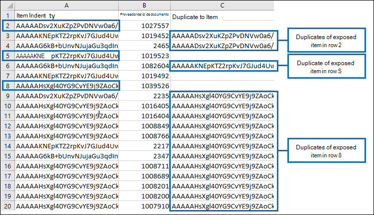

# Desduplicación en los resultados de búsqueda de eDiscovery

En este artículo se describe cómo funciona la desduplicación de los resultados de búsqueda de exhibición de documentos electrónicos y se explican las limitaciones del algoritmo de desduplicación.
  
Al usar herramientas de exhibición de documentos electrónicos para exportar los resultados de una búsqueda de exhibición de documentos electrónicos, tiene la opción de desduplicar los resultados exportados. ¿Qué significa esto? Cuando habilita la desduplicación (de forma predeterminada, la desduplicación no está habilitada), solo se exporta una copia de un mensaje de correo electrónico aunque se hayan encontrado varias instancias del mismo mensaje en los buzones que se buscaron. La desduplicación le ayuda a ahorrar tiempo al reducir el número de elementos que debe revisar y analizar después de exportar los resultados de la búsqueda. Pero es importante comprender cómo funciona la desduplicación y tener en cuenta que hay limitaciones en el algoritmo que pueden hacer que un elemento único se marque como duplicado durante el proceso de exportación.
  
## Cómo se identifican los mensajes duplicados

Las herramientas de exhibición de documentos electrónicos usan una combinación de las siguientes propiedades de correo electrónico para determinar si un mensaje es un duplicado:
  
- **InternetMessageId:** esta propiedad especifica el identificador de mensaje de Internet de un mensaje de correo electrónico, que es un identificador único global que hace referencia a una versión específica de un mensaje específico. Este identificador lo genera el programa de cliente de correo electrónico del remitente o el sistema de correo electrónico host que envía el mensaje. Si una persona envía un mensaje a más de un destinatario, el identificador de mensaje de Internet será el mismo para cada instancia del mensaje. Las revisiones posteriores del mensaje original recibirán un identificador de mensaje diferente. 

- **ConversationTopic:** esta propiedad especifica el asunto del subproceso de conversación de un mensaje. El valor de la **propiedad ConversationTopic** es la cadena que describe el tema general de la conversación. Una conservación consta de un mensaje inicial y todos los mensajes enviados en respuesta al mensaje inicial. Los mensajes de la misma conversación tienen el mismo valor para la **propiedad ConversationTopic.** El valor de esta propiedad suele ser la línea Subject del mensaje inicial que generó la conversación. 

- **BodyTagInfo:** se trata de una propiedad Exchange store interna. El valor de esta propiedad se calcula comprobando varios atributos en el cuerpo del mensaje. Esta propiedad se usa para identificar diferencias en el cuerpo de los mensajes. 

Durante el proceso de exportación de exhibición de documentos electrónicos, estas tres propiedades se comparan por cada mensaje que coincida con los criterios de búsqueda. Si estas propiedades son idénticas para dos (o más) mensajes, estos mensajes se determinan como duplicados y el resultado es que solo se exportará una copia del mensaje si la desduplicación está habilitada. El mensaje que se exporta se conoce como "elemento de origen". La información sobre los mensajes duplicados se incluye en los **Results.csv** y **Manifest.xml** que se incluyen con los resultados de búsqueda exportados. En el **Results.csv,** se identifica un mensaje duplicado al tener un valor en la **columna Duplicado a elemento.** El valor de esta columna coincide con el valor de la columna **Identidad** del elemento para el mensaje que se exportó. 
  
Los siguientes gráficos muestran cómo se muestran los mensajes duplicados en los informes **Results.csv** y **Manifest.xml** que se exportan con los resultados de búsqueda. Estos informes no incluyen las propiedades de correo electrónico descritas anteriormente, que se usan en el algoritmo de desduplicación. En su lugar, los informes incluyen la **propiedad Item Identity** que el almacén de Exchange asigna a los elementos. 
  
 ### Results.csv (se ve en Excel)
  

  
 ### Manifest.xml (se ve en Excel)
  

  
Además, otras propiedades de mensajes duplicados se incluyen en los informes de exportación. Esto incluye el buzón en el que se encuentra el mensaje duplicado, si el mensaje se envió a un grupo de distribución y si el mensaje era Cc'd o CCO'd a otro usuario.
  
## Limitaciones del algoritmo de desduplicación

Existen algunas limitaciones conocidas del algoritmo de desduplicación que pueden hacer que los elementos únicos se marquen como duplicados. Es importante comprender estas limitaciones para que pueda decidir si desea o no usar la característica de desduplicación opcional.
  
Hay una situación en la que la característica de desduplicación puede identificar erróneamente un mensaje como duplicado y no exportarlo (pero seguir citando como duplicado en los informes de exportación). Se trata de mensajes que un usuario edita pero no envía. Por ejemplo, supongamos que un usuario selecciona un mensaje en Outlook, copia el contenido del mensaje y, a continuación, lo pega en un nuevo mensaje. A continuación, el usuario cambia una de las copias quitando o agregando datos adjuntos, o cambiando la línea de asunto o el propio cuerpo. Si estos dos mensajes coinciden con la consulta de una búsqueda de exhibición de documentos electrónicos, solo se exportará uno de los mensajes si la desduplicación está habilitada cuando se exporten los resultados de la búsqueda. Por lo tanto, aunque se cambió el mensaje original o el mensaje copiado, ninguno de los mensajes revisados se envió y, por lo tanto, los valores de las propiedades **InternetMessageId**, **ConversationTopic** y **BodyTagInfo** no se actualizaron. Pero, como se explicó anteriormente, ambos mensajes aparecerán en los informes de exportación 
  
Los mensajes únicos también se pueden marcar como duplicados cuando se habilita la característica de protección de página Copiar en escritura, como en el caso de que un buzón esté en retención por juicio o en retención In-Place escritura. La característica Copiar en escritura copia el mensaje original (y lo guarda en la carpeta Versiones de la carpeta Elementos recuperables del usuario) antes de guardar la revisión del elemento original. En este caso, la copia revisada y el mensaje original (en la carpeta Elementos recuperables) podrían considerarse mensajes duplicados y, por lo tanto, solo se exportaría uno de ellos.
  
> [!IMPORTANT]
> Si las limitaciones del algoritmo de desduplicación pueden afectar a la calidad de los resultados de búsqueda, no debería habilitar la desduplicación al exportar elementos. Si es poco probable que las situaciones descritas en esta sección sean un factor en los resultados de la búsqueda y desea reducir el número de elementos que probablemente sean duplicados, debería considerar la posibilidad de habilitar la desduplicación. 
  
## Más información

- La información de este artículo es aplicable al exportar resultados de búsqueda mediante una de las siguientes herramientas de exhibición de documentos electrónicos:

  - Búsqueda de contenido en el centro de cumplimiento en Office 365

  - Exhibición de documentos electrónicos local en Exchange Online

  - Centro de exhibición de documentos electrónicos en SharePoint Online

- Para obtener más información acerca de la exportación de resultados de búsqueda, vea:

  - [Exportar búsqueda de contenido](export-search-results.md)

  - [Exportar un informe de búsqueda de contenido](export-a-content-search-report.md)

  - [Exportar In-Place de búsqueda de exhibición de documentos electrónicos a un archivo PST](/exchange/security-and-compliance/in-place-ediscovery/export-search-results)

  - [Exportar contenido y crear informes en el Centro de eDiscovery](/SharePoint/governance/export-content-and-create-reports-in-the-ediscovery-center)