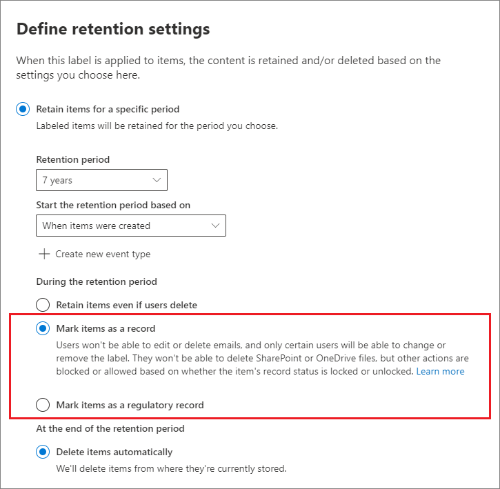

# <a name="declare-records-by-using-retention-labels"></a><span data-ttu-id="f02fa-103">Usar etiquetas de retención para declarar registros</span><span class="sxs-lookup"><span data-stu-id="f02fa-103">Declare records by using retention labels</span></span>

><span data-ttu-id="f02fa-104">*[Instrucciones de licencias de Microsoft 365 para la seguridad y el cumplimiento](https://aka.ms/ComplianceSD).*</span><span class="sxs-lookup"><span data-stu-id="f02fa-104">*[Microsoft 365 licensing guidance for security & compliance](https://aka.ms/ComplianceSD).*</span></span>

<span data-ttu-id="f02fa-105">Para declarar documentos y correos electrónicos como [registros](records-management.md#records), use las [etiquetas de retención](retention.md#retention-labels) que marcan el contenido como **registro** o como **registro normativo**.</span><span class="sxs-lookup"><span data-stu-id="f02fa-105">To declare documents and emails as [records](records-management.md#records), you use [retention labels](retention.md#retention-labels) that mark the content as a **record** or a **regulatory record**.</span></span>

> [!NOTE]
> <span data-ttu-id="f02fa-106">Actualmente, los registros normativos se encuentran en versión preliminar.</span><span class="sxs-lookup"><span data-stu-id="f02fa-106">Regulatory records are currently in preview.</span></span>

<span data-ttu-id="f02fa-107">Si no está seguro de si debe usar un registro o un registro normativo, consulte [Comparar las restricciones de las acciones que se permiten o se bloquean](records-management.md#compare-restrictions-for-what-actions-are-allowed-or-blocked).</span><span class="sxs-lookup"><span data-stu-id="f02fa-107">If you're not sure whether to use a record or a regulatory record, see [Compare restrictions for what actions are allowed or blocked](records-management.md#compare-restrictions-for-what-actions-are-allowed-or-blocked).</span></span> <span data-ttu-id="f02fa-108">Si necesita usar registros normativos, primero tiene que ejecutar un comando de PowerShell, como se describe en la sección siguiente.</span><span class="sxs-lookup"><span data-stu-id="f02fa-108">If you need to use regulatory records, you must first run a PowerShell command, as described in the next section.</span></span>

<span data-ttu-id="f02fa-109">Podrá entonces, o bien publicar dichas etiquetas en una directiva de etiquetas de retención (de modo que los usuarios y administradores puedan aplicarlas al contenido), o bien, en el caso de las etiquetas que marcan elementos como registros (no como registros normativos), podrá aplicarlas automáticamente al contenido que desee declarar como registro.</span><span class="sxs-lookup"><span data-stu-id="f02fa-109">You can then either publish those labels in a retention label policy so that users and administrators can apply them to content, or for labels that mark items as records (but not regulatory records), auto-apply those labels to content that you want to declare a record.</span></span>

## <a name="how-to-display-the-option-to-mark-content-as-a-regulatory-record"></a><span data-ttu-id="f02fa-110">Cómo mostrar la opción para marcar contenido como un registro normativo</span><span class="sxs-lookup"><span data-stu-id="f02fa-110">How to display the option to mark content as a regulatory record</span></span>

>[!NOTE] 
> <span data-ttu-id="f02fa-111">El procedimiento siguiente es una acción auditable, con el registro **Opción de registro normativo habilitado para las etiquetas de retención** en la sección [Directivas de retención y actividades de etiqueta de retención](search-the-audit-log-in-security-and-compliance.md#retention-policy-and-retention-label-activities) del registro de auditoría.</span><span class="sxs-lookup"><span data-stu-id="f02fa-111">The following procedure is an auditable action, logging **Enabled regulatory record option for retention labels** in the [Retention policy and retention label activities](search-the-audit-log-in-security-and-compliance.md#retention-policy-and-retention-label-activities) section of the audit log.</span></span>

<span data-ttu-id="f02fa-112">De forma predeterminada, la opción de etiqueta de retención para marcar contenido como un registro normativo no se muestra en el asistente de etiquetas de retención.</span><span class="sxs-lookup"><span data-stu-id="f02fa-112">By default, the retention label option to mark content as a regulatory record isn't displayed in the retention label wizard.</span></span> <span data-ttu-id="f02fa-113">Para mostrar esta opción, primero tiene que ejecutar un comando de PowerShell:</span><span class="sxs-lookup"><span data-stu-id="f02fa-113">To display this option, you must first run a PowerShell command:</span></span>

1. <span data-ttu-id="f02fa-114">[Conectarse a PowerShell del Centro de seguridad y cumplimiento de Office 365](https://docs.microsoft.com/powershell/exchange/office-365-scc/connect-to-scc-powershell/connect-to-scc-powershell).</span><span class="sxs-lookup"><span data-stu-id="f02fa-114">[Connect to the Office 365 Security & Compliance Center Powershell](https://docs.microsoft.com/powershell/exchange/office-365-scc/connect-to-scc-powershell/connect-to-scc-powershell).</span></span>

2. <span data-ttu-id="f02fa-115">Ejecute el siguiente cmdlet:</span><span class="sxs-lookup"><span data-stu-id="f02fa-115">Run the following cmdlet:</span></span>
    
    ```powershell
    Set-RegulatoryComplianceUI -Enabled $true
    ````
    <span data-ttu-id="f02fa-116">No se pide confirmación y la configuración surte efecto inmediatamente.</span><span class="sxs-lookup"><span data-stu-id="f02fa-116">There is no prompt to confirm and the setting takes effect immediately.</span></span>

<span data-ttu-id="f02fa-117">Si cambia de opinión sobre cómo ver esta opción en el asistente de etiquetas de retención, puede ocultarla de nuevo ejecutando el mismo cmdlet con el valor **false**: `Set-RegulatoryComplianceUI -Enabled $false`</span><span class="sxs-lookup"><span data-stu-id="f02fa-117">If you change your mind about seeing this option in the retention label wizard, you can hide it again by running the same cmdlet with the **false** value: `Set-RegulatoryComplianceUI -Enabled $false`</span></span> 

## <a name="configuring-retention-labels-to-declare-records"></a><span data-ttu-id="f02fa-118">Configurar etiquetas de retención para declarar registros</span><span class="sxs-lookup"><span data-stu-id="f02fa-118">Configuring retention labels to declare records</span></span>

<span data-ttu-id="f02fa-119">Al crear o editar una etiqueta de retención de la solución **administración de registros** del Centro de cumplimiento de Microsoft 365, tiene la opción de marcar los elementos como un registro.</span><span class="sxs-lookup"><span data-stu-id="f02fa-119">When you create or edit a retention label from the **Records Management** solution in the Microsoft 365 compliance center, you have the option to mark items as a record.</span></span> <span data-ttu-id="f02fa-120">Si ha ejecutado el comando de PowerShell de la sección anterior, como alternativa puede marcar los elementos como un registro normativo.</span><span class="sxs-lookup"><span data-stu-id="f02fa-120">If you ran the PowerShell command from the previous section, you can alternatively mark items as a regulatory record.</span></span>

<span data-ttu-id="f02fa-121">Por ejemplo:</span><span class="sxs-lookup"><span data-stu-id="f02fa-121">For example:</span></span>



<span data-ttu-id="f02fa-123">Ahora puede aplicar esta etiqueta de retención a documentos de SharePoint o OneDrive y a correos electrónicos de Exchange, según sea necesario.</span><span class="sxs-lookup"><span data-stu-id="f02fa-123">Using this retention label, you can now apply it to SharePoint or OneDrive documents and Exchange emails, as needed.</span></span> 

<span data-ttu-id="f02fa-124">Instrucciones completas:</span><span class="sxs-lookup"><span data-stu-id="f02fa-124">For full instructions:</span></span>

- [<span data-ttu-id="f02fa-125">Crear etiquetas de retención y aplicarlas en aplicaciones</span><span class="sxs-lookup"><span data-stu-id="f02fa-125">Create retention labels and apply them in apps</span></span>](create-apply-retention-labels.md)

- <span data-ttu-id="f02fa-126">[Aplicar una etiqueta de retención a contenido automáticamente](apply-retention-labels-automatically.md) (no es compatible con los registros normativos)</span><span class="sxs-lookup"><span data-stu-id="f02fa-126">[Apply a retention label to content automatically](apply-retention-labels-automatically.md) (not supported for regulatory records)</span></span>


## <a name="applying-the-configured-retention-label-to-content"></a><span data-ttu-id="f02fa-127">Aplicar una etiqueta de retención configurada al contenido</span><span class="sxs-lookup"><span data-stu-id="f02fa-127">Applying the configured retention label to content</span></span>

<span data-ttu-id="f02fa-128">Cuando las etiquetas de retención que marcan elementos como un registro o como un registro normativo se ponen a disposición de los usuarios para aplicarlas a aplicaciones:</span><span class="sxs-lookup"><span data-stu-id="f02fa-128">When retention labels that mark items as a record or regulatory record are made available for users to apply them in apps:</span></span>

- <span data-ttu-id="f02fa-129">Para Exchange, todos los usuarios con acceso de escritura al buzón pueden aplicar las etiquetas.</span><span class="sxs-lookup"><span data-stu-id="f02fa-129">For Exchange, any user with write-access to the mailbox can apply these labels.</span></span> 
- <span data-ttu-id="f02fa-130">Para SharePoint y OneDrive, cualquier usuario del grupo predeterminado de miembros (con nivel de permisos de contribución) puede aplicar las etiquetas.</span><span class="sxs-lookup"><span data-stu-id="f02fa-130">For SharePoint and OneDrive, any user in the default Members group (the Contribute permission level) can apply these labels.</span></span>

<span data-ttu-id="f02fa-131">Ejemplo de un documento marcado como registro con una etiqueta de retención:</span><span class="sxs-lookup"><span data-stu-id="f02fa-131">Example of a document marked as record by using a retention label:</span></span>


## <a name="next-steps"></a><span data-ttu-id="f02fa-133">Pasos siguientes</span><span class="sxs-lookup"><span data-stu-id="f02fa-133">Next steps</span></span>

<span data-ttu-id="f02fa-134">Para obtener una lista de los escenarios admitidos por la administración de registros, vea [Escenarios comunes de la administración de registros](get-started-with-records-management.md#common-scenarios-for-records-management).</span><span class="sxs-lookup"><span data-stu-id="f02fa-134">For a list of scenarios supported by records management, see [Common scenarios for records management](get-started-with-records-management.md#common-scenarios-for-records-management).</span></span>
