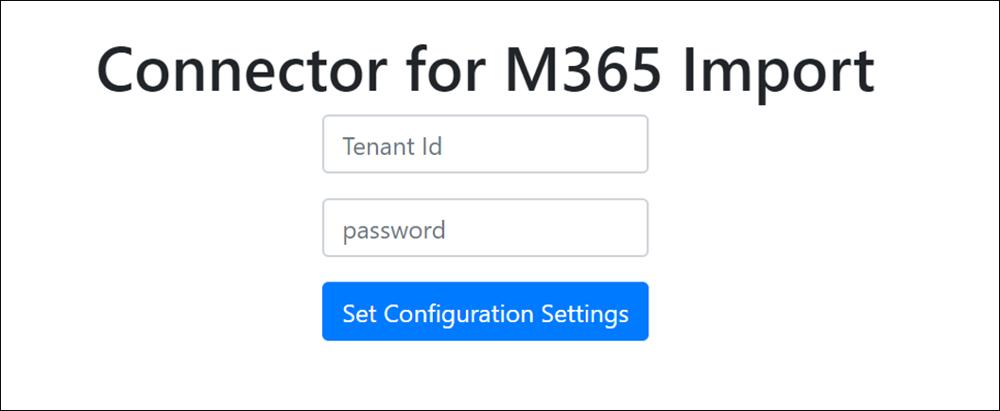
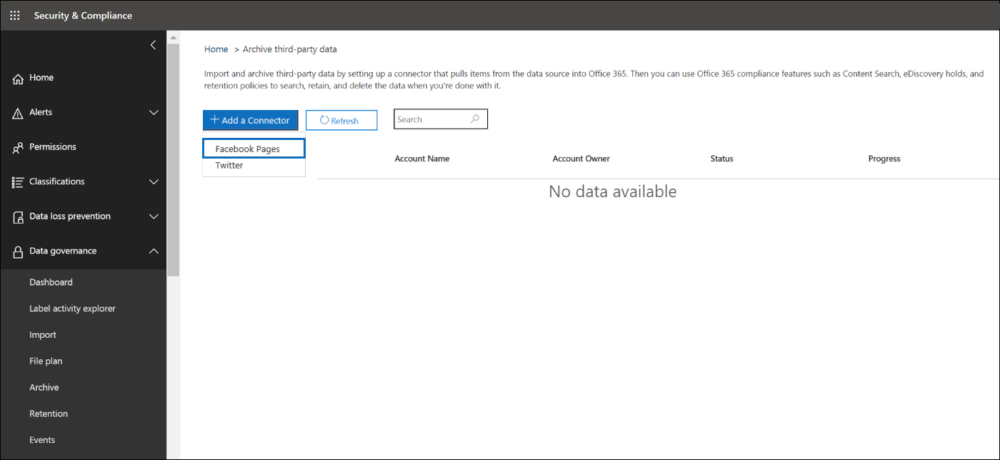
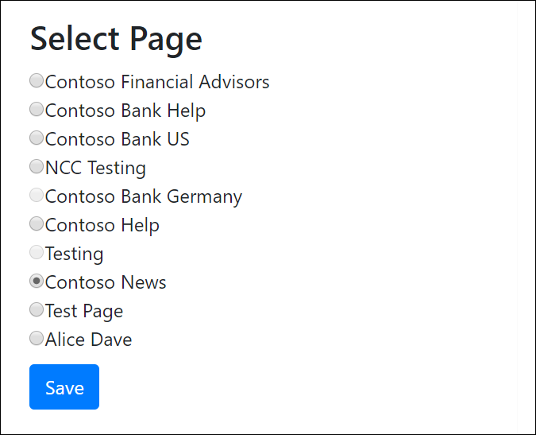
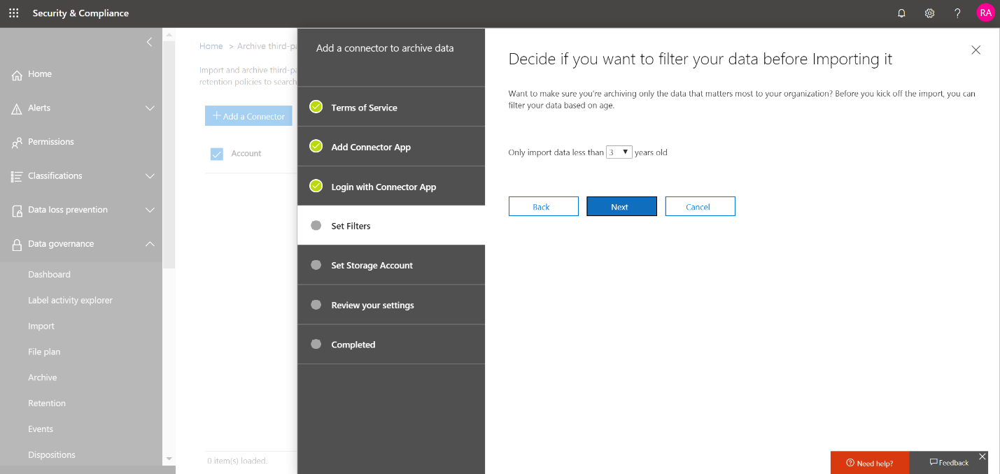

# Implementación de un conector para archivar datos de FacebookDeploy a connector to archive Facebook data

Este artículo contiene el proceso paso a paso para implementar un conector que usa el servicio de importación de Office 365 para importar datos de las páginas empresariales de Facebook a Office 365.This article contains the step-by-step process to deploy a connector that uses the Office 365 Import service to import data from Facebook Business pages to Office 365. Para obtener una descripción general de este proceso y una lista de los requisitos previos necesarios para implementar un conector de Facebook, vea [usar un conector de ejemplo para archivar datos de Facebook en Office 365 (versión preliminar)](archive-facebook-data-with-sample-connector.md).For a high-level overview of this process and a list of prerequisites required to deploy a Facebook connector, see [Use a sample connector to archive Facebook data in Office 365 (Preview)](archive-facebook-data-with-sample-connector.md). 

## Paso 1: descargar el paqueteStep 1: Download the package

Descargue el paquete precompilado de la sección de versiones en el repositorio <https://github.com/Microsoft/m365-sample-connector-csharp-aspnet/releases>de github en.Download the prebuilt package from the Release section in the GitHub repository at <https://github.com/Microsoft/m365-sample-connector-csharp-aspnet/releases>. En la versión más reciente, descargue el archivo zip denominado **SampleConnector. zip**.Under the latest release, download the zip file named **SampleConnector.zip**. Carga este archivo zip en Azure en el paso 4.You upload this zip file to Azure in Step 4.

## Paso 2: crear una aplicación en Azure Active DirectoryStep 2: Create an app in Azure Active Directory

1. Vaya a <https://portal.azure.com> e inicie sesión con las credenciales de una cuenta de administrador global de Office 365.Go to <https://portal.azure.com> and sign in using the credentials of an Office 365 global admin account.

    

2. En el panel de navegación izquierdo, haga clic en **Azure Active Directory**.In the left navigation pane, click **Azure Active Directory**.

    

3. En el panel de navegación izquierdo, haga clic en **registros de aplicaciones (versión preliminar)** y, a continuación, haga clic en **nuevo registro**.In the left navigation pane, click **App registrations (Preview)** and then click **New registration**.

    

4. Registrar la aplicación.Register the application. En URI de redireccionamiento, seleccione Web en la lista desplegable tipo de <https://portal.azure.com> aplicación y, a continuación, escriba en el cuadro del URI.Under Redirect URI, select Web in the application type dropdown list and then type <https://portal.azure.com> in the box for the URI.

   

5. Copie el identificador de la **aplicación (cliente)** y el **directorio (inquilino)** y guárdelos en un archivo de texto u otra ubicación segura.Copy the **Application (client) ID** and **Directory (tenant) ID** and save them to a text file or other safe location. Estos identificadores se usan en pasos posteriores.You use these IDs in later steps.

   

6. Vaya a **certificados & secretos para la nueva aplicación.**Go to **Certificates & secrets for the new app.**

   

7. Haga clic en **nuevo secreto de cliente**Click **New client secret**

   

8. Cree un secreto nuevo.Create a new secret. En el cuadro Descripción, escriba el secreto y, a continuación, elija un período de expiración.In the description box, type the secret and then choose an expiration period. 

    

9. Copie el valor del secreto y guárdelo en un archivo de texto u otra ubicación de almacenamiento.Copy the value of the secret and save it to a text file or other storage location. Este es el secreto de la aplicación de AAD que se usa en pasos posteriores.This is the AAD application secret that you use in later steps.

   

10. Vaya al **manifiesto** y copie identifieruris a (que también se denomina el URI de la aplicación AAD), tal y como se resalta en la siguiente captura de pantalla.Go to **Manifest** and copy the identifierUris (which is also called the AAD application Uri) as highlighted in the following screenshot. Copie el URI de la aplicación de AAD en un archivo de texto u otra ubicación de almacenamiento.Copy the AAD application Uri to a text file or other storage location. Se usa en el paso 6.You use it in Step 6.

   

## Paso 3: crear una cuenta de almacenamiento de AzureStep 3: Create an Azure storage account

1. Vaya a la Página principal de Azure de su organización.Go to the Azure home page for your organization.

    

2. Haga clic en **crear un recurso** y, a continuación, escriba **cuenta de almacenamiento** en el cuadro de búsqueda.Click **Create a resource** and then type **storage account** in the search box.

    

3. Haga clic en **almacenamiento**y, a continuación, en **cuenta de almacenamiento**.Click **Storage**, and then click **Storage account**.

    

4. En la página **crear cuenta de almacenamiento** , en el cuadro suscripción, seleccione **pay-as-go** o **Free Trial** en función del tipo de suscripción de Azure que tenga.On the **Create storage account** page, in the Subscription box, select **Pay-As-You-Go** or **Free Trial** depending on which type of Azure subscription you have. A continuación, seleccione o cree un grupo de recursos.Then select or create a resource group.

    

5. Escriba un nombre para la cuenta de almacenamiento.Type a name for the storage account.

    

6. Revise y, a continuación, haga clic en **crear** para crear la cuenta de almacenamiento.Review and then click **Create** to create the storage account.

    

7. Tras unos minutos, haga clic en **Actualizar** y, a continuación, haga clic en **ir a recurso** para navegar a la cuenta de almacenamiento.After a few moments, click **Refresh** and then click **Go to resource** to navigate to the storage account.

    

8. Haga clic en **teclas de acceso** en el panel de navegación izquierdo.Click **Access keys** in the left navigation pane.

    

9. Copiar una **cadena de conexión** y guardarla en un archivo de texto u otra ubicación de almacenamiento.Copy a **Connection string** and save it to a text file or other storage location. Se usa al crear un recurso de aplicación Web.You use this when creating a web app resource.

    

## Paso 4: crear un nuevo recurso de aplicación web en AzureStep 4: Create a new web app resource in Azure

1. En la página **principal** de Azure portal, haga clic en **crear una \> aplicación \> Web de todos los recursos**.On the **Home** page in the Azure portal, click **Create a resource \> Everything \> Web app**. En la página **aplicación web** , haga clic en **crear**.On the **Web app** page, click **Create**. 

   

2. Rellene los detalles (como se muestra a continuación) y, a continuación, cree la aplicación Web.Fill in the details (as shown below) and then create the Web app. Tenga en cuenta que el nombre que escriba en el cuadro Nombre de la **aplicación** se usa para crear la dirección URL de Azure App Service; por ejemplo, fbconnector.azurewebsites.net.Note that the name that you enter in the **App name** box is used to create the Azure app service URL; for example, fbconnector.azurewebsites.net.

   

3. Vaya al recurso de la aplicación web que acaba de crear y haga clic en configuración de la **aplicación** en el panel de navegación izquierdo.Go to the newly created web app resource, click **Application Settings** in the left navigation pane. En configuración de la aplicación, haga clic en Agregar nuevo valor y agregue las tres opciones siguientes: Use los valores (que copió en el archivo de texto de los pasos anteriores):Under Application settings, click Add new setting and add the following three settings: Use the values (that you copied to the text file from the previous steps): 

    - **APISecretKey** : puede escribir cualquier valor como secreto.**APISecretKey** – You can type any value as the secret. Se usa para obtener acceso a la aplicación web del conector en el paso 7.This is used to access the connector web app in Step 7.

    - **StorageAccountConnectionString** : el URI de la cadena de conexión que copió después de crear la cuenta de almacenamiento de Azure en el paso 3.**StorageAccountConnectionString** — The connection string Uri that you copied after creating the Azure storage account in Step 3.

    - **tenantId** : el identificador de inquilino de su organización de Office 365 que copió después de crear la aplicación de conector de Facebook en Azure Active Directory en el paso 2.**tenantId** – The tenant ID of your Office 365 organization that you copied after creating the Facebook connector app in Azure Active Directory in Step 2.

    

4. En **Configuración general**, haga clic **en** junto a **AlwaysOn**.Under **General settings**, click **On** next to the **Always On**. Haga clic en **Guardar** en la parte superior de la página para guardar la configuración de la aplicación.Click **Save** at the top of the page to save the application settings.

   

5. El último paso consiste en cargar el código fuente de la aplicación conector a Azure que ha descargado en el paso 1.The final step is to upload the connector app source code to Azure that you downloaded in Step 1. En un explorador Web, vaya a https://<AzureAppResourceName>. scm.azurewebsites.net/ZipDeployUi.In a web browser, go to https://<AzureAppResourceName>.scm.azurewebsites.net/ZipDeployUi. Por ejemplo, si el nombre del recurso de la aplicación de Azure (que se menciona en el paso 2 de esta sección) es **FBconnector**, entonces tendría https://fbconnector.scm.azurewebsites.net/ZipDeployUique hacerlo.For example, if the name of your Azure app resource (which you named in step 2 in this section) is **fbconnector**, then you would go to https://fbconnector.scm.azurewebsites.net/ZipDeployUi. 

6. Arrastre y coloque el SampleConnector. zip (descargado en el paso 1) en esta página.Drag and drop the SampleConnector.zip (that you downloaded in Step 1) to this page. Una vez que se cargan los archivos y la implementación se realiza correctamente, la página tendrá un aspecto similar al de la siguiente captura de pantalla:After the files are uploaded and the deployment is successful, the page will look similar to the following screenshot:

   

## Paso 5: registrar la aplicación de FacebookStep 5: Register the Facebook app

1. Vaya a <https://developers.facebook.com>, inicie sesión con las credenciales de la cuenta de las páginas de empresa de Facebook de su organización y, a continuación, haga clic en **Agregar nueva aplicación**.Go to <https://developers.facebook.com>, log in using the credentials for the account for your organization’s Facebook Business pages, and then click **Add New App**.

   

2. Cree un nuevo identificador de aplicación.Create a new app ID.

   

3. En el panel de navegación izquierdo, haga clic en **Agregar productos** y, a continuación, haga clic en **configurar** en la ventana de **Inicio de sesión de Facebook** .In the left navigation pane, click **Add Products** and then click **Set Up** in the **Facebook Login** tile.

   

4. En la página integrar inicio de sesión de Facebook, haga clic en **Web**.On the Integrate Facebook Login page, click **Web**.

   

5. Agregue la dirección URL de Azure App Service; por ejemplo `https://fbconnector.azurewebsites.net`.Add the Azure app service URL; for example `https://fbconnector.azurewebsites.net`.

   

6. Complete la sección QuickStart de la configuración de inicio de sesión de Facebook.Complete the QuickStart section of the Facebook Login setup.

   

7. En el panel de navegación izquierdo, en **Inicio de sesión de Facebook**, haga clic en **configuración**y agregue el URI de redireccionamiento de OAuth en el cuadro **válidos URI de redirección de OAuth** .In the left navigation pane under **Facebook Login**, click **Settings**, and add the OAuth redirect URI in the **Valid OAuth Redirect URIs** box. Use el formato \*\* \<connectorserviceuri>/views/facebookoauth\*\*, donde el valor de connectorserviceuri es la dirección URL de Azure App Service para su organización; por ejemplo, `https://fbconnector.azurewebsites.net`.Use the format **\<connectorserviceuri>/Views/FacebookOAuth**, where the value for connectorserviceuri is the Azure app service URL for your organization; for example, `https://fbconnector.azurewebsites.net`.

   

8. En el panel de navegación izquierdo, haga clic en **Agregar productos** y, a continuación, en **webhooks.**In the left navigation pane, click **Add Products** and then click **Webhooks.** En el menú desplegable **Página** , haga clic en **Página**.In the **Page** pull-down menu, click **Page**. 

   

9. Agregue la dirección URL de devolución de llamada de webhook y agregue un token de comprobación.Add Webhooks Callback URL and add a verify token. El formato de la dirección URL de devolución de llamada, use el formato \*\* <connectorserviceuri>/API/FbPageWebhook\*\*, donde el valor de connectorserviceuri es la dirección URL de Azure App Service para su organización; por ejemplo `https://fbconnector.azurewebsites.net`.The format of the callback URL, use the format **<connectorserviceuri>/api/FbPageWebhook**, where the value for connectorserviceuri is the Azure app service URL for your organization; for example `https://fbconnector.azurewebsites.net`. 

    El token de comprobación debe ser similar a una contraseña segura.The verify token should similar to a strong password. Copie el token de comprobación en un archivo de texto u otra ubicación de almacenamiento.Copy the verify token to a text file or other storage location.

        

10. Pruebe y suscríbase al extremo para la fuente.Test and subscribe to the endpoint for feed.

    

11. Agregue una dirección URL de privacidad, un icono de aplicación y un uso empresarial.Add a privacy URL, app icon, and business use. Además, copie el identificador de aplicación y el secreto de aplicación en un archivo de texto u otra ubicación de almacenamiento.Also, copy the app ID and app secret to a text file or other storage location.

    

12. Hacer que la aplicación sea pública.Make the app public.

    

13. Agregue un usuario al rol de administrador o de evaluador.Add user to the admin or tester role.

    

14. Agregue el permiso de **acceso a contenido público** de la página.Add the **Page Public Content Access** permission.

    

15. Permiso agregar páginas de administración.Add Manage Pages permission.

    

16. Obtenga la aplicación revisada por Facebook.Get the application reviewed by Facebook.

    

## Paso 6: configurar la aplicación web del conectorStep 6: Configure the connector web app

1. Vaya a https://\<AzureAppResourceName>. azurewebsites.net (donde AzureAppResourceName es el nombre del recurso de la aplicación de Azure que ha nombrado en el paso 4), por ejemplo, si el nombre es `https://fbconnector.azurewebsites.net` **FBconnector**, vaya a.Go to https://\<AzureAppResourceName>.azurewebsites.net (where AzureAppResourceName is the name of your Azure app resource that you named in Step 4) For example, if the name is **fbconnector**, go to `https://fbconnector.azurewebsites.net`. La Página principal de la aplicación será similar a la siguiente captura de pantalla:The home page of the app will look like the following screenshot:

   

2. Haga clic en **configurar** para mostrar una página de inicio de sesión.Click **Configure** to display a sign in page.
 
   

3. En el cuadro identificador de inquilino, escriba o pegue el identificador de inquilino (que obtuvo en el paso 2).In the Tenant Id box, type or paste your tenant Id (that you obtained in Step 2). En el cuadro contraseña, escriba o pegue el APISecretKey (que obtuvo en el paso 2) y, a continuación, haga clic en **establecer valores de configuración** para mostrar la página Detalles de la **configuración** .In the password box, type or paste the APISecretKey (that you obtained in Step 2), and then click **Set Configuration Settings** to display the **Configuration Details** page.

    

4. En **detalles de configuración**, especifique las siguientes opciones de configuraciónUnder **Configuration Details**, enter the following configuration settings 

   - **Identificador** de la aplicación de Facebook: el identificador de la aplicación de Facebook que obtuvo en el paso 5.**Facebook application ID** – The app ID for the Facebook application that you obtained in Step 5.
   - **Secreto** de la aplicación de Facebook: el secreto de la aplicación de Facebook que obtuvo en el paso 5.**Facebook application secret** – The app secret for the Facebook application that you obtained in Step 5.
   - **Token de comprobación de webhooks de Facebook** : el token de comprobación que ha creado en el paso 5.**Facebook webhooks verify token** – The verify token that you created in Step 5.
   - **Identificador de la aplicación AAD** : el identificador de la aplicación de la aplicación de Azure Active Directory que creó en el paso 2.**AAD application ID** – The application ID for the Azure Active Directory app that you created in Step 2.
   - **Secreto de la aplicación AAD** : el valor del secreto APISecretKey que creó en el paso 4.**AAD application secret** – The value for the APISecretKey secret that you created in Step 4.
   - **URI de la aplicación AAD** : el URI de la aplicación AAD obtenido en el paso 2; por ejemplo, `https://microsoft.onmicrosoft.com/2688yu6n-12q3-23we-e3ee-121111123213`.**AAD application Uri** – The AAD application Uri obtained in Step 2; for example, `https://microsoft.onmicrosoft.com/2688yu6n-12q3-23we-e3ee-121111123213`.
   - **Clave de instrumentación de App Insights** : Deje este cuadro en blanco.**App insights instrumentation key** – Leave this box blank.

5. Haga clic en **Guardar** para guardar la configuración del conector.Click **Save** to save the connector settings.

## Paso 7: configurar un conector personalizado en el centro de seguridad & cumplimientoStep 7: Set up a custom connector in the Security & Compliance Center

1. Vaya a <https://protection.office.com> y, a continuación, haga clic en **información de terceros archivo de importación \> \> y gobierno de información**.Go to <https://protection.office.com> and then click **Information governance \> Import \> Archive third-party data**.

   

2.  Haga clic en **Agregar un conector** y, a continuación, en **páginas de Facebook**.Click **Add a connector** and then click **Facebook pages**.

    

3.  En la página **Agregar aplicación de conector** , escriba la siguiente información y, a continuación, haga clic en **validar conector**.On the **Add Connector App** page, enter the following information and then click **Validate connector**.

    - En el primer cuadro, escriba un nombre para el conector, como **Facebook**.In the first box, type a name for the connector, such as **Facebook**.
    - En el segundo cuadro, escriba o pegue el valor de APISecretKey que agregó en el paso 4.In the second box, type or paste the value of the APISecretKey that you added in Step 4.
    - En el tercer cuadro, escriba o pegue la dirección URL de Azure App Service; por ejemplo `https://fbconnector.azurewebsites.net`.In the third box, type or paste the Azure app service URL; for example `https://fbconnector.azurewebsites.net`.
 
    Una vez validado correctamente el conector, haga clic en **siguiente**.After the connector is successfully validated, click **Next**.
    
    

4.  Haga clic en **iniciar sesión con la aplicación conector**.Click **Login with Connector App**.

    

5. Escriba o pegue el APISecretKey de nuevo y, a continuación, haga clic en **iniciar sesión en el servicio de conector**.Type or paste the APISecretKey again and then click  **Login to Connector Service**.

   

6. Haga clic en **iniciar sesión con Facebook**.Click **Login with Facebook**.

   

7. En la página **iniciar sesión en Facebook** , inicie sesión con las credenciales de la cuenta de las páginas de empresa de Facebook de su organización.On the **Log in to Facebook** page, log in using the credentials for the account for your organization’s Facebook Business pages. Asegúrese de que la cuenta de Facebook a la que ha iniciado sesión tenga asignado el rol de administrador de las páginas empresariales de Facebook de su organización.Make sure the Facebook account that you logged in to is assigned the admin role for your organization’s Facebook Business pages

   

8. Haga clic en **seleccionar páginas** para elegir las páginas de negocio de su organización que desea archivar en Office 365.Click **Select Pages** to choose your organization’s business pages that you want to archive in Office 365.

   

9. Se muestra una lista de las páginas de negocio administradas por la cuenta de Facebook en la que inició sesión.A list of the Business pages managed by the Facebook account that you logged in to is displayed. Seleccione la página que desea archivar y, a continuación, haga clic en **Guardar**.Select the page to archive and then click **Save**.

    

10. Haga clic en **Finalizar** para salir de la instalación de la aplicación del servicio conector.Click **Finish** to exit the setup of the connector service app.

    

11. En la página **Establecer filtros** , puede aplicar un filtro para importar (y archivar) los elementos que tengan una antigüedad determinada.On the **Set Filters** page, you can apply a filter to import (and archive) items that are a certain age. Haga clic en **Siguiente**.Click **Next**.

    

12. En la página **establecer cuenta de almacenamiento** , seleccione el buzón de Office 365 en el que se importarán los elementos de las páginas de la empresa de Facebook que seleccionó anteriormente.On the **Set Storage Account** page, select the Office 365 mailbox that the items from the Facebook Business pages that you previously selected will be imported to.

    

13. Revise la configuración y, a continuación, haga clic en **Finalizar** para completar la configuración del conector en el centro de seguridad & cumplimiento.Review your settings and then click **Finish** to complete the connector setup in the Security & Compliance Center.

    

14. Vaya a la página **archivar datos de terceros** para ver el progreso del proceso de importación.Go to the **Archive third-party data** page to see the progress of the import process.

    
