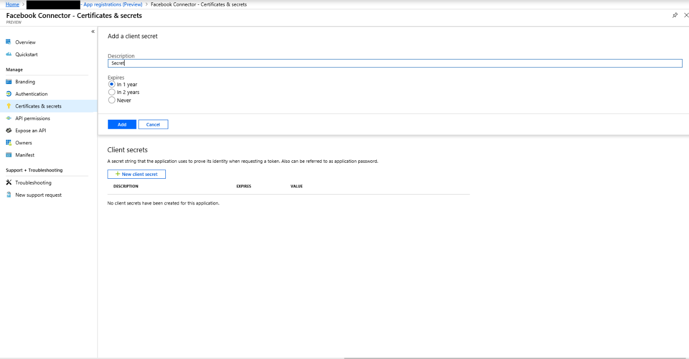
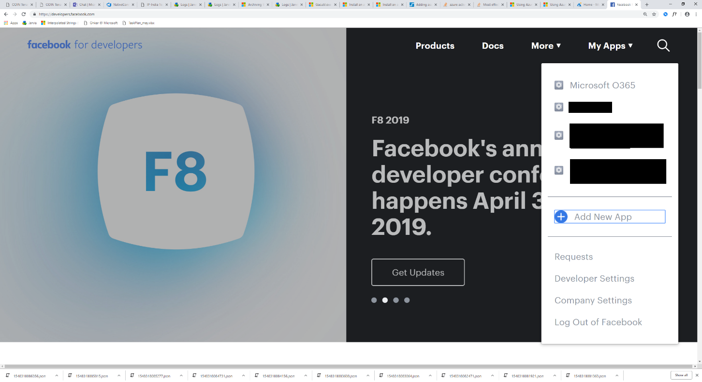

# Implementación de un conector para archivar datos de páginas empresariales de Facebook

Este artículo contiene el proceso paso a paso para implementar un conector que usa el servicio de importación 365 de Microsoft para importar datos de las páginas empresariales de Facebook a Microsoft 365. Para obtener información general de alto nivel de este proceso y una lista de los requisitos previos necesarios para implementar un conector de Facebook, consulte [configurar un conector para archivar datos de Facebook](archive-facebook-data-with-sample-connector.md). 

## Paso 1: crear una aplicación en Azure Active Directory

1. Vaya a <https://portal.azure.com> e inicie sesión con las credenciales de una cuenta de administrador global de Office 365.

    

2. En el panel de navegación izquierdo, haga clic en **Azure Active Directory**.

    

3. En el panel de navegación izquierdo, haga clic en **registros de aplicaciones (versión preliminar)** y, a continuación, haga clic en **nuevo registro**.

    

4. Registrar la aplicación. En URI de redireccionamiento, seleccione Web en la lista desplegable tipo de <https://portal.azure.com> aplicación y, a continuación, escriba en el cuadro del URI.

   

5. Copie el identificador de la **aplicación (cliente)** y el **directorio (inquilino)** y guárdelos en un archivo de texto u otra ubicación segura. Estos identificadores se usan en pasos posteriores.

   

6. Vaya a **certificados & secretos para la nueva aplicación.**

   

7. Haga clic en **nuevo secreto de cliente**

   

8. Cree un secreto nuevo. En el cuadro Descripción, escriba el secreto y, a continuación, elija un período de expiración. 

    

9. Copie el valor del secreto y guárdelo en un archivo de texto u otra ubicación de almacenamiento. Este es el secreto de la aplicación de AAD que se usa en pasos posteriores.

   

## Paso 2: implementar el servicio Web del conector desde GitHub a su cuenta de Azure

1. Vaya a [este sitio de github](https://github.com/microsoft/m365-sample-connector-csharp-aspnet) y haga clic en **implementar en Azure**.

    

2. Después de hacer clic en **implementar en Azure**, se le redirigirá a un portal de Azure con una página de plantilla personalizada. Rellene los detalles de **conceptos básicos** y **configuración** y, a continuación, haga clic en **comprar**.

    - **Suscripción:** Seleccione la suscripción a Azure en la que desea implementar el servicio Web de conector de páginas empresariales de Facebook.
    
    - **Grupo de recursos:** Elija o cree un nuevo grupo de recursos. Un grupo de recursos es un contenedor que contiene recursos relacionados para una solución de Azure.

    - **Ubicación:** Elija una ubicación.

    - **Nombre de la aplicación web:** Proporcione un nombre único para la aplicación web del conector. El nombre debe tener entre 3 y 18 caracteres de longitud. Este nombre se usa para crear la dirección URL de Azure App Service; por ejemplo, si proporciona el nombre de la aplicación Web de **FBconnector** , la dirección URL del servicio de aplicación de Azure será **FBconnector.azurewebsites.net**.
    
    - **tenantId:** El identificador de inquilino de su organización de Microsoft 365 que copió después de crear la aplicación de conector de Facebook en Azure Active Directory en el paso 1.
    
   - **APISecretKey:** Puede escribir cualquier valor como secreto. Se usa para obtener acceso a la aplicación web del conector en el paso 5.
   
     

3. Una vez completada la implementación, la página tendrá un aspecto similar al de la siguiente captura de pantalla:

     

## Paso 3: registrar la aplicación de Facebook

1. Vaya a <https://developers.facebook.com>, inicie sesión con las credenciales de la cuenta de las páginas de empresa de Facebook de su organización y, a continuación, haga clic en **Agregar nueva aplicación**.

   

2. Cree un nuevo identificador de aplicación.

   

3. En el panel de navegación izquierdo, haga clic en **Agregar productos** y, a continuación, haga clic en **configurar** en la ventana de **Inicio de sesión de Facebook** .

   

4. En la página integrar inicio de sesión de Facebook, haga clic en **Web**.

   

5. Agregue la dirección URL de Azure App Service; por ejemplo `https://fbconnector.azurewebsites.net`.

   

6. Complete la sección QuickStart de la configuración de inicio de sesión de Facebook.

   

7. En el panel de navegación izquierdo, en **Inicio de sesión de Facebook**, haga clic en **configuración**y agregue el URI de redireccionamiento de OAuth en el cuadro **válidos URI de redirección de OAuth** . Use el formato ** \<connectorserviceuri>/views/facebookoauth**, donde el valor de connectorserviceuri es la dirección URL de Azure App Service para su organización; por ejemplo, `https://fbconnector.azurewebsites.net`.

   

8. En el panel de navegación izquierdo, haga clic en **Agregar productos** y, a continuación, en **webhooks.** En el menú desplegable **Página** , haga clic en **Página**. 

   

9. Agregue la dirección URL de devolución de llamada de webhook y agregue un token de comprobación. El formato de la dirección URL de devolución de llamada, use el formato ** <connectorserviceuri>/API/FbPageWebhook**, donde el valor de connectorserviceuri es la dirección URL de Azure App Service para su organización; por ejemplo `https://fbconnector.azurewebsites.net`. 

    El token de comprobación debe ser similar a una contraseña segura. Copie el token de comprobación en un archivo de texto u otra ubicación de almacenamiento.

        

10. Pruebe y suscríbase al extremo para la fuente.

    

11. Agregue una dirección URL de privacidad, un icono de aplicación y un uso empresarial. Además, copie el identificador de aplicación y el secreto de aplicación en un archivo de texto u otra ubicación de almacenamiento.

    

12. Hacer que la aplicación sea pública.

    

13. Agregue un usuario al rol de administrador o de evaluador.

    

14. Agregue el permiso de **acceso a contenido público** de la página.

    

15. Permiso agregar páginas de administración.

    

16. Obtenga la aplicación revisada por Facebook.

    

## Paso 4: configurar la aplicación web del conector

1. Vaya a https://\<AzureAppResourceName>. azurewebsites.net (donde AzureAppResourceName es el nombre del recurso de la aplicación de Azure que ha nombrado en el paso 4), por ejemplo, si el nombre es `https://fbconnector.azurewebsites.net` **FBconnector**, vaya a. La Página principal de la aplicación será similar a la siguiente captura de pantalla:

   

2. Haga clic en **configurar** para mostrar una página de inicio de sesión.
 
   

3. En el cuadro identificador de inquilino, escriba o pegue el identificador de inquilino (que obtuvo en el paso 2). En el cuadro contraseña, escriba o pegue el APISecretKey (que obtuvo en el paso 2) y, a continuación, haga clic en **establecer valores de configuración** para mostrar la página Detalles de la configuración.

    

4. Especifique las siguientes opciones de configuración 

   - **Identificador de la aplicación de Facebook:** El identificador de aplicación de la aplicación de Facebook que obtuvo en el paso 3.
   
   - **Secreto de la aplicación de Facebook:** El secreto de aplicación para la aplicación de Facebook que obtuvo en el paso 3.
   
   - **Token de comprobación de los webhooks de Facebook:** El token de comprobación que ha creado en el paso 3.
   
   - **Identificador de la aplicación de AAD:** El identificador de aplicación de la aplicación de Azure Active Directory que ha creado en el paso 1.
   
   - **Secreto de la aplicación AAD:** El valor del secreto APISecretKey que creó en el paso 1.

5. Haga clic en **Guardar** para guardar la configuración del conector.

## Paso 5: configurar un conector de Facebook en el centro de cumplimiento de Microsoft 365

1. Vaya a [https://compliance.microsoft.com](https://compliance.microsoft.com) y, a continuación, haga clic en **conectores de datos** en el panel de navegación izquierdo.

2. En la página **conectores de datos (vista previa)** , en **páginas empresariales de Facebook**, haga clic en **Ver**.

3. En la página **páginas empresariales de Facebook** , haga clic en **Agregar conector**.

4. En la página **condiciones de servicio** , haga clic en **Aceptar**.

5.  En la página **agregar credenciales para la aplicación de conector** , escriba la siguiente información y, a continuación, haga clic en **validar conexión**.

    

    - En el cuadro **nombre** , escriba un nombre para el conector, como **Página de noticias de Facebook**.
    
    - En el cuadro **dirección URL de conexión** , escriba o pegue la dirección URL de Azure App Service; por ejemplo `https://fbconnector.azurewebsites.net`.
    
    - En el cuadro **contraseña** , escriba o pegue el valor de la APISecretKey que agregó en el paso 2.
    
    - En el cuadro identificador de la **aplicación de Azure** , escriba o pegue el valor del identificador de la aplicación (cliente) también denominado identificador de la aplicación AAD que creó en el paso 1.
 
6. Una vez validada correctamente la conexión, haga clic en **siguiente**.

7. En la página **autorizar a Microsoft 365 a importar datos** , escriba o pegue el APISecretKey de nuevo y, a continuación, haga clic en **iniciar sesión en la aplicación web**.

8. En la página **configurar la aplicación** para el conector de Facebook, haga clic en **iniciar sesión con Facebook** e inicie sesión con las credenciales de la cuenta de las páginas de empresa de Facebook de su organización. Asegúrese de que la cuenta de Facebook a la que ha iniciado sesión tenga asignado el rol de administrador de las páginas empresariales de Facebook de su organización.

   

9. Se muestra una lista de las páginas de negocio administradas por la cuenta de Facebook en la que inició sesión. Seleccione la página que desea archivar y, a continuación, haga clic en **siguiente**.

    

10. Haga clic en **continuar** para salir de la instalación de la aplicación del servicio conector.

11. En la página **Establecer filtros** , puede aplicar un filtro para importar inicialmente los elementos que tienen una antigüedad determinada. Seleccione una edad y, a continuación, haga clic en **siguiente**.

12. En la página **Elegir ubicación de almacenamiento** , escriba la dirección de correo electrónico del buzón de correo de Microsoft 365 al que se importarán los elementos de Facebook y, a continuación, haga clic en **siguiente**.

13. En el **acuerdo proporcionar consentimiento del administrador**, haga clic en **proporcionar consentimiento** y, a continuación, siga los pasos. Debe ser administrador global para dar su consentimiento al servicio de importación de Office 365 para obtener acceso a los datos de su organización.

14. Haga clic en **siguiente** para revisar la configuración del conector y, a continuación, haga clic en **Finalizar** para completar la configuración del conector.

15. En el centro de cumplimiento, vaya a la página **conectores de datos** y haga clic en la pestaña **conectores** para ver el progreso del proceso de importación.
