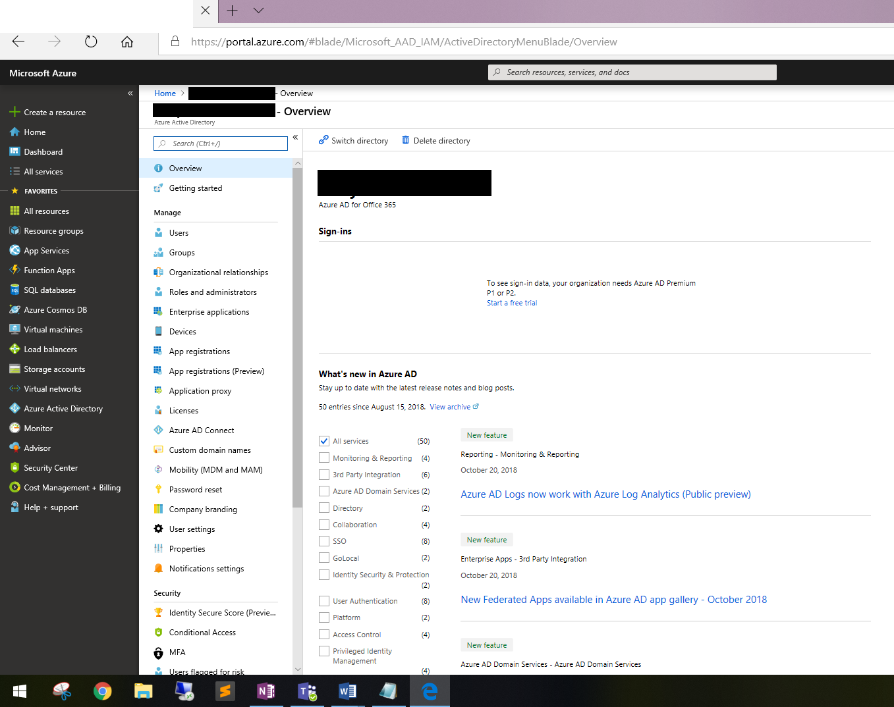
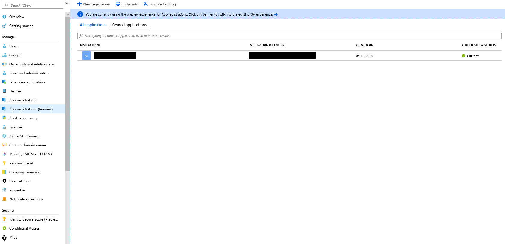
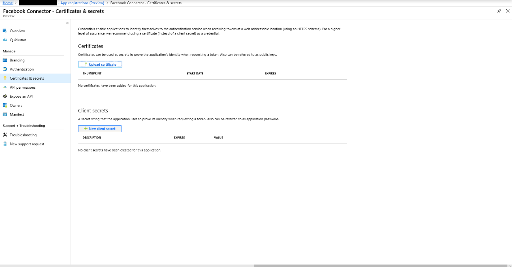

# Implementación de un conector para archivar datos de páginas empresariales de FacebookDeploy a connector to archive Facebook Business pages data

Este artículo contiene el proceso paso a paso para implementar un conector que usa el servicio de importación de Office 365 para importar datos de las páginas empresariales de Facebook a Microsoft 365.This article contains the step-by-step process to deploy a connector that uses the Office 365 Import service to import data from Facebook Business pages to Microsoft 365. Para obtener información general de alto nivel de este proceso y una lista de los requisitos previos necesarios para implementar un conector de Facebook, consulte [configurar un conector para archivar datos de Facebook](archive-facebook-data-with-sample-connector.md).For a high-level overview of this process and a list of prerequisites required to deploy a Facebook connector, see [Set up a connector to archive Facebook data](archive-facebook-data-with-sample-connector.md). 

## Paso 1: crear una aplicación en Azure Active DirectoryStep 1: Create an app in Azure Active Directory

1. Vaya a <https://portal.azure.com> e inicie sesión con las credenciales de una cuenta de administrador global.Go to <https://portal.azure.com> and sign in using the credentials of a global admin account.

    

2. En el panel de navegación izquierdo, haga clic en **Azure Active Directory**.In the left navigation pane, click **Azure Active Directory**.

    

3. En el panel de navegación izquierdo, haga clic en **registros de aplicaciones (versión preliminar)** y, a continuación, haga clic en **nuevo registro**.In the left navigation pane, click **App registrations (Preview)** and then click **New registration**.

    

4. Registrar la aplicación.Register the application. En URI de redireccionamiento, seleccione Web en la lista desplegable tipo de <https://portal.azure.com> aplicación y, a continuación, escriba en el cuadro del URI.Under Redirect URI, select Web in the application type dropdown list and then type <https://portal.azure.com> in the box for the URI.

   

5. Copie el identificador de la **aplicación (cliente)** y el **directorio (inquilino)** y guárdelos en un archivo de texto u otra ubicación segura.Copy the **Application (client) ID** and **Directory (tenant) ID** and save them to a text file or other safe location. Estos identificadores se usan en pasos posteriores.You use these IDs in later steps.

   

6. Vaya a **certificados & secretos para la nueva aplicación.**Go to **Certificates & secrets for the new app.**

   

7. Haga clic en **nuevo secreto de cliente**Click **New client secret**

   

8. Cree un secreto nuevo.Create a new secret. En el cuadro Descripción, escriba el secreto y, a continuación, elija un período de expiración.In the description box, type the secret and then choose an expiration period. 

    

9. Copie el valor del secreto y guárdelo en un archivo de texto u otra ubicación de almacenamiento.Copy the value of the secret and save it to a text file or other storage location. Este es el secreto de la aplicación de AAD que se usa en pasos posteriores.This is the AAD application secret that you use in later steps.

   

## Paso 2: implementar el servicio Web del conector desde GitHub a su cuenta de AzureStep 2: Deploy the connector web service from GitHub to your Azure account

1. Vaya a [este sitio de github](https://github.com/microsoft/m365-sample-connector-csharp-aspnet) y haga clic en **implementar en Azure**.Go to [this GitHub site](https://github.com/microsoft/m365-sample-connector-csharp-aspnet) and click **Deploy to Azure**.

    

2. Después de hacer clic en **implementar en Azure**, se le redirigirá a un portal de Azure con una página de plantilla personalizada.After you click **Deploy to Azure**, you will be redirected to an Azure portal with a custom template page. Rellene los detalles de **conceptos básicos** y **configuración** y, a continuación, haga clic en **comprar**.Fill in the **Basics** and **Settings** details and then click **Purchase**.

    - **Suscripción:** Seleccione la suscripción a Azure en la que desea implementar el servicio Web de conector de páginas empresariales de Facebook.**Subscription:** Select your Azure subscription that you want to deploy the Facebook Business pages connector web service to.
    
    - **Grupo de recursos:** Elija o cree un nuevo grupo de recursos.**Resource group:** Choose or create a new resource group. Un grupo de recursos es un contenedor que contiene recursos relacionados para una solución de Azure.A resource group is a container that holds related resources for an Azure solution.

    - **Ubicación:** Elija una ubicación.**Location:** Choose a location.

    - **Nombre de la aplicación web:** Proporcione un nombre único para la aplicación web del conector.**Web App Name:** Provide a unique name for the connector web app. El nombre debe tener entre 3 y 18 caracteres de longitud.Th name must be between 3 and 18 characters in length. Este nombre se usa para crear la dirección URL de Azure App Service; por ejemplo, si proporciona el nombre de la aplicación Web de **FBconnector** , la dirección URL del servicio de aplicación de Azure será **FBconnector.azurewebsites.net**.This name is used to create the Azure app service URL; for example, if you provide the Web app name of **fbconnector** then the Azure app service URL  will be **fbconnector.azurewebsites.net**.
    
    - **tenantId:** El identificador de inquilino de su organización de Microsoft 365 que copió después de crear la aplicación de conector de Facebook en Azure Active Directory en el paso 1.**tenantId:** The tenant ID of your Microsoft 365 organization that you copied after creating the Facebook connector app in Azure Active Directory in Step 1.
    
   - **APISecretKey:** Puede escribir cualquier valor como secreto.**APISecretKey:** You can type any value as the secret. Se usa para obtener acceso a la aplicación web del conector en el paso 5.This is used to access the connector web app in Step 5.
   
     

3. Una vez completada la implementación, la página tendrá un aspecto similar al de la siguiente captura de pantalla:After the deployment is successful, the page will look similar to the following screenshot:

     

## Paso 3: registrar la aplicación de FacebookStep 3: Register the Facebook app

1. Vaya a <https://developers.facebook.com>, inicie sesión con las credenciales de la cuenta de las páginas de empresa de Facebook de su organización y, a continuación, haga clic en **Agregar nueva aplicación**.Go to <https://developers.facebook.com>, log in using the credentials for the account for your organization's Facebook Business pages, and then click **Add New App**.

   

2. Cree un nuevo identificador de aplicación.Create a new app ID.

   

3. En el panel de navegación izquierdo, haga clic en **Agregar productos** y, a continuación, haga clic en **configurar** en la ventana de **Inicio de sesión de Facebook** .In the left navigation pane, click **Add Products** and then click **Set Up** in the **Facebook Login** tile.

   

4. En la página integrar inicio de sesión de Facebook, haga clic en **Web**.On the Integrate Facebook Login page, click **Web**.

   

5. Agregue la dirección URL de Azure App Service; por ejemplo `https://fbconnector.azurewebsites.net`.Add the Azure app service URL; for example `https://fbconnector.azurewebsites.net`.

   

6. Complete la sección QuickStart de la configuración de inicio de sesión de Facebook.Complete the QuickStart section of the Facebook Login setup.

   

7. En el panel de navegación izquierdo, en **Inicio de sesión de Facebook**, haga clic en **configuración**y agregue el URI de redireccionamiento de OAuth en el cuadro **válidos URI de redirección de OAuth** .In the left navigation pane under **Facebook Login**, click **Settings**, and add the OAuth redirect URI in the **Valid OAuth Redirect URIs** box. Use el formato \*\* \<connectorserviceuri>/views/facebookoauth\*\*, donde el valor de connectorserviceuri es la dirección URL de Azure App Service para su organización; por ejemplo, `https://fbconnector.azurewebsites.net`.Use the format **\<connectorserviceuri>/Views/FacebookOAuth**, where the value for connectorserviceuri is the Azure app service URL for your organization; for example, `https://fbconnector.azurewebsites.net`.

   

8. En el panel de navegación izquierdo, haga clic en **Agregar productos** y, a continuación, en **webhooks.**In the left navigation pane, click **Add Products** and then click **Webhooks.** En el menú desplegable **Página** , haga clic en **Página**.In the **Page** pull-down menu, click **Page**. 

   

9. Agregue la dirección URL de devolución de llamada de webhook y agregue un token de comprobación.Add Webhooks Callback URL and add a verify token. El formato de la dirección URL de devolución de llamada, use el formato \*\* <connectorserviceuri>/API/FbPageWebhook\*\*, donde el valor de connectorserviceuri es la dirección URL de Azure App Service para su organización; por ejemplo `https://fbconnector.azurewebsites.net`.The format of the callback URL, use the format **<connectorserviceuri>/api/FbPageWebhook**, where the value for connectorserviceuri is the Azure app service URL for your organization; for example `https://fbconnector.azurewebsites.net`. 

    El token de comprobación debe ser similar a una contraseña segura.The verify token should similar to a strong password. Copie el token de comprobación en un archivo de texto u otra ubicación de almacenamiento.Copy the verify token to a text file or other storage location.

        

10. Pruebe y suscríbase al extremo para la fuente.Test and subscribe to the endpoint for feed.

    

11. Agregue una dirección URL de privacidad, un icono de aplicación y un uso empresarial.Add a privacy URL, app icon, and business use. Además, copie el identificador de aplicación y el secreto de aplicación en un archivo de texto u otra ubicación de almacenamiento.Also, copy the app ID and app secret to a text file or other storage location.

    

12. Hacer que la aplicación sea pública.Make the app public.

    

13. Agregue un usuario al rol de administrador o de evaluador.Add user to the admin or tester role.

    

14. Agregue el permiso de **acceso a contenido público** de la página.Add the **Page Public Content Access** permission.

    

15. Permiso agregar páginas de administración.Add Manage Pages permission.

    

16. Obtenga la aplicación revisada por Facebook.Get the application reviewed by Facebook.

    

## Paso 4: configurar la aplicación web del conectorStep 4: Configure the connector web app

1. Vaya a https://\<AzureAppResourceName>. azurewebsites.net (donde AzureAppResourceName es el nombre del recurso de la aplicación de Azure que ha nombrado en el paso 4), por ejemplo, si el nombre es `https://fbconnector.azurewebsites.net` **FBconnector**, vaya a.Go to https://\<AzureAppResourceName>.azurewebsites.net (where AzureAppResourceName is the name of your Azure app resource that you named in Step 4) For example, if the name is **fbconnector**, go to `https://fbconnector.azurewebsites.net`. La Página principal de la aplicación será similar a la siguiente captura de pantalla:The home page of the app will look like the following screenshot:

   

2. Haga clic en **configurar** para mostrar una página de inicio de sesión.Click **Configure** to display a sign in page.
 
   

3. En el cuadro identificador de inquilino, escriba o pegue el identificador de inquilino (que obtuvo en el paso 2).In the Tenant Id box, type or paste your tenant Id (that you obtained in Step 2). En el cuadro contraseña, escriba o pegue el APISecretKey (que obtuvo en el paso 2) y, a continuación, haga clic en **establecer valores de configuración** para mostrar la página Detalles de la configuración.In the password box, type or paste the APISecretKey (that you obtained in Step 2), and then click **Set Configuration Settings** to display the configuration details page.

    

4. Especifique las siguientes opciones de configuraciónEnter the following configuration settings 

   - **Identificador de la aplicación de Facebook:** El identificador de aplicación de la aplicación de Facebook que obtuvo en el paso 3.**Facebook application ID:** The app ID for the Facebook application that you obtained in Step 3.
   
   - **Secreto de la aplicación de Facebook:** El secreto de aplicación para la aplicación de Facebook que obtuvo en el paso 3.**Facebook application secret:** The app secret for the Facebook application that you obtained in Step 3.
   
   - **Token de comprobación de los webhooks de Facebook:** El token de comprobación que ha creado en el paso 3.**Facebook webhooks verify token:** The verify token that you created in Step 3.
   
   - **Identificador de la aplicación de AAD:** El identificador de aplicación de la aplicación de Azure Active Directory que ha creado en el paso 1.**AAD application ID:** The application ID for the Azure Active Directory app that you created in Step 1.
   
   - **Secreto de la aplicación AAD:** El valor del secreto APISecretKey que creó en el paso 1.**AAD application secret:** The value for the APISecretKey secret that you created in Step 1.

5. Haga clic en **Guardar** para guardar la configuración del conector.Click **Save** to save the connector settings.

## Paso 5: configurar un conector de Facebook en el centro de cumplimiento de Microsoft 365Step 5: Set up a Facebook connector in the Microsoft 365 compliance center

1. Vaya a [https://compliance.microsoft.com](https://compliance.microsoft.com) y, a continuación, haga clic en **conectores de datos** en el panel de navegación izquierdo.Go to [https://compliance.microsoft.com](https://compliance.microsoft.com) and then click **Data connectors** in the left nav.

2. En la página **conectores de datos (vista previa)** , en **páginas empresariales de Facebook**, haga clic en **Ver**.On the **Data connectors (preview)** page under **Facebook Business pages**, click **View**.

3. En la página **páginas empresariales de Facebook** , haga clic en **Agregar conector**.On the **Facebook business pages** page, click **Add connector**.

4. En la página **condiciones de servicio** , haga clic en **Aceptar**.On the **Terms of service** page, click **Accept**.

5.  En la página **agregar credenciales para la aplicación de conector** , escriba la siguiente información y, a continuación, haga clic en **validar conexión**.On the **Add credentials for your connector app** page, enter the following information and then click **Validate connection**.

    

    - En el cuadro **nombre** , escriba un nombre para el conector, como **Página de noticias de Facebook**.In the **Name** box, type a name for the connector, such as **Facebook news page**.
    
    - En el cuadro **dirección URL de conexión** , escriba o pegue la dirección URL de Azure App Service; por ejemplo `https://fbconnector.azurewebsites.net`.In the **Connection URL** box, type or paste the Azure app service URL; for example `https://fbconnector.azurewebsites.net`.
    
    - En el cuadro **contraseña** , escriba o pegue el valor de la APISecretKey que agregó en el paso 2.In the **Password** box, type or paste the value of the APISecretKey that you added in Step 2.
    
    - En el cuadro identificador de la **aplicación de Azure** , escriba o pegue el valor del identificador de la aplicación (cliente) también denominado identificador de la aplicación AAD que creó en el paso 1.In the **Azure App ID** box, type or paste the value of the Application (client) ID also called as AAD Application ID that you created in Step 1.
 
6. Una vez validada correctamente la conexión, haga clic en **siguiente**.After the connection is successfully validated, click **Next**.

7. En la página **autorizar a Microsoft 365 a importar datos** , escriba o pegue el APISecretKey de nuevo y, a continuación, haga clic en **iniciar sesión en la aplicación web**.On the **Authorize Microsoft 365 to import data** page, type or paste the APISecretKey again and then click **Login web app**.

8. En la página **configurar la aplicación** para el conector de Facebook, haga clic en **iniciar sesión con Facebook** e inicie sesión con las credenciales de la cuenta de las páginas de empresa de Facebook de su organización.On the **Configure Facebook connector app** page, click **Login with Facebook** and log in using the credentials for the account for your organization's Facebook Business pages. Asegúrese de que la cuenta de Facebook a la que ha iniciado sesión tenga asignado el rol de administrador de las páginas empresariales de Facebook de su organización.Make sure the Facebook account that you logged in to is assigned the admin role for your organization's Facebook Business pages.

   

9. Se muestra una lista de las páginas de negocio administradas por la cuenta de Facebook en la que inició sesión.A list of the business pages managed by the Facebook account that you logged in to is displayed. Seleccione la página que desea archivar y, a continuación, haga clic en **siguiente**.Select the page to archive and then click **Next**.

    

10. Haga clic en **continuar** para salir de la instalación de la aplicación del servicio conector.Click **Continue** to exit the setup of the connector service app.

11. En la página **Establecer filtros** , puede aplicar un filtro para importar inicialmente los elementos que tienen una antigüedad determinada.On the **Set filters** page, you can apply a filter to initially import items that are a certain age. Seleccione una edad y, a continuación, haga clic en **siguiente**.Select an age, and then click **Next**.

12. En la página **Elegir ubicación de almacenamiento** , escriba la dirección de correo electrónico del buzón de correo de Microsoft 365 al que se importarán los elementos de Facebook y, a continuación, haga clic en **siguiente**.On the **Choose storage location** page, type the email address of Microsoft 365 mailbox that the Facebook items will be imported to, and then click **Next**.

13. En el **acuerdo proporcionar consentimiento del administrador**, haga clic en **proporcionar consentimiento** y, a continuación, siga los pasos.On the **Provide admin consent**, click **Provide consent** and then follow the steps. Debe ser administrador global para dar su consentimiento al servicio de importación de Office 365 para obtener acceso a los datos de su organización.You must be a global admin to provide consent for the Office 365 Import service to access data in your organization.

14. Haga clic en **siguiente** para revisar la configuración del conector y, a continuación, haga clic en **Finalizar** para completar la configuración del conector.Click **Next** to review the connector settings and then click **Finish** to complete the connector setup.

15. En el centro de cumplimiento, vaya a la página **conectores de datos** y haga clic en la pestaña **conectores** para ver el progreso del proceso de importación.In the compliance center, go to the **Data connectors** page, and click the **Connectors** tab to see the progress of the import process.
