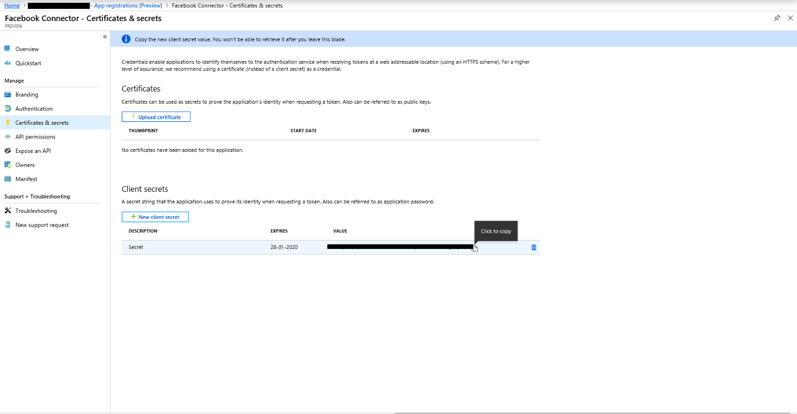

# Implementar un conector para archivar datos de páginas empresariales de FacebookDeploy a connector to archive Facebook Business pages data

Este artículo contiene el proceso paso a paso para implementar un conector que usa el servicio de importación de Office 365 para importar datos de páginas de Facebook Business a Microsoft 365.This article contains the step-by-step process to deploy a connector that uses the Office 365 Import service to import data from Facebook Business pages to Microsoft 365. Para obtener información general de alto nivel sobre este proceso y una lista de los requisitos previos necesarios para implementar un conector de Facebook, vea Configurar un conector para archivar [datos de Facebook.](archive-facebook-data-with-sample-connector.md)For a high-level overview of this process and a list of prerequisites required to deploy a Facebook connector, see [Set up a connector to archive Facebook data](archive-facebook-data-with-sample-connector.md).

## Paso 1: Crear una aplicación en Azure Active DirectoryStep 1: Create an app in Azure Active Directory

1. Vaya a <https://portal.azure.com> e inicie sesión con las credenciales de una cuenta de administrador global.Go to <https://portal.azure.com> and sign in using the credentials of a global admin account.

    

2. En el panel de navegación izquierdo, haga clic **en Azure Active Directory.**In the left navigation pane, click **Azure Active Directory**.

    

3. En el panel de navegación izquierdo, haga clic en **Registros de aplicaciones (vista previa)** y, a continuación, haga clic **en Nuevo registro.**In the left navigation pane, click **App registrations (Preview)** and then click **New registration**.

    

4. Registre la aplicación.Register the application. En URI de redireccionamiento, seleccione Web en la lista desplegable de tipos de aplicación y, a continuación, <https://portal.azure.com> escriba el cuadro para el URI.Under Redirect URI, select Web in the application type dropdown list and then type <https://portal.azure.com> in the box for the URI.

   

5. Copie el **id. de aplicación (cliente)** y el id. de directorio **(inquilino)** y guárdelos en un archivo de texto u otra ubicación segura.Copy the **Application (client) ID** and **Directory (tenant) ID** and save them to a text file or other safe location. Estos iDs se usan en pasos posteriores.You use these IDs in later steps.

   

6. Ve a **Certificados & secretos de la nueva aplicación.**Go to **Certificates & secrets for the new app.**

   

7. Haga clic **en Nuevo secreto de cliente**Click **New client secret**

   

8. Cree un nuevo secreto.Create a new secret. En el cuadro de descripción, escriba el secreto y, a continuación, elija un período de expiración.In the description box, type the secret and then choose an expiration period.

    

9. Copie el valor del secreto y guárdelo en un archivo de texto u otra ubicación de almacenamiento.Copy the value of the secret and save it to a text file or other storage location. Este es el secreto de aplicación de AAD que se usa en pasos posteriores.This is the AAD application secret that you use in later steps.

   

## Paso 2: Implementar el servicio web del conector desde GitHub en su cuenta de AzureStep 2: Deploy the connector web service from GitHub to your Azure account

1. Vaya a [este sitio de GitHub](https://github.com/microsoft/m365-sample-connector-csharp-aspnet) y haga **clic en Implementar en Azure.**Go to [this GitHub site](https://github.com/microsoft/m365-sample-connector-csharp-aspnet) and click **Deploy to Azure**.

    

2. Después de hacer **clic en Implementar en Azure,** se le redirigirá a un portal de Azure con una página de plantilla personalizada.After you click **Deploy to Azure**, you will be redirected to an Azure portal with a custom template page. Rellene los detalles **de conceptos básicos** **y configuración** y, a continuación, haga clic en **Comprar**.Fill in the **Basics** and **Settings** details and then click **Purchase**.

   - **Suscripción:** Seleccione la suscripción de Azure en la que desea implementar el servicio web del conector de páginas empresariales de Facebook.**Subscription:** Select your Azure subscription that you want to deploy the Facebook Business pages connector web service to.

   - **Grupo de recursos:** Elija o cree un nuevo grupo de recursos.**Resource group:** Choose or create a new resource group. Un grupo de recursos es un contenedor que contiene recursos relacionados para una solución de Azure.A resource group is a container that holds related resources for an Azure solution.

   - **Ubicación:** Elija una ubicación.**Location:** Choose a location.

   - **Nombre de aplicación web:** Proporcione un nombre único para la aplicación web del conector.**Web App Name:** Provide a unique name for the connector web app. El nombre debe tener entre 3 y 18 caracteres de longitud.Th name must be between 3 and 18 characters in length. Este nombre se usa para crear la dirección URL del servicio de aplicaciones de Azure; por ejemplo, si proporciona el nombre de la aplicación web **de fbconnector,** la dirección URL del servicio de aplicaciones de Azure **será fbconnector.azurewebsites.net**.This name is used to create the Azure app service URL; for example, if you provide the Web app name of **fbconnector** then the Azure app service URL  will be **fbconnector.azurewebsites.net**.

   - **tenantId:** El id. de inquilino de su organización de Microsoft 365 que copió después de crear la aplicación conector de Facebook en Azure Active Directory en el paso 1.**tenantId:** The tenant ID of your Microsoft 365 organization that you copied after creating the Facebook connector app in Azure Active Directory in Step 1.

   - **APISecretKey:** Puede escribir cualquier valor como secreto.**APISecretKey:** You can type any value as the secret. Esto se usa para obtener acceso a la aplicación web del conector en el paso 5.This is used to access the connector web app in Step 5.

     

3. Una vez que la implementación se realiza correctamente, la página tendrá un aspecto similar a la siguiente captura de pantalla:After the deployment is successful, the page will look similar to the following screenshot:

   

## Paso 3: Registrar la aplicación de FacebookStep 3: Register the Facebook app

1. Vaya a , inicie sesión con las credenciales de la cuenta de las páginas empresariales de Facebook de su organización y, a continuación, haga clic <https://developers.facebook.com> **en Agregar nueva aplicación.**Go to <https://developers.facebook.com>, log in using the credentials for the account for your organization's Facebook Business pages, and then click **Add New App**.

   

2. Crea un nuevo identificador de aplicación.Create a new app ID.

   

3. En el panel de navegación izquierdo, haga clic **en Agregar productos** y, a continuación, haga clic en Configurar **en** el icono Inicio de sesión **de Facebook.**In the left navigation pane, click **Add Products** and then click **Set Up** in the **Facebook Login** tile.

   

4. En la página Integrar inicio de sesión de Facebook, haga clic **en Web.**On the Integrate Facebook Login page, click **Web**.

   

5. Agregar la dirección URL del servicio de aplicaciones de Azure; por `https://fbconnector.azurewebsites.net` ejemplo.Add the Azure app service URL; for example `https://fbconnector.azurewebsites.net`.

   

6. Complete la sección Inicio rápido de la configuración de inicio de sesión de Facebook.Complete the QuickStart section of the Facebook Login setup.

   

7. En el panel de navegación izquierdo, en Inicio de sesión de **Facebook,** haga clic en Configuración y agregue el URI de redireccionamiento de OAuth en el cuadro URI de redireccionamiento **de OAuth** válido.In the left navigation pane under **Facebook Login**, click **Settings**, and add the OAuth redirect URI in the **Valid OAuth Redirect URIs** box. Use el formato **\<connectorserviceuri> /Views/FacebookOAuth**, donde el valor de connectorserviceuri es la dirección URL del servicio de aplicaciones de Azure para su organización; por ejemplo, `https://fbconnector.azurewebsites.net` .Use the format **\<connectorserviceuri>/Views/FacebookOAuth**, where the value for connectorserviceuri is the Azure app service URL for your organization; for example, `https://fbconnector.azurewebsites.net`.

   

8. En el panel de navegación izquierdo, haga clic **en Agregar productos** y, a continuación, en **Webhooks.**In the left navigation pane, click **Add Products** and then click **Webhooks.** En el **menú** desplegable Página, haga clic en **Página.**In the **Page** pull-down menu, click **Page**.

   

9. Agregue la dirección URL de devolución de llamada de webhooks y agregue un token de comprobación.Add Webhooks Callback URL and add a verify token. El formato de la dirección URL de devolución de llamada, use el formato **<connectorserviceuri> /api/FbPageWebhook**, donde el valor de connectorserviceuri es la dirección URL del servicio de aplicaciones de Azure para su organización; por `https://fbconnector.azurewebsites.net` ejemplo.The format of the callback URL, use the format **<connectorserviceuri>/api/FbPageWebhook**, where the value for connectorserviceuri is the Azure app service URL for your organization; for example `https://fbconnector.azurewebsites.net`.

   El token de comprobación debe ser similar a una contraseña segura.The verify token should similar to a strong password. Copie el token de verificación en un archivo de texto u otra ubicación de almacenamiento.Copy the verify token to a text file or other storage location.

   

10. Pruebe y suscríbase al punto de conexión para la fuente.Test and subscribe to the endpoint for feed.

    

11. Agrega una dirección URL de privacidad, un icono de aplicación y un uso empresarial.Add a privacy URL, app icon, and business use. Además, copia el identificador de la aplicación y el secreto de la aplicación en un archivo de texto u otra ubicación de almacenamiento.Also, copy the app ID and app secret to a text file or other storage location.

    

12. Haz que la aplicación sea pública.Make the app public.

    

13. Agregar usuario al rol de administrador o evaluador.Add user to the admin or tester role.

    

14. Agregue el **permiso Acceso al contenido público de la** página.Add the **Page Public Content Access** permission.

    

15. Agregar permiso Administrar páginas.Add Manage Pages permission.

    

16. Obtén la aplicación revisada por Facebook.Get the application reviewed by Facebook.

    

## Paso 4: Configurar la aplicación web del conectorStep 4: Configure the connector web app

1. Ve a (donde AzureAppResourceName es el nombre del recurso de la aplicación de `https://<AzureAppResourceName>.azurewebsites.net` Azure que llamaste en el paso 4).Go to `https://<AzureAppResourceName>.azurewebsites.net` (where AzureAppResourceName is the name of your Azure app resource that you named in Step 4). Por ejemplo, si el nombre es **fbconnector**, vaya a `https://fbconnector.azurewebsites.net` .For example, if the name is **fbconnector**, go to `https://fbconnector.azurewebsites.net`. La página principal de la aplicación tendrá el aspecto de la siguiente captura de pantalla:The home page of the app will look like the following screenshot:

   

2. Haga **clic en Configurar** para mostrar una página de inicio de sesión.Click **Configure** to display a sign in page.

   

3. En el cuadro Id. de inquilino, escriba o pegue el id. de inquilino (que obtuvo en el paso 2).In the Tenant Id box, type or paste your tenant Id (that you obtained in Step 2). En el cuadro de contraseña, escriba o pegue la APISecretKey (que  obtuvo en el paso 2) y, a continuación, haga clic en Establecer opciones de configuración para mostrar la página de detalles de configuración.In the password box, type or paste the APISecretKey (that you obtained in Step 2), and then click **Set Configuration Settings** to display the configuration details page.

    

4. Escriba las siguientes opciones de configuraciónEnter the following configuration settings

   - **Id. de aplicación de Facebook:** El identificador de la aplicación de Facebook que obtuvo en el paso 3.**Facebook application ID:** The app ID for the Facebook application that you obtained in Step 3.

   - **Secreto de aplicación de Facebook:** El secreto de aplicación para la aplicación de Facebook que obtuvo en el paso 3.**Facebook application secret:** The app secret for the Facebook application that you obtained in Step 3.

   - **Los webhooks de Facebook comprueban el token:** El token de comprobación que creó en el paso 3.**Facebook webhooks verify token:** The verify token that you created in Step 3.

   - **Id. de aplicación de AAD:** Identificador de aplicación de la aplicación de Azure Active Directory que creó en el paso 1.**AAD application ID:** The application ID for the Azure Active Directory app that you created in Step 1.

   - **Secreto de aplicación de AAD:** El valor del secreto APISecretKey que creó en el paso 1.**AAD application secret:** The value for the APISecretKey secret that you created in Step 1.

5. Haga **clic en Guardar** para guardar la configuración del conector.Click **Save** to save the connector settings.

## Paso 5: Configurar un conector de Facebook en el Centro de cumplimiento de Microsoft 365Step 5: Set up a Facebook connector in the Microsoft 365 compliance center

1. Vaya a conectores de datos y, a continuación, [https://compliance.microsoft.com](https://compliance.microsoft.com) haga clic en **Conectores** de datos en el panel de navegación izquierdo.Go to [https://compliance.microsoft.com](https://compliance.microsoft.com) and then click **Data connectors** in the left nav.

2. En la página **Conectores de datos** de **las páginas de Facebook Empresa,** haga clic **en Ver**.On the **Data connectors** page under **Facebook Business pages**, click **View**.

3. En la página **Páginas empresariales de Facebook,** haga clic **en Agregar conector.**On the **Facebook business pages** page, click **Add connector**.

4. En la **página Términos de** servicio, haga clic **en Aceptar.**On the **Terms of service** page, click **Accept**.

5. En la **página Agregar credenciales para la aplicación del** conector, escriba la siguiente información y, a continuación, haga clic en Validar **conexión.**On the **Add credentials for your connector app** page, enter the following information and then click **Validate connection**.

   

   - En el **cuadro** Nombre, escriba un nombre para el conector, como la página **de noticias de Facebook**.In the **Name** box, type a name for the connector, such as **Facebook news page**.

   - En el **cuadro Dirección URL de** conexión, escriba o pegue la dirección URL del servicio de aplicaciones de Azure; por `https://fbconnector.azurewebsites.net` ejemplo.In the **Connection URL** box, type or paste the Azure app service URL; for example `https://fbconnector.azurewebsites.net`.

   - En el **cuadro** Contraseña, escriba o pegue el valor de APISecretKey que agregó en el paso 2.In the **Password** box, type or paste the value of the APISecretKey that you added in Step 2.

   - En el **cuadro Id.** de aplicación de Azure, escriba o pegue el valor del identificador de aplicación (cliente) también llamado id. de aplicación de AAD que creó en el paso 1.In the **Azure App ID** box, type or paste the value of the Application (client) ID also called as AAD Application ID that you created in Step 1.

6. Una vez validada correctamente la conexión, haga clic en **Siguiente.**After the connection is successfully validated, click **Next**.

7. En la **página Autorizar a Microsoft 365** para importar datos, vuelva a escribir o pegar APISecretKey y, a continuación, haga clic en Iniciar sesión en la aplicación **web.**On the **Authorize Microsoft 365 to import data** page, type or paste the APISecretKey again and then click **Login web app**.

8. En la página Configurar la aplicación del conector de **Facebook,** haga clic en Iniciar sesión con **Facebook** e inicie sesión con las credenciales de la cuenta de las páginas de Facebook Business de su organización.On the **Configure Facebook connector app** page, click **Login with Facebook** and log in using the credentials for the account for your organization's Facebook Business pages. Asegúrese de que la cuenta de Facebook en la que inició sesión tiene asignado el rol de administrador de las páginas de Facebook Business de su organización.Make sure the Facebook account that you logged in to is assigned the admin role for your organization's Facebook Business pages.

   

9. Se muestra una lista de las páginas empresariales administradas por la cuenta de Facebook en la que inició sesión.A list of the business pages managed by the Facebook account that you logged in to is displayed. Seleccione la página que desea archivar y, a continuación, haga clic **en Siguiente.**Select the page to archive and then click **Next**.

   

10. Haga **clic en** Continuar para salir de la configuración de la aplicación de servicio del conector.Click **Continue** to exit the setup of the connector service app.

11. En la **página Establecer filtros,** puede aplicar un filtro para importar inicialmente elementos que tienen una antigüedad determinada.On the **Set filters** page, you can apply a filter to initially import items that are a certain age. Seleccione una antigüedad y, a continuación, haga clic **en Siguiente**.Select an age, and then click **Next**.

12. En la **página Elegir ubicación** de almacenamiento, escriba la dirección de correo electrónico del buzón de Microsoft 365 al que se importarán los elementos de Facebook y, a continuación, haga clic en **Siguiente.**On the **Choose storage location** page, type the email address of Microsoft 365 mailbox that the Facebook items will be imported to, and then click **Next**.

13. Haga **clic en Siguiente** para revisar la configuración del conector y, a continuación, haga clic en Finalizar para completar la configuración del conector. Click **Next** to review the connector settings and then click **Finish** to complete the connector setup.

14. En el Centro de cumplimiento, vaya a la  página **Conectores** de datos y haga clic en la pestaña Conectores para ver el progreso del proceso de importación.In the compliance center, go to the **Data connectors** page, and click the **Connectors** tab to see the progress of the import process.
