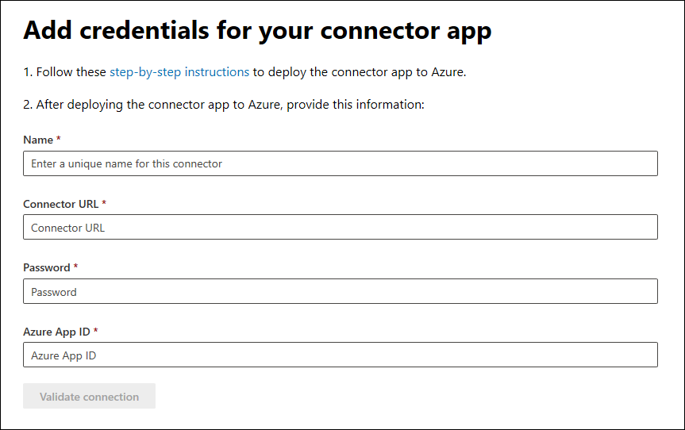

# Implementación de un conector para archivar datos de páginas empresariales de Facebook

[!include[Purview banner](../includes/purview-rebrand-banner.md)]

Este artículo contiene el proceso paso a paso para implementar un conector que usa el servicio de importación de Office 365 para importar datos de páginas de Facebook Business a Microsoft 365. Para obtener información general de alto nivel de este proceso y una lista de los requisitos previos necesarios para implementar un conector de Facebook, consulte [Configuración de un conector para archivar datos de Facebook](archive-facebook-data-with-sample-connector.md).

## Paso 1: Crear una aplicación en Azure Active Directory

1. Vaya a <https://portal.azure.com> e inicie sesión con las credenciales de una cuenta de administrador global.

    

2. En el panel de navegación izquierdo, haga clic en **Azure Active Directory**

    

3. En el panel de navegación izquierdo, haga clic en **Registros de aplicaciones (versión preliminar)** y, a continuación, haga clic en **Nuevo registro**.

    

4. Registre la aplicación. En URI de redirección, seleccione Web en la lista desplegable tipo de aplicación y escriba <https://portal.azure.com> el cuadro del URI.

   

5. Copie el **identificador de aplicación (cliente)** y el **identificador de directorio (inquilino)** y guárdelos en un archivo de texto u otra ubicación segura. Estos identificadores se usan en pasos posteriores.

   

6. Vaya a **Certificados & secretos de la nueva aplicación.**

   

7. Haga clic en **Nuevo secreto de cliente**

   

8. Cree un nuevo secreto. En el cuadro de descripción, escriba el secreto y elija un período de expiración.

    

9. Copie el valor del secreto y guárdelo en un archivo de texto u otra ubicación de almacenamiento. Este es el secreto de aplicación AAD que se usa en pasos posteriores.

   

## Paso 2: Implementación del servicio web del conector desde GitHub en la cuenta de Azure

1. Vaya a [este sitio GitHub](https://github.com/microsoft/m365-sample-connector-csharp-aspnet) y haga clic en **Implementar en Azure**.

    

2. Después de hacer clic en **Implementar en Azure**, se le redirigirá a una Azure Portal con una página de plantilla personalizada. Rellene los **detalles básicos** y **Configuración** y, a continuación, haga clic en **Comprar**.

   - **Suscripción:** Seleccione la suscripción de Azure en la que desea implementar el servicio web del conector de páginas empresariales de Facebook.

   - **Grupo de recursos:** Elija o cree un nuevo grupo de recursos. Un grupo de recursos es un contenedor que contiene recursos relacionados para una solución de Azure.

   - **Ubicación:** Elija una ubicación.

   - **Nombre de la aplicación web:** Proporcione un nombre único para la aplicación web del conector. El nombre debe tener entre 3 y 18 caracteres. Este nombre se usa para crear la dirección URL de Azure App Service; por ejemplo, si proporciona el nombre de la aplicación web de **fbconnector** , se **fbconnector.azurewebsites.net** la dirección URL de Azure App Service.

   - **tenantId:** El identificador de inquilino de la organización de Microsoft 365 que copió después de crear la aplicación del conector de Facebook en Azure Active Directory en el paso 1.

   - **APISecretKey:** Puede escribir cualquier valor como secreto. Esto se usa para acceder a la aplicación web del conector en el paso 5.

     

3. Una vez que la implementación se realice correctamente, la página tendrá un aspecto similar al de la captura de pantalla siguiente:

   

## Paso 3: Registro de la aplicación de Facebook

1. Vaya a <https://developers.facebook.com>, inicie sesión con las credenciales de la cuenta de las páginas de Facebook Business de su organización y, a continuación, haga clic en **Agregar nueva aplicación**.

   

2. Cree un nuevo identificador de aplicación.

   

3. En el panel de navegación izquierdo, haga clic en **Agregar productos** y, a continuación, haga clic en **Configurar** en el icono **Inicio de sesión de Facebook** .

   

4. En la página Integrar inicio de sesión de Facebook, haga clic en **Web**.

   

5. Agregue la dirección URL de Azure App Service; por ejemplo `https://fbconnector.azurewebsites.net`, .

   

6. Complete la sección Inicio rápido de la configuración de inicio de sesión de Facebook.

   

7. En el panel de navegación izquierdo, en **Inicio de sesión de Facebook**, haga clic en **Configuración** y agregue el URI de redirección de OAuth en el cuadro **Uri de redirección de OAuth válido**. Use el formato **\<connectorserviceuri>/Views/FacebookOAuth**, donde el valor de connectorserviceuri es la dirección URL de Azure App Service para su organización; por ejemplo, `https://fbconnector.azurewebsites.net`.

   

8. En el panel de navegación izquierdo, haga clic en **Agregar productos** y, a continuación, haga clic en **Webhooks.** En el menú desplegable **Página** , haga clic en **Página**.

   

9. Agregue la dirección URL de devolución de llamada de Webhooks y agregue un token de comprobación. El formato de la dirección URL de devolución de llamada, use el formato `<connectorserviceuri>/api/FbPageWebhook`, donde el valor de connectorserviceuri es la dirección URL de Azure App Service para su organización; por ejemplo `https://fbconnector.azurewebsites.net`, .

   El token de comprobación debe ser similar a una contraseña segura. Copie el token de comprobación en un archivo de texto u otra ubicación de almacenamiento.

   

10. Pruebe y suscríbase al punto de conexión para la fuente.

    

11. Agregue una dirección URL de privacidad, un icono de aplicación y un uso empresarial. Además, copie el identificador de la aplicación y el secreto de la aplicación en un archivo de texto u otra ubicación de almacenamiento.

    

12. Haga pública la aplicación.

    

13. Agregue un usuario al rol de administrador o evaluador.

    

14. Agregue el permiso **Acceso a contenido público de página** .

    

15. Agregue el permiso Administrar páginas.

    

16. Obtenga la aplicación revisada por Facebook.

    

## Paso 4: Configuración de la aplicación web del conector

1. Vaya a `https://<AzureAppResourceName>.azurewebsites.net` (donde AzureAppResourceName es el nombre del recurso de aplicación de Azure que anominó en el paso 4). Por ejemplo, si el nombre es **fbconnector**, vaya a `https://fbconnector.azurewebsites.net`. La página principal de la aplicación tendrá un aspecto similar al de la captura de pantalla siguiente:

   

2. Haga clic en **Configurar** para mostrar una página de inicio de sesión.

   

3. En el cuadro Id. de inquilino, escriba o pegue el identificador de inquilino (que obtuvo en el paso 2). En el cuadro contraseña, escriba o pegue apiSecretKey (que obtuvo en el paso 2) y, a continuación, haga clic en **Establecer configuración Configuración** para mostrar la página de detalles de configuración.

    

4. Escriba las siguientes opciones de configuración.

   - **Identificador de aplicación de Facebook:** El identificador de la aplicación de Facebook que obtuvo en el paso 3.

   - **Secreto de aplicación de Facebook:** El secreto de la aplicación de Facebook que obtuvo en el paso 3.

   - **Los webhooks de Facebook comprueban el token:** El token de comprobación que creó en el paso 3.

   - **AAD identificador de aplicación:** el identificador de aplicación de la aplicación de Azure Active Directory que creó en el paso 1.

   - **AAD secreto de aplicación:** el valor del secreto APISecretKey que creó en el paso 1.

5. Haga clic en **Guardar** para guardar la configuración del conector.

## Paso 5: Configurar un conector de Facebook en el portal de cumplimiento

1. Vaya al portal de cumplimiento de Microsoft Purview y <a href="https://go.microsoft.com/fwlink/p/?linkid=2173865" target="_blank"> seleccione **Conectores de datos**</a.

2. En la página **Conectores de datos** en **Páginas de Facebook Business**, haga clic en **Ver**.

3. En la página **de páginas empresariales de Facebook** , haga clic en **Agregar conector**.

4. En la página **Términos de servicio** , haga clic en **Aceptar**.

5. En la página **Agregar credenciales para la aplicación del conector** , escriba la siguiente información y, a continuación, haga clic en **Validar conexión**.

   

   - En el cuadro **Nombre** , escriba un nombre para el conector, como la **página de noticias de Facebook**.

   - En el cuadro **Dirección URL de conexión** , escriba o pegue la dirección URL de Azure App Service; por ejemplo `https://fbconnector.azurewebsites.net`, .

   - En el cuadro **Contraseña** , escriba o pegue el valor de APISecretKey que agregó en el paso 2.

   - En el cuadro **id. de App de Azure**, escriba o pegue el valor del identificador de aplicación (cliente) también llamado como AAD id. de aplicación que creó en el paso 1.

6. Una vez validada correctamente la conexión, haga clic en **Siguiente**.

7. En la página **Authorize Microsoft 365 to import data (Autorizar a Microsoft 365 importar datos**), escriba o pegue apiSecretKey de nuevo y, a continuación, haga clic en **Inicio de sesión de la aplicación web**.

8. En la página **Configurar la aplicación del conector de Facebook** , haga clic en **Iniciar sesión con Facebook** e inicie sesión con las credenciales de la cuenta de las páginas de Facebook Business de su organización. Asegúrese de que a la cuenta de Facebook en la que ha iniciado sesión se le asigna el rol de administrador para las páginas de Facebook Business de su organización.

   

9. Se muestra una lista de las páginas empresariales administradas por la cuenta de Facebook en la que ha iniciado sesión. Seleccione la página que desea archivar y, a continuación, haga clic en **Siguiente**.

   

10. Haga clic en **Continuar** para salir de la configuración de la aplicación de servicio del conector.

11. En la página **Establecer filtros** , puede aplicar un filtro para importar inicialmente elementos que tengan una determinada antigüedad. Seleccione una edad y, a continuación, haga clic en **Siguiente**.

12. En la página **Elegir ubicación de almacenamiento**, escriba la dirección de correo electrónico de Microsoft 365 buzón al que se importarán los elementos de Facebook y, a continuación, haga clic en **Siguiente**.

13. Haga clic en **Siguiente** para revisar la configuración del conector y, a continuación, haga clic en **Finalizar** para completar la configuración del conector.

14. En el centro de cumplimiento, vaya a la página **Conectores de datos** y haga clic en la pestaña **Conectores** para ver el progreso del proceso de importación.
