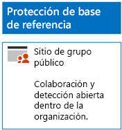
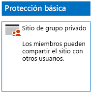
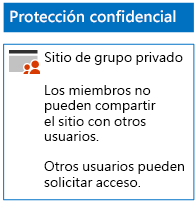
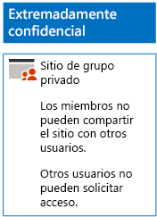

# Implementar sitios de SharePoint Online con tres niveles de protección

Siga los pasos de este artículo para diseñar e implementar sitios de grupo de base de referencia, confidenciales y extremadamente confidenciales de SharePoint Online. Para más información sobre estos tres niveles de protección, vea [Proteger sitios y archivos de SharePoint Online](../security/office-365-security/secure-sharepoint-online-sites-and-files.md).
  
## Sitios de grupo de base de referencia de SharePoint Online

La protección de base de referencia incluye sitios de grupo públicos y privados. Todo el personal de la organización puede acceder a los sitios de grupo públicos. Solo los miembros del grupo de Office 365 asociado al sitio de grupo pueden detectar sitios privados y acceder a ellos. Ambos tipos de sitios de grupo permiten a los miembros compartir el sitio con otros usuarios.
  
### Público

Para crear un sitio de grupo de SharePoint Online de línea base con acceso y permisos públicos, siga [estas instrucciones](https://support.office.com/article/create-a-team-site-in-sharepoint-ef10c1e7-15f3-42a3-98aa-b5972711777d).

Esta es la configuración resultante.
  

  
### Privado

Para crear un sitio de grupo de SharePoint Online de línea base con acceso y permisos privados, siga [estas instrucciones](https://support.office.com/article/create-a-team-site-in-sharepoint-ef10c1e7-15f3-42a3-98aa-b5972711777d).
  
Esta es la configuración resultante.
  

  
## Sitios de grupo confidenciales de SharePoint Online

Un sitio de grupo confidencial de SharePoint Online empieza como un sitio de grupo privado.
  
Primero, cree el sitio de grupo de SharePoint Online privado mediante [estas instrucciones](https://support.office.com/article/create-a-team-site-in-sharepoint-ef10c1e7-15f3-42a3-98aa-b5972711777d).

Después, desde el nuevo sitio de grupo de SharePoint Online, configure los permisos adicionales con estos pasos.

1.  En la barra de herramientas, haga clic en el sitio de grupo de SharePoint, en el icono de configuración y, luego, en **Permisos del sitio**.
2.  En el panel **Permisos del sitio**, en **Configuración de uso compartido**, haga clic en **Cambiar configuración de uso compartido**.
3.  En **Permisos de uso compartido**, seleccione **Solo los propietarios del sitio pueden compartir archivos, carpetas, además del sitio** y, luego, haga clic en **Guardar**.

Los resultados de esta configuración de permisos son los siguientes:

- La capacidad de compartir con otros miembros está deshabilitada.
- La capacidad de los no miembros de solicitar acceso está deshabilitada.

Esta es la configuración resultante.
  

  
Los miembros del sitio, a través de la pertenencia a grupos en uno de los grupos de acceso, ahora pueden colaborar de forma segura en los recursos del sitio.
  
## Sitios de grupo de SharePoint Online extremadamente confidenciales

Un sitio de grupo de SharePoint Online extremadamente confidencial es un sitio de grupo privado con una configuración de permisos adicional.

Primero, cree el sitio de grupo de SharePoint Online privado mediante [estas instrucciones](https://support.office.com/article/create-a-team-site-in-sharepoint-ef10c1e7-15f3-42a3-98aa-b5972711777d).

Después, desde el nuevo sitio de grupo de SharePoint Online, configure los permisos adicionales con estos pasos.

1.  En la barra de herramientas, haga clic en el sitio de grupo de SharePoint, en el icono de configuración y, luego, en **Permisos del sitio**.
2.  En el panel **Permisos del sitio**, en **Configuración de uso compartido**, haga clic en **Cambiar configuración de uso compartido**.
3.  En **Permisos de uso compartido**, seleccione **Solo los propietarios del sitio pueden compartir archivos, carpetas y el sitio**.
4. Desactive **Permitir solicitudes de acceso** y, después, haga clic en **Guardar**.

Los resultados de esta configuración de permisos son los siguientes:

- La capacidad de compartir con otros miembros está deshabilitada.
- La capacidad de los no miembros de solicitar acceso está deshabilitada.

Esta es la configuración resultante.
  

  
Los miembros del sitio, a través de la pertenencia a grupos en uno de los grupos de acceso, ahora pueden colaborar de forma segura en los recursos del sitio.
  
## Paso siguiente

[Proteger archivos de SharePoint Online con DLP y etiquetas de Office 365](protect-sharepoint-online-files-with-office-365-labels-and-dlp.md)

## Vea también

[Instrucciones de seguridad de Microsoft para campañas políticas, organizaciones sin ánimo de lucro y otras organizaciones ágiles](../security/office-365-security/microsoft-security-guidance-for-political-campaigns-nonprofits-and-other-agile-o.md)
  
[Adopción de la nube y soluciones híbridas](https://docs.microsoft.com/office365/enterprise/cloud-adoption-and-hybrid-solutions)
