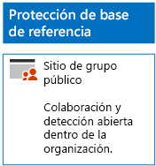
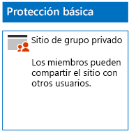
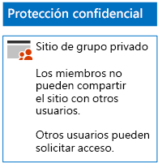
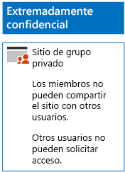

# Implementar sitios de SharePoint Online con tres niveles de protecciónDeploy SharePoint Online sites for three tiers of protection

Siga los pasos de este artículo para diseñar e implementar sitios de grupo de base de referencia, confidenciales y extremadamente confidenciales de SharePoint Online. Para más información sobre estos tres niveles de protección, vea [Proteger sitios y archivos de SharePoint Online](../security/office-365-security/secure-sharepoint-online-sites-and-files.md).Use the steps in this article to design and deploy baseline, sensitive, and highly confidential SharePoint Online team sites. For more information about these three tiers of protection, see [Secure SharePoint Online sites and files](../security/office-365-security/secure-sharepoint-online-sites-and-files.md).
  
## Sitios de grupo de base de referencia de SharePoint OnlineBaseline SharePoint Online team sites

La protección de base de referencia incluye sitios de grupo públicos y privados. Todo el personal de la organización puede acceder a los sitios de grupo públicos. Solo los miembros del grupo de Office 365 asociado al sitio de grupo pueden detectar sitios privados y acceder a ellos. Ambos tipos de sitios de grupo permiten a los miembros compartir el sitio con otros usuarios.Baseline protection includes both public and private team sites. Public team sites can be discovered and accessed by anybody in the organization. Private sites can only be discovered and accessed by members of the Office 365 group associated with the team site. Both of these types of team sites allow members to share the site with others.
  
### PúblicoPublic

Para crear un sitio de grupo de SharePoint Online de línea base con acceso y permisos públicos, siga [estas instrucciones](https://support.office.com/article/create-a-team-site-in-sharepoint-ef10c1e7-15f3-42a3-98aa-b5972711777d).To create a baseline SharePoint Online team site with public access and permissions, follow [these instructions](https://support.office.com/article/create-a-team-site-in-sharepoint-ef10c1e7-15f3-42a3-98aa-b5972711777d).

Esta es la configuración resultante.Here is your resulting configuration.
  

  
### PrivadoPrivate

Para crear un sitio de grupo de SharePoint Online de línea base con acceso y permisos privados, siga [estas instrucciones](https://support.office.com/article/create-a-team-site-in-sharepoint-ef10c1e7-15f3-42a3-98aa-b5972711777d).To create a baseline SharePoint Online team site with private access and permissions, follow [these instructions](https://support.office.com/article/create-a-team-site-in-sharepoint-ef10c1e7-15f3-42a3-98aa-b5972711777d).
  
Esta es la configuración resultante.Here is your resulting configuration.
  

  
## Sitios de grupo confidenciales de SharePoint OnlineSensitive SharePoint Online team sites

Un sitio de grupo confidencial de SharePoint Online empieza como un sitio de grupo privado.A sensitive SharePoint Online team site starts as a private team site.
  
Primero, cree el sitio de grupo de SharePoint Online privado mediante [estas instrucciones](https://support.office.com/article/create-a-team-site-in-sharepoint-ef10c1e7-15f3-42a3-98aa-b5972711777d).First, create the private SharePoint Online team site with [these instructions](https://support.office.com/article/create-a-team-site-in-sharepoint-ef10c1e7-15f3-42a3-98aa-b5972711777d).

Después, desde el nuevo sitio de grupo de SharePoint Online, configure los permisos adicionales con estos pasos.Next, from the new SharePoint Online team site, configure additional permission settings with these steps.

1.  En la barra de herramientas, haga clic en el sitio de grupo de SharePoint, en el icono de configuración y, luego, en **Permisos del sitio**.In the tool bar of the SharePoint team site, click the settings icon, and then click **Site permissions**.
2.  En el panel **Permisos del sitio**, en **Configuración de uso compartido**, haga clic en **Cambiar configuración de uso compartido**.In the **Site permissions** pane, under **Sharing Settings**, click **Change sharing settings**.
3.  En **Permisos de uso compartido**, seleccione **Solo los propietarios del sitio pueden compartir archivos, carpetas, además del sitio** y, luego, haga clic en **Guardar**.Under **Sharing permissions**, choose **Only site owners can share files, folders, and the site**, and then click **Save**.

Los resultados de esta configuración de permisos son los siguientes:The results of these permission settings are:

- La capacidad de compartir con otros miembros está deshabilitada.The ability for members to share with other members is disabled.
- La capacidad de los no miembros de solicitar acceso está deshabilitada.The ability for non-members to request access is enabled.

Esta es la configuración resultante.Here is your resulting configuration.
  

  
Los miembros del sitio, a través de la pertenencia a grupos en uno de los grupos de acceso, ahora pueden colaborar de forma segura en los recursos del sitio.The members of the site, through group membership in one of the access groups, can now securely collaborate on the resources of the site.
  
## Sitios de grupo de SharePoint Online extremadamente confidencialesHighly confidential SharePoint Online team sites

Un sitio de grupo de SharePoint Online extremadamente confidencial es un sitio de grupo privado con una configuración de permisos adicional.A highly confidential SharePoint Online team site is a private team site with additional permissions settings.

Primero, cree el sitio de grupo de SharePoint Online privado mediante [estas instrucciones](https://support.office.com/article/create-a-team-site-in-sharepoint-ef10c1e7-15f3-42a3-98aa-b5972711777d).First, create the private SharePoint Online team site with [these instructions](https://support.office.com/article/create-a-team-site-in-sharepoint-ef10c1e7-15f3-42a3-98aa-b5972711777d).

Después, desde el nuevo sitio de grupo de SharePoint Online, configure los permisos adicionales con estos pasos.Next, from the new SharePoint Online team site, configure additional permission settings with these steps.

1.  En la barra de herramientas, haga clic en el sitio de grupo de SharePoint, en el icono de configuración y, luego, en **Permisos del sitio**.In the tool bar of the SharePoint team site, click the settings icon, and then click **Site permissions**.
2.  En el panel **Permisos del sitio**, en **Configuración de uso compartido**, haga clic en **Cambiar configuración de uso compartido**.In the **Site permissions** pane, under **Sharing Settings**, click **Change sharing settings**.
3.  En **Permisos de uso compartido**, seleccione **Solo los propietarios del sitio pueden compartir archivos, carpetas y el sitio**.Under **Sharing permissions**, choose **Only site owners can share files, folders, and the site**.
4. Desactive **Permitir solicitudes de acceso** y, después, haga clic en **Guardar**.Turn off **Allow access requests**, and then click **Save**.

Los resultados de esta configuración de permisos son los siguientes:The results of these permission settings are:

- La capacidad de compartir con otros miembros está deshabilitada.The ability for members to share with other members is disabled.
- La capacidad de los no miembros de solicitar acceso está deshabilitada.The ability for non-members to request access is disabled.

Esta es la configuración resultante.Here is your resulting configuration.
  

  
Los miembros del sitio, a través de la pertenencia a grupos en uno de los grupos de acceso, ahora pueden colaborar de forma segura en los recursos del sitio.The members of the site, through group membership in one of the access groups, can now securely collaborate on the resources of the site.
  
## Paso siguienteNext step

[Proteger archivos de SharePoint Online con DLP y etiquetas de Office 365Protect SharePoint Online files with Office 365 labels and DLP](protect-sharepoint-online-files-with-office-365-labels-and-dlp.md)

## Vea tambiénSee also

[Instrucciones de seguridad de Microsoft para campañas políticas, organizaciones sin ánimo de lucro y otras organizaciones ágilesMicrosoft Security Guidance for Political Campaigns, Nonprofits, and Other Agile Organizations](../security/office-365-security/microsoft-security-guidance-for-political-campaigns-nonprofits-and-other-agile-o.md)
  
[Adopción de la nube y soluciones híbridasCloud adoption and hybrid solutions](https://docs.microsoft.com/office365/enterprise/cloud-adoption-and-hybrid-solutions)
