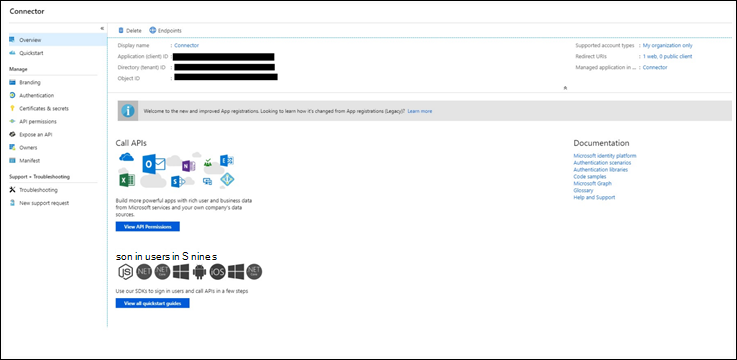
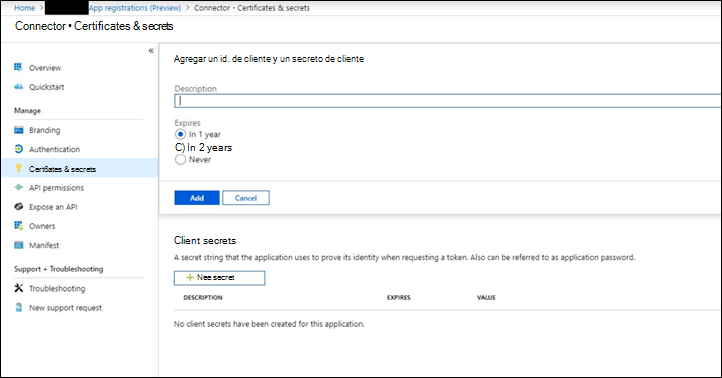
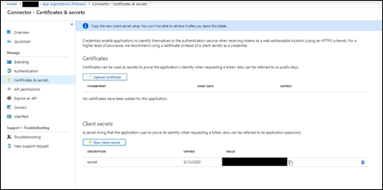
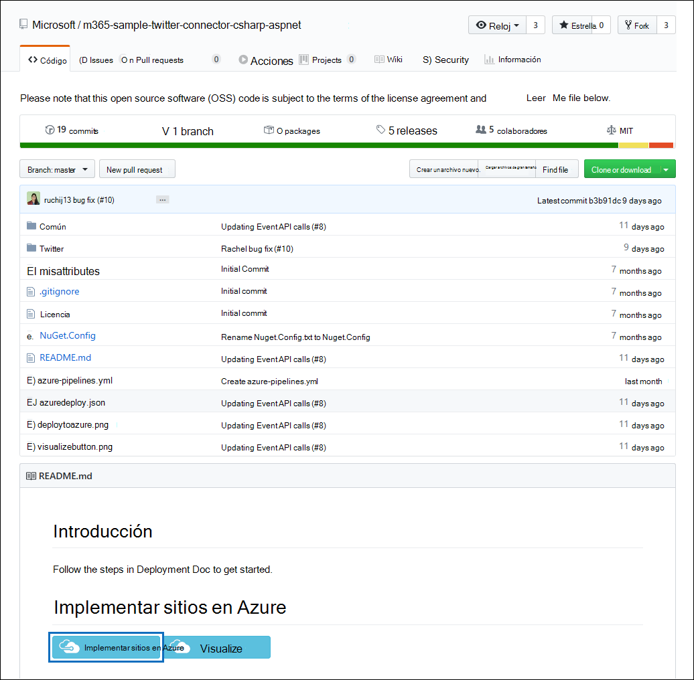
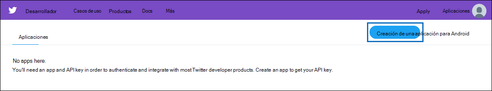
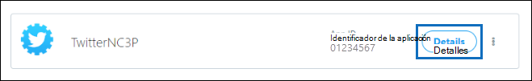
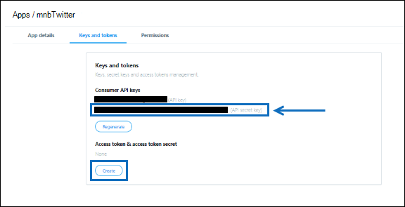
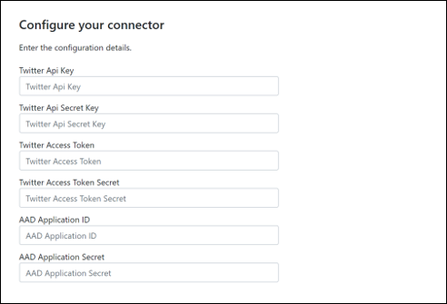
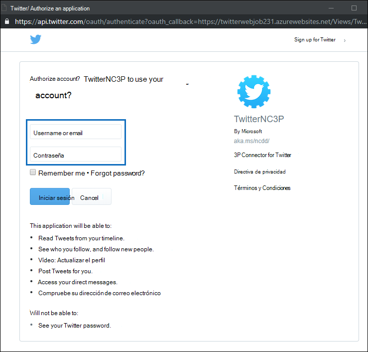

# Implementar un conector para archivar datos de TwitterDeploy a connector to archive Twitter data

Este artículo contiene el proceso paso a paso para implementar un conector que usa el servicio de importación de Office 365 para importar datos de la cuenta de Twitter de su organización a Microsoft 365.This article contains the step-by-step process to deploy a connector that uses the Office 365 Import service to import data from your organization's Twitter account to Microsoft 365. Para obtener una introducción de alto nivel de este proceso y una lista de los requisitos previos necesarios para implementar un conector de Twitter, consulte [configurar un conector para archivar datos de Twitter ](archive-twitter-data-with-sample-connector.md).For a high-level overview of this process and a list of prerequisites required to deploy a Twitter connector, see [Set up a connector to archive Twitter data ](archive-twitter-data-with-sample-connector.md). 

## Paso 1: crear una aplicación en Azure Active DirectoryStep 1: Create an app in Azure Active Directory

1. Vaya a <https://portal.azure.com> e inicie sesión con las credenciales de una cuenta de administrador global de Office 365.Go to <https://portal.azure.com> and sign in using the credentials of an Office 365 global admin account.

   

2. En el panel de navegación izquierdo, haga clic en **Azure Active Directory**.In the left navigation pane, click **Azure Active Directory**.

   

3. En el panel de navegación izquierdo, haga clic en **registros de aplicaciones (versión preliminar)** y, a continuación, haga clic en **nuevo registro**.In the left navigation pane, click **App registrations (Preview)** and then click **New registration**.

   

4. Registrar la aplicación.Register the application. En **URI de redireccionamiento (opcional)**, seleccione **Web** en la lista desplegable tipo de `https://portal.azure.com` aplicación y, a continuación, escriba en el cuadro del URI.Under **Redirect URI (optional)**, select **Web** in the application type dropdown list and then type `https://portal.azure.com` in the box for the URI.

   

5. Copie el identificador de la **aplicación (cliente)** y el **directorio (inquilino)** y guárdelos en un archivo de texto u otra ubicación segura.Copy the **Application (client) ID** and **Directory (tenant) ID** and save them to a text file or other safe location. Estos identificadores se usan en pasos posteriores.You use these IDs in later steps.

    

6. Vaya a **certificados & secretos para la nueva aplicación** y, en **secretos de cliente** , haga clic en **nuevo secreto de cliente**.Go to **Certificates & secrets for the new app** and under **Client secrets** click **New client secret**.

   

7. Cree un secreto nuevo.Create a new secret. En el cuadro Descripción, escriba el secreto y, a continuación, elija un período de expiración.In the description box, type the secret and then choose an expiration period. 

   

8. Copie el valor del secreto y guárdelo en un archivo de texto u otra ubicación de almacenamiento.Copy the value of the secret and save it to a text file or other storage location. Este es el secreto de la aplicación de AAD que se usa en pasos posteriores.This is the AAD application secret that you use in later steps.

   

## Paso 2: implementar el servicio Web del conector desde GitHub a su cuenta de AzureStep 2: Deploy the connector web service from GitHub to your Azure account

1. Vaya a [este sitio de github](https://github.com/microsoft/m365-sample-twitter-connector-csharp-aspnet) y haga clic en **implementar en Azure**.Go to [this GitHub site](https://github.com/microsoft/m365-sample-twitter-connector-csharp-aspnet) and click **Deploy to Azure**.

    

2. Después de hacer clic en **implementar en Azure**, se le redirigirá a un portal de Azure con una página de plantilla personalizada.After you click **Deploy to Azure**, you will be redirected to an Azure portal with a custom template page. Rellene los detalles de **conceptos básicos** y **configuración** y, a continuación, haga clic en **comprar**.Fill in the **Basics** and **Settings** details and then click **Purchase**.

   

    - **Suscripción:** Seleccione su suscripción a Azure en la que desea implementar el servicio Web del conector de Twitter.**Subscription:** Select your Azure subscription that you want to deploy the Twitter connector web service to.
    
    - **Grupo de recursos:** Elija o cree un nuevo grupo de recursos.**Resource group:** Choose or create a new resource group. Un grupo de recursos es un contenedor que contiene recursos relacionados para una solución de Azure.A resource group is a container that holds related resources for an Azure solution.

    - **Ubicación:** Elija una ubicación.**Location:** Choose a location.

    - **Nombre de la aplicación web:** Proporcione un nombre único para la aplicación web del conector.**Web App Name:** Provide a unique name for the connector web app. El nombre debe tener entre 3 y 18 caracteres de longitud.Th name must be between 3 and 18 characters in length. Este nombre se usa para crear la dirección URL de Azure App Service; por ejemplo, si proporciona el nombre de la aplicación Web de **twitterconnector** , la dirección URL del servicio de aplicación de Azure será **twitterconnector.azurewebsites.net**.This name is used to create the Azure app service URL; for example, if you provide the Web app name of **twitterconnector** then the Azure app service URL  will be **twitterconnector.azurewebsites.net**.
    
    - **tenantId:** El identificador de inquilino de su organización de Microsoft 365 que copió después de crear la aplicación de conector de Facebook en Azure Active Directory en el paso 1.**tenantId:** The tenant ID of your Microsoft 365 organization that you copied after creating the Facebook connector app in Azure       Active Directory in Step 1.
    
   - **APISecretKey:** Puede escribir cualquier valor como secreto.**APISecretKey:** You can type any value as the secret. Se usa para obtener acceso a la aplicación web del conector en el paso 5.This is used to access the connector web app in Step 5.

3. Una vez completada la implementación, la página tendrá un aspecto similar al de la siguiente captura de pantalla:After the deployment is successful, the page will look similar to the following screenshot:

    

## Paso 3: crear la aplicación de TwitterStep 3: Create the Twitter app

1. Vaya a https://developer.twitter.com, inicie sesión con las credenciales de la cuenta de desarrollador de su organización y, a continuación, haga clic en **aplicaciones**.Go to https://developer.twitter.com, log in using the credentials for the developer account for your organization, and then click **Apps**.

   
2. Haga clic en **crear una aplicación**.Click **Create an app**.
   
   

3. En **detalles**de la aplicación, agregue información sobre la aplicación.Under **App details**, add information about the application.

   

4. En el panel del programador de Twitter, seleccione la aplicación que acaba de crear y copie el identificador de aplicación que se muestra y guárdelo en un archivo de texto u otra ubicación de almacenamiento.On the Twitter developer dashboard, select the app that you just created and copy the App ID that's displayed  and save it to a text file or other storage location. A continuación, haga clic en **detalles**.Then click **Details**.
   
   

5. En la pestaña **claves y tokens** , en **claves** de la API de consumidor, copie la clave secreta de la API y guárdela en un archivo de texto u otra ubicación de almacenamiento.On the **Keys and tokens** tab, under **Consumer API keys** copy the API secret key and save it to a text file or other storage location. A continuación, haga clic en **crear** para generar un token de acceso y un secreto de token de acceso, y cópielos en un archivo de texto u otra ubicación de almacenamiento.Then click **Create** to generate an access token and an access token secret, and copy these to a text file or other storage location.
   
   

   A continuación, haga clic en **crear** para generar un token de acceso y un secreto de token de acceso, y cópielos en un archivo de texto u otra ubicación de almacenamiento.Then click **Create** to generate an access token and an access token secret, and copy these to a text file or other storage location.

6. Haga clic en la pestaña **permisos** y configure los permisos como se muestra en la siguiente captura de pantalla:Click the **Permissions** tab and configure the permissions as shown in the following screenshot:

   

7. Una vez que haya guardado la configuración de permisos, haga clic en la pestaña detalles de la **aplicación** y, a continuación, haga clic en **Editar > editar detalles**.After you save the permission settings, click the **App details** tab, and then click **Edit > Edit details**.

   

8. Realice las siguientes tareas:Do the following tasks:

   - Active la casilla para permitir que la aplicación conector inicie sesión en Twitter.Select the checkbox to allow the connector app to sign in to Twitter.
   
   - Agregue el URI de redireccionamiento de OAuth con el siguiente formato: \*\* \<connectorserviceuri>/views/twitteroauth\*\*, donde el valor de *connectorserviceuri* es la dirección URL de Azure App Service para su organización; por ejemplo, https://twitterconnector.azurewebsites.net/Views/TwitterOAuth.Add the OAuth redirect Uri using the following format: **\<connectorserviceuri>/Views/TwitterOAuth**, where the value of *connectorserviceuri* is the Azure app service URL for your organization; for example, https://twitterconnector.azurewebsites.net/Views/TwitterOAuth.

    

La aplicación de desarrollo de Twitter ya está lista para usarse.The Twitter developer app is now ready to use.

## Paso 4: configurar la aplicación web del conectorStep 4: Configure the connector web app 

1. Vaya a https://\<AzureAppResourceName>. azurewebsites.net (donde **AzureAppResourceName** es el nombre del recurso de la aplicación de Azure que ha nombrado en el paso 4).Go to https://\<AzureAppResourceName>.azurewebsites.net (where **AzureAppResourceName** is the name of your Azure app resource that you named in Step 4). Por ejemplo, si el nombre es **twitterconnector**, vaya a https://twitterconnector.azurewebsites.net.For example, if the name is **twitterconnector**, go to https://twitterconnector.azurewebsites.net. La Página principal de la aplicación es similar a la siguiente captura de pantalla:The home page of the app looks like the following screenshot:

   

2. Haga clic en **configurar** para mostrar una página de inicio de sesión.Click **Configure** to display a sign in page.

   

3. En el cuadro identificador de inquilino, escriba o pegue el identificador de inquilino (que obtuvo en el paso 2).In the Tenant Id box, type or paste your tenant Id (that you obtained in Step 2). En el cuadro contraseña, escriba o pegue el APISecretKey (que obtuvo en el paso 2) y, a continuación, haga clic en **establecer valores de configuración** para mostrar la página Detalles de la configuración.In the password box, type or paste the APISecretKey (that you obtained in Step 2), and then click **Set Configuration Settings** to display the configuration details page.

   

4. Especifique las siguientes opciones de configuraciónEnter the following configuration settings 

   - **Clave de API de Twitter:** El identificador de aplicación de la aplicación de Twitter que creó en el paso 3.**Twitter Api Key:** The app ID for the Twitter application that you created in Step 3.
   
   - **Clave secreta de la API de Twitter:** Clave secreta de la API para la aplicación de Twitter que creó en el paso 3.**Twitter Api Secret Key:** The API secret key for the Twitter application that you created in Step 3.
   
   - **Token de acceso de Twitter:** El token de acceso que ha creado en el paso 3.**Twitter Access Token:** The access token that you created in Step 3.
   
   - **Secreto de token de acceso de Twitter:** El secreto de token de acceso que creó en el paso 3.**Twitter Access Token Secret:** The access token secret that you created in Step 3.
   
   - **Identificador de la aplicación de AAD:** El identificador de aplicación de la aplicación de Azure Active Directory que creó en el paso 1**AAD Application ID:** The application ID for the Azure Active Directory app that you created in Step 1
   
   - **Secreto de la aplicación AAD:** El valor del secreto APISecretKey que creó en el paso 1.**AAD Application Secret:** The value for the APISecretKey secret that you created in Step 1.

5. Haga clic en **Guardar** para guardar la configuración del conector.Click **Save** to save the connector settings.

## Paso 5: configurar un conector de Twitter en el centro de cumplimiento de Microsoft 365Step 5: Set up a Twitter connector in the Microsoft 365 compliance center

1. Vaya a [https://compliance.microsoft.com](https://compliance.microsoft.com) y, a continuación, haga clic en **conectores de datos** en el panel de navegación izquierdo.Go to [https://compliance.microsoft.com](https://compliance.microsoft.com) and then click **Data connectors** in the left nav.

2. En la página **conectores de datos (vista previa)** , en **Twitter**, haga clic en **Ver**.On the **Data connectors (preview)** page under **Twitter**, click **View**.

3. En la página de **Twitter** , haga clic en **Agregar conector**.On the **Twitter** page, click **Add connector**.

4. En la página **condiciones de servicio** , haga clic en **Aceptar**.On the **Terms of service** page, click **Accept**.

5. En la página **agregar credenciales para la aplicación de conector** , escriba la siguiente información y, a continuación, haga clic en **validar conexión**.On the **Add credentials for your connector app** page, enter the following information and then click **Validate connection**.

   

    - En el cuadro **nombre** , escriba un nombre para el conector, como **controlador de ayuda de Twitter**.In the **Name** box, type a name for the connector, such as **Twitter help handle**.
    
    - En el cuadro **dirección URL del conector** , escriba o pegue la dirección URL de Azure App Service; por ejemplo `https://twitterconnector.azurewebsites.net`.In the **Connector URL** box, type or paste the Azure app service URL; for example `https://twitterconnector.azurewebsites.net`.
    
    - En el cuadro **contraseña** , escriba o pegue el valor de la APISecretKey que creó en el paso 2.In the **Password** box, type or paste the value of the APISecretKey that you created in Step 2.
    
    - En el cuadro identificador de la **aplicación de Azure** , escriba o pegue el valor del identificador de aplicación de la aplicación de Azure (también denominado identificador de *cliente*) que obtuvo en el paso 1.In the **Azure App ID** box, type or paste the value of the Azure Application App Id (also called the *client ID*) that you obtained in Step 1.

6. Una vez validada correctamente la conexión, haga clic en **siguiente**.After the connection is successfully validated, click **Next**.

7. En la página **autorizar a Microsoft 365 a importar datos** , escriba o pegue el APISecretKey de nuevo y, a continuación, haga clic en **iniciar sesión en la aplicación web**.On the **Authorize Microsoft 365 to import data** page, type or paste the APISecretKey again and then click  **Login web app**.

8. Haga clic en **iniciar sesión con Twitter**.Click **Login with Twitter**.

9. En la página inicio de sesión de Twitter, inicie sesión con las credenciales de la cuenta de Twitter de su organización.On the Twitter sign in page, sign in using the credentials for your organization’s Twitter account.

   

   Después de iniciar sesión, la página de Twitter mostrará el siguiente mensaje de error "el trabajo del conector de Twitter se configuró correctamente".After you sign in, the Twitter page will display the following message, "Twitter Connector Job Successfully set up."

10. Haga clic en **continuar** para completar la configuración del conector de Twitter.Click **Continue** to complete setting up the Twitter connector.

11. En la página **Establecer filtros** , puede aplicar un filtro para importar inicialmente los elementos que tienen una antigüedad determinada.On the **Set filters** page, you can apply a filter to initially import items that are a certain age. Seleccione una edad y, a continuación, haga clic en **siguiente**.Select an age, and then click **Next**.

12. En la página **Elegir ubicación de almacenamiento** , escriba la dirección de correo electrónico del buzón de correo de Microsoft 365 al que se importarán los elementos de Twitter y, a continuación, haga clic en **siguiente**.On the **Choose storage location** page, type the email address of Microsoft 365 mailbox that the Twitter items will be imported to, and then click **Next**.

13. En el **acuerdo proporcionar consentimiento del administrador**, haga clic en **proporcionar consentimiento** y, a continuación, siga los pasos.On the **Provide admin consent**, click **Provide consent** and then follow the steps. Debe ser administrador global para dar su consentimiento al servicio de importación de Office 365 para obtener acceso a los datos de su organización.You must be a global admin to provide consent for the Office 365 Import service to access data in your organization.

14. Haga clic en **siguiente** para revisar la configuración del conector y, a continuación, haga clic en **Finalizar** para completar la configuración del conector.Click **Next** to review the connector settings and then click **Finish** to complete the connector setup.

15. En el centro de cumplimiento, vaya a la página **conectores de datos** y haga clic en la pestaña **conectores** para ver el progreso del proceso de importación.In the compliance center, go to the **Data connectors** page, and click the **Connectors** tab to see the progress of the import process.
