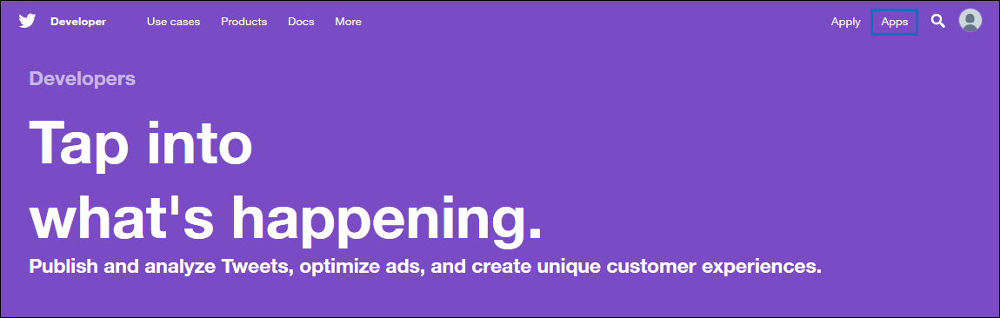

# Implementar un conector para archivar datos de TwitterDeploy a connector to archive Twitter data

Este artículo contiene el proceso paso a paso para implementar un conector que usa el servicio de importación de Office 365 para importar datos de la cuenta de Twitter de su organización a Microsoft 365.This article contains the step-by-step process to deploy a connector that uses the Office 365 Import service to import data from your organization's Twitter account to Microsoft 365. Para obtener información general de alto nivel sobre este proceso y una lista de requisitos previos necesarios para implementar un conector de Twitter, vea Configurar un conector para [archivar datos de Twitter ](archive-twitter-data-with-sample-connector.md).For a high-level overview of this process and a list of prerequisites required to deploy a Twitter connector, see [Set up a connector to archive Twitter data ](archive-twitter-data-with-sample-connector.md).

## Paso 1: Crear una aplicación en Azure Active DirectoryStep 1: Create an app in Azure Active Directory

1. Vaya a <https://portal.azure.com> e inicie sesión con las credenciales de una cuenta de administrador global.Go to <https://portal.azure.com> and sign in using the credentials of a global admin account.

   

2. En el panel de navegación izquierdo, haga clic en **Azure Active Directory**In the left navigation pane, click **Azure Active Directory**.

   

3. En el panel de navegación izquierdo, haga clic en **Registros de aplicaciones (versión preliminar)** y, a continuación, haga clic **en Nuevo registro.**In the left navigation pane, click **App registrations (Preview)** and then click **New registration**.

   

4. Registrar la aplicación.Register the application. En **URI de redireccionamiento (opcional),** seleccione **Web** en la lista desplegable tipo de aplicación y, a continuación, escriba el cuadro para `https://portal.azure.com` el URI.Under **Redirect URI (optional)**, select **Web** in the application type dropdown list and then type `https://portal.azure.com` in the box for the URI.

   

5. Copie el **identificador de aplicación (cliente)** y el id. de directorio **(inquilino)** y guárdelos en un archivo de texto u otra ubicación segura.Copy the **Application (client) ID** and **Directory (tenant) ID** and save them to a text file or other safe location. Estos IDs se usan en pasos posteriores.You use these IDs in later steps.

    

6. Vaya a **Certificados & secretos de la** nueva aplicación y, en Secretos **de** cliente, haga clic en Nuevo secreto **de cliente.**Go to **Certificates & secrets for the new app** and under **Client secrets** click **New client secret**.

   

7. Cree un nuevo secreto.Create a new secret. En el cuadro descripción, escriba el secreto y, a continuación, elija un período de expiración.In the description box, type the secret and then choose an expiration period.

   

8. Copie el valor del secreto y guárdelo en un archivo de texto u otra ubicación de almacenamiento.Copy the value of the secret and save it to a text file or other storage location. Este es el secreto de aplicación de AAD que se usa en los pasos posteriores.This is the AAD application secret that you use in later steps.

   

## Paso 2: Implementar el servicio web del conector GitHub en su cuenta de AzureStep 2: Deploy the connector web service from GitHub to your Azure account

1. Vaya a [este GitHub y](https://github.com/microsoft/m365-sample-twitter-connector-csharp-aspnet) haga clic en Implementar en **Azure**.Go to [this GitHub site](https://github.com/microsoft/m365-sample-twitter-connector-csharp-aspnet) and click **Deploy to Azure**.

    

2. Después de hacer **clic en Implementar en Azure,** se le redirigirá a un Portal de Azure con una página de plantilla personalizada.After you click **Deploy to Azure**, you will be redirected to an Azure portal with a custom template page. Rellene los detalles **básicos** **y Configuración** y, a continuación, haga clic en **Comprar**.Fill in the **Basics** and **Settings** details and then click **Purchase**.

   

    - **Suscripción:** Seleccione la suscripción de Azure en la que desea implementar el servicio web del conector de Twitter.**Subscription:** Select your Azure subscription that you want to deploy the Twitter connector web service to.

    - **Grupo de recursos:** Elija o cree un nuevo grupo de recursos.**Resource group:** Choose or create a new resource group. Un grupo de recursos es un contenedor que contiene recursos relacionados para una solución de Azure.A resource group is a container that holds related resources for an Azure solution.

    - **Ubicación:** Elija una ubicación.**Location:** Choose a location.

    - **Nombre de aplicación web:** Proporcione un nombre único para la aplicación web del conector.**Web App Name:** Provide a unique name for the connector web app. Th nombre debe tener entre 3 y 18 caracteres de longitud.Th name must be between 3 and 18 characters in length. Este nombre se usa para crear la dirección URL del servicio de aplicaciones de Azure; por ejemplo, si proporciona el nombre de la aplicación web **de twitterconnector,** la dirección URL del servicio de aplicaciones de Azure **se mostrará twitterconnector.azurewebsites.net**.This name is used to create the Azure app service URL; for example, if you provide the Web app name of **twitterconnector** then the Azure app service URL  will be **twitterconnector.azurewebsites.net**.

    - **tenantId:** El identificador de inquilino de la Microsoft 365 que copió después de crear la aplicación de conector de Facebook en Azure Active Directory en el paso 1.**tenantId:** The tenant ID of your Microsoft 365 organization that you copied after creating the Facebook connector app in Azure       Active Directory in Step 1.

   - **APISecretKey:** Puede escribir cualquier valor como secreto.**APISecretKey:** You can type any value as the secret. Esto se usa para tener acceso a la aplicación web del conector en el paso 5.This is used to access the connector web app in Step 5.

3. Una vez que la implementación se realiza correctamente, la página tendrá un aspecto similar a la siguiente captura de pantalla:After the deployment is successful, the page will look similar to the following screenshot:

    

## Paso 3: Crear la aplicación de TwitterStep 3: Create the Twitter app

1. Vaya a , inicie sesión con las credenciales de la cuenta de desarrollador de su organización y, a https://developer.twitter.com continuación, haga clic en **Aplicaciones**.Go to https://developer.twitter.com, log in using the credentials for the developer account for your organization, and then click **Apps**.

   
2. Haz **clic en Crear una aplicación**.Click **Create an app**.

   

3. En **Detalles de la** aplicación, agregue información sobre la aplicación.Under **App details**, add information about the application.

   

4. En el panel de desarrolladores de Twitter, seleccione la aplicación que acaba de crear y, a continuación, haga clic en **Detalles**.On the Twitter developer dashboard, select the app that you just created and then click **Details**.

   

5. En la pestaña Claves y **tokens,** en **Claves de la API** de consumidor, copie la clave api y la clave secreta de la API y guárdelas en un archivo de texto u otra ubicación de almacenamiento.On the **Keys and tokens** tab, under **Consumer API keys** copy both the API Key and the API secret key and save them to a text file or other storage location. A **continuación,** haga clic en Crear para generar un token de acceso y un secreto de token de acceso y copiarlos en un archivo de texto u otra ubicación de almacenamiento.Then click **Create** to generate an access token and access token secret and copy these to a text file or other storage location.

   

   A **continuación,** haga clic en Crear para generar un token de acceso y un secreto de token de acceso, y cópielos en un archivo de texto u otra ubicación de almacenamiento.Then click **Create** to generate an access token and an access token secret, and copy these to a text file or other storage location.

6. Haga clic **en la pestaña Permisos** y configure los permisos como se muestra en la siguiente captura de pantalla:Click the **Permissions** tab and configure the permissions as shown in the following screenshot:

   

7. Después de guardar la configuración de permisos, haga clic en la **pestaña Detalles** de la aplicación y, a continuación, haga clic en Editar > **Editar detalles.**After you save the permission settings, click the **App details** tab, and then click **Edit > Edit details**.

   

8. Realice las siguientes tareas:Do the following tasks:

   - Selecciona la casilla para permitir que la aplicación del conector inicie sesión en Twitter.Select the checkbox to allow the connector app to sign in to Twitter.

   - Agregue el Uri de redireccionamiento de OAuth con el siguiente formato: **\<connectorserviceuri> /Views/TwitterOAuth**, donde el valor de *connectorserviceuri* es la dirección URL del servicio de aplicaciones de Azure para su organización; por ejemplo, https://twitterconnector.azurewebsites.net/Views/TwitterOAuth .Add the OAuth redirect Uri using the following format: **\<connectorserviceuri>/Views/TwitterOAuth**, where the value of *connectorserviceuri* is the Azure app service URL for your organization; for example, https://twitterconnector.azurewebsites.net/Views/TwitterOAuth.

    

La aplicación para desarrolladores de Twitter ya está lista para usarse.The Twitter developer app is now ready to use.

## Paso 4: Configurar la aplicación web del conectorStep 4: Configure the connector web app

1. Vaya a https:// \<AzureAppResourceName> .azurewebsites.net (donde **AzureAppResourceName** es el nombre del recurso de la aplicación de Azure que nombra en el paso 4).Go to https://\<AzureAppResourceName>.azurewebsites.net (where **AzureAppResourceName** is the name of your Azure app resource that you named in Step 4). Por ejemplo, si el nombre es **twitterconnector**, vaya a https://twitterconnector.azurewebsites.net .For example, if the name is **twitterconnector**, go to https://twitterconnector.azurewebsites.net. La página principal de la aplicación tiene el aspecto de la siguiente captura de pantalla:The home page of the app looks like the following screenshot:

   

2. Haga **clic en** Configurar para mostrar una página de inicio de sesión.Click **Configure** to display a sign in page.

   

3. En el cuadro Identificador de inquilino, escriba o pegue el identificador de inquilino (que obtuvo en el paso 2).In the Tenant Id box, type or paste your tenant Id (that you obtained in Step 2). En el cuadro contraseña, escriba o pegue APISecretKey (que obtuvo en el paso 2) y, a **continuación,** haga clic en Establecer configuración Configuración para mostrar la página de detalles de configuración.In the password box, type or paste the APISecretKey (that you obtained in Step 2), and then click **Set Configuration Settings** to display the configuration details page.

   

4. Escriba las siguientes opciones de configuraciónEnter the following configuration settings

   - **Clave de api de Twitter:** La clave de API para la aplicación de Twitter que creó en el paso 3.**Twitter Api Key:** The API key for the Twitter application that you created in Step 3.

   - **Clave secreta de api de Twitter:** La clave secreta de api para la aplicación de Twitter que creó en el paso 3.**Twitter Api Secret Key:** The API secret key for the Twitter application that you created in Step 3.

   - **Token de acceso de Twitter:** El token de acceso que creó en el paso 3.**Twitter Access Token:** The access token that you created in Step 3.

   - **Secreto de token de acceso de Twitter:** El secreto de token de acceso que creó en el paso 3.**Twitter Access Token Secret:** The access token secret that you created in Step 3.

   - **Id. de aplicación de AAD:** El identificador de la aplicación Azure Active Directory que creaste en el paso 1**AAD Application ID:** The application ID for the Azure Active Directory app that you created in Step 1

   - **Secreto de aplicación de AAD:** Valor del secreto APISecretKey que creó en el paso 1.**AAD Application Secret:** The value for the APISecretKey secret that you created in Step 1.

5. Haga **clic en** Guardar para guardar la configuración del conector.Click **Save** to save the connector settings.

## Paso 5: Configurar un conector de Twitter en el Centro de cumplimiento de Microsoft 365Step 5: Set up a Twitter connector in the Microsoft 365 compliance center

1. Vaya a [https://compliance.microsoft.com](https://compliance.microsoft.com) y, a continuación, haga clic **en Conectores de datos** en la navegación izquierda.Go to [https://compliance.microsoft.com](https://compliance.microsoft.com) and then click **Data connectors** in the left nav.

2. En la página **Conectores de datos** de **Twitter,** haga clic en **Ver**.On the **Data connectors** page under **Twitter**, click **View**.

3. En la página **de Twitter,** haga clic **en Agregar conector**.On the **Twitter** page, click **Add connector**.

4. En la **página Términos de** servicio, haga clic **en Aceptar**.On the **Terms of service** page, click **Accept**.

5. En la **página Agregar credenciales para la aplicación del conector,** escriba la siguiente información y, a continuación, haga clic en Validar **conexión**.On the **Add credentials for your connector app** page, enter the following information and then click **Validate connection**.

   

    - En el **cuadro** Nombre, escriba un nombre para el conector, como el controlador **de ayuda de Twitter**.In the **Name** box, type a name for the connector, such as **Twitter help handle**.

    - En el **cuadro Dirección URL del** conector, escriba o pegue la dirección URL del servicio de aplicaciones de Azure; por ejemplo `https://twitterconnector.azurewebsites.net` .In the **Connector URL** box, type or paste the Azure app service URL; for example `https://twitterconnector.azurewebsites.net`.

    - En el **cuadro Contraseña,** escriba o pegue el valor de APISecretKey que creó en el paso 2.In the **Password** box, type or paste the value of the APISecretKey that you created in Step 2.

    - En el **cuadro Id. de** aplicación de Azure, escriba o pegue el valor del identificador de aplicación de aplicación de Azure (también denominado identificador de cliente) que obtuvo en el paso 1. In the **Azure App ID** box, type or paste the value of the Azure Application App Id (also called the *client ID*) that you obtained in Step 1.

6. Después de validar correctamente la conexión, haga clic en **Siguiente**.After the connection is successfully validated, click **Next**.

7. En la **página Autorizar Microsoft 365** importar datos, escriba o pegue la APISecretKey de nuevo y, a continuación, haga clic en Iniciar sesión en la aplicación **web**.On the **Authorize Microsoft 365 to import data** page, type or paste the APISecretKey again and then click  **Login web app**.

8. Haga clic **en Iniciar sesión con Twitter**.Click **Login with Twitter**.

9. En la página de inicio de sesión de Twitter, inicie sesión con las credenciales de la cuenta de Twitter de su organización.On the Twitter sign in page, sign in using the credentials for your organization's Twitter account.

   

   Después de iniciar sesión, la página de Twitter mostrará el siguiente mensaje: "Trabajo del conector de Twitter configurado correctamente".After you sign in, the Twitter page will display the following message, "Twitter Connector Job Successfully set up."

10. Haga **clic en** Continuar para completar la configuración del conector de Twitter.Click **Continue** to complete setting up the Twitter connector.

11. En la **página Establecer filtros,** puede aplicar un filtro para importar inicialmente elementos que tienen una edad determinada.On the **Set filters** page, you can apply a filter to initially import items that are a certain age. Seleccione una antigüedad y, a continuación, haga clic **en Siguiente**.Select an age, and then click **Next**.

12. En la **página Elegir ubicación de** almacenamiento, escriba la dirección de correo electrónico del buzón Microsoft 365 al que se importarán los elementos de Twitter y, a continuación, haga clic en **Siguiente**.On the **Choose storage location** page, type the email address of Microsoft 365 mailbox that the Twitter items will be imported to, and then click **Next**.

13. Haga **clic en** Siguiente para revisar la configuración del conector y, a continuación, haga clic en **Finalizar** para completar la configuración del conector.Click **Next** to review the connector settings and then click **Finish** to complete the connector setup.

14. En el Centro de cumplimiento, vaya a la  página **Conectores** de datos y haga clic en la pestaña Conectores para ver el progreso del proceso de importación.In the compliance center, go to the **Data connectors** page, and click the **Connectors** tab to see the progress of the import process.
