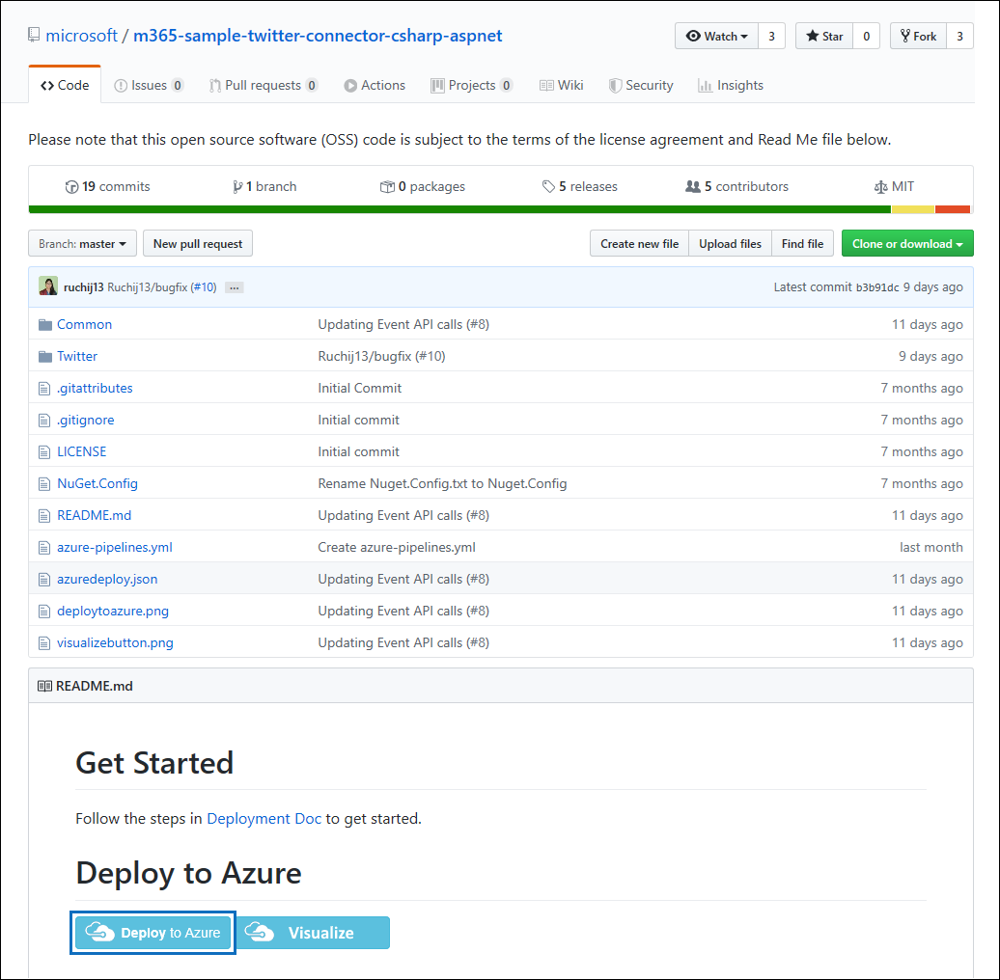
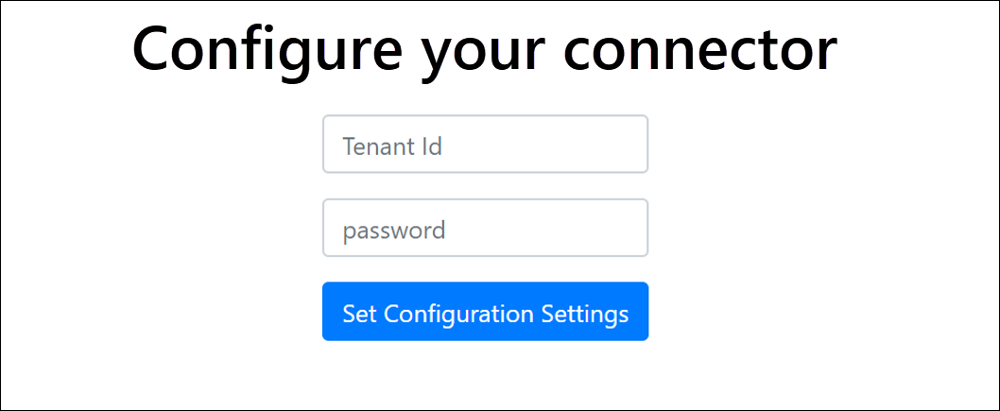

# Implementación de un conector para archivar datos de Twitter

Este artículo contiene el proceso paso a paso para implementar un conector que usa el servicio de importación de Office 365 para importar datos de la cuenta de Twitter de la organización a Microsoft 365. Para obtener información general de alto nivel de este proceso y una lista de los requisitos previos necesarios para implementar un conector de Twitter, consulte [Configuración de un conector para archivar datos de Twitter ](archive-twitter-data-with-sample-connector.md).

## Paso 1: Crear una aplicación en Azure Active Directory

1. Vaya a <https://portal.azure.com> e inicie sesión con las credenciales de una cuenta de administrador global.

   

2. En el panel de navegación izquierdo, haga clic en **Azure Active Directory**

   

3. En el panel de navegación izquierdo, haga clic en **Registros de aplicaciones (versión preliminar)** y, a continuación, haga clic en **Nuevo registro**.

   

4. Registre la aplicación. En **URI de redirección (opcional),** seleccione **Web** en la lista desplegable tipo de aplicación y, a continuación, escriba `https://portal.azure.com` el cuadro para el URI.

   

5. Copie el **identificador de aplicación (cliente)** y el **identificador de directorio (inquilino)** y guárdelos en un archivo de texto u otra ubicación segura. Estos identificadores se usan en pasos posteriores.

    

6. Vaya a **Certificados & secretos para la nueva aplicación** y, en **Secretos de cliente** , haga clic en **Nuevo secreto de cliente**.

   

7. Cree un nuevo secreto. En el cuadro de descripción, escriba el secreto y elija un período de expiración.

   

8. Copie el valor del secreto y guárdelo en un archivo de texto u otra ubicación de almacenamiento. Este es el secreto de aplicación AAD que se usa en pasos posteriores.

   

## Paso 2: Implementación del servicio web del conector desde GitHub en la cuenta de Azure

1. Vaya a [este sitio GitHub](https://github.com/microsoft/m365-sample-twitter-connector-csharp-aspnet) y haga clic en **Implementar en Azure**.

    

2. Después de hacer clic en **Implementar en Azure**, se le redirigirá a una Azure Portal con una página de plantilla personalizada. Rellene los **detalles básicos** y **Configuración** y, a continuación, haga clic en **Comprar**.

   

    - **Suscripción:** Seleccione la suscripción de Azure en la que desea implementar el servicio web del conector de Twitter.

    - **Grupo de recursos:** Elija o cree un nuevo grupo de recursos. Un grupo de recursos es un contenedor que contiene recursos relacionados para una solución de Azure.

    - **Ubicación:** Elija una ubicación.

    - **Nombre de la aplicación web:** Proporcione un nombre único para la aplicación web del conector. El nombre debe tener entre 3 y 18 caracteres. Este nombre se usa para crear la dirección URL de Azure App Service; por ejemplo, si proporciona el nombre de la aplicación web de **twitterconnector** , se **twitterconnector.azurewebsites.net** la dirección URL de Azure App Service.

    - **tenantId:** El identificador de inquilino de la organización de Microsoft 365 que copió después de crear la aplicación del conector de Facebook en Azure Active Directory en el paso 1.

   - **APISecretKey:** Puede escribir cualquier valor como secreto. Esto se usa para acceder a la aplicación web del conector en el paso 5.

3. Una vez que la implementación se realice correctamente, la página tendrá un aspecto similar al de la captura de pantalla siguiente:

    

## Paso 3: Crear la aplicación de Twitter

1. Vaya a https://developer.twitter.com, inicie sesión con las credenciales de la cuenta de desarrollador de su organización y, a continuación, haga clic en **Aplicaciones**.

   
2. Haga clic en **Crear una aplicación**.

   

3. En **Detalles de** la aplicación, agregue información sobre la aplicación.

   

4. En el panel para desarrolladores de Twitter, seleccione la aplicación que acaba de crear y haga clic en **Detalles**.

   

5. En la pestaña **Claves y tokens** , en **Claves de API de consumidor** , copie la clave de API y la clave secreta de API y guárdelas en un archivo de texto u otra ubicación de almacenamiento. A continuación, haga clic en **Crear** para generar un token de acceso y un secreto de token de acceso y cópielos en un archivo de texto u otra ubicación de almacenamiento.

   

   A continuación, haga clic en **Crear** para generar un token de acceso y un secreto de token de acceso y cópielos en un archivo de texto u otra ubicación de almacenamiento.

6. Haga clic en la pestaña **Permisos** y configure los permisos como se muestra en la captura de pantalla siguiente:

   

7. Después de guardar la configuración de permisos, haga clic en la pestaña **Detalles** de la aplicación y, a continuación, haga clic en **Editar > Editar detalles**.

   

8. Realice las siguientes tareas:

   - Active la casilla para permitir que la aplicación del conector inicie sesión en Twitter.

   - Agregue el uri de redireccionamiento de OAuth con el formato siguiente: **\<connectorserviceuri>/Views/TwitterOAuth**, donde el valor de *connectorserviceuri* es la dirección URL de Azure App Service para su organización; por ejemplo, https://twitterconnector.azurewebsites.net/Views/TwitterOAuth.

    

La aplicación para desarrolladores de Twitter ya está lista para usarse.

## Paso 4: Configuración de la aplicación web del conector

1. Vaya a https://\<AzureAppResourceName>.azurewebsites.net (donde **AzureAppResourceName** es el nombre del recurso de aplicación de Azure que anominó en el paso 4). Por ejemplo, si el nombre es **twitterconnector**, vaya a https://twitterconnector.azurewebsites.net. La página principal de la aplicación es similar a la siguiente captura de pantalla:

   

2. Haga clic en **Configurar** para mostrar una página de inicio de sesión.

   

3. En el cuadro Id. de inquilino, escriba o pegue el identificador de inquilino (que obtuvo en el paso 2). En el cuadro contraseña, escriba o pegue apiSecretKey (que obtuvo en el paso 2) y, a continuación, haga clic en **Establecer configuración Configuración** para mostrar la página de detalles de configuración.

   

4. Escriba las siguientes opciones de configuración.

   - **Clave de api de Twitter:** Clave de API para la aplicación de Twitter que creó en el paso 3.

   - **Clave secreta de la API de Twitter:** Clave secreta de API para la aplicación de Twitter que creó en el paso 3.

   - **Token de acceso de Twitter:** Token de acceso que creó en el paso 3.

   - **Secreto de token de acceso de Twitter:** Secreto de token de acceso que creó en el paso 3.

   - **AAD id. de aplicación:** el identificador de aplicación de la aplicación Azure Active Directory que creó en el paso 1

   - **AAD secreto de aplicación:** valor del secreto APISecretKey que creó en el paso 1.

5. Haga clic en **Guardar** para guardar la configuración del conector.

## Paso 5: Configurar un conector de Twitter en el portal de cumplimiento

1. Vaya al portal de cumplimiento de Microsoft Purview y seleccione <a href="https://go.microsoft.com/fwlink/p/?linkid=2173865" target="_blank">**La página Conectores de datos**</a.

2. En la página **Conectores de datos** en **Twitter**, haga clic en **Ver**.

3. En la página **de Twitter** , haga clic en **Agregar conector**.

4. En la página **Términos de servicio** , haga clic en **Aceptar**.

5. En la página **Agregar credenciales para la aplicación del conector** , escriba la siguiente información y, a continuación, haga clic en **Validar conexión**.

   

    - En el cuadro **Nombre** , escriba un nombre para el conector, como el **identificador de ayuda de Twitter**.

    - En el cuadro **Dirección URL del conector** , escriba o pegue la dirección URL de Azure App Service; por ejemplo `https://twitterconnector.azurewebsites.net`, .

    - En el cuadro **Contraseña** , escriba o pegue el valor de APISecretKey que creó en el paso 2.

    - En el cuadro **id. de App de Azure**, escriba o pegue el valor del identificador de aplicación de Aplicación de Azure (también denominado *identificador de cliente*) que obtuvo en el paso 1.

6. Una vez validada correctamente la conexión, haga clic en **Siguiente**.

7. En la página **Authorize Microsoft 365 to import data (Autorizar a Microsoft 365 importar datos**), escriba o pegue apiSecretKey de nuevo y, a continuación, haga clic en **Inicio de sesión de la aplicación web**.

8. Haga clic en **Iniciar sesión con Twitter**.

9. En la página de inicio de sesión de Twitter, inicie sesión con las credenciales de la cuenta de Twitter de su organización.

   

   Después de iniciar sesión, la página de Twitter mostrará el siguiente mensaje, "Trabajo del conector de Twitter Configurado correctamente".

10. Haga clic en **Continuar** para completar la configuración del conector de Twitter.

11. En la página **Establecer filtros** , puede aplicar un filtro para importar inicialmente elementos que tengan una determinada antigüedad. Seleccione una edad y, a continuación, haga clic en **Siguiente**.

12. En la página **Elegir ubicación de almacenamiento**, escriba la dirección de correo electrónico de Microsoft 365 buzón al que se importarán los elementos de Twitter y, a continuación, haga clic en **Siguiente**.

13. Haga clic en **Siguiente** para revisar la configuración del conector y, a continuación, haga clic en **Finalizar** para completar la configuración del conector.

14. En el centro de cumplimiento, vaya a la página **Conectores de datos** y haga clic en la pestaña **Conectores** para ver el progreso del proceso de importación.
