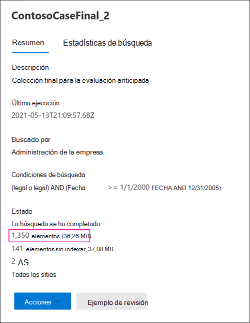

# Diferencias entre los resultados de búsqueda de exhibición de documentos electrónicos estimados y reales

Este tema se aplica a las búsquedas que puede ejecutar con una de las siguientes herramientas Microsoft 365 eDiscovery: 

- Búsqueda de contenido
- Core eDiscovery

Al ejecutar una búsqueda de exhibición de documentos electrónicos, la herramienta que está usando devolverá una estimación del número de elementos (y su tamaño total) que coincidan con los criterios de búsqueda. Por ejemplo, al ejecutar una búsqueda en el centro de cumplimiento de Microsoft 365, los resultados de búsqueda estimados se muestran en la página desplegable de la búsqueda seleccionada.
  

  
Esta es la misma estimación del tamaño total y el número de elementos que se muestran en la herramienta de exportación de exhibición de documentos electrónicos al exportar resultados a un equipo local y en el informe Exportar resumen que se descarga con los resultados de la búsqueda.
  
**Resultados estimados en la herramienta de exportación de exhibición de documentos electrónicos**

  
**Resultados estimados en el informe de resumen de exportación**

  
Sin embargo, como observarás en la captura de pantalla anterior del informe Exportar resumen, el tamaño y el número de resultados de búsqueda reales que se descargan son diferentes del tamaño y el número de resultados de búsqueda estimados.
  

  
Estas son algunas de las razones de estas diferencias:
  
- **La forma en que se calculan los resultados**. Una estimación de los resultados de la búsqueda es solo eso, una estimación (y no un recuento real) de los elementos que cumplen los criterios de consulta de búsqueda. Para compilar la estimación de Exchange elementos, la herramienta de exhibición de documentos electrónicos que está usando solicita una lista de los IDs de mensajes que cumplen los criterios de búsqueda de la base de datos de Exchange. Pero al exportar los resultados de la búsqueda, la búsqueda se vuelve a ejecutar y los mensajes reales se recuperan de la base de datos Exchange búsqueda. Por lo tanto, estas diferencias pueden deber a cómo se determina el número estimado de elementos y el número real de elementos.

- **Cambios que se produce entre el momento en que se estiman y exportan los resultados de búsqueda.** Al exportar los resultados de búsqueda, la búsqueda se reinicia para recopilar los elementos más recientes del índice de búsqueda que cumplen los criterios de búsqueda. Es posible que haya elementos adicionales creados, enviados o recibidos que cumplan los criterios de búsqueda en el tiempo entre el momento en que se recopilaron los resultados de búsqueda estimados y cuando se exportaron los resultados de la búsqueda. También es posible que los elementos que estaban en el índice de búsqueda cuando se calcularon los resultados de la búsqueda ya no estén ahí porque se purgaron de la ubicación de contenido antes de exportar los resultados de la búsqueda. Una forma de mitigar este problema es especificar un intervalo de fechas para una búsqueda de exhibición de documentos electrónicos. Otra forma es colocar una retención en las ubicaciones de contenido para que los elementos se conserven y no se puedan purgar. 

   Aunque es poco frecuente, incluso cuando se aplica una retención, el mantenimiento de elementos de calendario integrados (que no son editables por el usuario, pero se incluyen en muchos resultados de búsqueda) pueden quitarse de vez en cuando. Esta eliminación periódica de elementos de calendario dará como resultado menos elementos que se exportan.

- **Elementos sin indizar**. Los elementos que no están indexados para la búsqueda pueden causar diferencias entre los resultados de búsqueda estimados y reales. Puede incluir elementos sin indizar al exportar los resultados de la búsqueda. Si incluye elementos sin indizar al exportar resultados de búsqueda, es posible que haya más elementos que se exporten. Esto provocará una diferencia entre los resultados de búsqueda estimados y exportados.

    Al usar la herramienta de búsqueda de contenido, tiene la opción de incluir elementos sin indizar al exportar resultados de búsqueda. El número de elementos sin indizar devueltos por la búsqueda se muestra en la página desplegable junto con los otros resultados de búsqueda estimados. Los elementos sin indizar también se incluirían en el tamaño total de los resultados de búsqueda estimados. Al exportar resultados de búsqueda, tiene la opción de incluir o no incluir elementos sin indizar. La forma en que se configuran estas opciones puede provocar diferencias entre los resultados de búsqueda estimados y los reales que se descargan.

- **Exportar los resultados de una búsqueda de contenido que incluye todas las ubicaciones de contenido**. Si la búsqueda de la que exporta los resultados era una búsqueda de todas las ubicaciones de contenido de la organización, solo se exportarán los elementos sin indizar de las ubicaciones de contenido que contienen elementos que coinciden con los criterios de búsqueda. In other words, if no search results are found in a mailbox or site, then any unindexed items in that mailbox or site won't be exported. Sin embargo, los elementos sin indizar de todas las ubicaciones de contenido (incluso aquellos que no contienen elementos que coincidan con la consulta de búsqueda) se incluirán en los resultados de búsqueda estimados.

    Como alternativa, si la búsqueda que exporta los resultados de ubicaciones de contenido específicas incluidas, se exportarán los elementos no indexados (que no están excluidos por los criterios de búsqueda) de todas las ubicaciones de contenido especificadas en la búsqueda. En este caso, el número estimado de elementos no indexados y el número de elementos sin indexar que se exportan deben ser los mismos.

    La razón para no exportar elementos sin indizar desde todas las ubicación de la organización es porque puede aumentar la probabilidad de errores de exportación y aumentar el tiempo necesario para exportar y descargar los resultados de la búsqueda.

- **Los elementos sin indizar de SharePoint y OneDrive no se incluyen en las estimaciones de búsqueda**. Los elementos no indexados de SharePoint sitios y OneDrive para la Empresa cuentas no se incluyen en los resultados de búsqueda estimados. Esto se debe a que SharePoint índice no contiene datos para elementos sin indizar. Solo los elementos sin indizar de los buzones de correo se incluyen en las estimaciones de búsqueda. Sin embargo, si incluye elementos no indexados al exportar resultados de búsqueda, se incluyen elementos sin indizar en SharePoint y OneDrive, lo que aumentará el número de elementos que se exportan realmente. Esto dará como resultado diferencias entre los resultados estimados (que no incluyen elementos sin indizar en SharePoint y OneDrive sitios) y los elementos reales que se descargan. La regla sobre la exportación de elementos no indexados solo desde ubicaciones de contenido que contienen elementos que coinciden con los criterios de búsqueda aún se aplica en esta situación.

- **Versiones de documento en SharePoint y OneDrive**. Al buscar SharePoint sitios y OneDrive cuentas, varias versiones de un documento no se incluyen en el recuento de resultados de búsqueda estimados. Pero tiene la opción de incluir todas las versiones de documento al exportar los resultados de la búsqueda. Si incluye versiones de documento al exportar resultados de búsqueda, se incrementará el número real (y el tamaño total) de los elementos exportados.

- **SharePoint carpetas**. Si el nombre de las carpetas de SharePoint coincide con una consulta de búsqueda, la estimación de búsqueda incluirá un recuento de esas carpetas (pero no los elementos de esas carpetas). Al exportar los resultados de búsqueda, los elementos de la carpeta se exportan pero la carpeta real no se exporta. El resultado es que el número de elementos exportados exportará más que el número de resultados de búsqueda estimados. Si una carpeta está vacía, el número de resultados de búsqueda reales exportados se reducirá en un elemento, ya que la carpeta real no se exporta.

- **SharePoint listas**. Si el nombre de una lista SharePoint coincide con una consulta de búsqueda, la estimación de búsqueda incluirá un recuento de todos los elementos de la lista. Al exportar los resultados de la búsqueda, la lista (y los elementos de lista) se exporta como un único archivo CSV. Esto reducirá el número real de elementos exportados realmente. Si la lista contiene datos adjuntos, los datos adjuntos se exportarán como documentos independientes, lo que también aumentará el número de elementos exportados.

- **Formatos de archivo sin formato frente a formatos de archivo exportados.** Para Exchange elementos, el tamaño estimado de los resultados de la búsqueda se calcula mediante el uso de los tamaños Exchange mensaje. Sin embargo, los mensajes de correo electrónico se exportan en un archivo PST o como mensajes individuales (que tienen formato de archivos EML). Ambas opciones de exportación usan un formato de archivo diferente al de los mensajes Exchange sin formato, lo que da como resultado que el tamaño total del archivo exportado sea diferente del tamaño estimado del archivo.

- **Desduplicación de Exchange durante la exportación**. Para Exchange, la desduplicación reduce el número de elementos que se exportan. Tiene la opción de desduplicar los resultados de búsqueda al exportarlos. Para Exchange, esto significa que solo se exporta una única instancia de un mensaje, aunque ese mensaje se pueda encontrar en varios buzones. Los resultados de búsqueda estimados incluyen todas las instancias de un mensaje. Por lo tanto, si elige la opción de desduplicación al exportar resultados de búsqueda, el número real de elementos que se exportan puede ser considerablemente menor que el número estimado de elementos.

    Otra cosa que debe tener en cuenta si elige la opción de desduplicación es que todos los elementos de Exchange se exportan en un único archivo PST y la estructura de carpetas de los buzones de origen no se conserva. El archivo PST exportado solo contiene los elementos de correo electrónico. Sin embargo, un informe de resultados de búsqueda contiene una entrada para cada mensaje exportado que identifica el buzón de origen donde se encuentra el mensaje. Esto le ayuda a identificar todos los buzones que contienen un mensaje duplicado. Si no habilita la desduplicación, se exportará un archivo PST independiente por cada buzón incluido en la búsqueda.

> [!NOTE]
> Si no selecciona la  opción Incluir elementos cifrados o con un formato no reconocido al exportar resultados de búsqueda o simplemente descargar los informes, se descargan los informes de error de índice, pero no tienen ninguna entrada. Esto no significa que no haya errores de indización. Solo significa que los elementos no indexados no se incluyeron en la exportación.
