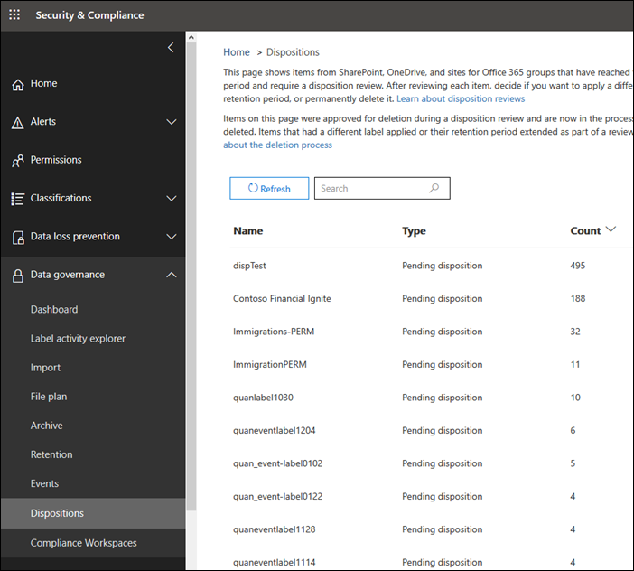

# Información general sobre las revisiones de disposición

Cuando el contenido alcanza el final de su período de retención, existen varios motivos por los que puede que desee revisar el contenido para decidir si se puede eliminar de forma segura ("eliminado"). Por ejemplo, es posible que deba:
  
- Suspender la eliminación ("disposición") del contenido relevante en caso de litigio o una auditoría.
    
- Quitar contenido de la lista de disposición para almacenarla en un archivo, si el contenido tiene un valor histórico o de investigación.
    
- Asigne un período de retención diferente al contenido, si la directiva original era una solución temporal o provisional.
    
- Devolver el contenido a los clientes o transferirlo a otra organización.
    
Cuando se crea una etiqueta de retención en el centro de cumplimiento de Microsoft 365, el centro de seguridad de Microsoft 365 o el centro de cumplimiento de & de seguridad de Office 365, puede optar por desencadenar una revisión de disposición al finalizar el período de retención. En una revisión de disposición:
  
- Las personas que elija reciben una notificación por correo electrónico de que tienen contenido que revisar. Tenga en cuenta que las notificaciones se envían cada semana.
    
- Los revisores van a la página de **disposición** en el &amp; centro de seguridad y cumplimiento para revisar el contenido. Los revisores pueden ver cuántos elementos tiene la etiqueta de retención en espera de disposición y, a continuación, seleccionar una etiqueta de retención para ver todo el contenido con esa etiqueta.
    
- Para cada documento o correo electrónico, el revisor puede:
    
  - Aplique una etiqueta de retención diferente.
    
  - Ampliar su período de retención.
    
  - Eliminarlo de forma permanente.
    
- Los revisores pueden ver las disposiciones pendientes o completadas, y exportar dicha lista como un archivo. csv.

> [!NOTE]
> Las revisiones de disposición requieren una suscripción a Office 365 Enterprise E5.
  
Una revisión de disposición puede incluir contenido en buzones de Exchange, sitios de SharePoint, cuentas de OneDrive y grupos de Office 365. El contenido que espera una revisión de disposición en esas ubicaciones se elimina solo después de que un revisor elige eliminar el contenido de forma permanente.
  

## Configuración de la revisión de disposición mediante la creación de una etiqueta de retención

Este es el flujo de trabajo básico para configurar una revisión de disposición. Tenga en cuenta que este flujo muestra una etiqueta de retención que se publica y que un usuario aplica manualmente; como alternativa, una etiqueta de retención que activa una revisión de disposición se puede aplicar automáticamente al contenido.
  

  
Una revisión de disposición es una opción cuando se crea una etiqueta de retención en Office 365. Esta opción no está disponible en una directiva de retención, sino solo en una etiqueta de retención configurada para conservar el contenido.
  
Para obtener más información acerca de las etiquetas de retención, consulte [Overview of Retention Labels](labels.md).
  

 
> [!NOTE]
> Cuando especifique la opción **notificar a estas personas cuando hay elementos listos para revisar**, especifique un usuario. Los grupos de Office 365 no son compatibles con esta opción.

## Eliminación de contenido

Cuando se notifica a un revisor por correo electrónico que el contenido está listo para su revisión, puede ir a la página de **disposición** en &amp; el centro de seguridad y cumplimiento. Los revisores pueden ver cuántos elementos tiene la etiqueta de retención en espera de disposición y, a continuación, seleccionar una etiqueta de retención para ver todo el contenido con esa etiqueta.

Después de seleccionar una etiqueta de retención, la siguiente página muestra todas las disposiciones pendientes para esa etiqueta.

A continuación, el revisor puede: 
  
- Aplique una etiqueta de retención diferente.
    
- Ampliar el período de retención.
    
- Eliminar permanentemente el elemento.

Tenga en cuenta que un revisor puede seleccionar varios elementos y eliminarlos al mismo tiempo.
    
Un revisor también puede usar el vínculo para ver el documento en su ubicación original, si el revisor tiene permisos para dicha ubicación. Durante una revisión de disposición, el contenido nunca se mueve desde su ubicación original, y nunca se elimina hasta que el revisor elige hacerlo.
  
Tenga en cuenta que las notificaciones por correo electrónico se envían de forma automática a los revisores cada semana. Por lo tanto, cuando el contenido alcanza el final de su período de retención, los revisores pueden tardar hasta siete días en recibir la notificación por correo electrónico de que el contenido espera la disposición.
  
Además, tenga en cuenta que se auditan todas las acciones de disposición. Para garantizar esto, debe activar la auditoría al menos un día antes de la primera acción de disposición (para obtener más información, vea [Buscar en el registro de auditoría del centro de &amp; seguridad y cumplimiento de Office 365](search-the-audit-log-in-security-and-compliance.md)). 
  
## Permisos para disposición

Para acceder a la página de **disposición** , los revisores deben tener asignado el rol de **Administración de disposición** y el rol **registros de auditoría con permiso de vista** . [Vea las instrucciones](../security/office-365-security/grant-access-to-the-security-and-compliance-center.md) para asignar roles.

Específica del rol **registros de auditoría con permiso de vista** :

- Dado que el cmdlet subyacente que se usa para buscar en el registro de auditoría es un cmdlet de Exchange Online, debe asignar a los usuarios este rol mediante el [centro de administración de Exchange en Exchange Online](https://docs.microsoft.com/Exchange/exchange-admin-center), en lugar de usar la página **permisos** del centro de seguridad & cumplimiento. Para obtener instrucciones, vea [administrar grupos de roles en Exchange Online](https://docs.microsoft.com/Exchange/permissions-exo/role-groups).

- Los grupos de Office 365 no son compatibles con este rol. En su lugar, asigne buzones de usuario o usuarios de correo.
  
## Cuánto tiempo se eliminará permanentemente el contenido desechado

El contenido que espera una revisión de disposición se elimina solo después de que un revisor elige eliminar el contenido de forma permanente. Cuando el revisor elige esta opción, el contenido en el sitio de SharePoint o la cuenta de OneDrive pasa a ser elegible para el proceso de limpieza estándar descrito en esta sección: [Cómo funciona una directiva de retención con el contenido en su lugar](retention-policies.md#how-a-retention-policy-works-with-content-in-place).
  
Esto significa que:
  
- El contenido de una biblioteca de documentos se mueve a la papelera de reciclaje de primera etapa **en un plazo de 7 días** después de la disposición y, a continuación, se elimina de forma permanente **93 días** después de eso. La papelera de reciclaje no está indizada por búsqueda y, por lo tanto, su contenido no está disponible para la conservación de la exhibición de documentos electrónicos.

- El contenido de la biblioteca de conservación de contenido se eliminará permanentemente **en 7 días después** de la disposición.

- Los elementos de un buzón de Exchange se eliminarán permanentemente **en un plazo de 14 días** a partir de su disposición. (Tenga en cuenta que 14 días es la configuración predeterminada, pero puede configurarse hasta 30 días).
    
## Ver las desposiciones pendientes y los elementos eliminados

En la página de **disposición pendiente** , puede ver las disposiciones pendientes y finalizadas para una etiqueta de retención específica: 
  
- La **disposición pendiente** muestra los elementos que han alcanzado el final del período de retención y requieren una revisión de disposición. Después de revisar cada elemento, decida si desea aplicar una etiqueta de retención distinta, ampliar su período de retención o eliminarlo de forma permanente. Puede seleccionar varios elementos.
    
- La pestaña **elementos desechados** muestra los elementos eliminados de forma permanente que ya han sido a través de una revisión de disposición. Se muestran aquí porque el proceso de eliminación permanente puede durar varios días, como se indica en la sección anterior. No aparecerán aquí los elementos a los que se aplicó una etiqueta de retención distinta o que tenían su período de retención ampliado como parte de una revisión.

    
### Filtrar las vistas de disposición

Puede filtrar estas vistas por etiqueta de retención o intervalo de tiempo. Para las disposiciones pendientes, el intervalo de tiempo se basa en la fecha de expiración. Para los elementos eliminados, el intervalo de tiempo se basa en la fecha de eliminación.
  

### Exportar los elementos de disposición

Además, puede exportar los elementos en cualquiera de las vistas como un archivo. csv que se puede abrir en Excel.
  

  

