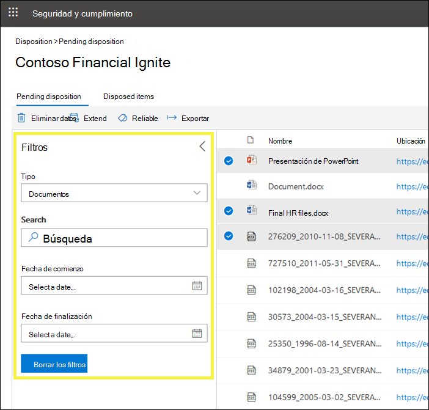

# Información general sobre las revisiones de disposiciónOverview of disposition reviews

>*[Instrucciones de licencias de Microsoft 365 para la seguridad y el cumplimiento](https://aka.ms/ComplianceSD).**[Microsoft 365 licensing guidance for security & compliance](https://aka.ms/ComplianceSD).*

Cuando el contenido alcanza el final de su período de retención, existen varios motivos por los que puede que desee revisar el contenido para decidir si se puede eliminar de forma segura ("eliminado").When content reaches the end of its retention period, there are several reasons why you might want to review that content to decide whether it can be safely deleted ("disposed"). Por ejemplo, es posible que deba:For example, you might need to:
  
- Suspender la eliminación ("disposición") del contenido relevante en caso de litigio o una auditoría.Suspend the deletion ("disposition") of relevant content in the event of litigation or an audit.
    
- Quitar contenido de la lista de disposición para almacenarla en un archivo, si el contenido tiene un valor histórico o de investigación.Remove content from the disposition list to store in an archive, if that content has research or historical value.
    
- Asigne un período de retención diferente al contenido, si la directiva original era una solución temporal o provisional.Assign a different retention period to the content, if the original policy was a temporary or provisional solution.
    
- Devolver el contenido a los clientes o transferirlo a otra organización.Return the content to clients or transfer it to another organization.
    
Al crear una etiqueta de retención en el centro de cumplimiento de Microsoft 365, en el centro de seguridad de Microsoft 365 o en el centro de seguridad & cumplimiento, puede desencadenar una revisión de disposición al final del período de retención.When you create a retention label in the Microsoft 365 compliance center, Microsoft 365 security center, or the Security & Compliance Center, you can choose to trigger a disposition review at the end of the retention period. En una revisión de disposición:In a disposition review:
  
- Las personas que elija reciben una notificación por correo electrónico de que tienen contenido que revisar.The people you choose receive an email notification that they have content to review. Tenga en cuenta que las notificaciones se envían cada semana.Note that notifications are sent on a weekly basis.
    
- Los revisores van a la página de **disposición** en el &amp; centro de seguridad y cumplimiento para revisar el contenido.The reviewers go to the **Disposition** page in the Security &amp; Compliance Center to review the content. Los revisores pueden ver cuántos elementos tiene la etiqueta de retención en espera de disposición y, a continuación, seleccionar una etiqueta de retención para ver todo el contenido con esa etiqueta.The reviewers can see how many items for each retention label are awaiting disposition, and then select a retention label to see all content with that label.
    
- Para cada documento o correo electrónico, el revisor puede:For each document or email, the reviewer can:
    
  - Aplique una etiqueta de retención diferente.Apply a different retention label.
    
  - Ampliar su período de retención.Extend its retention period.
    
  - Eliminarlo de forma permanente.Permanently delete it.
    
- Los revisores pueden ver las disposiciones pendientes o completadas, y exportar dicha lista como un archivo. csv.Reviewers can view either pending or completed dispositions, and export that list as a .csv file.

Una revisión de disposición puede incluir contenido en buzones de Exchange, sitios de SharePoint, cuentas de OneDrive y grupos de Microsoft 365.A disposition review can include content in Exchange mailboxes, SharePoint sites, OneDrive accounts, and Microsoft 365 groups. El contenido que espera una revisión de disposición en esas ubicaciones se elimina solo después de que un revisor elige eliminar el contenido de forma permanente.Content awaiting a disposition review in those locations is deleted only after a reviewer chooses to permanently delete the content.
  

## Configuración de la revisión de disposición mediante la creación de una etiqueta de retenciónSetting up the disposition review by creating a retention label

Este es el flujo de trabajo básico para configurar una revisión de disposición.This is the basic workflow for setting up a disposition review. Tenga en cuenta que este flujo muestra una etiqueta de retención que se publica y que un usuario aplica manualmente; como alternativa, una etiqueta de retención que activa una revisión de disposición se puede aplicar automáticamente al contenido.Note that this flow shows a retention label being published and then manually applied by a user; alternatively, a retention label that triggers a disposition review can be auto-applied to content.
  

  
Una revisión de disposición es una opción cuando se crea una etiqueta de retención en Office 365.A disposition review is an option when you create a retention label in Office 365. Esta opción no está disponible en una directiva de retención, sino solo en una etiqueta de retención configurada para conservar el contenido.This option is not available in a retention policy but only in a retention label that's configured to retain content.
  
Para obtener más información acerca de las etiquetas de retención, consulte [Overview of Retention Labels](labels.md).For more information about retention labels, see [Overview of retention labels](labels.md).
  

 
> [!NOTE]
> Cuando especifique la opción **notificar a estas personas cuando hay elementos listos para revisar**, especifique un usuario.When you specify the option **Notify these people when there are items ready to review**, specify a user. Los grupos de Microsoft 365 no son compatibles con esta opción.Microsoft 365 groups are not supported for this option.

## Eliminación de contenidoDisposing content

Cuando se notifica a un revisor por correo electrónico que el contenido está listo para su revisión, puede ir a la página de **disposición** en &amp; el centro de seguridad y cumplimiento.When a reviewer is notified by email that content is ready to review, they can go to the **Disposition** page in the Security &amp; Compliance Center. Los revisores pueden ver cuántos elementos tiene la etiqueta de retención en espera de disposición y, a continuación, seleccionar una etiqueta de retención para ver todo el contenido con esa etiqueta.The reviewers can see how many items for each retention label are awaiting disposition, and then select a retention label to see all content with that label.

Después de seleccionar una etiqueta de retención, la siguiente página muestra todas las disposiciones pendientes para esa etiqueta.After you select a retention label, the next page shows all pending dispositions for that label.

A continuación, el revisor puede:The reviewer can then: 
  
- Aplique una etiqueta de retención diferente.Apply a different retention label.
    
- Ampliar el período de retención.Extend the retention period.
    
- Eliminar permanentemente el elemento.Permanently delete the item.

Tenga en cuenta que un revisor puede seleccionar varios elementos y eliminarlos al mismo tiempo.Note that a reviewer can select multiple items and dispose them at the same time.
    
Un revisor también puede usar el vínculo para ver el documento en su ubicación original, si el revisor tiene permisos para dicha ubicación.A reviewer can also use the link to view the document in its original location, if the reviewer has permissions for that location. Durante una revisión de disposición, el contenido nunca se mueve desde su ubicación original, y nunca se elimina hasta que el revisor elige hacerlo.During a disposition review, the content never moves from its original location, and it's never deleted until the reviewer chooses to do so.
  
Tenga en cuenta que las notificaciones por correo electrónico se envían de forma automática a los revisores cada semana.Note that the email notifications are sent automatically to reviewers on a weekly basis. Por lo tanto, cuando el contenido alcanza el final de su período de retención, los revisores pueden tardar hasta siete días en recibir la notificación por correo electrónico de que el contenido espera la disposición.Therefore, when content reaches the end of its retention period, it may take up to seven days for reviewers to receive the email notification that content is awaiting disposition.
  
Además, tenga en cuenta que se auditan todas las acciones de disposición.Also note that all disposition actions are audited. Para asegurarse de esto, debe activar la auditoría al menos un día antes de la primera acción de disposición (para obtener más información, vea [Buscar en el registro de auditoría &amp; del centro de seguridad y cumplimiento](search-the-audit-log-in-security-and-compliance.md)).To ensure this, you must turn on auditing at least one day prior to the first disposition action - for more information, see [Search the audit log in the Security &amp; Compliance Center](search-the-audit-log-in-security-and-compliance.md). 
  
## Permisos para disposiciónPermissions for disposition

Para acceder a la página de **disposición** , los revisores deben tener asignado el rol de **Administración de disposición** y el rol **registros de auditoría con permiso de vista** .To access the **Disposition** page, reviewers must be assigned the **Disposition Management** role and the **View-Only Audit Logs** role. [Vea las instrucciones](../security/office-365-security/grant-access-to-the-security-and-compliance-center.md) para asignar roles.[View instructions](../security/office-365-security/grant-access-to-the-security-and-compliance-center.md) for assigning roles.

Específica del rol **registros de auditoría con permiso de vista** :Specific to the **View-Only Audit Logs** role:

- Dado que el cmdlet subyacente que se usa para buscar en el registro de auditoría es un cmdlet de Exchange Online, debe asignar a los usuarios este rol mediante el [centro de administración de Exchange en Exchange Online](https://docs.microsoft.com/Exchange/exchange-admin-center), en lugar de usar la página **permisos** del centro de seguridad & cumplimiento.Because the underlying cmdlet used to search the audit log is an Exchange Online cmdlet, you must assign users this role by using the [Exchange admin center in Exchange Online](https://docs.microsoft.com/Exchange/exchange-admin-center), rather than by using the **Permissions** page in the Security & Compliance Center. Para obtener instrucciones, vea [administrar grupos de roles en Exchange Online](https://docs.microsoft.com/Exchange/permissions-exo/role-groups).For instructions, see [Manage role groups in Exchange Online](https://docs.microsoft.com/Exchange/permissions-exo/role-groups).

- Los grupos de Microsoft 365 no son compatibles con este rol.Microsoft 365 groups aren't supported for this role. En su lugar, asigne buzones de usuario o usuarios de correo.Instead, assign user mailboxes or mail users.
  
## Cuánto tiempo se eliminará permanentemente el contenido desechadoHow long until disposed content is permanently deleted

El contenido que espera una revisión de disposición se elimina solo después de que un revisor elige eliminar el contenido de forma permanente.Content awaiting a disposition review is deleted only after a reviewer chooses to permanently delete the content. Cuando el revisor elige esta opción, el contenido en el sitio de SharePoint o la cuenta de OneDrive pasa a ser elegible para el proceso de limpieza estándar descrito en esta sección: [Cómo funciona una directiva de retención con el contenido en su lugar](retention-policies.md#how-a-retention-policy-works-with-content-in-place).When the reviewer chooses this option, the content in the SharePoint site or OneDrive account becomes eligible for the standard cleanup process described in this section: [How a retention policy works with content in place](retention-policies.md#how-a-retention-policy-works-with-content-in-place).
  
Esto significa que:This means that:
  
- El contenido de una biblioteca de documentos se mueve a la papelera de reciclaje de primera etapa **en un plazo de 7 días** después de la disposición y, a continuación, se elimina de forma permanente **93 días** después de eso.Content in a document library will be moved to the first-stage Recycle Bin **within 7 days** of disposition, and then permanently deleted **93 days** after that. La papelera de reciclaje no está indizada por búsqueda y, por lo tanto, su contenido no está disponible para la conservación de la exhibición de documentos electrónicos.The Recycle Bin is not indexed by search and therefore its contents are not available to an eDiscovery hold.

- El contenido de la biblioteca de conservación de contenido se eliminará permanentemente **en 7 días después** de la disposición.Content in the Preservation Hold library will be permanently deleted **within 7 days** of disposition.

- Los elementos de un buzón de Exchange se eliminarán permanentemente **en un plazo de 14 días** a partir de su disposición.Items in an Exchange mailbox will be permanently deleted **within 14 days** of disposition. (Tenga en cuenta que 14 días es la configuración predeterminada, pero puede configurarse hasta 30 días).(Note that 14 days is the default setting but it can be configured up to 30 days.)
    
## Ver las desposiciones pendientes y los elementos eliminadosView pending dispositions and disposed items

En la página de **disposición pendiente** , puede ver las disposiciones pendientes y finalizadas para una etiqueta de retención específica:On the **Pending disposition** page, you can view both pending and completed dispositions for a specific retention label: 
  
- La **disposición pendiente** muestra los elementos que han alcanzado el final del período de retención y requieren una revisión de disposición.The **Pending disposition** shows items that have reached the end of their retention period and require a disposition review. Después de revisar cada elemento, decida si desea aplicar una etiqueta de retención distinta, ampliar su período de retención o eliminarlo de forma permanente.After reviewing each item, decide if you want to apply a different retention label to it, extend its retention period, or permanently delete it. Puede seleccionar varios elementos.You can select multiple items.
    
- La pestaña **elementos desechados** muestra los elementos eliminados de forma permanente que ya han sido a través de una revisión de disposición.The **Disposed items** tab shows permanently-deleted items that have already been through a disposition review. Se muestran aquí porque el proceso de eliminación permanente puede durar varios días, como se indica en la sección anterior.They show here because the permanent deletion process can take several days, as noted in the section above. No aparecerán aquí los elementos a los que se aplicó una etiqueta de retención distinta o que tenían su período de retención ampliado como parte de una revisión.Items that had a different retention label applied, or had their retention period extended as part of a review, won't appear here.

    
### Filtrar las vistas de disposiciónFilter the disposition views

Puede filtrar estas vistas por etiqueta de retención o intervalo de tiempo.You can filter these views by retention label or time range. Para las disposiciones pendientes, el intervalo de tiempo se basa en la fecha de expiración.For pending dispositions, the time range is based on the expiration date. Para los elementos eliminados, el intervalo de tiempo se basa en la fecha de eliminación.For disposed items, the time range is based on the deletion date.
  

### Exportar los elementos de disposiciónExport the disposition items

Además, puede exportar los elementos en cualquiera de las vistas como un archivo. csv que se puede abrir en Excel.In addition, you can export the items in either view as a .csv file that you can open in Excel.
  

  

