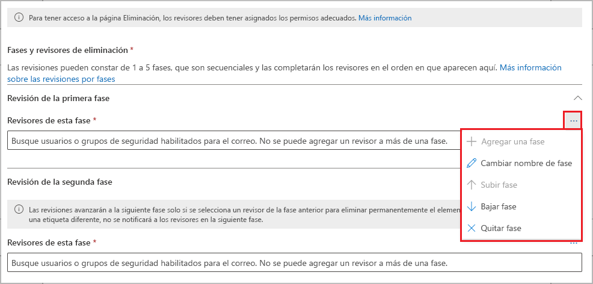
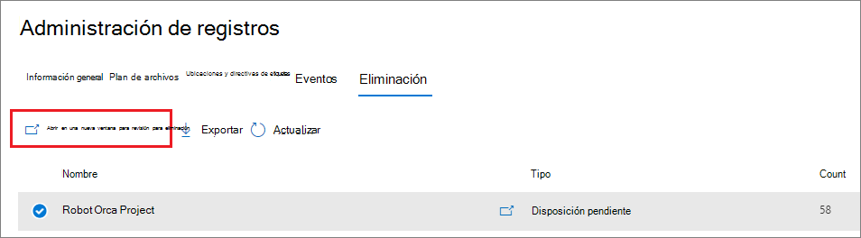

# <a name="disposition-of-content"></a><span data-ttu-id="a0c34-103">Eliminación de contenido</span><span class="sxs-lookup"><span data-stu-id="a0c34-103">Disposition of content</span></span>

><span data-ttu-id="a0c34-104">*[Instrucciones de licencias de Microsoft 365 para la seguridad y el cumplimiento](/office365/servicedescriptions/microsoft-365-service-descriptions/microsoft-365-tenantlevel-services-licensing-guidance/microsoft-365-security-compliance-licensing-guidance).*</span><span class="sxs-lookup"><span data-stu-id="a0c34-104">*[Microsoft 365 licensing guidance for security & compliance](/office365/servicedescriptions/microsoft-365-service-descriptions/microsoft-365-tenantlevel-services-licensing-guidance/microsoft-365-security-compliance-licensing-guidance).*</span></span>

<span data-ttu-id="a0c34-105">Use la página **Eliminación** de **Administración de registros** en el Centro de cumplimiento de Microsoft 365 para administrar las revisiones de eliminación y ver los metadatos de los [registros](records-management.md#records) que se hayan eliminado automáticamente al final de su período de retención.</span><span class="sxs-lookup"><span data-stu-id="a0c34-105">Use the **Disposition** page from **Records Management** in the Microsoft 365 compliance center to manage disposition reviews and view the metadata of [records](records-management.md#records) that have been automatically deleted at the end of their retention period.</span></span>

> [!NOTE]
> <span data-ttu-id="a0c34-106">Implementando en versión preliminar: **revisión para eliminación de varias etapas**</span><span class="sxs-lookup"><span data-stu-id="a0c34-106">Rolling out in preview: **multi-stage disposition review**</span></span>
> 
> <span data-ttu-id="a0c34-107">Ahora un administrador puede agregar hasta cinco fases consecutivas de revisión para eliminación en una etiqueta de retención y los revisores pueden agregar a otros usuarios a su fase de revisión para eliminación.</span><span class="sxs-lookup"><span data-stu-id="a0c34-107">An administrator can now add up to five consecutive stages of disposition review in a retention label, and reviewers can add others users to their disposition review stage.</span></span> <span data-ttu-id="a0c34-108">También puede personalizar las notificaciones por correo electrónico y los avisos.</span><span class="sxs-lookup"><span data-stu-id="a0c34-108">You can also customize the email notifications and reminders.</span></span> <span data-ttu-id="a0c34-109">En las siguientes secciones se ofrece más información sobre los cambios en esta versión preliminar.</span><span class="sxs-lookup"><span data-stu-id="a0c34-109">The following sections have more information about the changes in this preview.</span></span>

## <a name="prerequisites-for-viewing-content-dispositions"></a><span data-ttu-id="a0c34-110">Requisitos previos para ver las eliminaciones de contenido</span><span class="sxs-lookup"><span data-stu-id="a0c34-110">Prerequisites for viewing content dispositions</span></span>

<span data-ttu-id="a0c34-111">Para administrar las revisiones de eliminación y confirmar que los registros se han eliminado, debe tener los permisos necesarios y la auditoría debe estar habilitada.</span><span class="sxs-lookup"><span data-stu-id="a0c34-111">To manage disposition reviews and confirm that records have been deleted, you must have sufficient permissions and auditing must be enabled.</span></span>

### <a name="permissions-for-disposition"></a><span data-ttu-id="a0c34-112">Permisos para la eliminación</span><span class="sxs-lookup"><span data-stu-id="a0c34-112">Permissions for disposition</span></span>

<span data-ttu-id="a0c34-113">Para acceder correctamente a la pestaña **Eliminación** en el Centro de cumplimiento de Microsoft 365, los usuarios deben tener el rol de **Administración de eliminación**.</span><span class="sxs-lookup"><span data-stu-id="a0c34-113">To successfully access the **Disposition** tab in the Microsoft 365 compliance center, users must have the **Disposition Management** role.</span></span> <span data-ttu-id="a0c34-114">Desde diciembre de 2020, este rol está ahora incluido en el grupo de roles predeterminado **Administración de registros**.</span><span class="sxs-lookup"><span data-stu-id="a0c34-114">From December 2020, this role is now included in the **Records Management** default role group.</span></span>

> [!NOTE]
> <span data-ttu-id="a0c34-115">De manera predeterminada, un administrador global no tiene concedido el rol de **Administración de eliminación**.</span><span class="sxs-lookup"><span data-stu-id="a0c34-115">By default, a global admin isn't granted the **Disposition Management** role.</span></span> 

<span data-ttu-id="a0c34-116">Para conceder a los usuarios solo los permisos que necesitan para las revisiones de disposición sin concederles permisos para ver y configurar otras características para la retención y la gestión de registros, cree un grupo de funciones personalizado (por ejemplo, denominado "Revisores de disposición") y conceda a este grupo la función de **Administración de eliminación**.</span><span class="sxs-lookup"><span data-stu-id="a0c34-116">To grant users just the permissions they need for disposition reviews without granting them permissions to view and configure other features for retention and records management, create a custom role group (for example, named "Disposition Reviewers") and grant this group the **Disposition Management** role.</span></span>

<span data-ttu-id="a0c34-117">Para obtener instrucciones sobre la configuración de estos permisos, consulte [Proporcionar a los usuarios acceso al Centro de seguridad y cumplimiento de Office 365](../security/office-365-security/grant-access-to-the-security-and-compliance-center.md).</span><span class="sxs-lookup"><span data-stu-id="a0c34-117">For instructions to configure these permissions, see [Give users access to the Office 365 Security & Compliance Center](../security/office-365-security/grant-access-to-the-security-and-compliance-center.md).</span></span>

<span data-ttu-id="a0c34-118">Además:</span><span class="sxs-lookup"><span data-stu-id="a0c34-118">Additionally:</span></span>

- <span data-ttu-id="a0c34-119">Para ver el contenido de los elementos durante el proceso de eliminación, agregue usuarios al grupo de roles **Visor de contenido del Explorador de contenido**.</span><span class="sxs-lookup"><span data-stu-id="a0c34-119">To view the contents of items during the disposition process, add users to the **Content Explorer Content Viewer** role group.</span></span> <span data-ttu-id="a0c34-120">Si los usuarios no tienen los permisos de este grupo de roles, aún pueden seleccionar una acción de revisión para eliminación para completar la revisión para eliminación, pero deben hacerlo sin poder ver el contenido del elemento desde el panel de vista previa en miniatura del centro de cumplimiento.</span><span class="sxs-lookup"><span data-stu-id="a0c34-120">If users don't have the permissions from this role group, they can still select a disposition review action to complete the disposition review, but must do so without being able to view the item's contents from the mini-preview pane in the compliance center.</span></span>

- <span data-ttu-id="a0c34-121">En la versión preliminar: de forma predeterminada, cada persona que accede a la página **Eliminación** solo ve los elementos que tienen asignados para revisar.</span><span class="sxs-lookup"><span data-stu-id="a0c34-121">In preview: By default, each person that accesses the **Disposition** page sees only items that they are assigned to review.</span></span> <span data-ttu-id="a0c34-122">Para que un administrador de administración de registros vea todos los elementos asignados a todos los usuarios y todas las etiquetas de retención que están configuradas para la revisión para eliminación: vaya a **Configuración de administración de registros** > **General** > **Grupo de seguridad Administrador de registros** para seleccionar y habilitar un grupo de seguridad habilitado para correo que contiene las cuentas de administrador.</span><span class="sxs-lookup"><span data-stu-id="a0c34-122">For a records management administrator to see all items assigned to all users, and all retention labels that are configured for disposition review: Navigate to **Records management settings** > **General** > **Record Manager Security Group** to select and then enable a mail-enabled security group that contains the administrator accounts.</span></span>
    
    <span data-ttu-id="a0c34-123">Los grupos de Microsoft 365 y los grupos de seguridad que no están habilitados para correo no admiten esta característica y no se mostrarán en la lista para seleccionar.</span><span class="sxs-lookup"><span data-stu-id="a0c34-123">Microsoft 365 groups and security groups that aren't mail-enabled doesn't support this feature and wouldn't be displayed in the list to select.</span></span> <span data-ttu-id="a0c34-124">Si necesita crear un grupo de seguridad habilitado para correo, use el vínculo al Centro de administración de Microsoft 365 para crear el nuevo grupo.</span><span class="sxs-lookup"><span data-stu-id="a0c34-124">If you need to create a new mail-enabled security group, use the link to the Microsoft 365 admin center to create the new group.</span></span> 
    
    > [!IMPORTANT]
    > <span data-ttu-id="a0c34-125">No puede deshabilitar este permiso ni reemplazar el grupo que ha habilitado desde el Centro de cumplimiento.</span><span class="sxs-lookup"><span data-stu-id="a0c34-125">You can't disable this permission or replace the group that you enabled from the compliance center.</span></span> <span data-ttu-id="a0c34-126">Sin embargo, puede habilitar otro grupo de seguridad habilitado para correo si usa el cmdlet [Enable-ComplianceTagStorage](/powershell/module/exchange/enable-compliancetagstorage).</span><span class="sxs-lookup"><span data-stu-id="a0c34-126">However, you can enable another mail-enabled security group by using the [Enable-ComplianceTagStorage](/powershell/module/exchange/enable-compliancetagstorage) cmdlet.</span></span>
    > 
    > <span data-ttu-id="a0c34-127">Por ejemplo: `Enable-ComplianceTagStorage -RecordsManagementSecurityGroupEmail dispositionreviewers@contosoi.com`</span><span class="sxs-lookup"><span data-stu-id="a0c34-127">For example: `Enable-ComplianceTagStorage -RecordsManagementSecurityGroupEmail dispositionreviewers@contosoi.com`</span></span>

- <span data-ttu-id="a0c34-128">En la versión preliminar: la opción **Configuración de administración de registros** solo está visible para los administradores de administración de registros.</span><span class="sxs-lookup"><span data-stu-id="a0c34-128">In preview: The **Records management settings** option is visible only to record management administrators.</span></span> 

### <a name="enable-auditing"></a><span data-ttu-id="a0c34-129">Habilitar auditoría</span><span class="sxs-lookup"><span data-stu-id="a0c34-129">Enable auditing</span></span>

<span data-ttu-id="a0c34-130">Asegúrese de que la auditoría está activada al menos un día antes de la primera acción de eliminación.</span><span class="sxs-lookup"><span data-stu-id="a0c34-130">Make sure that auditing is enabled at least one day before the first disposition action.</span></span> <span data-ttu-id="a0c34-131">Para más información, vea [Buscar en el registro de auditoría del Centro de seguridad &amp; cumplimiento de Office 365](search-the-audit-log-in-security-and-compliance.md).</span><span class="sxs-lookup"><span data-stu-id="a0c34-131">For more information, see [Search the audit log in the Office 365 Security &amp; Compliance Center](search-the-audit-log-in-security-and-compliance.md).</span></span> 

## <a name="disposition-reviews"></a><span data-ttu-id="a0c34-132">Revisiones para eliminación</span><span class="sxs-lookup"><span data-stu-id="a0c34-132">Disposition reviews</span></span>

<span data-ttu-id="a0c34-p108">Cuando el contenido llegue al final de su período de retención, hay varios motivos por los que puede que quiera revisarlo y confirmar si se puede borrar de forma permanente ("eliminar"). Por ejemplo, en vez de eliminar el contenido, puede que deba:</span><span class="sxs-lookup"><span data-stu-id="a0c34-p108">When content reaches the end of its retention period, there are several reasons why you might want to review that content and confirm whether it can be permanently deleted ("disposed"). For example, instead of deleting the content, you might need to:</span></span>
  
- <span data-ttu-id="a0c34-135">Suspender la eliminación de contenido relevante para litigios o una auditoría.</span><span class="sxs-lookup"><span data-stu-id="a0c34-135">Suspend the deletion of relevant content for litigation or an audit.</span></span>

- <span data-ttu-id="a0c34-136">Asignar un periodo de retención diferente al contenido, por ejemplo, porque las configuraciones de retención originales eran una solución temporal o provisional.</span><span class="sxs-lookup"><span data-stu-id="a0c34-136">Assign a different retention period to the content, perhaps because the original retention settings were a temporary or provisional solution.</span></span>

- <span data-ttu-id="a0c34-137">Mover el contenido desde su ubicación existente a una ubicación de archivo. Por ejemplo, si ese contenido tiene valor histórico o de investigación.</span><span class="sxs-lookup"><span data-stu-id="a0c34-137">Move the content from its existing location to an archive location, for example, if that content has research or historical value.</span></span>

<span data-ttu-id="a0c34-138">Cuando se activa una revisión para eliminación al final del período de retención:</span><span class="sxs-lookup"><span data-stu-id="a0c34-138">When a disposition review is triggered at the end of the retention period:</span></span>
  
- <span data-ttu-id="a0c34-139">Los revisores que elija recibirán una notificación por correo electrónico de que tienen contenido para revisar.</span><span class="sxs-lookup"><span data-stu-id="a0c34-139">The reviewers you choose receive an email notification that they have content to review.</span></span> <span data-ttu-id="a0c34-140">Estos revisores pueden ser usuarios individuales o grupos de seguridad habilitados para correo.</span><span class="sxs-lookup"><span data-stu-id="a0c34-140">These reviewers can be individual users or mail-enabled security groups.</span></span> <span data-ttu-id="a0c34-141">Novedades de la versión preliminar:</span><span class="sxs-lookup"><span data-stu-id="a0c34-141">New in preview:</span></span>
   - <span data-ttu-id="a0c34-142">Puede personalizar el correo electrónico que reciben, incluidas instrucciones en diferentes idiomas.</span><span class="sxs-lookup"><span data-stu-id="a0c34-142">You can customize the email that they receive, including instructions in different languages.</span></span> <span data-ttu-id="a0c34-143">Para obtener compatibilidad con varios idiomas, debe especificar las traducciones usted mismo y este texto personalizado se mostrará a todos los revisores, con independencia de su configuración regional.</span><span class="sxs-lookup"><span data-stu-id="a0c34-143">For multi-language support, you must specify the translations yourself and this custom text is displayed to all reviewers irrespective of their locale.</span></span>
   - <span data-ttu-id="a0c34-144">Los usuarios reciben una notificación por correo electrónico inicial por etiqueta al final del periodo de retención del elemento, con un aviso por etiqueta una vez por semana de todas las revisiones para eliminación que se les han asignado.</span><span class="sxs-lookup"><span data-stu-id="a0c34-144">Users receive an initial email notification per label at the end of the item's retention period, with a reminder per label once a week of all disposition reviews that they are assigned.</span></span> <span data-ttu-id="a0c34-145">Pueden hacer clic en el vínculo de los correos electrónicos de notificación y aviso para ir a la página **Eliminación** del Centro de cumplimiento de Microsoft 365 para revisar el contenido y tomar medidas.</span><span class="sxs-lookup"><span data-stu-id="a0c34-145">They can click the link in the notification and reminder emails to go to the **Disposition** page in the Microsoft 365 compliance center to review the content and take an action.</span></span> <span data-ttu-id="a0c34-146">De forma alternativa, los revisores pueden ir directamente a la página de **Eliminación** en el centro de cumplimiento.</span><span class="sxs-lookup"><span data-stu-id="a0c34-146">Alternately, the reviewers can go directly to the **Disposition** page in the compliance center.</span></span>
   - <span data-ttu-id="a0c34-147">Los revisores solo ven las revisiones para eliminación que se les han asignado, mientras que los administradores agregados al grupo de seguridad Administrador de registros seleccionado ven todas las revisiones para eliminación.</span><span class="sxs-lookup"><span data-stu-id="a0c34-147">Reviewers see only the disposition reviews that are assigned to them, whereas administrators who are added to the selected Record Manager Security Group see all disposition reviews.</span></span>
   - <span data-ttu-id="a0c34-148">Los revisores pueden agregar nuevos usuarios a la misma revisión para eliminación.</span><span class="sxs-lookup"><span data-stu-id="a0c34-148">Reviewers can add new users to the same disposition review.</span></span> <span data-ttu-id="a0c34-149">Actualmente, esta acción no concede automáticamente a estos usuarios agregados los [permisos necesarios](#permissions-for-disposition).</span><span class="sxs-lookup"><span data-stu-id="a0c34-149">Currently, this action doesn't automatically grant these added users the [required permissions](#permissions-for-disposition).</span></span>
   - <span data-ttu-id="a0c34-150">Para el proceso de revisión para eliminación, un panel de revisión en miniatura de cada elemento muestra una vista previa del contenido si tienen permisos para verlo.</span><span class="sxs-lookup"><span data-stu-id="a0c34-150">For the disposition review process, a mini-review pane for each item shows a preview of the content if they have permissions to see it.</span></span> <span data-ttu-id="a0c34-151">Si no tienen permisos, pueden seleccionar el vínculo de contenido y solicitar permisos.</span><span class="sxs-lookup"><span data-stu-id="a0c34-151">If they don't have permissions, they can select the content link and request permissions.</span></span> <span data-ttu-id="a0c34-152">Este panel de revisión en pequeño también tiene pestañas para obtener información adicional sobre el contenido:</span><span class="sxs-lookup"><span data-stu-id="a0c34-152">This mini-review pane also has tabs for additional information about the content:</span></span>
       - <span data-ttu-id="a0c34-153">**Detalles** para mostrar las propiedades indizadas, dónde se encuentra, quién lo creó, cuándo, quién lo modificó por última vez y cuándo.</span><span class="sxs-lookup"><span data-stu-id="a0c34-153">**Details** to display indexed properties, where it's located, who created it and when, and who last modified it and when.</span></span>
       - <span data-ttu-id="a0c34-154">**Historial** muestra el historial de cualquier acción de revisión para eliminación hasta la fecha, con comentarios del revisor si están disponibles.</span><span class="sxs-lookup"><span data-stu-id="a0c34-154">**History** that shows the history of any disposition review actions to date, with reviewer comments if available.</span></span>

<span data-ttu-id="a0c34-155">Una revisión para eliminación puede incluir contenido en buzones de Exchange, sitios de SharePoint y cuentas de OneDrive.</span><span class="sxs-lookup"><span data-stu-id="a0c34-155">A disposition review can include content in Exchange mailboxes, SharePoint sites, and OneDrive accounts.</span></span> <span data-ttu-id="a0c34-156">El contenido pendiente de una revisión para eliminación en esas ubicaciones se elimina permanentemente solo después de que un revisor para la fase final de eliminación elija eliminar el contenido de forma permanente.</span><span class="sxs-lookup"><span data-stu-id="a0c34-156">Content pending a disposition review in those locations is permanently deleted only after a reviewer for the final stage of disposition chooses to permanently delete the content.</span></span>

> [!NOTE]
> <span data-ttu-id="a0c34-157">Un buzón debe tener al menos 10 MB de datos para admitir las revisiones para eliminación.</span><span class="sxs-lookup"><span data-stu-id="a0c34-157">A mailbox must have at least 10 MB data to support disposition reviews.</span></span>

<span data-ttu-id="a0c34-158">Los administradores pueden ver una descripción general de todas las eliminaciones pendientes en la pestaña **Información general**. Los revisores solo ven sus elementos pendientes de eliminación.</span><span class="sxs-lookup"><span data-stu-id="a0c34-158">Administrators can see an overview of all pending dispositions in the **Overview** tab. Reviewers see only their items pending disposition.</span></span> <span data-ttu-id="a0c34-159">Por ejemplo:</span><span class="sxs-lookup"><span data-stu-id="a0c34-159">For example:</span></span>


<span data-ttu-id="a0c34-161">Al seleccionar **Ver todas las eliminaciones pendientes**, se le dirigirá a la página **Eliminación**.</span><span class="sxs-lookup"><span data-stu-id="a0c34-161">When you select the **View all pending dispositions**, you're taken to the **Disposition** page.</span></span> <span data-ttu-id="a0c34-162">Por ejemplo:</span><span class="sxs-lookup"><span data-stu-id="a0c34-162">For example:</span></span>


### <a name="workflow-for-a-disposition-review"></a><span data-ttu-id="a0c34-164">Flujo de trabajo para una revisión para eliminación</span><span class="sxs-lookup"><span data-stu-id="a0c34-164">Workflow for a disposition review</span></span>

<span data-ttu-id="a0c34-165">El siguiente diagrama muestra el flujo de trabajo básico de una revisión para eliminación cuando se publica una etiqueta de retención y un usuario la aplica de forma manual.</span><span class="sxs-lookup"><span data-stu-id="a0c34-165">The following diagram shows the basic workflow for a disposition review when a retention label is published and then manually applied by a user.</span></span> <span data-ttu-id="a0c34-166">Como alternativa, puede aplicar automáticamente la etiqueta de retención configurada para una revisión para eliminación al contenido.</span><span class="sxs-lookup"><span data-stu-id="a0c34-166">Alternatively, a retention label configured for a disposition review can be automatically applied to content.</span></span>
  


### <a name="how-to-configure-a-retention-label-for-disposition-review"></a><span data-ttu-id="a0c34-168">Cómo configurar una etiqueta de retención para la revisión para eliminación</span><span class="sxs-lookup"><span data-stu-id="a0c34-168">How to configure a retention label for disposition review</span></span>

<span data-ttu-id="a0c34-169">Desencadenar una revisión para eliminación al final del período de retención es una opción de configuración que solo está disponible con una etiqueta de retención.</span><span class="sxs-lookup"><span data-stu-id="a0c34-169">Triggering a disposition review at the end of the retention period is a configuration option that's available only with a retention label.</span></span> <span data-ttu-id="a0c34-170">La revisión para eliminación no está disponible para una directiva de retención.</span><span class="sxs-lookup"><span data-stu-id="a0c34-170">Disposition review is not available for a retention policy.</span></span> <span data-ttu-id="a0c34-171">Para más información sobre estas dos soluciones de retención, consulte [Obtener información sobre las directivas de retención y las etiquetas de retención](retention.md).</span><span class="sxs-lookup"><span data-stu-id="a0c34-171">For more information about these two retention solutions, see [Learn about retention policies and retention labels](retention.md).</span></span>

<span data-ttu-id="a0c34-172">En la página **Definir la configuración de retención** de una etiqueta de retención:</span><span class="sxs-lookup"><span data-stu-id="a0c34-172">From the **Define retention settings** page for a retention label:</span></span>


 
<span data-ttu-id="a0c34-174">Después de seleccionar la opción **Desencadenar una revisión para eliminación**, en la siguiente página del asistente, especifique cuántas fases consecutivas de eliminación quiere y los revisores de eliminación para cada fase:</span><span class="sxs-lookup"><span data-stu-id="a0c34-174">After you select this **Trigger a disposition review** option, on the next page of the wizard, you specify how many consecutive stages of disposition you want and the disposition reviewers for each stage:</span></span>

 

<span data-ttu-id="a0c34-176">Seleccione **Agregar una fase** y asigne un nombre a la fase para fines de identificación.</span><span class="sxs-lookup"><span data-stu-id="a0c34-176">Select **Add a stage**, and name your stage for identification purposes.</span></span> <span data-ttu-id="a0c34-177">Después, especifique los revisores de esa fase.</span><span class="sxs-lookup"><span data-stu-id="a0c34-177">Then specify the reviewers for that stage.</span></span>

<span data-ttu-id="a0c34-178">Para los revisores, especifique un usuario o un grupo de seguridad habilitado para correo.</span><span class="sxs-lookup"><span data-stu-id="a0c34-178">For the reviewers, specify a user or a mail-enabled security group.</span></span> <span data-ttu-id="a0c34-179">En esta opción, actualmente no se admiten los grupos de Microsoft 365 ([anteriormente llamados grupos de Office 365](https://techcommunity.microsoft.com/t5/microsoft-365-blog/office-365-groups-will-become-microsoft-365-groups/ba-p/1303601)).</span><span class="sxs-lookup"><span data-stu-id="a0c34-179">Microsoft 365 groups ([formerly Office 365 groups](https://techcommunity.microsoft.com/t5/microsoft-365-blog/office-365-groups-will-become-microsoft-365-groups/ba-p/1303601)) are currently not supported for this option.</span></span>

<span data-ttu-id="a0c34-180">Si necesita que más de una persona revise un elemento al final del periodo de retención, seleccione **Agregar una fase** de nuevo y repita el proceso de configuración para el número de fases que necesita, con un máximo de cinco fases.</span><span class="sxs-lookup"><span data-stu-id="a0c34-180">If you need more than one person to review an item at the end of its retention period, select **Add a stage** again and repeat the configuration process for the number of stages that you need, with a maximum of five stages.</span></span> 

<span data-ttu-id="a0c34-181">Dentro de cada fase individual de eliminación, cualquiera de los usuarios que especifique para esa fase están autorizados para realizar la siguiente acción para el elemento al final del período de retención.</span><span class="sxs-lookup"><span data-stu-id="a0c34-181">Within each individual stage of disposition, any of the users you specify for that stage are authorized to take the next action for the item at the end of its retention period.</span></span> <span data-ttu-id="a0c34-182">Estos usuarios también pueden agregar otros usuarios a su fase de revisión para eliminación.</span><span class="sxs-lookup"><span data-stu-id="a0c34-182">These users can also add other users to their disposition review stage.</span></span>

> [!NOTE]
> <span data-ttu-id="a0c34-183">Las etiquetas de retención existentes configuradas para la revisión para eliminación pueden actualizarse para usar la revisión para eliminación preconfigurada mediante la configuración de la etiqueta.</span><span class="sxs-lookup"><span data-stu-id="a0c34-183">Existing retention labels that are configured for disposition review can be upgraded to use multi-staged disposition review by configuring the label.</span></span> <span data-ttu-id="a0c34-184">En el asistente para etiquetas, seleccione **Agregar una fase**, edite los revisores existentes o agregue nuevos revisores.</span><span class="sxs-lookup"><span data-stu-id="a0c34-184">In the label wizard, select **Add a stage**, or edit the existing reviewers or add new reviewers.</span></span>

<span data-ttu-id="a0c34-185">Durante la fase de configuración, para cada fase especificada, puede cambiar el nombre, cambiar el orden o quitarla seleccionando la opción de Acciones de fase (**...**):</span><span class="sxs-lookup"><span data-stu-id="a0c34-185">During the configuration phase, for each stage specified, you can rename it, reorder it, or remove it by selecting the Stage actions option (**...**):</span></span> 



<span data-ttu-id="a0c34-187">Sin embargo, no puede reordenar o quitar una fase después de haber creado la etiqueta de retención.</span><span class="sxs-lookup"><span data-stu-id="a0c34-187">However, you can't reorder or remove a stage after you have created the retention label.</span></span>

<span data-ttu-id="a0c34-188">Después de especificar a los revisores, recuerde concederles el permiso de rol de **Administración de eliminación**.</span><span class="sxs-lookup"><span data-stu-id="a0c34-188">After you have specified your reviewers, remember to grant them the **Disposition Management** role permission.</span></span> <span data-ttu-id="a0c34-189">Para más información, vea la sección [Permisos de eliminación](#permissions-for-disposition) en esta página.</span><span class="sxs-lookup"><span data-stu-id="a0c34-189">For more information, see the [Permissions for disposition](#permissions-for-disposition) section on this page.</span></span>

### <a name="how-to-customize-email-messages-for-disposition-review"></a><span data-ttu-id="a0c34-190">Cómo personalizar los mensajes de correo electrónico para la revisión para eliminación</span><span class="sxs-lookup"><span data-stu-id="a0c34-190">How to customize email messages for disposition review</span></span>

<span data-ttu-id="a0c34-191">También en la vista previa, puede personalizar los mensajes de correo electrónico que se envían a los revisores para eliminación para la notificación inicial y los avisos.</span><span class="sxs-lookup"><span data-stu-id="a0c34-191">Also in preview, you can customize the email messages that are sent to disposition reviewers for the initial notification and then reminders.</span></span>

<span data-ttu-id="a0c34-192">En cualquiera de las páginas de Eliminación del Centro de cumplimiento, seleccione **Configuración de administración de registros**:</span><span class="sxs-lookup"><span data-stu-id="a0c34-192">From any of the Disposition pages in the compliance center, select **Record management settings**:</span></span>  


<span data-ttu-id="a0c34-194">Después, seleccione la pestaña **Plantillas de correo electrónico** y especifique si quiere usar solo las plantillas de correo electrónico predeterminadas o agregar su propio texto a la plantilla predeterminada.</span><span class="sxs-lookup"><span data-stu-id="a0c34-194">Then select the **Email templates** tab, and specify whether you want to use just the default email templates, or add your own text to the default template.</span></span> <span data-ttu-id="a0c34-195">El texto personalizado se agrega a las instrucciones de correo electrónico después de la información sobre la etiqueta de retención y antes de las instrucciones de los pasos siguientes.</span><span class="sxs-lookup"><span data-stu-id="a0c34-195">Your custom text is added to the email instructions after the information about the retention label and before the next steps instructions.</span></span>

<span data-ttu-id="a0c34-196">Se puede agregar texto para todos los idiomas, pero actualmente el formato y las imágenes no son compatibles.</span><span class="sxs-lookup"><span data-stu-id="a0c34-196">Text for all languages can be added, but formatting and images are currently unsupported.</span></span> <span data-ttu-id="a0c34-197">Las direcciones URL y las direcciones de correo pueden especificarse como texto y, en función del cliente de correo electrónico, mostrarse como hipervínculos o texto sin formato en el correo electrónico personalizado.</span><span class="sxs-lookup"><span data-stu-id="a0c34-197">URLs and email addresses can be entered as text and depending on the email client, display as hyperlinks or unformatted text in the customized email.</span></span>

<span data-ttu-id="a0c34-198">Texto de ejemplo que se anexará:</span><span class="sxs-lookup"><span data-stu-id="a0c34-198">Example text to append:</span></span>

```console
If you need additional information, visit the helpdesk website (https://support.contoso.com) or send them an email (helpdesk@contoso.com).
```

<span data-ttu-id="a0c34-199">Seleccione **Guardar** para guardar los cambios.</span><span class="sxs-lookup"><span data-stu-id="a0c34-199">Select **Save** to save any changes.</span></span>

### <a name="viewing-and-disposing-of-content"></a><span data-ttu-id="a0c34-200">Visualización y eliminación de contenido</span><span class="sxs-lookup"><span data-stu-id="a0c34-200">Viewing and disposing of content</span></span>

<span data-ttu-id="a0c34-201">Cuando un revisor recibe una notificación por correo electrónico de que el contenido está listo para su revisión, puede ir a la pestaña **Eliminación** de **Administración de registros** en el Centro de cumplimiento de Microsoft 365.</span><span class="sxs-lookup"><span data-stu-id="a0c34-201">When a reviewer is notified by email that content is ready to review, they go to the **Disposition** tab from **Records Management** in the Microsoft 365 compliance center.</span></span> <span data-ttu-id="a0c34-202">Los revisores pueden ver cuántos elementos para cada etiqueta de retención están pendientes de eliminación con el **Tipo** que muestra **Eliminación pendiente**.</span><span class="sxs-lookup"><span data-stu-id="a0c34-202">The reviewers can see how many items for each retention label are awaiting disposition with the **Type** displaying **Pending disposition**.</span></span> <span data-ttu-id="a0c34-203">Después, seleccionan una etiqueta de retención y **Abrir en ventana nueva** para ver todo el contenido con esa etiqueta:</span><span class="sxs-lookup"><span data-stu-id="a0c34-203">They then select a retention label, and **Open in new window** to see all content with that label:</span></span>



<span data-ttu-id="a0c34-205">En la página **Eliminaciones pendientes**, pueden ven todas las eliminacións pendientes para esa etiqueta.</span><span class="sxs-lookup"><span data-stu-id="a0c34-205">From the **Pending dispositions** page, they see all pending dispositions for that label.</span></span> <span data-ttu-id="a0c34-206">Cuando se seleccionan uno o más elementos, pueden usar el panel de vista previa en miniatura y las pestañas de **Origen**, **Detalles** e **Historial** para inspeccionar el contenido antes de realizar alguna acción:</span><span class="sxs-lookup"><span data-stu-id="a0c34-206">When one or more items are selected, they can use the mini-preview pane and the **Source**, **Details**, and **History** tab to inspect the content before taking action on it:</span></span>


<span data-ttu-id="a0c34-208">Si utiliza la barra de desplazamiento horizontal o cierra el panel de revisión en miniatura, verá más columnas que incluyen la fecha de expiración y el nombre de la fase de revisión para eliminación.</span><span class="sxs-lookup"><span data-stu-id="a0c34-208">If you use the horizontal scroll bar, or close the min-review pane, you see more columns that include the expiry date and the name of the disposition review stage.</span></span>

<span data-ttu-id="a0c34-209">Como puede ver en el ejemplo que se muestra, las acciones admitidas son las siguientes:</span><span class="sxs-lookup"><span data-stu-id="a0c34-209">As you can see from the example shown, the actions supported are:</span></span> 
  
- <span data-ttu-id="a0c34-210">**Aprobar eliminación**:</span><span class="sxs-lookup"><span data-stu-id="a0c34-210">**Approve disposal**:</span></span>
    - <span data-ttu-id="a0c34-211">Cuando se selecciona esta acción para una fase provisional de revisión para eliminación (ha configurado varias fases): el elemento se mueve a la siguiente fase de eliminación.</span><span class="sxs-lookup"><span data-stu-id="a0c34-211">When this action is selected for an interim stage of disposition review (you have configured multiple stages): The item moves to the next disposition stage.</span></span>
    - <span data-ttu-id="a0c34-212">Cuando se selecciona esta acción para la última fase de revisión para eliminación, o solo hay una fase de eliminación: el elemento se marca como apto para la eliminación permanente.</span><span class="sxs-lookup"><span data-stu-id="a0c34-212">When this action is selected for the final stage of disposition review, or there is only one stage of disposition: The item is marked as eligible for permanent deletion.</span></span> <span data-ttu-id="a0c34-213">El momento exacto para esa eliminación depende de la carga de trabajo.</span><span class="sxs-lookup"><span data-stu-id="a0c34-213">The exact timing for that deletion depends on the workload.</span></span> <span data-ttu-id="a0c34-214">Para más información, vea [Cómo funciona la configuración de retención con el contenido local](retention.md#how-retention-settings-work-with-content-in-place).</span><span class="sxs-lookup"><span data-stu-id="a0c34-214">For more information, see [How retention settings work with content in place](retention.md#how-retention-settings-work-with-content-in-place).</span></span>
- <span data-ttu-id="a0c34-215">**Volver a etiquetar**:</span><span class="sxs-lookup"><span data-stu-id="a0c34-215">**Relabel**:</span></span>
    - <span data-ttu-id="a0c34-216">Cuando se selecciona esta acción, el elemento sale del proceso de revisión para eliminación de la etiqueta original.</span><span class="sxs-lookup"><span data-stu-id="a0c34-216">When this action is selected, the item exits the disposition review process for the original label.</span></span> <span data-ttu-id="a0c34-217">Después, el elemento está sujeto a la configuración de retención de la nueva etiqueta de retención seleccionada.</span><span class="sxs-lookup"><span data-stu-id="a0c34-217">The item is then subject to the retention settings of the newly selected retention label.</span></span>
- <span data-ttu-id="a0c34-218">**Extender**:</span><span class="sxs-lookup"><span data-stu-id="a0c34-218">**Extend**:</span></span>
    - <span data-ttu-id="a0c34-219">Cuando se selecciona esta acción, la revisión para eliminación se suspende de forma efectiva hasta el final del período extendido y, después, la revisión para eliminación se vuelve a activar desde la primera fase.</span><span class="sxs-lookup"><span data-stu-id="a0c34-219">When this action is selected, disposition review is effectively suspended until the end of the extended period and then disposition review is triggered again from the first stage.</span></span>
- <span data-ttu-id="a0c34-220">**Agregar revisores**:</span><span class="sxs-lookup"><span data-stu-id="a0c34-220">**Add reviewers**:</span></span>
    - <span data-ttu-id="a0c34-221">Cuando se selecciona esta acción, se pide al usuario que especifique y agregue otros usuarios para su revisión.</span><span class="sxs-lookup"><span data-stu-id="a0c34-221">When this action is selected, the user is prompted to specify and add other users for review.</span></span>
    
    > [!NOTE]
    > <span data-ttu-id="a0c34-222">Esta acción no concede automáticamente los [permisos necesarios](#permissions-for-disposition) a los usuarios agregados.</span><span class="sxs-lookup"><span data-stu-id="a0c34-222">This action doesn't automatically grant the [required permissions](#permissions-for-disposition) to the users who are added.</span></span> <span data-ttu-id="a0c34-223">Si no tienen estos permisos, no podrán participar en la revisión para eliminación.</span><span class="sxs-lookup"><span data-stu-id="a0c34-223">If they don't have these permissions, they won't be able to participate in the disposition review.</span></span>

<span data-ttu-id="a0c34-224">Todas las acciones realizadas se guardan y almacenan, aunque todavía no puede buscarlas en el registro de auditoría.</span><span class="sxs-lookup"><span data-stu-id="a0c34-224">Each action taken is saved and stored although you can't yet search for them in the audit log.</span></span>

<span data-ttu-id="a0c34-225">Durante una revisión para eliminación, el contenido nunca se mueve de su ubicación original y no se marca para su eliminación permanente hasta que un revisor selecciona esta acción para última o única fase de eliminación.</span><span class="sxs-lookup"><span data-stu-id="a0c34-225">During a disposition review, the content never moves from its original location, and it's not marked for permanent deletion until this action is selected by a reviewer for the final or only disposition stage.</span></span>

## <a name="disposition-of-records"></a><span data-ttu-id="a0c34-226">Eliminación de registros</span><span class="sxs-lookup"><span data-stu-id="a0c34-226">Disposition of records</span></span>

<span data-ttu-id="a0c34-227">Use la pestaña **Eliminación** en la página **Administración de registros** para identificar:</span><span class="sxs-lookup"><span data-stu-id="a0c34-227">Use the **Disposition** tab from the **Records Management** page to identify:</span></span>

- <span data-ttu-id="a0c34-228">Los elementos eliminados como resultado de una revisión para eliminación.</span><span class="sxs-lookup"><span data-stu-id="a0c34-228">Items deleted as a result of a disposition review.</span></span>
- <span data-ttu-id="a0c34-229">Elementos marcados como un registro o un registro normativo que se eliminaron automáticamente al final de su periodo de retención.</span><span class="sxs-lookup"><span data-stu-id="a0c34-229">Items marked as a record or regulatory record that were automatically deleted at the end of their retention period.</span></span>

<span data-ttu-id="a0c34-230">Estos elementos muestran **Registros eliminados** en la columna **Tipo**.</span><span class="sxs-lookup"><span data-stu-id="a0c34-230">These items display **Records Disposed** in the **Type** column.</span></span> <span data-ttu-id="a0c34-231">Por ejemplo:</span><span class="sxs-lookup"><span data-stu-id="a0c34-231">For example:</span></span>


<span data-ttu-id="a0c34-233">Los elementos que se muestran en la pestaña **Elementos eliminados** se guardan hasta siete años después de que se elimine el elemento, con un límite de un millón artículos por registro para ese período.</span><span class="sxs-lookup"><span data-stu-id="a0c34-233">Items that are shown in the **Disposed Items** tab are kept for up to seven years after the item was disposed, with a limit of one million items per record for that period.</span></span> <span data-ttu-id="a0c34-234">Si ve que el número de **Recuento** está a punto de alcanzar este límite de un millón y necesita una prueba de eliminación de los registros, póngase en contacto con el [Soporte técnico de Microsoft](../business-video/get-help-support.md).</span><span class="sxs-lookup"><span data-stu-id="a0c34-234">If you see the **Count** number nearing this limit of one million, and you need proof of disposition for your records, contact [Microsoft Support](../business-video/get-help-support.md).</span></span>

> [!NOTE]
> <span data-ttu-id="a0c34-235">Esta funcionalidad usa la información del [registro de auditoría unificado](search-the-audit-log-in-security-and-compliance.md) y, por lo tanto, requiere que la auditoría se [habilite y se pueda buscar](turn-audit-log-search-on-or-off.md) para que se puedan capturar los eventos correspondientes.</span><span class="sxs-lookup"><span data-stu-id="a0c34-235">This functionality uses information from the [unified audit log](search-the-audit-log-in-security-and-compliance.md) and therefore requires auditing to be [enabled and searchable](turn-audit-log-search-on-or-off.md) so the corresponding events are captured.</span></span>

<span data-ttu-id="a0c34-236">Para auditar los elementos eliminados marcados como registros o registros normativos, busque un **Archivo eliminado marcado como un registro** en la categoría **Actividades de archivo y página**.</span><span class="sxs-lookup"><span data-stu-id="a0c34-236">For auditing of deleted items that were marked as records or regulatory records, search for **Deleted file marked as a record** in the **File and page activities** category.</span></span> <span data-ttu-id="a0c34-237">Este evento de auditoría se aplica a documentos y mensajes de correo electrónico.</span><span class="sxs-lookup"><span data-stu-id="a0c34-237">This audit event is applicable to documents and emails.</span></span>

## <a name="filter-and-export-the-views"></a><span data-ttu-id="a0c34-238">Filtrar y exportar las vistas</span><span class="sxs-lookup"><span data-stu-id="a0c34-238">Filter and export the views</span></span>

<span data-ttu-id="a0c34-239">Al seleccionar una etiqueta de retención de la página **Eliminación**, la pestaña **Pendiente de eliminación** (si procede) y la pestaña **Elementos eliminados** le permiten filtrar las vistas para facilitar la búsqueda de elementos.</span><span class="sxs-lookup"><span data-stu-id="a0c34-239">When you select a retention label from the **Disposition** page, the **Pending disposition** tab (if applicable) and the **Disposed items** tab let you filter the views to help you more easily find items.</span></span>

<span data-ttu-id="a0c34-240">Para las eliminaciones pendientes, el intervalo de tiempo se basa en la fecha de expiración.</span><span class="sxs-lookup"><span data-stu-id="a0c34-240">For pending dispositions, the time range is based on the expiration date.</span></span> <span data-ttu-id="a0c34-241">En el caso de los elementos eliminados, el intervalo de tiempo se basa en la fecha de eliminación.</span><span class="sxs-lookup"><span data-stu-id="a0c34-241">For disposed items, the time range is based on the deletion date.</span></span>
  
<span data-ttu-id="a0c34-242">Puede exportar información acerca de los elementos de cualquier vista como un archivo .csv que puede ordenar y administrar con Excel.</span><span class="sxs-lookup"><span data-stu-id="a0c34-242">You can export information about the items in either view as a .csv file that you can then sort and manage using Excel.</span></span>
