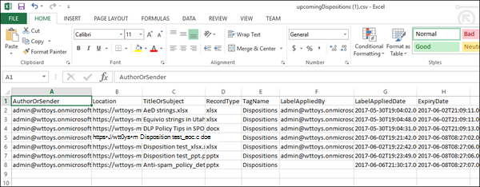

# Disposición del contenidoDisposition of content

>*[Guía de licencias de Microsoft 365 para la seguridad y el cumplimiento](https://aka.ms/ComplianceSD).**[Microsoft 365 licensing guidance for security & compliance](https://aka.ms/ComplianceSD).*

Use la pestaña **disposición** de la **Administración de registros** en el centro de cumplimiento de Microsoft 365 para administrar las revisiones de disposición y ver [los registros](records.md) que se han eliminado automáticamente al final del período de retención.Use the **Disposition** tab from **Records Management** in the Microsoft 365 compliance center to manage disposition reviews and view [records](records.md) that have been automatically deleted at the end of their retention period. 

## Requisitos previos para ver las disposiciones de contenidoPrerequisites for viewing content dispositions

Para administrar las revisiones de disposición y confirmar que los registros se han eliminado, debe tener permisos suficientes y la auditoría debe estar habilitada.To manage disposition reviews and confirm that records have been deleted, you must have sufficient permissions and auditing must be enabled.

### Permisos para disposiciónPermissions for disposition

Para obtener acceso correctamente a la pestaña **disposición** del centro de cumplimiento de Microsoft 365, los usuarios deben tener el rol de **Administración de disposición** y el rol **registros de auditoría con permiso de vista** .To successfully access the **Disposition** tab in the Microsoft 365 compliance center, users must have the **Disposition Management** role and the **View-Only Audit Logs** role. Aunque el aviso estándar es agregar usuarios a los grupos de roles predeterminados, en este caso, se recomienda crear un nuevo grupo de funciones denominado **revisores de disposición** con estos dos roles y agregar usuarios a este grupo según sea necesario.Although the standard advice is to add users to the default role groups, in this case, we recommend you create a new role group called **Disposition Reviewers** that has these two roles and add users to this group as needed. Un solo grupo de roles para la disposición reduce los gastos generales de administración y facilita a los usuarios los permisos combinados que necesitan.A single role group for disposition reduces administration overheads and makes it easier for users have the combined permissions that they need.

> [!NOTE]
> Incluso un administrador global debe recibir la función de **Administración de disposición** .Even a global admin needs to be granted the **Disposition Management** role. Por lo tanto, los administradores globales deben tener acceso a la ficha disposición como miembros del grupo de roles **Reviewers de disposición** .So if global admins need to access the disposition tab, them as members of the **Disposition Reviewers** role group. 

Específica del rol **registros de auditoría con permiso de vista** :Specific to the **View-Only Audit Logs** role:

- Dado que el cmdlet subyacente que se usa para buscar en el registro de auditoría es un cmdlet de Exchange Online, debe asignar a los usuarios este rol mediante el [centro de administración de Exchange en Exchange Online](https://docs.microsoft.com/Exchange/exchange-admin-center), en lugar de usar la página **permisos** del centro de seguridad & cumplimiento.Because the underlying cmdlet used to search the audit log is an Exchange Online cmdlet, you must assign users this role by using the [Exchange admin center in Exchange Online](https://docs.microsoft.com/Exchange/exchange-admin-center), rather than by using the **Permissions** page in the Security & Compliance Center. Para obtener instrucciones, vea [administrar grupos de roles en Exchange Online](https://docs.microsoft.com/Exchange/permissions-exo/role-groups).For instructions, see [Manage role groups in Exchange Online](https://docs.microsoft.com/Exchange/permissions-exo/role-groups).

- Los grupos de 365 de Microsoft ([anteriormente los grupos de Office 365](https://techcommunity.microsoft.com/t5/microsoft-365-blog/office-365-groups-will-become-microsoft-365-groups/ba-p/1303601)) no se admiten para este rol.Microsoft 365 groups ([formerly Office 365 groups](https://techcommunity.microsoft.com/t5/microsoft-365-blog/office-365-groups-will-become-microsoft-365-groups/ba-p/1303601)) aren't supported for this role. En su lugar, asigne buzones de usuario, usuarios de correo o grupos de seguridad habilitados para correo.Instead, assign user mailboxes, mail users, or mail-enabled security groups.

Para obtener instrucciones sobre cómo conceder a los usuarios la función de **Administración de disposición** y crear su nueva función de **revisores de disposición** , vea [conceder acceso a los usuarios al &amp; centro de seguridad y cumplimiento de Office 365](../security/office-365-security/grant-access-to-the-security-and-compliance-center.md).For instructions to grant users the **Disposition Management** role and create your new **Disposition Reviewers** role, see [Give users access to the Office 365 Security &amp; Compliance Center](../security/office-365-security/grant-access-to-the-security-and-compliance-center.md).

### Habilitar la auditoríaEnable auditing

Asegúrese de que la auditoría esté habilitada al menos un día antes de la primera acción de disposición.Make sure that auditing is enabled at least one day before the first disposition action. Para obtener más información, vea [Buscar en el registro de auditoría del &amp; centro de seguridad y cumplimiento de Office 365](search-the-audit-log-in-security-and-compliance.md).For more information, see [Search the audit log in the Office 365 Security &amp; Compliance Center](search-the-audit-log-in-security-and-compliance.md). 

## Revisiones para eliminaciónDisposition reviews

Cuando el contenido alcanza el final de su período de retención, existen varios motivos por los que puede que desee revisar el contenido para decidir si se puede eliminar de forma segura ("eliminado").When content reaches the end of its retention period, there are several reasons why you might want to review that content to decide whether it can be safely deleted ("disposed"). Por ejemplo, es posible que deba:For example, you might need to:
  
- Suspender la eliminación del contenido relevante en caso de litigio o una auditoría.Suspend the deletion of relevant content in the event of litigation or an audit.
    
- Quitar contenido de la lista de disposición para almacenarla en un archivo, si el contenido tiene un valor histórico o de investigación.Remove content from the disposition list to store in an archive, if that content has research or historical value.
    
- Asigne un período de retención diferente al contenido, quizá porque la configuración de retención original era una solución temporal o provisional.Assign a different retention period to the content, perhaps because the original retention settings were a temporary or provisional solution.
    
- Devolver el contenido a los clientes o transferirlo a otra organización.Return the content to clients or transfer it to another organization.

Cuando se activa una revisión de disposición al final del período de retención:When a disposition review is triggered at the end of the retention period:
  
- Las personas que elija reciben una notificación por correo electrónico de que tienen contenido que revisar.The people you choose receive an email notification that they have content to review. Estos revisores pueden ser usuarios individuales, grupos de distribución o de seguridad o grupos de 365 de Microsoft ([anteriormente grupos de Office 365](https://techcommunity.microsoft.com/t5/microsoft-365-blog/office-365-groups-will-become-microsoft-365-groups/ba-p/1303601)).These reviewers can be individual users, distribution or security groups, or Microsoft 365 groups ([formerly Office 365 groups](https://techcommunity.microsoft.com/t5/microsoft-365-blog/office-365-groups-will-become-microsoft-365-groups/ba-p/1303601)). Tenga en cuenta que las notificaciones se envían cada semana.Note that notifications are sent on a weekly basis.
    
- Los revisores van a la pestaña **disposición** del centro de cumplimiento de Microsoft 365 para revisar el contenido y decidir si desea eliminarlo permanentemente, ampliar el período de retención o aplicar una etiqueta de retención diferente.The reviewers go to the **Disposition** tab in the Microsoft 365 compliance center to review the content and decide whether to permanently delete it, extend its retention period, or apply a different retention label.

Una revisión de disposición puede incluir contenido en buzones de Exchange, sitios de SharePoint, cuentas de OneDrive y grupos de Microsoft 365.A disposition review can include content in Exchange mailboxes, SharePoint sites, OneDrive accounts, and Microsoft 365 groups. El contenido que espera una revisión de disposición en esas ubicaciones se elimina solo después de que un revisor elige eliminar el contenido de forma permanente.Content awaiting a disposition review in those locations is deleted only after a reviewer chooses to permanently delete the content.

> [!NOTE]
> Un buzón de correo debe tener al menos 10 MB de datos para admitir revisiones de disposición.A mailbox must have at least 10 MB data to support disposition reviews.

Puede ver una descripción general de todas las disposiciones pendientes en la ficha **información general** . Por ejemplo:You can see an overview of all pending dispositions in the **Overview** tab. For example:

Al seleccionar **ver todas las disposiciones pendientes**, se le lleva a la página de **disposición** .When you select the **View all pending dispositions**, you're taken to the **Disposition** page. Por ejemplo:For example:

### Flujo de trabajo para una revisión de disposiciónWorkflow for a disposition review

El siguiente diagrama muestra el flujo de trabajo básico para una revisión de disposición cuando una etiqueta de retención se publica y, a continuación, un usuario la aplica manualmente.The following diagram shows the basic workflow for a disposition review when a retention label is published and then manually applied by a user. Como alternativa, una etiqueta de retención configurada para una revisión de disposición se puede aplicar automáticamente al contenido.Alternatively, a retention label configured for a disposition review can be auto-applied to content.
  

  
Desencadenar una revisión de disposición al final del período de retención es una opción de configuración que solo está disponible con una etiqueta de retención.Triggering a disposition review at the end of the retention period is a configuration option that's available only with a retention label. Esta opción no está disponible para una directiva de retención.This option is not available for a retention policy. Para obtener más información acerca de estas dos soluciones de retención, consulte [información sobre las directivas de retención y las etiquetas de retención](retention.md).For more information about these two retention solutions, see [Learn about retention policies and retention labels](retention.md).
  

 
> [!NOTE]
> Cuando seleccione la opción **notificar a estas personas cuando hay elementos listos para revisar**, especifique un usuario o un grupo de seguridad habilitado para correo.When you select the option **Notify these people when there are items ready to review**, specify a user or mail-enabled security group. Para esta opción no se admiten grupos de 365 de Microsoft ([anteriormente los grupos de Office 365](https://techcommunity.microsoft.com/t5/microsoft-365-blog/office-365-groups-will-become-microsoft-365-groups/ba-p/1303601)).Microsoft 365 groups ([formerly Office 365 groups](https://techcommunity.microsoft.com/t5/microsoft-365-blog/office-365-groups-will-become-microsoft-365-groups/ba-p/1303601)) are not supported for this option.

### Visualización y eliminación de contenidoViewing and disposing of content

Cuando se notifica a un revisor por correo electrónico que el contenido está preparado para revisarlo, se dirige a la pestaña **disposición** de **Administración de registros** en el centro de cumplimiento de Microsoft 365.When a reviewer is notified by email that content is ready to review, they go to the **Disposition** tab from **Records Management** in the Microsoft 365 compliance center. Los revisores pueden ver cuántos elementos tiene la etiqueta de retención en espera de disposición y, a continuación, seleccionar una etiqueta de retención para ver todo el contenido con esa etiqueta.The reviewers can see how many items for each retention label are awaiting disposition, and then select a retention label to see all content with that label.

Después de seleccionar una etiqueta de retención, verá todas las coposiciones pendientes para esa etiqueta de la pestaña de **disposición pendiente** . Seleccione uno o más elementos en los que podrá elegir una acción y escriba un Comentario de justificación:After you select a retention label, you then see all pending dispositions for that label from the **Pending disposition** tab. Select one or more items where you can then choose an action and enter a justification comment:

Como puede ver en la imagen, las acciones admitidas son las siguientes:As you can see from the picture, the actions supported are: 
  
- Eliminar permanentemente el elementoPermanently delete the item
- Ampliación del período de retenciónExtend the retention period
- Aplicar una etiqueta de retención diferenteApply a different retention label

Siempre que tenga permisos para la ubicación y el contenido, puede usar el vínculo de la columna **Ubicación** para ver los documentos en su ubicación original.Providing you have permissions to the location and the content, you can use the link in the **Location** column to view documents in their original location. Durante una revisión de disposición, el contenido nunca se mueve desde su ubicación original, y nunca se elimina hasta que el revisor elige hacerlo.During a disposition review, the content never moves from its original location, and it's never deleted until the reviewer chooses to do so.

Las notificaciones por correo electrónico se envían de forma automática a los revisores cada semana.The email notifications are sent automatically to reviewers on a weekly basis. Este proceso programado significa que cuando el contenido alcanza el final de su período de retención, los revisores pueden tardar hasta siete días en recibir la notificación por correo electrónico de que el contenido espera la disposición.This scheduled process means that when content reaches the end of its retention period, it might take up to seven days for reviewers to receive the email notification that content is awaiting disposition.
  
Todas las acciones de disposición se pueden auditar y el texto de justificación escrito por el revisor se guarda y se muestra en la columna **Comentario** de la página **elementos desechados** .All disposition actions can be audited and the justification text entered by the reviewer is saved and displayed in the **Comment** column on the **Disposed items** page.
  
### Cuánto tiempo se eliminará permanentemente el contenido desechadoHow long until disposed content is permanently deleted

El contenido que espera una revisión de disposición se elimina solo después de que un revisor elige eliminar el contenido de forma permanente.Content awaiting a disposition review is deleted only after a reviewer chooses to permanently delete the content. Cuando el revisor elige esta opción, el contenido en el sitio de SharePoint o la cuenta de OneDrive pasa a ser apto para el proceso de limpieza estándar descrito en [Cómo funciona la configuración de retención con el contenido en su lugar](retention.md#how-retention-settings-work-with-content-in-place).When the reviewer chooses this option, the content in the SharePoint site or OneDrive account becomes eligible for the standard cleanup process described in [How retention settings work with content in place](retention.md#how-retention-settings-work-with-content-in-place).

## Disposición de los registrosDisposition of records

> [!NOTE]
> La capacidad para ver los registros que se eliminaron automáticamente sin una revisión de disposición se distribuye gradualmente a los inquilinos de abril y mayo de 2020, por lo que es posible que no vea esta experiencia de forma inmediata.The ability to see records that were automatically deleted without a disposition review is gradually rolling out to tenants during April and May 2020, so you might not see this experience immediately.

Use la pestaña **disposición** de la página **Administración de registros** para identificar los registros que se eliminan automáticamente.Use the **Disposition** tab from the **Records Management** page to identify records that are automatically deleted. Estos elementos muestran **los registros eliminados** en la columna **tipo** .These items display **Records Disposed** in the **Type** column. Por ejemplo:For example:

Los elementos que se muestran en la ficha **elementos desechados** para las etiquetas de registro se conservan durante un máximo de 7 años después de que se eliminó el elemento, con un límite de 1 millón elementos por registro para ese período.Items that are shown in the **Disposed Items** tab for record labels are kept for up to 7 years after the item was disposed, with a limit of one million items per record for that period. Si ve el número de **recuento** cerca de este límite de 1 millón y necesita probar la disposición de sus registros, póngase en contacto [con el soporte técnico de Microsoft](https://docs.microsoft.com/office365/admin/contact-support-for-business-products).If you see the **Count** number nearing this limit of one million, and you need proof of disposition for your records, contact [Microsoft Support](https://docs.microsoft.com/office365/admin/contact-support-for-business-products).

> [!NOTE]
> Esta funcionalidad se basa en la información del [registro de auditoría unificado](search-the-audit-log-in-security-and-compliance.md) y, por lo tanto, requiere que la auditoría esté [habilitada y sea buscada](turn-audit-log-search-on-or-off.md) para que se capturen los eventos correspondientes.This functionality is based on information from the [unified audit log](search-the-audit-log-in-security-and-compliance.md) and therefore requires auditing to be [enabled and searchable](turn-audit-log-search-on-or-off.md) so the corresponding events are captured.
    
## Filtrar y exportar las vistasFilter and export the views

Cuando se selecciona una etiqueta de retención de la página de **disposición** , la ficha de **disposición pendiente** (si procede) y la ficha **elementos desechados** le permiten filtrar las vistas para facilitar la búsqueda de elementos.When you select a retention label from the **Disposition** page, the **Pending disposition** tab (if applicable) and the **Disposed items** tab let you filter the views to help you more easily find items. 

Para las disposiciones pendientes, el intervalo de tiempo se basa en la fecha de expiración.For pending dispositions, the time range is based on the expiration date. Para los elementos eliminados, el intervalo de tiempo se basa en la fecha de eliminación.For disposed items, the time range is based on the deletion date.
  
Puede exportar la información sobre los elementos en cualquiera de las vistas como un archivo. csv que puede ordenar y administrar mediante Excel:You can export information about the items in either view as a .csv file that you can then sort and manage using Excel:

  

