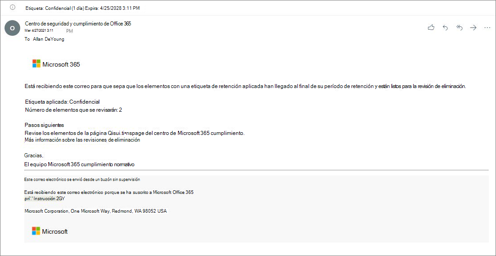

# <a name="disposition-of-content"></a>Eliminación de contenido

>*[Instrucciones de licencias de Microsoft 365 para la seguridad y el cumplimiento](/office365/servicedescriptions/microsoft-365-service-descriptions/microsoft-365-tenantlevel-services-licensing-guidance/microsoft-365-security-compliance-licensing-guidance).*

Use la página **Eliminación** de **Administración de registros** en el Centro de cumplimiento de Microsoft 365 para administrar las revisiones de eliminación y ver los metadatos de los [registros](records-management.md#records) que se hayan eliminado automáticamente al final de su período de retención.

> [!NOTE]
> Versión preliminar: **revisión para eliminación de varias etapas**
> 
> Ahora un administrador puede agregar hasta cinco fases consecutivas de revisión para eliminación en una etiqueta de retención y los revisores pueden agregar a otros usuarios a su fase de revisión para eliminación. También puede personalizar las notificaciones por correo electrónico y los avisos. En las siguientes secciones se ofrece más información sobre los cambios en esta versión preliminar.
>
> Para leer el anuncio de la versión, consulte la entrada de blog [Anuncio de la disposición de varias etapas en la Administración de registros de Microsoft](https://techcommunity.microsoft.com/t5/security-compliance-and-identity/announcing-multi-stage-disposition-in-microsoft-records/ba-p/2361849).

## <a name="prerequisites-for-viewing-content-dispositions"></a>Requisitos previos para ver las eliminaciones de contenido

Para administrar las revisiones de eliminación y confirmar que los registros se han eliminado, debe tener los permisos necesarios y la auditoría debe estar habilitada. Además, tenga en cuenta cualquier [limitación](retention-limits.md#maximum-number-of-items-for-disposition) de eliminación.

### <a name="permissions-for-disposition"></a>Permisos para la eliminación

Para acceder correctamente a la pestaña **Eliminación** en el Centro de cumplimiento de Microsoft 365, los usuarios deben tener el rol de **Administración de eliminación**. Desde diciembre de 2020, este rol está ahora incluido en el grupo de roles predeterminado **Administración de registros**.

> [!NOTE]
> De manera predeterminada, un administrador global no tiene concedido el rol de **Administración de eliminación**. 

Para conceder a los usuarios solo los permisos que necesitan para las revisiones de disposición sin concederles permisos para ver y configurar otras características para la retención y la gestión de registros, cree un grupo de funciones personalizado (por ejemplo, denominado "Revisores de disposición") y conceda a este grupo la función de **Administración de eliminación**.

Para obtener instrucciones sobre la configuración de estos permisos, consulte [Proporcionar a los usuarios acceso al Centro de seguridad y cumplimiento de Office 365](../security/office-365-security/grant-access-to-the-security-and-compliance-center.md).

Además:

- Para ver el contenido de los elementos durante el proceso de eliminación, agregue usuarios al grupo de roles **Visor de contenido del Explorador de contenido**. Si los usuarios no tienen los permisos de este grupo de roles, aún pueden seleccionar una acción de revisión para eliminación para completar la revisión para eliminación, pero deben hacerlo sin poder ver el contenido del elemento desde el panel de vista previa en miniatura del centro de cumplimiento.

- En la versión preliminar: de forma predeterminada, cada persona que accede a la página **Eliminación** solo ve los elementos que tienen asignados para revisar. Para que un administrador de administración de registros vea todos los elementos asignados a todos los usuarios y todas las etiquetas de retención que están configuradas para la revisión para eliminación: vaya a **Configuración de administración de registros** > **General** > **Grupo de seguridad para el administrador de registros** para seleccionar y habilitar un grupo de seguridad habilitado para correo que contiene las cuentas de administrador.
    
    Los grupos de Microsoft 365 y los grupos de seguridad que no están habilitados para correo no admiten esta característica y no se mostrarán en la lista para seleccionar. Si necesita crear un grupo de seguridad habilitado para correo, use el vínculo al Centro de administración de Microsoft 365 para crear el nuevo grupo. 
    
    > [!IMPORTANT]
    > Una vez habilitado el grupo, no puede cambiarlo en el centro de cumplimiento. Vea la sección siguiente sobre cómo habilitar un grupo diferente mediante PowerShell.

- En la versión preliminar: la opción **Configuración de administración de registros** solo está visible para los administradores de administración de registros. 

#### <a name="enabling-another-security-group-for-disposition"></a>Habilitar otro grupo de seguridad para su eliminación

Después de habilitar un grupo de seguridad para su eliminación de la **Configuración de administración de registros** en el Centro de cumplimiento de Microsoft 365, no puede deshabilitar este permiso para el grupo ni reemplazar el grupo seleccionado en el centro de cumplimiento. Sin embargo, puede habilitar otro grupo de seguridad habilitado para correo si usa el cmdlet [Enable-ComplianceTagStorage](/powershell/module/exchange/enable-compliancetagstorage).

Por ejemplo: 

```PowerShell
Enable-ComplianceTagStorage -RecordsManagementSecurityGroupEmail dispositionreviewers@contosoi.com
````

### <a name="enable-auditing"></a>Habilitar auditoría

Asegúrese de que la auditoría está activada al menos un día antes de la primera acción de eliminación. Para más información, vea [Buscar en el registro de auditoría del Centro de seguridad &amp; cumplimiento de Office 365](search-the-audit-log-in-security-and-compliance.md). 

## <a name="disposition-reviews"></a>Revisiones para eliminación

Cuando el contenido llegue al final de su período de retención, hay varios motivos por los que puede que quiera revisarlo y confirmar si se puede borrar de forma permanente ("eliminar"). Por ejemplo, en vez de eliminar el contenido, puede que deba:
  
- Suspender la eliminación de contenido relevante para litigios o una auditoría.

- Asignar un periodo de retención diferente al contenido, por ejemplo, porque las configuraciones de retención originales eran una solución temporal o provisional.

- Mover el contenido desde su ubicación existente a una ubicación de archivo. Por ejemplo, si ese contenido tiene valor histórico o de investigación.

Cuando se activa una revisión para eliminación al final del período de retención:
  
- Los revisores que elija recibirán una notificación por correo electrónico de que tienen contenido para revisar. Estos revisores pueden ser usuarios individuales o grupos de seguridad habilitados para correo. Novedades de la versión preliminar:
   - Puede personalizar el correo electrónico que reciben, incluidas instrucciones en diferentes idiomas. Para obtener compatibilidad con varios idiomas, debe especificar las traducciones usted mismo y este texto personalizado se mostrará a todos los revisores, con independencia de su configuración regional.
   - Los usuarios reciben una notificación por correo electrónico inicial por etiqueta al final del periodo de retención del elemento, con un aviso por etiqueta una vez por semana de todas las revisiones para eliminación que se les han asignado. Pueden hacer clic en el vínculo de los correos electrónicos de notificación y aviso para ir a la página **Eliminación** del Centro de cumplimiento de Microsoft 365 para revisar el contenido y tomar medidas. De forma alternativa, los revisores pueden ir directamente a la página de **Eliminación** en el centro de cumplimiento.
   - Los revisores solo ven las revisiones para eliminación que se les han asignado, mientras que los administradores agregados al grupo de seguridad del administrador de registros seleccionado ven todas las revisiones para eliminación.
   - Los revisores pueden agregar nuevos usuarios a la misma revisión para eliminación. Actualmente, esta acción no concede automáticamente a estos usuarios agregados los [permisos necesarios](#permissions-for-disposition).
   - Para el proceso de revisión para eliminación, un panel de revisión en miniatura de cada elemento muestra una vista previa del contenido si tienen permisos para verlo. Si no tienen permisos, pueden seleccionar el vínculo de contenido y solicitar permisos. Este panel de revisión en pequeño también tiene pestañas para obtener información adicional sobre el contenido:
       - **Detalles** para mostrar las propiedades indizadas, dónde se encuentra, quién lo creó, cuándo, quién lo modificó por última vez y cuándo.
       - **Historial** muestra el historial de cualquier acción de revisión para eliminación hasta la fecha, con comentarios del revisor si están disponibles.

Una revisión para eliminación puede incluir contenido en buzones de Exchange, sitios de SharePoint y cuentas de OneDrive. El contenido pendiente de una revisión para eliminación en esas ubicaciones se elimina permanentemente solo después de que un revisor para la fase final de eliminación elija eliminar el contenido de forma permanente.

> [!NOTE]
> Un buzón debe tener al menos 10 MB de datos para admitir las revisiones para eliminación.

Los administradores pueden ver una descripción general de todas las eliminaciones pendientes en la pestaña **Información general**. Los revisores solo ven sus elementos pendientes de eliminación. Por ejemplo:


Al seleccionar **Ver todas las eliminaciones pendientes**, se le dirigirá a la página **Eliminación**. Por ejemplo:


### <a name="workflow-for-a-disposition-review"></a>Flujo de trabajo para una revisión para eliminación

El siguiente diagrama muestra el flujo de trabajo básico de una revisión para eliminación cuando se publica una etiqueta de retención y un usuario la aplica de forma manual. Como alternativa, puede aplicar automáticamente la etiqueta de retención configurada para una revisión para eliminación al contenido.
  


### <a name="how-to-configure-a-retention-label-for-disposition-review"></a>Cómo configurar una etiqueta de retención para la revisión para eliminación

Desencadenar una revisión para eliminación al final del período de retención es una opción de configuración que solo está disponible con una etiqueta de retención. La revisión para eliminación no está disponible para una directiva de retención. Para más información sobre estas dos soluciones de retención, consulte [Obtener información sobre las directivas de retención y las etiquetas de retención](retention.md).

En la página **Definir la configuración de retención** de una etiqueta de retención:


 
Después de seleccionar la opción **Desencadenar una revisión para eliminación**, en la siguiente página del asistente, especifique cuántas fases consecutivas de eliminación quiere y los revisores de eliminación para cada fase:

 

Seleccione **Agregar una fase** y asigne un nombre a la fase para fines de identificación. Después, especifique los revisores de esa fase.

Para los revisores, especifique un usuario o un grupo de seguridad habilitado para correo. En esta opción, actualmente no se admiten los grupos de Microsoft 365 ([anteriormente llamados grupos de Office 365](https://techcommunity.microsoft.com/t5/microsoft-365-blog/office-365-groups-will-become-microsoft-365-groups/ba-p/1303601)).

Si necesita que más de una persona revise un elemento al final del periodo de retención, seleccione **Agregar una fase** de nuevo y repita el proceso de configuración para el número de fases que necesita, con un máximo de cinco fases. 

Dentro de cada fase individual de eliminación, cualquiera de los usuarios que especifique para esa fase están autorizados para realizar la siguiente acción para el elemento al final del período de retención. Estos usuarios también pueden agregar otros usuarios a su fase de revisión para eliminación.

> [!NOTE]
> Las etiquetas de retención existentes configuradas para la revisión para eliminación pueden actualizarse para usar la revisión para eliminación preconfigurada mediante la configuración de la etiqueta. En el asistente para etiquetas, seleccione **Agregar una fase**, edite los revisores existentes o agregue nuevos revisores.

Durante la fase de configuración, para cada fase especificada, puede cambiar el nombre, cambiar el orden o quitarla seleccionando la opción de Acciones de fase (**...**): 


Sin embargo, no puede reordenar o quitar una fase después de haber creado la etiqueta de retención.

Después de especificar a los revisores, recuerde concederles el permiso de rol de **Administración de eliminación**. Para más información, vea la sección [Permisos de eliminación](#permissions-for-disposition) en esta página.

### <a name="how-to-customize-email-messages-for-disposition-review"></a>Cómo personalizar los mensajes de correo electrónico para la revisión para eliminación

Ejemplo de notificación de correo electrónico predeterminada que se envía a un revisor:



También en la vista previa, puede personalizar los mensajes de correo electrónico que se envían a los revisores para eliminación para la notificación inicial y los avisos.

En cualquiera de las páginas de Eliminación del Centro de cumplimiento, seleccione **Configuración de administración de registros**:  


Después, seleccione la pestaña **Notificaciones de eliminación** y especifique si desea usar solo el mensaje de correo electrónico predeterminado o agregar su propio texto al mensaje predeterminado. El texto personalizado se agrega a las instrucciones de correo electrónico después de la información sobre la etiqueta de retención y antes de las instrucciones de los pasos siguientes.

Se puede agregar texto para todos los idiomas, pero actualmente el formato y las imágenes no son compatibles. Las direcciones URL y las direcciones de correo pueden especificarse como texto y, en función del cliente de correo electrónico, mostrarse como hipervínculos o texto sin formato en el correo electrónico personalizado.

Texto de ejemplo que se añadirá:

```console
If you need additional information, visit the helpdesk website (https://support.contoso.com) or send them an email (helpdesk@contoso.com).
```

Seleccione **Guardar** para guardar los cambios.

### <a name="viewing-and-disposing-of-content"></a>Visualización y eliminación de contenido

Cuando un revisor recibe una notificación por correo electrónico de que el contenido está listo para revisar, puede hacer clic en un vínculo del correo electrónico que le lleve directamente a la página **Eliminación** de **Administración de registros** en el Centro de cumplimiento de Microsoft 365. Los revisores pueden ver cuántos elementos para cada etiqueta de retención están pendientes de eliminación con el **Tipo** que muestra **Eliminación pendiente**. Después, seleccionan una etiqueta de retención y **Abrir en ventana nueva** para ver todo el contenido con esa etiqueta:


En la página **Eliminaciones pendientes**, pueden ven todas las eliminacións pendientes para esa etiqueta. Cuando se seleccionan uno o más elementos, pueden usar el panel de vista previa en miniatura y las pestañas de **Origen**, **Detalles** e **Historial** para inspeccionar el contenido antes de realizar alguna acción:


Si utiliza la barra de desplazamiento horizontal o cierra el panel de revisión en miniatura, verá más columnas que incluyen la fecha de expiración y el nombre de la fase de revisión para eliminación.

Como puede ver en el ejemplo que se muestra, las acciones admitidas son las siguientes: 
  
- **Aprobar eliminación**:
    - Cuando se selecciona esta acción para una fase provisional de revisión para eliminación (ha configurado varias fases): el elemento se mueve a la siguiente fase de eliminación.
    - Cuando se selecciona esta acción para la última fase de revisión para eliminación, o solo hay una fase de eliminación: el elemento se marca como apto para la eliminación permanente. El momento exacto para esa eliminación depende de la carga de trabajo. Para más información, vea [Cómo funciona la configuración de retención con el contenido local](retention.md#how-retention-settings-work-with-content-in-place).
- **Volver a etiquetar**:
    - Cuando se selecciona esta acción, el elemento sale del proceso de revisión para eliminación de la etiqueta original. Después, el elemento está sujeto a la configuración de retención de la nueva etiqueta de retención seleccionada.
- **Extender**:
    - Cuando se selecciona esta acción, la revisión para eliminación se suspende de forma efectiva hasta el final del período extendido y, después, la revisión para eliminación se vuelve a activar desde la primera fase.
- **Agregar revisores**:
    - Cuando se selecciona esta acción, se pide al usuario que especifique y agregue otros usuarios para su revisión.
    
    > [!NOTE]
    > Esta acción no concede automáticamente los [permisos necesarios](#permissions-for-disposition) a los usuarios agregados. Si no tienen estos permisos, no podrán participar en la revisión para eliminación.

Todas las acciones realizadas se guardan y almacenan, aunque todavía no puede buscarlas en el registro de auditoría.

Durante una revisión para eliminación, el contenido nunca se mueve de su ubicación original y no se marca para su eliminación permanente hasta que un revisor selecciona esta acción para última o única fase de eliminación.

## <a name="disposition-of-records"></a>Eliminación de registros

Use la pestaña **Eliminación** en la página **Administración de registros** para identificar:

- Los elementos eliminados como resultado de una revisión para eliminación.
- Elementos marcados como un registro o un registro normativo que se eliminaron automáticamente al final de su periodo de retención.

Estos elementos muestran **Registros eliminados** en la columna **Tipo**. Por ejemplo:


> [!NOTE]
> Esta funcionalidad usa la información del [registro de auditoría unificado](search-the-audit-log-in-security-and-compliance.md) y, por lo tanto, requiere que la auditoría se [habilite y se pueda buscar](turn-audit-log-search-on-or-off.md) para que se puedan capturar los eventos correspondientes.

Para auditar los elementos eliminados marcados como registros o registros normativos, busque un **Archivo eliminado marcado como un registro** en la categoría **Actividades de archivo y página**. Este evento de auditoría se aplica a documentos y mensajes de correo electrónico.

## <a name="filter-and-export-the-views"></a>Filtrar y exportar las vistas

Al seleccionar una etiqueta de retención de la página **Eliminación**, la pestaña **Pendiente de eliminación** (si procede) y la pestaña **Elementos eliminados** le permiten filtrar las vistas para facilitar la búsqueda de elementos.

Para las eliminaciones pendientes, el intervalo de tiempo se basa en la fecha de expiración. En el caso de los elementos eliminados, el intervalo de tiempo se basa en la fecha de eliminación.
  
Puede exportar información acerca de los elementos de cualquier vista como un archivo .csv que puede ordenar y administrar con Excel.
