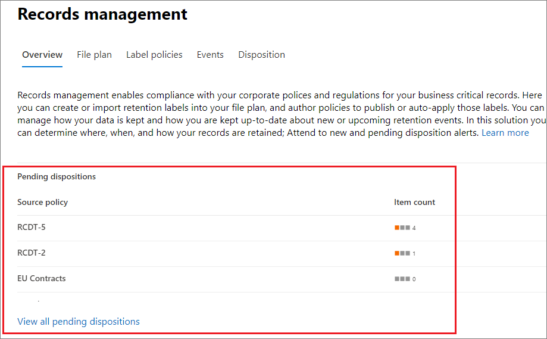
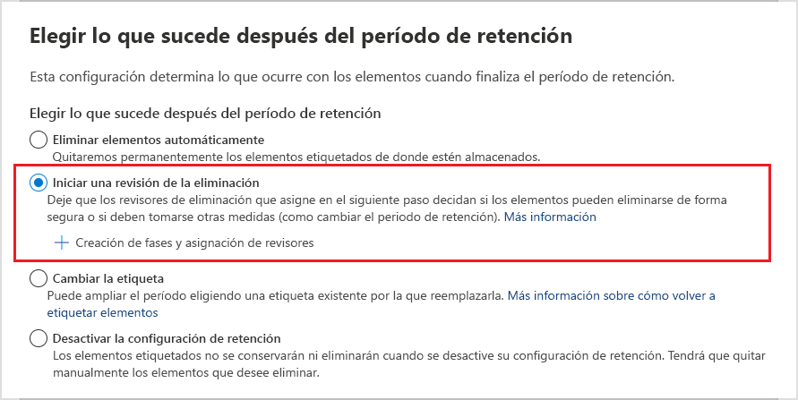
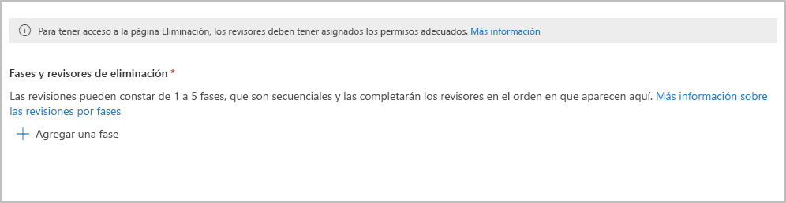
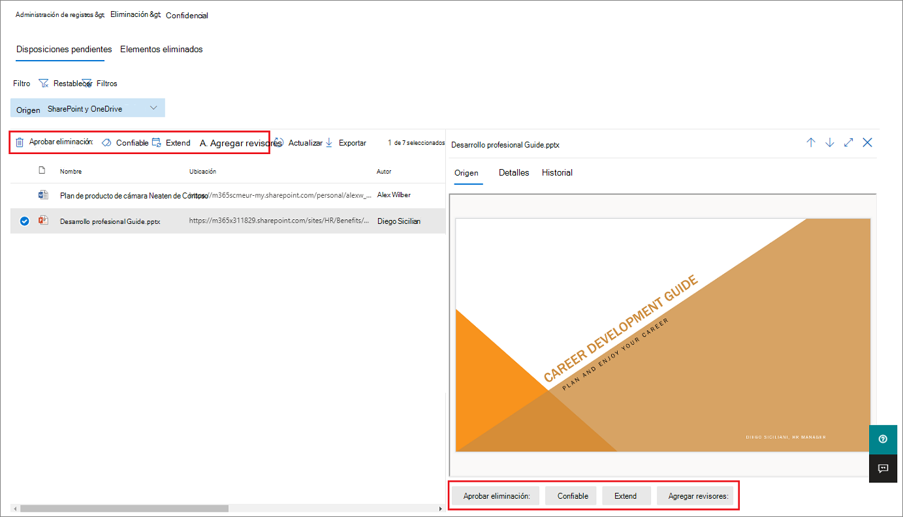
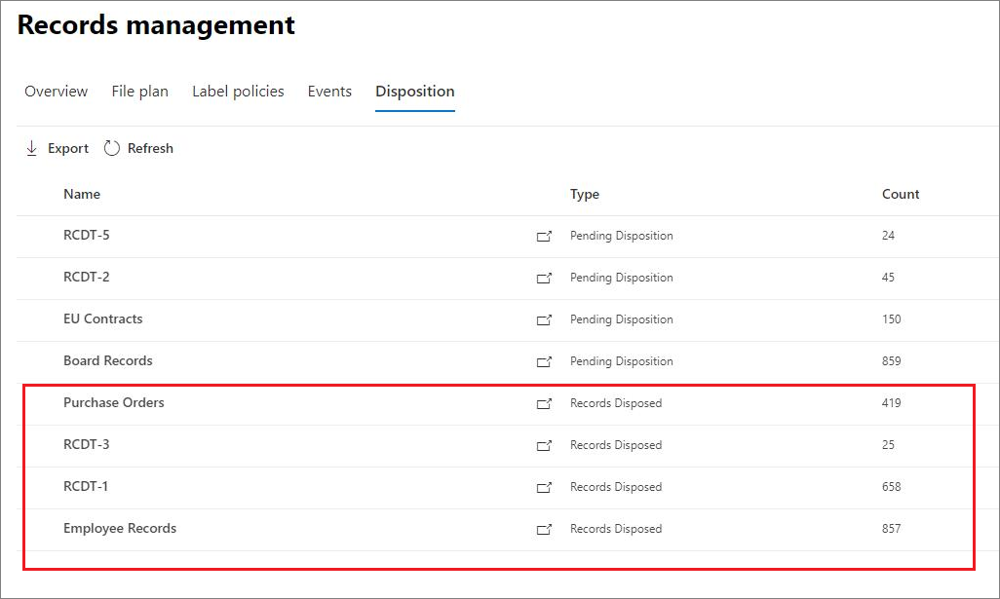
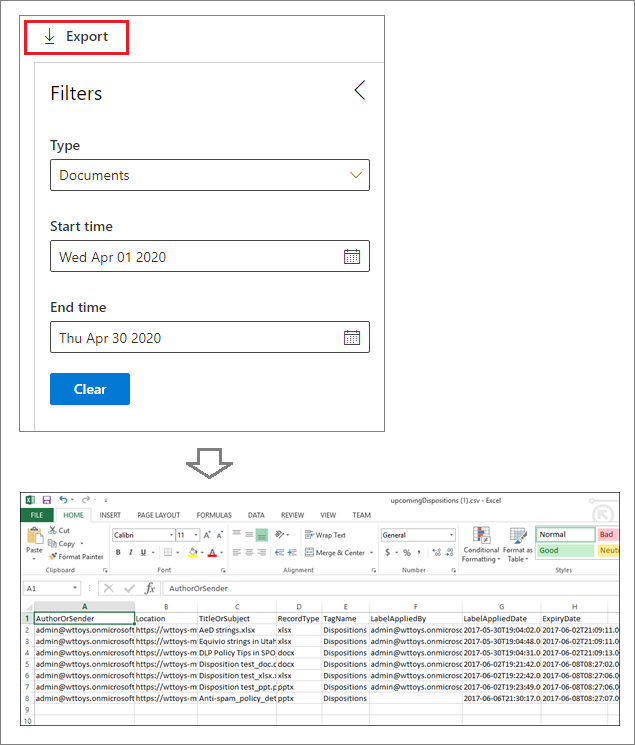

# Eliminación de contenidoDisposition of content

>*[Instrucciones de licencias de Microsoft 365 para la seguridad y el cumplimiento](/office365/servicedescriptions/microsoft-365-service-descriptions/microsoft-365-tenantlevel-services-licensing-guidance/microsoft-365-security-compliance-licensing-guidance).**[Microsoft 365 licensing guidance for security & compliance](/office365/servicedescriptions/microsoft-365-service-descriptions/microsoft-365-tenantlevel-services-licensing-guidance/microsoft-365-security-compliance-licensing-guidance).*

Use la pestaña **Eliminación** de **Administración de registros** en el Centro de cumplimiento de Microsoft 365 para administrar las revisiones de eliminación y ver [registros](records-management.md#records) que se hayan eliminado automáticamente al final de su período de retención.Use the **Disposition** tab from **Records Management** in the Microsoft 365 compliance center to manage disposition reviews and view [records](records-management.md#records) that have been automatically deleted at the end of their retention period. 

## Requisitos previos para ver las eliminaciones de contenidoPrerequisites for viewing content dispositions

Para administrar las revisiones de eliminación y confirmar que los registros se han eliminado, debe tener los permisos necesarios y la auditoría debe estar habilitada.To manage disposition reviews and confirm that records have been deleted, you must have sufficient permissions and auditing must be enabled.

### Permisos para la eliminaciónPermissions for disposition

Para acceder de forma satisfactoria a la pestaña **Eliminación** en el Centro de cumplimiento de Microsoft 365, los usuarios deben tener el rol de administrador de **Administración de eliminación**.To successfully access the **Disposition** tab in the Microsoft 365 compliance center, users must have the **Disposition Management** admin role. Desde diciembre de 2020, este rol está ahora incluido en el grupo de roles de administrador predeterminado **Administración de registros**.From December 2020, this role is now included in the **Records Management** default admin role group.

> [!NOTE]
> De lmanera predeterminada, un administrador global no tiene concedido el rol de **Administración de eliminación**.By default, a global admin isn't granted the **Disposition Management** role. 

Para conceder a los usuarios solo los permisos que necesitan para las revisiones de disposición sin concederles permisos para ver y configurar otras características para la retención y la gestión de registros, cree un grupo de funciones personalizado (por ejemplo, denominado "Revisores de disposición") y conceda a este grupo la función de gestión de disposición.To grant users just the permissions they need for disposition reviews without granting them permissions to view and configure other features for retention and records management, create a custom role group (for example, named "Disposition Reviewers") and grant this group the Disposition Management role.

Además, para ver el contenido de los elementos durante el proceso de eliminación, agregue usuarios a los dos grupos de roles siguientes: **Visor de contenido del explorador de contenido** y **Visor de listas del explorador de contenido**.Additionally, to view the contents of items during the disposition process, add users to the following two role groups: **Content Explorer Content Viewer** and **Content Explorer List Viewer**. Si los usuarios no tienen los permisos para estos grupos de roles, aún pueden seleccionar una acción de revisión de eliminación para completar la revisión de eliminación, pero deberán hacerlo sin poder ver el contenido del elemento desde el centro de cumplimiento.If users don't have the permissions from these role groups, they can still select a disposition review action to complete the disposition review, but must do so without being able to view the item's contents from the compliance center.

Para obtener instrucciones sobre la configuración de estos permisos, consulte [Proporcionar a los usuarios acceso al Centro de seguridad y cumplimiento de Office 365](../security/office-365-security/grant-access-to-the-security-and-compliance-center.md).For instructions to configure these permissions, see [Give users access to the Office 365 Security & Compliance Center](../security/office-365-security/grant-access-to-the-security-and-compliance-center.md).

### Habilitar auditoríaEnable auditing

Asegúrese de que la auditoría está activada al menos un día antes de la primera acción de eliminación.Make sure that auditing is enabled at least one day before the first disposition action. Para más información, vea [Buscar en el registro de auditoría del Centro de seguridad &amp; cumplimiento de Office 365](search-the-audit-log-in-security-and-compliance.md).For more information, see [Search the audit log in the Office 365 Security &amp; Compliance Center](search-the-audit-log-in-security-and-compliance.md). 

## Revisiones para eliminaciónDisposition reviews

Cuando el contenido llegue al final de su período de retención, hay varios motivos por los que puede que quiera revisarlo y confirmar si se puede borrar de forma permanente ("eliminar"). Por ejemplo, en vez de eliminar el contenido, puede que deba:When content reaches the end of its retention period, there are several reasons why you might want to review that content and confirm whether it can be permanently deleted ("disposed"). For example, instead of deleting the content, you might need to:
  
- Suspender la eliminación de contenido relevante en caso de litigio o una auditoría.Suspend the deletion of relevant content in the event of litigation or an audit.

- Asignar un periodo de retención diferente al contenido, por ejemplo, porque las configuraciones de retención originales eran una solución temporal o provisional.Assign a different retention period to the content, perhaps because the original retention settings were a temporary or provisional solution.

- Mover el contenido desde su ubicación existente a una ubicación de archivo. Por ejemplo, si ese contenido tiene valor histórico o de investigación.Move the content from its existing location to an archive location, for example, if that content has research or historical value.

Cuando se activa una revisión para eliminación al final del período de retención:When a disposition review is triggered at the end of the retention period:
  
- Las personas que elija recibirán una notificación por correo electrónico de que tienen contenido para revisar.The people you choose receive an email notification that they have content to review. Estos revisores pueden ser usuarios individuales o grupos de seguridad habilitados para correo.These reviewers can be individual users or mail-enabled security groups. Tenga en cuenta que las notificaciones se envían cada semana.Note that notifications are sent on a weekly basis.
    
- Los revisores pueden ir a la pestaña **Eliminación** en el Centro de cumplimiento de Microsoft 365 para revisar el contenido y decidir si se elimina de forma permanente, se amplía el período de retención o se aplica una etiqueta de retención diferente.The reviewers go to the **Disposition** tab in the Microsoft 365 compliance center to review the content and decide whether to permanently delete it, extend its retention period, or apply a different retention label.

Una revisión para eliminación puede incluir contenido en buzones de Exchange, sitios de SharePoint, cuentas de OneDrive y grupos de Microsoft 365.A disposition review can include content in Exchange mailboxes, SharePoint sites, OneDrive accounts, and Microsoft 365 groups. El contenido pendiente de una revisión para eliminación en esas ubicaciones se eliminará solo después de que un revisor elija eliminar el contenido de forma permanente.Content awaiting a disposition review in those locations is deleted only after a reviewer chooses to permanently delete the content.

> [!NOTE]
> Un buzón debe tener al menos 10 MB de datos para admitir las revisiones para eliminación.A mailbox must have at least 10 MB data to support disposition reviews.

Puede ver una descripción general de todas las eliminaciones pendientes en la pestaña **Información general**. Por ejemplo:You can see an overview of all pending dispositions in the **Overview** tab. For example:

Al seleccionar **Ver todas las eliminaciones pendientes**, se le dirigirá a la página **Eliminación**.When you select the **View all pending dispositions**, you're taken to the **Disposition** page. Por ejemplo:For example:

### Flujo de trabajo para una revisión para eliminaciónWorkflow for a disposition review

El siguiente diagrama muestra el flujo de trabajo básico de una revisión para eliminación cuando se publica una etiqueta de retención y un usuario la aplica de forma manual.The following diagram shows the basic workflow for a disposition review when a retention label is published and then manually applied by a user. Como alternativa, puede aplicar automáticamente la etiqueta de retención configurada para una revisión para eliminación al contenido.Alternatively, a retention label configured for a disposition review can be auto-applied to content.
  

  
Desencadenar una revisión para eliminación al final del período de retención es una opción de configuración que solo está disponible con una etiqueta de retención.Triggering a disposition review at the end of the retention period is a configuration option that's available only with a retention label. Esta opción no está disponible para una directiva de retención.This option is not available for a retention policy. Para más información sobre estas dos soluciones de retención, consulte [Obtener información sobre las directivas de retención y las etiquetas de retención](retention.md).For more information about these two retention solutions, see [Learn about retention policies and retention labels](retention.md).

En la página **Definir la configuración de retención** de una etiqueta de retención:From the **Define retention settings** page for a retention label:

 
Después de seleccionar la opción **Desencadenar una revisión para eliminación**, especifique los revisores de eliminación en la siguiente página del asistente:After you select this **Trigger a disposition review** option, you specify the disposition reviewers on the next page of the wizard:

Para los revisores, especifique un usuario o un grupo de seguridad habilitado para correo.For the reviewers, specify a user or mail-enabled security group. En esta opción no se admiten los grupos de Microsoft 365 ([anteriormente llamados grupos de Office 365](https://techcommunity.microsoft.com/t5/microsoft-365-blog/office-365-groups-will-become-microsoft-365-groups/ba-p/1303601)).Microsoft 365 groups ([formerly Office 365 groups](https://techcommunity.microsoft.com/t5/microsoft-365-blog/office-365-groups-will-become-microsoft-365-groups/ba-p/1303601)) are not supported for this option.

### Visualización y eliminación de contenidoViewing and disposing of content

Cuando un revisor recibe una notificación por correo electrónico de que el contenido está listo para su revisión, puede ir a la pestaña **Eliminación** de **Administración de registros** en el Centro de cumplimiento de Microsoft 365.When a reviewer is notified by email that content is ready to review, they go to the **Disposition** tab from **Records Management** in the Microsoft 365 compliance center. Los revisores pueden ver cuántos elementos están esperando la eliminación para cada etiqueta de retención y seleccionar una etiqueta de retención para ver todo el contenido con esa etiqueta.The reviewers can see how many items for each retention label are awaiting disposition, and then select a retention label to see all content with that label.

Después de seleccionar una etiqueta de retención, verá todas las eliminaciones pendientes para dicha etiqueta en la pestaña **Pendiente de eliminación**. Seleccione uno o más elementos, en los que puede elegir una acción y escribir un comentario de justificación:After you select a retention label, you then see all pending dispositions for that label from the **Pending disposition** tab. Select one or more items where you can then choose an action and enter a justification comment:

Como puede ver en la imagen, las acciones compatibles son las siguientes:As you can see from the picture, the actions supported are: 
  
- Eliminar permanentemente el elementoPermanently delete the item
- Extender el período de retenciónExtend the retention period
- Aplicar una etiqueta de retención diferenteApply a different retention label

Siempre que disponga de permisos para la ubicación y el contenido, puede usar el vínculo de la columna **Ubicación** para ver los documentos en su ubicación original.Providing you have permissions to the location and the content, you can use the link in the **Location** column to view documents in their original location. Durante una revisión para eliminación, el contenido nunca se mueve de su ubicación original y nunca se elimina hasta que el revisor elija hacerlo.During a disposition review, the content never moves from its original location, and it's never deleted until the reviewer chooses to do so.

Las notificaciones por correo electrónico se envían automáticamente a los revisores cada semana. Este proceso programado significa que cuando el contenido llega al final de su período de retención, es posible que los revisores tarden hasta siete días en recibir la notificación por correo electrónico de que el contenido está esperando a ser eliminado.The email notifications are sent automatically to reviewers on a weekly basis. This scheduled process means that when content reaches the end of its retention period, it might take up to seven days for reviewers to receive the email notification that content is awaiting disposition.
  
Se pueden auditar todas las acciones de eliminación. Además, el texto de justificación introducido por el revisor se guarda y se muestra en la columna **Comentario** de la página **Elementos eliminados**.All disposition actions can be audited and the justification text entered by the reviewer is saved and displayed in the **Comment** column on the **Disposed items** page.
  
### Cuánto tiempo tarda el contenido eliminado en borrarse permanentementeHow long until disposed content is permanently deleted

El contenido que espera una revisión para eliminación solo se elimina después de que un revisor elija eliminar el contenido de forma permanente.Content awaiting a disposition review is deleted only after a reviewer chooses to permanently delete the content. Cuando el revisor elige esta opción, el contenido en el sitio de SharePoint o en la cuenta de OneDrive pasa a ser apto para el proceso de limpieza estándar descrito en [Cómo funciona la configuración de retención con el contenido local](retention.md#how-retention-settings-work-with-content-in-place).When the reviewer chooses this option, the content in the SharePoint site or OneDrive account becomes eligible for the standard cleanup process described in [How retention settings work with content in place](retention.md#how-retention-settings-work-with-content-in-place).

## Eliminación de registrosDisposition of records

Use la pestaña **Eliminación** en la página **Administración de registros** para identificar:Use the **Disposition** tab from the **Records Management** page to identify:

- Los elementos eliminados como resultado de una revisión para eliminación.Items deleted as a result of a disposition review.
- Elementos marcados como un registro o un registro normativo que se eliminaron automáticamente al final de su periodo de retención.Items marked as a record or regulatory record that were automatically deleted at the end of their retention period.

Estos elementos muestran **Registros eliminados** en la columna **Tipo**.These items display **Records Disposed** in the **Type** column. Por ejemplo:For example:

Los elementos que se muestran en la pestaña **Elementos eliminados** se guardan hasta siete años después de que se elimine el elemento, con un límite de un millón artículos por registro para ese período.Items that are shown in the **Disposed Items** tab are kept for up to seven years after the item was disposed, with a limit of one million items per record for that period. Si ve que el número de **Recuento** está a punto de alcanzar este límite de un millón y necesita una prueba de eliminación de los registros, póngase en contacto con el [Soporte técnico de Microsoft](../business-video/get-help-support.md).If you see the **Count** number nearing this limit of one million, and you need proof of disposition for your records, contact [Microsoft Support](../business-video/get-help-support.md).

> [!NOTE]
> Esta funcionalidad usa la información del [registro de auditoría unificado](search-the-audit-log-in-security-and-compliance.md) y, por lo tanto, requiere que la auditoría se [habilite y se pueda buscar](turn-audit-log-search-on-or-off.md) para que se puedan capturar los eventos correspondientes.This functionality uses information from the [unified audit log](search-the-audit-log-in-security-and-compliance.md) and therefore requires auditing to be [enabled and searchable](turn-audit-log-search-on-or-off.md) so the corresponding events are captured.

Para auditar los elementos eliminados marcados como registros o registros normativos, busque un **Archivo eliminado marcado como un registro** en la categoría **Actividades de archivo y página**.For auditing of deleted items that were marked as records or regulatory records, search for **Deleted file marked as a record** in the **File and page activities** category. Este evento de auditoría se aplica a documentos y mensajes de correo electrónico.This audit event is applicable to documents and emails.

## Filtrar y exportar las vistasFilter and export the views

Al seleccionar una etiqueta de retención de la página **Eliminación**, la pestaña **Pendiente de eliminación** (si procede) y la pestaña **Elementos eliminados** le permiten filtrar las vistas para facilitar la búsqueda de elementos.When you select a retention label from the **Disposition** page, the **Pending disposition** tab (if applicable) and the **Disposed items** tab let you filter the views to help you more easily find items. 

Para las eliminaciones pendientes, el intervalo de tiempo se basa en la fecha de expiración.For pending dispositions, the time range is based on the expiration date. En el caso de los elementos eliminados, el intervalo de tiempo se basa en la fecha de eliminación.For disposed items, the time range is based on the deletion date.
  
Puede exportar información acerca de los elementos de cualquier vista como un archivo .csv que puede ordenar y administrar con Excel:You can export information about the items in either view as a .csv file that you can then sort and manage using Excel:

