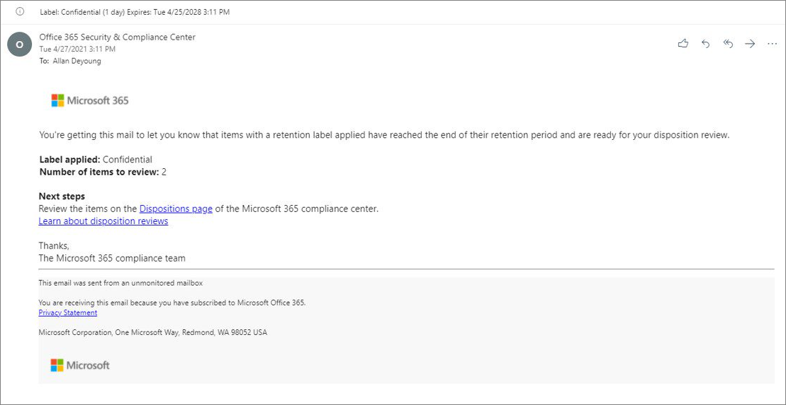

# <a name="disposition-of-content"></a>Eliminación de contenido

>*[Instrucciones de licencias de Microsoft 365 para la seguridad y el cumplimiento](/office365/servicedescriptions/microsoft-365-service-descriptions/microsoft-365-tenantlevel-services-licensing-guidance/microsoft-365-security-compliance-licensing-guidance).*

Use la página **Eliminación** de **Administración de registros** en el Portal de cumplimiento de Microsoft Purview para administrar las revisiones de eliminación y ver los metadatos de los [registros](records-management.md#records) que se hayan eliminado automáticamente al final de su período de retención.

## <a name="prerequisites-for-viewing-content-dispositions"></a>Requisitos previos para ver las eliminaciones de contenido

Para administrar las revisiones para eliminación y confirmar que los registros se han eliminado, debe tener permisos suficientes y debe habilitarse la auditoría. Tenga en cuenta también las [limitaciones](retention-limits.md#maximum-number-of-items-for-disposition) para su eliminación.

### <a name="permissions-for-disposition"></a>Permisos para la eliminación

Para acceder correctamente a la pestaña **Eliminación** en el Portal de cumplimiento de Microsoft Purview, los usuarios deben tener el rol de **Administración de eliminación**. Desde diciembre de 2020, este rol está ahora incluido en el grupo de roles predeterminado **Administración de registros**.

> [!NOTE]
> De manera predeterminada, un administrador global no tiene concedido el rol de **Administración de eliminación**. 

Para conceder a los usuarios solo los permisos que necesitan para las revisiones de disposición sin concederles permisos para ver y configurar otras características para la retención y la gestión de registros, cree un grupo de funciones personalizado (por ejemplo, denominado "Revisores de disposición") y conceda a este grupo la función de **Administración de eliminación**.

Para obtener instrucciones sobre cómo agregar usuarios a los roles predeterminados o crear sus propios grupos de roles, consulte [Permisos en el Portal de cumplimiento de Microsoft Purview](microsoft-365-compliance-center-permissions.md).

Además:

- Para ver el contenido de los elementos durante el proceso de eliminación, agregue usuarios al grupo de roles **Visor de contenido del Explorador de contenido**. Si los usuarios no tienen los permisos de este grupo de roles, aún pueden seleccionar una acción de revisión para eliminación para completar la revisión para eliminación, pero deben hacerlo sin poder ver el contenido del elemento desde el panel de vista previa en miniatura del Portal de cumplimiento de Microsoft Purview.

- De forma predeterminada, cada usuario que accede a la página **Eliminación** solo verá los elementos que se han asignado para revisar. Para que un administrador de gestión de registros vea todos los elementos asignados a todos los usuarios y todas las etiquetas de retención que se han establecido para su revisión para eliminación: vaya a **Configuración de administración de registros** > **Eliminación** para seleccionar y habilitar un grupo de seguridad habilitado para correo que contenga las cuentas de administrador.
    
    Los grupos de Microsoft 365 y los grupos de seguridad que no están habilitados para correo no admiten esta característica y no se muestran en la lista para seleccionar. Si necesita crear un grupo de seguridad habilitado para un correo nuevo, use el vínculo al <a href="https://go.microsoft.com/fwlink/p/?linkid=2024339" target="_blank">Centro de administración de Microsoft 365</a> para crear el grupo nuevo. 
    
    > [!IMPORTANT]
    > Después de habilitar el grupo, no podrá cambiarlo en el portal de cumplimiento de Microsoft Purview. Vea la sección siguiente sobre cómo habilitar un grupo diferente mediante PowerShell.

- La opción **Configuración de administración de registros** solo está visible para los administradores de administración de registros. 

#### <a name="enabling-another-security-group-for-disposition"></a>Habilitar otro grupo de seguridad para su eliminación

Después de habilitar un grupo de seguridad para la eliminación desde **Configuración de administración de registros** en el portal de cumplimiento de Microsoft Purview, no puede deshabilitar este permiso para el grupo ni reemplazar el grupo seleccionado en el portal de cumplimiento de Microsoft Purview. Sin embargo, puede habilitar otro grupo de seguridad habilitado para correo mediante el cmdlet [Enable-ComplianceTagStorage](/powershell/module/exchange/enable-compliancetagstorage).

Por ejemplo: 

```PowerShell
Enable-ComplianceTagStorage -RecordsManagementSecurityGroupEmail dispositionreviewers@contosoi.com
````

### <a name="enable-auditing"></a>Habilitar auditoría

Asegúrese de que la auditoría está activada al menos un día antes de la primera acción de eliminación. Para más información, consulte [Buscar en el registro de auditoría en el Portal de cumplimiento de Microsoft Purview](search-the-audit-log-in-security-and-compliance.md). 

## <a name="disposition-reviews"></a>Revisiones para eliminación

Cuando el contenido llegue al final de su período de retención, hay varios motivos por los que puede que quiera revisarlo y confirmar si se puede borrar de forma permanente ("eliminar"). Por ejemplo, en vez de eliminar el contenido, puede que deba:
  
- Suspender la eliminación de contenido relevante para litigios o una auditoría.

- Asignar un periodo de retención diferente al contenido, por ejemplo, porque las configuraciones de retención originales eran una solución temporal o provisional.

- Mover el contenido desde su ubicación existente a una ubicación de archivo. Por ejemplo, si ese contenido tiene valor histórico o de investigación.

Cuando se desencadena una revisión para eliminación al final del período de retención, los revisores que elija recibirán una notificación por correo electrónico de que tienen contenido para revisar. Estos revisores pueden ser usuarios individuales o grupos de seguridad habilitados para correo.

Puede personalizar el correo electrónico de notificación que reciben los revisores, incluidas las instrucciones en distintos idiomas. Para obtener compatibilidad con varios idiomas, debe especificar las traducciones usted mismo y este texto personalizado se mostrará a todos los revisores, con independencia de su configuración regional.

Los usuarios reciben una notificación inicial por correo electrónico por etiqueta al final del periodo de retención del elemento y un recordatorio por etiqueta una vez por semana de todas las revisiones para eliminación que se les han asignado. Pueden hacer clic en el vínculo de los correos electrónicos de notificación y aviso para ir directamente a la página **Administración de registros** > **Eliminación** en el Portal de cumplimiento de Microsoft Purview para revisar el contenido y tomar medidas. De forma alternativa, los revisores pueden navegar a la página **Eliminación** en el Portal de cumplimiento de Microsoft Purview. Luego:

- Los revisores solo ven las revisiones para eliminación que se les han asignado, mientras que los administradores agregados al grupo de seguridad del administrador de registros seleccionado ven todas las revisiones para eliminación.

- Los revisores pueden agregar nuevos usuarios a la misma revisión para eliminación. Tenga en cuenta que esta acción no concede automáticamente a estos usuarios agregados los [permisos necesarios](#permissions-for-disposition).

- Para el proceso de revisión para eliminación, un panel de revisión en miniatura de cada elemento muestra una vista previa del contenido si tienen permisos para verlo. Si no tienen permisos, pueden seleccionar el vínculo de contenido y solicitar permisos. Este panel de revisión en pequeño también tiene pestañas para obtener información adicional sobre el contenido:
   - **Detalles** para mostrar las propiedades indizadas, dónde se encuentra, quién lo creó, cuándo, quién lo modificó por última vez y cuándo.
   - **Historial** muestra el historial de cualquier acción de revisión para eliminación hasta la fecha, con comentarios del revisor si están disponibles.

Una revisión para eliminación puede incluir contenido en buzones de Exchange, sitios de SharePoint y cuentas de OneDrive. El contenido pendiente de una revisión para eliminación en esas ubicaciones se elimina permanentemente solo después de que un revisor para la fase final de eliminación elija eliminar el contenido de forma permanente.

> [!NOTE]
> Un buzón debe tener al menos 10 MB de datos para admitir las revisiones para eliminación.

Los administradores pueden ver información general de todas las eliminaciones pendientes en la pestaña **información general**. Los revisores solo ven sus elementos pendientes de eliminación. Por ejemplo:


Al seleccionar  **Ver todas las eliminaciones pendientes**, se le dirigirá a la página **Eliminación**. Por ejemplo:


### <a name="workflow-for-a-disposition-review"></a>Flujo de trabajo para una revisión para eliminación

El siguiente diagrama muestra el flujo de trabajo básico de una revisión para eliminación (fase única) cuando se publica una etiqueta de retención y un usuario la aplica de forma manual. Como alternativa, puede aplicar automáticamente la etiqueta de retención configurada para una revisión para eliminación al contenido.
  


### <a name="how-to-configure-a-retention-label-for-disposition-review"></a>Cómo configurar una etiqueta de retención para la revisión para eliminación

Desencadenar una revisión para eliminación al final del período de retención es una opción de configuración que solo está disponible con una etiqueta de retención. La revisión para eliminación no está disponible para una directiva de retención. Para más información sobre estas dos soluciones de retención, consulte [Obtener información sobre las directivas de retención y las etiquetas de retención](retention.md).

En la página **Elegir lo que sucede después del período de retención** para una etiqueta de retención:


 
Después de seleccionar la opción **Iniciar una revisión para eliminación**, seleccione **+ Crear fases y asignar revisores**. En la siguiente página de la configuración, especifique cuántas fases consecutivas de eliminación quiere y los revisores para eliminación por cada fase:

 

Seleccione **+ Agregar una fase** y asigne un nombre a la fase para poder identificarla. Después, especifique los revisores de esa fase.

Para los revisores, especifique hasta 10 usuarios individuales o grupos de seguridad habilitados para correo. En esta opción no se admiten los grupos de Microsoft 365 ([anteriormente llamados grupos de Office 365](https://techcommunity.microsoft.com/t5/microsoft-365-blog/office-365-groups-will-become-microsoft-365-groups/ba-p/1303601)).

Si necesita que más de un usuario revise un elemento al final del periodo de retención, seleccione **Agregar otra fase** y repita el proceso de configuración para el número de fases que necesita, con un máximo de cinco fases. 

Dentro de cada fase individual de eliminación, cualquiera de los usuarios que especifique para esa fase están autorizados para realizar la siguiente acción para el elemento al final del período de retención. Estos usuarios también pueden agregar otros usuarios a su fase de revisión para eliminación.

> [!NOTE]
> Si configuró etiquetas de retención antes de que estuviera disponible la revisión para eliminación de varias fases, puede actualizar las etiquetas para admitir esta característica: edite la etiqueta y seleccione **Editar fases y revisores** en la página **Elegir lo que sucede después del período de retención**.

Durante la fase de configuración, por cada fase especificada, puede cambiar el nombre, el orden o quitarla seleccionando **Editar fases y revisores** que ahora se muestran para la opción **Iniciar una revisión para eliminación**. A continuación, para cada fase, puede seleccionar la opción Acciones de fase (**...**): 


Sin embargo, no puede reordenar o quitar una fase después de haber creado la etiqueta de retención. Solo verá disponibles las opciones **Agregar una fase** y **Cambiar el nombre de una fase**. Aún podrá editar los revisores.

Después de especificar los revisores, recuerde concederles el permiso del rol **Administración de eliminación**. Para más información, vea la sección [Permisos de eliminación](#permissions-for-disposition) en esta página.

### <a name="how-to-customize-email-messages-for-disposition-review"></a>Cómo personalizar los mensajes de correo electrónico para la revisión para eliminación

Ejemplo de notificación de correo electrónico predeterminada que se envía a un revisor:



Puede personalizar los mensajes de correo electrónico que se envían a los revisores para eliminación para la notificación inicial y los avisos.

En cualquiera de las páginas de Administración de registros en el Portal de cumplimiento de Microsoft Purview, seleccione **Configuración de administración de registros**:  


En la pestaña **Disposición**, en la sección **Notificaciones de correo electrónico para revisiones de eliminación**, seleccione y especifique si desea usar solo el mensaje de correo electrónico predeterminado o agregar su propio texto al mensaje predeterminado. El texto personalizado se agrega a las instrucciones de correo electrónico después de la información sobre la etiqueta de retención y antes de las instrucciones de los pasos siguientes.

Se puede agregar texto para todos los idiomas, pero el formato y las imágenes no son compatibles. Las direcciones URL y las direcciones de correo pueden especificarse como texto y, en función del cliente de correo electrónico, mostrarse como hipervínculos o texto sin formato en el correo electrónico personalizado.

Texto de ejemplo que se añadirá:

```console
If you need additional information, visit the helpdesk website (https://support.contoso.com) or send them an email (helpdesk@contoso.com).
```

Seleccione **Guardar** para guardar los cambios.

### <a name="viewing-and-disposing-of-content"></a>Visualización y eliminación de contenido

Cuando un revisor recibe una notificación por correo electrónico de que el contenido está listo para revisar, puede hacer clic en un vínculo del correo electrónico que le lleve directamente a la página **Eliminación** de **Administración de registros** en el Portal de cumplimiento de Microsoft Purview. Los revisores pueden ver cuántos elementos para cada etiqueta de retención están pendientes de eliminación con el **Tipo** que muestra **Eliminación pendiente**. Después, seleccionan una etiqueta de retención y **Abrir en ventana nueva** para ver todo el contenido con esa etiqueta:


En la página **eliminaciones pendientes**, ven todas las eliminaciones pendientes para esa etiqueta. Cuando se seleccionan uno o varios elementos, pueden usar el panel de vista previa mínima y la pestaña **origen**, **detalles** e **historial** para inspeccionar el contenido antes de realizar acciones en él:


Si utiliza la barra de desplazamiento horizontal o cierra el panel de revisión en miniatura, verá más columnas que incluyen la fecha de expiración y el nombre de la fase de revisión para eliminación.

Como puede ver en el ejemplo que se muestra, las acciones admitidas son las siguientes: 
  
- **Aprobar eliminación**:
    - Cuando se selecciona esta acción para una fase provisional de revisión para eliminación (se han configurado varias fases): el elemento pasa a la siguiente fase de eliminación.
    - Cuando esta acción se selecciona en la última fase de revisión para eliminación o en caso de que solo haya una fase de eliminación: el elemento se marca como apto para la eliminación permanente y un trabajo de temporizador lo activa dentro de 7 días. El tiempo exacto para que el elemento se elimine de forma permanente depende de la carga de trabajo. Para obtener más información, vea [Cómo funciona la retención para SharePoint y OneDrive](retention-policies-sharepoint.md#how-retention-works-for-sharepoint-and-onedrive) y [Cómo funciona la retención para Exchange](retention-policies-exchange.md#how-retention-works-for-exchange).

- **Volver a etiquetar**:
    - Cuando se selecciona esta acción, el elemento sale del proceso de revisión para eliminación de la etiqueta original. Después, el elemento está sujeto a la configuración de retención de la nueva etiqueta de retención seleccionada.

- **Extender**:
    - Cuando se selecciona esta acción, la revisión para eliminación se suspende de forma efectiva hasta el final del período extendido y, después, la revisión para eliminación se vuelve a activar desde la primera fase.

- **Agregar revisores**:
    - Cuando se selecciona esta acción, se pide al usuario que especifique y agregue otros usuarios para su revisión.
    > [!NOTE]
    > Esta acción no concede automáticamente los [permisos necesarios](#permissions-for-disposition) a los usuarios agregados. Si no tienen estos permisos, no pueden participar en la revisión para eliminación.

Cada acción realizada tiene un evento de auditoría correspondiente en el grupo de actividades de auditoría [Actividades de revisión para eliminación](search-the-audit-log-in-security-and-compliance.md#disposition-review-activities).

Durante una revisión para eliminación, el contenido nunca se mueve de su ubicación original y no se marca para su eliminación permanente hasta que un revisor selecciona esta acción para última o única fase de eliminación.

## <a name="disposition-of-records"></a>Eliminación de registros

En la página principal **Administración de registros** > pestaña **Disposición**, puede identificar:

- Los elementos eliminados como resultado de una revisión para eliminación.
- Elementos marcados como un registro o un registro normativo que se eliminaron automáticamente al final de su periodo de retención.

Estos elemetos muestran **Registros eliminados** en la comumna **Tipo** column. Por ejemplo:


> [!NOTE]
> Esta funcionalidad usa la información del [registro de auditoría unificado](search-the-audit-log-in-security-and-compliance.md) y, por lo tanto, requiere que la auditoría se [habilite y se pueda buscar](turn-audit-log-search-on-or-off.md) para que se puedan capturar los eventos correspondientes.

Para la auditoría de elementos eliminados marcados como registros o registros normativos, busque **archivo eliminado marcado como** de registros en la categoría **actividades de página y archivo**. Este evento de auditoría es aplicable a documentos y correos electrónicos.

## <a name="filter-and-export-the-views"></a>Filtrar y exportar las vistas

Al seleccionar una etiqueta de retención de la página **Eliminación**, la pestaña **Pendiente de eliminación** (si procede) y la pestaña **Elementos eliminados** le permiten filtrar las vistas para facilitar la búsqueda de elementos.

Para las eliminaciones pendientes, el intervalo de tiempo se basa en la fecha de expiración. En el caso de los elementos eliminados, el intervalo de tiempo se basa en la fecha de eliminación.
  
Puede exportar información acerca de los elementos de cualquier vista como un archivo .csv que puede ordenar y administrar con Excel.
