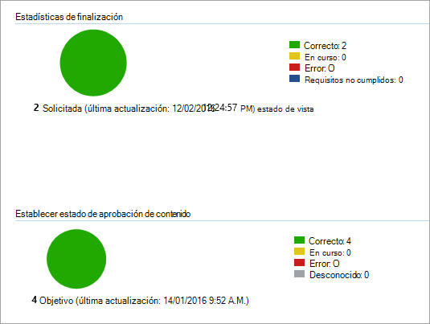

# <a name="onboard-windows-10-devices-using-configuration-manager"></a><span data-ttu-id="6652b-103">Dispositivos incorporados de Windows 10 con Configuration Manager</span><span class="sxs-lookup"><span data-stu-id="6652b-103">Onboard Windows 10 devices using Configuration Manager</span></span>

<span data-ttu-id="6652b-104">**Se aplica a:**</span><span class="sxs-lookup"><span data-stu-id="6652b-104">**Applies to:**</span></span>

- [<span data-ttu-id="6652b-105">Prevención de pérdida de datos (DLP) de Microsoft 365</span><span class="sxs-lookup"><span data-stu-id="6652b-105">Microsoft 365 Endpoint data loss prevention (DLP)</span></span>](/microsoft-365/compliance/endpoint-dlp-learn-about)
- <span data-ttu-id="6652b-106">Administrador de configuración de System Center 2012 R2</span><span class="sxs-lookup"><span data-stu-id="6652b-106">System Center 2012 R2 Configuration Manager</span></span>

### <a name="onboard-devices-using-system-center-configuration-manager"></a><span data-ttu-id="6652b-107">Dispositivos integrados con System Center Configuration Manager</span><span class="sxs-lookup"><span data-stu-id="6652b-107">Onboard devices using System Center Configuration Manager</span></span>

1. <span data-ttu-id="6652b-108">Abra el archivo. zip del paquete de configuración de Configuration Manager ( *DeviceComplianceOnboardingPackage.zip* ) que ha descargado del asistente de incorporación de servicios.</span><span class="sxs-lookup"><span data-stu-id="6652b-108">Open the Configuration Manager configuration package .zip file ( *DeviceComplianceOnboardingPackage.zip* ) that you downloaded from the service onboarding wizard.</span></span> <span data-ttu-id="6652b-109">También puede obtener el paquete del [centro de cumplimiento de Microsoft](https://compliance.microsoft.com/).</span><span class="sxs-lookup"><span data-stu-id="6652b-109">You can also get the package from [Microsoft Compliance center](https://compliance.microsoft.com/).</span></span>

2. <span data-ttu-id="6652b-110">En el panel de navegación, seleccione la incorporación de la incorporación de dispositivos de **configuración**  >  **Device Onboarding**  >  **Onboarding** .</span><span class="sxs-lookup"><span data-stu-id="6652b-110">In the navigation pane, select **Settings** > **Device Onboarding** > **Onboarding** .</span></span>

3. <span data-ttu-id="6652b-111">En el campo **método de implementación** , seleccione **Microsoft Endpoint Configuration Manager 2012/2012 R2/1511/1602** .</span><span class="sxs-lookup"><span data-stu-id="6652b-111">In the **Deployment method** field, select **Microsoft Endpoint Configuration Manager 2012/2012 R2/1511/1602** .</span></span>
 
4. <span data-ttu-id="6652b-112">Seleccione **Descargar paquete** y guarde el archivo. zip.</span><span class="sxs-lookup"><span data-stu-id="6652b-112">Select **Download package** , and save the .zip file.</span></span>

5. <span data-ttu-id="6652b-113">Extraiga el contenido del archivo. zip en una ubicación compartida de solo lectura a la que puedan tener acceso los administradores de red que van a implementar el paquete.</span><span class="sxs-lookup"><span data-stu-id="6652b-113">Extract the contents of the .zip file to a shared, read-only location that can be accessed by the network administrators who will deploy the package.</span></span> <span data-ttu-id="6652b-114">Debe tener un archivo denominado *DeviceComplianceOnboardingScript. cmd* .</span><span class="sxs-lookup"><span data-stu-id="6652b-114">You should have a file named *DeviceComplianceOnboardingScript.cmd* .</span></span>

6. <span data-ttu-id="6652b-115">Implemente el paquete siguiendo los pasos descritos en el artículo [Packages and Programs del System Center 2012 R2 Configuration Manager](https://docs.microsoft.com/previous-versions/system-center/system-center-2012-R2/gg699369\(v=technet.10\)) .</span><span class="sxs-lookup"><span data-stu-id="6652b-115">Deploy the package by following the steps in the [Packages and Programs in System Center 2012 R2 Configuration Manager](https://docs.microsoft.com/previous-versions/system-center/system-center-2012-R2/gg699369\(v=technet.10\)) article.</span></span>

7. <span data-ttu-id="6652b-116">Elija una colección de dispositivos predefinida en la que se va a implementar el paquete.</span><span class="sxs-lookup"><span data-stu-id="6652b-116">Choose a predefined device collection to deploy the package to.</span></span>

> [!NOTE]
> <span data-ttu-id="6652b-117">La prevención de pérdida de datos de extremos de Microsoft 365 no es compatible con la incorporación durante la fase [de la experiencia rápida (OOBE)](https://answers.microsoft.com/en-us/windows/wiki/windows_10/how-to-complete-the-windows-10-out-of-box/47e3f943-f000-45e3-8c5c-9d85a1a0cf87) .</span><span class="sxs-lookup"><span data-stu-id="6652b-117">Microsoft 365 Endpoint data loss prevention doesn't support onboarding during the [Out-Of-Box Experience (OOBE)](https://answers.microsoft.com/en-us/windows/wiki/windows_10/how-to-complete-the-windows-10-out-of-box/47e3f943-f000-45e3-8c5c-9d85a1a0cf87) phase.</span></span> <span data-ttu-id="6652b-118">Asegúrese de que los usuarios completen OOBE después de ejecutar la instalación o actualización de Windows.</span><span class="sxs-lookup"><span data-stu-id="6652b-118">Make sure users complete OOBE after running Windows installation or upgrading.</span></span>

>[!TIP]
> <span data-ttu-id="6652b-119">Después de incorporar el dispositivo, puede elegir ejecutar una prueba de detección para comprobar que un dispositivo se incorpora correctamente al servicio.</span><span class="sxs-lookup"><span data-stu-id="6652b-119">After onboarding the device, you can choose to run a detection test to verify that an device is properly onboarded to the service.</span></span> <span data-ttu-id="6652b-120">Para obtener más información, vea [ejecutar una prueba de detección en un dispositivo ATP de Microsoft defender recién incorporado](https://docs.microsoft.com/windows/security/threat-protection/microsoft-defender-atp/run-detection-test).</span><span class="sxs-lookup"><span data-stu-id="6652b-120">For more information, see [Run a detection test on a newly onboarded Microsoft Defender ATP device](https://docs.microsoft.com/windows/security/threat-protection/microsoft-defender-atp/run-detection-test).</span></span>
>
> <span data-ttu-id="6652b-121">Tenga en cuenta que es posible crear una regla de detección en una aplicación de Configuration Manager para comprobar de forma continua si se ha incorporado un dispositivo.</span><span class="sxs-lookup"><span data-stu-id="6652b-121">Note that it is possible to create a detection rule on a Configuration Manager application to continuously check if a device has been onboarded.</span></span> <span data-ttu-id="6652b-122">Una aplicación es un tipo de objeto diferente que un paquete y un programa.</span><span class="sxs-lookup"><span data-stu-id="6652b-122">An application is a different type of object than a package and program.</span></span>
> <span data-ttu-id="6652b-123">Si aún no se ha incorporado un dispositivo (debido a una finalización de OOBE pendiente o a cualquier otro motivo), el administrador de configuración volverá a intentar incorporar el dispositivo hasta que la regla detecte el cambio de estado.</span><span class="sxs-lookup"><span data-stu-id="6652b-123">If a device is not yet onboarded (due to pending OOBE completion or any other reason), Configuration Manager will retry to onboard the device until the rule detects the status change.</span></span>
> 
> <span data-ttu-id="6652b-124">Este comportamiento se puede lograr creando una regla de detección que compruebe si el valor del registro "OnboardingState" (de tipo REG_DWORD) = 1.</span><span class="sxs-lookup"><span data-stu-id="6652b-124">This behavior can be accomplished by creating a detection rule checking if the "OnboardingState" registry value (of type REG_DWORD) = 1.</span></span>
> <span data-ttu-id="6652b-125">Este valor del registro se encuentra en "HKLM\SOFTWARE\Microsoft\Windows Advanced Threat Protection\Status".</span><span class="sxs-lookup"><span data-stu-id="6652b-125">This registry value is located under "HKLM\SOFTWARE\Microsoft\Windows Advanced Threat Protection\Status".</span></span>
<span data-ttu-id="6652b-126">Para obtener más información, consulte [configurar métodos de detección en System Center 2012 R2 Configuration Manager](https://docs.microsoft.com/previous-versions/system-center/system-center-2012-R2/gg682159\(v=technet.10\)#step-4-configure-detection-methods-to-indicate-the-presence-of-the-deployment-type).</span><span class="sxs-lookup"><span data-stu-id="6652b-126">For more information, see [Configure Detection Methods in System Center 2012 R2 Configuration Manager](https://docs.microsoft.com/previous-versions/system-center/system-center-2012-R2/gg682159\(v=technet.10\)#step-4-configure-detection-methods-to-indicate-the-presence-of-the-deployment-type).</span></span>

### <a name="configure-sample-collection-settings"></a><span data-ttu-id="6652b-127">Configuración de la recopilación de muestras</span><span class="sxs-lookup"><span data-stu-id="6652b-127">Configure sample collection settings</span></span>

<span data-ttu-id="6652b-128">Para cada dispositivo, puede establecer un valor de configuración para que indique si se pueden recopilar muestras del dispositivo cuando se realiza una solicitud a través del centro de seguridad de Microsoft defender para enviar un archivo para un análisis detallado.</span><span class="sxs-lookup"><span data-stu-id="6652b-128">For each device, you can set a configuration value to state whether samples can be collected from the device when a request is made through Microsoft Defender Security Center to submit a file for deep analysis.</span></span>

>[!NOTE]
><span data-ttu-id="6652b-129">Estas opciones de configuración se suelen realizar mediante el administrador de configuración.</span><span class="sxs-lookup"><span data-stu-id="6652b-129">These configuration settings are typically done through Configuration Manager.</span></span> 

<span data-ttu-id="6652b-130">Puede establecer una regla de cumplimiento para el elemento de configuración en Configuration Manager para cambiar la configuración de recurso compartido de muestra en un dispositivo.</span><span class="sxs-lookup"><span data-stu-id="6652b-130">You can set a compliance rule for configuration item in Configuration Manager to change the sample share setting on a device.</span></span>

<span data-ttu-id="6652b-131">Esta regla debe ser un elemento de configuración de la regla de cumplimiento de *corrección* que establece el valor de una clave del registro en los dispositivos de destino para asegurarse de que son quejas.</span><span class="sxs-lookup"><span data-stu-id="6652b-131">This rule should be a *remediating* compliance rule configuration item that sets the value of a registry key on targeted devices to make sure they’re complaint.</span></span>

<span data-ttu-id="6652b-132">La configuración se establece a través de la siguiente entrada de clave del registro:</span><span class="sxs-lookup"><span data-stu-id="6652b-132">The configuration is set through the following registry key entry:</span></span>

```
Path: “HKLM\SOFTWARE\Policies\Microsoft\Windows Advanced Threat Protection”
Name: "AllowSampleCollection"
Value: 0 or 1
```
<span data-ttu-id="6652b-133">Donde:</span><span class="sxs-lookup"><span data-stu-id="6652b-133">Where:</span></span><br>
<span data-ttu-id="6652b-134">El tipo de clave es D-WORD.</span><span class="sxs-lookup"><span data-stu-id="6652b-134">Key type is a D-WORD.</span></span> <br>
<span data-ttu-id="6652b-135">Los valores posibles son:</span><span class="sxs-lookup"><span data-stu-id="6652b-135">Possible values are:</span></span>
- <span data-ttu-id="6652b-136">0: no permite el uso compartido de muestras desde este dispositivo</span><span class="sxs-lookup"><span data-stu-id="6652b-136">0 - doesn't allow sample sharing  from this device</span></span>
- <span data-ttu-id="6652b-137">1-permite el uso compartido de todos los tipos de archivo desde este dispositivo</span><span class="sxs-lookup"><span data-stu-id="6652b-137">1 - allows sharing of all file types from this device</span></span>

<span data-ttu-id="6652b-138">El valor predeterminado en caso de que la clave del registro no exista es 1.</span><span class="sxs-lookup"><span data-stu-id="6652b-138">The default value in case the registry key doesn’t exist is 1.</span></span>

<span data-ttu-id="6652b-139">Para obtener más información acerca del cumplimiento del administrador de configuración de System Center, consulte [Introduction to Compliance Settings in System Center 2012 R2 Configuration Manager](https://docs.microsoft.com/previous-versions/system-center/system-center-2012-R2/gg682139\(v=technet.10\)).</span><span class="sxs-lookup"><span data-stu-id="6652b-139">For more information about System Center Configuration Manager Compliance, see [Introduction to compliance settings in System Center 2012 R2 Configuration Manager](https://docs.microsoft.com/previous-versions/system-center/system-center-2012-R2/gg682139\(v=technet.10\)).</span></span>


## <a name="other-recommended-configuration-settings"></a><span data-ttu-id="6652b-140">Otras opciones de configuración recomendadas</span><span class="sxs-lookup"><span data-stu-id="6652b-140">Other recommended configuration settings</span></span>
<span data-ttu-id="6652b-141">Después de incorporar los dispositivos al servicio, es importante aprovechar las capacidades de protección contra amenazas incluidas al habilitarlos con las siguientes opciones de configuración recomendadas.</span><span class="sxs-lookup"><span data-stu-id="6652b-141">After onboarding devices to the service, it's important to take advantage of the included threat protection capabilities by enabling them with the following recommended configuration settings.</span></span>

### <a name="device-collection-configuration"></a><span data-ttu-id="6652b-142">Configuración de la colección de dispositivos</span><span class="sxs-lookup"><span data-stu-id="6652b-142">Device collection configuration</span></span>
<span data-ttu-id="6652b-143">Si está usando el administrador de configuración de extremo, versión 2002 o posterior, puede optar por ampliar la implementación para que incluya servidores o clientes de nivel inferior.</span><span class="sxs-lookup"><span data-stu-id="6652b-143">If you're using Endpoint Configuration Manager, version 2002 or later, you can choose to broaden the deployment to include servers or down-level clients.</span></span>


### <a name="next-generation-protection-configuration"></a><span data-ttu-id="6652b-144">Configuración de protección de próxima generación</span><span class="sxs-lookup"><span data-stu-id="6652b-144">Next generation protection configuration</span></span>

<span data-ttu-id="6652b-145">Se recomiendan las siguientes opciones de configuración:</span><span class="sxs-lookup"><span data-stu-id="6652b-145">The following configuration settings are recommended:</span></span>

<span data-ttu-id="6652b-146">**Escanear**</span><span class="sxs-lookup"><span data-stu-id="6652b-146">**Scan**</span></span>

- <span data-ttu-id="6652b-147">Examinar dispositivos de almacenamiento extraíbles como unidades USB: sí</span><span class="sxs-lookup"><span data-stu-id="6652b-147">Scan removable storage devices such as USB drives: Yes</span></span>

<span data-ttu-id="6652b-148">**Protección en tiempo real**</span><span class="sxs-lookup"><span data-stu-id="6652b-148">**Real-time Protection**</span></span>

- <span data-ttu-id="6652b-149">Habilitar la supervisión de comportamiento: sí</span><span class="sxs-lookup"><span data-stu-id="6652b-149">Enable Behavioral Monitoring: Yes</span></span>
- <span data-ttu-id="6652b-150">Habilitar la protección contra aplicaciones potencialmente no deseadas durante la descarga y antes de la instalación: sí</span><span class="sxs-lookup"><span data-stu-id="6652b-150">Enable protection against Potentially Unwanted Applications at download and prior to installation: Yes</span></span>

<span data-ttu-id="6652b-151">**Servicio de protección en la nube**</span><span class="sxs-lookup"><span data-stu-id="6652b-151">**Cloud Protection Service**</span></span>

- <span data-ttu-id="6652b-152">Tipo de pertenencia del servicio de protección en la nube: pertenencia avanzada</span><span class="sxs-lookup"><span data-stu-id="6652b-152">Cloud Protection Service membership type: Advanced membership</span></span>

<span data-ttu-id="6652b-153">**Reducción** de la superficie de ataques Configure todas las reglas disponibles para auditar.</span><span class="sxs-lookup"><span data-stu-id="6652b-153">**Attack surface reduction** Configure all available rules to Audit.</span></span>

>[!NOTE]
> <span data-ttu-id="6652b-154">El bloqueo de estas actividades puede interrumpir procesos empresariales legítimos.</span><span class="sxs-lookup"><span data-stu-id="6652b-154">Blocking these activities may interrupt legitimate business processes.</span></span> <span data-ttu-id="6652b-155">El mejor método es configurar todos los usuarios que se van a auditar, identificar cuáles son seguros para activar y, a continuación, habilitar esa configuración en los extremos que no tienen detecciones de falsos positivos.</span><span class="sxs-lookup"><span data-stu-id="6652b-155">The best approach is setting everything to audit, identifying which ones are safe to turn on, and then enabling those settings on endpoints which do not have false positive detections.</span></span>

<span data-ttu-id="6652b-156">**Protección de red**</span><span class="sxs-lookup"><span data-stu-id="6652b-156">**Network protection**</span></span>

<span data-ttu-id="6652b-157">Antes de habilitar la protección de red en el modo de auditoría o bloqueo, asegúrese de que ha instalado la actualización de la plataforma antimalware, que se puede obtener en la [Página de soporte técnico](https://support.microsoft.com/en-us/help/4560203/windows-defender-anti-malware-platform-binaries-are-missing).</span><span class="sxs-lookup"><span data-stu-id="6652b-157">Prior to enabling network protection in audit or block mode, ensure that you've installed the antimalware platform update, which can be obtained from the [support page](https://support.microsoft.com/en-us/help/4560203/windows-defender-anti-malware-platform-binaries-are-missing).</span></span>


<span data-ttu-id="6652b-158">**Acceso controlado a carpetas**</span><span class="sxs-lookup"><span data-stu-id="6652b-158">**Controlled folder access**</span></span>

<span data-ttu-id="6652b-159">Habilite la característica en modo auditoría durante al menos 30 días.</span><span class="sxs-lookup"><span data-stu-id="6652b-159">Enable the feature in audit mode for at least 30 days.</span></span> <span data-ttu-id="6652b-160">Después de este período, revise las detecciones y cree una lista de aplicaciones que puedan escribir en directorios protegidos.</span><span class="sxs-lookup"><span data-stu-id="6652b-160">After this period, review detections and create a list of applications that are allowed to write to protected directories.</span></span>

<span data-ttu-id="6652b-161">Para obtener más información, consulte [evaluar el acceso controlado a carpetas](https://docs.microsoft.com/windows/security/threat-protection/microsoft-defender-atp/evaluate-controlled-folder-access).</span><span class="sxs-lookup"><span data-stu-id="6652b-161">For more information, see [Evaluate controlled folder access](https://docs.microsoft.com/windows/security/threat-protection/microsoft-defender-atp/evaluate-controlled-folder-access).</span></span>


## <a name="offboard-devices-using-configuration-manager"></a><span data-ttu-id="6652b-162">Dispositivos desincorpora con Configuration Manager</span><span class="sxs-lookup"><span data-stu-id="6652b-162">Offboard devices using Configuration Manager</span></span>

<span data-ttu-id="6652b-163">Por motivos de seguridad, el paquete que se usa para desincorpora dispositivos expirará 30 días después de la fecha en que se descargó.</span><span class="sxs-lookup"><span data-stu-id="6652b-163">For security reasons, the package used to Offboard devices will expire 30 days after the date it was downloaded.</span></span> <span data-ttu-id="6652b-164">Los paquetes de retirada expirados enviados a un dispositivo se rechazarán.</span><span class="sxs-lookup"><span data-stu-id="6652b-164">Expired offboarding packages sent to a device will be rejected.</span></span> <span data-ttu-id="6652b-165">Al descargar un paquete de descarga, recibirá una notificación de la fecha de expiración de los paquetes y también se incluirá en el nombre del paquete.</span><span class="sxs-lookup"><span data-stu-id="6652b-165">When downloading an offboarding package, you will be notified of the packages expiry date and it will also be included in the package name.</span></span>

> [!NOTE]
> <span data-ttu-id="6652b-166">Las directivas de incorporación y retirada no deben implementarse en el mismo dispositivo al mismo tiempo, de lo contrario se producirán colisiones impredecibles.</span><span class="sxs-lookup"><span data-stu-id="6652b-166">Onboarding and offboarding policies must not be deployed on the same device at the same time, otherwise this will cause unpredictable collisions.</span></span>

### <a name="offboard-devices-using-microsoft-endpoint-configuration-manager-current-branch"></a><span data-ttu-id="6652b-167">Dispositivos desincorpora que usan la rama actual de Microsoft Endpoint Configuration Manager</span><span class="sxs-lookup"><span data-stu-id="6652b-167">Offboard devices using Microsoft Endpoint Configuration Manager current branch</span></span>

<span data-ttu-id="6652b-168">Si usa la rama actual de Microsoft Endpoint Configuration Manager, consulte [crear un archivo de configuración de retirada](https://docs.microsoft.com/configmgr/protect/deploy-use/windows-defender-advanced-threat-protection#create-an-offboarding-configuration-file).</span><span class="sxs-lookup"><span data-stu-id="6652b-168">If you use Microsoft Endpoint Configuration Manager current branch, see [Create an offboarding configuration file](https://docs.microsoft.com/configmgr/protect/deploy-use/windows-defender-advanced-threat-protection#create-an-offboarding-configuration-file).</span></span>

### <a name="offboard-devices-using-system-center-2012-r2-configuration-manager"></a><span data-ttu-id="6652b-169">Dispositivos desincorpora con System Center 2012 R2 Configuration Manager</span><span class="sxs-lookup"><span data-stu-id="6652b-169">Offboard devices using System Center 2012 R2 Configuration Manager</span></span>

1. <span data-ttu-id="6652b-170">Obtenga el paquete de descarga del [centro de cumplimiento de Microsoft](https://compliance.microsoft.com/):</span><span class="sxs-lookup"><span data-stu-id="6652b-170">Get the offboarding package from [Microsoft Compliance center](https://compliance.microsoft.com/):</span></span>

2. <span data-ttu-id="6652b-171">En el panel de navegación, seleccione **configuración** de la  >   **incorporación de dispositivos** de configuración >  **Offboarding** .</span><span class="sxs-lookup"><span data-stu-id="6652b-171">In the navigation pane, select **Settings** >  **Device onboarding**> **Offboarding** .</span></span>

3. <span data-ttu-id="6652b-172">Seleccione Windows 10 como sistema operativo.</span><span class="sxs-lookup"><span data-stu-id="6652b-172">Select Windows 10 as the operating system.</span></span>

4. <span data-ttu-id="6652b-173">En el campo **método de implementación** , seleccione **Microsoft Endpoint Configuration Manager 2012/2012 R2/1511/1602** .</span><span class="sxs-lookup"><span data-stu-id="6652b-173">In the **Deployment method** field, select **Microsoft Endpoint Configuration Manager 2012/2012 R2/1511/1602** .</span></span>
    
5. <span data-ttu-id="6652b-174">Seleccione **Descargar paquete** y guarde el archivo. zip.</span><span class="sxs-lookup"><span data-stu-id="6652b-174">Select **Download package** , and save the .zip file.</span></span>

6. <span data-ttu-id="6652b-175">Extraiga el contenido del archivo. zip en una ubicación compartida de solo lectura a la que puedan tener acceso los administradores de red que van a implementar el paquete.</span><span class="sxs-lookup"><span data-stu-id="6652b-175">Extract the contents of the .zip file to a shared, read-only location that can be accessed by the network administrators who will deploy the package.</span></span> <span data-ttu-id="6652b-176">Debe tener un archivo denominado *DeviceComplianceOffboardingScript_valid_until_YYYY-mm-dd. cmd* .</span><span class="sxs-lookup"><span data-stu-id="6652b-176">You should have a file named *DeviceComplianceOffboardingScript_valid_until_YYYY-MM-DD.cmd* .</span></span>

7. <span data-ttu-id="6652b-177">Implemente el paquete siguiendo los pasos descritos en el artículo [Packages and Programs del System Center 2012 R2 Configuration Manager](https://docs.microsoft.com/previous-versions/system-center/system-center-2012-R2/gg699369\(v=technet.10\)) .</span><span class="sxs-lookup"><span data-stu-id="6652b-177">Deploy the package by following the steps in the [Packages and Programs in System Center 2012 R2 Configuration Manager](https://docs.microsoft.com/previous-versions/system-center/system-center-2012-R2/gg699369\(v=technet.10\)) article.</span></span>

8. <span data-ttu-id="6652b-178">Elija una colección de dispositivos predefinida en la que se va a implementar el paquete.</span><span class="sxs-lookup"><span data-stu-id="6652b-178">Choose a predefined device collection to deploy the package to.</span></span>

> [!IMPORTANT]
> <span data-ttu-id="6652b-179">La retirada hace que el dispositivo deje de enviar datos del sensor al portal, pero los datos del dispositivo, incluida la referencia a cualquier alerta que haya tenido, se conservará durante un máximo de 6 meses.</span><span class="sxs-lookup"><span data-stu-id="6652b-179">Offboarding causes the device to stop sending sensor data to the portal but data from the device, including reference to any alerts it has had will be retained for up to 6 months.</span></span>


## <a name="monitor-device-configuration"></a><span data-ttu-id="6652b-180">Supervisar la configuración del dispositivo</span><span class="sxs-lookup"><span data-stu-id="6652b-180">Monitor device configuration</span></span>

<span data-ttu-id="6652b-181">Si está usando la rama actual de Microsoft Endpoint Configuration Manager, use el panel de ATP de Microsoft defender integrado en la consola de Configuration Manager.</span><span class="sxs-lookup"><span data-stu-id="6652b-181">If you're using Microsoft Endpoint Configuration Manager current branch, use the built-in Microsoft Defender ATP dashboard in the Configuration Manager console.</span></span> <span data-ttu-id="6652b-182">Para obtener más información, consulte [protección contra amenazas avanzada de Microsoft defender: monitor](https://docs.microsoft.com/configmgr/protect/deploy-use/windows-defender-advanced-threat-protection#monitor).</span><span class="sxs-lookup"><span data-stu-id="6652b-182">For more information, see [Microsoft Defender Advanced Threat Protection - Monitor](https://docs.microsoft.com/configmgr/protect/deploy-use/windows-defender-advanced-threat-protection#monitor).</span></span>

<span data-ttu-id="6652b-183">Si utiliza el administrador de configuración de System Center 2012 R2, la supervisión consta de dos partes:</span><span class="sxs-lookup"><span data-stu-id="6652b-183">If you're using System Center 2012 R2 Configuration Manager, monitoring consists of two parts:</span></span>

1. <span data-ttu-id="6652b-184">Confirmar que el paquete de configuración se ha implementado correctamente y que se está ejecutando (o se ha ejecutado correctamente) en los dispositivos de la red.</span><span class="sxs-lookup"><span data-stu-id="6652b-184">Confirming the configuration package has been correctly deployed and is running (or has successfully run) on the devices in your network.</span></span>

2. <span data-ttu-id="6652b-185">Comprobando que los dispositivos son compatibles con el servicio de prevención de pérdida de datos de extremos de Microsoft 365 (esto garantiza que el dispositivo pueda completar el proceso de incorporación y pueda seguir notificando datos al servicio).</span><span class="sxs-lookup"><span data-stu-id="6652b-185">Checking that the devices are compliant with the Microsoft 365 Endpoint data loss prevention service (this ensures the device can complete the onboarding process and can continue to report data to the service).</span></span>

### <a name="confirm-the-configuration-package-has-been-correctly-deployed"></a><span data-ttu-id="6652b-186">Confirmar que el paquete de configuración se ha implementado correctamente</span><span class="sxs-lookup"><span data-stu-id="6652b-186">Confirm the configuration package has been correctly deployed</span></span>

1. <span data-ttu-id="6652b-187">En la consola de Configuration Manager, haga clic en **supervisión** en la parte inferior del panel de navegación.</span><span class="sxs-lookup"><span data-stu-id="6652b-187">In the Configuration Manager console, click **Monitoring** at the bottom of the navigation pane.</span></span>

2. <span data-ttu-id="6652b-188">Seleccione **información general** y **implementaciones** .</span><span class="sxs-lookup"><span data-stu-id="6652b-188">Select **Overview** and then **Deployments** .</span></span>

3. <span data-ttu-id="6652b-189">Seleccione en la implementación con el nombre del paquete.</span><span class="sxs-lookup"><span data-stu-id="6652b-189">Select on the deployment with the package name.</span></span>

4. <span data-ttu-id="6652b-190">Revise los indicadores de estado en **estadísticas de finalización** y **Estado de contenido** .</span><span class="sxs-lookup"><span data-stu-id="6652b-190">Review the status indicators under **Completion Statistics** and **Content Status** .</span></span>

    <span data-ttu-id="6652b-191">Si hay implementaciones fallidas (dispositivos con **error** , **requisitos no cumplidos** o **Estados erróneos** ), es posible que deba solucionar los problemas de los dispositivos.</span><span class="sxs-lookup"><span data-stu-id="6652b-191">If there are failed deployments (devices with **Error** , **Requirements Not Met** , or **Failed statuses** ), you may need to  troubleshoot the devices.</span></span> <span data-ttu-id="6652b-192">Para obtener más información, vea [solucionar problemas de incorporación de protección contra amenazas avanzada de Microsoft defender](https://docs.microsoft.com/windows/security/threat-protection/microsoft-defender-atp/troubleshoot-onboarding).</span><span class="sxs-lookup"><span data-stu-id="6652b-192">For more information, see, [Troubleshoot Microsoft Defender Advanced Threat Protection onboarding issues](https://docs.microsoft.com/windows/security/threat-protection/microsoft-defender-atp/troubleshoot-onboarding).</span></span>

    

### <a name="check-that-the-devices-are-compliant-with-the-microsoft-365-endpoint-data-loss-prevention-service"></a><span data-ttu-id="6652b-194">Comprobar que los dispositivos son compatibles con el servicio de prevención de pérdida de datos de extremos de Microsoft 365</span><span class="sxs-lookup"><span data-stu-id="6652b-194">Check that the devices are compliant with the Microsoft 365 Endpoint data loss prevention service</span></span>

<span data-ttu-id="6652b-195">Puede establecer una regla de cumplimiento para el elemento de configuración en System Center 2012 R2 Configuration Manager para supervisar la implementación.</span><span class="sxs-lookup"><span data-stu-id="6652b-195">You can set a compliance rule for configuration item in System Center 2012 R2 Configuration Manager to monitor your deployment.</span></span>

> [!NOTE]
> <span data-ttu-id="6652b-196">Este procedimiento y la entrada del registro se aplican al terminal DLP, así como a la protección contra amenazas avanzada.</span><span class="sxs-lookup"><span data-stu-id="6652b-196">This procedure and registry entry applies to Endpoint DLP as well as Advanced Threat Protection.</span></span>

<span data-ttu-id="6652b-197">Esta regla debe ser un elemento de configuración de regla de cumplimiento *no corregido* que supervise el valor de una clave del registro en los dispositivos de destino.</span><span class="sxs-lookup"><span data-stu-id="6652b-197">This rule should be a *non-remediating* compliance rule configuration item that monitors the value of a registry key on targeted devices.</span></span>

<span data-ttu-id="6652b-198">Supervise la siguiente entrada de clave del registro:</span><span class="sxs-lookup"><span data-stu-id="6652b-198">Monitor the following registry key entry:</span></span>
```
Path: “HKLM\SOFTWARE\Microsoft\Windows Advanced Threat Protection\Status”
Name: “OnboardingState”
Value: “1”
```
<span data-ttu-id="6652b-199">Para obtener más información, vea [Introducción a la configuración de cumplimiento en el administrador de configuración de System Center 2012 R2](https://docs.microsoft.com/previous-versions/system-center/system-center-2012-R2/gg682139\(v=technet.10\)).</span><span class="sxs-lookup"><span data-stu-id="6652b-199">For more information, see [Introduction to compliance settings in System Center 2012 R2 Configuration Manager](https://docs.microsoft.com/previous-versions/system-center/system-center-2012-R2/gg682139\(v=technet.10\)).</span></span>

## <a name="related-topics"></a><span data-ttu-id="6652b-200">Temas relacionados</span><span class="sxs-lookup"><span data-stu-id="6652b-200">Related topics</span></span>
- [<span data-ttu-id="6652b-201">Dispositivos de Windows 10 incorporados mediante la Directiva de grupo</span><span class="sxs-lookup"><span data-stu-id="6652b-201">Onboard Windows 10 devices using Group Policy</span></span>](dlp-configure-endpoints-gp.md)
- [<span data-ttu-id="6652b-202">Dispositivos de Windows 10 en placa con herramientas de administración de dispositivos móviles</span><span class="sxs-lookup"><span data-stu-id="6652b-202">Onboard Windows 10 devices using Mobile Device Management tools</span></span>](dlp-configure-endpoints-mdm.md)
- [<span data-ttu-id="6652b-203">Dispositivos de Windows 10 incorporados que usan un script local</span><span class="sxs-lookup"><span data-stu-id="6652b-203">Onboard Windows 10 devices using a local script</span></span>](dlp-configure-endpoints-script.md)
- [<span data-ttu-id="6652b-204">Dispositivos de infraestructura de escritorio virtual (VDI) no persistentes incorporados</span><span class="sxs-lookup"><span data-stu-id="6652b-204">Onboard non-persistent virtual desktop infrastructure (VDI) devices</span></span>](dlp-configure-endpoints-vdi.md)
- [<span data-ttu-id="6652b-205">Ejecutar una prueba de detección en un dispositivo ATP de Microsoft defender recién integrado</span><span class="sxs-lookup"><span data-stu-id="6652b-205">Run a detection test on a newly onboarded Microsoft Defender ATP device</span></span>](https://docs.microsoft.com/windows/security/threat-protection/microsoft-defender-atp/run-detection-test)
- [<span data-ttu-id="6652b-206">Solucionar problemas de incorporación de la protección contra amenazas avanzada de Microsoft defender</span><span class="sxs-lookup"><span data-stu-id="6652b-206">Troubleshoot Microsoft Defender Advanced Threat Protection onboarding issues</span></span>](https://docs.microsoft.com/windows/security/threat-protection/microsoft-defender-atp/troubleshoot-onboarding)
