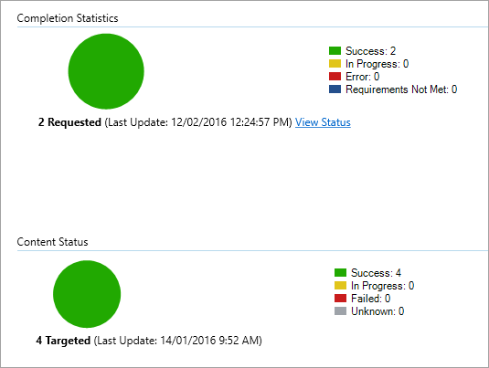

# <a name="onboard-windows-10-devices-using-configuration-manager"></a>Incorporar dispositivos Windows 10 con Configuration Manager

**Se aplica a:**

- [Prevención de pérdida de datos (DLP) de Punto de conexión de Microsoft 365](/microsoft-365/compliance/endpoint-dlp-learn-about)
- Administrador de configuración de System Center 2012 R2

### <a name="onboard-devices-using-system-center-configuration-manager"></a>Incorporar dispositivos con System Center Configuration Manager

1. Abre el archivo .zip del paquete de configuración de Configuration Manager (*DeviceComplianceOnboardingPackage.zip*) que descargaste desde el Asistente para la incorporación de servicios. También puede obtener el paquete del Centro [de cumplimiento de Microsoft.](https://compliance.microsoft.com/)

2. En el panel de navegación, selecciona **Configuración**  >  **de incorporación de**  >  **dispositivos.**

3. En el **campo Método** de implementación, seleccione Microsoft Endpoint Configuration **Manager 2012/2012 R2/1511/1602**.
 
4. Seleccione **Descargar paquete** y guarde el archivo .zip.

5. Extraiga el contenido del archivo .zip en una ubicación compartida de solo lectura a la que puedan acceder los administradores de red que implementarán el paquete. Debe tener un archivo denominado *DeviceComplianceOnboardingScript.cmd*.

6. Implementa el paquete siguiendo los pasos del artículo [Paquetes y programas de System Center 2012 de Configuration Manager R2.](https://docs.microsoft.com/previous-versions/system-center/system-center-2012-R2/gg699369\(v=technet.10\))

7. Elige una colección de dispositivos predefinida en la que implementar el paquete.

> [!NOTE]
> La prevención de pérdida de datos de puntos de conexión de Microsoft 365 no admite la incorporación durante la fase de configuración integrada [(OOBE).](https://answers.microsoft.com/en-us/windows/wiki/windows_10/how-to-complete-the-windows-10-out-of-box/47e3f943-f000-45e3-8c5c-9d85a1a0cf87) Asegúrate de que los usuarios completen la configuración rápida después de ejecutar la instalación o actualización de Windows.

>[!TIP]
> Después de incorporar el dispositivo, puedes ejecutar una prueba de detección para comprobar que un dispositivo está correctamente incorporado al servicio. Para obtener más información, consulta [Ejecutar una prueba de detección en un dispositivo atp](https://docs.microsoft.com/windows/security/threat-protection/microsoft-defender-atp/run-detection-test)de Microsoft Defender recién incorporado.
>
> Ten en cuenta que es posible crear una regla de detección en una aplicación de Configuration Manager para comprobar continuamente si se ha incorporado un dispositivo. Una aplicación es un tipo diferente de objeto que un paquete y un programa.
> Si un dispositivo aún no está incorporado (debido a la finalización OOBE pendiente o a cualquier otro motivo), Configuration Manager volverá a intentar incorporar el dispositivo hasta que la regla detecte el cambio de estado.
> 
> Este comportamiento se puede lograr mediante la creación de una comprobación de regla de detección si el valor del Registro "OnboardingState" (de tipo REG_DWORD) = 1.
> Este valor del Registro se encuentra en "HKLM\SOFTWARE\Microsoft\Windows Advanced Threat Protection\Status".
Para obtener más información, consulta [Configurar métodos de detección System Center 2012 Administrador de configuración de R2.](https://docs.microsoft.com/previous-versions/system-center/system-center-2012-R2/gg682159\(v=technet.10\)#step-4-configure-detection-methods-to-indicate-the-presence-of-the-deployment-type)

### <a name="configure-sample-collection-settings"></a>Configuración de las opciones de la colección de muestras

Para cada dispositivo, puedes establecer un valor de configuración para especificar si se pueden recopilar muestras del dispositivo cuando se realiza una solicitud a través del Centro de seguridad de Microsoft Defender para enviar un archivo para un análisis detallado.

>[!NOTE]
>Estas opciones de configuración se suelen realizar a través de Configuration Manager. 

Puedes establecer una regla de cumplimiento para el elemento de configuración en Configuration Manager para cambiar la configuración del recurso compartido de ejemplo en un dispositivo.

Esta regla debe ser un *elemento* de configuración de regla de cumplimiento correctivo que establece el valor de una clave del Registro en los dispositivos de destino para asegurarse de que son quejas.

La configuración se establece a través de la siguiente entrada de clave del Registro:

```
Path: “HKLM\SOFTWARE\Policies\Microsoft\Windows Advanced Threat Protection”
Name: "AllowSampleCollection"
Value: 0 or 1
```
Donde:<br>
El tipo de clave es D-WORD. <br>
Los valores posibles son:
- 0: no permite el uso compartido de muestras desde este dispositivo
- 1: permite el uso compartido de todos los tipos de archivo desde este dispositivo

El valor predeterminado en caso de que la clave del Registro no exista es 1.

Para obtener más información sobre el cumplimiento de System Center Configuration Manager, consulta Introducción a la configuración de cumplimiento [en System Center 2012 R2 Configuration Manager.](https://docs.microsoft.com/previous-versions/system-center/system-center-2012-R2/gg682139\(v=technet.10\))


## <a name="other-recommended-configuration-settings"></a>Otras opciones de configuración recomendadas
Después de incorporar dispositivos al servicio, es importante aprovechar las capacidades de protección contra amenazas incluidas al habilitarlos con las siguientes opciones de configuración recomendadas.

### <a name="device-collection-configuration"></a>Configuración de recopilación de dispositivos
Si usa Endpoint Configuration Manager, versión 2002 o posterior, puede ampliar la implementación para incluir servidores o clientes de nivel inferior.


### <a name="next-generation-protection-configuration"></a>Configuración de protección de próxima generación

Se recomiendan las siguientes opciones de configuración:

**Escanear**

- Examinar dispositivos de almacenamiento extraíbles como unidades USB: Sí

**Protección en tiempo real**

- Habilitar supervisión de comportamiento: Sí
- Habilitar la protección contra aplicaciones potencialmente no deseadas durante la descarga y antes de la instalación: Sí

**Servicio de protección en la nube**

- Tipo de pertenencia al Servicio de protección en la nube: pertenencia avanzada

**Reducción de superficie de ataque** Configure todas las reglas disponibles para auditar.

>[!NOTE]
> El bloqueo de estas actividades puede interrumpir procesos empresariales legítimos. El mejor enfoque es establecer todo para auditar, identificar cuáles son seguros de activar y, a continuación, habilitar esa configuración en los puntos de conexión que no tienen detecciones de falsos positivos.

**Protección de red**

Antes de habilitar la protección de red en modo de auditoría o bloqueo, asegúrese de que ha instalado la actualización de la plataforma antimalware, que se puede obtener desde la página [de soporte técnico.](https://support.microsoft.com/en-us/help/4560203/windows-defender-anti-malware-platform-binaries-are-missing)


**Acceso controlado a carpetas**

Habilita la característica en modo auditoría durante al menos 30 días. Después de este período, revisa las detecciones y crea una lista de aplicaciones que pueden escribir en directorios protegidos.

Para obtener más información, vea [Evaluar acceso controlado a carpetas.](https://docs.microsoft.com/windows/security/threat-protection/microsoft-defender-atp/evaluate-controlled-folder-access)


## <a name="offboard-devices-using-configuration-manager"></a>Quitar dispositivos con Configuration Manager

Por motivos de seguridad, el paquete usado para los dispositivos de descarga expirará 30 días después de la fecha en que se descargó. Se rechazarán los paquetes de baja expirados enviados a un dispositivo. Al descargar un paquete de descarga, se te notificará la fecha de expiración de los paquetes y también se incluirá en el nombre del paquete.

> [!NOTE]
> Las directivas de incorporación y baja no deben implementarse en el mismo dispositivo al mismo tiempo, de lo contrario se provocarán colisiones impredecibles.

### <a name="offboard-devices-using-microsoft-endpoint-configuration-manager-current-branch"></a>Quitar dispositivos con la rama actual de Microsoft Endpoint Configuration Manager

Si usas la rama actual de Microsoft Endpoint Configuration Manager, consulta Crear un archivo de configuración [de descarga.](https://docs.microsoft.com/configmgr/protect/deploy-use/windows-defender-advanced-threat-protection#create-an-offboarding-configuration-file)

### <a name="offboard-devices-using-system-center-2012-r2-configuration-manager"></a>Quitar dispositivos con System Center 2012 Administrador de configuración de R2

1. Obtenga el paquete de descarga del Centro [de cumplimiento de Microsoft:](https://compliance.microsoft.com/)

2. En el panel de navegación, selecciona **Configuración**  >   **de la incorporación de dispositivos.** >  

3. Selecciona Windows 10 como sistema operativo.

4. En el **campo Método** de implementación, seleccione Microsoft Endpoint Configuration **Manager 2012/2012 R2/1511/1602**.
    
5. Seleccione **Descargar paquete** y guarde el archivo .zip.

6. Extraiga el contenido del archivo .zip en una ubicación compartida de solo lectura a la que puedan acceder los administradores de red que implementarán el paquete. Debe tener un archivo denominado *DeviceComplianceOffboardingScript_valid_until_YYYY-MM-DD.cmd*.

7. Implementa el paquete siguiendo los pasos del artículo [Paquetes y programas de System Center 2012 de Configuration Manager R2.](https://docs.microsoft.com/previous-versions/system-center/system-center-2012-R2/gg699369\(v=technet.10\))

8. Elige una colección de dispositivos predefinida en la que implementar el paquete.

> [!IMPORTANT]
> La baja hace que el dispositivo deje de enviar datos del sensor al portal, pero los datos del dispositivo, incluida la referencia a las alertas que ha tenido, se conservarán durante un máximo de 6 meses.


## <a name="monitor-device-configuration"></a>Supervisar la configuración de dispositivos

Si usas la rama actual de Microsoft Endpoint Configuration Manager, usa el panel integrado de ATP de Microsoft Defender en la consola de Configuration Manager. Para obtener más información, vea [Protección contra amenazas avanzada de Microsoft Defender: Supervisar.](https://docs.microsoft.com/configmgr/protect/deploy-use/windows-defender-advanced-threat-protection#monitor)

Si usas el administrador de configuración System Center 2012 R2, la supervisión consta de dos partes:

1. Confirmar que el paquete de configuración se ha implementado correctamente y se está ejecutando (o se ha ejecutado correctamente) en los dispositivos de la red.

2. Comprobar que los dispositivos cumplen con el servicio de prevención de pérdida de datos del punto de conexión de Microsoft 365 (esto garantiza que el dispositivo pueda completar el proceso de incorporación y pueda seguir informando de los datos al servicio).

### <a name="confirm-the-configuration-package-has-been-correctly-deployed"></a>Confirmar que el paquete de configuración se ha implementado correctamente

1. En la consola de Configuration Manager, haga clic en **Supervisión** en la parte inferior del panel de navegación.

2. Seleccione **Información general** y, a continuación, **Implementaciones.**

3. Selecciona la implementación con el nombre del paquete.

4. Revise los indicadores de estado en **Estadísticas de finalización** y **Estado del contenido.**

    Si hay implementaciones con errores (dispositivos con **errores,** requisitos no cumplidos o estados con **errores),** es posible que deba solucionar los problemas de los dispositivos. Para obtener más información, consulte Solucionar problemas de incorporación de Protección contra amenazas avanzada [de Microsoft Defender.](https://docs.microsoft.com/windows/security/threat-protection/microsoft-defender-atp/troubleshoot-onboarding)

    

### <a name="check-that-the-devices-are-compliant-with-the-microsoft-365-endpoint-data-loss-prevention-service"></a>Comprobar que los dispositivos cumplen con el servicio de prevención de pérdida de datos del punto de conexión de Microsoft 365

Puedes establecer una regla de cumplimiento para el elemento de configuración en System Center 2012 Administrador de configuración R2 para supervisar la implementación.

> [!NOTE]
> Este procedimiento y la entrada del Registro se aplican a DLP de Punto de conexión, así como a la Protección contra amenazas avanzada.

Esta regla debe ser un elemento *de configuración de* regla de cumplimiento no correctivo que supervisa el valor de una clave del Registro en los dispositivos de destino.

Supervise la siguiente entrada de clave del Registro:
```
Path: “HKLM\SOFTWARE\Microsoft\Windows Advanced Threat Protection\Status”
Name: “OnboardingState”
Value: “1”
```
Para obtener más información, consulta [Introducción a la configuración de cumplimiento en System Center 2012 Administrador de configuración de R2.](https://docs.microsoft.com/previous-versions/system-center/system-center-2012-R2/gg682139\(v=technet.10\))

## <a name="related-topics"></a>Temas relacionados
- [Incorporar dispositivos Windows 10 mediante la directiva de grupo](dlp-configure-endpoints-gp.md)
- [Incorporar dispositivos Windows 10 con herramientas de Administración de dispositivos móviles](dlp-configure-endpoints-mdm.md)
- [Incorporar dispositivos Windows 10 mediante un script local](dlp-configure-endpoints-script.md)
- [Incorporar dispositivos de infraestructura de escritorio virtual (VDI) no persistente](dlp-configure-endpoints-vdi.md)
- [Ejecutar una prueba de detección en un dispositivo atp de Microsoft Defender recién incorporado](https://docs.microsoft.com/windows/security/threat-protection/microsoft-defender-atp/run-detection-test)
- [Solucionar problemas de incorporación de Protección contra amenazas avanzada de Microsoft Defender](https://docs.microsoft.com/windows/security/threat-protection/microsoft-defender-atp/troubleshoot-onboarding)
