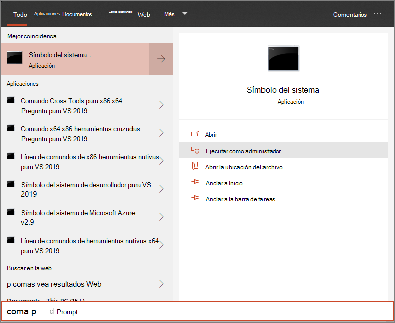

# Incorporar dispositivos Windows 10 mediante un script local

**Se aplica a:**

- [Microsoft 365 Prevención de pérdida de datos de extremo (DLP)](./endpoint-dlp-learn-about.md)

También puede incorporar manualmente dispositivos individuales para Microsoft 365 prevención de pérdida de datos de punto de conexión. Es posible que quieras hacerlo primero al probar el servicio antes de comprometerte a incorporar todos los dispositivos de la red.

> [!IMPORTANT]
> Este script se ha optimizado para su uso en hasta 10 dispositivos.
>
> Para implementar a escala, use [otras opciones de implementación.](dlp-configure-endpoints.md) Por ejemplo, puede implementar un script de incorporación en más de 10 dispositivos en producción con el script disponible en [Onboard Windows 10 devices using Group Policy](dlp-configure-endpoints-gp.md).

## Incorporar dispositivos
 
1.  Abra el archivo de configuración .zip GP (*DeviceComplianceOnboardingPackage.zip*) que descargó del asistente para incorporación de servicios. También puede obtener el paquete desde el [Centro de cumplimiento de Microsoft](https://compliance.microsoft.com)

2. En el panel de navegación, **seleccione Configuración** Incorporación  >  **de dispositivos**.

3. En el **campo Método de** implementación, seleccione Script **local**.

4. Haga **clic en Descargar paquete** y guarde el .zip archivo.
  
5. Extrae el contenido del paquete de configuración en una ubicación en el dispositivo que quieras incorporar (por ejemplo, el escritorio). Debe tener un archivo denominado *DeviceOnboardingScript.cmd*.

6.  Abra un símbolo del sistema con privilegios elevados en el dispositivo y ejecute el script:

7.  Vaya a **Inicio** y escriba **cmd**.

8.  Haga clic derecho en **Símbolo del sistema** y seleccione **Ejecutar como administrador**.

    

9.  Escriba la ubicación del archivo de script. Si copió el archivo en el escritorio, escriba: *%userprofile%\Desktop\WindowsDefenderATPOnboardingScript.cmd*

10.  Presione la **tecla Entrar** o haga clic en **Aceptar**.

Para obtener información sobre cómo validar manualmente que el dispositivo es compatible e informa correctamente de los datos del sensor, [consulte Troubleshoot Protección contra amenazas avanzada de Microsoft Defender onboarding issues](/windows/security/threat-protection/microsoft-defender-atp/troubleshoot-onboarding).

## Dispositivos offboard con un script local
Por motivos de seguridad, el paquete usado para dispositivos offboard expirará 30 días después de la fecha en que se descargó. Se rechazarán los paquetes de offboarding expirados enviados a un dispositivo. Al descargar un paquete de offboarding, se le notificará la fecha de expiración de los paquetes y también se incluirá en el nombre del paquete.

> [!NOTE]
> Las directivas de incorporación y de incorporación no deben implementarse en el mismo dispositivo al mismo tiempo, de lo contrario esto provocará colisiones impredecibles.

1. Obtener el paquete de offboarding desde el [Centro de cumplimiento de Microsoft](https://compliance.microsoft.com)

2. En el panel de navegación, **seleccione Configuración**  >  **Desaborde dispositivo**.

3. En el **campo Método de** implementación, seleccione Script **local**.

4. Haga **clic en Descargar paquete** y guarde el .zip archivo.

5. Extraiga el contenido del archivo .zip a una ubicación compartida de solo lectura a la que puedan tener acceso los dispositivos. Debe tener un archivo denominado *DeviceComplianceOffboardingScript_valid_until_YYYY-MM-DD.cmd*.

6.  Abra un símbolo del sistema con privilegios elevados en el dispositivo y ejecute el script:

7.  Vaya a **Inicio** y escriba **cmd**.

8.  Haga clic derecho en **Símbolo del sistema** y seleccione **Ejecutar como administrador**.

    

9.  Escriba la ubicación del archivo de script. Si copió el archivo en el escritorio, escriba: *%userprofile%\Desktop\WindowsDefenderATPOffboardingScript_valid_until_YYYY-MM-DD.cmd*

10.  Presione la **tecla Entrar** o haga clic en **Aceptar**.

> [!IMPORTANT]
> El offboarding hace que el dispositivo deje de enviar datos del sensor al portal.

## Supervisar la configuración del dispositivo
Puede seguir los distintos pasos de comprobación de [Solucionar problemas de incorporación](/windows/security/threat-protection/microsoft-defender-atp/troubleshoot-onboarding) para comprobar que el script se completó correctamente y que el agente se está ejecutando.

La supervisión también se puede realizar directamente en el portal o mediante las distintas herramientas de implementación.

### Supervisar dispositivos con el portal
1. Vaya a [Microsoft 365 Centro de cumplimiento](https://compliance.microsoft.com).

2. Elija **Configuración**  >  **Dispositivos de incorporación de**  >  **dispositivos**.

3. Compruebe que aparecen dispositivos.

## Temas relacionados
- [Incorporación Windows 10 dispositivos con directiva de grupo](dlp-configure-endpoints-gp.md)
- [Incorporar Windows 10 dispositivos con Microsoft Endpoint Configuration Manager](dlp-configure-endpoints-sccm.md)
- [Incorporar dispositivos Windows 10 con herramientas de Administración de dispositivos móviles](dlp-configure-endpoints-mdm.md)
- [Incorporar dispositivos de infraestructura de escritorio virtual (VDI) no persistente](dlp-configure-endpoints-vdi.md)
- [Ejecutar una prueba de detección en un dispositivo de Microsoft Defender para endpoint recién incorporado](/windows/security/threat-protection/microsoft-defender-atp/run-detection-test)
- [Solucionar Protección contra amenazas avanzada de Microsoft Defender problemas de incorporación](/windows/security/threat-protection/microsoft-defender-atp/troubleshoot-onboarding)