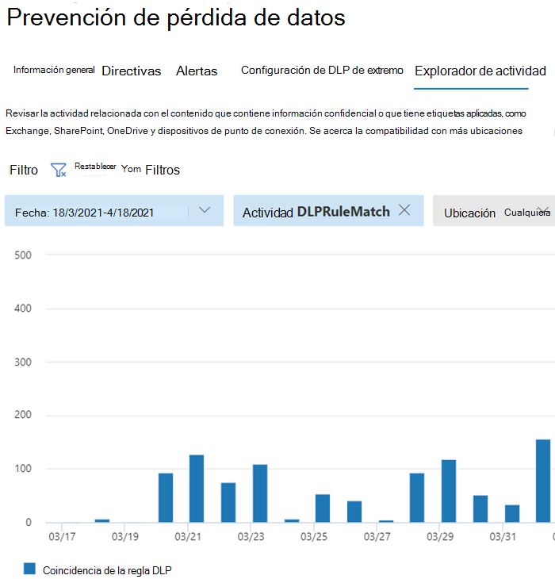

# Obtenga más información acerca de la prevención contra la pérdida de datos

Las organizaciones tienen información confidencial bajo su control, como datos financieros, datos de propiedad, números de tarjetas de crédito, registros de salud o números de seguridad social. Para ayudar a proteger estos datos confidenciales y reducir el riesgo, necesitan una forma de impedir que sus usuarios los compartan de forma inapropiada con personas que no deberían tenerlos. Esta práctica se denomina prevención de pérdida de datos (DLP).

En Microsoft 365, implemente la prevención de pérdida de datos definiendo y aplicando directivas DLP. Con una directiva DLP, puede identificar, supervisar y proteger automáticamente elementos confidenciales en:

- Microsoft 365 servicios como Teams, Exchange, SharePoint y OneDrive
- Office aplicaciones como Word, Excel y PowerPoint
- Windows 10 de conexión
- aplicaciones en la nube que no son de Microsoft
- recursos compartidos de archivos locales y recursos SharePoint.

Microsoft 365 detecta elementos confidenciales mediante el análisis de contenido profundo, no solo mediante un simple examen de texto. El contenido se analiza para las coincidencias de datos principales con las palabras clave, la evaluación de expresiones regulares, la validación de funciones internas y las coincidencias de datos secundarias que están cerca de la coincidencia de datos principal. Además, DLP también usa algoritmos de aprendizaje automático y otros métodos para detectar contenido que coincida con las directivas DLP.
  
## DLP es parte de la oferta de cumplimiento Microsoft 365 mayor

Microsoft 365 DLP es solo una de las Microsoft 365 de cumplimiento que usará para ayudar a proteger los elementos confidenciales dondequiera que vivan o viajen. Debe comprender las otras herramientas del conjunto Microsoft 365 herramientas de cumplimiento, cómo se interrelacionan y funcionan mejor juntos.  Vea, [Microsoft 365 de cumplimiento normativo para](protect-information.md) obtener más información sobre el proceso de protección de la información.

## Acciones de protección de directivas DLP

Microsoft 365 Las directivas DLP son cómo supervisar las actividades que los usuarios llevan a cabo en los elementos confidenciales en reposo, los elementos confidenciales en tránsito o los elementos confidenciales en uso y realizar acciones de protección. Por ejemplo, cuando un usuario intenta realizar una acción prohibida, como copiar un elemento confidencial en una ubicación no aprobada o compartir información médica en un correo electrónico u otras condiciones establecidas en una directiva, DLP puede:

- mostrar una sugerencia de directiva emergente al usuario que le advierte de que puede que esté intentando compartir un elemento confidencial de forma inadecuada
- bloquear el uso compartido y, a través de una sugerencia de directiva, permitir al usuario invalidar el bloque y capturar la justificación de los usuarios
- bloquear el uso compartido sin la opción invalidar
- para los datos en reposo, los elementos confidenciales se pueden bloquear y mover a una ubicación de cuarentena segura
- para Teams chat, la información confidencial no se mostrará

Todas las actividades supervisadas por DLP se registran en [el registro](search-the-audit-log-in-security-and-compliance.md) Microsoft 365 auditoría de forma predeterminada y se enrutan al Explorador [de actividades.](data-classification-activity-explorer.md) Cuando un usuario realiza una acción que cumple los criterios de una directiva DLP y tiene las alertas configuradas, DLP proporciona alertas en el panel de administración de alertas [dlp](dlp-configure-view-alerts-policies.md).

## Ciclo de vida de DLP

Normalmente, una implementación dlp sigue estas fases principales.

- [Planeación de DLP](#plan-for-dlp)
- [Prepararse para DLP](#prepare-for-dlp)
- [Implementar las directivas en producción](#deploy-your-policies-in-production)

<!--ADD DIAGRAM OF THE DLP LIFECYCLE WORK ON WITH MAS-->

### Planeación de DLP

Microsoft 365 La supervisión y protección dlp son nativas de las aplicaciones que los usuarios usan todos los días. Esto ayuda a proteger los elementos confidenciales de las organizaciones de actividades arriesgadas, incluso si los usuarios no están acostumbrados a las prácticas y el pensamiento de prevención de pérdida de datos. Si su organización y sus usuarios son nuevos en las prácticas de prevención de pérdida de datos, la adopción de DLP puede requerir un cambio en los procesos empresariales y habrá un cambio de cultura para los usuarios. Sin embargo, con una planeación, prueba y ajuste adecuados, las directivas DLP protegerán los elementos confidenciales al tiempo que minimizarán las posibles interrupciones de los procesos empresariales.

**Planeación de tecnología para DLP**

Tenga en cuenta que DLP como tecnología puede supervisar y proteger los datos en reposo, los datos en uso y los datos en movimiento en los servicios de Microsoft 365, dispositivos Windows 10, recursos compartidos de archivos locales y SharePoint. Hay implicaciones de planeación para las distintas ubicaciones, el tipo de datos que desea supervisar y proteger, y las acciones que se deben realizar cuando se produce una coincidencia de directiva.  

**Planeación de procesos empresariales para DLP**

Las directivas DLP pueden bloquear actividades prohibidas, como el uso compartido inadecuado de información confidencial por correo electrónico. A medida que planee las directivas DLP, debe identificar los procesos empresariales que tocan los elementos confidenciales. Los propietarios del proceso de negocio pueden ayudarle a identificar comportamientos de usuario adecuados que deben permitirse y comportamientos de usuario inadecuados que deben protegerse. Debes planear las directivas e implementarlas en modo  de prueba, y evaluar su impacto a través del explorador de actividades primero, antes de aplicarlas en modos más restrictivos.

**Planeación de la cultura organizativa para DLP**

Una implementación de DLP correcta depende tanto de que los usuarios se entrenan y se aclimatan a las prácticas de prevención de pérdida de datos como en las directivas bien planeadas y ajustadas. Dado que los usuarios están muy implicados, asegúrese de planear también la formación para ellos. Puedes usar estratégicamente sugerencias de directiva para concienciar a los usuarios antes de cambiar la aplicación de directivas del modo de prueba a modos más restrictivos.

<!--For more information on planning for DLP, including suggestions for deployment based on your needs and resources, see [Planning for Microsoft 365 data loss prevention](dlp-plan-for-dlp.md).-->

### Prepararse para DLP

Puede aplicar directivas DLP a datos en reposo, datos en uso y datos en movimiento en ubicaciones, como:

- Exchange Online correo electrónico
- Sitios de SharePoint Online
- Cuentas de OneDrive
- Mensajes de canales y chats de Teams
- Microsoft Cloud App Security
- Dispositivos Windows 10
- Repositorios locales

Cada uno tiene requisitos previos diferentes. Los elementos confidenciales de algunas ubicaciones, como Exchange en línea, se pueden traer bajo el paraguas DLP simplemente configurando una directiva que se aplique a ellos. Otros, como los repositorios de archivos locales, requieren una implementación del escáner de Azure Information Protection (AIP). Deberá preparar el entorno, redactar directivas de código y probarlas exhaustivamente antes de activar cualquier acción de bloqueo.

### Implementar las directivas en producción

#### Diseñar directivas

Empiece por definir los objetivos de control y cómo se aplican en cada carga de trabajo respectiva. Redacte una directiva que encarne sus objetivos. No dude en empezar con una carga de trabajo a la vez, o en todas las cargas de trabajo: todavía no hay ningún impacto.

#### Implementar directiva en modo de prueba

Evalúe el impacto de los controles implementándolos con una directiva DLP en modo de prueba. Está bien aplicar la directiva a todas las cargas de trabajo en modo de prueba, de modo que pueda obtener toda la amplitud de resultados, pero puede empezar con una carga de trabajo si es necesario.

#### Supervisar resultados y ajustar la directiva

Mientras esté en modo de prueba, supervise los resultados de la directiva y afinala para que cumpla los objetivos de control, al tiempo que garantiza que no afecta negativa o involuntariamente a los flujos de trabajo y la productividad de los usuarios válidos. Estos son algunos ejemplos de cosas que se pueden ajustar:

- ajustar las ubicaciones y las personas/lugares que están dentro o fuera del ámbito
- ajustar las condiciones y excepciones que se usan para determinar si un elemento y lo que se está haciendo con él coincide con la directiva
- la definición/s de información confidencial
- las acciones
- el nivel de restricciones
- agregar nuevos controles
- agregar personas nuevas
- agregar nuevas aplicaciones restringidas
- agregar nuevos sitios restringidos

#### Habilitar el control y ajustar las directivas

Una vez que la directiva cumpla todos los objetivos, encándala. Siga supervisando los resultados de la aplicación de directiva y ajuste según sea necesario. En general, las directivas tienen efecto aproximadamente una hora después de estar activadas. <!--Ver, tema LINK TO para SLA para obtener detalles específicos de la ubicación: >

## Introducción a la configuración de directivas DLP

Tiene flexibilidad en la forma de crear y configurar las directivas DLP. Puede empezar desde una plantilla predefinida y crear una directiva con solo unos clics o puede diseñar la suya propia desde cero. Independientemente de lo que elija, todas las directivas DLP requieren la misma información.

1. **Elija lo que desea supervisar:** Microsoft 365 incluye muchas plantillas de directiva predefinidas para ayudarle a empezar o puede crear una directiva personalizada.
    - Plantilla de directiva predefinida: datos financieros, datos médicos y de salud, datos de privacidad para varios países y regiones.
    - Una directiva personalizada que usa los tipos de información confidencial disponibles, las etiquetas de retención y las etiquetas de confidencialidad.
2. **Elija dónde desea supervisar:** elija una o varias ubicaciones que desea que DLP supervise para obtener información confidencial. Puede supervisar:
    
ubicación | incluir/excluir por|
|---------|---------|
|Correo electrónico de Exchange| grupos de distribución|
|Sitios de SharePoint |sitios |
|Cuentas de OneDrive |cuentas o grupos de distribución |
|Mensajes de canales y chats de Teams |cuentas |
|Dispositivos Windows 10 |usuario o grupo |
|Microsoft Cloud App Security |instancia |
|Repositorios locales| Ruta de acceso de archivo de repositorio|

3. **Elija las condiciones que deben coincidir para** que una directiva se aplique a un elemento: puede aceptar condiciones preconfiguradas o definir condiciones personalizadas. Por ejemplo:

- item contiene un tipo especificado de información confidencial que se está utilizando en un contexto determinado. Por ejemplo, 95 números de seguridad social que se enviarán por correo electrónico al destinatario fuera de la organización.
- elemento tiene una etiqueta de confidencialidad especificada
- elemento con información confidencial se comparte interna o externamente

4. **Elija la acción que se debe realizar cuando se cumplen** las condiciones de la directiva: las acciones dependen de la ubicación donde se esté produciendo la actividad.  Por ejemplo:

- SharePoint/Exchange/OneDrive: bloquear a las personas que están fuera del formulario de la organización acceder al contenido. Muestre al usuario una sugerencia y envíele una notificación por correo electrónico en la que se le envíe una notificación de que está tomando una acción que está prohibida por la directiva DLP.
- Teams Chat y canal: impedir que se comparta información confidencial en el chat o canal
- Windows 10 Dispositivos: auditar o restringir la copia de un elemento confidencial en un dispositivo USB extraíble 
- Office Aplicaciones: muestra un elemento emergente que notifica al usuario que está participando en un comportamiento arriesgado y bloquea o bloquea, pero permite la invalidación.
- Recursos compartidos de archivos locales: mueva el archivo desde donde se almacena a una carpeta de cuarentena

> [!NOTE]
> Las condiciones y las acciones que se van a realizar se definen en un objeto denominado Rule.

<!--## Create a DLP policy

All DLP policies are created and maintained in the Microsoft 365 Compliance center. See, INSERT LINK TO ARTICLE THAT WILL START WALKING THEM THROUGH THE POLICY CREATION PROCEDURES for more information.-->

Después de crear una directiva DLP en el Centro de cumplimiento, se almacena en un almacén de directivas central y, a continuación, se sincroniza con los distintos orígenes de contenido, incluidos:
  
- Exchange Online y de ahí a Outlook en la web y Outlook.
- Sitios de OneDrive para la Empresa
- Sitios de SharePoint Online.
- Programas de escritorio de Office (Excel, PowerPoint y Word).
- Mensajes de conversaciones y canales de Microsoft Teams.
    
Después de que la directiva se sincroniza en las ubicaciones adecuadas, empieza a evaluar el contenido y a aplicar las acciones.

## Visualización de los resultados de la aplicación de directiva

DLP informa de una gran cantidad de información en Microsoft 365 de supervisión, coincidencias y acciones de directivas y actividades de usuario. Tendrás que consumir y actuar sobre esa información para ajustar las directivas y las acciones de ajuste realizadas en elementos confidenciales. La telemetría entra primero en [el centro de Microsoft 365 registros](search-the-audit-log-in-security-and-compliance.md#search-the-audit-log-in-the-compliance-center) de auditoría del centro de cumplimiento, se procesa y se abre paso a distintas herramientas de informes. Cada herramienta de informes tiene un propósito diferente.  

### Panel de alertas DLP

Cuando DLP realiza una acción en un elemento confidencial, puede recibir una notificación de esa acción a través de una alerta configurable. En lugar de que estas alertas se apilen en un buzón de correo para que las haga, el Centro de cumplimiento las pone a disposición en el Panel de administración de alertas [DLP.](dlp-configure-view-alerts-policies.md) Use el panel de alertas DLP para configurar alertas, revisarlas, analizarlas y realizar un seguimiento de la resolución de alertas DLP. Este es un ejemplo de alertas generadas por coincidencias de directiva y actividades desde Windows 10 dispositivos.

> [!div class="mx-imgBorder"]
> 

También puede ver los detalles del evento asociado con metadatos enriquecidos en el mismo panel

> [!div class="mx-imgBorder"]
> 

### Informes

Los [informes DLP](view-the-dlp-reports.md#view-the-reports-for-data-loss-prevention) muestran tendencias generales con el tiempo y proporcionan información específica sobre:

- **Coincidencias de directiva DLP** con el tiempo y filtro por intervalo de fechas, ubicación, directiva o acción
- **Las coincidencias de incidentes dlp** también muestran coincidencias con el tiempo, pero pivotan en los elementos en lugar de las reglas de directiva.
- **Los falsos positivos e** invalidaciones dlp muestran el recuento de falsos positivos y, si están configurados, invalidaciones de usuario junto con la justificación del usuario.

### Explorador de actividad DLP

La pestaña Explorador de actividades de la página DLP tiene el filtro *De* actividad preestablecido en *DLPRuleMatch*. Use esta herramienta para revisar la actividad relacionada con el contenido que contiene información confidencial o que tiene etiquetas aplicadas, como qué etiquetas se cambiaron, los archivos se modificaron y coincidieron con una regla.

Para obtener más información, vea [Introducción al explorador de actividades](data-classification-activity-explorer.md)

Para obtener más información sobre Microsoft 365 DLP, vea:

- [Obtenga más información sobre la prevención de pérdida de datos de Microsoft 365 de punto de conexión](endpoint-dlp-learn-about.md)
- [Obtenga información sobre la directiva de prevención de pérdida de datos predeterminada en Microsoft Teams (versión preliminar)](dlp-teams-default-policy.md)
- [Obtenga más información sobre el examinador de prevención de pérdida de datos locales de Microsoft 365 (versión preliminar)](dlp-on-premises-scanner-learn.md)
- [Obtenga información sobre la extensión de cumplimiento de Microsoft (versión preliminar)](dlp-chrome-learn-about.md)
- [Obtenga información sobre el panel de alertas de prevención de pérdida de datos](dlp-alerts-dashboard-learn.md)