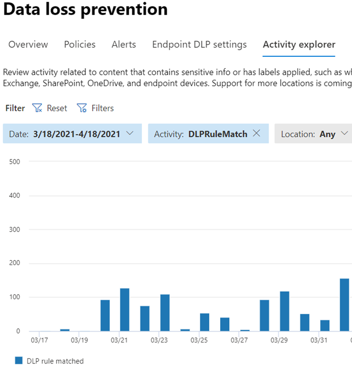

# Obtenga más información acerca de la prevención contra la pérdida de datos

[!include[Purview banner](../includes/purview-rebrand-banner.md)]

Las organizaciones tienen información confidencial bajo su control, como datos financieros, datos propietarios, números de tarjetas de crédito, registros de salud o números de seguridad social. Para poder proteger estos datos confidenciales y reducir el riesgo, necesitan una manera de evitar que sus usuarios los compartan inapropiadamente con personas que no deberían tenerlos. Esta práctica se denomina prevención de pérdida de datos.

En Microsoft Purview, se implementa la prevención de pérdida de datos mediante la definición y aplicación de directivas DLP. Con una directiva DLP, puede identificar, supervisar y proteger automáticamente elementos confidenciales en:

- Microsoft 365 servicios como Teams, Exchange, SharePoint y OneDrive
- Office aplicaciones como Word, Excel y PowerPoint
- puntos de conexión Windows 10, Windows 11 y macOS (Catalina 10.15 y versiones posteriores)
- aplicaciones en la nube que no son de Microsoft
- recursos compartidos de archivos locales y SharePoint locales.

DLP detecta elementos confidenciales mediante el análisis de contenido profundo, no solo mediante un simple examen de texto. El contenido se analiza para buscar coincidencias de datos principales con palabras clave, mediante la evaluación de expresiones regulares, mediante la validación de funciones internas y las coincidencias de datos secundarios que están cerca de la coincidencia de datos principal. Además, DLP también usa algoritmos de aprendizaje automático y otros métodos para detectar contenido que coincida con las directivas DLP.

## DLP forma parte de la oferta de Microsoft Purview más grande

DLP es solo una de las herramientas de Microsoft Purview que usará para ayudar a proteger los elementos confidenciales dondequiera que vivan o viajen. Debe comprender las demás herramientas del conjunto de herramientas de Microsoft Purview, cómo se interrelacionan y funcionan mejor juntos.  Consulte[, Microsoft Purview herramientas](protect-information.md) para obtener más información sobre el proceso de protección de la información.

## Acciones de protección de las directivas DLP

Las directivas DLP son la forma de supervisar las actividades que los usuarios realizan en los elementos confidenciales en reposo, los elementos confidenciales en tránsito o los elementos confidenciales en uso y realizar acciones de protección. Por ejemplo, cuando un usuario intenta realizar una acción prohibida, como copiar un elemento confidencial en una ubicación no aprobada o compartir información médica en un correo electrónico u otras condiciones establecidas en una directiva, DLP puede:

- mostrar una sugerencia de directiva emergente al usuario que le advierte de que puede estar intentando compartir un elemento confidencial de forma inapropiada
- bloquear el uso compartido y, a través de una sugerencia de directiva, permitir al usuario invalidar el bloque y capturar la justificación de los usuarios
- bloquear el uso compartido sin la opción de invalidación
- para los datos en reposo, los elementos confidenciales se pueden bloquear y mover a una ubicación de cuarentena segura
- para Teams chat, no se mostrará la información confidencial.

Todas las actividades supervisadas de DLP se registran en el [registro de auditoría de Microsoft 365](search-the-audit-log-in-security-and-compliance.md) de forma predeterminada y se enrutan al [Explorador de actividad](data-classification-activity-explorer.md). Cuando un usuario realiza una acción que cumple los criterios de una directiva DLP y tiene alertas configuradas, DLP proporciona alertas en el [panel de administración de alertas DLP](dlp-configure-view-alerts-policies.md).

## Ciclo de vida de DLP

Una implementación DLP suele seguir estas fases principales.

- [Plan para DLP](#plan-for-dlp)
- [Preparación para DLP](#prepare-for-dlp)
- [Implementación de las directivas en producción](#deploy-your-policies-in-production)

<!--ADD DIAGRAM OF THE DLP LIFECYCLE WORK ON WITH MAS-->

### Plan para DLP

La supervisión y protección dlp son nativas de las aplicaciones que los usuarios usan cada día. Esto ayuda a proteger los elementos confidenciales de las organizaciones frente a actividades de riesgo, incluso si los usuarios no están acostumbrados a las prácticas y los pensamientos de prevención de pérdida de datos. Si su organización y los usuarios no están familiarizados con las prácticas de prevención de pérdida de datos, la adopción de DLP puede requerir un cambio en los procesos empresariales y habrá un cambio de referencia cultural para los usuarios. Sin embargo, con el planeamiento, las pruebas y el ajuste adecuados, las directivas DLP protegerán los elementos confidenciales al tiempo que minimizan las posibles interrupciones del proceso empresarial.

**Planeamiento de tecnología para DLP**

Tenga en cuenta que DLP como tecnología puede supervisar y proteger los datos en reposo, los datos en uso y los datos en movimiento en Microsoft 365 servicios, Windows 10, Windows 11 y dispositivos de macOS (Catalina 10.15 y versiones posteriores), recursos compartidos de archivos locales y SharePoint locales. Hay implicaciones de planeamiento para las distintas ubicaciones, el tipo de datos que desea supervisar y proteger y las acciones que se deben realizar cuando se produce una coincidencia de directiva.

**Planeamiento de procesos empresariales para DLP**

Las directivas DLP pueden bloquear actividades prohibidas, como el uso compartido inadecuado de información confidencial por correo electrónico. A medida que planee las directivas DLP, debe identificar los procesos empresariales que tocan los elementos confidenciales. Los propietarios de procesos empresariales pueden ayudarle a identificar comportamientos de usuario adecuados que se deben permitir y comportamientos de usuario inadecuados contra los que se debe proteger. Debe planear las directivas e implementarlas en modo de prueba, y evaluar primero su impacto a través [del explorador de actividad](data-classification-activity-explorer.md) , antes de aplicarlas en modos más restrictivos.

**Planeamiento de la cultura organizativa para DLP**

Una implementación DLP correcta depende tanto de que los usuarios estén entrenados y aclimatados a las prácticas de prevención de pérdida de datos como en directivas bien planeadas y optimizadas. Dado que los usuarios están muy involucrados, asegúrese de planear el entrenamiento para ellos también. Puede usar estratégicamente sugerencias de directivas para concienciar a los usuarios antes de cambiar la aplicación de directivas del modo de prueba a modos más restrictivos.

<!--For more information on planning for DLP, including suggestions for deployment based on your needs and resources, see [Planning for data loss prevention](dlp-plan-for-dlp.md).-->

### Preparación para DLP

Puede aplicar directivas DLP a datos en reposo, datos en uso y datos en movimiento en ubicaciones, como:

- Exchange Online correo electrónico
- Sitios de SharePoint Online
- Cuentas de OneDrive
- Mensajes de canales y chats de Teams
- Microsoft Cloud App Security
- dispositivos Windows 10, Windows 11 y macOS (Catalina 10.15 y versiones posteriores)
- Repositorios locales
- Sitios de PowerBI

Cada uno de ellos tiene requisitos previos diferentes. Los elementos confidenciales de algunas ubicaciones, como Exchange en línea, se pueden colocar bajo el paraguas DLP simplemente configurando una directiva que se aplique a ellos. Otros, como los repositorios de archivos locales, requieren una implementación del analizador de Azure Information Protection (AIP). Tendrá que preparar el entorno, codificar las directivas de borrador y probarlas exhaustivamente antes de activar las acciones de bloqueo.

### Implementación de las directivas en producción

#### Diseñar las directivas

Empiece por definir los objetivos de control y cómo se aplican en cada carga de trabajo correspondiente. Redacte una directiva que incluya sus objetivos. No dude en empezar con una carga de trabajo a la vez o en todas las cargas de trabajo; aún no hay ningún impacto.

#### Implementación de directivas en modo de prueba

Evalúe el impacto de los controles implementándolos con una directiva DLP en modo de prueba. Es correcto aplicar la directiva a todas las cargas de trabajo en modo de prueba, de modo que pueda obtener toda la amplitud de los resultados, pero puede empezar con una carga de trabajo si es necesario.

#### Supervisión de resultados y ajuste de la directiva

Mientras esté en modo de prueba, supervise los resultados de la directiva y afinarla para que cumpla sus objetivos de control y, al mismo tiempo, asegúrese de que no afecta negativa o involuntariamente a los flujos de trabajo y la productividad de los usuarios válidos. Estos son algunos ejemplos de cosas que hay que ajustar:

- ajustar las ubicaciones y las personas o lugares que están dentro o fuera del ámbito
- ajustar las condiciones y excepciones que se usan para determinar si un elemento y lo que se realiza con él coinciden con la directiva
- la definición de información confidencial/s
- las acciones
- el nivel de restricciones
- agregar nuevos controles
- agregar nuevas personas
- agregar nuevas aplicaciones restringidas
- agregar nuevos sitios restringidos

> [!NOTE]
> _Detener el procesamiento de más reglas_ no funciona en modo de prueba, incluso cuando está activado.

#### Habilitación del control y ajuste de las directivas

Una vez que la directiva cumpla todos los objetivos, actíela. Siga supervisando los resultados de la aplicación de directiva y ajuste según sea necesario. 

> [!NOTE]
> En general, las directivas surten efecto aproximadamente una hora después de activarse.

<!--See, LINK TO topic for SLAs for location specific  details-->

## Introducción a la configuración de directivas DLP

Tiene flexibilidad en cómo crear y configurar las directivas DLP. Puede empezar desde una plantilla predefinida y crear una directiva con solo unos clics o puede diseñar la suya propia desde cero. Independientemente de lo que elija, todas las directivas DLP requieren la misma información.

1. **Elija lo que quiere supervisar** : DLP incluye muchas plantillas de directiva predefinidas para ayudarle a empezar o puede crear una directiva personalizada.
    - Plantilla de directiva predefinida: datos financieros, datos médicos y de salud, datos de privacidad para varios países y regiones.
    - Una directiva personalizada que usa los tipos de información confidencial disponibles, las etiquetas de retención ed datos y las etiquetas de confidencialidad.
2. **Elija dónde desea supervisar** : elija una o varias ubicaciones que desea que DLP supervise para obtener información confidencial. Puede supervisar:

ubicación | incluir/excluir por|
|---------|---------|
|Correo electrónico de Exchange| grupos de distribución|
|Sitios de SharePoint |sitios |
|Cuentas de OneDrive |cuentas o grupos de distribución |
|Mensajes de canales y chats de Teams |cuenta o grupo de distribución |
|dispositivos Windows 10, Windows 11 y macOS (Catalina 10.15 y versiones posteriores) |usuario o grupo |
|Microsoft Cloud App Security |instancia |
|Repositorios locales| ruta de acceso de archivo de repositorio|

3. **Elija las condiciones que deben coincidir para que una directiva se aplique a un elemento** : puede aceptar condiciones preconfiguradas o definir condiciones personalizadas. Por ejemplo:

- item contiene un tipo especificado de información confidencial que se usa en un contexto determinado. Por ejemplo, 95 números de seguridad social que se enviarán por correo electrónico al destinatario fuera de la organización.
- item tiene una etiqueta de confidencialidad especificada
- el elemento con información confidencial se comparte interna o externamente

4. **Elija la acción que debe realizarse cuando se cumplan las condiciones de la directiva** : las acciones dependen de la ubicación en la que se produce la actividad.  Por ejemplo:

- SharePoint/Exchange/OneDrive: bloquear el acceso al contenido de las personas que están fuera de su organización. Muestre al usuario una sugerencia y envíele una notificación por correo electrónico indicándole que está realizando una acción prohibida por la directiva DLP.
- Teams chat y canal: impedir que se comparta información confidencial en el chat o canal
- Windows 10, Windows 11 y macOS (Catalina 10.15 y versiones posteriores): Auditar o restringir la copia de un elemento confidencial a un dispositivo USB extraíble
- Office Aplicaciones: muestra un elemento emergente que notifica al usuario que está participando en un comportamiento de riesgo y bloquea o bloquea, pero permite la invalidación.
- Recursos compartidos de archivos locales: mover el archivo desde donde se almacena a una carpeta de cuarentena

> [!NOTE]
> Las condiciones y las acciones que se van a realizar se definen en un objeto denominado Rule.

<!--## Create a DLP policy

All DLP policies are created and maintained in the Microsoft Purview center. See, INSERT LINK TO ARTICLE THAT WILL START WALKING THEM THROUGH THE POLICY CREATION PROCEDURES for more information.-->

Después de crear una directiva DLP en el Centro de cumplimiento, se almacena en un almacén de directivas central y, a continuación, se sincroniza con los distintos orígenes de contenido, entre los que se incluyen:

- Exchange Online y de ahí a Outlook en la web y Outlook.
- Sitios de OneDrive para la Empresa
- Sitios de SharePoint Online.
- Programas de escritorio de Office (Excel, PowerPoint y Word).
- Mensajes de conversaciones y canales de Microsoft Teams.

Después de que la directiva se sincroniza en las ubicaciones adecuadas, empieza a evaluar el contenido y a aplicar las acciones.

## Visualización de los resultados de la aplicación de directiva

DLP informa de una gran cantidad de información en Microsoft Purview de la supervisión, las coincidencias y acciones de directivas y las actividades del usuario. Tendrá que consumir y actuar sobre esa información para ajustar las directivas y evaluar las acciones realizadas en elementos confidenciales. La telemetría entra primero en los [registros de auditoría de portal de cumplimiento Microsoft Purview](search-the-audit-log-in-security-and-compliance.md#search-the-audit-log-in-the-compliance-portal), se procesa y se dirige a diferentes herramientas de informes. Cada herramienta de generación de informes tiene un propósito diferente.

### Panel de alertas DLP

Cuando DLP realiza una acción en un elemento confidencial, se le puede notificar de esa acción a través de una alerta configurable. En lugar de hacer que estas alertas se apilen en un buzón para que pueda analizarlas, el Centro de cumplimiento las pone a disposición en el [Panel de administración de alertas DLP](dlp-configure-view-alerts-policies.md). Use el panel Alertas DLP para configurar alertas, revisarlas, evaluarlas y realizar un seguimiento de la resolución de las alertas DLP. Este es un ejemplo de alertas generadas por coincidencias de directivas y actividades de dispositivos Windows 10.

> [!div class="mx-imgBorder"]
> 

También puede ver los detalles del evento asociado con metadatos enriquecidos en el mismo panel

> [!div class="mx-imgBorder"]
> 

### Informes

Los [informes DLP](view-the-dlp-reports.md#view-the-reports-for-data-loss-prevention) muestran tendencias amplias a lo largo del tiempo y proporcionan información específica sobre:

- **Coincidencias de directiva DLP** a lo largo del tiempo y filtrado por intervalo de fechas, ubicación, directiva o acción
- **Las coincidencias de incidentes DLP** también muestran coincidencias con el tiempo, pero pivotan en los elementos en lugar de en las reglas de directiva.
- **Los falsos positivos e invalidaciones dlp** muestran el recuento de falsos positivos y, si se configuran, las invalidaciones de usuario junto con la justificación del usuario.

### Explorador de actividad DLP

La pestaña Explorador de actividad de la página DLP tiene el filtro *De actividad* preestablecido en *DLPRuleMatch*. Use esta herramienta para revisar la actividad relacionada con el contenido que contiene información confidencial o tiene etiquetas aplicadas, como las etiquetas que se cambiaron, los archivos se modificaron y coincidieron con una regla.

Para obtener más información, consulte [Comenzar con el explorador de actividad](data-classification-activity-explorer.md).

Para más información sobre Microsoft Purview DLP, consulte:

- [Obtenga más información sobre la prevención de pérdida de datos en punto de conexión](endpoint-dlp-learn-about.md)
- [Obtenga información sobre la directiva de prevención de pérdida de datos predeterminada en Microsoft Teams (versión preliminar)](dlp-teams-default-policy.md)
- [Más información sobre el escáner local de prevención de pérdida de datos](dlp-on-premises-scanner-learn.md)
- [Obtenga información sobre el Centro de cumplimiento de Microsoft](dlp-chrome-learn-about.md)
- [Obtenga información sobre el panel de alertas de prevención de pérdida de datos](dlp-alerts-dashboard-learn.md)

Para obtener información sobre cómo usar la prevención de pérdida de datos para cumplir con las regulaciones de privacidad de datos, consulte Implementación de la [protección de la información para las regulaciones de privacidad de datos con Microsoft Purview](../solutions/information-protection-deploy.md) (aka.ms/m365dataprivacy).

## Licencias y suscripciones

Consulte los [requisitos de licencia de Information Protection](/office365/servicedescriptions/microsoft-365-service-descriptions/microsoft-365-tenantlevel-services-licensing-guidance/microsoft-365-security-compliance-licensing-guidance#information-protection) para obtener más información sobre las suscripciones que admiten DLP.
