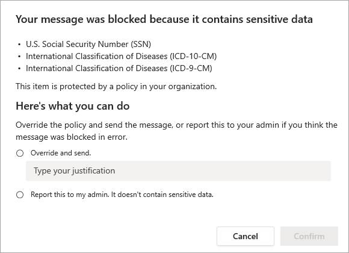
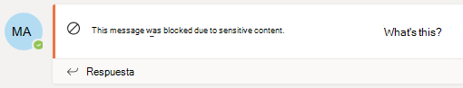
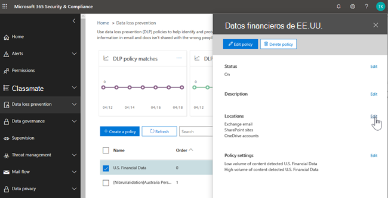
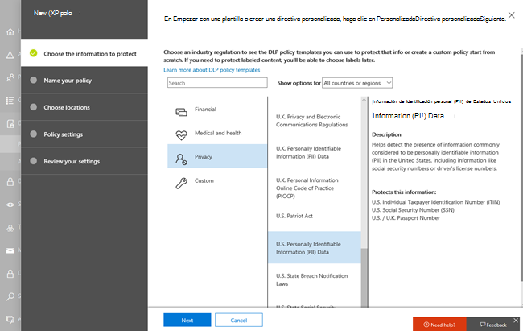
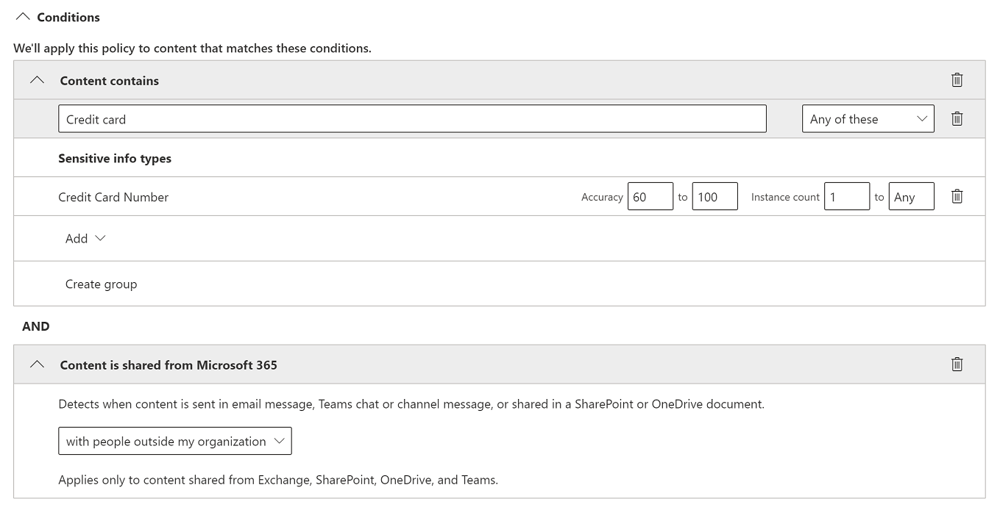
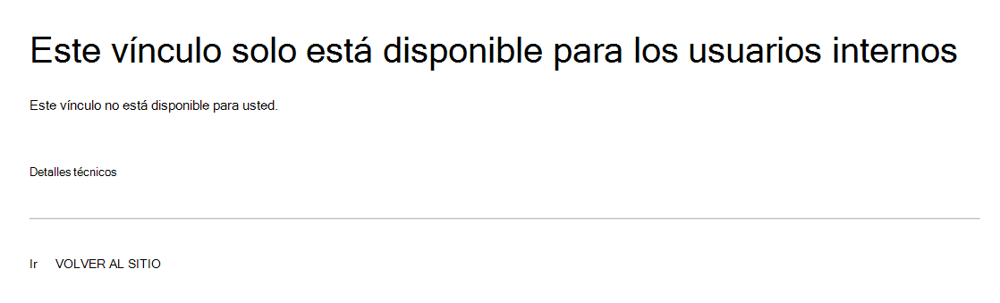

# Prevención de pérdida de datos y Microsoft Teams.Data loss prevention and Microsoft Teams

Si su organización tiene prevención de pérdida de datos (DLP), puede definir directivas que impidan que los usuarios compartan información confidencial en una sesión de chat o canal de Microsoft Teams datos.If your organization has data loss prevention (DLP), you can define policies that prevent people from sharing sensitive information in a Microsoft Teams channel or chat session. Estos son algunos ejemplos de cómo funciona esta protección:Here are some examples of how this protection works:

- **Ejemplo 1: Protección de información confidencial en mensajes**.**Example 1: Protecting sensitive information in messages**. Supongamos que alguien intenta compartir información confidencial en un Teams chat o canal con invitados (usuarios externos).Suppose that someone attempts to share sensitive information in a Teams chat or channel with guests (external users). Si tiene una directiva DLP definida para evitarlo, se eliminan los mensajes con información confidencial que se envían a usuarios externos.If you have a DLP policy defined to prevent this, messages with sensitive information that are sent to external users are deleted. Esto sucede automáticamente y en segundos, según cómo se configura la directiva DLP.This happens automatically, and within seconds, according to how your DLP policy is configured.

    > [!NOTE]
    > DLP para Microsoft Teams bloquea el contenido confidencial cuando se comparte con Microsoft Teams usuarios que tienen:DLP for Microsoft Teams blocks sensitive content when shared with Microsoft Teams users who have: - [acceso de invitado](/MicrosoftTeams/guest-access) en equipos y canales; o- [guest access](/MicrosoftTeams/guest-access) in teams and channels; or - [acceso externo en](/MicrosoftTeams/manage-external-access) reuniones y sesiones de chat.- [external access](/MicrosoftTeams/manage-external-access) in meetings and chat sessions. 
DLP para sesiones de chat externas solo funcionará si el remitente y el receptor están en modo de solo Teams y usando Microsoft Teams [federación nativa](/microsoftteams/manage-external-access).DLP for external chat sessions will only work if both the sender and the receiver are in Teams Only mode and using [Microsoft Teams native federation](/microsoftteams/manage-external-access). DLP para Teams no bloquea los  mensajes en interoperabilidad con Skype Empresarial o sesiones de chat federadas no nativas.DLP for Teams does not block messages in [interop](/microsoftteams/teams-and-skypeforbusiness-coexistence-and-interoperability#interoperability-of-teams-and-skype-for-business) with Skype for Business or non-native federated chat sessions.

- **Ejemplo 2: Protección de información confidencial en documentos**.**Example 2: Protecting sensitive information in documents**. Supongamos que alguien intenta compartir un documento con invitados en un canal Microsoft Teams chat y que el documento contiene información confidencial.Suppose that someone attempts to share a document with guests in a Microsoft Teams channel or chat, and the document contains sensitive information. Si tiene una directiva DLP definida para evitarlo, el documento no se abrirá para esos usuarios.If you have a DLP policy defined to prevent this, the document won't open for those users. La directiva DLP debe incluir SharePoint y OneDrive para poder establecer la protección.Your DLP policy must include SharePoint and OneDrive in order for protection to be in place. Este es un ejemplo de DLP para SharePoint que se muestra en Microsoft Teams y, por lo tanto, requiere que los usuarios tienen licencia para dlp Office 365 (incluido en Office 365 E3), pero no requiere que los usuarios puedan obtener una licencia para Cumplimiento avanzado de Office 365).This is an example of DLP for SharePoint that shows up in Microsoft Teams, and therefore requires that users are licensed for Office 365 DLP (included in Office 365 E3), but does not require users to be licensed for Office 365 Advanced Compliance.)

## Licencias DLP para Microsoft TeamsDLP Licensing for Microsoft Teams

[Las capacidades de prevención](dlp-learn-about-dlp.md) de pérdida de datos se ampliaron para incluir Microsoft Teams chat y mensajes de canal, **incluidos** los mensajes de canal privado para:[Data loss prevention](dlp-learn-about-dlp.md) capabilities were extended to include Microsoft Teams chat and channel messages, **including private channel messages** for:

- Office 365 E5/A5Office 365 E5/A5
- Microsoft 365 E5/A5Microsoft 365 E5/A5
- Gobierno y protección de información de Microsoft 365Microsoft 365 Information Protection and Governance
- Cumplimiento avanzado de Office 365Office 365 Advanced Compliance

Office 365 y Microsoft 365 E3 protección DLP para SharePoint Online, OneDrive y Exchange Online.Office 365 and Microsoft 365 E3 include DLP protection for SharePoint Online, OneDrive, and Exchange Online. Esto también incluye archivos que se comparten a través de Teams porque Teams usa SharePoint Online y OneDrive para compartir archivos.This also includes files that are shared through Teams because Teams uses SharePoint Online and OneDrive to share files.

La compatibilidad con la protección DLP en Teams chat requiere E5.Support for DLP protection in Teams Chat requires E5.

Para obtener más información sobre los requisitos de licencias, consulte [Instrucciones de licencias de Microsoft 365 del nivel de espacio empresarial](https://docs.microsoft.com/office365/servicedescriptions/microsoft-365-service-descriptions/microsoft-365-tenantlevel-services-licensing-guidance/microsoft-365-security-compliance-licensing-guidance).To learn more about licensing requirements, see [Microsoft 365 Tenant-Level Services Licensing Guidance](https://docs.microsoft.com/office365/servicedescriptions/microsoft-365-service-descriptions/microsoft-365-tenantlevel-services-licensing-guidance/microsoft-365-security-compliance-licensing-guidance).

> [!IMPORTANT]
> DLP solo se aplica a los mensajes reales en el subproceso de chat o canal.DLP applies only to the actual messages in the chat or channel thread. Las notificaciones de actividad , que incluyen una vista previa de  mensaje breve y aparecen según la configuración de notificación de un usuario, no se incluyen en Teams DLP.Activity notifications -- which include a short message preview and appear based on a user's notification settings -- are **not** included in Teams DLP. Cualquier información confidencial presente en la parte del mensaje que aparece en la vista previa permanecerá visible en la notificación incluso después de que se haya aplicado la directiva DLP y se haya quitado la información confidencial del mensaje en sí.Any sensitive information present in the part of the message that appears in the preview will remain visible in the notification even after the DLP policy has been applied and removed sensitive information the message itself.

## Ámbito de la protección DLPScope of DLP protection

La protección DLP se aplica de forma diferente a Teams entidades.DLP protection are applied differently to Teams entities.

|Cuentas de usuario/Grupos/ListaUser Accounts/Groups/List  |Teams EntidadTeams Entity |Protección DLP disponibleDLP protection available|
|---------|---------|---------|
|cuentas de usuario individualesindividual user accounts     |Chats de 1:1/n1:1/n chats         |síyes         |
|     |chats generalesgeneral chats         |nono         |
|     |canales privadosprivate channels         |síyes         |
|grupos de seguridad/listas de distribuciónsecurity groups/distribution lists  | Chats de 1:1/n1:1/n chats         |síyes         |
|     |chats generalesgeneral chats         |nono         |
|     |canales privadosprivate channels         |síyes        |
|Microsoft 365 grupoMicrosoft 365 group    |Chats de 1:1/n1:1/n chats          |nono         |
|     |chats generalesgeneral chats          |síyes        |
|     |canales privadosprivate channels|nono| 

## Las sugerencias de directiva ayudan a educar a los usuariosPolicy tips help educate users

De forma similar a cómo funciona DLP en [Exchange, Outlook, Outlook](data-loss-prevention-policies.md#policy-evaluation-in-exchange-online-outlook-and-outlook-on-the-web)en la web , [SharePoint Online,](data-loss-prevention-policies.md#policy-evaluation-in-onedrive-for-business-and-sharepoint-online-sites)sitios de OneDrive para la Empresa y clientes de escritorio de [Office,](data-loss-prevention-policies.md#policy-evaluation-in-the-office-desktop-programs)aparecen sugerencias de directiva cuando se desencadena una acción con una directiva DLP.Similar to how DLP works in [Exchange, Outlook, Outlook on the web](data-loss-prevention-policies.md#policy-evaluation-in-exchange-online-outlook-and-outlook-on-the-web), [SharePoint Online, OneDrive for Business sites](data-loss-prevention-policies.md#policy-evaluation-in-onedrive-for-business-and-sharepoint-online-sites), and [Office desktop clients](data-loss-prevention-policies.md#policy-evaluation-in-the-office-desktop-programs), policy tips appear when an action triggers with a DLP policy. Este es un ejemplo de una sugerencia de directiva:Here's an example of a policy tip:

Aquí, el remitente intentó compartir un número de seguridad social en un canal Microsoft Teams.Here, the sender attempted to share a social security number in a Microsoft Teams channel. El **vínculo ¿Qué puedo hacer?** abre un cuadro de diálogo que proporciona opciones para que el remitente resuelva el problema.The **What can I do?** link opens a dialog box that provides options for the sender to resolve the issue. Tenga en cuenta que, el remitente puede optar por invalidar la directiva o notificar a un administrador que la revise y resuelva.Notice that, the sender can opt to override the policy, or notify an admin to review and resolve it.

En su organización, puede elegir permitir que los usuarios invalide una directiva DLP.In your organization, you can choose to allow users to override a DLP policy. Al configurar las directivas DLP, puede usar las sugerencias de directiva predeterminadas o personalizar [las sugerencias de directiva](#to-customize-policy-tips) para su organización.When you configure your DLP policies, you can use the default policy tips, or [customize policy tips](#to-customize-policy-tips) for your organization.

Volviendo a nuestro ejemplo, donde un remitente compartió un número de seguridad social en un canal de Teams, esto es lo que vio el destinatario:Returning to our example, where a sender shared a social security number in a Teams channel, here's what the recipient saw:

> [!div class="mx-imgBorder"]
> 

### Personalizar sugerencias de directivaTo customize policy tips

Para llevar a cabo esta tarea, debe tener asignado un rol de administración que tenga permisos para editar directivas DLP.To perform this task, you must be assigned a role that has permissions to edit DLP policies. Para obtener más información vea [Permisos](data-loss-prevention-policies.md#permissions).To learn more, see [Permissions](data-loss-prevention-policies.md#permissions).

1. Vaya al Centro de cumplimiento ( [https://compliance.microsoft.com](https://compliance.microsoft.com) ) e inicie sesión.Go to the Compliance Center ([https://compliance.microsoft.com](https://compliance.microsoft.com)) and sign in.

2. Haga clic en **Prevención de pérdida de datos** > **Directiva**.Choose **Data loss prevention** > **Policy**.

3. Seleccione una directiva y, junto a **Configuración de directiva,** elija **Editar**.Select a policy, and next to **Policy settings**, choose **Edit**.

4. Cree una nueva regla o edite una regla existente para la directiva.Either create a new rule, or edit an existing rule for the policy.

    > [!div class="mx-imgBorder"]
    > 

5. En la **pestaña Notificaciones de usuario,** seleccione **Personalizar el** texto del correo electrónico o Personalizar las opciones de texto de **sugerencia de** directiva.On the **User notifications** tab, select **Customize the email text** and/or **Customize the policy tip text** options.

    > [!div class="mx-imgBorder"]
    >    

6. Especifique el texto que desea usar para notificaciones por correo electrónico o sugerencias de directiva y, a continuación, **elija Guardar**.Specify the text you want to use for email notifications and/or policy tips, and then choose **Save**.

7. En la **pestaña Configuración de** directiva, elija **Guardar**.On the **Policy settings** tab, choose **Save**.

Espere aproximadamente una hora para que los cambios funcionen en su centro de datos y se sincronicen con cuentas de usuario.Allow approximately one hour for your changes to work their way through your data center and sync to user accounts.
 <!-- why are these syncing to user accounts? -->

## Agregar Microsoft Teams como una ubicación a las directivas DLP existentesAdd Microsoft Teams as a location to existing DLP policies

Para llevar a cabo esta tarea, debe tener asignado un rol de administración que tenga permisos para editar directivas DLP.To perform this task, you must be assigned a role that has permissions to edit DLP policies. Para obtener más información vea [Permisos](data-loss-prevention-policies.md#permissions).To learn more, see [Permissions](data-loss-prevention-policies.md#permissions).

1. Vaya al Centro de cumplimiento ( [https://compliance.microsoft.com](https://compliance.microsoft.com) ) e inicie sesión.Go to the Compliance Center ([https://compliance.microsoft.com](https://compliance.microsoft.com)) and sign in.

2. Haga clic en **Prevención de pérdida de datos** > **Directiva**.Choose **Data loss prevention** > **Policy**.

3. Seleccione una directiva y vea los valores en **Ubicaciones**.Select a policy, and look at the values under **Locations**. Si ves **Teams chat y mensajes de canal,** estás todo configurado.If you see **Teams chat and channel messages**, you're all set. Si no lo hace, haga clic en **Editar**.If you don't, click **Edit**.

    > [!div class="mx-imgBorder"]
    > 

4. En la **columna Estado,** active la directiva para los **mensajes Teams chat y canal**.In the **Status** column, turn the policy on for **Teams chat and channel messages**.

    > [!div class="mx-imgBorder"]
    > 

5. En la **pestaña Elegir ubicaciones,** mantenga la configuración predeterminada de todas las cuentas o seleccione **Permitirme elegir ubicaciones específicas.**On the **Choose locations** tab, keep the default setting of all accounts, or select **Let me choose specific locations**. Puede especificar lo siguiente:You can specify:

    1. hasta 1000 cuentas individuales para incluir o excluirup to 1000 individual accounts to include or exclude
    1. listas de distribución y grupos de seguridad para incluir o excluir.distribution lists and security groups to include or exclude. 
    <!-- 1. the shared mailbox of a shared channel. **This is a public preview feature.**--> 
    
6. A continuación, elija **Siguiente**.Then choose **Next**.

7. Haga clic en **Guardar**.Click **Save**.

Espere aproximadamente una hora para que los cambios funcionen en su centro de datos y se sincronicen con cuentas de usuario.Allow approximately one hour for your changes to work their way through your data center and sync to user accounts.
<!-- again, why user accounts? -->

## Crear una directiva DLP con Microsoft TeamsDefine a new DLP policy for Microsoft Teams

Para llevar a cabo esta tarea, debe tener asignado un rol de administración que tenga permisos para editar directivas DLP.To perform this task, you must be assigned a role that has permissions to edit DLP policies. Para obtener más información vea [Permisos](data-loss-prevention-policies.md#permissions).To learn more, see [Permissions](data-loss-prevention-policies.md#permissions).

1. Vaya al Centro de cumplimiento ( [https://compliance.microsoft.com](https://compliance.microsoft.com) ) e inicie sesión.Go to the Compliance Center ([https://compliance.microsoft.com](https://compliance.microsoft.com)) and sign in.

2. Elija **Prevención de pérdida de datos** > **Directiva** > **+ Crear una directiva**.Choose **Data loss prevention** > **Policy** > **+ Create a policy**.

3. Elija una [plantilla](data-loss-prevention-policies.md#dlp-policy-templates)y, a continuación, **elija Siguiente**.Choose a [template](data-loss-prevention-policies.md#dlp-policy-templates), and then choose **Next**.

    En nuestro ejemplo, elegimos la plantilla Datos de información de identificación personal de Estados Unidos.In our example, we chose the U.S. Personally Identifiable Information Data template.

    > [!div class="mx-imgBorder"]
    >  

4. En la **pestaña Nombre de la directiva,** especifique un nombre y una descripción para la directiva y, a continuación, elija **Siguiente**.On the **Name your policy** tab, specify a name and description for the policy, and then choose **Next**.

5. En la **pestaña Elegir ubicaciones,** mantenga la configuración predeterminada de todas las cuentas o seleccione **Permitirme elegir ubicaciones específicas.**On the **Choose locations** tab, keep the default setting of all accounts, or select **Let me choose specific locations**. Puede especificar lo siguiente:You can specify:

    1. hasta 1000 cuentas individuales para incluir o excluirup to 1000 individual accounts to include or exclude
    1. listas de distribución y grupos de seguridad para incluir o excluir.distribution lists and security groups to include or exclude. **Se trata de una característica de vista previa pública.****This is a public preview feature.**
    <!-- 1. the shared mailbox of a shared channel. **This is a public preview feature.**-->  

    

    > [!NOTE]
    > Si desea asegurarse de que los documentos que contienen información confidencial no  se compartan de forma inadecuada en Teams, asegúrese de que SharePoint sitios y cuentas **de OneDrive** estén activados, junto con los mensajes de **chat** y canal Teams .If you want to make sure documents that contain sensitive information are not shared inappropriately in Teams, make sure **SharePoint sites** and **OneDrive accounts** are turned on, along with **Teams chat and channel messages**.

6. En la **pestaña Configuración de** directiva, en Personalizar el tipo de contenido que desea proteger, mantenga la configuración sencilla predeterminada o elija Usar configuración avanzada y, a continuación, elija **Siguiente**.  On the **Policy settings** tab, under **Customize the type of content you want to protect**, keep the default simple settings, or choose **Use advanced settings**, and then choose **Next**. Si elige la configuración avanzada, puede crear o editar reglas para la directiva.If you choose advanced settings, you can create or edit rules for your policy. Para obtener ayuda con esto, vea [Configuración sencilla frente a configuración avanzada](data-loss-prevention-policies.md#simple-settings-vs-advanced-settings).To get help with this, see [Simple settings vs. advanced settings](data-loss-prevention-policies.md#simple-settings-vs-advanced-settings).

7.  En la **pestaña Configuración de** directiva, en ¿Qué desea hacer si detectamos información **confidencial?**, revise la configuración.On the **Policy settings** tab, under **What do you want to do if we detect sensitive info?**, review the settings. Aquí es donde puede elegir mantener las sugerencias de directiva [predeterminadas](use-notifications-and-policy-tips.md)y las notificaciones de correo electrónico, o personalizarlas.Here's where you can choose to keep default [policy tips and email notifications](use-notifications-and-policy-tips.md), or customize them.

    > [!div class="mx-imgBorder"]
    > 

    Cuando haya terminado de revisar o editar la configuración, elija **Siguiente**.When you're finished reviewing or editing settings, choose **Next**.

8. En la **pestaña** Configuración de directiva, en ¿Desea activar la directiva o probar primero **las cosas?**, elija si desea activar la [directiva,](dlp-overview-plan-for-dlp.md#policy-deployment)probarla primero o mantenerla desactivada por ahora y, a continuación, elija **Siguiente**.On the **Policy settings** tab, under **Do you want to turn on the policy or test things out first?**, choose whether to turn the policy on, [test it first](dlp-overview-plan-for-dlp.md#policy-deployment), or keep it turned off for now, and then choose **Next**.

    > [!div class="mx-imgBorder"]
    > 

9. En la **pestaña Revisar la configuración,** revisa la configuración de la nueva directiva.On the **Review your settings** tab, review the settings for your new policy. Elija **Editar** para realizar cambios.Choose **Edit** to make changes. Cuando haya terminado, elija **Crear**.When you're finished, choose **Create**.

Espere aproximadamente una hora para que la nueva directiva funcione en su centro de datos y se sincronice con cuentas de usuario.Allow approximately one hour for your new policy to work its way through your data center and sync to user accounts.

## Evitar el acceso externo a documentos confidencialesPrevent external access to sensitive documents

Para asegurarse de que SharePoint documentos que contienen información confidencial no puedan tener acceso los invitados externos desde SharePoint o Teams de forma predeterminada, seleccione lo siguiente:To ensure that SharePoint documents that contain sensitive information cannot be accessed by external guests either from SharePoint or Teams by default, select the following:

- Puede asegurarse de que los documentos están protegidos hasta que DLP los examina y los marca como seguros para compartir marcando los nuevos archivos [como confidenciales de forma predeterminada.](/sharepoint/sensitive-by-default)You can ensure that documents are protected until DLP scans and marks them as safe to share by [marking new files as sensitive by default](/sharepoint/sensitive-by-default).

- Estructura recomendada de directiva DLPRecommended DLP policy structure

    - **Condiciones****Conditions**
        - El contenido contiene cualquiera de estos tipos de información confidencial: [Seleccionar todo lo que se aplica]Content contains any of these sensitive information types: [Select all that apply]
        
        - El contenido se comparte Microsoft 365 con personas de fuera de mi organizaciónContent is shared from Microsoft 365 with people outside my organization
        
          > [!div class="mx-imgBorder"]
          > 

    - **Actions****Actions**
        - Restringir el acceso de usuarios externos al contenidoRestrict access to the content for external users
        
        - Notificar a los usuarios con sugerencias de directiva y correo electrónicoNotify users with email and policy tips
        
        - Enviar informes de incidentes al administradorSend incident reports to the Administrator
        
        > [!div class="mx-imgBorder"]
        > 

Directiva DLP en acción al intentar compartir un documento en SharePoint que contiene información confidencial con un invitado externo:DLP policy in action when attempting to share a document in SharePoint that contains sensitive information with an external guest:

> [!div class="mx-imgBorder"]
> 

Directiva DLP en acción cuando el invitado intenta abrir un documento en Teams con bloqueo externo:DLP policy in action when guest attempts to open a document in Teams with block external:

> [!div class="mx-imgBorder"]
> 

## Artículos relacionadosRelated articles

- [Crear, probar y optimizar una directiva DLPCreate, test, and tune a DLP policy](create-test-tune-dlp-policy.md)
- [Enviar notificaciones de email y mostrar sugerencias para directivas DLPSend email notifications and show policy tips for DLP policies](use-notifications-and-policy-tips.md)
