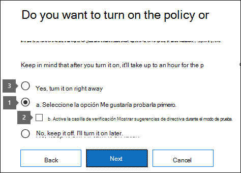

# Planear la prevención de pérdida de datos (DLP)Plan for data loss prevention (DLP)

Cada organización planeará e implementará la prevención de pérdida de datos (DLP) de forma diferente, ya que las necesidades empresariales, los objetivos, los recursos y la situación de cada organización son únicas para ellos.Every organization will plan for and implement data loss prevention (DLP) differently, because every organization's business needs, goals, resources, and situation are unique to them. Sin embargo, hay elementos que son comunes a todas las implementaciones de DLP correctas.However, there are elements that are common to all successful DLP implementations. En este artículo se presentan los procedimientos recomendados que usan las organizaciones en su planeación de DLP.This article presents the best practices that are used by organizations in their DLP planning.

## Varios puntos inicialesMultiple starting points

Muchas organizaciones deciden implementar DLP para cumplir con diversas normativas gubernamentales o del sector.Many organizations choose to implement DLP to comply with various governmental or industry regulations. Por ejemplo, el Reglamento general de protección de datos (RGPD) de la Unión Europea o la Ley de portabilidad y responsabilidad de seguros de salud (HIPAA) o la Ley de privacidad del consumidor de California (CCPA).For example, the European Union's General Data Protection Regulation (GDPR), or the Health Insurance Portability and Accountability Act (HIPAA), or the California Consumer Privacy Act (CCPA). También implementan la prevención de pérdida de datos para proteger su propiedad intelectual.They also implement data loss prevention to protect their intellectual property. Pero el lugar de inicio y el destino final del viaje DLP varían.But the starting place and ultimate destination in the DLP journey vary. 

Las organizaciones pueden iniciar su recorrido dlp:Organizations can start their DLP journey:

- desde un enfoque de plataforma, como querer proteger la información en mensajes de chat y canal de Teams o en Windows 10 dispositivosfrom a platform focus, like wanting to protect information in Teams Chat and Channel messages or on Windows 10 devices
- saber qué información confidencial quieren priorizar la protección, como los registros de atención médica, e ir directamente a definir directivas para protegerlaknowing what sensitive information they want to prioritize protecting, like health care records, and going straight to defining policies to protect it
- sin saber cuál es su información confidencial, dónde está y quién hace qué con ella para que comiencen con la detección y categorización y tomen un enfoque más metódicowithout knowing what their sensitive information is, where it is, and who is doing what with it so they start with discovery and categorization and take a more methodical approach
- sin saber cuál es su información confidencial, dónde está, o quién hace lo que hace con ella, pero se moverán directamente a definir directivas y usarán esos resultados como punto de partida y, a continuación, refinarán sus directivas desde allíwithout knowing what their sensitive information is, or where it is, or who is doing what with it, but they will move straight to defining policies and use those outcomes as a starting place and then refine their policies from there
- saber que necesitan implementar la pila completa Microsoft 365 Information Protection y, por lo tanto, tienen la intención de tomar un enfoque metódico y a largo plazoknowing that they need to implement the full Microsoft 365 Information Protection stack and so intend to take a longer term, methodical approach

Estos son solo algunos ejemplos de cómo los clientes pueden acercarse a DLP y no importa desde dónde empiece, Microsoft 365 DLP es lo suficientemente flexible como para dar cabida a varios tipos de recorridos de protección de la información desde el principio hasta una estrategia de prevención de pérdida de datos completamente realizada.These are just some examples of how customers can approach DLP and it doesn't matter where you start from, Microsoft 365 DLP is flexible enough to accommodate various types of information protection journeys from start to a fully realized data loss prevention strategy. 

## Información general sobre el proceso de planeaciónOverview of planning process

La [información sobre la prevención de pérdida de](dlp-learn-about-dlp.md#learn-about-data-loss-prevention) datos presenta los tres aspectos diferentes del proceso de [planeación de DLP](dlp-learn-about-dlp.md#plan-for-dlp).The [Learn about data loss prevention](dlp-learn-about-dlp.md#learn-about-data-loss-prevention) introduces the three different aspect of the [DLP planning process](dlp-learn-about-dlp.md#plan-for-dlp). Vamos a entrar en más detalles aquí en los elementos que son comunes a todos los planes DLP.We'll go into more detail here on the elements that are common to all DLP plans.

### Identificación de las partes interesadasIdentify stakeholders

Cuando se implementa, las directivas DLP se pueden aplicar en grandes partes de la organización.When implemented, DLP policies can be applied across large portions of your organization. IT can't develop a broad ranging plan on their own without negative consequences.IT can't develop a broad ranging plan on their own without negative consequences. Debe identificar a las partes interesadas que pueden:You need to identify the stakeholders who can:

- describir las normativas, las leyes y los estándares de la industria a los que está sujeta su organizacióndescribe the regulations, laws and industry standards your organization is subject to
- categorías de elementos confidenciales que se protegeránthe categories of sensitive items to be protected
- los procesos empresariales en los que se usanthe business processes they are used in
- el comportamiento de riesgo que debe ser limitadothe risky behavior that should be limited
- priorizar qué datos deben protegerse primero en función de la confidencialidad de los elementos y el riesgo implicadoprioritize which data should be protected first based on the sensitivity of the items and risk involved
- esquema del proceso de revisión y corrección de eventos de coincidencia de directiva DLPoutline the DLP policy match event review and remediation process 
 
En general, estas necesidades tienden a ser un 85 % de protección reglamentaria y de cumplimiento, y un 15 % de protección de la propiedad intelectual.In general these needs tend to be 85% regulatory and compliance protection, and 15% intellectual property protection. Estas son algunas sugerencias sobre los roles que se deben incluir en el proceso de planeación:Here are some suggestions on roles to include in your planning process:

- Responsables normativos y de cumplimientoRegulatory and compliance officers
- Director de riesgosChief risk officer
- Responsables legalesLegal officers
- Agentes de seguridad y cumplimientoSecurity and compliance officers
- Propietarios empresariales de los elementos de datosBusiness owners for the data items
- Usuarios empresarialesBusiness users
- TIIT

### Describir las categorías de información confidencial que se protegeránDescribe the categories of sensitive information to protect

A continuación, las partes interesadas describen las categorías de información confidencial que se van a proteger y el proceso de negocio en el que se usan.The stakeholders then describe the categories of sensitive information to be protected and the business process that they're used in. Por ejemplo, Microsoft 365 DLP define estas categorías:For example, Microsoft 365 DLP defines these categories:

- FinancieraFinancial 
- Información médica y de saludMedical and health information
- PrivacidadPrivacy
- PersonalizadoCustom

Las partes interesadas pueden identificar la información confidencial como "Somos un procesador de datos, por lo que debemos implementar protecciones de privacidad en la información del interesado y la información financiera".The stakeholders might identify the sensitive information as "We are a data processor, so we have to implement privacy protections on data subject information and financial information".

 
  <!-- The business process is important as it informs the ‘data at rest’, ‘data in transit’, ‘data in use’ aspect of DLP planning and who should be sharing the items and who should not.-->

### Establecer objetivos y estrategiaSet goals and strategy

Una vez que haya identificado a sus partes interesadas y sepa qué información confidencial necesita protección y dónde se usa, las partes interesadas pueden establecer sus objetivos de protección y TI puede desarrollar un plan de implementación.Once you have identified your stakeholders and you know which sensitive information needs protection and where it's used, the stakeholders can set their protection goals and IT can develop an implementation plan. 

 <!--
### Discovery
 for the locations (DLP workloads) of these types of items.  (mapping DLP locations and data at rest, data in transit, data in use)

### IT can start coding test policies
start small and always in test mode. Note that DLP policies can feed into insider risk.

### Business process owners help with tuning
 false positive/false negative results and fitting DLP into their business processes.

-->

### Establecer plan de implementaciónSet implementation plan

El plan de implementación debe incluir:Your implementation plan should include:

- Asignación del estado inicial y el estado final deseado y los pasos para ir de uno a otroMapping out your starting state and desired end state and the steps to get from one to the other
- cómo abordará la detección de elementos confidencialeshow you will address discovery of sensitive items
- planeación de la directiva y el orden en que se implementaránpolicy planning and the order that they will be implemented
- cómo abordará los requisitos previoshow you will address any prerequisites
- planeación de cómo se probarán primero las directivas antes de pasar a la aplicaciónplanning on how policies will first be tested before moving to enforcement
- cómo entrenará a los usuarios finaleshow you will train your end users
- cómo probar y ajustar las directivashow you will test and tune your policies
- cómo revisará y actualizará su estrategia de prevención de pérdida de datos en función de los cambios normativos, legales, estándares de la industria o protección de propiedad intelectual y necesidades empresarialeshow you will review and update your data loss prevention strategy based on changing regulatory, legal, industry standard or intellectual property protection and business needs

#### Asignar ruta de acceso de inicio a estado final deseadoMap out path from start to desired end state

Documentar cómo la organización va a pasar de su estado inicial al estado final deseado es esencial para comunicarse con las partes interesadas y establecer el ámbito del proyecto.Documenting how your organization is going to get from its starting state to the desired end state is essential to communicating with your stakeholders and setting the project scope. A continuación se ofrece un conjunto de pasos que se usan habitualmente para implementar DLP.Here are a set of steps that are commonly used to deploy DLP. Querrás más detalles que esto, pero puedes usarlo para enmarcar la ruta de adopción de DLP.You'll want more detail than this, but you can use this to frame your DLP adoption path.

#### Detección de elementos confidencialesSensitive item discovery

Hay varias maneras de descubrir qué elementos confidenciales individuales están y dónde se encuentran.There are multiple ways to discover what individual sensitive items are and where they are located. Es posible que ya haya implementado etiquetas de confidencialidad o que haya decidido implementar una directiva DLP muy amplia en todas las ubicaciones que solo detectan y auditan elementos.You may have sensitivity labels already deployed or you may have decided to deploy a very broad DLP policy to all locations that only discovers and audits items. Para obtener más información, vea [Know your data](information-protection.md#know-your-data).To learn more, see [Know your data](information-protection.md#know-your-data).

#### Planeación de directivasPolicy planning

Al comenzar la adopción de DLP, puede usar estas preguntas para centrar los esfuerzos de diseño e implementación de directivas.As you begin your DLP adoption you can use these questions to focus your policy design and implementation efforts.

##### ¿Qué leyes, reglamentos y estándares del sector debe cumplir su organización?What laws, regulations and industry standards must your organization comply with?

Dado que muchas organizaciones llegan a DLP con el objetivo del cumplimiento normativo, responder a esta pregunta es un punto de partida natural para planear la implementación de DLP.Because many organizations come to DLP with the goal of regulatory compliance, answering this question is a natural starting place for planning your DLP implementation. Pero, como implementador de TI, probablemente no esté posicionado para responderlo.But, as the IT implementer, you're probably not positioned to answer it. Debe ser contestada por el equipo legal y los ejecutivos empresariales.It needs to be answered by your legal team and business executives. 
 
**Ejemplo** Su organización está sujeta a Reino Unido.**Example** Your organization is subject to U.K. regulaciones financieras.financial regulations.

##### ¿Qué elementos confidenciales tiene su organización que deben protegerse de las filtraciones?What sensitive items does your organization have that must be protected from leakage?

Una vez que su organización sepa dónde se encuentra en términos de las necesidades de cumplimiento normativo, tendrá una idea de qué elementos confidenciales deben protegerse de las filtraciones y cómo desea priorizar la implementación de directivas para protegerlos.Once your organization knows where it stands in terms of regulatory compliance needs, you'll have some idea of what sensitive items need to be protected from leakage and how you want to prioritize policy implementation to protect them. Esto le ayudará a elegir las plantillas de directiva DLP más adecuadas.This will help you choose the most appropriate DLP policy templates. Microsoft 365 incluye plantillas DLP preconfiguradas para Financial, Medical and health, Privacy y puede crear las suyas propias con la plantilla Personalizada.Microsoft 365 comes with pre-configured DLP templates for Financial, Medical and health, Privacy, and you can build your own using the Custom template. A medida que diseña y crea sus directivas DLP reales, conocer la respuesta a esta pregunta también le ayudará a elegir el tipo de [información confidencial adecuada.](sensitive-information-type-learn-about.md#learn-about-sensitive-information-types)As you design and create your actual DLP policies, knowing the answer to this question will also help you choose the right [sensitive information type](sensitive-information-type-learn-about.md#learn-about-sensitive-information-types).

**Ejemplo** Para empezar rápidamente, debe elegir la plantilla de directiva que incluye los tipos `U.K. Financial Data` de información confidencial , `Credit Card Number` `EU Debit Card Number` `SWIFT Code` y.**Example** To get started quickly, you pick the `U.K. Financial Data` policy template which includes the `Credit Card Number`, `EU Debit Card Number`, and `SWIFT Code` sensitive information types. 

##### ¿Dónde están los elementos confidenciales y en qué procesos empresariales participan?Where are the sensitive items and what business processes are they involved in?

Los elementos que contienen información confidencial de las organizaciones se usan todos los días durante la actividad empresarial.The items that contain your organizations sensitive information are used every day in the course of doing business. Debe saber dónde pueden producirse instancias de esa información confidencial y en qué procesos empresariales se usan.You need to know where instances of that sensitive information may occur and what business processes they are used in. Esto le ayudará a elegir las ubicaciones adecuadas a las que aplicar las directivas DLP.This will help you choose the right locations to apply your DLP policies to. Microsoft 365 Las directivas DLP se aplican a las ubicaciones:Microsoft 365 DLP policies are applied to locations:

- Correo electrónico de ExchangeExchange email
- Sitios de SharePointSharePoint sites
- Cuentas de OneDriveOneDrive accounts
- Mensajes de canales y chats de TeamsTeams chat and channel messages
- Windows 10 DispositivosWindows 10 Devices
- Microsoft Cloud App SecurityMicrosoft Cloud App Security
- Repositorios localesOn-premises repositories

**Ejemplo** Los auditores internos de su organización están rastreando un conjunto de números de tarjeta de crédito.**Example** Your organizations' internal auditors are tracking a set of credit card numbers. Mantienen una hoja de cálculo de ellos en un sitio SharePoint seguro.They keep a spreadsheet of them in a secure SharePoint site. Varios de los empleados hacen copias y las guardan en su sitio OneDrive para la Empresa trabajo que se sincroniza con su Windows 10 dispositivo.Several of the employees make copies and save them to their work OneDrive for Business site which is synced to their Windows 10 device. Uno de ellos pega una lista de 14 de ellos en un correo electrónico e intenta enviarlo a los auditores externos para su revisión.One of them pastes a list of 14 of them in an email and tries to send it to the outside auditors for review. Desea aplicar la directiva al sitio de SharePoint seguro, todos los auditores internos OneDrive para la Empresa cuentas, sus dispositivos Windows 10 dispositivos y Exchange correo electrónico.You'd want to apply the policy to the secure SharePoint site, all the internal auditors OneDrive for Business accounts, their Windows 10 devices and Exchange email.

##### ¿Cuál es la tolerancia de las organizaciones a las filtraciones?What is your organizations tolerance for leakage?

Los distintos grupos de la organización pueden tener diferentes vistas sobre lo que es un nivel aceptable de pérdida de elementos confidenciales y lo que no es.Different groups in your organization may have different views on what's an acceptable level of sensitive item leakage and what's not. Lograr la perfección de cero fugas puede tener un costo demasiado alto para la empresa.Achieving the perfection of zero leakage may come at too high a cost to the business.

**Ejemplo** El grupo de seguridad de su organización, junto con el equipo legal, sienten que no debe haber ningún uso compartido de números de tarjetas de crédito con nadie fuera de la organización e insisten en que no se produzca ninguna fuga.**Example** Your organizations' security group, along with the legal team both feel that there should be no sharing of credit card numbers with anyone outside the org and insist on zero leakage. Pero, como parte de la revisión periódica de la actividad del número de tarjeta de crédito, los auditores internos deben compartir algunos números de tarjeta de crédito con auditores de terceros.But, as part of regular review of credit card number activity, the internal auditors must share some credit card numbers with third party auditors. Si su directiva DLP prohíbe todo uso compartido de números de tarjeta de crédito fuera de la organización, habrá una interrupción significativa del proceso empresarial y un costo agregado para mitigar la interrupción a fin de que los auditores internos completen su seguimiento.If your DLP policy prohibits all sharing of credit card numbers outside the org, there will be a significant business process disruption and added cost to mitigate the disruption in order for the internal auditors to complete their tracking. Este costo adicional es inaceptable para el liderazgo ejecutivo.This extra cost is unacceptable to the executive leadership. Para resolver esto, debe haber una conversación interna para decidir un nivel aceptable de fuga.To resolve this, there needs to be an internal conversation to decide an acceptable level of leakage. Una vez que se decida, la directiva puede proporcionar excepciones para que determinadas personas compartan la información o se puede aplicar en modo de solo auditoría.Once that is decided the policy can provide exceptions for certain individuals to share the information or it can be applied in audit only mode.

#### Planeación de requisitos previosPlanning for prerequisites

Antes de poder supervisar algunas ubicaciones dlp, hay requisitos previos que deben cumplirse.Before you can monitor some DLP locations, there are prerequisites that must be met. Vea las **secciones Antes de comenzar** de:See the **Before you begin** sections of:

- [Introducción al examinador de prevención de pérdida de datos en el entorno local (versión preliminar)Get started with the data loss prevention on-premises scanner (preview)](dlp-on-premises-scanner-get-started.md#before-you-begin)
- [Introducción a la prevención de pérdida de datos en punto de conexiónGet started with Endpoint data loss prevention](endpoint-dlp-getting-started.md#before-you-begin)
- [Introducción a la extensión de cumplimiento de Microsoft (versión preliminar)Get started with the Microsoft compliance extension (preview)](dlp-chrome-get-started.md#before-you-begin)
- [Usar directivas de prevención de pérdida de datos para aplicaciones en la nube que no son de Microsoft (versión preliminar)Use data loss prevention policies for non-Microsoft cloud apps (preview)](dlp-use-policies-non-microsoft-cloud-apps.md#before-you-begin)

#### Implementación de directivasPolicy deployment

Cuando crea directivas DLP, considere la posibilidad de implementarlas gradualmente para evaluar su impacto y probar su eficacia antes de aplicarlas completamente.When you create your DLP policies, you should consider rolling them out gradually to assess their impact and test their effectiveness before fully enforcing them. Por ejemplo, no desea que una nueva directiva DLP bloquee de forma involuntara el acceso a miles de documentos o rompa un proceso empresarial existente.For example, you don't want a new DLP policy to unintentionally block access to thousands of documents or to break an existing business process.
  
Si está creando directivas DLP con un gran impacto potencial, se recomienda seguir esta secuencia:If you're creating DLP policies with a large potential impact, we recommend following this sequence:
  
1. **Inicie en modo de prueba sin sugerencias de directiva** y, a continuación, use los informes DLP para evaluar el impacto.**Start in test mode without Policy Tips** and then use the DLP reports and any incident reports to assess the impact. Los informes DLP le sirven para ver el número, la ubicación, el tipo y la gravedad de las coincidencias de directivas.You can use DLP reports to view the number, location, type, and severity of policy matches. En función de los resultados, puede ajustar las directivas según sea necesario.Based on the results, you can fine tune the policies as needed. En el modo de prueba, las directivas DLP no afectarán a la productividad de las personas que trabajan en su organización.In test mode, DLP policies will not impact the productivity of people working in your organization. Además, use esta fase para probar el flujo de trabajo para la revisión de eventos DLP y la corrección de problemas.Also, use this stage to test out your workflow for DLP event review and issue remediation.
    
2. **Pasa al modo de** prueba con notificaciones y directivas Sugerencias para que puedas empezar a enseñar a los usuarios sobre las directivas de cumplimiento y prepararlas para las directivas que se van a aplicar.**Move to Test mode with notifications and Policy Tips** so that you can begin to teach users about your compliance policies and prepare them for the policies that are going to be applied. Resulta útil tener un vínculo a una página de directiva de organización que proporciona detalles adicionales sobre la directiva en la sugerencia de directiva.Its useful to have a link to an organization policy page that provides additional details about the policy in the policy tip. En esta fase, también puede pedir a los usuarios que informen de falsos positivos para poder refinar aún más las directivas.At this stage, you can also ask users to report false positives so that you can further refine the policies. Pase a esta fase una vez que tenga confianza en que los resultados de la aplicación de directiva coincidan con lo que las partes interesadas tenían en mente.Move to this stage once you have confidence that the results of policy application match what they stakeholders had in mind. 
    
3. **Comience el cumplimiento completo de las directivas** para que se apliquen las acciones en las reglas y se proteja el contenido.**Start full enforcement on the policies** so that the actions in the rules are applied and the content's protected. Continúe supervisando los informes DLP y los informes de incidentes o las notificaciones para asegurarse de que los resultados sean los deseados.Continue to monitor the DLP reports and any incident reports or notifications to make sure that the results are what you intend. 

    

    Puede desactivar una directiva DLP en cualquier momento, lo que afecta a todas las reglas de la directiva.You can turn off a DLP policy at any time, which affects all rules in the policy. No obstante, también es posible desactivar reglas individuales mediante el botón de alternancia de estado del editor de reglas.However, each rule can also be turned off individually by toggling its status in the rule editor.

    

    También puede cambiar la prioridad de varias reglas en una directiva.You can also change the priority of multiple rules in a policy. Para hacerlo, abra una directiva para editarla.To do that, open a policy for editing. En una fila de una regla, elija el signo de puntos suspensivos (**...**) y elija una opción, como **Bajar** o **Llevar al final**. In a row for a rule, choose the ellipses (**...**), and then choose an option, such as **Move down** or **Bring to last**.

    

#### Aprendizaje para usuarios finalesEnd user training

Cuando se desencadena una directiva DLP, puede configurar las directivas para enviar notificaciones por correo electrónico y mostrar [sugerencias](use-notifications-and-policy-tips.md#send-email-notifications-and-show-policy-tips-for-dlp-policies) de directiva para directivas DLP a administradores y usuarios finales.When a DLP policy is triggered, you can configure your policies to [Send email notifications and show policy tips for DLP policies](use-notifications-and-policy-tips.md#send-email-notifications-and-show-policy-tips-for-dlp-policies) to admins and end users. Aunque las directivas aún están en modo de prueba y antes de que se establezcan para aplicar una acción de bloqueo, las sugerencias de directivas son formas útiles de concienciar sobre comportamientos de riesgo en elementos confidenciales y formar a los usuarios para evitar esos comportamientos en el futuro.While your policies are still in test mode and before they are set to enforce a blocking action, policy tips are useful ways to raise awareness of risky behaviors on sensitive items and train users to avoid those behaviors in the future.  

#### Revisar los requisitos de DLP y la estrategia de actualizaciónReview DLP requirements and update strategy

Las normativas, las leyes y los estándares del sector a los que está sujeta su organización cambiarán con el tiempo y sus objetivos empresariales para DLP también lo harán.The regulations, laws and industry standards that your organization is subject to will change over time and your business goals for DLP will too. Asegúrese de incluir revisiones periódicas de todas estas áreas para que su organización se mantenga en cumplimiento y la implementación de DLP siga a la medida de sus necesidades empresariales.Be sure to include regular reviews of all these areas so that your organization stays in compliance and your DLP implementation continues to meet your business needs.

## Enfoques para la implementaciónApproaches to deployment

|Descripción de las necesidades empresariales del clienteCustomer business needs description  | enfoqueapproach  |
|---------|---------|
|**Contoso Bank** está en un sector altamente regulado y tiene muchos tipos diferentes de elementos confidenciales en muchas ubicaciones diferentes.**Contoso Bank** is in a highly regulated industry and has  many different types of sensitive items in many different locations.   - sabe qué tipos de información confidencial son prioridad.- knows which types of sensitive information are top priority.   - debe minimizar la interrupción del negocio a medida que se van implantando las directivas.- must minimize business disruption as policies are rolled out.   - tiene recursos de TI y puede contratar expertos para ayudar a planear, diseñar la implementación-  has IT resources and can hire experts to help plan, design deploy   - tiene un contrato de soporte técnico premier con Microsoft- has a premier support contract with Microsoft| - Tómese el tiempo para comprender qué normativas deben cumplir y cómo van a cumplir.- Take the time to understand what regulations they must comply with and how they are going to comply.   -Tómese el tiempo para comprender el mejor valor conjunto de la pila Microsoft 365 Information Protection-Take the time to understand the better together value of the Microsoft 365 Information Protection stack   - Desarrollar un esquema de etiquetado de confidencialidad para elementos prioritarios y aplicar- Develop sensitivity labelling scheme for prioritized items and apply   - Implicar a los propietarios de procesos empresariales- Involve business process owners  - Directivas de diseño y código, implementación en modo de prueba, formación de usuarios- Design/code policies, deploy in test mode, train users  - repetir- repeat|
|**TailSpin Toys** no sabe lo que tiene o dónde está, y tiene poca o ninguna profundidad de recursos.**TailSpin Toys** doesn’t know what they have or where it is, and have little to no resource depth. Usan Teams, ODB y Exchange extensamente.They use Teams, ODB and Exchange extensively.     |- Comience con directivas sencillas en las ubicaciones priorizadas.- Start with simple policies on the prioritized locations.  - Supervisar lo que se identifica- Monitor what gets identified  - Aplicar etiquetas de confidencialidad en consecuencia- Apply sensitivity labels accordingly  - Refinar directivas, entrenar a los usuarios- Refine policies, train users       |
|**Fabrikam** es una pequeña startup que quiere proteger su propiedad intelectual y debe moverse rápidamente.**Fabrikam** is a small startup and wants to protect its intellectual property, and must move quickly. Están dispuestos a dedicar algunos recursos, pero no pueden permitirse la contratación de expertos externos.They are willing to dedicate some resources, but can't afford hiring outside experts.  - Los elementos confidenciales están en Microsoft 365 OneDdrive para la Empresa/SharePoint- Sensitive items are all in Microsoft 365 OneDdrive for Business/SharePoint  - La adopción de OneDrive para la Empresa y SharePoint es lenta, los empleados y la sombra de IT usan DropBox y Google Drive para compartir o almacenar elementos- Adoption of OneDrive for Business and SharePoint is slow, employees/shadow IT use DropBox and Google drive to share/store items  - Los empleados valoran la velocidad de trabajo en relación con la disciplina de protección de datos- Employees value speed of work over data protection discipline  - Cliente aplplió y compró los 18 empleados nuevos Windows 10 dispositivos- Customer splurged and bought all 18 employees new Windows 10 devices     |- Aproveche la directiva DLP predeterminada en Teams- Take advantage of the default DLP policy in Teams  - Usar la configuración restringida de forma predeterminada para SharePoint elementos- Use restricted by default setting for SharePoint items  - Implementar directivas que impidan el uso compartido externo- Deploy policies that prevent external sharing  - Implementar directivas en ubicaciones priorizadas- Deploy policies to prioritized locations  - Implementar directivas en Windows 10 dispositivos- Deploy policies to Windows 10 devices  - Bloquear cargas en almacenamiento en la nube que no OneDrive para la Empresa almacenamiento en la nube- Block uploads to non OneDrive for Business cloud storage      |

<!--

## Planning for workloads

### Exchange

### SharePoint

### OneDrive for Business

### Teams

### Windows 10 Devices

### Microsoft Cloud App Security (MCAS)

### On-premises Scanner
-->

## Consulta tambiénSee also
- [Obtenga más información acerca de la prevención contra la pérdida de datosLearn about data loss prevention](dlp-learn-about-dlp.md#learn-about-data-loss-prevention)
