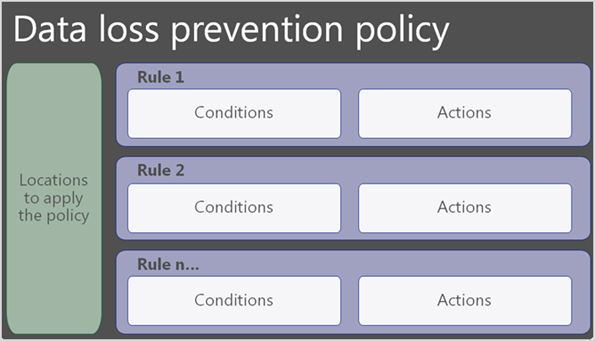
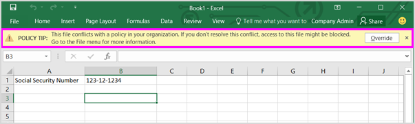

# Referencia de directiva de prevención de pérdida de datos

Las directivas de prevención de pérdida de datos (DLP) tienen muchos componentes que configurar. Para crear una directiva eficaz, debe comprender cuál es el propósito de cada componente y cómo su configuración modifica el comportamiento de la directiva. En este artículo se proporciona una anatomía detallada de una directiva DLP.

## Plantillas de directiva 

Las plantillas de directiva DLP se ordenan previamente en cuatro categorías:

- Aquellas que pueden detectar y proteger tipos de **información** financiera.
- Aquellas que pueden detectar y proteger tipos de **información médica y de** salud.
- Aquellas que pueden detectar y proteger tipos **de información de** privacidad.
- Plantilla **personalizada** que puede usar para crear su propia directiva si una de las otras no satisface las necesidades de las organizaciones.

En esta tabla se enumeran todas las plantillas de directiva y los tipos de información confidencial (SIT) que cubren. 

actualizado: 23/06/2021

|Categoría| Plantilla | SIT |
|---------|---------|---------|
|Financiera| Datos financieros de Australia| - [Código SWIFT](sensitive-information-type-entity-definitions.md#swift-code)   - [Número de archivo fiscal de Australia](sensitive-information-type-entity-definitions.md#australia-tax-file-number)   - [Número de cuenta bancaria de Australia](sensitive-information-type-entity-definitions.md#australia-bank-account-number)   - [Número de tarjeta de crédito](sensitive-information-type-entity-definitions.md#credit-card-number)|
|Financiera| Datos financieros de Canadá |- [Número de tarjeta de crédito](sensitive-information-type-entity-definitions.md#credit-card-number)   - [Número de cuenta bancaria de Canadá](sensitive-information-type-entity-definitions.md#canada-bank-account-number)|
|Financiera| Datos financieros de Francia |- [Número de tarjeta de crédito](sensitive-information-type-entity-definitions.md#credit-card-number)   - [Número de tarjeta de débito de la UE](sensitive-information-type-entity-definitions.md#eu-debit-card-number)|
|Financiera| Datos financieros de Alemania |- [Número de tarjeta de crédito](sensitive-information-type-entity-definitions.md#credit-card-number)   - [Número de tarjeta de débito de la UE](sensitive-information-type-entity-definitions.md#eu-debit-card-number)|
|Financiera| Datos financieros de Israel |- [Número de cuenta bancaria de Israel](sensitive-information-type-entity-definitions.md#israel-bank-account-number)   - [Código SWIFT](sensitive-information-type-entity-definitions.md#swift-code)   - [Número de tarjeta de crédito](sensitive-information-type-entity-definitions.md#credit-card-number)|
|Financiera| Datos financieros de Japón |- [Número de cuenta bancaria de Japón](sensitive-information-type-entity-definitions.md#japan-bank-account-number)   - [Número de tarjeta de crédito](sensitive-information-type-entity-definitions.md#credit-card-number)|
|Financiera| Estándar de seguridad de datos PCI (PCI DSS)|- [Número de tarjeta de crédito](sensitive-information-type-entity-definitions.md#credit-card-number)|
|Financiera| Ley contra la criminalidad cibernética de Arabia Saudí|- [Código SWIFT](sensitive-information-type-entity-definitions.md#swift-code)   - [Número de cuenta bancaria internacional (IBAN)](sensitive-information-type-entity-definitions.md#international-banking-account-number-iban) |
|Financiera| Datos financieros de Arabia Saudí |- [Número de tarjeta de crédito](sensitive-information-type-entity-definitions.md#credit-card-number)   - [Código SWIFT](sensitive-information-type-entity-definitions.md#swift-code)   - [Número de cuenta bancaria internacional (IBAN)](sensitive-information-type-entity-definitions.md#international-banking-account-number-iban)|
|Financiera| Datos financieros del Reino Unido|- [Número de tarjeta de crédito](sensitive-information-type-entity-definitions.md#credit-card-number)   - [Número de tarjeta de débito de la UE](sensitive-information-type-entity-definitions.md#eu-debit-card-number)   - [Código SWIFT](sensitive-information-type-entity-definitions.md#swift-code)|
|Financiera| Datos financieros de EE. UU.|- [Número de tarjeta de crédito](sensitive-information-type-entity-definitions.md#credit-card-number)   - [Número de cuenta bancaria de EE. UU.](sensitive-information-type-entity-definitions.md#us-bank-account-number)  - [Número de enrutamiento de ABA](sensitive-information-type-entity-definitions.md#aba-routing-number)|
|Financiera| Normas del consumidor de la Comisión Federal de Comercio de los EE.UU.|- [Número de tarjeta de crédito](sensitive-information-type-entity-definitions.md#credit-card-number)   - [Número de cuenta bancaria de EE. UU.](sensitive-information-type-entity-definitions.md#us-bank-account-number)  - [Número de enrutamiento de ABA](sensitive-information-type-entity-definitions.md#aba-routing-number)|
|Financiera| Ley Gramm-Leach-Bliley (GLBA) de Ee.UU. Mejorada|- [Número de tarjeta de crédito](sensitive-information-type-entity-definitions.md#credit-card-number)   - [Número de cuenta bancaria de EE. UU.](sensitive-information-type-entity-definitions.md#us-bank-account-number)  - [Número de identificación de contribuyente individual (ITIN) de ESTADOS UNIDOS](sensitive-information-type-entity-definitions.md#us-individual-taxpayer-identification-number-itin)    - [Número de seguridad social (SSN) de Estados Unidos](sensitive-information-type-entity-definitions.md#us-social-security-number-ssn)  - [Número de pasaporte de Ee.UU. /Reino Unido](sensitive-information-type-entity-definitions.md#us--uk-passport-number)   -[Número de licencia de conducir de EE. UU.](sensitive-information-type-entity-definitions.md#us-drivers-license-number)|
|Financiera| Ley Gramm-Leach-Bliley (GLBA) de EE.UU.|- [Número de tarjeta de crédito](sensitive-information-type-entity-definitions.md#credit-card-number)   - [Número de cuenta bancaria de EE. UU.](sensitive-information-type-entity-definitions.md#us-bank-account-number)  - [Número de identificación de contribuyente individual (ITIN) de ESTADOS UNIDOS](sensitive-information-type-entity-definitions.md#us-individual-taxpayer-identification-number-itin)    - [Número de seguridad social (SSN) de Estados Unidos](sensitive-information-type-entity-definitions.md#us-social-security-number-ssn)|
|Medicina y salud| Ley de registros de salud de Australia (ley HRIP) mejorada |- [Número de archivo fiscal de Australia](sensitive-information-type-entity-definitions.md#australia-tax-file-number)   - [Número de cuenta médica de Australia](sensitive-information-type-entity-definitions.md#australia-medical-account-number)|
|Medicina y salud| Ley de registros de salud de Australia (Ley HRIP)|- [Número de archivo fiscal de Australia](sensitive-information-type-entity-definitions.md#australia-tax-file-number)   - [Número de cuenta médica de Australia](sensitive-information-type-entity-definitions.md#australia-medical-account-number)|
|Medicina y salud| Ley de información sobre salud (HIA) de Canadá |- [Número de pasaporte de Canadá](sensitive-information-type-entity-definitions.md#canada-passport-number)  - [Número de seguro social de Canadá](sensitive-information-type-entity-definitions.md#canada-social-insurance-number)   - [Número de servicio de salud de Canadá](sensitive-information-type-entity-definitions.md#canada-health-service-number)   - [Número de identificación de salud personal de Canadá](sensitive-information-type-entity-definitions.md#canada-personal-health-identification-number-phin)|
|Medicina y salud| Canada Personal Health Information Act (PHIA) Manitoba|- [Número de seguro social de Canadá](sensitive-information-type-entity-definitions.md#canada-social-insurance-number)   - [Número de servicio de salud de Canadá](sensitive-information-type-entity-definitions.md#canada-health-service-number)   - [Número de identificación de salud personal de Canadá](sensitive-information-type-entity-definitions.md#canada-personal-health-identification-number-phin)|
|Medicina y salud| Ley de salud personal de Canadá (PHIPA) Ontario |- [Número de pasaporte de Canadá](sensitive-information-type-entity-definitions.md#canada-passport-number)  - [Número de seguro social de Canadá](sensitive-information-type-entity-definitions.md#canada-social-insurance-number)   - [Número de servicio de salud de Canadá](sensitive-information-type-entity-definitions.md#canada-health-service-number)   - [Número de identificación de salud personal de Canadá](sensitive-information-type-entity-definitions.md#canada-personal-health-identification-number-phin)|
|Medicina y salud| Ley de acceso a informes médicos del Reino Unidos|- [Número de servicio nacional de salud de Reino Unido](sensitive-information-type-entity-definitions.md#uk-national-health-service-number)   - [Número de seguro nacional de Reino Unido (NINO)](sensitive-information-type-entity-definitions.md#uk-national-insurance-number-nino)|
|Medicina y salud| Ley de seguros de salud de ESTADOS UNIDOS (HIPAA) mejorada|  - [Clasificación internacional de las enfermedades (ICD-9-CM)](sensitive-information-type-entity-definitions.md#international-classification-of-diseases-icd-9-cm)   - [Clasificación internacional de las enfermedades (ICD-10-CM)](sensitive-information-type-entity-definitions.md#international-classification-of-diseases-icd-10-cm) |
|Medicina y salud| Ley de seguros de salud (HIPAA) de los EE. UU.| - [Clasificación internacional de las enfermedades (ICD-9-CM)](sensitive-information-type-entity-definitions.md#international-classification-of-diseases-icd-9-cm)   - [Clasificación internacional de las enfermedades (ICD-10-CM)](sensitive-information-type-entity-definitions.md#international-classification-of-diseases-icd-10-cm)|
|Privacidad| Ley de privacidad de Australia mejorada|- [Número de licencia de conducir de Australia](sensitive-information-type-entity-definitions.md#australia-drivers-license-number)   - [Número de pasaporte de Australia](sensitive-information-type-entity-definitions.md#australia-passport-number)|
|Privacidad| Ley de privacidad de Australia|- [Número de licencia de conducir de Australia](sensitive-information-type-entity-definitions.md#australia-drivers-license-number)   - [Número de pasaporte de Australia](sensitive-information-type-entity-definitions.md#australia-passport-number)|
|Privacidad| Datos de identificación personal (PII) de Australia|- [Número de archivo fiscal de Australia](sensitive-information-type-entity-definitions.md#australia-tax-file-number)   - [Número de licencia de conducir de Australia](sensitive-information-type-entity-definitions.md#australia-drivers-license-number)|
|Privacidad| Datos de identificación personal de Canadá (PII)|- [Número de licencia de conducir de Canadá](sensitive-information-type-entity-definitions.md#canada-drivers-license-number)  - [Número de cuenta bancaria de Canadá](sensitive-information-type-entity-definitions.md#canada-bank-account-number)   - [Número de pasaporte de Canadá](sensitive-information-type-entity-definitions.md#canada-passport-number)  - [Número de seguro social de Canadá](sensitive-information-type-entity-definitions.md#canada-social-insurance-number)   - [Número de servicio de salud de Canadá](sensitive-information-type-entity-definitions.md#canada-health-service-number)   - [Número de identificación de salud personal de Canadá](sensitive-information-type-entity-definitions.md#canada-personal-health-identification-number-phin)|
|Privacidad| Ley de protección de información personal de Canadá (PIPA)|- [Número de pasaporte de Canadá](sensitive-information-type-entity-definitions.md#canada-passport-number)  - [Número de seguro social de Canadá](sensitive-information-type-entity-definitions.md#canada-social-insurance-number)   - [Número de servicio de salud de Canadá](sensitive-information-type-entity-definitions.md#canada-health-service-number)   - [Número de identificación de salud personal de Canadá](sensitive-information-type-entity-definitions.md#canada-personal-health-identification-number-phin)|
|Privacidad| Ley de protección de información personal de Canadá (PIPEDA)|- [Número de pasaporte de Australia](sensitive-information-type-entity-definitions.md#australia-passport-number)   [Número de licencia de conducir de Canadá](sensitive-information-type-entity-definitions.md#canada-drivers-license-number)   - [Número de cuenta bancaria de Canadá](sensitive-information-type-entity-definitions.md#canada-bank-account-number)   - [Número de pasaporte de Canadá](sensitive-information-type-entity-definitions.md#canada-passport-number)  - [Número de seguro social de Canadá](sensitive-information-type-entity-definitions.md#canada-social-insurance-number)   - [Número de servicio de salud de Canadá](sensitive-information-type-entity-definitions.md#canada-health-service-number)   - [Número de identificación de salud personal de Canadá](sensitive-information-type-entity-definitions.md#canada-personal-health-identification-number-phin)|
|Privacidad| Ley de protección de datos de Francia|- [Tarjeta de identificación nacional de Francia (CNI)](sensitive-information-type-entity-definitions.md#france-national-id-card-cni)   - [Número de seguridad social de Francia (INSEE)](sensitive-information-type-entity-definitions.md#france-social-security-number-insee)|
|Privacidad| Información de identificación personal (PII) de Francia|- [Número de seguridad social de Francia (INSEE)](sensitive-information-type-entity-definitions.md#france-social-security-number-insee)   - [Número de licencia de conducir de Francia](sensitive-information-type-entity-definitions.md#france-drivers-license-number)   - [Número de pasaporte de Francia](sensitive-information-type-entity-definitions.md#france-passport-number)   - [Tarjeta de identificación nacional de Francia (CNI)](sensitive-information-type-entity-definitions.md#france-national-id-card-cni)|
|Privacidad| Reglamento general de protección de datos (RGPD) mejorado|- [Número de tarjeta de débito de la UE](sensitive-information-type-entity-definitions.md#eu-debit-card-number)   - [Número de licencia de conducir de la UE](sensitive-information-type-entity-definitions.md#eu-drivers-license-number)   - [Número de identificación nacional de la UE](sensitive-information-type-entity-definitions.md#eu-national-identification-number)   - [Número de pasaporte de la UE](sensitive-information-type-entity-definitions.md#eu-passport-number)   - [Número de seguridad social de la UE o identificación equivalente](sensitive-information-type-entity-definitions.md#eu-social-security-number-or-equivalent-identification)   - [Número de identificación fiscal de la UE](sensitive-information-type-entity-definitions.md#eu-tax-identification-number)| 
|Privacidad| Reglamento general de protección de datos (RGPD)|- [Número de tarjeta de débito de la UE](sensitive-information-type-entity-definitions.md#eu-debit-card-number)   - [Número de licencia de conducir de la UE](sensitive-information-type-entity-definitions.md#eu-drivers-license-number)   - [Número de identificación nacional de la UE](sensitive-information-type-entity-definitions.md#eu-national-identification-number)  - [Número de pasaporte de la UE](sensitive-information-type-entity-definitions.md#eu-passport-number)   - [Número de seguridad social de la UE o identificación equivalente](sensitive-information-type-entity-definitions.md#eu-social-security-number-or-equivalent-identification)  - [Número de identificación fiscal de la UE](sensitive-information-type-entity-definitions.md#eu-tax-identification-number)|
|Privacidad| Información de identificación personal (PII) de Alemania|- [Número de licencia de conducir de Alemania](sensitive-information-type-entity-definitions.md#germany-drivers-license-number)   - [Número de pasaporte de Alemania](sensitive-information-type-entity-definitions.md#germany-passport-number)| 
|Privacidad| Información de identificación personal (PII) de Israel|- [Número de identificación nacional de Israel](sensitive-information-type-entity-definitions.md#israel-national-identification-number)| 
|Privacidad| Protección de privacidad en Israel|- [Número de identificación nacional de Israel](sensitive-information-type-entity-definitions.md#israel-national-identification-number)  - [Número de cuenta bancaria de Israel](sensitive-information-type-entity-definitions.md#israel-bank-account-number)|
|Privacidad| Datos de información de identificación personal (PII) de Japón mejorados|- [Número de seguro social de Japón (SIN)](sensitive-information-type-entity-definitions.md#japan-social-insurance-number-sin)  - [Japón Mi número: personal](sensitive-information-type-entity-definitions.md#japan-my-number---personal)  - [Número de pasaporte de Japón](sensitive-information-type-entity-definitions.md#japan-passport-number)  - [Número de licencia de conducir de Japón](sensitive-information-type-entity-definitions.md#japan-drivers-license-number)|
|Privacidad| Datos de identificación personal (PII) de Japón|- [Número de registro de residente de Japón](sensitive-information-type-entity-definitions.md#japan-resident-registration-number)   - [Número de seguro social de Japón (SIN)](sensitive-information-type-entity-definitions.md#japan-social-insurance-number-sin)|
|Privacidad| Protección de la información personal mejorada en Japón|- [Número de seguro social de Japón (SIN)](sensitive-information-type-entity-definitions.md#japan-social-insurance-number-sin)   - [Japón Mi número: personal](sensitive-information-type-entity-definitions.md#japan-my-number---personal)  - [Número de pasaporte de Japón](sensitive-information-type-entity-definitions.md#japan-passport-number)   - [Número de licencia de conducir de Japón](sensitive-information-type-entity-definitions.md#japan-drivers-license-number)| 
|Privacidad| Protección de información personal de Japón|- [Número de registro de residente de Japón](sensitive-information-type-entity-definitions.md#japan-resident-registration-number)  - [Número de seguro social de Japón (SIN)](sensitive-information-type-entity-definitions.md#japan-social-insurance-number-sin)|
|Privacidad| Datos de identificación personal (PII) de Arabia Saudí|- [Id. nacional de Arabia Saudí](sensitive-information-type-entity-definitions.md#saudi-arabia-national-id)|
|Privacidad| Ley de protección de datos del Reino Unido|- [Número de seguro nacional de Reino Unido (NINO)](sensitive-information-type-entity-definitions.md#uk-national-insurance-number-nino)   - [Número de pasaporte de Ee.UU. /Reino Unido](sensitive-information-type-entity-definitions.md#us--uk-passport-number)   - [Código SWIFT](sensitive-information-type-entity-definitions.md#swift-code)|
|Privacidad| Normas de comunicaciones electrónicas y privacidad del Reino Unido|- [Código SWIFT](sensitive-information-type-entity-definitions.md#swift-code)|
|Privacidad| Información de identificación personal (PII) del Reino Unido|- [Número de seguro nacional de Reino Unido (NINO)](sensitive-information-type-entity-definitions.md#uk-national-insurance-number-nino)   - [Número de pasaporte de Ee.UU. /Reino Unido](sensitive-information-type-entity-definitions.md#us--uk-passport-number)|
|Privacidad| Código de prácticas en línea de información personal (PIOCP) del Reino Unido|- [Número de seguro nacional de Reino Unido (NINO)](sensitive-information-type-entity-definitions.md#uk-national-insurance-number-nino)   - [Número de servicio nacional de salud de Reino Unido](sensitive-information-type-entity-definitions.md#uk-national-health-service-number)   - [Código SWIFT](sensitive-information-type-entity-definitions.md#swift-code)|
|Privacidad| Acto patriota de EE.UU. mejorado|- [Número de tarjeta de crédito](sensitive-information-type-entity-definitions.md#credit-card-number)   - [Número de cuenta bancaria de EE. UU.](sensitive-information-type-entity-definitions.md#us-bank-account-number)  - [Número de identificación de contribuyente individual (ITIN) de ESTADOS UNIDOS](sensitive-information-type-entity-definitions.md#us-individual-taxpayer-identification-number-itin)    - [Número de seguridad social (SSN) de Estados Unidos](sensitive-information-type-entity-definitions.md#us-social-security-number-ssn)|
|Privacidad| Ley Patriota de los EE.UU.|- [Número de tarjeta de crédito](sensitive-information-type-entity-definitions.md#credit-card-number)   - [Número de cuenta bancaria de EE. UU.](sensitive-information-type-entity-definitions.md#us-bank-account-number)  - [Número de identificación de contribuyente individual (ITIN) de ESTADOS UNIDOS](sensitive-information-type-entity-definitions.md#us-individual-taxpayer-identification-number-itin)    - [Número de seguridad social (SSN) de Estados Unidos](sensitive-information-type-entity-definitions.md#us-social-security-number-ssn)|
|Privacidad| Datos mejorados de información de identificación personal (PII) de EE.UU.|- [Número de identificación de contribuyente individual (ITIN) de ESTADOS UNIDOS](sensitive-information-type-entity-definitions.md#us-individual-taxpayer-identification-number-itin)    - [Número de seguridad social (SSN) de Estados Unidos](sensitive-information-type-entity-definitions.md#us-social-security-number-ssn)  - [Número de pasaporte de Ee.UU. /Reino Unido](sensitive-information-type-entity-definitions.md#us--uk-passport-number)|
|Privacidad| Información de identificación personal (PII) de Estados Unidos|- [Número de identificación de contribuyente individual (ITIN) de ESTADOS UNIDOS](sensitive-information-type-entity-definitions.md#us-individual-taxpayer-identification-number-itin)    - [Número de seguridad social (SSN) de Estados Unidos](sensitive-information-type-entity-definitions.md#us-social-security-number-ssn)  - [Número de pasaporte de Ee.UU. /Reino Unido](sensitive-information-type-entity-definitions.md#us--uk-passport-number)|
|Privacidad| Mejoradas las leyes de notificación de infracciones de Estado de EE.UU.|- [Número de tarjeta de crédito](sensitive-information-type-entity-definitions.md#credit-card-number)   - [Número de cuenta bancaria de EE. UU.](sensitive-information-type-entity-definitions.md#us-bank-account-number)  -[Número de licencia de conducir de EE. UU.](sensitive-information-type-entity-definitions.md#us-drivers-license-number)   - [Número de seguridad social (SSN) de Estados Unidos](sensitive-information-type-entity-definitions.md#us-social-security-number-ssn)   - [Número de pasaporte de Ee.UU. /Reino Unido](sensitive-information-type-entity-definitions.md#us--uk-passport-number)|
|Privacidad| Leyes de notificación de incumplimiento estatal de EE.UU.|- [Número de tarjeta de crédito](sensitive-information-type-entity-definitions.md#credit-card-number)   - [Número de cuenta bancaria de EE. UU.](sensitive-information-type-entity-definitions.md#us-bank-account-number)  -[Número de licencia de conducir de EE. UU.](sensitive-information-type-entity-definitions.md#us-drivers-license-number)   - [Número de seguridad social (SSN) de Estados Unidos](sensitive-information-type-entity-definitions.md#us-social-security-number-ssn)|
|Privacidad| Leyes de confidencialidad sobre el número de Seguridad Social de EE.UU.|- [Número de seguridad social (SSN) de Estados Unidos](sensitive-information-type-entity-definitions.md#us-social-security-number-ssn)| 

## Ubicaciones

Una directiva DLP puede buscar y proteger elementos que contienen información confidencial en varias ubicaciones.

|Ubicación  |Ámbito incluir/excluir  |Estado de datos  |Requisitos previos adicionales |
|---------|---------|---------|---------|
|Exchange correo electrónico en línea |grupo de distribución | datos en movimiento| No |
|SharePoint en línea   |sites       | data-at-rest   datos en uso | No|
|Cuentas de OneDrive para la Empresa| cuenta o grupo de distribución |data-at-rest   datos en uso|No|
|Mensajes de canales y chats de Teams     | cuenta o grupo de distribución |datos en movimiento   datos en uso |  No       |
|Microsoft Defender for Cloud Apps   | Instancia de aplicación en la nube       |data-at-rest         | - [Usar directivas de prevención de pérdida de datos para aplicaciones en la nube que no son de Microsoft](dlp-use-policies-non-microsoft-cloud-apps.md#use-data-loss-prevention-policies-for-non-microsoft-cloud-apps)        |
|Dispositivos  |usuario o grupo         |data-at-rest    datos en uso    datos en movimiento         |- [Obtenga información sobre Microsoft 365 prevención de pérdida de datos de punto de conexión](endpoint-dlp-learn-about.md#learn-about-microsoft-365-endpoint-data-loss-prevention)  - [Introducción a la prevención de pérdida de datos de punto de conexión](endpoint-dlp-getting-started.md#get-started-with-endpoint-data-loss-prevention)  - [Configurar la configuración de proxy de dispositivo y conexión a Internet para Information Protection](device-onboarding-configure-proxy.md#configure-device-proxy-and-internet-connection-settings-for-information-protection) |
|Repositorios locales (recursos compartidos de archivos y SharePoint)    |repositorio         | data-at-rest         | - [Obtenga información sobre el Microsoft 365 de prevención de pérdida de datos local](dlp-on-premises-scanner-learn.md#learn-about-the-microsoft-365-data-loss-prevention-on-premises-scanner)   - [Introducción al escáner local de prevención de pérdida de datos](dlp-on-premises-scanner-get-started.md#get-started-with-the-data-loss-prevention-on-premises-scanner)         |

Si elige incluir grupos de distribución que son específicos en Exchange, la directiva de DLP se aplicará solo a los miembros de ese grupo. Igualmente, la exclusión de un grupo de distribución excluirá a todos los miembros de dicho grupo de distribución de la evaluación de la directiva. Puede escoger entre definir una directiva para los miembros de las listas de distribución, los grupos de distribución dinámicos y los grupos de seguridad. Una directiva DLP no puede contener más de 50 de estas inclusiones y exclusiones.

Si elige incluir o excluir sitios de SharePoint o cuentas de OneDrive específicos, una directiva DLP no puede contener más de 100 inclusiones y exclusiones. Aunque este límite exista, puede superarlo si aplica una directiva para toda la organización o aplicada a ubicaciones completas.

Si decide incluir o excluir grupos o cuentas de OneDrive específicas, una directiva DLP no puede contener más de 100 cuentas de usuario o 50 grupos como inclusión o exclusión.

### Compatibilidad con la ubicación para definir el contenido

Las directivas DLP detectan elementos confidenciales si los coinciden con un tipo de información confidencial (SIT), una etiqueta de confidencialidad o una etiqueta de retención. Cada ubicación admite diferentes métodos para definir contenido confidencial. Al combinar ubicaciones en una directiva, la forma en que se puede definir el contenido puede cambiar de la forma en que se puede definir mediante una sola ubicación. 

> [!IMPORTANT]
> Al seleccionar varias ubicaciones para una directiva, un valor "no" para una categoría de definición de contenido tiene prioridad sobre el valor "sí". Por ejemplo, cuando selecciona solo SharePoint sitios, la directiva admitirá la detección de elementos confidenciales por uno o más de SIT, por etiqueta de confidencialidad o por etiqueta de retención. Sin embargo, al seleccionar SharePoint ***sitios*** y Teams de mensajes de chat y canal, la directiva solo admitirá la detección de elementos confidenciales por SIT.

|Ubicación| Sit puede definir el contenido| El contenido se puede definir etiqueta de confidencialidad| El contenido se puede definir mediante la etiqueta de retención|
|---------|---------|---------|---------|
|Exchange correo electrónico en línea|Sí| Sí| No|
|SharePoint en línea| Sí| Sí| Sí|
|Cuentas de OneDrive para la Empresa| Sí| Sí| Sí|
|Teams chat y canal | Sí| No| No|
|Dispositivos |Sí | Sí|  No|
|Microsoft Defender for Cloud Apps | Sí| Sí| Sí|
|Repositorios locales| Sí| Sí| No|

> [!NOTE]
> DLP admite la detección de etiquetas de confidencialidad en correos electrónicos y attachemnets Vea, Usar etiquetas de confidencialidad [como condiciones en directivas DLP](dlp-sensitivity-label-as-condition.md#use-sensitivity-labels-as-conditions-in-dlp-policies).

## Rules

<!--This section introduces the classifications of content that, when detected, can be protected. Link out to [Learn about sensitive information types]() and [Sensitive information type entity definitions](sensitive-information-type-entity-definitions.md#sensitive-information-type-entity-definitions) as well as labels (cross referenced by supporting workload). It will touch on the purpose of multiple conditions, confidence levels (link out to [more on confidence levels](sensitive-information-type-learn-about.md#more-on-confidence-levels)) and confidence levels video. How to use the confidence level to change the behavior of a policy in conjunction with the instance count.  eg. if you want your policy to trigger when it encounters situation DEF, set your conditions like HIJ.-->
<!--
- What is a rule in the context of a Policy?
- when and why should I have more than one rule?
- The purpose of rule groups
- How do I tune the behavior of a Policy through the tuning of rules
- what's in a rule-->

Las reglas son la lógica empresarial de las directivas DLP. Constan de:

- [**Condiciones**](#conditions) que cuando coinciden, desencadenan la directiva
- [**Excepciones**](#exceptions) a las condiciones
- [**Acciones**](#actions) que se deben realizar cuando se desencadene la directiva
- [**Notificaciones de usuario para**](#user-notifications-and-policy-tips) informar a los usuarios cuando están haciendo algo que desencadena una directiva y ayudarles a educarlos sobre cómo su organización quiere tratar la información confidencial
- [**Invalidaciones de usuario**](#user-overrides) cuando las configura un administrador, permiten a los usuarios invalidar selectivamente una acción de bloqueo
- [**Informes de incidentes**](#incident-reports) que notifican a los administradores y otras partes interesadas clave cuando se produce una coincidencia de reglas
- [**Opciones adicionales**](#additional-options) que definen la prioridad para la evaluación de reglas y pueden detener el procesamiento de reglas y directivas adicionales.

 Una directiva contiene una o varias reglas. Las reglas se ejecutan secuencialmente, comenzando por la regla de mayor prioridad de cada directiva.

### Prioridad por la que se procesan las reglas

#### Cargas de trabajo de servicio hospedado

Para las cargas de trabajo del servicio hospedado, como Exchange Online, SharePoint Online y OneDrive para la Empresa, a cada regla se le asigna una prioridad en el orden en que se crea. Esto significa que la regla creada primero tiene primera prioridad, la regla creada en segundo lugar tiene la segunda prioridad, y así sucesivamente. 
  

Cuando se evalúa el contenido frente a reglas, estas se procesan en orden de prioridad. Si el contenido coincide con varias reglas, se aplica la primera regla que tiene la *acción* más restrictiva. Por ejemplo, si el contenido coincide con todas las reglas siguientes, se aplica la regla *3* porque es la regla más restrictiva y de mayor prioridad:
  
- Regla 1: solo notifica a los usuarios
- Regla 2: notifica a los usuarios, restringe el acceso y permite invalidaciones de usuario
- *Regla 3: notifica a los usuarios, restringe el acceso y no permite invalidaciones de usuario*
- Regla 4: restringe el acceso

Las reglas 1, 2 y 4 se evaluarían, pero no se aplicarían. En este ejemplo, las coincidencias de todas las reglas se registran en los registros de auditoría y se muestran en los informes DLP, aunque solo se aplique la regla más restrictiva.

Puede usar una regla para satisfacer un requisito de protección específico y después usar una directiva DLP para agrupar los requisitos de protección comunes, como todas las reglas necesarias para cumplir una normativa específica.
  
Por ejemplo, podría tener una directiva DLP que ayude a detectar la presencia de información sujeta a la Ley de transferencia y responsabilidad de seguros de salud (HIPAA). Esta directiva DLP podría ayudar a proteger los datos HIPAA (el qué) en todos los sitios de SharePoint Online y OneDrive para la Empresa (el dónde) al buscar cualquier documento que contenga información confidencial y que se comparte con personas de fuera de la organización (las condiciones) y, a continuación, bloquear el acceso al documento y enviar una notificación (las acciones). Estos requisitos se almacenan como reglas individuales y se agrupan de forma conjunta como directiva DLP para simplificar la administración y la creación de informes.
  

#### Para puntos de conexión

La prioridad de las reglas en los puntos de conexión también se asigna según el orden en que se crea. Esto significa que la regla creada primero tiene primera prioridad, la regla creada en segundo lugar tiene la segunda prioridad, y así sucesivamente. 

Cuando un archivo de un extremo coincide con varias directivas DLP, la primera regla habilitada con restricciones es la que se aplica al contenido. Por ejemplo, si el contenido coincide con todas las reglas siguientes, se aplica la regla *2* porque es la regla de mayor prioridad que está configurada con una restricción .
  
- Regla 1: solo notifica a los usuarios
- *Regla 2: notifica a los usuarios, restringe el acceso y permite invalidaciones de usuario*
- Regla 3: notifica a los usuarios, restringe el acceso y no permite invalidaciones de usuario
- Regla 4: restringe el acceso

Las reglas 1, 3 y 4 se evaluarían, pero no se aplicarían. En este ejemplo, las coincidencias de todas las reglas se registran en los registros de auditoría y se muestran en los informes DLP, aunque solo se aplique la primera regla con una restricción.

Para las reglas que se aplican a los puntos de conexión, puede aprovechar la capacidad de volver a ordenar la prioridad de regla para asegurarse de que se aplican las restricciones que desea aplicar.

### Condiciones

Las condiciones son inclusivas y son donde se define lo que desea que busque la regla y el contexto en el que se usan esos elementos. Le dicen a la regla &#8212; cuando encuentre  un elemento que tenga este aspecto y se esté utilizando como ese *&#8212;* es una coincidencia y el resto de las acciones de la directiva deben realizarse en él. Puede usar condiciones para asignar acciones diferentes a distintos niveles de riesgo. Por ejemplo, el contenido confidencial compartido internamente podría ser de menor riesgo y necesitar menos acciones que el contenido confidencial compartido con personas de fuera de la organización.

> [!NOTE]
> Los usuarios que tienen cuentas que no son de invitado en el espacio empresarial de Active Directory o de Azure Active Directory de una organización anfitriona se consideran como personas dentro de la organización. 

#### El contenido contiene

 Todas las ubicaciones compatibles con **el contenido contiene** la condición. Puede seleccionar varias instancias de cada tipo de contenido y refinar aún más las condiciones mediante los operadores **Cualquiera** de estos (OR lógico) o Todos estos **operadores** (AND lógicos):

- [tipos de información confidencial](sensitive-information-type-learn-about.md#learn-about-sensitive-information-types)
- [etiquetas de confidencialidad](sensitivity-labels.md)
- [etiquetas de retención](retention.md#using-a-retention-label-as-a-condition-in-a-dlp-policy)

según las [ubicación(s)](#location-support-for-how-content-can-be-defined) a las que elija aplicar la directiva. 

La regla solo buscará la presencia de las etiquetas de confidencialidad y **las** etiquetas **de retención** que elija. 

Los SIT tienen un nivel de confianza [**predefinido**](https://www.microsoft.com/videoplayer/embed/RE4Hx60) que puede modificar si es necesario. Para obtener más información, vea [Más información sobre los niveles de confianza](sensitive-information-type-learn-about.md#more-on-confidence-levels). 

> [!IMPORTANT]
> Los SIT tienen dos formas diferentes de definir los parámetros de recuento de instancias únicos máximos. Para obtener más información, consulte [Instance count supported values for SIT](create-a-custom-sensitive-information-type.md#instance-count-supported-values-for-sit).

#### Contexto de condición

Las opciones de contexto disponibles cambian según la ubicación que elija. Si selecciona varias ubicaciones, solo estarán disponibles las condiciones que tienen las ubicaciones en común.

##### Las Exchange admiten:

- El contenido contiene
- El contenido se comparte desde Microsoft 365
- El contenido se recibe desde
- La dirección IP del remitente es
- Ha invalidado el remitente la sugerencia de directiva
- El remitente es
- El dominio del remitente es
- La dirección del remitente contiene palabras
- La dirección del remitente contiene patrones
- El atributo AD del remitente contiene palabras o frases
- Atributo de AD del remitente coincide con patrones
- El remitente es miembro de
- No se pudo digitalizar algún contenido de los datos adjuntos del correo
- No se pudo completar el análisis de algún contenido de los datos adjuntos del correo
- Los datos adjuntos están protegidos con contraseña
- La extensión de archivo es
- Recipient es miembro de
- El dominio del destinatario es
- El destinatario es
- La dirección del destinatario contiene palabras
- La dirección del destinatario coincide con patrones
- Recipient AD Attribute contiene palabras o frases
- Atributo ad de destinatario coincide con patrones
- El nombre del documento contiene palabras o frases
- El nombre del documento coincide con los patrones
- La propiedad del documento es
- El tamaño del documento es igual o mayor que
- El contenido del documento contiene palabras o frases
- El contenido del documento coincide con los patrones
- Asunto contiene palabras o frases
- El asunto coincide con patrones
- Asunto o Cuerpo contiene palabras o frases
- Asunto o cuerpo coincide con patrones
- El juego de caracteres de contenido contiene palabras
- El encabezado contiene palabras o frases
- El encabezado coincide con patrones
- El tamaño del mensaje es igual o mayor que
- El tipo de mensaje es
- La importancia del mensaje es

##### Condiciones SharePoint admite
 
- El contenido contiene
- El contenido se comparte desde Microsoft 365
- La extensión de archivo es
- La propiedad del documento es

##### Condiciones OneDrive cuentas compatibles

- El contenido contiene
- El contenido se comparte desde Microsoft 365
- La extensión de archivo es
- La propiedad del documento es

##### Condiciones Teams compatibilidad con mensajes de canal y chat

- El contenido contiene
- El contenido se comparte desde Microsoft 365
- El remitente es (versión preliminar)
- El dominio del remitente es (versión preliminar)
- El dominio de destinatario es (versión preliminar)
- Recipient es (versión preliminar)

##### Condiciones Compatibles con dispositivos

- El contenido contiene
- Vea, [Actividades de extremo en las que puede supervisar y realizar acciones](endpoint-dlp-learn-about.md#endpoint-activities-you-can-monitor-and-take-action-on)

##### Condiciones de compatibilidad de Microsoft Defender para Aplicaciones en la nube

- El contenido contiene
- El contenido se comparte desde Microsoft 365

##### Repositorios locales

- El contenido contiene
- La extensión de archivo es
- La propiedad del documento es

#### Grupos de condiciones

A veces, necesita una regla para identificar solo una cosa, como todo el contenido que contiene un número de seguridad social de Estados Unidos, que se define mediante un único SIT. Pero en muchos escenarios, donde los tipos de elementos que intenta identificar son más complejos y, por lo tanto, más difíciles de definir, se requiere más flexibilidad para definir condiciones.

Por ejemplo, para identificar el contenido sujeto a la Ley de seguros de salud (HIPAA) de Estados Unidos, debe buscar:
  
- Contenido que incluye tipos concretos de información confidencial, como un Número de la Seguridad social o un Número de la Agencia antidroga (DEA) de Estados Unidos.
    
    Y
    
- Contenido que es más difícil identificar, como las comunicaciones sobre la atención a un paciente o las descripciones de los servicios médicos proporcionados. La identificación de este tipo de contenido requiere que coincida con las palabras clave de una lista grande, como la Clasificación internacional de enfermedades (ICD-9-CM o ICD-10-CM).
    
Puede identificar este tipo de datos agrupando condiciones y usando operadores lógicos (AND, OR) entre los grupos.
    
Para la Ley de seguros de salud de Estados Unidos **(HIPPA),** las condiciones se agrupan de esta manera:

El primer grupo contiene los SIT que identifican e individualmente y el segundo grupo contiene los SIT que identifican el diagnóstico médico.

### Excepciones

En las reglas, las excepciones definen condiciones que se usan para excluir un elemento de la directiva. Lógicamente, condiciones exclusivas que se evalúan después de las condiciones inclusivas y el contexto. Le dicen a la regla &#8212; cuando encuentre  un elemento que  tenga este aspecto y se esté utilizando de la forma que es una coincidencia y el resto de las acciones de la directiva deben realizarse en él excepto si ***...***&#8212; 

Por ejemplo, manteniendo la directiva HIPPA, podríamos modificar la regla para excluir cualquier elemento que contenga un número de licencia de conducir de Bélgica, como este:

Las condiciones de excepciones admitidas por ubicación son idénticas a todas las condiciones de inclusión, con la única diferencia de que se antepone "Excepto si" a cada condición admitida. Si una regla solo contiene excepciones, se aplicará a todos los correos electrónicos o archivos que no cumplan los criterios de exclusión.

Al igual que todas las ubicaciones admiten la condición inclusiva:

- El contenido contiene

la excepción sería:

- **Excepto si el** contenido contiene 

### Acciones 

Cualquier elemento que lo haga a través _**_ de las condiciones _**_ ***** inclusivas _ y los filtros de excepciones exclusivas tendrán todas las acciones que se definen en la regla aplicada a él. Tendrás que configurar las opciones necesarias para admitir la acción. Por ejemplo, si selecciona Exchange con la acción _ Restringir el acceso o cifrar el contenido en Microsoft 365 *ubicaciones** debe elegir entre estas opciones:

- Impedir que los usuarios tengan acceso a SharePoint, OneDrive y contenido Teams compartido
    - Bloquear a todos. Solo el propietario de contenido, el último modificador y el administrador del sitio seguirán teniendo acceso
    - Bloquear solo personas de fuera de la organización. Los usuarios de la organización seguirán teniendo acceso.
- Cifrar mensajes de correo electrónico (solo se aplica al contenido de Exchange)

Las acciones que están disponibles en una regla dependen de las ubicaciones que se hayan seleccionado. Si selecciona solo una ubicación para la directiva a la que se aplicará, las acciones disponibles se enumeran a continuación.

> [!IMPORTANT]
> Para SharePoint Online y OneDrive para la Empresa los documentos de ubicaciones se bloquearán proactivamente justo después de la detección de información confidencial, independientemente de si el documento se comparte o no, para todos los usuarios externos, mientras que los usuarios internos seguirán teniendo acceso al documento.

#### Exchange de ubicación:

- Restringir el acceso o cifrar el contenido en Microsoft 365 ubicaciones
- Establecer encabezados
- Quitar encabezado
- Redirigir el mensaje a usuarios específicos
- Reenviar el mensaje para su aprobación al administrador del remitente
- Reenviar el mensaje para su aprobación a aprobadores específicos
- Agregar destinatario al cuadro Para
- Agregar destinatario al cuadro Cc
- Agregar destinatario al cuadro CCO
- Agregar el administrador del remitente como destinatario
- Se quitó el cifrado de mensajes de O365 y la protección de derechos
- Anteponer el asunto del correo electrónico
- Agregar declinación de responsabilidades HTML

#### SharePoint de ubicación de sitios:

- Restringir el acceso o cifrar el contenido en Microsoft 365 ubicaciones

#### OneDrive de cuentas:

- Restringir el acceso o cifrar el contenido en Microsoft 365 ubicaciones

#### Teams chat y mensajes de canal

- Restringir el acceso o cifrar el contenido en Microsoft 365 ubicaciones

#### Dispositivos:

- Auditar o restringir actividades en Windows dispositivos

> [!NOTE]
> Los dispositivos dan la opción **de Auditar** una actividad, **Bloquear** una actividad o **Bloquear con invalidar** una actividad.

La ubicación de los dispositivos proporciona muchas subactividades (condiciones) y acciones. Para obtener más información, vea Actividades de extremo en las [que puede supervisar y realizar acciones en](endpoint-dlp-learn-about.md#endpoint-activities-you-can-monitor-and-take-action-on). 

#### Microsoft Defender for Cloud Apps:

- Restringir el acceso o cifrar el contenido en Microsoft 365 ubicaciones
- Restringir aplicaciones de terceros

#### Repositorios locales:

- Restringir el acceso o quitar archivos locales

#### Acciones disponibles al combinar ubicaciones

Si selecciona Exchange y cualquier otra ubicación única para la directiva a la que se va a aplicar, el

- Restringir el acceso o cifrar el contenido en Microsoft 365 ubicaciones

y

- todas las acciones de la ubicación que no Exchange ubicación

acciones estarán disponibles.

Si selecciona dos o más ubicaciones no Exchange para la directiva a la que se va a aplicar, el

- Restringir el acceso o cifrar el contenido en Microsoft 365 ubicaciones

AND

- todas las acciones para ubicaciones que no Exchange de datos 

acciones estarán disponibles.

Por ejemplo, si seleccionas Exchange dispositivos como ubicaciones, estas acciones estarán disponibles:

- Restringir el acceso o cifrar el contenido en Microsoft 365 ubicaciones
- Auditar o restringir actividades en Windows dispositivos

Si selecciona Dispositivos y Microsoft Defender para aplicaciones en la nube, estas acciones estarán disponibles:

- Restringir el acceso o cifrar el contenido en Microsoft 365 ubicaciones
- Auditar o restringir actividades en Windows dispositivos
- Restringir aplicaciones de terceros

Si una acción tiene efecto o no depende de cómo configure el modo de la directiva. Puede elegir ejecutar la directiva en modo de prueba con o sin mostrar la sugerencia de directiva seleccionando la **opción Probarla primero.** Puedes ejecutar la directiva tan pronto como una hora después  de su creación seleccionando la opción Activarla inmediatamente o puedes elegir  simplemente guardarla y volver a ella más adelante seleccionando la opción Mantenerla desactivada. 

<!-- This section needs to explain that the actions available depend on the locations selected AND that the observed behavior of a policy is produced through an interaction of the configured actions AND the configured status (off, test, apply) of a policy. It will detail the purpose of each of the available actions and the location/desired outcome interaction and provide examples eg. how to use the Restrict Third Party apps in the context of a policy that is applied to endpoints so that users can't use a upload content to a third party site or the interaction of on-premises scanner with restrict access or remove on-premises files.  Also what happens when I select multiple locations? provide abundant examples for most common scenarios-->

### Notificaciones de usuario y sugerencias de directivas

<!--This section introduces the business need for user notifications, what they are, their benefit, how to use them, how to customize them, and links out to 

- https://docs.microsoft.com/en-us/microsoft-365/compliance/use-notifications-and-policy-tips?view=o365-worldwide
- https://docs.microsoft.com/en-us/microsoft-365/compliance/dlp-policy-tips-reference?view=o365-worldwide

for where they are used/expected behavior-->

<!--You can use notifications and overrides to educate your users about DLP policies and help them remain compliant without blocking their work. For example, if a user tries to share a document containing sensitive information, a DLP policy can both send them an email notification and show them a policy tip in the context of the document library that allows them to override the policy if they have a business justification.-->

Cuando un usuario intenta realizar una acción en un elemento confidencial en un contexto que cumple las condiciones y excepciones de una regla, puede hacerlo a través de mensajes de correo electrónico de notificación de usuario y en elementos emergentes de sugerencias de directiva de contexto. Estas notificaciones son útiles porque aumentan el conocimiento y ayudan a educar a los usuarios sobre las directivas DLP de su organización.

Por ejemplo, el contenido como un libro de Excel en un sitio de OneDrive para la Empresa que contiene información de identificación personal (PII) y se comparte con un invitado.

> [!NOTE]
> Los correos electrónicos de notificación se envían desprotegidos.

También puede dar a los usuarios la opción de invalidar la [directiva,](#user-overrides)de modo que no se bloqueen si tienen una necesidad empresarial válida o si la directiva detecta un falso positivo.

Las opciones de configuración de notificaciones de usuario y sugerencias de directiva varían en función de las ubicaciones de supervisión que haya seleccionado. Si ha seleccionado:

- Exchange
- SharePoint
- OneDrive
- Teams chat y canal
- Defender for Cloud Apps

Puedes habilitar o deshabilitar las notificaciones de usuario para varias aplicaciones de Microsoft, consulta Referencia de [sugerencias](dlp-policy-tips-reference.md#data-loss-prevention-policy-tips-reference) de directiva de prevención de pérdida de datos

- Puede habilitar o deshabilitar notificar a los usuarios **en Office 365 servicio con** una sugerencia de directiva.
    - notificaciones de correo electrónico al usuario que envió, compartió o modificó por última vez el contenido OR
    - notificar a personas específicas

y personalizar el texto del correo electrónico, el asunto y el texto de la sugerencia de directiva.

Si seleccionaste Solo dispositivos, recibirás todas las mismas opciones que están disponibles para Exchange, SharePoint, OneDrive, chat de Teams y Canal y Defender para aplicaciones en la nube, además de la opción de personalizar el título de notificación y el contenido que aparece en el dispositivo Windows 10.

  

Puede personalizar el título y el cuerpo del texto con estos parámetros. El texto del cuerpo admite lo siguiente:

|Nombre común  |Parámetro  |Ejemplo
|---------|---------|---------|
|nombre de archivo     |%%FileName%% | Contoso doc 1 |
|nombre del proceso     |%%ProcessName%% | Word |
|nombre de directiva     |%%PolicyName%%| Contoso altamente confidencial |
|acción | %%AppliedActions%% | pegar contenido del documento desde el Portapapeles a otra aplicación |

**%%AppliedActions%%** sustituye estos valores en el cuerpo del mensaje:

|nombre común de acción |value substituted in for %%AppliedActions%% parameter |
|---------|---------|
|copiar a almacenamiento extraíble    |*escritura en almacenamiento extraíble*         |
|copiar en el recurso compartido de red     |*escritura en un recurso compartido de red*         |
|imprimir     |*impresión*         |
|pegar desde el portapapeles  |*pegar desde el portapapeles*         |
|copiar a través de bluetooth   |*transferencia a través de Bluetooth*         |
|abrir con una aplicación sin alambrar     |*abrir con esta aplicación*         |
|copiar en un escritorio remoto (RDP)     |*transferencia a escritorio remoto*         |
|cargar en un sitio web no permitido     |*cargar en este sitio*         |
|acceso al elemento a través de un explorador no permitido     |*abrir con este explorador*         |

Uso de este texto personalizado

*%%AppliedActions%% Nombre de archivo %%FileName%% via %%ProcessName%% no está permitido por la organización. Haga clic en "Permitir" si desea omitir la directiva %%PolicyName%%* 

produce este texto en la notificación personalizada:

*Pegar desde el portapapeles Nombre de archivo: Contoso doc 1 mediante WINWORD.EXE no está permitido por la organización. Haga clic en el botón "Permitir" si desea omitir la directiva Contoso altamente confidencial*
 

> [!NOTE]
> Las notificaciones de usuario y las sugerencias de directiva no están disponibles para la ubicación local

> [!NOTE]
> Solo se mostrará la sugerencia de directiva de la regla más restrictiva y con mayor prioridad. Por ejemplo, una sugerencia de directiva de una regla que bloquea el acceso al contenido se mostrará por encima de una sugerencia de directiva de una regla que simplemente envía una notificación. Esto impide que las personas vean una cascada de sugerencias de directiva.

Para obtener más información sobre la configuración y el uso de notificaciones de usuario y sugerencias de directiva, incluido cómo personalizar la notificación y el texto de sugerencia, vea 
- [Enviar notificaciones de email y mostrar sugerencias para directivas DLP](use-notifications-and-policy-tips.md#send-email-notifications-and-show-policy-tips-for-dlp-policies)
  
<!--The email can notify the person who sent, shared, or last modified the content and, for site content, the primary site collection administrator and document owner. In addition, you can add or remove whomever you choose from the email notification.
  
In addition to sending an email notification, a user notification displays a policy tip:
  
- In Outlook and Outlook on the web.
    
- For the document on a SharePoint Online or OneDrive for Business site.
    
- In Excel, PowerPoint, and Word, when the document is stored on a site included in a DLP policy.
    
The email notification and policy tip explain why content conflicts with a DLP policy. If you choose, the email notification and policy tip can allow users to override a rule by reporting a false positive or providing a business justification. This can help you educate users about your DLP policies and enforce them without preventing people from doing their work. Information about overrides and false positives is also logged for reporting (see below about the DLP reports) and included in the incident reports (next section), so that the compliance officer can regularly review this information.
  
Here's what a policy tip looks like in a OneDrive for Business account.
  

 To learn more about user notifications and policy tips in DLP policies, see [Use notifications and policy tips](use-notifications-and-policy-tips.md).

> [!NOTE]
> The default behavior of a DLP policy, when there is no alert configured, is not to alert or trigger. This applies only to default information types. For custom information types, the system will alert even if there is no action defined in the policy.
-->

### Invalidaciones de usuario

El objetivo  de las invalidaciones de usuario es proporcionar a los usuarios una forma de omitir, con justificación, acciones de bloqueo de directivas DLP en elementos confidenciales de Exchange, SharePoint, OneDrive o Teams para que puedan continuar con su trabajo. Las invalidaciones de usuario solo se habilitan cuando se habilita notificar a los usuarios de servicios de **Office 365** con una sugerencia de directiva, por lo que las invalidaciones de usuario van de la mano con notificaciones y sugerencias de directiva. 

> [!NOTE]
> Las invalidaciones de usuario no están disponibles para la ubicación de repositorios locales.

Normalmente, las invalidaciones de usuario son útiles cuando la organización está implementando por primera vez una directiva. Los comentarios que obtienes de cualquier justificación de invalidación e identificación de falsos positivos ayudan a ajustar la directiva. 

<!-- This section covers what they are and how to best use them in conjunction with Test/Turn it on right away and link out to where to find the business justification for the override (DLP reports?  https://docs.microsoft.com/en-us/microsoft-365/compliance/view-the-dlp-reports?view=o365-worldwide)  https://docs.microsoft.com/en-us/microsoft-365/compliance/view-the-dlp-reports?view=o365-worldwide#view-the-justification-submitted-by-a-user-for-an-override-->

- Si las sugerencias de directiva en la regla más restrictiva permite que los usuarios invaliden la regla, la invalidación de esta regla invalida también otras reglas que coinciden con el contenido.
 
<!---->
 
Para obtener más información acerca de las invalidaciones de usuario, vea:

- [Ver la justificación enviada por un usuario para una invalidación](view-the-dlp-reports.md#view-the-justification-submitted-by-a-user-for-an-override)

### Informes de incidentes

<!--DLP interacts with other M365 information protection services, like IR. Link this to a process outline for triaging/managing/resolving DLP incidents

https://docs.microsoft.com/en-us/microsoft-365/compliance/view-the-dlp-reports?view=o365-worldwide
https://docs.microsoft.com/en-us/microsoft-365/compliance/dlp-configure-view-alerts-policies?view=o365-worldwide-->

Cuando una regla coincide, puede enviar un informe de incidentes a su responsable de cumplimento normativo (o a la persona que elija) con los detalles del evento. El informe incluye información sobre el elemento coincidente, el contenido real que coincide con la regla y el nombre de la persona que modificó por última vez el contenido. Para los mensajes de correo electrónico, el informe también incluye el mensaje original que coincide con una directiva DLP como datos adjuntos.

DLP proporciona información de incidentes a otros Microsoft 365 de protección de la información, como la administración de riesgos de [Insider en Microsoft 365](insider-risk-management.md#learn-about-insider-risk-management-in-microsoft-365). Para obtener información sobre incidentes en la administración de riesgos de insider, debe establecer el nivel de gravedad de los informes **de** incidentes en **Alto**.

<!---->

Las alertas se pueden enviar cada vez que una actividad coincide con una regla, que puede ser ruidosa o pueden agregarse en menos alertas según el número de coincidencias o el volumen de elementos durante un período de tiempo establecido.

DLP examina el correo electrónico de forma diferente que SharePoint online o OneDrive para la Empresa elementos. En SharePoint Online y OneDrive para la Empresa, DLP analiza los elementos existentes, así como los nuevos, y genera un informe de incidentes cada vez que se encuentra una coincidencia. En Exchange Online, DLP solo analiza los nuevos mensajes de correo electrónico y genera un informe si hay una coincidencia de directiva. DLP ***no*** analiza ni busca coincidencias en elementos de correo electrónico anteriormente existentes que estén almacenados en un buzón de correo o archivo.

### Opciones adicionales

Si tiene varias reglas en una directiva, puede usar las opciones adicionales para controlar el procesamiento de reglas adicionales si hay una coincidencia con la regla que está editando, así como establecer la prioridad para la evaluación de la regla. 

## Vea también

- [Obtenga más información acerca de la prevención contra la pérdida de datos](dlp-learn-about-dlp.md#learn-about-data-loss-prevention)
- [Planear la prevención de pérdida de datos (DLP)](dlp-overview-plan-for-dlp.md#plan-for-data-loss-prevention-dlp)
- [Crear una directiva DLP a partir de una plantilla](create-a-dlp-policy-from-a-template.md#create-a-dlp-policy-from-a-template)
- [Crear, probar y optimizar una directiva DLP](create-test-tune-dlp-policy.md#create-test-and-tune-a-dlp-policy)
