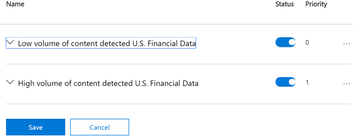
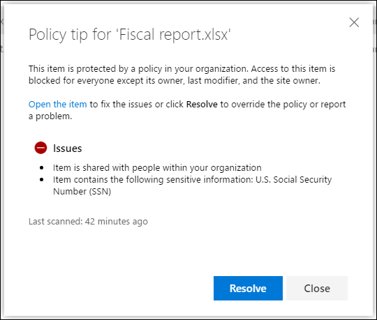

# Referencia de directiva de prevención de pérdida de datos

las directivas de Prevención de pérdida de datos de Microsoft Purview (DLP) tienen muchos componentes que configurar. Para crear una directiva eficaz, debe comprender cuál es el propósito de cada componente y cómo su configuración modifica el comportamiento de la directiva. En este artículo se proporciona una anatomía detallada de una directiva DLP.

## Plantillas de directiva 

Las plantillas de directiva DLP se ordenan previamente en cuatro categorías:

- Aquellas que pueden detectar y proteger tipos de información **financiera** .
- Aquellas que pueden detectar y proteger tipos de información **médica y de salud** .
- Aquellas que pueden detectar y proteger tipos de información de **privacidad** .
- Plantilla **personalizada** que puede usar para crear su propia directiva si una de las demás no satisface las necesidades de las organizaciones.

En esta tabla se enumeran todas las plantillas de directiva y los tipos de información confidencial (SIT) que cubren. 

actualizado: 23/06/2021

|Categoría|Plantilla | Sentarse |
|---------|---------|---------|
|Financiera| Datos financieros de Australia| - [Código SWIFT](sit-defn-swift-code.md)   -  [Número de archivo de impuestos de Australia](sit-defn-australia-tax-file-number.md)   - [Número de cuenta bancaria de Australia](sit-defn-australia-bank-account-number.md)   - [Número de tarjeta de crédito](sit-defn-credit-card-number.md)|
|Financiera| Datos financieros de Canadá |- [Número de tarjeta de crédito](sit-defn-credit-card-number.md)   - [Número de cuenta bancaria de Canadá](sit-defn-canada-bank-account-number.md)|
|Financiera| Datos financieros de Francia |- [Número de tarjeta de crédito](sit-defn-credit-card-number.md)   - [Número de tarjeta de débito de la UE](sit-defn-eu-debit-card-number.md)|
|Financiera| Datos financieros de Alemania |- [Número de tarjeta de crédito](sit-defn-credit-card-number.md)   - [Número de tarjeta de débito de la UE](sit-defn-eu-debit-card-number.md)|
|Financiera| Datos financieros de Israel |- [Número de cuenta bancaria de Israel](sit-defn-israel-bank-account-number.md)   - [Código SWIFT](sit-defn-swift-code.md)   - [Número de tarjeta de crédito](sit-defn-credit-card-number.md)|
|Financiera| Datos financieros de Japón |- [Número de cuenta bancaria de Japón](sit-defn-japan-bank-account-number.md)  - [Número de tarjeta de crédito](sit-defn-credit-card-number.md)|
|Financiera| Estándar de seguridad de datos PCI (PCI DSS)|- [Número de tarjeta de crédito](sit-defn-credit-card-number.md)|
|Financiera| Ley de lucha contra el crimen cibernético de Arabia Saudita|- [Código SWIFT](sit-defn-swift-code.md)   - [Número de cuenta bancaria internacional (IBAN)](sit-defn-international-banking-account-number.md)|
|Financiera| Datos financieros de Arabia Saudí |- [Número de tarjeta de crédito](sit-defn-credit-card-number.md)   - [Código SWIFT](sit-defn-swift-code.md)   - [Número de cuenta bancaria internacional (IBAN)](sit-defn-international-banking-account-number.md)|
|Financiera| Datos financieros del Reino Unido|- [Número de tarjeta de crédito](sit-defn-credit-card-number.md)   - [Número de tarjeta de débito de la UE](sit-defn-eu-debit-card-number.md)   - [Código SWIFT](sit-defn-swift-code.md)|
|Financiera| Datos financieros de EE. UU.|- [Número de tarjeta de crédito](sit-defn-credit-card-number.md)   - [Número de cuenta bancaria de EE. UU.](sit-defn-us-bank-account-number.md)  - [Número de enrutamiento de ABA](sit-defn-aba-routing.md)|
|Financiera| Normas del consumidor de la Comisión Federal de Comercio de los EE.UU.|- [Número de tarjeta de crédito](sit-defn-credit-card-number.md)   - [Número de cuenta bancaria de EE. UU.](sit-defn-us-bank-account-number.md)  - [Número de enrutamiento de ABA](sit-defn-aba-routing.md)|
|Financiera| Ley Gramm-Leach-Bliley (GLBA) mejorada de Ee. UU.|- [Número de tarjeta de crédito](sit-defn-credit-card-number.md)   - [Número de cuenta bancaria de EE. UU.](sit-defn-us-bank-account-number.md)  - [Número de identificación individual de contribuyentes (ITIN) de EE. UU.](sit-defn-us-individual-taxpayer-identification-number.md)    - [Número de seguro social (SSN) de EE. UU.](sit-defn-us-social-security-number.md)  - [Número de pasaporte de EE. UU./Reino Unido](sit-defn-us-uk-passport-number.md)   -[Número de licencia de conducir de EE. UU.](sit-defn-us-drivers-license-number.md)  - [Todos los nombres completos](sit-defn-all-full-names.md)  - [Direcciones físicas de EE. UU.](sit-defn-us-physical-addresses.md)|
|Financiera| Ley Gramm-Leach-Bliley (GLBA) de EE.UU.|- [Número de tarjeta de crédito](sit-defn-credit-card-number.md)   - [Número de cuenta bancaria de EE. UU.](sit-defn-us-bank-account-number.md)  - [Número de identificación individual de contribuyentes (ITIN) de EE. UU.](sit-defn-us-individual-taxpayer-identification-number.md)    - [Número de seguro social (SSN) de EE. UU.](sit-defn-us-social-security-number.md)|
|Medicina y salud| Ley de registros de salud de Australia (HRIP Act) Mejorada |- [Número de archivo de impuestos de Australia](sit-defn-australia-tax-file-number.md)  - [Número de cuenta médica de Australia](sit-defn-australia-medical-account-number.md)  - [Todos los nombres completos](sit-defn-all-full-names.md)   - [Todos los términos y condiciones médicos](sit-defn-all-medical-terms-conditions.md)   - [Direcciones físicas de Australia](sit-defn-australia-physical-addresses.md)|
|Medicina y salud| Ley de registros de salud de Australia (Ley HRIP)|- [Número de archivo de impuestos de Australia](sit-defn-australia-tax-file-number.md)   - [Número de cuenta médica de Australia](sit-defn-australia-medical-account-number.md)|
|Medicina y salud| Ley de información sobre salud (HIA) de Canadá |- [Número de pasaporte de Canadá](sit-defn-canada-passport-number.md)   - [Número de seguro social de Canadá](sit-defn-canada-social-insurance-number.md)   - [Número del servicio de mantenimiento de Canadá](sit-defn-canada-health-service-number.md)   - [Número de identificación de salud personal de Canadá](sit-defn-canada-personal-health-identification-number.md)|
|Medicina y salud| Ley de Información de Salud Personal (PHIA) de Canadá Manitoba|- [Número de seguro social de Canadá](sit-defn-canada-social-insurance-number.md)   - [Número del servicio de mantenimiento de Canadá](sit-defn-canada-health-service-number.md)   - [Número de identificación de salud personal de Canadá](sit-defn-canada-personal-health-identification-number.md)|
|Medicina y salud| Ley de Salud Personal del Canadá (PHIPA) Ontario |- [Número de pasaporte de Canadá](sit-defn-canada-passport-number.md)   - [Número de seguro social de Canadá](sit-defn-canada-social-insurance-number.md)   - [Número del servicio de mantenimiento de Canadá](sit-defn-canada-health-service-number.md)   - [Número de identificación de salud personal de Canadá](sit-defn-canada-personal-health-identification-number.md)|
|Medicina y salud| Reino Unido Ley de acceso a informes médicos|- [Número del servicio nacional de salud del Reino Unido](sit-defn-uk-national-health-service-number.md)   - [Número de seguro nacional del Reino Unido (NINO)](sit-defn-uk-national-insurance-number.md)|
|Medicina y salud| Ley de seguro de salud (HIPAA) mejorada de EE. UU.|  - [Clasificación internacional de enfermedades (ICD-9-CM)](sit-defn-international-classification-of-diseases-icd-9-cm.md)   - [Clasificación internacional de enfermedades (ICD-10-CM)](sit-defn-international-classification-of-diseases-icd-10-cm.md)   - [Todos los nombres completos](sit-defn-all-full-names.md)   - [Todos los términos y condiciones médicos](sit-defn-all-medical-terms-conditions.md)   - [Direcciones físicas de EE. UU.](sit-defn-us-physical-addresses.md)|
|Medicina y salud| Ley de seguros de salud (HIPAA) de los EE. UU.| - [Clasificación internacional de enfermedades (ICD-9-CM)](sit-defn-international-classification-of-diseases-icd-9-cm.md)   - [Clasificación internacional de enfermedades (ICD-10-CM)](sit-defn-international-classification-of-diseases-icd-10-cm.md)|
|Privacidad| Ley de privacidad de Australia mejorada|- [Número de licencia de conducir de Australia](sit-defn-australia-drivers-license-number.md)   - [Número de pasaporte de Australia](sit-defn-australia-passport-number.md)   - [Todos los nombres completos](sit-defn-all-full-names.md)   - [Todos los términos y condiciones médicos](sit-defn-all-medical-terms-conditions.md)   - [Direcciones físicas de Australia](sit-defn-australia-physical-addresses.md)|
|Privacidad| Ley de privacidad de Australia|- [Número de licencia de conducir de Australia](sit-defn-australia-drivers-license-number.md)  - [Número de pasaporte de Australia](sit-defn-australia-passport-number.md)|
|Privacidad| Datos de identificación personal (PII) de Australia|- [Número de archivo de impuestos de Australia](sit-defn-australia-tax-file-number.md)   - [Número de licencia de conducir de Australia](sit-defn-australia-drivers-license-number.md)|
|Privacidad| Datos de identificación personal de Canadá (PII)|- [Número de licencia de conducir de Canadá](sit-defn-canada-drivers-license-number.md)   - [Número de cuenta bancaria de Canadá](sit-defn-canada-bank-account-number.md)   - [Número de pasaporte de Canadá](sit-defn-canada-passport-number.md)   - [Número de seguro social de Canadá](sit-defn-canada-social-insurance-number.md)   - [Número del servicio de mantenimiento de Canadá](sit-defn-canada-health-service-number.md)   - [Número de identificación de salud personal de Canadá](sit-defn-canada-personal-health-identification-number.md)|
|Privacidad| Ley de protección de información personal de Canadá (PIPA)|- [Número de pasaporte de Canadá](sit-defn-canada-passport-number.md)   - [Número de seguro social de Canadá](sit-defn-canada-social-insurance-number.md)   - [Número del servicio de mantenimiento de Canadá](sit-defn-canada-health-service-number.md)   - [Número de identificación de salud personal de Canadá](sit-defn-canada-personal-health-identification-number.md)|
|Privacidad| Ley de protección de información personal de Canadá (PIPEDA)|- [Número de licencia de conducir de Canadá](sit-defn-canada-drivers-license-number.md)   - [Número de cuenta bancaria de Canadá](sit-defn-canada-bank-account-number.md)   - [Número de pasaporte de Canadá](sit-defn-canada-passport-number.md)   - [Número de seguro social de Canadá](sit-defn-canada-social-insurance-number.md)   - [Número del servicio de mantenimiento de Canadá](sit-defn-canada-health-service-number.md)   - [Número de identificación de salud personal de Canadá](sit-defn-canada-personal-health-identification-number.md)|
|Privacidad| Ley de protección de datos de Francia|- [Tarjeta de identificación nacional de Francia (CNI)](sit-defn-france-national-id-card.md)  - [Número de seguridad social de Francia (INSEE)](sit-defn-france-social-security-number.md)|
|Privacidad| Información de identificación personal (PII) de Francia|- [Número de seguridad social de Francia (INSEE)](sit-defn-france-social-security-number.md)   - [Número de licencia de conducir de Francia](sit-defn-france-drivers-license-number.md)   - [Número de pasaporte de Francia](sit-defn-france-passport-number.md)   - [Tarjeta de identificación nacional de Francia (CNI)](sit-defn-france-national-id-card.md)|
|Privacidad| Reglamento general de protección de datos (RGPD) mejorado|- [Direcciones físicas de Austria](sit-defn-austria-physical-addresses.md)   - [Direcciones físicas de Bélgica](sit-defn-belgium-physical-addresses.md)   - [Direcciones físicas de Bulgaria](sit-defn-bulgaria-physical-addresses.md)   - [Direcciones físicas de Croacia](sit-defn-croatia-physical-addresses.md)   - [Direcciones físicas de Chipre](sit-defn-cyprus-physical-addresses.md)   - [Direcciones físicas de la República Checa](sit-defn-czech-republic-physical-addresses.md)  - [Direcciones físicas de Dinamarca](sit-defn-denmark-physical-addresses.md)  - [Direcciones físicas de Estonia](sit-defn-estonia-physical-addresses.md)  - [Direcciones físicas de Finlandia](sit-defn-finland-physical-addresses.md)  - [Direcciones físicas de Francia](sit-defn-france-physical-addresses.md)  - [Direcciones físicas de Alemania](sit-defn-germany-physical-addresses.md)  - [Direcciones físicas de Grecia](sit-defn-greece-physical-addresses.md)  - [Direcciones físicas de Hungría](sit-defn-hungary-physical-addresses.md)  - [Direcciones físicas de Irlanda](sit-defn-ireland-physical-addresses.md)  - [Direcciones físicas de Italia](sit-defn-italy-physical-addresses.md)  - [Direcciones físicas de Letonia](sit-defn-latvia-physical-addresses.md)  - [Direcciones físicas de Lituania](sit-defn-lithuania-physical-addresses.md)  - [Direcciones físicas de Luxemburgo](sit-defn-luxemburg-physical-addresses.md)  - [Direcciones físicas de Malta](sit-defn-malta-physical-addresses.md)  - [Direcciones físicas de Países Bajos](sit-defn-netherlands-physical-addresses.md)  - [Direcciones físicas de Polonia](sit-defn-poland-physical-addresses.md)  - [Direcciones físicas portuguesas](sit-defn-portugal-physical-addresses.md)  - [Direcciones físicas de Rumania](sit-defn-romania-physical-addresses.md)  - [Direcciones físicas de Eslovaquia](sit-defn-slovakia-physical-addresses.md)  - [Direcciones físicas de Eslovenia](sit-defn-slovenia-physical-addresses.md)  - [Direcciones físicas de España](sit-defn-spain-physical-addresses.md)  - [Direcciones físicas de Suecia](sit-defn-sweden-physical-addresses.md)  - [Número de seguro social de Austria](sit-defn-austria-social-security-number.md)   - [Número de seguro social de Francia (INSEE)](sit-defn-france-social-security-number.md)  - [Número de seguro social de Grecia (AMKA)](sit-defn-greece-social-security-number.md)  - [Número de seguro social húngaro (TAJ)](sit-defn-hungary-social-security-number.md)  - [Número de seguridad social de España (SSN)](sit-defn-spain-social-security-number.md)  - [Tarjeta de identidad de Austria](sit-defn-austria-identity-card.md)   - [Tarjeta de identidad de Chipre](sit-defn-cyprus-identity-card.md)   - [Número de tarjeta de identidad de Alemania](sit-defn-germany-identity-card-number.md)  - [Número de tarjeta de identidad de Malta](sit-defn-malta-identity-card-number.md)  - [Tarjeta nacional de identificación de Francia (CNI)](sit-defn-france-national-id-card.md)  - [Tarjeta nacional de identificación de Grecia](sit-defn-greece-national-id-card.md)  - [Id. nacional de Finlandia](sit-defn-finland-national-id.md)  - [Id. nacional de Polonia (PESEL)](sit-defn-poland-national-id.md)  - [Id. nacional de Suecia](sit-defn-sweden-national-id.md)  - [Número de identificación personal (OIB) de Croacia](sit-defn-croatia-personal-identification-number.md)   - [Número de identidad personal checo](sit-defn-czech-personal-identity-number.md)  - [Número de identificación personal de Dinamarca](sit-defn-denmark-personal-identification-number.md)  - [Código de identificación personal de Estonia](sit-defn-estonia-personal-identification-code.md)  - [Número de identificación personal de Hungría](sit-defn-hungary-personal-identification-number.md)  - [Número de identificación nacional de Luxemburgo: personas físicas](sit-defn-luxemburg-national-identification-number-natural-persons.md)  - [Número de identificación nacional de Luxemburgo (personas no físicas)](sit-defn-luxemburg-national-identification-number-non-natural-persons.md)  - [Código fiscal de Italia](sit-defn-italy-fiscal-code.md)  - [Código personal de Letonia](sit-defn-latvia-personal-code.md)  - [Código personal de Lituania](sit-defn-lithuania-personal-code.md)  - [Código numérico personal (CNP) de Rumania](sit-defn-romania-personal-numeric-code.md)  - [Número de servicio de ciudadanos de Países Bajos (BSN)](sit-defn-netherlands-citizens-service-number.md)  - [Número de servicio público personal (PPS) de Irlanda](sit-defn-ireland-personal-public-service-number.md)  - [Número civil uniforme de Bulgaria](sit-defn-bulgaria-uniform-civil-number.md)   - [Número nacional de Bélgica](sit-defn-belgium-national-number.md)   - [DNI de España](sit-defn-spain-dni.md)  - [Número de ciudadano maestro único de Eslovenia](sit-defn-slovenia-unique-master-citizen-number.md)  - [Número personal de Eslovaquia](sit-defn-slovakia-personal-number.md)  - [Número de tarjeta de ciudadano de Portugal](sit-defn-portugal-citizen-card-number.md)  - [Número de identificación fiscal de Malta](sit-defn-malta-tax-identification-number.md)  - [Número de identificación fiscal de Austria](sit-defn-austria-tax-identification-number.md)   - [Número de identificación fiscal de Chipre](sit-defn-cyprus-tax-identification-number.md)   -[Número de identificación fiscal de Francia (numéro SPI.)](sit-defn-france-tax-identification-number.md)  - [Número de identificación fiscal de Alemania](sit-defn-germany-tax-identification-number.md)  - [Número de identificación fiscal griega](sit-defn-greece-tax-identification-number.md)  - [Número de identificación fiscal de Hungría](sit-defn-hungary-tax-identification-number.md)  - [Número de identificación fiscal de Países Bajos](sit-defn-netherlands-tax-identification-number.md)  - [Número de identificación fiscal de Polonia](sit-defn-poland-tax-identification-number.md)  - [Número de identificación fiscal de Portugal](sit-defn-portugal-tax-identification-number.md)  - [Número de identificación fiscal de Eslovenia](sit-defn-slovenia-tax-identification-number.md)  - [Número de identificación fiscal de España](sit-defn-spain-tax-identification-number.md)  - [Número de identificación fiscal de Suecia](sit-defn-sweden-tax-identification-number.md)  - [Licencia de conducir de Austria](sit-defn-austria-drivers-license-number.md)   - [Número de licencia de conducir de Bélgica](sit-defn-belgium-drivers-license-number.md)   - [Número de licencia de conducir de Bulgaria](sit-defn-bulgaria-drivers-license-number.md)   - [Número de licencia de conducir de Croacia](sit-defn-croatia-drivers-license-number.md)   - [Número de licencia de conducir de Chipre](sit-defn-cyprus-drivers-license-number.md)   - [Número de licencia de conducir checo](sit-defn-czech-drivers-license-number.md)   - [Número de licencia de conducir de Dinamarca](sit-defn-denmark-drivers-license-number.md)  - [Número de licencia de conducir de Estonia](sit-defn-estonia-drivers-license-number.md)  - [Número de licencia de conducir de Finlandia](sit-defn-finland-drivers-license-number.md)  - [Número de licencia de conducir de Francia](sit-defn-france-drivers-license-number.md)  - [Número de licencia de conducir alemán](sit-defn-germany-drivers-license-number.md)  - [Número de licencia de conducir de Grecia](sit-defn-greece-drivers-license-number.md)   - [Número de licencia de conducir de Hungría](sit-defn-hungary-drivers-license-number.md)  - [Número de licencia de conducir de Irlanda](sit-defn-ireland-drivers-license-number.md)  - [Número de licencia de conducir de Italia](sit-defn-italy-drivers-license-number.md)  - [Número de licencia de conducir de Letonia](sit-defn-latvia-drivers-license-number.md)  - [Número de licencia de conducir de Lituania](sit-defn-lithuania-drivers-license-number.md)  - [Número de licencia de conducir de Luxemburgo](sit-defn-luxemburg-drivers-license-number.md)  - [Número de licencia de conducir de Malta](sit-defn-malta-drivers-license-number.md)  - [Número de licencia de conducir de Países Bajos](sit-defn-netherlands-drivers-license-number.md)  - [Número de licencia de conducir de Polonia](sit-defn-poland-drivers-license-number.md)  - [Número de licencia de conducir de Portugal](sit-defn-portugal-drivers-license-number.md)  - [Número de licencia de conducir de Rumania](sit-defn-romania-drivers-license-number.md)  - [Número de licencia de conducir de Eslovaquia](sit-defn-slovakia-drivers-license-number.md)  - [Número de licencia de conducir de Eslovenia](sit-defn-slovenia-drivers-license-number.md)  - [Número de licencia de conducir de España](sit-defn-spain-drivers-license-number.md)  - [Número de licencia de conducir de Suecia](sit-defn-sweden-drivers-license-number.md)  - [Número de pasaporte de Austria](sit-defn-austria-passport-number.md)   - [Número de pasaporte de Bélgica](sit-defn-belgium-passport-number.md)   - [Número de pasaporte de Bulgaria](sit-defn-bulgaria-passport-number.md)   - [Número de pasaporte de Croacia](sit-defn-croatia-passport-number.md)   - [Número de pasaporte de Chipre](sit-defn-cyprus-passport-number.md)   - [Número de pasaporte de la República Checa](sit-defn-czech-passport-number.md)   - [Número de pasaporte de Dinamarca](sit-defn-denmark-passport-number.md)  - [Número de pasaporte de Estonia](sit-defn-estonia-passport-number.md)  - [Número de pasaporte de Finlandia](sit-defn-finland-passport-number.md)  - [Número de pasaporte de Francia](sit-defn-france-passport-number.md)  - [Número de pasaporte alemán](sit-defn-germany-passport-number.md)  - [Número de pasaporte de Grecia](sit-defn-greece-passport-number.md)  - [Número de pasaporte de Hungría](sit-defn-hungary-passport-number.md)  - [Número de pasaporte de Irlanda](sit-defn-ireland-passport-number.md)  - [Número de pasaporte de Italia](sit-defn-italy-passport-number.md)  - [Número de pasaporte de Letonia](sit-defn-latvia-passport-number.md)  - [Número de pasaporte de Lituania](sit-defn-lithuania-passport-number.md)  - [Número de pasaporte de Luxemburgo](sit-defn-luxemburg-passport-number.md)  - [Número de pasaporte de Malta](sit-defn-malta-passport-number.md)  - [Número de pasaporte neerlandés](sit-defn-netherlands-passport-number.md)  - [Pasaporte de Polonia](sit-defn-poland-passport-number.md)  - [Número de pasaporte de Portugal](sit-defn-portugal-passport-number.md)  - [Número de pasaporte de Rumania](sit-defn-romania-passport-number.md)  - [Número de pasaporte de Eslovaquia](sit-defn-slovakia-passport-number.md)  - [Número de pasaporte de Eslovenia](sit-defn-slovenia-passport-number.md)  - [Número de pasaporte de España](sit-defn-spain-passport-number.md)  - [Número de pasaporte de Suecia](sit-defn-sweden-passport-number.md)  - [Número de tarjeta de débito de la UE](sit-defn-eu-debit-card-number.md)  - [Todos los nombres completos](sit-defn-all-full-names.md)|
|Privacidad| Reglamento general de protección de datos (RGPD)|- [Número de tarjeta de débito de la UE](sit-defn-eu-debit-card-number.md)   - [Número de licencia de conducir de la UE](sit-defn-eu-drivers-license-number.md)   - [Número de identificación nacional de la UE](sit-defn-eu-national-identification-number.md)  - [Número de pasaporte de la UE](sit-defn-eu-passport-number.md)   - [Número de seguridad social de la UE o identificación equivalente](sit-defn-eu-social-security-number-equivalent-identification.md)  - [Número de identificación fiscal de la UE](sit-defn-eu-tax-identification-number.md)|
|Privacidad| Información de identificación personal (PII) de Alemania|- [Número de licencia de conducir de Alemania](sit-defn-germany-drivers-license-number.md)   - [Número de pasaporte de Alemania](sit-defn-germany-passport-number.md)| 
|Privacidad| Información de identificación personal (PII) de Israel|- [Número de identificación nacional de Israel](sit-defn-israel-national-identification-number.md)| 
|Privacidad| Protección de privacidad en Israel|- [Número de identificación nacional de Israel](sit-defn-israel-national-identification-number.md)  - [Número de cuenta bancaria de Israel](sit-defn-israel-bank-account-number.md)|
|Privacidad| Información de identificación personal (PII) de Japón mejorada|- [Número de seguro social de Japón (SIN)](sit-defn-japan-social-insurance-number.md)  - [Japón Mi número - Personal](sit-defn-japan-my-number-personal.md)  - [Número de pasaporte de Japón](sit-defn-japan-passport-number.md)  - [Número de licencia de conducir de Japón](sit-defn-japan-drivers-license-number.md)  - [Todos los nombres completos](sit-defn-all-full-names.md)  - [Direcciones físicas de Japón](sit-defn-all-physical-addresses.md)|
|Privacidad| Datos de identificación personal (PII) de Japón|- [Número de registro de residente de Japón](sit-defn-japan-resident-registration-number.md)   - [Número de seguro social de Japón (SIN)](sit-defn-japan-social-insurance-number.md)|
|Privacidad| Protección de la información personal mejorada en Japón|- [Número de seguro social de Japón (SIN)](sit-defn-japan-social-insurance-number.md)   - [Japón Mi número - Personal](sit-defn-japan-my-number-personal.md)  - [Número de pasaporte de Japón](sit-defn-japan-passport-number.md)   - [Número de licencia de conducir de Japón](sit-defn-japan-drivers-license-number.md)  - [Todos los nombres completos](sit-defn-all-full-names.md)  - [Direcciones físicas de Japón](sit-defn-all-physical-addresses.md)|
|Privacidad| Protección de información personal de Japón|- [Número de registro de residente de Japón](sit-defn-japan-resident-registration-number.md)  - [Número de seguro social de Japón (SIN)](sit-defn-japan-social-insurance-number.md)|
|Privacidad| Datos de identificación personal (PII) de Arabia Saudita|- [Id. nacional de Arabia Saudita](sit-defn-saudi-arabia-national-id.md)|
|Privacidad| Reino Unido Ley de protección de datos|- [Número de seguro nacional del Reino Unido (NINO)](sit-defn-uk-national-insurance-number.md)   - [Número de pasaporte de EE. UU./Reino Unido](sit-defn-us-uk-passport-number.md)   - [Código SWIFT](sit-defn-swift-code.md)|
|Privacidad| Reino Unido Reglamento de privacidad y comunicaciones electrónicas|- [Código SWIFT](sit-defn-swift-code.md)|
|Privacidad| Reino Unido Datos de información de identificación personal (PII)|- [Número de seguro nacional del Reino Unido (NINO)](sit-defn-uk-national-insurance-number.md)   - [Número de pasaporte de EE. UU./Reino Unido](sit-defn-us-uk-passport-number.md)|
|Privacidad| Reino Unido Código de práctica en línea de información personal (PIOCP)|- [Número de seguro nacional del Reino Unido (NINO)](sit-defn-uk-national-insurance-number.md)   - [Número del servicio nacional de salud del Reino Unido](sit-defn-uk-national-health-service-number.md)   - [Código SWIFT](sit-defn-swift-code.md)|
|Privacidad| Ley Patriota de EE. UU. mejorada|- [Número de tarjeta de crédito](sit-defn-credit-card-number.md)   - [Número de cuenta bancaria de EE. UU.](sit-defn-us-bank-account-number.md)  - [Número de identificación individual de contribuyentes (ITIN) de EE. UU.](sit-defn-us-individual-taxpayer-identification-number.md)    - [Número de seguro social (SSN) de EE. UU.](sit-defn-us-social-security-number.md)  - [Todos los nombres completos](sit-defn-all-full-names.md)  - [Direcciones físicas de EE. UU.](sit-defn-us-physical-addresses.md)|
|Privacidad| Ley Patriota de los EE.UU.|- [Número de tarjeta de crédito](sit-defn-credit-card-number.md)   - [Número de cuenta bancaria de EE. UU.](sit-defn-us-bank-account-number.md)  - [Número de identificación individual de contribuyentes (ITIN) de EE. UU.](sit-defn-us-individual-taxpayer-identification-number.md)    - [Número de seguro social (SSN) de EE. UU.](sit-defn-us-social-security-number.md)|
|Privacidad| Datos de información de identificación personal (PII) de EE. UU. mejorados|- [Número de identificación individual de contribuyentes (ITIN) de EE. UU.](sit-defn-us-individual-taxpayer-identification-number.md)    - [Número de seguro social (SSN) de EE. UU.](sit-defn-us-social-security-number.md)  - [Número de pasaporte de EE. UU./Reino Unido](sit-defn-us-uk-passport-number.md)  - [Todos los nombres completos](sit-defn-all-full-names.md)  - [Direcciones físicas de EE. UU.](sit-defn-us-physical-addresses.md)|
|Privacidad| Información de identificación personal (PII) de Estados Unidos|- [Número de identificación individual de contribuyentes (ITIN) de EE. UU.](sit-defn-us-individual-taxpayer-identification-number.md)    - [Número de seguro social (SSN) de EE. UU.](sit-defn-us-social-security-number.md)  - [Número de pasaporte de EE. UU./Reino Unido](sit-defn-us-uk-passport-number.md)|
|Privacidad| Leyes de notificación de infracciones de estado de EE. UU. mejoradas|- [Número de tarjeta de crédito](sit-defn-credit-card-number.md)   - [Número de cuenta bancaria de EE. UU.](sit-defn-us-bank-account-number.md)  -[Número de licencia de conducir de EE. UU.](sit-defn-us-drivers-license-number.md)   - [Número de seguro social (SSN) de EE. UU.](sit-defn-us-social-security-number.md)  - [Todos los nombres completos](sit-defn-all-full-names.md)   - [Número de pasaporte de EE. UU./Reino Unido](sit-defn-us-uk-passport-number.md)  - [Todos los términos y condiciones médicos](sit-defn-all-medical-terms-conditions.md)|
|Privacidad| Leyes de notificación de incumplimiento estatal de EE.UU.|- [Número de tarjeta de crédito](sit-defn-credit-card-number.md)   - [Número de cuenta bancaria de EE. UU.](sit-defn-us-bank-account-number.md)  -[Número de licencia de conducir de EE. UU.](sit-defn-us-drivers-license-number.md)   - [Número de seguro social (SSN) de EE. UU.](sit-defn-us-social-security-number.md)|
|Privacidad| Leyes de confidencialidad sobre el número de Seguridad Social de EE.UU.|- [Número de seguro social (SSN) de EE. UU.](sit-defn-us-social-security-number.md)|

## Ubicaciones

Una directiva DLP puede buscar y proteger elementos que contienen información confidencial en varias ubicaciones.

|Ubicación  |Incluir o excluir ámbito  |Estado de los datos  |Requisitos previos adicionales |
|---------|---------|---------|---------|
|Correo electrónico de Exchange en línea |grupo de distribución | datos en movimiento| No |
|Sitios en línea de SharePoint   |sitios       | datos en reposo   datos en uso | No|
|Cuentas de OneDrive para la Empresa| cuenta o grupo de distribución |datos en reposo   datos en uso|No|
|Mensajes de canales y chats de Teams     | cuenta o grupo de distribución |datos en movimiento   datos en uso |  No       |
|Microsoft Defender for Cloud Apps   | instancia de aplicación en la nube       |datos en reposo         | - [Uso de directivas de prevención de pérdida de datos para aplicaciones en la nube que no son de Microsoft](dlp-use-policies-non-microsoft-cloud-apps.md#use-data-loss-prevention-policies-for-non-microsoft-cloud-apps)        |
|Dispositivos  |usuario o grupo         |datos en reposo    datos en uso    datos en movimiento         |- [Más información sobre la prevención de pérdida de datos de punto de conexión](endpoint-dlp-learn-about.md)  - [Introducción a la prevención de pérdida de datos de punto de conexión](endpoint-dlp-getting-started.md)  - [Configuración del proxy de dispositivo y la conexión a Internet para Information Protection](device-onboarding-configure-proxy.md#configure-device-proxy-and-internet-connection-settings-for-information-protection) |
|Repositorios locales (recursos compartidos de archivos y SharePoint)    |Repositorio         | datos en reposo         | - [Más información sobre el analizador local de prevención de pérdida de datos](dlp-on-premises-scanner-learn.md)   - [Introducción al analizador local de prevención de pérdida de datos](dlp-on-premises-scanner-get-started.md#get-started-with-the-data-loss-prevention-on-premises-scanner)         |
|Power BI| Espacios | datos en uso | No|

Si elige incluir grupos de distribución que son específicos en Exchange, la directiva de DLP se aplicará solo a los miembros de ese grupo. Igualmente, la exclusión de un grupo de distribución excluirá a todos los miembros de dicho grupo de distribución de la evaluación de la directiva. Puede escoger entre definir una directiva para los miembros de las listas de distribución, los grupos de distribución dinámicos y los grupos de seguridad. Una directiva DLP no puede contener más de 50 de estas inclusiones y exclusiones.

Si elige incluir o excluir sitios de SharePoint o cuentas de OneDrive específicos, una directiva DLP no puede contener más de 100 inclusiones y exclusiones. Aunque este límite exista, puede superarlo si aplica una directiva para toda la organización o aplicada a ubicaciones completas.

Si decide incluir o excluir grupos o cuentas de OneDrive específicas, una directiva DLP no puede contener más de 100 cuentas de usuario o 50 grupos como inclusión o exclusión.

### Compatibilidad con la ubicación de cómo se puede definir el contenido

Las directivas DLP detectan elementos confidenciales si coinciden con un tipo de información confidencial (SIT), con una etiqueta de confidencialidad o con una etiqueta de retención. Cada ubicación admite diferentes métodos para definir contenido confidencial. Al combinar ubicaciones en una directiva, la forma en que se puede definir el contenido puede cambiar a partir de cómo se puede definir mediante una sola ubicación. 

> [!IMPORTANT]
> Al seleccionar varias ubicaciones para una directiva, un valor "no" para una categoría de definición de contenido tiene prioridad sobre el valor "sí". Por ejemplo, al seleccionar solo sitios de SharePoint, la directiva admitirá la detección de elementos confidenciales por uno o varios de SIT, por etiqueta de confidencialidad o por etiqueta de retención. Sin embargo, al seleccionar sitios de SharePoint ***y*** ubicaciones de mensajes de chat y canal de Teams, la directiva solo admitirá la detección de elementos confidenciales por SIT.

|Ubicación| El contenido se puede definir mediante SIT| El contenido se puede definir como etiqueta de confidencialidad| El contenido se puede definir mediante la etiqueta de retención.|
|---------|---------|---------|---------|
|Correo electrónico de Exchange en línea|Sí| Sí| No|
|Sitios en línea de SharePoint| Sí| Sí| Sí|
|Cuentas de OneDrive para la Empresa| Sí| Sí| Sí|
|Mensajes de chat y canal de Teams | Yes| No| No|
|Dispositivos |Sí | Sí|  No|
|Microsoft Defender for Cloud Apps | Sí| Sí| Sí|
|Repositorios locales| Sí| Sí| No|
|Power BI|Sí | Sí| No|

> [!NOTE]
> DLP admite (en versión preliminar) el uso de clasificadores entrenables como condición para detectar documentos confidenciales. El contenido se puede definir mediante clasificadores entrenables en Exchange Online, sitios de SharePoint Online, cuentas de OneDrive para la Empresa, chat y canales de Teams y dispositivos. Para obtener más información, vea [Clasificadores entrenables](classifier-learn-about.md).

> [!NOTE]
> DLP admite la detección de etiquetas de confidencialidad en correos electrónicos y datos adjuntos. Para obtener más información, vea [Usar etiquetas de confidencialidad como condiciones en las directivas DLP](dlp-sensitivity-label-as-condition.md#use-sensitivity-labels-as-conditions-in-dlp-policies).

## Rules

<!--This section introduces the classifications of content that, when detected, can be protected. Link out to [Learn about sensitive information types]() and [Sensitive information type entity definitions](sensitive-information-type-entity-definitions.md#sensitive-information-type-entity-definitions) as well as labels (cross referenced by supporting workload). It will touch on the purpose of multiple conditions, confidence levels (link out to [more on confidence levels](sensitive-information-type-learn-about.md#more-on-confidence-levels)) and confidence levels video. How to use the confidence level to change the behavior of a policy in conjunction with the instance count.  eg. if you want your policy to trigger when it encounters situation DEF, set your conditions like HIJ.-->
<!--
- What is a rule in the context of a Policy?
- when and why should I have more than one rule?
- The purpose of rule groups
- How do I tune the behavior of a Policy through the tuning of rules
- what's in a rule-->

Las reglas son la lógica de negocios de las directivas DLP. Constan de:

- [**Condiciones**](#conditions) que, cuando coinciden, desencadenan la directiva
- [**Excepciones**](#exceptions) a las condiciones
- [**Acciones**](#actions) que se deben realizar cuando se desencadena la directiva
- [**Notificaciones de usuario**](#user-notifications-and-policy-tips) para informar a los usuarios cuando están haciendo algo que desencadena una directiva y ayudarles a educarlos sobre cómo su organización quiere que se trate la información confidencial.
- [**Las invalidaciones de usuario**](#user-overrides) cuando las configura un administrador, permiten a los usuarios invalidar de forma selectiva una acción de bloqueo.
- [**Informes de incidentes**](#incident-reports) que notifican a los administradores y a otras partes interesadas clave cuando se produce una coincidencia de regla
- [**Opciones adicionales**](#additional-options) que definen la prioridad para la evaluación de reglas y pueden detener el procesamiento de reglas y directivas adicionales.

 Una directiva contiene una o varias reglas. Las reglas se ejecutan secuencialmente, comenzando por la regla de mayor prioridad de cada directiva.

### Prioridad por la que se procesan las reglas

#### Cargas de trabajo de servicio hospedadas

Para las cargas de trabajo de servicio hospedadas, como Exchange Online, SharePoint Online y OneDrive para la Empresa, a cada regla se le asigna una prioridad en el orden en que se crea. Esto significa que la regla creada primero tiene la primera prioridad, la regla creada en segundo lugar tiene segunda prioridad, etc.
  

Cuando se evalúa el contenido frente a reglas, estas se procesan en orden de prioridad. Si el contenido coincide con varias reglas, se aplica la primera regla evaluada que tiene la acción *más* restrictiva. Por ejemplo, si el contenido coincide con todas las reglas siguientes, se aplica la *regla 3* porque es la regla más restrictiva y de mayor prioridad:
  
- Regla 1: solo notifica a los usuarios
- Regla 2: notifica a los usuarios, restringe el acceso y permite invalidaciones de usuario
- *Regla 3: notifica a los usuarios, restringe el acceso y no permite invalidaciones de usuario.*
- Regla 4: restringe el acceso

Las reglas 1, 2 y 4 se evaluarán, pero no se aplicarán. En este ejemplo, las coincidencias de todas las reglas se registran en los registros de auditoría y se muestran en los informes DLP, aunque solo se aplique la regla más restrictiva.

Puede usar una regla para satisfacer un requisito de protección específico y después usar una directiva DLP para agrupar los requisitos de protección comunes, como todas las reglas necesarias para cumplir una normativa específica.
  
Por ejemplo, podría tener una directiva DLP que ayude a detectar la presencia de información sujeta a la Ley de transferencia y responsabilidad de seguros de salud (HIPAA). Esta directiva DLP podría ayudar a proteger los datos HIPAA (el qué) en todos los sitios de SharePoint Online y OneDrive para la Empresa (el dónde) al buscar cualquier documento que contenga información confidencial y que se comparte con personas de fuera de la organización (las condiciones) y, a continuación, bloquear el acceso al documento y enviar una notificación (las acciones). Estos requisitos se almacenan como reglas individuales y se agrupan de forma conjunta como directiva DLP para simplificar la administración y la creación de informes.
  

#### Para puntos de conexión

La prioridad de las reglas en los puntos de conexión también se asigna según el orden en que se crea. Esto significa que la regla creada primero tiene la primera prioridad, la regla creada en segundo lugar tiene segunda prioridad, etc. 

Cuando un archivo de un punto de conexión coincide con varias directivas DLP, la primera regla habilitada con la aplicación más restrictiva en las [actividades de punto de conexión](endpoint-dlp-learn-about.md#endpoint-activities-you-can-monitor-and-take-action-on) es la que se aplica en el contenido. Por ejemplo, si el contenido coincide con todas las reglas siguientes, la regla 2 tiene prioridad sobre las demás reglas, ya que es la más restrictiva.

- Regla 1: solo audita toda la actividad
- *Regla 2: bloquea toda la actividad*
- Regla 3: bloquea toda la actividad con la opción para que el usuario final invalide

En el ejemplo siguiente, la regla 1 tiene prioridad sobre las demás reglas coincidentes, ya que es la más restrictiva.

- *Regla 1: bloquea la actividad y no permite la invalidación del usuario*
- Regla 2: bloquea la actividad y permite invalidaciones de usuario
- Regla 3: solo audita toda la actividad
- Regla 4: sin aplicación

Todas las demás reglas se evalúan, pero sus acciones no se aplican. Los registros de auditoría mostrarán la regla más restrictiva aplicada en el archivo. Si hay más de una regla que coincide y son igualmente restrictivas, la prioridad de directiva y regla rige qué regla se aplicaría en el archivo.

### Condiciones

Las condiciones son inclusivas y son donde se define lo que quiere que busque la regla y el contexto en el que se usan esos elementos. Indican a la regla &#8212; cuando se encuentra un elemento similar a *este* y se *usa así &#8212;* es una coincidencia y el resto de las acciones de la directiva se deben realizar en ella. Puede usar condiciones para asignar acciones diferentes a distintos niveles de riesgo. Por ejemplo, el contenido confidencial compartido internamente podría ser de menor riesgo y necesitar menos acciones que el contenido confidencial compartido con personas de fuera de la organización.

> [!NOTE]
> Los usuarios que tienen cuentas que no son de invitado en el espacio empresarial de Active Directory o de Azure Active Directory de una organización anfitriona se consideran como personas dentro de la organización. 

#### El contenido contiene

 Todas las ubicaciones admiten la condición **Contiene contenido** . Puede seleccionar varias instancias de cada tipo de contenido y refinar aún más las condiciones mediante cualquiera **de estos** operadores (OR lógico) o **Todos estos** (AND lógico):

- [tipos de información confidencial](sensitive-information-type-learn-about.md#learn-about-sensitive-information-types)
- [etiquetas de confidencialidad](sensitivity-labels.md)
- [etiquetas de retención](retention.md#using-a-retention-label-as-a-condition-in-a-dlp-policy)
- [Clasificadores entrenables](classifier-learn-about.md) (en versión preliminar) 

dependiendo de las [ubicaciones](#location-support-for-how-content-can-be-defined) a las que elija aplicar la directiva.

La regla solo buscará la presencia de las **etiquetas de confidencialidad** y las **etiquetas de retención** que elija.

Los SIT tienen un [**nivel de confianza**](https://www.microsoft.com/videoplayer/embed/RE4Hx60) predefinido que puede modificar si es necesario. Para obtener más información, consulte [Más información sobre los niveles de confianza](sensitive-information-type-learn-about.md#more-on-confidence-levels).

> [!IMPORTANT]
> Los SIT tienen dos formas diferentes de definir los parámetros de recuento de instancias únicos máximos. Para obtener más información, consulte [Valores admitidos de recuento de instancias para SIT](sit-limits.md#instance-count-supported-values-for-sit).

#### Contexto de condición

Las opciones de contexto disponibles cambian en función de la ubicación que elija. Si selecciona varias ubicaciones, solo estarán disponibles las condiciones que las ubicaciones tienen en común.

##### Condiciones que admite Exchange

- El contenido contiene
- El contenido se comparte desde Microsoft 365
- El contenido se recibe de
- La dirección IP del remitente es
- ¿Ha invalidado el remitente la sugerencia de directiva?
- El remitente es
- El dominio del remitente es
- La dirección del remitente contiene palabras
- La dirección del remitente contiene patrones
- El atributo DE AD del remitente contiene palabras o frases
- El atributo de AD del remitente coincide con los patrones
- El remitente es miembro de
- No se pudo digitalizar algún contenido de los datos adjuntos del correo
- No se pudo completar el análisis de algún contenido de los datos adjuntos del correo
- Los datos adjuntos están protegidos con contraseña
- La extensión de archivo es
- El destinatario es miembro de
- El dominio del destinatario es
- El destinatario es
- La dirección del destinatario contiene palabras
- La dirección del destinatario coincide con patrones
- El atributo ad de destinatario contiene palabras o frases
- El atributo de AD del destinatario coincide con los patrones
- El nombre del documento contiene palabras o frases
- El nombre del documento coincide con los patrones
- La propiedad del documento es
- El tamaño del documento es igual o mayor que
- El contenido del documento contiene palabras o frases
- El contenido del documento coincide con patrones
- El asunto contiene palabras o frases
- El asunto coincide con patrones
- Subject o Body contiene palabras o frases
- El asunto o el cuerpo coinciden con los patrones
- El juego de caracteres de contenido contiene palabras
- El encabezado contiene palabras o frases
- El encabezado coincide con patrones
- El tamaño del mensaje es igual o mayor que
- El tipo de mensaje es
- La importancia del mensaje es

##### Condiciones que admite SharePoint
 
- El contenido contiene
- El contenido se comparte desde Microsoft 365
- Documento creado por
- Documento creado por el miembro de
- El nombre del documento contiene palabras o frases
- El nombre del documento coincide con los patrones
- Tamaño del documento sobre
- La propiedad del documento es
- La extensión de archivo es

##### Condiciones que admiten las cuentas de OneDrive

- El contenido contiene
- El contenido se comparte desde Microsoft 365
- Documento creado por
- Documento creado por el miembro de
- El nombre del documento contiene palabras o frases
- El nombre del documento coincide con los patrones
- Tamaño del documento sobre
- La propiedad del documento es
- La extensión de archivo es

##### Condiciones que admite el chat de Teams y los mensajes de canal

- El contenido contiene
- El contenido se comparte desde Microsoft 365
- El remitente es 
- El dominio del remitente es 
- El dominio del destinatario es 
- El destinatario es 

##### Condiciones que admiten los dispositivos

- El contenido contiene
- (versión preliminar) El documento o los datos adjuntos están protegidos con contraseña (.pdf, los archivos de Office y los archivos cifrados de Symantec PGP son totalmente compatibles). Este predicado no detecta archivos cifrados con derechos digitales administrados (DRM) ni protegidos por permisos. 
- (versión preliminar) El contenido no está etiquetado (.pdf, los archivos de Office son totalmente compatibles). Este predicado detecta el contenido que no tiene una etiqueta de confidencialidad aplicada. Para ayudar a garantizar que solo se detecten tipos de archivo admitidos, debe usar esta condición con la **extensión Archivo es** o **El tipo de archivo es** condiciones.
- (versión preliminar) El usuario accedió a un sitio web confidencial desde Edge. Vea [Escenario 6 Supervisar o restringir las actividades de usuario en dominios de servicio confidencial (versión preliminar)](endpoint-dlp-using.md#scenario-6-monitor-or-restrict-user-activities-on-sensitive-service-domains) para más información. 
- La extensión de archivo es
- El tipo de archivo es
- Consulte las [actividades de punto de conexión en las que puede supervisar y tomar medidas.](endpoint-dlp-learn-about.md#endpoint-activities-you-can-monitor-and-take-action-on)

##### Condiciones Microsoft Defender for Cloud Apps admite

- El contenido contiene
- El contenido se comparte desde Microsoft 365

##### Condiciones compatibles con repositorios locales

- El contenido contiene
- La extensión de archivo es
- La propiedad del documento es

##### Condiciones que admite PowerBI

- El contenido contiene

#### Grupos de condiciones

A veces, necesita una regla para identificar solo una cosa, como todo el contenido que contiene un número de seguro social de EE. UU., que se define mediante una sola SIT. Pero en muchos escenarios, donde los tipos de elementos que intenta identificar son más complejos y, por lo tanto, más difíciles de definir, se requiere más flexibilidad para definir condiciones.

Por ejemplo, para identificar el contenido sujeto a la Ley de seguros de salud (HIPAA) de Estados Unidos, debe buscar:
  
- Contenido que incluye tipos concretos de información confidencial, como un Número de la Seguridad social o un Número de la Agencia antidroga (DEA) de Estados Unidos.
    
    Y
    
- Contenido que es más difícil identificar, como las comunicaciones sobre la atención a un paciente o las descripciones de los servicios médicos proporcionados. La identificación de este tipo de contenido requiere que coincida con las palabras clave de una lista grande, como la Clasificación internacional de enfermedades (ICD-9-CM o ICD-10-CM).
    
Puede identificar este tipo de datos mediante la agrupación de condiciones y el uso de operadores lógicos (AND, OR) entre los grupos.
    
En el caso de la **Ley de Seguro De Salud (HIPPA) de los Estados Unidos**, las condiciones se agrupan de la siguiente manera:

El primer grupo contiene los SIT que identifican e individualmente y el segundo grupo contiene los SIT que identifican el diagnóstico médico.

### Excepciones

En las reglas, las excepciones definen condiciones que se usan para excluir un elemento de la directiva. Lógicamente, las condiciones exclusivas que se evalúan después de las condiciones inclusivas y el contexto. Le indican a la regla &#8212; cuando encuentra un elemento similar a *este* y se usa como *si* fuera una coincidencia y el resto de las acciones de la directiva se deben realizar en ella ***excepto si***... &#8212; 

Por ejemplo, manteniendo la directiva HIPPA, podríamos modificar la regla para excluir cualquier elemento que contenga un número de licencia de conducir de Bélgica, como este:

Las condiciones de excepciones admitidas por la ubicación son idénticas a todas las condiciones de inclusión, siendo la única diferencia la que depende de "Excepto si" para cada condición admitida. Si una regla contiene solo excepciones, se aplicará a todos los correos electrónicos o archivos que no cumplan los criterios de exclusión.

Igual que todas las ubicaciones admiten la condición inclusiva:

- El contenido contiene

la excepción sería:

- **Excepto si** el contenido contiene 

### Acciones 

Cualquier elemento que lo realice a través de los filtros de ***condiciones** _ _*_inclusivos y excepciones exclusivas_*_ tendrá las _*_acciones_*_ definidas en la regla que se le aplica. Tendrá que configurar las opciones necesarias para admitir la acción. Por ejemplo, si selecciona Exchange con la acción _ *Restringir acceso o cifrar el contenido en ubicaciones de Microsoft 365**, debe elegir entre estas opciones:

- Impedir que los usuarios accedan al contenido compartido de SharePoint, OneDrive y Teams
    - Bloquear a todos. Solo el propietario del contenido, el último modificador y el administrador del sitio seguirán teniendo acceso
    - Bloquee solo a personas de fuera de la organización. Los usuarios de la organización seguirán teniendo acceso.
- Cifrar mensajes de correo electrónico (solo se aplica al contenido de Exchange)

Las acciones que están disponibles en una regla dependen de las ubicaciones que se han seleccionado. Si selecciona solo una ubicación a la que se va a aplicar la directiva, las acciones disponibles se enumeran a continuación.

> [!IMPORTANT]
> Para SharePoint Online y OneDrive para la Empresa los documentos de ubicaciones se bloquearán proactivamente justo después de la detección de información confidencial, independientemente de si el documento se comparte o no, para todos los usuarios externos, mientras que los usuarios internos seguirán teniendo acceso al documento.

#### Acciones de ubicación de Exchange

- Restricción del acceso o cifrado del contenido en ubicaciones de Microsoft 365
- Establecer encabezados
- Quitar encabezado
- Redirigir el mensaje a usuarios específicos
- Reenviar el mensaje para su aprobación al administrador del remitente
- Reenviar el mensaje para su aprobación a aprobadores específicos
- Agregar destinatario al cuadro Para
- Agregar destinatario al cuadro Cc
- Agregar destinatario al cuadro CCO
- Agregar el administrador del remitente como destinatario
- Se ha quitado el cifrado de mensajes de O365 y la protección de derechos
- Anteponer Email asunto
- Modificar Email asunto
- Agregar declinación de responsabilidades html

#### Acciones de ubicación de sitios de SharePoint

- Restricción del acceso o cifrado del contenido en ubicaciones de Microsoft 365

#### Acciones de ubicación de la cuenta de OneDrive

- Restricción del acceso o cifrado del contenido en ubicaciones de Microsoft 365

#### Acciones de chat y mensajes de canal de Teams

- Restricción del acceso o cifrado del contenido en ubicaciones de Microsoft 365

#### Acciones de dispositivos

<!-- - Restrict access or encrypt the content in Microsoft 365 locations-->
- Auditoría o actividades restringidas cuando los usuarios acceden a sitios web confidenciales en el explorador Microsoft Edge en dispositivos Windows. Consulte [Escenario 6 Supervisar o restringir las actividades del usuario en dominios de servicio confidenciales)](endpoint-dlp-using.md#scenario-6-monitor-or-restrict-user-activities-on-sensitive-service-domains) para obtener más información.
- Auditoría o restricción de actividades en dispositivos Windows

Para usar `Audit or restrict activities on Windows devices`, tiene que configurar opciones en **la configuración dlp** y en la directiva en la que desea usarlas. Consulte Aplicaciones [restringidas y grupos de aplicaciones](dlp-configure-endpoint-settings.md#restricted-apps-and-app-groups) para obtener más información.

La ubicación de los dispositivos proporciona muchas subactividades (condiciones) y acciones. Para más información, consulte [Actividades de punto de conexión sobre las que puede supervisar y realizar acciones](endpoint-dlp-learn-about.md#endpoint-activities-you-can-monitor-and-take-action-on).

Al seleccionar **Auditar o restringir actividades en dispositivos Windows**, puede restringir las actividades de usuario por dominio de servicio o explorador y limitar las acciones que dlp realiza:

- Todas las aplicaciones
- Mediante una lista de aplicaciones restringidas que defina
- Un grupo de aplicaciones restringido (versión preliminar) que defina.

##### Actividades de dominio y explorador de servicio

Al configurar los dominios de servicio en la **nube Allow/Block** y la lista **Exploradores** no [permitidos (consulte Restricciones de explorador y dominio para datos confidenciales](dlp-configure-endpoint-settings.md#browser-and-domain-restrictions-to-sensitive-data)) y un usuario intenta cargar un archivo protegido en un dominio de servicio en la nube o acceder a él desde un explorador no permitido, puede configurar la acción de directiva en `Audit only`, `Block with override`o `Block` en la actividad.

##### Actividades de archivo para todas las aplicaciones

Con la opción **Actividades de archivo para todas las aplicaciones** , seleccione **No restringir las actividades de archivo** o **Aplicar restricciones a actividades específicas**. Al seleccionar aplicar restricciones a actividades específicas, las acciones que seleccione aquí se aplicarán cuando un usuario tenga acceso a un elemento protegido DLP. Puede indicar dlp a `Audit only`, `Block with override`, `Block` (las acciones) en estas actividades de usuario:

- **Copiar en el portapapeles**
- **Copia en una unidad extraíble USB** 
- **Copia en un recurso compartido de red**
- **Print**
- **Copiar o mover mediante una aplicación Bluetooth no permitida**
- **Servicios de Escritorio remoto**

##### Actividades de aplicación restringidas  

Anteriormente denominadas aplicaciones no permitidas, se define una lista de aplicaciones en la configuración dlp de punto de conexión en la que quiere aplicar restricciones. Cuando un usuario intenta acceder a un archivo protegido dlp mediante una aplicación que se encuentra en la lista, puede , `Audit only``Block with override`o `Block` la actividad . Las acciones DLP definidas en **las actividades de aplicaciones restringidas** se invalidan si la aplicación es miembro del grupo de aplicaciones restringido. A continuación, se aplican las acciones definidas en el grupo de aplicaciones restringidas.

##### Actividades de archivo para aplicaciones en grupos de aplicaciones restringidos (versión preliminar)

Defina los grupos de aplicaciones restringidos en la configuración dlp de punto de conexión y agregue grupos de aplicaciones restringidos a las directivas. Al agregar un grupo de aplicaciones restringido a una directiva, debe seleccionar una de estas opciones:

- No restringir la actividad de archivos
- Aplicar restricciones a toda la actividad
- Aplicación de restricciones a una actividad específica

Al seleccionar cualquiera de las opciones *Aplicar restricciones* y un usuario intenta acceder a un archivo protegido dlp mediante una aplicación que se encuentra en el grupo de aplicaciones restringidas, puede , `Audit only``Block with override`o `Block` por actividad. Las acciones DLP que defina aquí invalidan las acciones definidas en **actividades de aplicación restringidas** y **actividades de archivo para todas las aplicaciones** de la aplicación.

Consulte Aplicaciones [restringidas y grupos de aplicaciones](dlp-configure-endpoint-settings.md#restricted-apps-and-app-groups) para obtener más información. 

#### acciones de Microsoft Defender for Cloud Apps

- Restricción del acceso o cifrado del contenido en ubicaciones de Microsoft 365
- Restricción de aplicaciones de terceros

#### Acciones de repositorios locales

- Restricción del acceso o eliminación de archivos locales

#### Acciones de PowerBI

- Notificar a los usuarios con sugerencias de directiva y correo electrónico
- Envío de alertas al administrador

#### Acciones disponibles al combinar ubicaciones

Si selecciona Exchange y cualquier otra ubicación única a la que se va a aplicar la directiva, el

- Restricción del acceso o cifrado del contenido en ubicaciones de Microsoft 365

y

- todas las acciones para la ubicación que no es de Exchange

las acciones estarán disponibles.

Si selecciona dos o más ubicaciones que no son de Exchange a las que se va a aplicar la directiva, el

- Restricción del acceso o cifrado del contenido en ubicaciones de Microsoft 365

Y

- todas las acciones para ubicaciones que no son de Exchange 

las acciones estarán disponibles.

Por ejemplo, si selecciona Exchange y Dispositivos como ubicaciones, estas acciones estarán disponibles:

- Restricción del acceso o cifrado del contenido en ubicaciones de Microsoft 365
- Auditoría o restricción de actividades en dispositivos Windows

Si selecciona Dispositivos y Microsoft Defender for Cloud Apps, estas acciones estarán disponibles:

- Restricción del acceso o cifrado del contenido en ubicaciones de Microsoft 365
- Auditoría o restricción de actividades en dispositivos Windows
- Restricción de aplicaciones de terceros

Si una acción surte efecto o no depende de cómo configure el modo de la directiva. Puede elegir ejecutar la directiva en modo de prueba con o sin mostrar la sugerencia de directiva seleccionando la opción **Probar primero** . Elija ejecutar la directiva tan pronto como una hora después de crearla seleccionando la opción **Activar inmediatamente** , o bien puede optar por guardarla y volver a ella más tarde seleccionando la opción **Mantenerla desactivada** . 

<!-- This section needs to explain that the actions available depend on the locations selected AND that the observed behavior of a policy is produced through an interaction of the configured actions AND the configured status (off, test, apply) of a policy. It will detail the purpose of each of the available actions and the location/desired outcome interaction and provide examples eg. how to use the Restrict Third Party apps in the context of a policy that is applied to endpoints so that users can't use a upload content to a third party site or the interaction of on-premises scanner with restrict access or remove on-premises files.  Also what happens when I select multiple locations? provide abundant examples for most common scenarios-->

### Sugerencias de directivas y notificaciones de usuario

<!--This section introduces the business need for user notifications, what they are, their benefit, how to use them, how to customize them, and links out to 

- https://learn.microsoft.com/microsoft-365/compliance/use-notifications-and-policy-tips?view=o365-worldwide
- https://learn.microsoft.com/microsoft-365/compliance/dlp-policy-tips-reference?view=o365-worldwide

for where they are used/expected behavior-->

<!--You can use notifications and overrides to educate your users about DLP policies and help them remain compliant without blocking their work. For example, if a user tries to share a document containing sensitive information, a DLP policy can both send them an email notification and show them a policy tip in the context of the document library that allows them to override the policy if they have a business justification.-->

Cuando un usuario intenta realizar una acción en un elemento confidencial en un contexto que cumple las condiciones y excepciones de una regla, puede informarle de ello a través de mensajes de correo electrónico de notificación de usuario y en elementos emergentes de sugerencias de directiva de contexto. Estas notificaciones son útiles porque aumentan el conocimiento y ayudan a educar a las personas sobre las directivas DLP de su organización.

Por ejemplo, contenido como un libro de Excel en un sitio OneDrive para la Empresa que contiene información de identificación personal (PII) y se comparte con un invitado.

> [!IMPORTANT]
> - Los correos electrónicos de notificación se envían desprotegidos.
> - Email notificaciones solo se admiten para los servicios de Microsoft 365.

#### Email compatibilidad con notificaciones por ubicación seleccionada

|Ubicación seleccionada  |Email notificaciones admitidas  |
|---------|---------|
|Dispositivos     |- No compatible         |
|Exchange y dispositivos     |- Compatible con Exchange  - No se admite para dispositivos  |
|Exchange    |- Compatible        |
|SharePoint + Dispositivos  |- Compatible con SharePoint  - No se admite para dispositivos         |
|SharePoint    |- Compatible |
|Exchange y SharePoint    |- Compatible con Exchange  - Compatible con SharePoint  |
|Dispositivos + SharePoint + Exchange    |- No se admite para dispositivos  - Compatible con SharePoint   Compatible con Exchange |
|Teams    |- No compatible |
|OneDrive para la Empresa   |- Compatible         |
|OneDrive para la Empresa y dispositivos     |- Compatible con OneDrive para la Empresa  - No se admite para dispositivos         |
|Power-BI|- No compatible|
|Microsoft Defender for Cloud Apps|- No compatible|
|Repositorios locales|- No compatible|

También puede proporcionar a los usuarios la opción de [invalidar la directiva](#user-overrides), de modo que no se bloqueen si tienen una necesidad empresarial válida o si la directiva detecta un falso positivo.

Las opciones de configuración de notificaciones de usuario y sugerencias de directiva varían en función de las ubicaciones de supervisión seleccionadas. Si seleccionó:

- Exchange
- SharePoint
- OneDrive
- Chat y canal de Teams
- Defender for Cloud Apps

Puede habilitar o deshabilitar las notificaciones de usuario para varias aplicaciones de Microsoft; consulte [Referencia de sugerencias de directivas de prevención de pérdida de datos](dlp-policy-tips-reference.md#data-loss-prevention-policy-tips-reference).

- Puede habilitar o deshabilitar las notificaciones con una sugerencia de directiva.
    - notificaciones por correo electrónico al usuario que envió, compartió o modificó por última vez el contenido O
    - notificar a personas específicas

y personalizar el texto del correo electrónico, el asunto y el texto de la sugerencia de directiva.

Si seleccionó Solo dispositivos, obtendrá todas las mismas opciones que están disponibles para Exchange, SharePoint, OneDrive, Teams Chat y Channel y Defender for Cloud Apps, además de la opción de personalizar el título y el contenido de la notificación que aparece en el dispositivo Windows 10.

  

Puede personalizar el título y el cuerpo del texto con estos parámetros. El texto del cuerpo admite lo siguiente:

|Nombre común  |Parámetro  |Ejemplo
|---------|---------|---------|
|nombre de archivo     |%%FileName%% | Documento 1 de Contoso |
|nombre del proceso     |%%ProcessName%% | Word |
|nombre de directiva     |%%PolicyName%%| Contoso extremadamente confidencial |
|acción | %%AppliedActions%% | pegar contenido del documento desde el Portapapeles a otra aplicación |

**%%AppliedActions%%** sustituye estos valores en el cuerpo del mensaje:

|nombre común de acción |valor sustituido por el parámetro %%AppliedActions%% |
|---------|---------|
|copiar en el almacenamiento extraíble    |*escribir en el almacenamiento extraíble*         |
|copia en el recurso compartido de red     |*escribir en un recurso compartido de red*         |
|Impresión     |*Impresión*         |
|pegar desde el Portapapeles  |*pegar desde el Portapapeles*         |
|copiar a través de bluetooth   |*transferencia a través de Bluetooth*         |
|abrir con una aplicación no permitida     |*abrir con esta aplicación*         |
|copia en un escritorio remoto (RDP)     |*transferencia a escritorio remoto*         |
|cargar en un sitio web no permitido     |*cargar en este sitio*         |
|acceso al elemento a través de un explorador no permitido     |*abrir con este explorador*         |

Uso de este texto personalizado

*La organización no permite %%AppliedActions%% Nombre de archivo %%FileName%% a través de %%ProcessName%%. Haga clic en "Permitir" si desea omitir la directiva %%PolicyName%%* 

genera este texto en la notificación personalizada:

*Pegar desde el nombre de archivo del portapapeles: la organización no permite contoso doc 1 a través de WINWORD.EXE. Haga clic en el botón "Permitir" si desea omitir la directiva Contoso extremadamente confidencial*
 

> [!NOTE]
> Las notificaciones de usuario y las sugerencias de directiva no están disponibles para la ubicación local.

> [!NOTE]
> Solo se mostrará la sugerencia de directiva de la regla más restrictiva y con mayor prioridad. Por ejemplo, una sugerencia de directiva de una regla que bloquea el acceso al contenido se mostrará por encima de una sugerencia de directiva de una regla que simplemente envía una notificación. Esto impide que las personas vean una cascada de sugerencias de directiva.

Para obtener más información sobre la configuración y el uso de notificaciones de usuario y sugerencias de directiva, incluido cómo personalizar la notificación y el texto de la sugerencia, consulte 
- [Enviar notificaciones por correo electrónico y mostrar sugerencias de directivas para directivas DLP](use-notifications-and-policy-tips.md#send-email-notifications-and-show-policy-tips-for-dlp-policies).
  
<!--The email can notify the person who sent, shared, or last modified the content and, for site content, the primary site collection administrator and document owner. In addition, you can add or remove whomever you choose from the email notification.
  
In addition to sending an email notification, a user notification displays a policy tip:
  
- In Outlook and Outlook on the web.
    
- For the document on a SharePoint Online or OneDrive for Business site.
    
- In Excel, PowerPoint, and Word, when the document is stored on a site included in a DLP policy.
    
The email notification and policy tip explain why content conflicts with a DLP policy. If you choose, the email notification and policy tip can allow users to override a rule by reporting a false positive or providing a business justification. This can help you educate users about your DLP policies and enforce them without preventing people from doing their work. Information about overrides and false positives is also logged for reporting (see below about the DLP reports) and included in the incident reports (next section), so that the compliance officer can regularly review this information.
  
Here's what a policy tip looks like in a OneDrive for Business account.
  

 To learn more about user notifications and policy tips in DLP policies, see [Use notifications and policy tips](use-notifications-and-policy-tips.md).

> [!NOTE]
> The default behavior of a DLP policy, when there is no alert configured, is not to alert or trigger. This applies only to default information types. For custom information types, the system will alert even if there is no action defined in the policy.
-->

#### Bloqueo y notificaciones en SharePoint Online y OneDrive para la Empresa

En esta tabla se muestra el comportamiento de bloqueo y notificación dlp para las directivas que tienen como ámbito SharePoint Online y OneDrive para la Empresa.

|Condiciones  |Configuración de acciones |Configuración de notificación de usuario|Configuración de informes de incidentes |Comportamiento de bloqueo y notificación|
|---------|---------|---------|---------|---------|
|- **El contenido se comparte desde Microsoft 365**  - **con personas ajenas a mi organización**     |No se configura ninguna acción         |- **Notificaciones de usuario establecidas** en **Activado**  - **Se selecciona Notificar a los usuarios en Office 365 servicio con una sugerencia de directiva**  - **Notificar al usuario que envió, compartió o modificó por última vez el contenido** está seleccionado         |- **Enviar una alerta a los administradores cuando se produce una coincidencia de regla** establecida en **Activado**  - **Enviar alerta cada vez que una actividad coincide con la regla** establecida **en Activado**  - **Usar informes de incidentes de correo electrónico para notificarle cuando se produce una coincidencia de directiva establecida** en **Activado**         |- Las notificaciones solo se enviarán cuando un archivo se comparta con un usuario externo y un usuario externo acceda al archivo.  |
|- **El contenido se comparte desde Microsoft 365**  - **solo con personas dentro de mi organización**        | No se configura ninguna acción         |-  **Notificaciones de usuario establecidas** en **Activado**    - **Se selecciona Notificar a los usuarios en Office 365 servicio con una sugerencia de directiva**   - **Notificar al usuario que envió, compartió o modificó por última vez el contenido** está seleccionado    |  - **Enviar una alerta a los administradores cuando se produce una coincidencia de regla** establecida en **Activado**  - **Enviar alerta cada vez que una actividad coincide con la regla** seleccionada  - **Usar informes de incidentes de correo electrónico para notificarle cuando se produce una coincidencia de directiva establecida** en **Activado**       |- Las notificaciones se envían cuando se carga un archivo |
|- **El contenido se comparte desde Microsoft 365**  - **con personas ajenas a mi organización**    | - Se ha seleccionado **Restringir el acceso o cifrar el contenido en ubicaciones de Microsoft 365**.  - Se ha seleccionado **Impedir que los usuarios reciban correo electrónico o accedan a archivos compartidos de SharePoint, OneDrive y Teams**.  - **Se selecciona Bloquear solo a personas ajenas a la organización**          |- **Notificaciones de usuario establecidas** en **Activado**  - **Se selecciona Notificar a los usuarios en Office 365 servicio con una sugerencia de directiva**  - **Notificar al usuario que envió, compartió o modificó por última vez el contenido** está seleccionado  |  - **Enviar una alerta a los administradores cuando se produce una coincidencia de regla** establecida en **Activado**  - **Enviar alerta cada vez que una actividad coincide con la regla** seleccionada  - **Usar informes de incidentes de correo electrónico para notificarle cuando se produce una coincidencia de directiva establecida** en **Activado**             | - El acceso a un archivo confidencial se bloquea en cuanto se carga  - Notificaciones enviadas cuando el contenido se comparte desde Microsoft 365 con personas ajenas a mi organización         |
|- **El contenido se comparte desde Microsoft 365**  - **con personas ajenas a mi organización** |  - Se ha seleccionado **Restringir el acceso o cifrar el contenido en ubicaciones de Microsoft 365**.  - Se ha seleccionado **Impedir que los usuarios reciban correo electrónico o accedan a archivos compartidos de SharePoint, OneDrive y Teams**.  - **Bloquear a todos está** seleccionado        | - **Notificaciones de usuario establecidas** en **Activado**  - **Se selecciona Notificar a los usuarios en Office 365 servicio con una sugerencia de directiva**  - **Notificar al usuario que envió, compartió o modificó por última vez el contenido** está seleccionado         | - **Enviar una alerta a los administradores cuando se produce una coincidencia de regla** establecida en **Activado**  - **Enviar alerta cada vez que una actividad coincide con la regla** seleccionada  - **Usar informes de incidentes de correo electrónico para notificarle cuando se produce una coincidencia de directiva establecida** en **Activado**        |Las notificaciones se envían cuando un archivo se comparte con un usuario externo y un usuario externo accede a ese archivo.         |
|- **El contenido se comparte desde Microsoft 365**  - **con personas ajenas a mi organización**     |- Se ha seleccionado **Restringir el acceso o cifrar el contenido en ubicaciones de Microsoft 365**.  - **Bloquear solo a las personas a las que se les dio acceso al contenido mediante la opción "Cualquiera con el vínculo"** está seleccionada.         |  - **Notificaciones de usuario establecidas** en **Activado**  - **Se selecciona Notificar a los usuarios de Office 365 servicio con una sugerencia de directiva**.   - **Notificar al usuario que envió, compartió o modificó por última vez el contenido** está seleccionado     |- **Enviar una alerta a los administradores cuando se produce una coincidencia de regla** establecida en **Activado**    - **Enviar alerta cada vez que una actividad coincide con la regla** seleccionada  - **Usar informes de incidentes de correo electrónico para notificarle cuando se produce una coincidencia de directiva establecida** en **Activado**       |Las notificaciones se envían en cuanto se carga un archivo         |

### Invalidaciones de usuario

La intención de **las invalidaciones de usuario** es proporcionar a los usuarios una manera de omitir, con justificación, las acciones de bloqueo de directiva DLP en elementos confidenciales en Exchange, SharePoint, OneDrive o Teams para que puedan continuar con su trabajo. Las invalidaciones de usuario solo se habilitan cuando **notificar a los usuarios de Office 365 servicios con una sugerencia de directiva** está habilitado, por lo que las invalidaciones de usuario van de la mano con notificaciones y sugerencias de directiva. 

> [!NOTE]
> Las invalidaciones de usuario no están disponibles para la ubicación de repositorios locales.

Normalmente, las invalidaciones de usuario son útiles cuando la organización implementa por primera vez una directiva. Los comentarios que se obtienen de cualquier justificación de invalidación e identificación de falsos positivos ayudan a ajustar la directiva. 

<!-- This section covers what they are and how to best use them in conjunction with Test/Turn it on right away and link out to where to find the business justification for the override (DLP reports?  https://learn.microsoft.com/microsoft-365/compliance/view-the-dlp-reports?view=o365-worldwide)  https://learn.microsoft.com/microsoft-365/compliance/view-the-dlp-reports?view=o365-worldwide#view-the-justification-submitted-by-a-user-for-an-override-->

- Si las sugerencias de directiva en la regla más restrictiva permite que los usuarios invaliden la regla, la invalidación de esta regla invalida también otras reglas que coinciden con el contenido.
 
<!---->
 
Para obtener más información sobre las invalidaciones de usuario, consulte:

- [Visualización de la justificación enviada por un usuario para una invalidación](view-the-dlp-reports.md#view-the-justification-submitted-by-a-user-for-an-override)

### Informes de incidentes

<!--DLP interacts with other M365 information protection services, like IR. Link this to a process outline for triaging/managing/resolving DLP incidents

https://learn.microsoft.com/microsoft-365/compliance/view-the-dlp-reports?view=o365-worldwide
https://learn.microsoft.com/microsoft-365/compliance/dlp-configure-view-alerts-policies?view=o365-worldwide-->

Cuando una regla coincide, puede enviar un informe de incidentes a su responsable de cumplimento normativo (o a la persona que elija) con los detalles del evento. El informe incluye información sobre el elemento coincidente, el contenido real que coincidió con la regla y el nombre de la persona que modificó por última vez el contenido. Para los mensajes de correo electrónico, el informe también incluye el mensaje original que coincide con una directiva DLP como datos adjuntos.

DLP proporciona información sobre incidentes a otros servicios de protección de la información de Microsoft Purview, como [la administración de riesgos internos](insider-risk-management.md). Para obtener información sobre incidentes en la administración de riesgos internos, debe establecer el nivel de gravedad **informes de incidentes** en **Alto**.

<!---->

Las alertas se pueden enviar cada vez que una actividad coincide con una regla, que puede ser ruidoso o se pueden agregar en menos alertas en función del número de coincidencias o el volumen de elementos durante un período de tiempo establecido.

DLP examina el correo electrónico de forma diferente de lo que hace SharePoint Online o OneDrive para la Empresa elementos. En SharePoint Online y OneDrive para la Empresa, DLP analiza los elementos existentes, así como los nuevos, y genera un informe de incidentes cada vez que se encuentra una coincidencia. En Exchange Online, DLP solo analiza los nuevos mensajes de correo electrónico y genera un informe si hay una coincidencia de directiva. DLP ***no*** analiza ni busca coincidencias en elementos de correo electrónico anteriormente existentes que estén almacenados en un buzón de correo o archivo.

### Opciones adicionales

Si tiene varias reglas en una directiva, puede usar las **opciones Adicionales** para controlar el procesamiento de reglas adicionales si hay una coincidencia con la regla que está editando, así como establecer la prioridad para la evaluación de la regla.

## Vea también

- [Obtenga más información acerca de la prevención contra la pérdida de datos](dlp-learn-about-dlp.md#learn-about-data-loss-prevention)
- [Planear la prevención de pérdida de datos (DLP)](dlp-overview-plan-for-dlp.md#plan-for-data-loss-prevention-dlp)
- [Crear una directiva DLP a partir de una plantilla](create-a-dlp-policy-from-a-template.md#create-a-dlp-policy-from-a-template)
- [Crear, probar y optimizar una directiva DLP](create-test-tune-dlp-policy.md#create-test-and-tune-a-dlp-policy)
