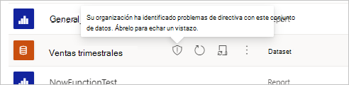
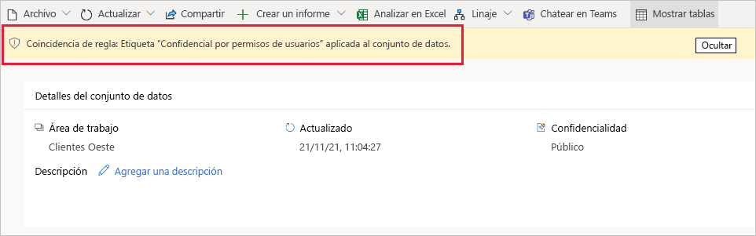
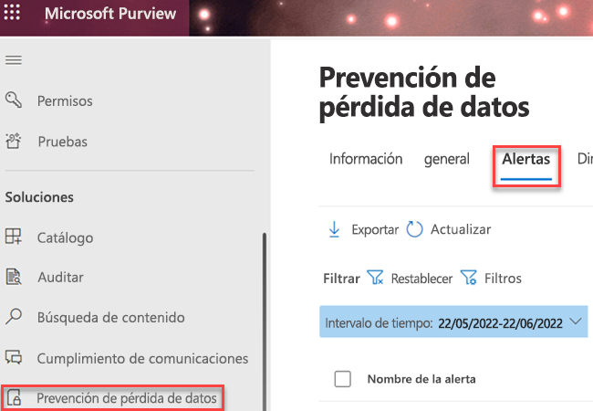

# Introducción a las directivas de prevención de pérdida de datos para Power BI (versión preliminar)

Para ayudar a las organizaciones a detectar y proteger sus datos confidenciales, [las directivas de prevención de pérdidas de datos (DLP) de Microsoft Purview](/microsoft-365/compliance/dlp-learn-about-dlp) admiten Power BI. Cuando un conjunto de datos de Power BI coincide con los criterios de una directiva DLP, se puede desencadenar una alerta que explique la naturaleza del contenido confidencial. Esta alerta también se registra en la pestaña **Alertas** de prevención de pérdida de datos del portal de cumplimiento normativo de Microsoft para su supervisión y administración por parte de los administradores. Además, se pueden enviar alertas por correo electrónico a los administradores y usuarios especificados.

[!INCLUDE [purview-preview](../includes/purview-preview.md)]

## Consideraciones y limitaciones

- Las directivas DLP se aplican a las áreas de trabajo. Solo se admiten áreas de trabajo hospedadas en capacidades Premium Gen2. Para obtener más información, consulte [¿Qué es Power BI Premium Gen2?](/power-bi/enterprise/service-premium-gen2-what-is).
- Las cargas de trabajo de evaluación del conjunto de datos DLP tienen efecto sobre la capacidad. No se admite la medición de cargas de trabajo de evaluación DLP.
- Se admiten las áreas de trabajo de experiencia clásica y nueva, siempre y cuando se hospeden en capacidades Premium Gen2.
- Debe crear una directiva personalizada DLP personalizada para Power BI. No se admiten plantillas DLP.
- Las directivas DLP que se aplican a la ubicación DLP admiten etiquetas de confidencialidad y tipos de información confidencial como condiciones. 
- Las directivas DLP para Power BI no se admiten para conjuntos de datos de ejemplo, [conjuntos de datos de streaming](/power-bi/connect-data/service-real-time-streaming)o conjuntos de datos que se conectan a su origen de datos a través de [DirectQuery](/power-bi/connect-data/desktop-use-directquery) o [conexión dinámica](/power-bi/connect-data/desktop-directquery-about#live-connections).
- Las directivas DLP para Power BI no se admiten en nubes soberanas.

## Licencias y permisos

### Licencias de SKU/suscripciones

Antes de empezar a trabajar con DLP para Power BI, debe confirmar la [suscripción de Microsoft 365](https://www.microsoft.com/microsoft-365/compare-microsoft-365-enterprise-plans?rtc=1). Para obtener instrucciones completas sobre licencias, consulte [Guía de seguridad y cumplimiento normativo para Microsoft 365](/office365/servicedescriptions/microsoft-365-service-descriptions/microsoft-365-tenantlevel-services-licensing-guidance/microsoft-365-security-compliance-licensing-guidance#information-protection).

### Permisos

Los datos de DLP para Power BI se pueden ver en el [Explorador de actividades](/microsoft-365/compliance/data-classification-activity-explorer). Hay cuatro roles que conceden permiso al explorador de actividad; la cuenta que use para acceder a los datos debe ser miembro de cualquiera de ellos.

- Administrador global
- Administrador de cumplimiento
- Administrador de seguridad
- Administrador de datos de cumplimiento

## Cómo funcionan las directivas DLP para Power BI

Defina una directiva DLP en la sección de prevención de pérdida de datos del portal de cumplimiento normativo. Vea [Diseñar una directiva de prevención de pérdidas de datos](dlp-policy-design.md#design-a-data-loss-prevention-policy). En la directiva, especifique las etiquetas de confidencialidad que desea detectar. También puede especificar las acciones que se producirán cuando la directiva detecte un conjunto de datos que tenga aplicada una etiqueta de confidencialidad especificada. Las directivas DLP admiten dos acciones para Power BI:

- Notificación de usuario a través de sugerencias de directiva.
- Alertas. Las alertas se pueden enviar por correo electrónico a los administradores y usuarios. Además, los administradores pueden supervisar y administrar alertas en la pestaña **Alertas** del Centro de cumplimiento normativo. 

Cuando DLP evalúa un conjunto de datos y coincide con las condiciones de una directiva DLP, se aplican las acciones definidas en la directiva. Un conjunto de datos se evalúa cuando un conjunto de datos es:

- Publicar
- Republish
- Actualización a petición
- Actualización programada

>[!NOTE]
> La evaluación DLP del conjunto de datos no se produce si se cumple alguna de las siguientes condiciones:
> - El iniciador del evento es una entidad de servicio.
> - El propietario del conjunto de datos es una entidad de servicio o un usuario B2B.

### Qué ocurre cuando un conjunto de datos coincide con una directiva DLP

Cuando un conjunto de datos coincide con una directiva DLP:

- Si la directiva tiene configurada la notificación de usuario, se marcará en el servicio Power BI con un icono de escudo para indicar que coincide con una directiva DLP.

    

    Abra la página de detalles del conjunto de datos para ver una sugerencia de directiva que explica la coincidencia de la directiva y cómo se debe controlar el tipo detectado de información confidencial.

    

    >[!NOTE]
    > Si oculta la sugerencia de directiva, no se elimina. Aparecerá la próxima vez que visite la página.

- Si las alertas están habilitadas en la directiva, se registrará una alerta en la pestaña **Alertas** DLP del centro de cumplimiento normativo y, si está configurada, se enviará un correo electrónico a los administradores o usuarios especificados. En la imagen siguiente se muestra la pestaña **Alertas** en la sección prevención de pérdidas de datos del portal de cumplimiento normativo de Microsoft Purview.

    

## Configurar una directiva DLP para Power BI

Siga los procedimientos descritos en [Crear, probar y ajustar una directiva DLP](create-test-tune-dlp-policy.md#create-test-and-tune-a-dlp-policy) y usar la plantilla personalizada.

> [!IMPORTANT]
> Al seleccionar las ubicaciones de la directiva DLP para Power BI, seleccione solo la ubicación Power BI. No seleccione ninguna otra ubicación, esta configuración no se admite. 

<!--1. Log into the [Microsoft Purview compliance portal](https://compliance.microsoft.com).

1. Choose the **Data loss prevention** solution in the navigation pane, select the **Policies** tab, choose **Create policy**.

    

1. Choose the **Custom** category and then the **Custom policy** template.
    
    >[!NOTE]
    >No other categories or templates are currently supported.

    
 
    When done, click **Next**.

1. Name the policy and provide a meaningful description.

    
 
    When done, click **Next**.

1. Enable Power BI as a location for the DLP policy. **Disable all other locations**. Currently, DLP policies for Power BI must specify Power BI as the sole location.

    

    By default the policy will apply to all workspaces. Alternatively, you can specify particular workspaces to include in the policy as well as workspaces to exclude from the policy.
    >[!NOTE]
    > DLP actions are supported only for workspaces hosted in Premium Gen2 capacities.

    If you select **Choose workspaces** or **Exclude workspaces**, a dialog will allow you to create a list of included (or excluded) workspaces. You must specify workspaces by workspace object ID. Click the info icon for information about how to find workspace object IDs.

    
 
    After enabling Power BI as a DLP location for the policy and choosing which workspaces the policy will apply to, click **Next**.

1. The **Define policy settings** page appears. Choose **Create or customize advanced DLP rules** to begin defining your policy.

    
 
    When done, click **Next**.

1. On the **Customize advanced DLP rules** page, you can either start creating a new rule or choose an existing rule to edit. Click **Create rule**.

    

1. The **Create rule** page appears. On the create rule page, provide a name and description for the rule, and then configure the other sections, which are described following the image below.

    
 
### Conditions

In the condition section, you define the conditions under which the policy will apply to a dataset. Conditions are created in groups. Groups make it possible to construct complex conditions.

1. Open the conditions section, choose **Add condition** and then **Content contains**.

    
 
    This opens the first group (named Default – you can change this).

1. Choose **Add**, and then **Sensitivity labels**.
        
    >[!NOTE]
    > Sensitive info types are currently not supported.
    
    
 
    When you choose **Sensitivity labels**, you will be able to choose a particular sensitivity label from a list that will appear.

    You can add additional sensitivity labels to the group. To the right of the group name, you can specify **Any of these** or **All of these**. This determines whether matches on all or any of the labels is required for the condition to hold. Make sure **Any of these** is selected, since datasets can’t have more than one label applied.

    The image below shows a group (Default) that contains two sensitivity label conditions. The logic Any of these means that a match on any one of the sensitivity labels in the group constitutes “true” for that group.

     
 
    You can create more than one group, and you can control the logic between the groups with **AND** or **OR** logic. 

    The image below shows a rule containing two groups, joined by **OR** logic.

     
 
### Exceptions

If the sensitivity label of the dataset matches any of the defined exceptions, the rule won’t be applied to the dataset. 

Exceptions are configured in the same way as conditions, described above.
    

 
### Actions

Protection actions are currently unavailable for Power BI DLP policies.

### User notifications

The user notifications section is where you configure your policy tip. Turn on the toggle, select the **Notify users in Office 365 service with a policy tip** and **Policy tips** checkboxes, and write your policy tip in the text box.

 
### User overrides
 
User overrides are currently unavailable for Power BI DLP policies.

 
 
### Incident reports

Assign a severity level that will be shown in alerts generated from this policy. Enable (default) or disable email notification to admins, specify users or groups for email notification, and configure the details about when notification will occur.

   
### Additional options

 
## Monitor and manage policy alerts

Log into the Microsoft Purview compliance portal and navigate to **Data loss prevention > Alerts**.

Click on an alert to start drilling down to its details and to see management options.
-->
## Siguientes pasos

- [Obtenga más información acerca de la prevención contra la pérdida de datos](/microsoft-365/compliance/dlp-learn-about-dlp)
- [Etiquetas de confidencialidad en Power BI](/power-bi/enterprise/service-security-sensitivity-label-overview)
- [Esquema de auditoría para etiquetas de confidencialidad en Power BI](/power-bi/enterprise/service-security-sensitivity-label-audit-schema)
