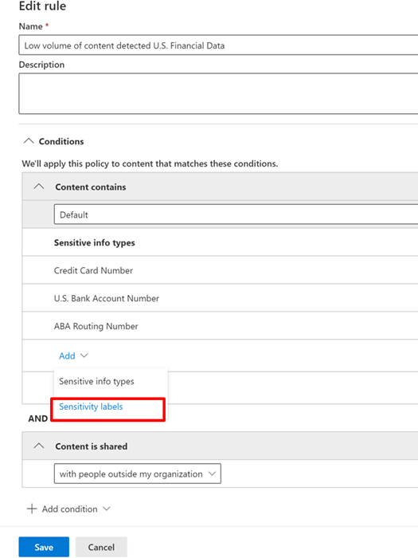

# Usar etiquetas de confidencialidad como condición en las directivas DLP (vista previa)

Puede usar [etiquetas de confidencialidad](sensitivity-labels.md) como condiciones en las directivas DLP para estas ubicaciones:

- Mensajes de correo electrónico de Exchange Online
- SharePoint Online
- Sitios de OneDrive para la Empresa
- Dispositivos con Windows 10

Las etiquetas de confidencialidad aparecen como una opción en la lista de **Contenido**.

## Elementos compatibles, escenarios y sugerencias de directiva

Puede usar etiquetas de confidencialidad como condiciones para estos elementos y en estos escenarios.

### Elementos compatibles

|servicio  |tipo de elemento  |disponible para sugerencia de directiva  |aplicable  |
|---------|---------|---------|---------|
|Exchange    |mensaje de correo electrónico         |sí         |sí         |
|Exchange    |datos adjuntos de correo electrónico         |no *         |no *         |
|SharePoint Online     |elementos en SharePoint Online         |sí         |sí         |
|OneDrive para la Empresa     |elementos         |sí         |sí         |
|Teams     |Mensajes de canal y de Teams         |no aplicable         |no aplicable         |
|Teams     |datos adjuntos         |sí **         |sí **         |
|Dispositivos de Windows 10 (vista previa)     |elementos         |sí         |sí         |
|MCAS (vista previa) |elementos         |sí         |sí         |

\* Se admite la detección DLP de etiquetas de confidencialidad en mensajes de correo electrónico. No se admite la detección DLP de etiquetas de confidencialidad en los datos adjuntos de correo electrónico.

\** Los datos adjuntos enviados en Teams sobre chats o canales 1:1 se cargan automáticamente en OneDrive para la empresa y SharePoint. Por lo tanto, si se incluyen SharePoint Online o OneDrive para la empresa como ubicaciones en su directiva DLP, los datos adjuntos etiquetados enviados en Teams se incluirán automáticamente en el ámbito de esta condición. No es necesario seleccionar Teams como una ubicación en la Directiva DLP.

### Escenarios admitidos

- El administrador de DLP podrá ver una lista de todas las etiquetas de confidencialidad en el espacio empresarial cuando decida incluir una o más etiquetas de confidencialidad como condición.
- El uso de las etiquetas de confidencialidad como condición se admite en todas las cargas de trabajo, como se indica en la matriz de soporte más arriba
- Las sugerencias de directiva DLP se seguirán mostrando en las cargas de trabajo (excepto Outlook Win32) para las directivas DLP que contienen la etiqueta de confidencialidad como condición.
- Las etiquetas de sensibilidad también aparecerán como parte del correo del informe de incidentes si se cumple una directiva DLP con la etiqueta de confidencialidad como condición.
- Los detalles de la etiqueta de confidencialidad también se mostrarán en el registro de auditoría de coincidencia de regla DLP para una coincidencia de directiva DLP que contiene la etiqueta de confidencialidad como condición.

### Sugerencias de directivas compatibles

|carga de trabajo  |Sugerencias sobre las directivas compatibles / no compatibles  |
|---------|---------|
|OWA |    compatible     |
|Outlook Win 32    |  no compatible       |
|SharePoint   |   compatible      |
|OneDrive para la Empresa    |    compatible     |
|dispositivos de punto de conexión   |  no compatible       |
