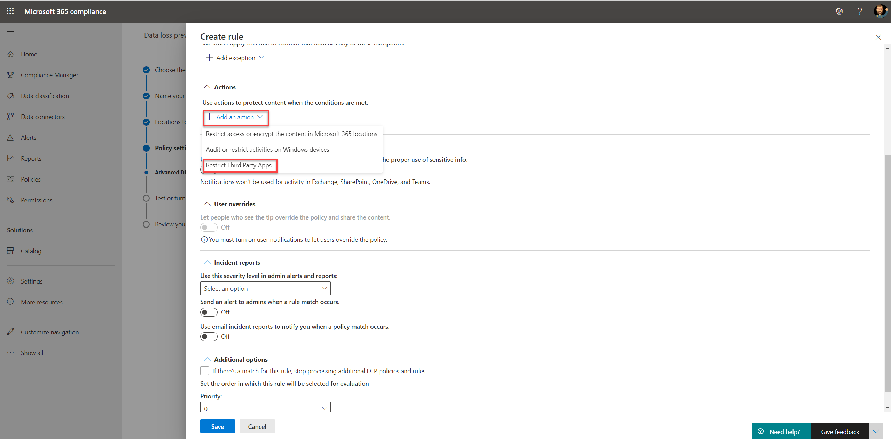

# Usar directivas de prevención de pérdida de datos para aplicaciones en la nube que no sean de Microsoft (versión preliminar)

Las directivas de prevención de pérdida de datos (DLP) de aplicaciones en la nube que no son de Microsoft forman parte del conjunto de características de Microsoft 365 DLP; con estas características, puede detectar y proteger los elementos confidenciales en los servicios de Microsoft 365. Para obtener más información sobre todas las ofertas de DLP de Microsoft, vea [información general sobre prevención de pérdida de datos](https://docs.microsoft.com/microsoft-365/compliance/data-loss-prevention-policies?view=o365-worldwide).

Puede usar directivas de DLP para las aplicaciones en la nube que no son de Microsoft para supervisar y detectar los elementos confidenciales que se usan y comparten a través de aplicaciones en la nube que no son de Microsoft. El uso de estas directivas le proporciona la visibilidad y el control necesarios para garantizar que se usan y protegen correctamente, y ayuda a evitar un comportamiento arriesgado que pueda poner en peligro.

## Antes de empezar

### Licencias de SKU/suscripciones

Antes de empezar a usar directivas de DLP en aplicaciones en la nube que no sean de Microsoft, confirme la [suscripción a microsoft 365](https://www.microsoft.com/microsoft-365/compare-microsoft-365-enterprise-plans?rtc=1) y los complementos. Para tener acceso a esta funcionalidad y usarla, debe tener una de estas suscripciones o complementos:

- Microsoft 365 E5
- Cumplimiento de Microsoft 365 E5
- Seguridad de Microsoft 365 E5

### Preparar el entorno de seguridad de aplicaciones en la nube

Las directivas DLP en las aplicaciones en la nube que no son de Microsoft usan capacidades DLP de Cloud App Security. Para usarlo, debe preparar el entorno de Cloud App Security. Para obtener instrucciones, vea [establecer la visibilidad, la protección y las acciones de gobierno de isntant para las aplicaciones](https://docs.microsoft.com/cloud-app-security/getting-started-with-cloud-app-security#step-1-set-instant-visibility-protection-and-governance-actions-for-your-apps).

### Conectar una aplicación en la nube que no es de Microsoft

Para usar la Directiva DLP en una aplicación en la nube específica que no es de Microsoft, la aplicación debe estar conectada a Cloud App Security. Para obtener información, consulte:

- [Cuadro conectar](https://docs.microsoft.com/cloud-app-security/connect-box-to-microsoft-cloud-app-security)
- [Conectar con Dropbox](https://docs.microsoft.com/cloud-app-security/connect-dropbox-to-microsoft-cloud-app-security)
- [Conexión G-Suite](https://docs.microsoft.com/cloud-app-security/connect-google-apps-to-microsoft-cloud-app-security)
- [Conexión de Salesforce](https://docs.microsoft.com/cloud-app-security/connect-salesforce-to-microsoft-cloud-app-security)
- [Conectar Cisco WebEx](https://docs.microsoft.com/cloud-app-security/connect-webex-to-microsoft-cloud-app-security)

Después de conectar las aplicaciones en la nube a Cloud App Security, puede crear directivas de Microsoft 365 DLP para ellas.

>[!NOTE]
>También es posible usar Microsoft Cloud App Security para crear directivas DLP para las aplicaciones en la nube de Microsoft. Sin embargo, se recomienda usar Microsoft 365 para crear y administrar directivas de DLP para las aplicaciones en la nube de Microsoft.

## Crear una directiva DLP para una aplicación en la nube que no es de Microsoft

Cuando seleccione una ubicación para la Directiva DLP, active la ubicación de **seguridad** de la aplicación en la nube de Microsoft.

- Para seleccionar una aplicación o instancia específica, seleccione **elegir instancia**.
- Si no selecciona una instancia, la Directiva usará todas las aplicaciones conectadas en el inquilino de seguridad de la aplicación en la nube de Microsoft.

   

   

Puede elegir varias acciones para cada aplicación en la nube que no sea de Microsoft compatible. Para cada aplicación, hay diferentes acciones posibles (depende de la API de la aplicación de nube).

Al crear una regla en la Directiva DLP, puede seleccionar una acción para las aplicaciones en la nube que no sean de Microsoft. Para restringir aplicaciones de terceros, seleccione **restringir aplicaciones de terceros**.

Para obtener información acerca de la creación y configuración de directivas de DLP, consulte [Create Test and Tune a DLP Policy](https://docs.microsoft.com/microsoft-365/compliance/create-test-tune-dlp-policy?view=o365-worldwide).

## Consulte también

- [Crear prueba y ajustar una directiva DLP](https://docs.microsoft.com/microsoft-365/compliance/create-test-tune-dlp-policy?view=o365-worldwide)
- [Introducción a la directiva predeterminada de DLP](https://docs.microsoft.com/microsoft-365/compliance/get-started-with-the-default-dlp-policy?view=o365-worldwide)
- [Crear una directiva DLP desde una plantilla](https://docs.microsoft.com/microsoft-365/compliance/create-a-dlp-policy-from-a-template?view=o365-worldwide)
