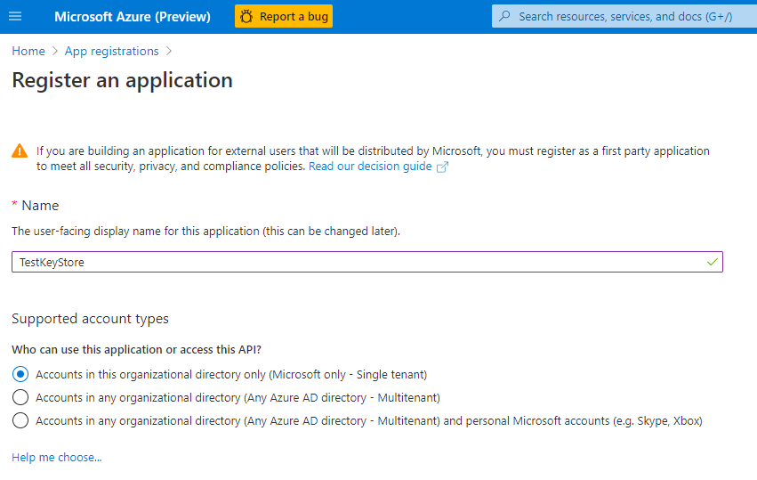

# <a name="double-key-encryption-for-microsoft-365"></a><span data-ttu-id="4b3ab-103">Cifrado de clave doble para Microsoft 365</span><span class="sxs-lookup"><span data-stu-id="4b3ab-103">Double Key Encryption for Microsoft 365</span></span>

> <span data-ttu-id="4b3ab-104">*Se aplica a: Double Key Encryption for Microsoft 365, [Microsoft 365 Compliance](https://www.microsoft.com/microsoft-365/business/compliance-management), Azure [Information Protection](https://azure.microsoft.com/pricing/details/information-protection)*</span><span class="sxs-lookup"><span data-stu-id="4b3ab-104">*Applies to: Double Key Encryption for Microsoft 365, [Microsoft 365 Compliance](https://www.microsoft.com/microsoft-365/business/compliance-management), [Azure Information Protection](https://azure.microsoft.com/pricing/details/information-protection)*</span></span>
>
> <span data-ttu-id="4b3ab-105">*Instrucciones para: Cliente de etiquetado [unificado de Azure Information Protection para Windows](/azure/information-protection/faqs#whats-the-difference-between-the-azure-information-protection-classic-and-unified-labeling-clients)*</span><span class="sxs-lookup"><span data-stu-id="4b3ab-105">*Instructions for: [Azure Information Protection unified labeling client for Windows](/azure/information-protection/faqs#whats-the-difference-between-the-azure-information-protection-classic-and-unified-labeling-clients)*</span></span>
>
> <span data-ttu-id="4b3ab-106">*Descripción del servicio para: [Microsoft 365 cumplimiento](/office365/servicedescriptions/microsoft-365-service-descriptions/microsoft-365-tenantlevel-services-licensing-guidance/microsoft-365-security-compliance-licensing-guidance)*</span><span class="sxs-lookup"><span data-stu-id="4b3ab-106">*Service description for: [Microsoft 365 Compliance](/office365/servicedescriptions/microsoft-365-service-descriptions/microsoft-365-tenantlevel-services-licensing-guidance/microsoft-365-security-compliance-licensing-guidance)*</span></span>

<span data-ttu-id="4b3ab-107">Double Key Encryption (DKE) usa dos claves juntas para obtener acceso al contenido protegido.</span><span class="sxs-lookup"><span data-stu-id="4b3ab-107">Double Key Encryption (DKE) uses two keys together to access protected content.</span></span> <span data-ttu-id="4b3ab-108">Microsoft almacena una clave en Microsoft Azure y mantiene la otra clave.</span><span class="sxs-lookup"><span data-stu-id="4b3ab-108">Microsoft stores one key in Microsoft Azure, and you hold the other key.</span></span> <span data-ttu-id="4b3ab-109">Se mantiene el control total de una de las claves mediante el servicio de cifrado de clave doble.</span><span class="sxs-lookup"><span data-stu-id="4b3ab-109">You maintain full control of one of your keys using the Double Key Encryption service.</span></span> <span data-ttu-id="4b3ab-110">Puede aplicar protección mediante el cliente de etiquetado unificado de Azure Information Protection a su contenido altamente confidencial.</span><span class="sxs-lookup"><span data-stu-id="4b3ab-110">You apply protection using The Azure Information Protection unified labeling client to your highly sensitive content.</span></span>

<span data-ttu-id="4b3ab-111">Double Key Encryption admite implementaciones locales y en la nube.</span><span class="sxs-lookup"><span data-stu-id="4b3ab-111">Double Key Encryption supports both cloud and on-premises deployments.</span></span> <span data-ttu-id="4b3ab-112">Estas implementaciones ayudan a garantizar que los datos cifrados permanecen opacos siempre que almacene los datos protegidos.</span><span class="sxs-lookup"><span data-stu-id="4b3ab-112">These deployments help to ensure that encrypted data remains opaque wherever you store the protected data.</span></span>

<span data-ttu-id="4b3ab-113">Para obtener más información acerca de las claves raíz de inquilino predeterminadas basadas en la nube, vea [Planning and implementing your Azure Information Protection tenant key](/azure/information-protection/plan-implement-tenant-key).</span><span class="sxs-lookup"><span data-stu-id="4b3ab-113">For more information about the default, cloud-based tenant root keys, see [Planning and implementing your Azure Information Protection tenant key](/azure/information-protection/plan-implement-tenant-key).</span></span>

## <a name="when-your-organization-should-adopt-dke"></a><span data-ttu-id="4b3ab-114">Cuando su organización debe adoptar DKE</span><span class="sxs-lookup"><span data-stu-id="4b3ab-114">When your organization should adopt DKE</span></span>

<span data-ttu-id="4b3ab-115">El cifrado de clave doble está pensado para los datos más confidenciales que están sujetos a los requisitos de protección más estrictos.</span><span class="sxs-lookup"><span data-stu-id="4b3ab-115">Double Key Encryption is intended for your most sensitive data that is subject to the strictest protection requirements.</span></span> <span data-ttu-id="4b3ab-116">DKE no está pensado para todos los datos.</span><span class="sxs-lookup"><span data-stu-id="4b3ab-116">DKE is not intended for all data.</span></span> <span data-ttu-id="4b3ab-117">En general, usarás cifrado de clave doble para proteger solo una pequeña parte de los datos generales.</span><span class="sxs-lookup"><span data-stu-id="4b3ab-117">In general, you'll be using Double Key Encryption to protect only a small part of your overall data.</span></span> <span data-ttu-id="4b3ab-118">Debe realizar la debida diligencia en la identificación de los datos adecuados para cubrir con esta solución antes de implementar.</span><span class="sxs-lookup"><span data-stu-id="4b3ab-118">You should do due diligence in identifying the right data to cover with this solution before you deploy.</span></span> <span data-ttu-id="4b3ab-119">En algunos casos, es posible que deba restringir el ámbito y usar otras soluciones para la mayoría de los datos, como Microsoft Information Protection con claves administradas por Microsoft o BYOK.</span><span class="sxs-lookup"><span data-stu-id="4b3ab-119">In some cases, you might need to narrow your scope and make use of other solutions for most your data such as Microsoft Information Protection with Microsoft-managed keys or BYOK.</span></span> <span data-ttu-id="4b3ab-120">Estas soluciones son suficientes para documentos que no están sujetos a protecciones mejoradas y requisitos normativos.</span><span class="sxs-lookup"><span data-stu-id="4b3ab-120">These solutions are sufficient for documents that aren't subject to enhanced protections and regulatory requirements.</span></span> <span data-ttu-id="4b3ab-121">Además, estas soluciones le permiten usar los servicios de Office 365 más eficaces; servicios que no puede usar con contenido cifrado DKE.</span><span class="sxs-lookup"><span data-stu-id="4b3ab-121">Also, these solutions enable you to use the most powerful Office 365 services; services that you can't use with DKE encrypted content.</span></span> <span data-ttu-id="4b3ab-122">Por ejemplo:</span><span class="sxs-lookup"><span data-stu-id="4b3ab-122">For example:</span></span>

- <span data-ttu-id="4b3ab-123">Reglas de transporte como antimalware y correo no deseado que requieren visibilidad en los datos adjuntos</span><span class="sxs-lookup"><span data-stu-id="4b3ab-123">Transport rules including anti-malware and spam that require visibility into the attachment</span></span>
- <span data-ttu-id="4b3ab-124">Microsoft Delve</span><span class="sxs-lookup"><span data-stu-id="4b3ab-124">Microsoft Delve</span></span>
- <span data-ttu-id="4b3ab-125">eDiscovery</span><span class="sxs-lookup"><span data-stu-id="4b3ab-125">eDiscovery</span></span>
- <span data-ttu-id="4b3ab-126">Búsqueda de contenido e indización</span><span class="sxs-lookup"><span data-stu-id="4b3ab-126">Content search and indexing</span></span>
- <span data-ttu-id="4b3ab-127">Office Aplicaciones web, incluida la funcionalidad de coautoría</span><span class="sxs-lookup"><span data-stu-id="4b3ab-127">Office Web Apps including coauthoring functionality</span></span>

<span data-ttu-id="4b3ab-128">Las aplicaciones o servicios externos que no estén integrados con DKE a través del SDK de MIP no podrán realizar acciones en los datos cifrados.</span><span class="sxs-lookup"><span data-stu-id="4b3ab-128">Any external applications or services that are not integrated with DKE through the MIP SDK will be unable to perform actions on the encrypted data.</span></span>

<span data-ttu-id="4b3ab-129">Microsoft Information Protection SDK 1.7+ admite el cifrado de doble clave; las aplicaciones que se integran con nuestro SDK podrán razonar estos datos con suficientes permisos e integraciones en su lugar.</span><span class="sxs-lookup"><span data-stu-id="4b3ab-129">The Microsoft Information Protection SDK 1.7+ supports Double Key Encryption; applications that integrate with our SDK will be able to reason over this data with sufficient permissions and integrations in place.</span></span>

<span data-ttu-id="4b3ab-130">Se recomienda que las organizaciones usen las capacidades de Protección de información de Microsoft (clasificación y etiquetado) para proteger la mayoría de sus datos confidenciales y solo usan DKE para sus datos de misión crítica.</span><span class="sxs-lookup"><span data-stu-id="4b3ab-130">We recommend organizations use Microsoft Information protection capabilities (classification and labeling) to protect most of their sensitive data and only use DKE for their mission-critical data.</span></span> <span data-ttu-id="4b3ab-131">El cifrado de doble clave es relevante para los datos confidenciales en sectores altamente regulados como los servicios financieros y la atención sanitaria.</span><span class="sxs-lookup"><span data-stu-id="4b3ab-131">Double Key Encryption is relevant for sensitive data in highly regulated industries such as Financial services and Healthcare.</span></span>

<span data-ttu-id="4b3ab-132">Si sus organizaciones tienen cualquiera de los siguientes requisitos, puede usar DKE para ayudar a proteger el contenido:</span><span class="sxs-lookup"><span data-stu-id="4b3ab-132">If your organizations have any of the following requirements, you can use DKE to help secure your content:</span></span>

- <span data-ttu-id="4b3ab-133">Desea asegurarse de que *solo puede* descifrar el contenido protegido, en todas las circunstancias.</span><span class="sxs-lookup"><span data-stu-id="4b3ab-133">You want to ensure that *only you* can ever decrypt protected content, under all circumstances.</span></span>
- <span data-ttu-id="4b3ab-134">No desea que Microsoft tenga acceso a datos protegidos por sí mismo.</span><span class="sxs-lookup"><span data-stu-id="4b3ab-134">You don't want Microsoft to have access to protected data on its own.</span></span>
- <span data-ttu-id="4b3ab-135">Tiene requisitos normativos para contener claves dentro de un límite geográfico.</span><span class="sxs-lookup"><span data-stu-id="4b3ab-135">You have regulatory requirements to hold keys within a geographical boundary.</span></span> <span data-ttu-id="4b3ab-136">Todas las claves que contiene para el cifrado y descifrado de datos se mantienen en el centro de datos.</span><span class="sxs-lookup"><span data-stu-id="4b3ab-136">All of the keys that you hold for data encryption and decryption are maintained in your data center.</span></span>

## <a name="system-and-licensing-requirements-for-dke"></a><span data-ttu-id="4b3ab-137">Requisitos de sistema y licencias para DKE</span><span class="sxs-lookup"><span data-stu-id="4b3ab-137">System and licensing requirements for DKE</span></span>

<span data-ttu-id="4b3ab-138">**Double Key Encryption for Microsoft 365** viene con Microsoft 365 E5.</span><span class="sxs-lookup"><span data-stu-id="4b3ab-138">**Double Key Encryption for Microsoft 365** comes with Microsoft 365 E5.</span></span> <span data-ttu-id="4b3ab-139">Si no tiene una licencia de Microsoft 365 E5, puede registrarse para obtener una [versión de prueba](https://aka.ms/M365E5ComplianceTrial).</span><span class="sxs-lookup"><span data-stu-id="4b3ab-139">If you don’t have a Microsoft 365 E5 license, you can sign up for a [trial](https://aka.ms/M365E5ComplianceTrial).</span></span> <span data-ttu-id="4b3ab-140">Para obtener más información acerca de estas licencias, vea Microsoft 365 guía de licencias para [seguridad y & cumplimiento](/office365/servicedescriptions/microsoft-365-service-descriptions/microsoft-365-tenantlevel-services-licensing-guidance/microsoft-365-security-compliance-licensing-guidance).</span><span class="sxs-lookup"><span data-stu-id="4b3ab-140">For more information about these licenses, see [Microsoft 365 licensing guidance for security & compliance](/office365/servicedescriptions/microsoft-365-service-descriptions/microsoft-365-tenantlevel-services-licensing-guidance/microsoft-365-security-compliance-licensing-guidance).</span></span>

<span data-ttu-id="4b3ab-141">**Azure Information Protection**.</span><span class="sxs-lookup"><span data-stu-id="4b3ab-141">**Azure Information Protection**.</span></span> <span data-ttu-id="4b3ab-142">DKE funciona con etiquetas de confidencialidad y requiere Azure Information Protection.</span><span class="sxs-lookup"><span data-stu-id="4b3ab-142">DKE works with sensitivity labels and requires Azure Information Protection.</span></span>

<span data-ttu-id="4b3ab-143">Las etiquetas de confidencialidad DKE están disponibles para los usuarios finales a través de la cinta de confidencialidad Office aplicaciones de escritorio.</span><span class="sxs-lookup"><span data-stu-id="4b3ab-143">DKE sensitivity labels are made available to end users through the sensitivity ribbon in Office Desktop Apps.</span></span> <span data-ttu-id="4b3ab-144">Instale estos requisitos previos en cada equipo cliente donde desee proteger y consumir documentos protegidos.</span><span class="sxs-lookup"><span data-stu-id="4b3ab-144">Install these prerequisites on each client computer where you want to protect and consume protected documents.</span></span>

<span data-ttu-id="4b3ab-145">**Microsoft Office aplicaciones para empresas** versión 2009 o posterior (versiones de escritorio de Word, PowerPoint y Excel) en Windows.</span><span class="sxs-lookup"><span data-stu-id="4b3ab-145">**Microsoft Office Apps for enterprise** version 2009 or later (Desktop versions of Word, PowerPoint, and Excel) on Windows.</span></span>

<span data-ttu-id="4b3ab-146">**Azure Information Protection Unified Labeling Client versions** 2.7.93.0 o posterior.</span><span class="sxs-lookup"><span data-stu-id="4b3ab-146">**Azure Information Protection Unified Labeling Client** versions 2.7.93.0 or later.</span></span> <span data-ttu-id="4b3ab-147">Descargue e instale el cliente de etiquetado unificado desde el [Centro de descarga de Microsoft](https://www.microsoft.com/download/details.aspx?id=53018).</span><span class="sxs-lookup"><span data-stu-id="4b3ab-147">Download and install the Unified Labeling client from the [Microsoft download center](https://www.microsoft.com/download/details.aspx?id=53018).</span></span>

## <a name="supported-environments-for-storing-and-viewing-dke-protected-content"></a><span data-ttu-id="4b3ab-148">Entornos compatibles para almacenar y ver contenido protegido por DKE</span><span class="sxs-lookup"><span data-stu-id="4b3ab-148">Supported environments for storing and viewing DKE-protected content</span></span>

<span data-ttu-id="4b3ab-149">**Aplicaciones admitidas**.</span><span class="sxs-lookup"><span data-stu-id="4b3ab-149">**Supported applications**.</span></span> <span data-ttu-id="4b3ab-150">[Aplicaciones Microsoft 365 para empresas](https://www.microsoft.com/microsoft-365/business/microsoft-365-apps-for-enterprise-product) clientes en Windows, incluidos Word, Excel y PowerPoint.</span><span class="sxs-lookup"><span data-stu-id="4b3ab-150">[Microsoft 365 Apps for enterprise](https://www.microsoft.com/microsoft-365/business/microsoft-365-apps-for-enterprise-product) clients on Windows, including Word, Excel, and PowerPoint.</span></span>

<span data-ttu-id="4b3ab-151">**Compatibilidad con contenido en línea**.</span><span class="sxs-lookup"><span data-stu-id="4b3ab-151">**Online content support**.</span></span> <span data-ttu-id="4b3ab-152">Puede almacenar documentos y archivos protegidos con cifrado de clave doble en línea en Microsoft SharePoint y OneDrive para la Empresa.</span><span class="sxs-lookup"><span data-stu-id="4b3ab-152">You can store documents and files protected with Double Key Encryption online in both Microsoft SharePoint and OneDrive for Business.</span></span> <span data-ttu-id="4b3ab-153">Antes de cargar en estas ubicaciones, debe etiquetar y proteger documentos y archivos con DKE.</span><span class="sxs-lookup"><span data-stu-id="4b3ab-153">You must label and protect documents and files with DKE by supported applications before you upload to these locations.</span></span> <span data-ttu-id="4b3ab-154">Puede compartir contenido cifrado por correo electrónico, pero no puede ver documentos y archivos cifrados en línea.</span><span class="sxs-lookup"><span data-stu-id="4b3ab-154">You can share encrypted content by email, but you can't view encrypted documents and files online.</span></span> <span data-ttu-id="4b3ab-155">En su lugar, debe ver el contenido protegido con las aplicaciones de escritorio y los clientes admitidos en el equipo local.</span><span class="sxs-lookup"><span data-stu-id="4b3ab-155">Instead, you must view protected content using the supported desktop applications and clients on your local computer.</span></span>

## <a name="overview-of-deploying-dke"></a><span data-ttu-id="4b3ab-156">Información general sobre la implementación de DKE</span><span class="sxs-lookup"><span data-stu-id="4b3ab-156">Overview of deploying DKE</span></span>

<span data-ttu-id="4b3ab-157">Seguirá estos pasos generales para configurar DKE.</span><span class="sxs-lookup"><span data-stu-id="4b3ab-157">You'll follow these general steps to set up DKE.</span></span> <span data-ttu-id="4b3ab-158">Una vez completados estos pasos, los usuarios finales podrán proteger los datos altamente confidenciales con cifrado de clave doble.</span><span class="sxs-lookup"><span data-stu-id="4b3ab-158">Once you've completed these steps, your end users will can protect your highly sensitive data with Double Key Encryption.</span></span>

1. <span data-ttu-id="4b3ab-159">Implemente el servicio DKE tal como se describe en este artículo.</span><span class="sxs-lookup"><span data-stu-id="4b3ab-159">Deploy the DKE service as described in this article.</span></span>

2. <span data-ttu-id="4b3ab-160">Cree una etiqueta con cifrado de clave doble.</span><span class="sxs-lookup"><span data-stu-id="4b3ab-160">Create a label with Double Key Encryption.</span></span> <span data-ttu-id="4b3ab-161">Vaya a Protección de la información en el [centro Microsoft 365 de cumplimiento](https://compliance.microsoft.com) y cree una nueva etiqueta con cifrado de clave doble.</span><span class="sxs-lookup"><span data-stu-id="4b3ab-161">Navigate to Information protection under the [Microsoft 365 compliance center](https://compliance.microsoft.com) and create a new label with Double Key Encryption.</span></span> <span data-ttu-id="4b3ab-162">Consulte [Restringir el acceso al contenido mediante etiquetas de confidencialidad para aplicar cifrado.](./encryption-sensitivity-labels.md)</span><span class="sxs-lookup"><span data-stu-id="4b3ab-162">See [Restrict access to content by using sensitivity labels to apply encryption](./encryption-sensitivity-labels.md).</span></span>

3. <span data-ttu-id="4b3ab-163">Use etiquetas de cifrado de clave doble.</span><span class="sxs-lookup"><span data-stu-id="4b3ab-163">Use Double Key Encryption labels.</span></span> <span data-ttu-id="4b3ab-164">Proteja los datos seleccionando la etiqueta Double Key Encrypted de la cinta de opciones De confidencialidad en Microsoft Office.</span><span class="sxs-lookup"><span data-stu-id="4b3ab-164">Protect data by selecting the Double Key Encrypted label from the Sensitivity ribbon in Microsoft Office.</span></span>

<span data-ttu-id="4b3ab-165">Hay varias maneras de completar algunos de los pasos para implementar el cifrado de clave doble.</span><span class="sxs-lookup"><span data-stu-id="4b3ab-165">There are several ways you can complete some of the steps to deploy Double Key Encryption.</span></span> <span data-ttu-id="4b3ab-166">En este artículo se proporcionan instrucciones detalladas para que los administradores con menos experiencia implemente correctamente el servicio.</span><span class="sxs-lookup"><span data-stu-id="4b3ab-166">This article provides detailed instructions so that less experienced admins successfully deploy the service.</span></span> <span data-ttu-id="4b3ab-167">Si se siente cómodo al hacerlo, puede elegir usar sus propios métodos.</span><span class="sxs-lookup"><span data-stu-id="4b3ab-167">If you're comfortable doing so, you can choose to use your own methods.</span></span>

## <a name="deploy-dke"></a><span data-ttu-id="4b3ab-168">Implementar DKE</span><span class="sxs-lookup"><span data-stu-id="4b3ab-168">Deploy DKE</span></span>

<span data-ttu-id="4b3ab-169">Este artículo y el vídeo de implementación usan Azure como destino de implementación para el servicio DKE.</span><span class="sxs-lookup"><span data-stu-id="4b3ab-169">This article and the deployment video use Azure as the deployment destination for the DKE service.</span></span> <span data-ttu-id="4b3ab-170">Si está implementando en otra ubicación, deberá proporcionar sus propios valores.</span><span class="sxs-lookup"><span data-stu-id="4b3ab-170">If you're deploying to another location, you'll need to provide your own values.</span></span>

<span data-ttu-id="4b3ab-171">Vea el [vídeo de implementación de cifrado de clave](https://youtu.be/vDWfHN_kygg) doble para ver una introducción paso a paso de los conceptos de este artículo.</span><span class="sxs-lookup"><span data-stu-id="4b3ab-171">Watch the [Double Key Encryption deployment video](https://youtu.be/vDWfHN_kygg) to see a step-by-step overview of the concepts in this article.</span></span> <span data-ttu-id="4b3ab-172">El vídeo tarda unos 18 minutos en completarse.</span><span class="sxs-lookup"><span data-stu-id="4b3ab-172">The video takes about 18 minutes to complete.</span></span>

<span data-ttu-id="4b3ab-173">Seguirá estos pasos generales para configurar el cifrado de clave doble para su organización.</span><span class="sxs-lookup"><span data-stu-id="4b3ab-173">You'll follow these general steps to set up Double Key Encryption for your organization.</span></span>

1. [<span data-ttu-id="4b3ab-174">Instalar requisitos previos de software para el servicio DKE</span><span class="sxs-lookup"><span data-stu-id="4b3ab-174">Install software prerequisites for the DKE service</span></span>](#install-software-prerequisites-for-the-dke-service)
1. [<span data-ttu-id="4b3ab-175">Clonar el repositorio de GitHub clave doble</span><span class="sxs-lookup"><span data-stu-id="4b3ab-175">Clone the Double Key Encryption GitHub repository</span></span>](#clone-the-dke-github-repository)
1. [<span data-ttu-id="4b3ab-176">Modificar la configuración de la aplicación</span><span class="sxs-lookup"><span data-stu-id="4b3ab-176">Modify application settings</span></span>](#modify-application-settings)
1. [<span data-ttu-id="4b3ab-177">Generar claves de prueba</span><span class="sxs-lookup"><span data-stu-id="4b3ab-177">Generate test keys</span></span>](#generate-test-keys)
1. [<span data-ttu-id="4b3ab-178">Crear el proyecto</span><span class="sxs-lookup"><span data-stu-id="4b3ab-178">Build the project</span></span>](#build-the-project)
1. [<span data-ttu-id="4b3ab-179">Implementar el servicio DKE y publicar el almacén de claves</span><span class="sxs-lookup"><span data-stu-id="4b3ab-179">Deploy the DKE service and publish the key store</span></span>](#deploy-the-dke-service-and-publish-the-key-store)
1. [<span data-ttu-id="4b3ab-180">Validar la implementación</span><span class="sxs-lookup"><span data-stu-id="4b3ab-180">Validate your deployment</span></span>](#validate-your-deployment)
1. [<span data-ttu-id="4b3ab-181">Registrar el almacén de claves</span><span class="sxs-lookup"><span data-stu-id="4b3ab-181">Register your key store</span></span>](#register-your-key-store)
1. [<span data-ttu-id="4b3ab-182">Crear etiquetas de confidencialidad con DKE</span><span class="sxs-lookup"><span data-stu-id="4b3ab-182">Create sensitivity labels using DKE</span></span>](#create-sensitivity-labels-using-dke)
1. [<span data-ttu-id="4b3ab-183">Habilitar DKE en el cliente</span><span class="sxs-lookup"><span data-stu-id="4b3ab-183">Enable DKE in your client</span></span>](#enable-dke-in-your-client)
1. [<span data-ttu-id="4b3ab-184">Migrar archivos protegidos de etiquetas HYOK a etiquetas DKE</span><span class="sxs-lookup"><span data-stu-id="4b3ab-184">Migrate protected files from HYOK labels to DKE labels</span></span>](#migrate-protected-files-from-hyok-labels-to-dke-labels)

<span data-ttu-id="4b3ab-185">Cuando haya terminado, puede cifrar documentos y archivos mediante DKE.</span><span class="sxs-lookup"><span data-stu-id="4b3ab-185">When you're done, you can encrypt documents and files using DKE.</span></span> <span data-ttu-id="4b3ab-186">Para obtener información, vea [Apply sensitivity labels to your files and email in Office](https://support.microsoft.com/office/2f96e7cd-d5a4-403b-8bd7-4cc636bae0f9).</span><span class="sxs-lookup"><span data-stu-id="4b3ab-186">For information, see [Apply sensitivity labels to your files and email in Office](https://support.microsoft.com/office/2f96e7cd-d5a4-403b-8bd7-4cc636bae0f9).</span></span>

### <a name="install-software-prerequisites-for-the-dke-service"></a><span data-ttu-id="4b3ab-187">Instalar requisitos previos de software para el servicio DKE</span><span class="sxs-lookup"><span data-stu-id="4b3ab-187">Install software prerequisites for the DKE service</span></span>

<span data-ttu-id="4b3ab-188">Instale estos requisitos previos en el equipo donde desea instalar el servicio DKE.</span><span class="sxs-lookup"><span data-stu-id="4b3ab-188">Install these prerequisites on the computer where you want to install the DKE service.</span></span>

<span data-ttu-id="4b3ab-189">**SDK de .NET Core 3.1**.</span><span class="sxs-lookup"><span data-stu-id="4b3ab-189">**.NET Core 3.1 SDK**.</span></span> <span data-ttu-id="4b3ab-190">Descargue e instale el SDK desde [Download .NET Core 3.1](https://dotnet.microsoft.com/download/dotnet-core/3.1).</span><span class="sxs-lookup"><span data-stu-id="4b3ab-190">Download and install the SDK from [Download .NET Core 3.1](https://dotnet.microsoft.com/download/dotnet-core/3.1).</span></span>

<span data-ttu-id="4b3ab-191">**Visual Studio Code**.</span><span class="sxs-lookup"><span data-stu-id="4b3ab-191">**Visual Studio Code**.</span></span> <span data-ttu-id="4b3ab-192">Descargue Visual Studio Code desde [https://code.visualstudio.com/](https://code.visualstudio.com) .</span><span class="sxs-lookup"><span data-stu-id="4b3ab-192">Download Visual Studio Code from [https://code.visualstudio.com/](https://code.visualstudio.com).</span></span> <span data-ttu-id="4b3ab-193">Una vez instalado, ejecute Visual Studio Code  y seleccione \> **Ver extensiones**.</span><span class="sxs-lookup"><span data-stu-id="4b3ab-193">Once installed, run Visual Studio Code and select **View** \> **Extensions**.</span></span> <span data-ttu-id="4b3ab-194">Instale estas extensiones.</span><span class="sxs-lookup"><span data-stu-id="4b3ab-194">Install these extensions.</span></span>

- <span data-ttu-id="4b3ab-195">C# para Visual Studio Code</span><span class="sxs-lookup"><span data-stu-id="4b3ab-195">C# for Visual Studio Code</span></span>

- <span data-ttu-id="4b3ab-196">NuGet Administrador de paquetes</span><span class="sxs-lookup"><span data-stu-id="4b3ab-196">NuGet Package Manager</span></span>

<span data-ttu-id="4b3ab-197">**Recursos de Git**.</span><span class="sxs-lookup"><span data-stu-id="4b3ab-197">**Git resources**.</span></span> <span data-ttu-id="4b3ab-198">Descargue e instale una de las siguientes opciones.</span><span class="sxs-lookup"><span data-stu-id="4b3ab-198">Download and install one of the following.</span></span>

- [<span data-ttu-id="4b3ab-199">Git</span><span class="sxs-lookup"><span data-stu-id="4b3ab-199">Git</span></span>](https://git-scm.com/downloads)

- [<span data-ttu-id="4b3ab-200">GitHub Escritorio</span><span class="sxs-lookup"><span data-stu-id="4b3ab-200">GitHub Desktop</span></span>](https://desktop.github.com/)

- [<span data-ttu-id="4b3ab-201">GitHub Enterprise</span><span class="sxs-lookup"><span data-stu-id="4b3ab-201">GitHub Enterprise</span></span>](https://github.com/enterprise)

<span data-ttu-id="4b3ab-202">**OpenSSL** Debe tener [OpenSSL instalado](https://slproweb.com/products/Win32OpenSSL.html) para generar [claves de prueba](#generate-test-keys) después de implementar DKE.</span><span class="sxs-lookup"><span data-stu-id="4b3ab-202">**OpenSSL** You must have [OpenSSL](https://slproweb.com/products/Win32OpenSSL.html) installed to [generate test keys](#generate-test-keys) after you deploy DKE.</span></span> <span data-ttu-id="4b3ab-203">Asegúrese de invocarla correctamente desde la ruta de acceso de variables de entorno.</span><span class="sxs-lookup"><span data-stu-id="4b3ab-203">Make sure you're invoking it correctly from your environment variables path.</span></span> <span data-ttu-id="4b3ab-204">Por ejemplo, vea "Agregar el directorio de instalación a PATH" en [https://www.osradar.com/install-openssl-windows/](https://www.osradar.com/install-openssl-windows/) para obtener más información.</span><span class="sxs-lookup"><span data-stu-id="4b3ab-204">For example, see "Add the installation directory to PATH" at [https://www.osradar.com/install-openssl-windows/](https://www.osradar.com/install-openssl-windows/) for details.</span></span>

### <a name="clone-the-dke-github-repository"></a><span data-ttu-id="4b3ab-205">Clonar el repositorio de GitHub DKE</span><span class="sxs-lookup"><span data-stu-id="4b3ab-205">Clone the DKE GitHub repository</span></span>

<span data-ttu-id="4b3ab-206">Microsoft proporciona los archivos de origen DKE en un GitHub de datos.</span><span class="sxs-lookup"><span data-stu-id="4b3ab-206">Microsoft supplies the DKE source files in a GitHub repository.</span></span> <span data-ttu-id="4b3ab-207">Clone el repositorio para crear el proyecto localmente para el uso de su organización.</span><span class="sxs-lookup"><span data-stu-id="4b3ab-207">You clone the repository to build the project locally for your organization's use.</span></span> <span data-ttu-id="4b3ab-208">El repositorio GitHub DKE se encuentra en [https://github.com/Azure-Samples/DoubleKeyEncryptionService](https://github.com/Azure-Samples/DoubleKeyEncryptionService) .</span><span class="sxs-lookup"><span data-stu-id="4b3ab-208">The DKE GitHub repository is located at [https://github.com/Azure-Samples/DoubleKeyEncryptionService](https://github.com/Azure-Samples/DoubleKeyEncryptionService).</span></span>

<span data-ttu-id="4b3ab-209">Las siguientes instrucciones están destinadas a usuarios de git o usuarios Visual Studio Code experiencia:</span><span class="sxs-lookup"><span data-stu-id="4b3ab-209">The following instructions are intended for inexperienced git or Visual Studio Code users:</span></span>

1. <span data-ttu-id="4b3ab-210">En el explorador, vaya a: [https://github.com/Azure-Samples/DoubleKeyEncryptionService](https://github.com/Azure-Samples/DoubleKeyEncryptionService) .</span><span class="sxs-lookup"><span data-stu-id="4b3ab-210">In your browser, go to: [https://github.com/Azure-Samples/DoubleKeyEncryptionService](https://github.com/Azure-Samples/DoubleKeyEncryptionService).</span></span>

2. <span data-ttu-id="4b3ab-211">Hacia el lado derecho de la pantalla, seleccione **Código**.</span><span class="sxs-lookup"><span data-stu-id="4b3ab-211">Towards the right side of the screen, select **Code**.</span></span> <span data-ttu-id="4b3ab-212">La versión de la interfaz de usuario puede mostrar un **botón Clonar o** descargar.</span><span class="sxs-lookup"><span data-stu-id="4b3ab-212">Your version of the UI might show a **Clone or download** button.</span></span> <span data-ttu-id="4b3ab-213">A continuación, en el desplegable que aparece, seleccione el icono de copia para copiar la dirección URL en el Portapapeles.</span><span class="sxs-lookup"><span data-stu-id="4b3ab-213">Then, in the dropdown that appears, select the copy icon to copy the URL to your clipboard.</span></span>

    <span data-ttu-id="4b3ab-214">Por ejemplo:</span><span class="sxs-lookup"><span data-stu-id="4b3ab-214">For example:</span></span>

   > [!div class="mx-imgBorder"]
   > <span data-ttu-id="4b3ab-215"></span><span class="sxs-lookup"><span data-stu-id="4b3ab-215"></span></span>

3. <span data-ttu-id="4b3ab-216">En Visual Studio Code, seleccione **Ver paleta** \> **de comandos** y seleccione **Git: Clonar**.</span><span class="sxs-lookup"><span data-stu-id="4b3ab-216">In Visual Studio Code, select **View** \> **Command Palette** and select **Git: Clone**.</span></span> <span data-ttu-id="4b3ab-217">Para ir a la opción de la lista, empiece a escribir para filtrar las entradas y, a continuación, `git: clone` selecciónelo en la lista desplegable.</span><span class="sxs-lookup"><span data-stu-id="4b3ab-217">To jump to the option in the list, start typing `git: clone` to filter the entries and then select it from the drop-down.</span></span> <span data-ttu-id="4b3ab-218">Por ejemplo:</span><span class="sxs-lookup"><span data-stu-id="4b3ab-218">For example:</span></span>

   > [!div class="mx-imgBorder"]
   > <span data-ttu-id="4b3ab-219"></span><span class="sxs-lookup"><span data-stu-id="4b3ab-219"></span></span>

4. <span data-ttu-id="4b3ab-220">En el cuadro de texto, pegue la dirección URL que copió de Git y seleccione **Clonar de GitHub**.</span><span class="sxs-lookup"><span data-stu-id="4b3ab-220">In the text box, paste the URL that you copied from Git and select **Clone from GitHub**.</span></span>

5. <span data-ttu-id="4b3ab-221">En el **cuadro de diálogo** Seleccionar carpeta que aparece, busque y seleccione una ubicación para almacenar el repositorio.</span><span class="sxs-lookup"><span data-stu-id="4b3ab-221">In the **Select Folder** dialog that appears, browse to and select a location to store the repository.</span></span> <span data-ttu-id="4b3ab-222">En el símbolo del sistema, seleccione **Abrir**.</span><span class="sxs-lookup"><span data-stu-id="4b3ab-222">At the prompt, select **Open**.</span></span>

    <span data-ttu-id="4b3ab-223">El repositorio se abre en Visual Studio Code y muestra la rama git actual en la parte inferior izquierda.</span><span class="sxs-lookup"><span data-stu-id="4b3ab-223">The repository opens in Visual Studio Code, and displays the current Git branch at the bottom left.</span></span> <span data-ttu-id="4b3ab-224">Por ejemplo, la rama debe ser **principal**.</span><span class="sxs-lookup"><span data-stu-id="4b3ab-224">For example,  The branch should be **main**.</span></span> <span data-ttu-id="4b3ab-225">Por ejemplo:</span><span class="sxs-lookup"><span data-stu-id="4b3ab-225">For example:</span></span>

   

6. <span data-ttu-id="4b3ab-227">Si no está en la rama principal, tendrá que seleccionarla.</span><span class="sxs-lookup"><span data-stu-id="4b3ab-227">If you're not on the main branch, you'll need to select it.</span></span> <span data-ttu-id="4b3ab-228">En Visual Studio Code, seleccione la rama y elija **main** en la lista de ramas que se muestra.</span><span class="sxs-lookup"><span data-stu-id="4b3ab-228">In Visual Studio Code, select the branch and choose **main** from the list of branches that displays.</span></span>

   > [!IMPORTANT]
   > <span data-ttu-id="4b3ab-229">La selección de la rama principal garantiza que tenga los archivos correctos para compilar el proyecto.</span><span class="sxs-lookup"><span data-stu-id="4b3ab-229">Selecting the main branch ensures that you have the correct files to build the project.</span></span> <span data-ttu-id="4b3ab-230">Si no elige la rama correcta, se producirá un error en la implementación.</span><span class="sxs-lookup"><span data-stu-id="4b3ab-230">If you don't choose the correct branch your deployment will fail.</span></span>

<span data-ttu-id="4b3ab-231">Ahora tiene el repositorio de origen de DKE configurado localmente.</span><span class="sxs-lookup"><span data-stu-id="4b3ab-231">You now have your DKE source repository set up locally.</span></span> <span data-ttu-id="4b3ab-232">A continuación, [modifique la configuración de la aplicación](#modify-application-settings) para su organización.</span><span class="sxs-lookup"><span data-stu-id="4b3ab-232">Next, [modify application settings](#modify-application-settings) for your organization.</span></span>

### <a name="modify-application-settings"></a><span data-ttu-id="4b3ab-233">Modificar la configuración de la aplicación</span><span class="sxs-lookup"><span data-stu-id="4b3ab-233">Modify application settings</span></span>

<span data-ttu-id="4b3ab-234">Para implementar el servicio DKE, debe modificar los siguientes tipos de configuración de la aplicación:</span><span class="sxs-lookup"><span data-stu-id="4b3ab-234">To deploy the DKE service, you must modify the following types of application settings:</span></span>

- [<span data-ttu-id="4b3ab-235">Configuración de acceso clave</span><span class="sxs-lookup"><span data-stu-id="4b3ab-235">Key access settings</span></span>](#key-access-settings)
- [<span data-ttu-id="4b3ab-236">Configuración de inquilino y clave</span><span class="sxs-lookup"><span data-stu-id="4b3ab-236">Tenant and key settings</span></span>](#tenant-and-key-settings)

<span data-ttu-id="4b3ab-237">Puede modificar la configuración de la aplicación en el appsettings.jsarchivo on.</span><span class="sxs-lookup"><span data-stu-id="4b3ab-237">You modify application settings in the appsettings.json file.</span></span> <span data-ttu-id="4b3ab-238">Este archivo se encuentra en el repositorio DoubleKeyEncryptionService clonado localmente en DoubleKeyEncryptionService\src\customer-key-store.</span><span class="sxs-lookup"><span data-stu-id="4b3ab-238">This file is located in the DoubleKeyEncryptionService repo you cloned locally under DoubleKeyEncryptionService\src\customer-key-store.</span></span> <span data-ttu-id="4b3ab-239">Por ejemplo, en Visual Studio Code, puede examinar el archivo como se muestra en la siguiente imagen.</span><span class="sxs-lookup"><span data-stu-id="4b3ab-239">For example, in Visual Studio Code, you can browse to the file as shown in the following picture.</span></span>


#### <a name="key-access-settings"></a><span data-ttu-id="4b3ab-241">Configuración de acceso clave</span><span class="sxs-lookup"><span data-stu-id="4b3ab-241">Key access settings</span></span>

<span data-ttu-id="4b3ab-242">Elija si desea usar la autorización de correo electrónico o de roles.</span><span class="sxs-lookup"><span data-stu-id="4b3ab-242">Choose whether to use email or role authorization.</span></span> <span data-ttu-id="4b3ab-243">DKE solo admite uno de estos métodos de autenticación a la vez.</span><span class="sxs-lookup"><span data-stu-id="4b3ab-243">DKE supports only one of these authentication methods at a time.</span></span>

- <span data-ttu-id="4b3ab-244">**Autorización de correo** electrónico .</span><span class="sxs-lookup"><span data-stu-id="4b3ab-244">**Email authorization**.</span></span> <span data-ttu-id="4b3ab-245">Permite que su organización autorice el acceso a las claves solo en función de las direcciones de correo electrónico.</span><span class="sxs-lookup"><span data-stu-id="4b3ab-245">Allows your organization to authorize access to keys based on email addresses only.</span></span>

- <span data-ttu-id="4b3ab-246">**Autorización de roles**.</span><span class="sxs-lookup"><span data-stu-id="4b3ab-246">**Role authorization**.</span></span> <span data-ttu-id="4b3ab-247">Permite que su organización autorice el acceso a claves basadas en grupos de Active Directory y requiere que el servicio web pueda consultar LDAP.</span><span class="sxs-lookup"><span data-stu-id="4b3ab-247">Allows your organization to authorize access to keys based on Active Directory groups, and requires that the web service can query LDAP.</span></span>

<span data-ttu-id="4b3ab-248">**Para establecer la configuración de acceso de clave para DKE mediante autorización de correo electrónico**</span><span class="sxs-lookup"><span data-stu-id="4b3ab-248">**To set key access settings for DKE using email authorization**</span></span>

1. <span data-ttu-id="4b3ab-249">Abra el **appsettings.jsen el archivo** y busque la `AuthorizedEmailAddress` configuración.</span><span class="sxs-lookup"><span data-stu-id="4b3ab-249">Open the **appsettings.json** file and locate the `AuthorizedEmailAddress` setting.</span></span>

2. <span data-ttu-id="4b3ab-250">Agregue la dirección de correo electrónico o las direcciones que desee autorizar.</span><span class="sxs-lookup"><span data-stu-id="4b3ab-250">Add the email address or addresses that you want to authorize.</span></span> <span data-ttu-id="4b3ab-251">Separe varias direcciones de correo electrónico con comillas dobles y comas.</span><span class="sxs-lookup"><span data-stu-id="4b3ab-251">Separate multiple email addresses with double quotes and commas.</span></span> <span data-ttu-id="4b3ab-252">Por ejemplo:</span><span class="sxs-lookup"><span data-stu-id="4b3ab-252">For example:</span></span>

   ```json
   "AuthorizedEmailAddress": ["email1@company.com", "email2@company.com ", "email3@company.com"]
   ```

3. <span data-ttu-id="4b3ab-253">Busque la `LDAPPath` configuración y quite el texto entre las `If you use role authorization (AuthorizedRoles) then this is the LDAP path.` comillas dobles.</span><span class="sxs-lookup"><span data-stu-id="4b3ab-253">Locate the `LDAPPath` setting and remove the text `If you use role authorization (AuthorizedRoles) then this is the LDAP path.` between the double quotes.</span></span> <span data-ttu-id="4b3ab-254">Deje las comillas dobles en su lugar.</span><span class="sxs-lookup"><span data-stu-id="4b3ab-254">Leave the double quotes in place.</span></span> <span data-ttu-id="4b3ab-255">Cuando haya terminado, la configuración debería tener este aspecto.</span><span class="sxs-lookup"><span data-stu-id="4b3ab-255">When you're finished, the setting should look like this.</span></span>

   ```json
   "LDAPPath": ""
   ```

4. <span data-ttu-id="4b3ab-256">Busque la `AuthorizedRoles` configuración y elimine toda la línea.</span><span class="sxs-lookup"><span data-stu-id="4b3ab-256">Locate the `AuthorizedRoles` setting and delete the entire line.</span></span>

<span data-ttu-id="4b3ab-257">Esta imagen muestra el **appsettings.jsen el** archivo con el formato correcto para la autorización de correo electrónico.</span><span class="sxs-lookup"><span data-stu-id="4b3ab-257">This image shows the **appsettings.json** file correctly formatted for email authorization.</span></span>

   

<span data-ttu-id="4b3ab-259">**Para establecer la configuración de acceso de clave para DKE mediante la autorización de roles**</span><span class="sxs-lookup"><span data-stu-id="4b3ab-259">**To set key access settings for DKE using role authorization**</span></span>

1. <span data-ttu-id="4b3ab-260">Abra el **appsettings.jsen el archivo** y busque la `AuthorizedRoles` configuración.</span><span class="sxs-lookup"><span data-stu-id="4b3ab-260">Open the **appsettings.json** file and locate the `AuthorizedRoles` setting.</span></span>

2. <span data-ttu-id="4b3ab-261">Agregue los nombres de grupo de Active Directory que desee autorizar.</span><span class="sxs-lookup"><span data-stu-id="4b3ab-261">Add the Active Directory group names you want to authorize.</span></span> <span data-ttu-id="4b3ab-262">Separe varios nombres de grupo con comillas dobles y comas.</span><span class="sxs-lookup"><span data-stu-id="4b3ab-262">Separate multiple group names with double quotes and commas.</span></span> <span data-ttu-id="4b3ab-263">Por ejemplo:</span><span class="sxs-lookup"><span data-stu-id="4b3ab-263">For example:</span></span>

   ```json
   "AuthorizedRoles": ["group1", "group2", "group3"]
   ```

3. <span data-ttu-id="4b3ab-264">Busque la `LDAPPath` configuración y agregue el dominio de Active Directory.</span><span class="sxs-lookup"><span data-stu-id="4b3ab-264">Locate the `LDAPPath` setting and add the Active Directory domain.</span></span> <span data-ttu-id="4b3ab-265">Por ejemplo:</span><span class="sxs-lookup"><span data-stu-id="4b3ab-265">For example:</span></span>

   ```json
   "LDAPPath": "contoso.com"
   ```

4. <span data-ttu-id="4b3ab-266">Busque la `AuthorizedEmailAddress` configuración y elimine toda la línea.</span><span class="sxs-lookup"><span data-stu-id="4b3ab-266">Locate the `AuthorizedEmailAddress` setting and delete the entire line.</span></span>

<span data-ttu-id="4b3ab-267">Esta imagen muestra el **appsettings.jsen el** archivo con el formato correcto para la autorización de roles.</span><span class="sxs-lookup"><span data-stu-id="4b3ab-267">This image shows the **appsettings.json** file correctly formatted for role authorization.</span></span>

   

#### <a name="tenant-and-key-settings"></a><span data-ttu-id="4b3ab-269">Configuración de inquilino y clave</span><span class="sxs-lookup"><span data-stu-id="4b3ab-269">Tenant and key settings</span></span>

<span data-ttu-id="4b3ab-270">La configuración del inquilino y la clave de DKE se encuentran **en elappsettings.jsen el** archivo.</span><span class="sxs-lookup"><span data-stu-id="4b3ab-270">DKE tenant and key settings are located in the **appsettings.json** file.</span></span>

<span data-ttu-id="4b3ab-271">**Para configurar la configuración de inquilino y clave para DKE**</span><span class="sxs-lookup"><span data-stu-id="4b3ab-271">**To configure tenant and key settings for DKE**</span></span>

1. <span data-ttu-id="4b3ab-272">Abra el **appsettings.jsarchivo** on.</span><span class="sxs-lookup"><span data-stu-id="4b3ab-272">Open the **appsettings.json** file.</span></span>

2. <span data-ttu-id="4b3ab-273">Busque la `ValidIssuers` configuración y reemplace por su identificador de `<tenantid>` inquilino.</span><span class="sxs-lookup"><span data-stu-id="4b3ab-273">Locate the `ValidIssuers` setting and replace `<tenantid>` with your tenant ID.</span></span> <span data-ttu-id="4b3ab-274">Para localizar el identificador de inquilino, vaya a Azure Portal y vea las propiedades [del espacio empresarial.](https://aad.portal.azure.com/#blade/Microsoft_AAD_IAM/ActiveDirectoryMenuBlade/Properties)</span><span class="sxs-lookup"><span data-stu-id="4b3ab-274">You can locate your tenant ID by going to the Azure portal and viewing the [tenant properties](https://aad.portal.azure.com/#blade/Microsoft_AAD_IAM/ActiveDirectoryMenuBlade/Properties).</span></span> <span data-ttu-id="4b3ab-275">Por ejemplo:</span><span class="sxs-lookup"><span data-stu-id="4b3ab-275">For example:</span></span>

   ```json
   "ValidIssuers": [
     "https://sts.windows.net/9c99431e-b513-44be-a7d9-e7b500002d4b/"
   ]
   ```
> [!NOTE]
> <span data-ttu-id="4b3ab-276">Si desea habilitar el acceso B2B externo al almacén de claves, también tendrá que incluir estos inquilinos externos como parte de la lista de emisores válidos.</span><span class="sxs-lookup"><span data-stu-id="4b3ab-276">If you want to enable external B2B access to your key store, you will also need to include these external tenants as part of the valid issuers' list.</span></span>

<span data-ttu-id="4b3ab-277">Busque `JwtAudience` el archivo .</span><span class="sxs-lookup"><span data-stu-id="4b3ab-277">Locate the `JwtAudience`.</span></span> <span data-ttu-id="4b3ab-278">Reemplace por el nombre de host de la máquina donde se ejecutará `<yourhostname>` el servicio DKE.</span><span class="sxs-lookup"><span data-stu-id="4b3ab-278">Replace `<yourhostname>` with the hostname of the machine where the DKE service will run.</span></span> <span data-ttu-id="4b3ab-279">Por ejemplo:</span><span class="sxs-lookup"><span data-stu-id="4b3ab-279">For example:</span></span>

  > [!IMPORTANT]
  > <span data-ttu-id="4b3ab-280">El valor de `JwtAudience` debe coincidir exactamente con el nombre del host .</span><span class="sxs-lookup"><span data-stu-id="4b3ab-280">The value for `JwtAudience` must match the name of your host *exactly*.</span></span> <span data-ttu-id="4b3ab-281">Puede usar **localhost:5001** durante la depuración.</span><span class="sxs-lookup"><span data-stu-id="4b3ab-281">You may use **localhost:5001** while debugging.</span></span> <span data-ttu-id="4b3ab-282">Sin embargo, cuando haya terminado de depurar, asegúrese de actualizar este valor al nombre de host del servidor.</span><span class="sxs-lookup"><span data-stu-id="4b3ab-282">However, When you're done debugging, make sure to update this value to the server's hostname.</span></span>

- <span data-ttu-id="4b3ab-283">`TestKeys:Name`.</span><span class="sxs-lookup"><span data-stu-id="4b3ab-283">`TestKeys:Name`.</span></span> <span data-ttu-id="4b3ab-284">Escriba un nombre para la clave.</span><span class="sxs-lookup"><span data-stu-id="4b3ab-284">Enter a name for your key.</span></span> <span data-ttu-id="4b3ab-285">Por ejemplo: `TestKey1`</span><span class="sxs-lookup"><span data-stu-id="4b3ab-285">For example: `TestKey1`</span></span>
- <span data-ttu-id="4b3ab-286">`TestKeys:Id`.</span><span class="sxs-lookup"><span data-stu-id="4b3ab-286">`TestKeys:Id`.</span></span> <span data-ttu-id="4b3ab-287">Cree un GUID y introdúzcalo como `TestKeys:ID` valor.</span><span class="sxs-lookup"><span data-stu-id="4b3ab-287">Create a GUID and enter it as the `TestKeys:ID` value.</span></span> <span data-ttu-id="4b3ab-288">Por ejemplo, `DCE1CC21-FF9B-4424-8FF4-9914BD19A1BE`.</span><span class="sxs-lookup"><span data-stu-id="4b3ab-288">For example, `DCE1CC21-FF9B-4424-8FF4-9914BD19A1BE`.</span></span> <span data-ttu-id="4b3ab-289">Puede usar un sitio como [Generador de GUID en](https://guidgenerator.com/) línea para generar aleatoriamente un GUID.</span><span class="sxs-lookup"><span data-stu-id="4b3ab-289">You can use a site like [Online GUID Generator](https://guidgenerator.com/) to randomly generate a GUID.</span></span>

<span data-ttu-id="4b3ab-290">Esta imagen muestra el formato correcto para la configuración del espacio empresarial y las **claves enappsettings.jsen**.</span><span class="sxs-lookup"><span data-stu-id="4b3ab-290">This image shows the correct format for tenant and keys settings in **appsettings.json**.</span></span> <span data-ttu-id="4b3ab-291">`LDAPPath` se configura para la autorización de roles.</span><span class="sxs-lookup"><span data-stu-id="4b3ab-291">`LDAPPath` is configured for role authorization.</span></span>


### <a name="generate-test-keys"></a><span data-ttu-id="4b3ab-293">Generar claves de prueba</span><span class="sxs-lookup"><span data-stu-id="4b3ab-293">Generate test keys</span></span>

<span data-ttu-id="4b3ab-294">Una vez que haya definido la configuración de la aplicación, estará listo para generar claves de prueba públicas y privadas.</span><span class="sxs-lookup"><span data-stu-id="4b3ab-294">Once you have your application settings defined, you're ready to generate public and private test keys.</span></span>

<span data-ttu-id="4b3ab-295">Para generar claves:</span><span class="sxs-lookup"><span data-stu-id="4b3ab-295">To generate keys:</span></span>

1. <span data-ttu-id="4b3ab-296">En el Windows inicio, ejecute el símbolo del sistema openSSL.</span><span class="sxs-lookup"><span data-stu-id="4b3ab-296">From the Windows Start menu, run the OpenSSL Command Prompt.</span></span>

2. <span data-ttu-id="4b3ab-297">Cambie a la carpeta donde desea guardar las claves de prueba.</span><span class="sxs-lookup"><span data-stu-id="4b3ab-297">Change to the folder where you want to save the test keys.</span></span> <span data-ttu-id="4b3ab-298">Los archivos que cree completando los pasos de esta tarea se almacenan en la misma carpeta.</span><span class="sxs-lookup"><span data-stu-id="4b3ab-298">The files you create by completing the steps in this task are stored in the same folder.</span></span>

3. <span data-ttu-id="4b3ab-299">Genere la nueva clave de prueba.</span><span class="sxs-lookup"><span data-stu-id="4b3ab-299">Generate the new test key.</span></span>

   ```console
   openssl req -x509 -newkey rsa:2048 -keyout key.pem -out cert.pem -days 365
   ```

4. <span data-ttu-id="4b3ab-300">Genere la clave privada.</span><span class="sxs-lookup"><span data-stu-id="4b3ab-300">Generate the private key.</span></span>

   ```console
   openssl rsa -in key.pem -out privkeynopass.pem
   ```

5. <span data-ttu-id="4b3ab-301">Generar la clave pública.</span><span class="sxs-lookup"><span data-stu-id="4b3ab-301">Generate the public key.</span></span>

   ```console
   openssl rsa -in key.pem -pubout > pubkeyonly.pem
   ```

6. <span data-ttu-id="4b3ab-302">En un editor de texto, abra **pubkeyonly.pem**.</span><span class="sxs-lookup"><span data-stu-id="4b3ab-302">In a text editor, open **pubkeyonly.pem**.</span></span> <span data-ttu-id="4b3ab-303">Copie todo el contenido del archivo **pubkeyonly.pem,** excepto la primera y la última línea, en la sección del archivo `PublicPem` **appsettings.jsarchivo** on.</span><span class="sxs-lookup"><span data-stu-id="4b3ab-303">Copy all of the content in the **pubkeyonly.pem** file, except the first and last lines, into the `PublicPem` section of the **appsettings.json** file.</span></span>

7. <span data-ttu-id="4b3ab-304">En un editor de texto, abra **privkeynopass.pem**.</span><span class="sxs-lookup"><span data-stu-id="4b3ab-304">In a text editor, open **privkeynopass.pem**.</span></span> <span data-ttu-id="4b3ab-305">Copie todo el contenido del archivo **privkeynopass.pem,** excepto la primera y la última línea, en la sección del archivo `PrivatePem` **appsettings.jsarchivo** on.</span><span class="sxs-lookup"><span data-stu-id="4b3ab-305">Copy all of the content in the **privkeynopass.pem** file, except the first and last lines, into the `PrivatePem` section of the **appsettings.json** file.</span></span>

8. <span data-ttu-id="4b3ab-306">Quite todos los espacios en blanco y las líneas nuevas de las `PublicPem` `PrivatePem` secciones y.</span><span class="sxs-lookup"><span data-stu-id="4b3ab-306">Remove all blank spaces and newlines in both the `PublicPem` and `PrivatePem` sections.</span></span>

    > [!IMPORTANT]
    > <span data-ttu-id="4b3ab-307">Al copiar este contenido, no elimine ninguno de los datos PEM.</span><span class="sxs-lookup"><span data-stu-id="4b3ab-307">When you copy this content, do not delete any of the PEM data.</span></span>

9. <span data-ttu-id="4b3ab-308">En Visual Studio Code, vaya al **archivo Startup.cs.**</span><span class="sxs-lookup"><span data-stu-id="4b3ab-308">In Visual Studio Code, browse to the **Startup.cs** file.</span></span> <span data-ttu-id="4b3ab-309">Este archivo se encuentra en el repositorio DoubleKeyEncryptionService clonado localmente en DoubleKeyEncryptionService\src\customer-key-store\.</span><span class="sxs-lookup"><span data-stu-id="4b3ab-309">This file is located in the DoubleKeyEncryptionService repo you cloned locally under DoubleKeyEncryptionService\src\customer-key-store\.</span></span>

10. <span data-ttu-id="4b3ab-310">Busque las líneas siguientes:</span><span class="sxs-lookup"><span data-stu-id="4b3ab-310">Locate the following lines:</span></span>

    ```csharp
        #if USE_TEST_KEYS
        #error !!!!!!!!!!!!!!!!!!!!!! Use of test keys is only supported for testing,
        DO NOT USE FOR PRODUCTION !!!!!!!!!!!!!!!!!!!!!!!!!!!!!
        services.AddSingleton<ippw.IKeyStore, ippw.TestKeyStore>();
        #endif
    ```

11. <span data-ttu-id="4b3ab-311">Reemplace estas líneas por el texto siguiente:</span><span class="sxs-lookup"><span data-stu-id="4b3ab-311">Replace these lines with the following text:</span></span>

    ```csharp
    services.AddSingleton<ippw.IKeyStore, ippw.TestKeyStore>();
    ```

    <span data-ttu-id="4b3ab-312">Los resultados finales deben ser similares a los siguientes.</span><span class="sxs-lookup"><span data-stu-id="4b3ab-312">The end results should look similar to the following.</span></span>

    

<span data-ttu-id="4b3ab-314">Ahora ya está listo para [crear el proyecto DKE](#build-the-project).</span><span class="sxs-lookup"><span data-stu-id="4b3ab-314">Now you're ready to [build your DKE project](#build-the-project).</span></span>

### <a name="build-the-project"></a><span data-ttu-id="4b3ab-315">Compile el proyecto.</span><span class="sxs-lookup"><span data-stu-id="4b3ab-315">Build the project</span></span>

<span data-ttu-id="4b3ab-316">Use las siguientes instrucciones para crear el proyecto DKE localmente:</span><span class="sxs-lookup"><span data-stu-id="4b3ab-316">Use the following instructions to build the DKE project locally:</span></span>

1. <span data-ttu-id="4b3ab-317">En Visual Studio Code, en el repositorio de servicios DKE, seleccione **Ver** paleta de comandos y, a continuación, \>  escriba **compilación** en el símbolo del sistema.</span><span class="sxs-lookup"><span data-stu-id="4b3ab-317">In Visual Studio Code, in the DKE service repository, select **View** \> **Command Palette** and then type **build** at the prompt.</span></span>

2. <span data-ttu-id="4b3ab-318">En la lista, elija **Tareas: Ejecutar tarea de compilación**.</span><span class="sxs-lookup"><span data-stu-id="4b3ab-318">From the list, choose **Tasks: Run build task**.</span></span>

   <span data-ttu-id="4b3ab-319">Si no se encuentran tareas de compilación, seleccione **Configurar tarea de compilación** y cree una para .NET core de la siguiente manera.</span><span class="sxs-lookup"><span data-stu-id="4b3ab-319">If there are no build tasks found, select **Configure Build Task** and create one for .NET core as follows.</span></span>

   

   1. <span data-ttu-id="4b3ab-321">Elija **Crear tasks.jsdesde la plantilla**.</span><span class="sxs-lookup"><span data-stu-id="4b3ab-321">Choose **Create tasks.json from template**.</span></span>

      

   2. <span data-ttu-id="4b3ab-323">En la lista de tipos de plantilla, seleccione **.NET Core**.</span><span class="sxs-lookup"><span data-stu-id="4b3ab-323">From the list of template types, select **.NET Core**.</span></span>

      

   3. <span data-ttu-id="4b3ab-325">En la sección compilación, busque la ruta de acceso al **archivo customerkeystore.csproj.**</span><span class="sxs-lookup"><span data-stu-id="4b3ab-325">In the build section, locate the path to the **customerkeystore.csproj** file.</span></span> <span data-ttu-id="4b3ab-326">Si no está ahí, agregue la siguiente línea:</span><span class="sxs-lookup"><span data-stu-id="4b3ab-326">If it's not there, add the following line:</span></span>

      ```json
      "${workspaceFolder}/src/customer-key-store/customerkeystore.csproj",
      ```

   4. <span data-ttu-id="4b3ab-327">Vuelva a ejecutar la compilación.</span><span class="sxs-lookup"><span data-stu-id="4b3ab-327">Run the build again.</span></span>

3. <span data-ttu-id="4b3ab-328">Compruebe que no hay errores rojos en la ventana de salida.</span><span class="sxs-lookup"><span data-stu-id="4b3ab-328">Verify that there are no red errors in the output window.</span></span>

   <span data-ttu-id="4b3ab-329">Si hay errores rojos, compruebe el resultado de la consola.</span><span class="sxs-lookup"><span data-stu-id="4b3ab-329">If there are red errors, check the console output.</span></span> <span data-ttu-id="4b3ab-330">Asegúrese de que ha completado todos los pasos anteriores correctamente y de que las versiones de compilación correctas están presentes.</span><span class="sxs-lookup"><span data-stu-id="4b3ab-330">Ensure that you completed all the previous steps correctly and the correct build versions are present.</span></span>

4. <span data-ttu-id="4b3ab-331">Seleccione **Ejecutar** \> **la depuración de inicio** para depurar el proceso.</span><span class="sxs-lookup"><span data-stu-id="4b3ab-331">Select **Run** \> **Start Debugging** to debug the process.</span></span> <span data-ttu-id="4b3ab-332">Si se le pide que seleccione un entorno, seleccione **.NET core**.</span><span class="sxs-lookup"><span data-stu-id="4b3ab-332">If you're prompted to select an environment, select **.NET core**.</span></span>

   <span data-ttu-id="4b3ab-333">El depurador de .NET core normalmente se inicia en `https://localhost:5001` .</span><span class="sxs-lookup"><span data-stu-id="4b3ab-333">The .NET core debugger typically launches to `https://localhost:5001`.</span></span> <span data-ttu-id="4b3ab-334">Para ver la clave de prueba, vaya a y anexe una barra `https://localhost:5001` diagonal (/) y el nombre de la clave.</span><span class="sxs-lookup"><span data-stu-id="4b3ab-334">To view your test key, go to `https://localhost:5001` and append a forward slash (/) and the name of your key.</span></span> <span data-ttu-id="4b3ab-335">Por ejemplo:</span><span class="sxs-lookup"><span data-stu-id="4b3ab-335">For example:</span></span>

   ```https
   https://localhost:5001/TestKey1
   ```

   <span data-ttu-id="4b3ab-336">La clave debe mostrarse en formato JSON.</span><span class="sxs-lookup"><span data-stu-id="4b3ab-336">The key should display in JSON format.</span></span>

<span data-ttu-id="4b3ab-337">La configuración ya está completa.</span><span class="sxs-lookup"><span data-stu-id="4b3ab-337">Your setup is now complete.</span></span> <span data-ttu-id="4b3ab-338">Antes de publicar el almacén de claves, en appsettings.js, para la configuración JwtAudience, asegúrese de que el valor del nombre de host coincide exactamente con el nombre de host de App Service.</span><span class="sxs-lookup"><span data-stu-id="4b3ab-338">Before you publish the keystore, in appsettings.json, for the JwtAudience setting, ensure the value for hostname exactly matches your App Service host name.</span></span> <span data-ttu-id="4b3ab-339">Es posible que lo haya cambiado a localhost para solucionar problemas de la compilación.</span><span class="sxs-lookup"><span data-stu-id="4b3ab-339">You may have changed it to localhost to troubleshoot the build.</span></span>

### <a name="deploy-the-dke-service-and-publish-the-key-store"></a><span data-ttu-id="4b3ab-340">Implementar el servicio DKE y publicar el almacén de claves</span><span class="sxs-lookup"><span data-stu-id="4b3ab-340">Deploy the DKE service and publish the key store</span></span>

<span data-ttu-id="4b3ab-341">Para implementaciones de producción, implemente el servicio en una nube de terceros o [publique en un sistema local.](/aspnet/core/tutorials/publish-to-iis?preserve-view=true&tabs=netcore-cli&view=aspnetcore-3.1)</span><span class="sxs-lookup"><span data-stu-id="4b3ab-341">For production deployments, deploy the service either in a third-party cloud or [publish to an on-premises system](/aspnet/core/tutorials/publish-to-iis?preserve-view=true&tabs=netcore-cli&view=aspnetcore-3.1).</span></span>

<span data-ttu-id="4b3ab-342">Es posible que prefiera otros métodos para implementar las claves.</span><span class="sxs-lookup"><span data-stu-id="4b3ab-342">You may prefer other methods to deploy your keys.</span></span> <span data-ttu-id="4b3ab-343">Seleccione el método que mejor funciona para su organización.</span><span class="sxs-lookup"><span data-stu-id="4b3ab-343">Select the method that works best for your organization.</span></span>

<span data-ttu-id="4b3ab-344">Para las implementaciones piloto, puede implementar en Azure y empezar inmediatamente.</span><span class="sxs-lookup"><span data-stu-id="4b3ab-344">For pilot deployments, you can deploy in Azure and get started right away.</span></span>

<span data-ttu-id="4b3ab-345">**Para crear una instancia de Azure Web App para hospedar la implementación de DKE**</span><span class="sxs-lookup"><span data-stu-id="4b3ab-345">**To create an Azure Web App instance to host your DKE deployment**</span></span>

<span data-ttu-id="4b3ab-346">Para publicar el almacén de claves, creará una instancia de Azure App Service para hospedar la implementación de DKE.</span><span class="sxs-lookup"><span data-stu-id="4b3ab-346">To publish the key store, you'll create an Azure App Service instance to host your DKE deployment.</span></span> <span data-ttu-id="4b3ab-347">A continuación, publicará las claves generadas en Azure.</span><span class="sxs-lookup"><span data-stu-id="4b3ab-347">Next, you'll publish your generated keys to Azure.</span></span>

1. <span data-ttu-id="4b3ab-348">En el explorador, inicie sesión en el [portal Microsoft Azure y](https://ms.portal.azure.com)vaya a App **Services**  >  **Add**.</span><span class="sxs-lookup"><span data-stu-id="4b3ab-348">In your browser, sign in to the [Microsoft Azure portal](https://ms.portal.azure.com), and go to **App Services** > **Add**.</span></span>

2. <span data-ttu-id="4b3ab-349">Seleccione la suscripción y el grupo de recursos y defina los detalles de la instancia.</span><span class="sxs-lookup"><span data-stu-id="4b3ab-349">Select your subscription and resource group and define your instance details.</span></span>

   - <span data-ttu-id="4b3ab-350">Escriba el nombre de host del equipo donde desea instalar el servicio DKE.</span><span class="sxs-lookup"><span data-stu-id="4b3ab-350">Enter the hostname of the computer where you want to install the DKE service.</span></span> <span data-ttu-id="4b3ab-351">Asegúrese de que es el mismo nombre que el definido para la configuración JwtAudience en el [**appsettings.jsarchivo on.**](#tenant-and-key-settings)</span><span class="sxs-lookup"><span data-stu-id="4b3ab-351">Make sure it's the same name as the one defined for the JwtAudience setting in the [**appsettings.json**](#tenant-and-key-settings) file.</span></span> <span data-ttu-id="4b3ab-352">El valor que proporciona para el nombre también es WebAppInstanceName.</span><span class="sxs-lookup"><span data-stu-id="4b3ab-352">The value you provide for the name is also the WebAppInstanceName.</span></span>

   - <span data-ttu-id="4b3ab-353">En **Publish**, select **code** y for **Runtime stack**, select **.NET Core 3.1**.</span><span class="sxs-lookup"><span data-stu-id="4b3ab-353">For **Publish**, select **code**, and for **Runtime stack**, select **.NET Core 3.1**.</span></span>

   <span data-ttu-id="4b3ab-354">Por ejemplo:</span><span class="sxs-lookup"><span data-stu-id="4b3ab-354">For example:</span></span>

   > [!div class="mx-imgBorder"]
   > <span data-ttu-id="4b3ab-355"></span><span class="sxs-lookup"><span data-stu-id="4b3ab-355"></span></span>

3. <span data-ttu-id="4b3ab-356">En la parte inferior de la página, seleccione **Revisar + crear** y, a continuación, seleccione **Agregar**.</span><span class="sxs-lookup"><span data-stu-id="4b3ab-356">At the bottom of the page, select **Review + create**, and then select **Add**.</span></span>

4. <span data-ttu-id="4b3ab-357">Realice una de las siguientes acciones para publicar las claves generadas:</span><span class="sxs-lookup"><span data-stu-id="4b3ab-357">Do one of the following to publish your generated keys:</span></span>

   - [<span data-ttu-id="4b3ab-358">Publicar a través de ZipDeployUI</span><span class="sxs-lookup"><span data-stu-id="4b3ab-358">Publish via ZipDeployUI</span></span>](#publish-via-zipdeployui)
   - [<span data-ttu-id="4b3ab-359">Publicar a través de FTP</span><span class="sxs-lookup"><span data-stu-id="4b3ab-359">Publish via FTP</span></span>](#publish-via-ftp)
   - [<span data-ttu-id="4b3ab-360">Publicar mediante Visual Studio 2019 o posterior</span><span class="sxs-lookup"><span data-stu-id="4b3ab-360">Publish via Visual Studio 2019 or later</span></span>](/aspnet/core/tutorials/)

#### <a name="publish-via-zipdeployui"></a><span data-ttu-id="4b3ab-361">Publicar a través de ZipDeployUI</span><span class="sxs-lookup"><span data-stu-id="4b3ab-361">Publish via ZipDeployUI</span></span>

1. <span data-ttu-id="4b3ab-362">Vaya a `https://<WebAppInstanceName>.scm.azurewebsites.net/ZipDeployUI`.</span><span class="sxs-lookup"><span data-stu-id="4b3ab-362">Go to `https://<WebAppInstanceName>.scm.azurewebsites.net/ZipDeployUI`.</span></span>

   <span data-ttu-id="4b3ab-363">Por ejemplo: https://dkeservice.scm.azurewebsites.net/ZipDeployUI</span><span class="sxs-lookup"><span data-stu-id="4b3ab-363">For example: https://dkeservice.scm.azurewebsites.net/ZipDeployUI</span></span>

2. <span data-ttu-id="4b3ab-364">En la base de código del almacén de claves, vaya a la carpeta **customer-key-store\src\customer-key-store** y compruebe que esta carpeta contiene el archivo **customerkeystore.csproj.**</span><span class="sxs-lookup"><span data-stu-id="4b3ab-364">In the codebase for the key store, go to the **customer-key-store\src\customer-key-store** folder, and verify that this folder contains the **customerkeystore.csproj** file.</span></span>

3. <span data-ttu-id="4b3ab-365">Ejecutar: **publicación de dotnet**</span><span class="sxs-lookup"><span data-stu-id="4b3ab-365">Run: **dotnet publish**</span></span>

   <span data-ttu-id="4b3ab-366">La ventana de salida muestra el directorio donde se implementó la publicación.</span><span class="sxs-lookup"><span data-stu-id="4b3ab-366">The output window displays the directory where the publish was deployed.</span></span>

   <span data-ttu-id="4b3ab-367">Por ejemplo: `customer-key-store\src\customer-key-store\bin\Debug\netcoreapp3.1\publish\`</span><span class="sxs-lookup"><span data-stu-id="4b3ab-367">For example: `customer-key-store\src\customer-key-store\bin\Debug\netcoreapp3.1\publish\`</span></span>

4. <span data-ttu-id="4b3ab-368">Envíe todos los archivos del directorio de publicación a .zip archivo.</span><span class="sxs-lookup"><span data-stu-id="4b3ab-368">Send all files in the publish directory to a .zip file.</span></span> <span data-ttu-id="4b3ab-369">Al crear el .zip, asegúrese de que todos los archivos del directorio se encuentran en el nivel raíz del .zip archivo.</span><span class="sxs-lookup"><span data-stu-id="4b3ab-369">When creating the .zip file, make sure that all files in the directory are at the root level of the .zip file.</span></span>

5. <span data-ttu-id="4b3ab-370">Arrastre y coloque el .zip archivo que cree en el sitio ZipDeployUI que abrió anteriormente.</span><span class="sxs-lookup"><span data-stu-id="4b3ab-370">Drag and drop the .zip file you create to the ZipDeployUI site you opened above.</span></span> <span data-ttu-id="4b3ab-371">Por ejemplo: https://dkeservice.scm.azurewebsites.net/ZipDeployUI</span><span class="sxs-lookup"><span data-stu-id="4b3ab-371">For example: https://dkeservice.scm.azurewebsites.net/ZipDeployUI</span></span>

<span data-ttu-id="4b3ab-372">DKE se implementa y puede examinar las claves de prueba que ha creado.</span><span class="sxs-lookup"><span data-stu-id="4b3ab-372">DKE is deployed and you can browse to the test keys you've created.</span></span> <span data-ttu-id="4b3ab-373">Continúe [validando la implementación que se muestra](#validate-your-deployment) a continuación.</span><span class="sxs-lookup"><span data-stu-id="4b3ab-373">Continue to [Validate your deployment](#validate-your-deployment) below.</span></span>

#### <a name="publish-via-ftp"></a><span data-ttu-id="4b3ab-374">Publicar a través de FTP</span><span class="sxs-lookup"><span data-stu-id="4b3ab-374">Publish via FTP</span></span>

1. <span data-ttu-id="4b3ab-375">Conectar al Servicio de aplicaciones que creó [anteriormente](#deploy-the-dke-service-and-publish-the-key-store).</span><span class="sxs-lookup"><span data-stu-id="4b3ab-375">Connect to the App Service you created [above](#deploy-the-dke-service-and-publish-the-key-store).</span></span>

   <span data-ttu-id="4b3ab-376">En el explorador, vaya a: Panel FTP de implementación manual del Centro de implementación de **Azure Portal** App  >  **Service**  >    >    >    >  .</span><span class="sxs-lookup"><span data-stu-id="4b3ab-376">In your browser, go to: **Azure portal** > **App Service** > **Deployment Center** > **Manual Deployment** > **FTP** > **Dashboard**.</span></span>

2. <span data-ttu-id="4b3ab-377">Copie las cadenas de conexión que se muestran en un archivo local.</span><span class="sxs-lookup"><span data-stu-id="4b3ab-377">Copy the connection strings displayed to a local file.</span></span> <span data-ttu-id="4b3ab-378">Usará estas cadenas para conectarse al Servicio de aplicaciones web y cargar archivos a través de FTP.</span><span class="sxs-lookup"><span data-stu-id="4b3ab-378">You'll use these strings to connect to the Web App Service and upload files via FTP.</span></span>

   <span data-ttu-id="4b3ab-379">Por ejemplo:</span><span class="sxs-lookup"><span data-stu-id="4b3ab-379">For example:</span></span>

   

3. <span data-ttu-id="4b3ab-381">En la base de código para el almacenamiento de claves, vaya al **directorio customer-key-store\src\customer-key-store**.</span><span class="sxs-lookup"><span data-stu-id="4b3ab-381">In the codebase for the key storage, go to the **customer-key-store\src\customer-key-store directory**.</span></span>

4. <span data-ttu-id="4b3ab-382">Compruebe que este directorio contiene el **archivo customerkeystore.csproj.**</span><span class="sxs-lookup"><span data-stu-id="4b3ab-382">Verify that this directory contains the **customerkeystore.csproj** file.</span></span>

5. <span data-ttu-id="4b3ab-383">Ejecutar: **publicación de dotnet**</span><span class="sxs-lookup"><span data-stu-id="4b3ab-383">Run: **dotnet publish**</span></span>

   <span data-ttu-id="4b3ab-384">El resultado contiene el directorio donde se implementó la publicación.</span><span class="sxs-lookup"><span data-stu-id="4b3ab-384">The output contains the directory where the publish was deployed.</span></span>

   <span data-ttu-id="4b3ab-385">Por ejemplo: `customer-key-store\src\customer-key-store\bin\Debug\netcoreapp3.1\publish\`</span><span class="sxs-lookup"><span data-stu-id="4b3ab-385">For example: `customer-key-store\src\customer-key-store\bin\Debug\netcoreapp3.1\publish\`</span></span>

6. <span data-ttu-id="4b3ab-386">Envíe todos los archivos del directorio de publicación a un archivo zip.</span><span class="sxs-lookup"><span data-stu-id="4b3ab-386">Send all files in the publish directory to a zip file.</span></span> <span data-ttu-id="4b3ab-387">Al crear el .zip, asegúrese de que todos los archivos del directorio se encuentran en el nivel raíz del .zip archivo.</span><span class="sxs-lookup"><span data-stu-id="4b3ab-387">When creating the .zip file, make sure that all files in the directory are at the root level of the .zip file.</span></span>

7. <span data-ttu-id="4b3ab-388">Desde el cliente FTP, use la información de conexión que copió para conectarse al Servicio de aplicaciones.</span><span class="sxs-lookup"><span data-stu-id="4b3ab-388">From your FTP client, use the connection information you copied to connect to your App Service.</span></span> <span data-ttu-id="4b3ab-389">Upload el .zip que creó en el paso anterior al directorio raíz de la aplicación web.</span><span class="sxs-lookup"><span data-stu-id="4b3ab-389">Upload the .zip file you created in the previous step to the root directory of your Web App.</span></span>

<span data-ttu-id="4b3ab-390">DKE se implementa y puede examinar las claves de prueba que creó.</span><span class="sxs-lookup"><span data-stu-id="4b3ab-390">DKE is deployed and you can browse to the test keys you'd created.</span></span> <span data-ttu-id="4b3ab-391">A continuación, [valide la implementación](#validate-your-deployment).</span><span class="sxs-lookup"><span data-stu-id="4b3ab-391">Next, [Validate your deployment](#validate-your-deployment).</span></span>

### <a name="validate-your-deployment"></a><span data-ttu-id="4b3ab-392">Validar la implementación</span><span class="sxs-lookup"><span data-stu-id="4b3ab-392">Validate your deployment</span></span>

<span data-ttu-id="4b3ab-393">Después de implementar DKE con uno de los métodos descritos anteriormente, valide la implementación y la configuración del almacén de claves.</span><span class="sxs-lookup"><span data-stu-id="4b3ab-393">After deploying DKE using one of the methods described above, validate the deployment and the key store settings.</span></span>

<span data-ttu-id="4b3ab-394">Ejecutar:</span><span class="sxs-lookup"><span data-stu-id="4b3ab-394">Run:</span></span>

```powershell
src\customer-key-store\scripts\key_store_tester.ps1 dkeserviceurl/mykey
```

<span data-ttu-id="4b3ab-395">Por ejemplo:</span><span class="sxs-lookup"><span data-stu-id="4b3ab-395">For example:</span></span>

```powershell
key_store_tester.ps1 https://mydkeservice.com/mykey
```

<span data-ttu-id="4b3ab-396">Asegúrese de que no aparecen errores en el resultado.</span><span class="sxs-lookup"><span data-stu-id="4b3ab-396">Ensure that no errors appear in the output.</span></span> <span data-ttu-id="4b3ab-397">Cuando esté listo, [registre el almacén de claves](#register-your-key-store).</span><span class="sxs-lookup"><span data-stu-id="4b3ab-397">When you're ready, [register your key store](#register-your-key-store).</span></span>

<span data-ttu-id="4b3ab-398">El nombre de clave distingue mayúsculas de minúsculas.</span><span class="sxs-lookup"><span data-stu-id="4b3ab-398">The key name is case sensitive.</span></span> <span data-ttu-id="4b3ab-399">Escriba el nombre de la clave tal como aparece en el appsettings.jsarchivo on.</span><span class="sxs-lookup"><span data-stu-id="4b3ab-399">Enter the key name as it appears in the appsettings.json file.</span></span>

## <a name="register-your-key-store"></a><span data-ttu-id="4b3ab-400">Registrar el almacén de claves</span><span class="sxs-lookup"><span data-stu-id="4b3ab-400">Register your key store</span></span>

<span data-ttu-id="4b3ab-401">Los siguientes pasos permiten registrar el servicio DKE.</span><span class="sxs-lookup"><span data-stu-id="4b3ab-401">The following steps enable you to register your DKE service.</span></span> <span data-ttu-id="4b3ab-402">Registrar el servicio DKE es el último paso para implementar DKE antes de empezar a crear etiquetas.</span><span class="sxs-lookup"><span data-stu-id="4b3ab-402">Registering your DKE service is the last step in deploying DKE before you can start creating labels.</span></span>

<span data-ttu-id="4b3ab-403">Para registrar el servicio DKE:</span><span class="sxs-lookup"><span data-stu-id="4b3ab-403">To register the DKE service:</span></span>

1. <span data-ttu-id="4b3ab-404">En el explorador, abra el [portal Microsoft Azure y](https://ms.portal.azure.com/)vaya a **Registros** de la aplicación de identidad de todos \>  \> **los servicios.**</span><span class="sxs-lookup"><span data-stu-id="4b3ab-404">In your browser, open the [Microsoft Azure portal](https://ms.portal.azure.com/), and go to **All Services** \> **Identity** \> **App Registrations**.</span></span>

2. <span data-ttu-id="4b3ab-405">Seleccione **Nuevo registro** y escriba un nombre significativo.</span><span class="sxs-lookup"><span data-stu-id="4b3ab-405">Select **New registration**, and enter a meaningful name.</span></span>

3. <span data-ttu-id="4b3ab-406">Seleccione un tipo de cuenta en las opciones que se muestran.</span><span class="sxs-lookup"><span data-stu-id="4b3ab-406">Select an account type from the options displayed.</span></span>

   <span data-ttu-id="4b3ab-407">Si usas Microsoft Azure con un dominio no personalizado, como **onmicrosoft.com,** selecciona Cuentas solo en este directorio de la organización **(solo Microsoft - Inquilino único).**</span><span class="sxs-lookup"><span data-stu-id="4b3ab-407">If you're using Microsoft Azure with a non-custom domain, such as **onmicrosoft.com**, select **Accounts in this organizational directory only (Microsoft only - Single tenant).**</span></span>

   <span data-ttu-id="4b3ab-408">Por ejemplo:</span><span class="sxs-lookup"><span data-stu-id="4b3ab-408">For example:</span></span>

   > [!div class="mx-imgBorder"]
   > <span data-ttu-id="4b3ab-409"></span><span class="sxs-lookup"><span data-stu-id="4b3ab-409"></span></span>

4. <span data-ttu-id="4b3ab-410">En la parte inferior de la página, selecciona **Registrar** para crear el nuevo registro de aplicaciones.</span><span class="sxs-lookup"><span data-stu-id="4b3ab-410">At the bottom of the page, select **Register** to create the new App Registration.</span></span>

5. <span data-ttu-id="4b3ab-411">En el nuevo registro de aplicaciones, en el panel izquierdo, en **Administrar**, seleccione **Autenticación**.</span><span class="sxs-lookup"><span data-stu-id="4b3ab-411">In your new App Registration, in the left pane, under **Manage**, select **Authentication**.</span></span>

6. <span data-ttu-id="4b3ab-412">Seleccione **Agregar una plataforma**.</span><span class="sxs-lookup"><span data-stu-id="4b3ab-412">Select **Add a platform**.</span></span>

7. <span data-ttu-id="4b3ab-413">En el elemento **emergente Configurar plataformas,** seleccione **Web**.</span><span class="sxs-lookup"><span data-stu-id="4b3ab-413">On the **Configure platforms** popup, select **Web**.</span></span>

8. <span data-ttu-id="4b3ab-414">En **Uri de redireccionamiento,** escriba el URI del servicio de cifrado de clave doble.</span><span class="sxs-lookup"><span data-stu-id="4b3ab-414">Under **Redirect URIs**, enter the URI of your double key encryption service.</span></span> <span data-ttu-id="4b3ab-415">Escribe la dirección URL de App Service, incluidos el nombre de host y el dominio.</span><span class="sxs-lookup"><span data-stu-id="4b3ab-415">Enter the App Service URL, including both the hostname and domain.</span></span>

   <span data-ttu-id="4b3ab-416">Por ejemplo: https://mydkeservicetest.com</span><span class="sxs-lookup"><span data-stu-id="4b3ab-416">For example: https://mydkeservicetest.com</span></span>

   - <span data-ttu-id="4b3ab-417">La dirección URL que escriba debe coincidir con el nombre de host donde se implementa el servicio DKE.</span><span class="sxs-lookup"><span data-stu-id="4b3ab-417">The URL you enter must match the hostname where your DKE service is deployed.</span></span>
   - <span data-ttu-id="4b3ab-418">Si está probando localmente con Visual Studio, use **https://localhost:5001** .</span><span class="sxs-lookup"><span data-stu-id="4b3ab-418">If you're testing locally with Visual Studio, use **https://localhost:5001**.</span></span>
   - <span data-ttu-id="4b3ab-419">En todos los casos, el esquema debe ser **https**.</span><span class="sxs-lookup"><span data-stu-id="4b3ab-419">In all cases, the scheme must be **https**.</span></span>

   <span data-ttu-id="4b3ab-420">Asegúrese de que el nombre de host coincide exactamente con el nombre de host de App Service.</span><span class="sxs-lookup"><span data-stu-id="4b3ab-420">Ensure the hostname exactly matches your App Service hostname.</span></span> <span data-ttu-id="4b3ab-421">Es posible que lo haya cambiado para `localhost` solucionar problemas de la compilación.</span><span class="sxs-lookup"><span data-stu-id="4b3ab-421">You may have changed it to `localhost` to troubleshoot the build.</span></span> <span data-ttu-id="4b3ab-422">En **appsettings.jsen**, este valor es el nombre de host para el que se establece `JwtAudience` .</span><span class="sxs-lookup"><span data-stu-id="4b3ab-422">In **appsettings.json**, this value is the hostname you set for `JwtAudience`.</span></span>

9. <span data-ttu-id="4b3ab-423">En **Concesión implícita,** active la casilla **tokens de** identificador.</span><span class="sxs-lookup"><span data-stu-id="4b3ab-423">Under **Implicit grant**, select the **ID tokens** checkbox.</span></span>

10. <span data-ttu-id="4b3ab-424">Seleccione **Guardar** para guardar los cambios.</span><span class="sxs-lookup"><span data-stu-id="4b3ab-424">Select **Save** to save your changes.</span></span>

11. <span data-ttu-id="4b3ab-425">En el panel izquierdo, seleccione **Exponer una API** y, a continuación, junto a URI de id. de aplicación, seleccione **Establecer**.</span><span class="sxs-lookup"><span data-stu-id="4b3ab-425">On the left pane, select **Expose an API**, then next to Application ID URI, select **Set**.</span></span>

12. <span data-ttu-id="4b3ab-426">En la página **Exponer una API,** en el área **Ámbitos definidos** por esta API, seleccione **Agregar un ámbito**.</span><span class="sxs-lookup"><span data-stu-id="4b3ab-426">Still on the **Expose an API** page, in the **Scopes defined by this API** area, select **Add a scope**.</span></span> <span data-ttu-id="4b3ab-427">En el nuevo ámbito:</span><span class="sxs-lookup"><span data-stu-id="4b3ab-427">In the new scope:</span></span>

    1. <span data-ttu-id="4b3ab-428">Defina el nombre del ámbito **como user_impersonation**.</span><span class="sxs-lookup"><span data-stu-id="4b3ab-428">Define the scope name as **user_impersonation**.</span></span>

    2. <span data-ttu-id="4b3ab-429">Seleccione los administradores y usuarios que pueden dar su consentimiento.</span><span class="sxs-lookup"><span data-stu-id="4b3ab-429">Select the administrators and users who can consent.</span></span>

    3. <span data-ttu-id="4b3ab-430">Defina los valores restantes necesarios.</span><span class="sxs-lookup"><span data-stu-id="4b3ab-430">Define any remaining values required.</span></span>

    4. <span data-ttu-id="4b3ab-431">Seleccione **Agregar ámbito**.</span><span class="sxs-lookup"><span data-stu-id="4b3ab-431">Select **Add scope**.</span></span>

    5. <span data-ttu-id="4b3ab-432">Seleccione **Guardar** en la parte superior para guardar los cambios.</span><span class="sxs-lookup"><span data-stu-id="4b3ab-432">Select **Save** at the top to save your changes.</span></span>

13. <span data-ttu-id="4b3ab-433">En la página **Exponer una API,** en el **área Aplicaciones cliente autorizadas,** seleccione Agregar una **aplicación cliente.**</span><span class="sxs-lookup"><span data-stu-id="4b3ab-433">Still on the **Expose an API** page, in the **Authorized client applications** area, select **Add a client application**.</span></span>

    <span data-ttu-id="4b3ab-434">En la nueva aplicación cliente:</span><span class="sxs-lookup"><span data-stu-id="4b3ab-434">In the new client application:</span></span>

    1. <span data-ttu-id="4b3ab-435">Defina el identificador de cliente como `d3590ed6-52b3-4102-aeff-aad2292ab01c` .</span><span class="sxs-lookup"><span data-stu-id="4b3ab-435">Define the Client ID as `d3590ed6-52b3-4102-aeff-aad2292ab01c`.</span></span> <span data-ttu-id="4b3ab-436">Este valor es el Microsoft Office de cliente y permite Office obtener un token de acceso para el almacén de claves.</span><span class="sxs-lookup"><span data-stu-id="4b3ab-436">This value is the Microsoft Office client ID, and enables Office to obtain an access token for your key store.</span></span>

    2. <span data-ttu-id="4b3ab-437">En **Ámbitos autorizados,** seleccione **user_impersonation** ámbito.</span><span class="sxs-lookup"><span data-stu-id="4b3ab-437">Under **Authorized scopes**, select the **user_impersonation** scope.</span></span>

    3. <span data-ttu-id="4b3ab-438">Seleccione **Agregar aplicación**.</span><span class="sxs-lookup"><span data-stu-id="4b3ab-438">Select **Add application**.</span></span>

    4. <span data-ttu-id="4b3ab-439">Seleccione **Guardar** en la parte superior para guardar los cambios.</span><span class="sxs-lookup"><span data-stu-id="4b3ab-439">Select **Save** at the top to save your changes.</span></span>

    5. <span data-ttu-id="4b3ab-440">Repita estos pasos, pero esta vez defina el identificador de cliente como `c00e9d32-3c8d-4a7d-832b-029040e7db99` .</span><span class="sxs-lookup"><span data-stu-id="4b3ab-440">Repeat these steps, but this time, define the client ID as `c00e9d32-3c8d-4a7d-832b-029040e7db99`.</span></span> <span data-ttu-id="4b3ab-441">Este valor es el identificador de cliente de etiquetado unificado de Azure Information Protection.</span><span class="sxs-lookup"><span data-stu-id="4b3ab-441">This value is the Azure Information Protection unified labeling client ID.</span></span> 

<span data-ttu-id="4b3ab-442">El servicio DKE ya está registrado.</span><span class="sxs-lookup"><span data-stu-id="4b3ab-442">Your DKE service is now registered.</span></span> <span data-ttu-id="4b3ab-443">Continúe creando [etiquetas con DKE](#create-sensitivity-labels-using-dke).</span><span class="sxs-lookup"><span data-stu-id="4b3ab-443">Continue by [creating labels using DKE](#create-sensitivity-labels-using-dke).</span></span>

## <a name="create-sensitivity-labels-using-dke"></a><span data-ttu-id="4b3ab-444">Crear etiquetas de confidencialidad con DKE</span><span class="sxs-lookup"><span data-stu-id="4b3ab-444">Create sensitivity labels using DKE</span></span>

<span data-ttu-id="4b3ab-445">En el Microsoft 365 cumplimiento normativo, cree una nueva etiqueta de confidencialidad y aplique el cifrado como lo haría de otra manera.</span><span class="sxs-lookup"><span data-stu-id="4b3ab-445">In the Microsoft 365 compliance center, create a new sensitivity label and apply encryption as you would otherwise.</span></span> <span data-ttu-id="4b3ab-446">Seleccione **Usar cifrado de clave doble** e introduzca la dirección URL del extremo de la clave.</span><span class="sxs-lookup"><span data-stu-id="4b3ab-446">Select **Use Double Key Encryption** and enter the endpoint URL for your key.</span></span>

<span data-ttu-id="4b3ab-447">Por ejemplo:</span><span class="sxs-lookup"><span data-stu-id="4b3ab-447">For example:</span></span>

> [!div class="mx-imgBorder"]
> <span data-ttu-id="4b3ab-448"></span><span class="sxs-lookup"><span data-stu-id="4b3ab-448"></span></span>

<span data-ttu-id="4b3ab-449">Las etiquetas DKE que agregue empezarán a aparecer para los usuarios en las versiones más recientes de Aplicaciones Microsoft 365 para empresas.</span><span class="sxs-lookup"><span data-stu-id="4b3ab-449">Any DKE labels you add will start appearing for users in the latest versions of Microsoft 365 Apps for enterprise.</span></span>

> [!NOTE]
> <span data-ttu-id="4b3ab-450">Los clientes pueden tardar hasta 24 horas en actualizarse con las nuevas etiquetas.</span><span class="sxs-lookup"><span data-stu-id="4b3ab-450">It may take up to 24 hours for the clients to refresh with the new labels.</span></span>

### <a name="enable-dke-in-your-client"></a><span data-ttu-id="4b3ab-451">Habilitar DKE en el cliente</span><span class="sxs-lookup"><span data-stu-id="4b3ab-451">Enable DKE in your client</span></span>

<span data-ttu-id="4b3ab-452">Si eres un Office Insider, DKE está habilitado para ti.</span><span class="sxs-lookup"><span data-stu-id="4b3ab-452">If you're an Office Insider, DKE is enabled for you.</span></span> <span data-ttu-id="4b3ab-453">De lo contrario, habilite DKE para el cliente agregando las siguientes claves del Registro:</span><span class="sxs-lookup"><span data-stu-id="4b3ab-453">Otherwise, enable DKE for your client by adding the following registry keys:</span></span>

```console
   [HKEY_LOCAL_MACHINE\SOFTWARE\WOW6432Node\Microsoft\MSIPC\flighting]
   "DoubleKeyProtection"=dword:00000001

   [HKEY_LOCAL_MACHINE\SOFTWARE\Microsoft\MSIPC\flighting]
   "DoubleKeyProtection"=dword:00000001
```

## <a name="migrate-protected-files-from-hyok-labels-to-dke-labels"></a><span data-ttu-id="4b3ab-454">Migrar archivos protegidos de etiquetas HYOK a etiquetas DKE</span><span class="sxs-lookup"><span data-stu-id="4b3ab-454">Migrate protected files from HYOK labels to DKE labels</span></span>

<span data-ttu-id="4b3ab-455">Si lo desea, una vez que haya terminado de configurar DKE, puede migrar el contenido que ha protegido con etiquetas HYOK a etiquetas DKE.</span><span class="sxs-lookup"><span data-stu-id="4b3ab-455">If you want, once you're finished setting up DKE, you can migrate content that you've protected using HYOK labels to DKE labels.</span></span> <span data-ttu-id="4b3ab-456">Para migrar, usará el escáner AIP.</span><span class="sxs-lookup"><span data-stu-id="4b3ab-456">To migrate, you'll use the AIP scanner.</span></span> <span data-ttu-id="4b3ab-457">Para empezar a usar el escáner, vea ¿Qué es el escáner de etiquetado unificado de [Azure Information Protection?](/azure/information-protection/deploy-aip-scanner).</span><span class="sxs-lookup"><span data-stu-id="4b3ab-457">To get started using the scanner, see [What is the Azure Information Protection unified labeling scanner?](/azure/information-protection/deploy-aip-scanner).</span></span>

<span data-ttu-id="4b3ab-458">Si no migra contenido, el contenido protegido por HYOK no se verá afectado.</span><span class="sxs-lookup"><span data-stu-id="4b3ab-458">If you don't migrate content, your HYOK protected content will remain unaffected.</span></span>
