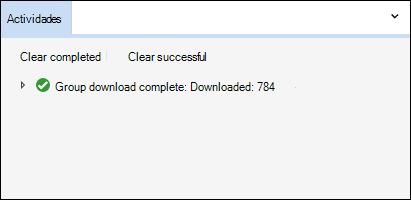

# Descargar trabajos de exportación en un caso de exhibición de documentos electrónicos avanzada

Al exportar documentos de un conjunto de revisión en un caso de exhibición de documentos electrónicos avanzada, los documentos se cargan en una ubicación de Azure Storage proporcionada por Microsoft o en una ubicación de Azure Storage administrada por su organización. El tipo de ubicación de Azure Storage usada depende de la opción seleccionada cuando se exportaron los documentos.

En este artículo se proporcionan instrucciones sobre cómo usar el Explorador de Almacenamiento de Microsoft Azure para conectarse a una ubicación de Azure Storage para examinar y descargar los documentos exportados. Para obtener más información acerca del Explorador de Azure Storage, vea [Inicio rápido: Usar el Explorador de Azure Storage](/azure/storage/blobs/storage-quickstart-blobs-storage-explorer).

## Paso 1: Instalar el Explorador de Azure Storage

El primer paso es descargar e instalar el Explorador de Azure Storage. Para obtener instrucciones, consulte [Herramienta del Explorador de Azure Storage](https://go.microsoft.com/fwlink/p/?LinkId=544842). Esta herramienta se usa para conectarse y descargar los documentos exportados en el paso 3.

## Paso 2: Obtener la dirección URL de SAS del trabajo de exportación

El siguiente paso es obtener la dirección URL de firma de acceso compartido (SAS) que se genera al crear el trabajo de exportación para exportar documentos [de un conjunto de revisión.](export-documents-from-review-set.md) Puede copiar la dirección URL de SAS para los documentos que se cargan en una ubicación de Azure Storage proporcionada por Microsoft o en una ubicación de Azure Storage administrada por su organización. En cualquier caso, use la dirección URL de SAS para conectarse a la ubicación de Azure Storage en el paso 3.

1. En la **página Exhibición de documentos electrónicos avanzada,** vaya al caso y, a continuación, haga clic en la **pestaña** Exportaciones.

2. En la **pestaña** Exportaciones, haga clic en el trabajo de exportación que desea descargar.

3. En la página desplegable, en **Ubicaciones**, copie la dirección URL de SAS que se muestra. Si es necesario, puedes guardarlo en un archivo para que puedas acceder a él en el paso 3.
 
   

## Paso 3: Conectarse a la ubicación de Azure Storage

El paso final es usar el Explorador de Azure Storage y la dirección URL de SAS para conectarse a la ubicación de Azure Storage y descargar los documentos que exportó a un equipo local.

1. Abra el Explorador de Azure Storage que instaló en el paso 1.

2. Haga clic en **el icono Agregar cuenta.** Como alternativa, puede hacer clic con el botón secundario en **Cuentas de almacenamiento.**

   

3. En la **página Conectarse** a Azure Storage, haga clic en Usar un URI de firma de acceso compartido **(SAS)** y, a continuación, haga clic **en Siguiente**.

    

4. En la **página Adjuntar con URI de SAS,** haga clic en el cuadro URI y, a continuación, pegue la dirección URL de SAS que obtuvo en el paso 2. 

    

    Observe que se muestra una parte de la dirección URL de SAS en el **cuadro Nombre para** mostrar. Se usará como el nombre para mostrar del contenedor  que se crea en las cuentas de almacenamiento después de conectarse a la ubicación de almacenamiento. Este nombre consta del identificador del caso de exhibición de documentos electrónicos avanzados y un identificador único. Puede conservar el nombre para mostrar predeterminado o cambiarlo. Si lo cambia, el nombre para mostrar debe ser único.

5. Haga clic en **Siguiente**.

    Se **muestra la página Resumen** de conexión.

    

6. En la **página Resumen de conexión,** revise la información de conexión y, a continuación, haga clic **en Conectar**.

    Se **abre el nodo Contenedores** de blobs (en **Cuentas** de almacenamiento  >  **(contenedores** \> adjuntos).

    

    Contiene un contenedor denominado con el nombre para mostrar del paso 4. Este contenedor contiene una carpeta para cada trabajo de exportación que haya creado. Estas carpetas se denominan con un identificador que corresponde al identificador del trabajo de exportación. Puede encontrar estos IDs de exportación (y  el nombre de la exportación) en Información de soporte técnico en la página desplegable para cada trabajo de preparación de exportación que aparece en la pestaña **Trabajos.** 

7. Haga doble clic en la carpeta de trabajos de exportación para abrirlo.

   Se muestra una lista de carpetas e informes de exportación.
   
    

   La carpeta de trabajos de exportación contiene los siguientes elementos. Los elementos reales de la carpeta de exportación están determinados por las opciones de exportación configuradas cuando se creó el trabajo de exportación. Para obtener más información, vea [Export documents from a review set](export-documents-from-review-set.md).

    - Export_load_file.csv: este archivo CSV es un informe de exportación detallado que contiene información sobre cada documento exportado. El archivo consta de una columna para cada propiedad de metadatos de un documento. Para obtener una lista y una descripción de los metadatos que se incluyen en este informe, vea la columna **Exported field name** en la tabla en Document metadata fields in Advanced [eDiscovery](document-metadata-fields-in-advanced-ediscovery.md).
    
    - Summary.txt: un archivo de texto que contiene un resumen de la exportación, incluidas las estadísticas de exportación.
    
    - Extracted_text_files: esta carpeta contiene una versión de archivo de texto de cada documento exportado.
     
    - NativeFiles: esta carpeta contiene una versión de archivo nativa de cada documento exportado.
    
    - Error_files: esta carpeta incluye los siguientes elementos cuando el trabajo de exportación contiene archivos de error: 
        
      - ExtractionError.csv: este archivo CSV contiene los metadatos disponibles para los archivos que no se extrajeron correctamente de su elemento primario.
        
      - ProcessingError: esta carpeta contiene documentos con errores de procesamiento. Este contenido está en un nivel de elemento, lo que significa que si un archivo adjunto tuvo un error de procesamiento, el documento que contiene los datos adjuntos también se incluirá en esta carpeta.
 
8. Para exportar todo el contenido de la exportación, seleccione la carpeta de exportación y, a continuación, haga clic en **Descargar**.

9. Especifique la ubicación donde desea descargar los archivos exportados y, a continuación, haga clic en Seleccionar carpeta.

    El Explorador de Azure Storage inicia el proceso de exportación. El estado de la descarga de los elementos exportados se muestra en el **panel** Actividades. Se muestra un mensaje cuando finaliza la descarga.

    

> [!NOTE]
> En lugar de descargar todo el trabajo de exportación, puede seleccionar elementos específicos para descargar. Y en lugar de descargar elementos, puede hacer doble clic en un elemento para verlo.