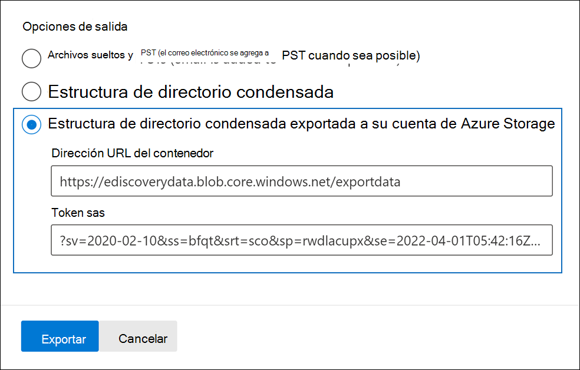
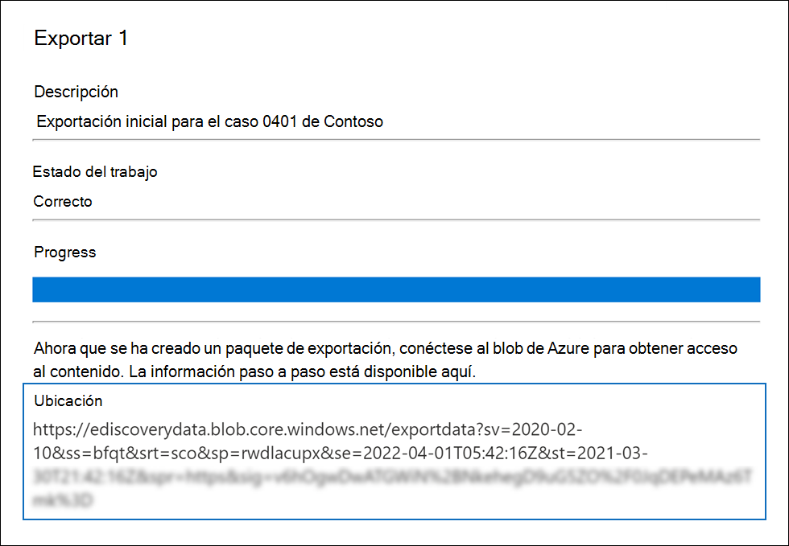
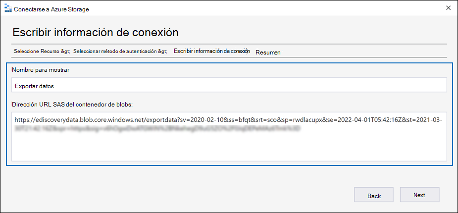
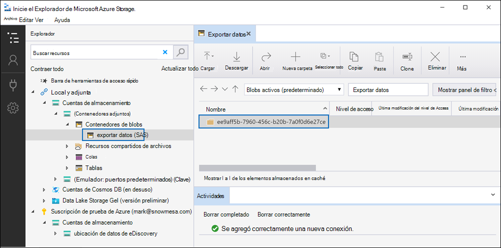
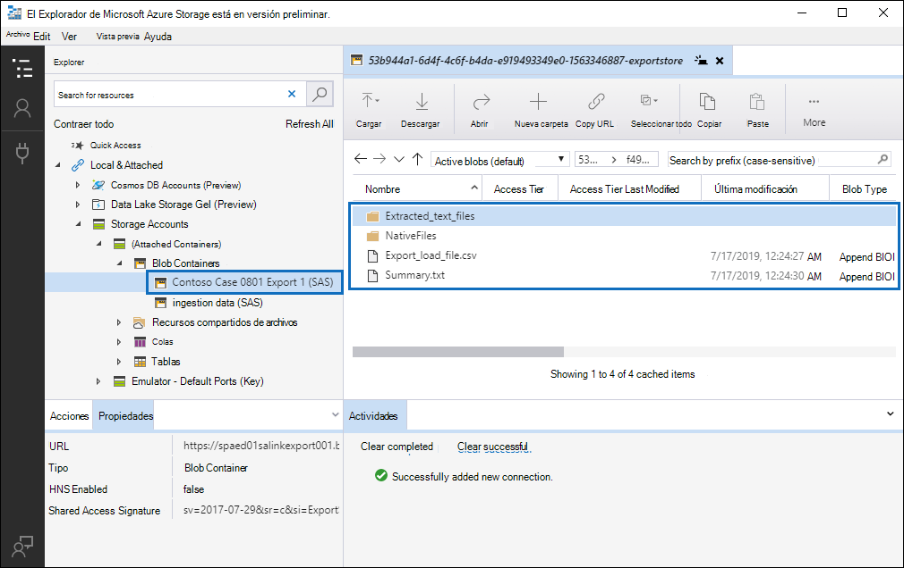

# Exportar documentos en un conjunto de revisión a una Azure Storage cuenta

Al exportar documentos de un conjunto de revisión en un caso Advanced eDiscovery, tiene la opción de exportarlos a una cuenta Azure Storage administrada por su organización. Si usa esta opción, los documentos se cargarán en su Azure Storage ubicación. Después de exportarlos, puede obtener acceso a los documentos (y descargarlos a un equipo local u otra ubicación) mediante el Explorador de Azure Storage. En este artículo se proporcionan instrucciones sobre cómo exportar documentos Azure Storage su cuenta de Azure Storage y el uso del Explorador de Azure Storage para conectarse a una ubicación Azure Storage para descargar los documentos exportados. Para obtener más información acerca Explorador de Azure Storage, vea [Use Explorador de Azure Storage](/azure/storage/blobs/storage-quickstart-blobs-storage-explorer).

## Antes de exportar documentos de un conjunto de revisión

- Debe proporcionar un token de firma de acceso compartido (SAS) para su cuenta de Azure Storage y la dirección URL de un contenedor específico de la cuenta de almacenamiento para exportar documentos de un conjunto de opiniones. Asegúrese de tener estos a mano (por ejemplo, copiados en un archivo de texto) al realizar el paso 2

  - **Token sas:** asegúrese de obtener el token sas es para su cuenta de Azure Storage (y no para el contenedor). Puede generar un token SAS para su cuenta en Azure Storage. Para ello, vaya a la cuenta Azure Storage y seleccione **Compartir** firma de acceso en la configuración Configuración en la hoja cuenta de almacenamiento.  Use la configuración predeterminada y permita todos los tipos de recursos al generar el token sas.

  - **Dirección URL del** contenedor: debe crear un contenedor en el que cargar los documentos del conjunto de revisión y, a continuación, obtener una copia de la dirección URL del contenedor; por ejemplo, `https://ediscoverydata.blob.core.windows.net/exportdata` . Para obtener la dirección URL, vaya al contenedor  de Azure Storage y seleccione Propiedades en la **sección Configuración** de la hoja contenedora.

- Descargue e instale el Explorador de Azure Storage. Para obtener instrucciones, [vea Explorador de Azure Storage herramienta](https://go.microsoft.com/fwlink/p/?LinkId=544842). Esta herramienta se usa para conectarse al contenedor de la cuenta Azure Storage y descargar los documentos que exportó en el paso 1.

## Paso 1: Exportar los documentos de un conjunto de revisión

El primer paso es crear un trabajo de exportación para exportar documentos fuera de un conjunto de revisión. Para obtener instrucciones más detalladas sobre todas las opciones de exportación, vea [Export documents from a review set](export-documents-from-review-set.md). El siguiente procedimiento resalta la configuración para exportar documentos a la cuenta de Azure Storage organización.

1. En el Centro de cumplimiento de Microsoft 365, abra el Advanced eDiscovery, seleccione la  pestaña Conjuntos de revisión y, a continuación, seleccione el conjunto de revisión que desea exportar.

2. En el conjunto de revisión, haga clic **en Exportar**  >  **acción**.

3. En la página desplegable **Opciones** de exportación, escriba un nombre (obligatorio) y una descripción (opcional) para la exportación.

4. Configure la configuración en las secciones documentos, metadatos, contenido y opciones. Para obtener más información acerca de esta configuración, vea [Export documents from a review set](export-documents-from-review-set.md).

5. En la **sección Opciones de** salida, seleccione la opción Estructura de directorio **condensada exportada** a Azure Storage cuenta.

6. Pegue la dirección URL del contenedor y el token SAS de la cuenta de almacenamiento en los campos correspondientes.

   

7. Haga **clic en** Exportar para crear el trabajo de exportación.

## Paso 2: Obtener la dirección URL de SAS del trabajo de exportación

El siguiente paso es obtener la dirección URL de SAS que se genera después de crear el trabajo de exportación en el paso 1. Use la dirección URL de SAS para conectarse al contenedor de la cuenta Azure Storage a la que exportó los documentos del conjunto de revisión.

1. En la **Advanced eDiscovery,** vaya al caso y, a continuación, haga clic en la **pestaña** Exportaciones.

2. En la pestaña **Exportar**, haga clic en el trabajo de exportación que desea descargar. Este es el trabajo de exportación que creó en el paso 1.

3. En la página desplegable, en **Ubicaciones**, copie la dirección URL de SAS que se muestra. Si es necesario, puede guardarlo en un archivo de texto para que pueda acceder a él en el paso 3.

   

   > [!TIP]
   > La dirección URL de SAS que se muestra en el trabajo de exportación es una concatenación de la dirección URL del contenedor y el token sas para la cuenta Azure Storage usuario. Puede copiarlo desde el trabajo de exportación o crearlo usted mismo combinando la dirección URL y el token sas.

## Paso 3: Conectar al Azure Storage contenedor

El paso final es usar el Explorador de Azure Storage y la dirección URL de SAS para conectarse al contenedor de su cuenta de Azure Storage y descargar los documentos exportados a un equipo local.

1. Inicie el Explorador de Azure Storage que descargó e instaló.

2. Haga clic **en el icono Abrir Conectar cuadro de** diálogo.

   

3. En la **Conectar para Azure Storage,** haga clic en **Contenedor de blobs**.

4. En la **página Seleccionar método de autenticación,** seleccione la opción Firma de acceso compartido **(SAS)** y, a continuación, haga clic **en Siguiente**.

5. En la **página Escribir** información de conexión, pegue la dirección URL de SAS (que obtuvo en el trabajo de exportación del paso 2) en el cuadro Dirección URL sas del contenedor **de blobs.**

    

    Observe que el nombre del contenedor se muestra en el **cuadro Nombre para** mostrar. Puede editar este nombre.

6. Haga **clic en** Siguiente para mostrar la página **de** resumen y, a continuación, haga clic **Conectar**.

    Se **abre el nodo Contenedores** de **blobs**(en Storage  >  **cuentas adjuntas (contenedores** \> adjuntos).

    

    Contiene un contenedor denominado con el nombre para mostrar del paso 5. Este contenedor contiene una carpeta para cada trabajo de exportación que haya descargado en el contenedor de su cuenta Azure Storage exportación. Estas carpetas se denominan con un identificador que corresponde al identificador del trabajo de exportación. Puede encontrar estos IDs de exportación (y  el nombre de la exportación) en Información de  soporte técnico en la página desplegable para cada trabajo de preparación de exportación que aparece en la pestaña Trabajos en el Advanced eDiscovery caso. 

7. Haga doble clic en la carpeta de trabajos de exportación para abrirlo.

   Se muestra una lista de carpetas e informes de exportación.

    

8. Para exportar todo el contenido del trabajo de exportación, haga clic en la flecha **arriba** para volver a la carpeta de trabajos de exportación y, a continuación, haga clic en **Descargar**.

9. Especifique la ubicación en la que quiere descargar los archivos exportados y, a continuación, haga clic en Seleccionar carpeta.

    El Explorador de Azure Storage inicia el proceso de descarga. El estado de la descarga de los elementos exportados se muestra en el **panel** Actividades. Se muestra un mensaje cuando se completa la descarga.

> [!NOTE]
> En lugar de descargar todo el trabajo de exportación Explorador de Azure Storage, puede seleccionar elementos específicos para descargar y ver.

## Más información

- La carpeta de trabajos de exportación contiene los siguientes elementos. Los elementos reales de la carpeta de exportación están determinados por las opciones de exportación configuradas cuando se creó el trabajo de exportación. Para obtener más información acerca de estas opciones, vea [Export documents from a review set](export-documents-from-review-set.md).

  - Export_load_file.csv: este archivo CSV es un informe de exportación detallado que contiene información sobre cada documento exportado. El archivo consta de una columna para cada propiedad de metadatos de un documento. Para obtener una lista y una descripción de los metadatos que se incluyen en este informe, vea la columna **Exported field name** en la tabla en Campos de metadatos de documento en [Advanced eDiscovery](document-metadata-fields-in-advanced-ediscovery.md).

  - Summary.txt: un archivo de texto que contiene un resumen de la exportación, incluidas las estadísticas de exportación.

  - Extracted_text_files: esta carpeta contiene una versión de archivo de texto de cada documento exportado.

  - NativeFiles: esta carpeta contiene una versión de archivo nativa de cada documento exportado.

  - Error_files: esta carpeta incluye los siguientes elementos cuando el trabajo de exportación contiene archivos de error:

    - ExtractionError.csv: este archivo CSV contiene los metadatos disponibles para los archivos que no se extrajeron correctamente de su elemento primario.

    - ProcessingError: esta carpeta contiene documentos con errores de procesamiento. Este contenido está en un nivel de elemento, lo que significa que si un archivo adjunto tuvo un error de procesamiento, el documento que contiene los datos adjuntos también se incluirá en esta carpeta.
