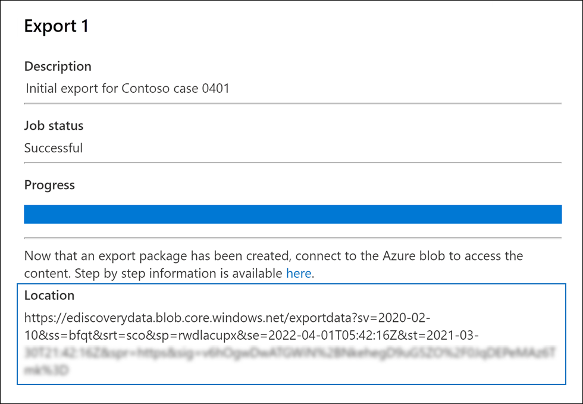
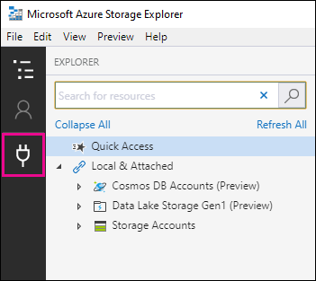

# Descargar trabajos de exportación en un caso de eDiscovery avanzadoDownload export jobs in an Advanced eDiscovery case

Al exportar documentos de un conjunto de revisión en un caso de eDiscovery avanzado, los documentos se cargan en una ubicación de Azure Storage proporcionada por Microsoft o en una ubicación de Azure Storage administrada por su organización.When you export documents from a review set in an Advanced eDiscovery case, the documents are uploaded to a Microsoft-provided Azure Storage location or to an Azure Storage location managed by your organization. El tipo de ubicación de Azure Storage usada depende de la opción seleccionada cuando se exportaron los documentos.The type of Azure Storage location used depends on which option was selected when the documents were exported.

En este artículo se proporcionan instrucciones sobre cómo usar microsoft Azure Storage Explorer para conectarse a una ubicación de Azure Storage para examinar y descargar los documentos exportados.This article provides instructions for how to use the Microsoft Azure Storage Explorer to connect to an Azure Storage location to browse and download the exported documents. Para obtener más información acerca de Azure Storage Explorer, vea [Inicio rápido: Usar Azure Storage Explorer.](https://docs.microsoft.com/azure/storage/blobs/storage-quickstart-blobs-storage-explorer)For more information about Azure Storage Explorer, see [Quickstart: Use Azure Storage Explorer](https://docs.microsoft.com/azure/storage/blobs/storage-quickstart-blobs-storage-explorer).

## Paso 1: Instalar el Explorador de Azure StorageStep 1: Install the Azure Storage Explorer

El primer paso es descargar e instalar el Explorador de Azure Storage.The first step is to download and install the Azure Storage Explorer. Para obtener instrucciones, vea [la herramienta Azure Storage Explorer](https://go.microsoft.com/fwlink/p/?LinkId=544842).For instructions, see [Azure Storage Explorer tool](https://go.microsoft.com/fwlink/p/?LinkId=544842). Use esta herramienta para conectarse a los documentos exportados y descargarlos en el paso 3.You use this tool to connect to and download the exported documents in Step 3.

## Paso 2: Obtener la dirección URL de SAS del trabajo de exportaciónStep 2: Obtain the SAS URL from the export job

El siguiente paso es obtener la dirección URL de firma de acceso compartido (SAS) que se genera al crear el trabajo de exportación para exportar documentos [de un conjunto de revisión.](export-documents-from-review-set.md)The next step is to obtain the shared access signature (SAS) URL that's generated when you created the export job to [export documents from a review set](export-documents-from-review-set.md). Puede copiar la dirección URL de SAS de los documentos que se cargan en una ubicación de Azure Storage proporcionada por Microsoft o en una ubicación de Azure Storage administrada por su organización.You can copy the SAS URL for documents that are uploaded to a Microsoft-provided Azure Storage location or an Azure Storage location managed by your organization. En cualquier caso, se usa la dirección URL de SAS para conectarse a la ubicación de Azure Storage en el paso 3.In either case, you use the SAS URL to connect to the Azure Storage location in Step 3.

1. En la **página eDiscovery avanzado,** vaya al caso y, a continuación, haga clic en la **pestaña** Exportaciones.On the **Advanced eDiscovery** page, go to the case, and then click the **Exports** tab.

2. En la **pestaña Exportaciones,** haga clic en el trabajo de exportación que desea descargar.On the **Exports** tab, click the export job that you want to download.

3. En la página desplegable, en **Ubicaciones,** copie la dirección URL de SAS que se muestra.On the flyout page, under **Locations**, copy the SAS URL that's displayed. Si es necesario, puede guardarlo en un archivo para que pueda acceder a él en el paso 3.If necessary, you can save it to a file so you can access it in Step 3.
 
   

## Paso 3: Conectarse a la ubicación de Azure StorageStep 3: Connect to the Azure Storage location

El último paso es usar el Explorador de Azure Storage y la dirección URL de SAS para conectarse a la ubicación de Azure Storage y descargar los documentos que exportó a un equipo local.The final step is to use the Azure Storage Explorer and the SAS URL to connect to the Azure Storage location and download the documents that you exported to a local computer.

1. Abra el Explorador de Azure Storage que instaló en el paso 1.Open the Azure Storage Explorer that you installed in Step 1.

2. Haga clic en **el icono Agregar** cuenta.Click the **Add account** icon. Como alternativa, puede hacer clic con el botón secundario en **Cuentas de almacenamiento.**Alternatively, you can right-click **Storage Accounts**.

   

3. En la **página Conectarse** a Azure Storage, haga clic en Usar un URI de firma de acceso compartido **(SAS)** y, a continuación, haga clic en **Siguiente.**On the **Connect to Azure Storage** page, click **Use a shared access signature (SAS) URI** and then click **Next**.

    

4. En la página Adjuntar con URI de **SAS,** haga clic en el cuadro uri y, a continuación, pegue la dirección URL de SAS que obtuvo en el paso 2.On the **Attach with SAS URI** page, click in the URI box, and then paste the SAS URL that you obtained in Step 2. 

    

    Observe que una parte de la dirección URL de SAS se muestra en el **cuadro Nombre para** mostrar.Notice that a portion of the SAS URL is displayed in the **Display name** box. Se usará como el nombre para mostrar del contenedor  que se crea en las cuentas de almacenamiento después de conectarse a la ubicación de almacenamiento.This will be used as the display name of the container that's created under the **Storage accounts** after you connect to the storage location. Este nombre consta del identificador del caso de eDiscovery avanzado y un identificador único.This name consists of the ID of the Advanced eDiscovery case is from and a unique identifier. Puede conservar el nombre para mostrar predeterminado o cambiarlo.You can keep the default display name or change it. Si lo cambia, el nombre para mostrar debe ser único.If you change it, the display name must be unique.

5. Haga clic en **Siguiente**.Click **Next**.

    Se **muestra la página Resumen** de conexión.The **Connection summary** page is displayed.

    

6. En la **página Resumen de conexión,** revise la información de conexión y, a continuación, haga clic en **Conectar**.On the **Connection summary** page, review the connection information, and then click **Connect**.

    Se **abre el nodo Contenedores** de blobs (en Cuentas **de**  >  **almacenamiento (contenedores adjuntos).** \>The **Blob containers** node (under **Storage Accounts** > **(Attached Containers)** \> is opened.

    

    Contiene un contenedor con el nombre para mostrar del paso 4.It contains a container named with the display name from step 4. Este contenedor contiene una carpeta para cada trabajo de exportación que haya creado.This container contains a folder for each export job that you've created. Estas carpetas se denominan con un identificador que corresponde al identificador del trabajo de exportación.These folders are named with an ID that corresponds to the ID of the export job. Puede encontrar estos IDs de exportación (y  el nombre de la exportación) en Información de soporte técnico en la página desplegable para cada uno de los datos de preparación para el trabajo de exportación que aparecen en la pestaña **Trabajos.** You can find these export IDs (and the name of the export) under **Support information** on the flyout page for each **Preparing data for export** job listed on the **Jobs** tab.

7. Haga doble clic en la carpeta de trabajo de exportación para abrirlo.Double-click the export job folder to open it.

   Se muestra una lista de carpetas e informes de exportación.A list of folders and export reports is displayed.
   
    

   La carpeta de trabajo de exportación contiene los siguientes elementos.The export job folder contains the following items. Los elementos reales de la carpeta de exportación están determinados por las opciones de exportación configuradas cuando se creó el trabajo de exportación.The actual items in the export folder are determined by the export options configured when the export job was created. Para obtener más información, vea [Exportar documentos de un conjunto de revisión.](export-documents-from-review-set.md)For more information, see [Export documents from a review set](export-documents-from-review-set.md).

    - Export_load_file.csv: este archivo CSV es un informe de exportación de detalles que contiene información sobre cada documento exportado.Export_load_file.csv: This CSV file is a detail export report that contains information about each exported document. El archivo consta de una columna para cada propiedad de metadatos de un documento.The file consists of a column for each metadata property for a document. Para obtener una lista y una descripción de los metadatos que se incluyen en este informe, vea la columna **Nombre** de campo exportado en la tabla de los campos de metadatos del documento en [eDiscovery avanzado.](document-metadata-fields-in-advanced-ediscovery.md)For a list and description of the metadata that's included in this report, see the **Exported field name** column in the table in [Document metadata fields in Advanced eDiscovery](document-metadata-fields-in-advanced-ediscovery.md).
    
    - Summary.txt: archivo de texto que contiene un resumen de la exportación, incluidas las estadísticas de exportación.Summary.txt: A text file that contains a summary of the export including export statistics.
    
    - Extracted_text_files: esta carpeta contiene una versión de archivo de texto de cada documento exportado.Extracted_text_files: This folder contains a text file version of each exported document.
     
    - NativeFiles: esta carpeta contiene una versión de archivo nativa de cada documento exportado.NativeFiles: This folder contains a native file version of each exported document.
    
    - Error_files: esta carpeta incluye los siguientes elementos cuando el trabajo de exportación contiene archivos de error:Error_files: This folder includes the following items when the export job contains any error files: 
        
      - ExtractionError.csv: este archivo CSV contiene los metadatos disponibles para los archivos que no se extrajeron correctamente de su elemento primario.ExtractionError.csv: This CSV file contains the available metadata for files that weren't properly extracted from their parent item.
        
      - ProcessingError: esta carpeta contiene documentos con errores de procesamiento.ProcessingError: This folder contains documents with processing errors. Este contenido se encuentra en un nivel de elemento, lo que significa que si un archivo adjunto tiene un error de procesamiento, el documento que contiene los datos adjuntos también se incluirá en esta carpeta.This content is at an item level, which means if an attachment had a processing error, the document that contains the attachment will also be included in this folder.
 
8. Para exportar todo el contenido de la exportación, seleccione la carpeta de exportación y, a continuación, haga clic en **Descargar**.To export all contents in the export, select the export folder, and then click **Download**.

9. Especifique la ubicación donde desea descargar los archivos exportados y, a continuación, haga clic en Seleccionar carpeta.Specify the location where you want to download the exported files, and then click Select folder.

    El Explorador de Azure Storage inicia el proceso de exportación.The Azure Storage Explorer starts the export process. El estado de la descarga de los elementos exportados se muestra en el **panel** Actividades.The status of the downloading the exported items is displayed in the **Activities** pane. Se muestra un mensaje cuando finaliza la descarga.A message is displayed when the download is finished.

    

> [!NOTE]
> En lugar de descargar todo el trabajo de exportación, puede seleccionar elementos específicos para descargar.Instead of downloading the entire export job, you can select specific items to download. Y en lugar de descargar elementos, puede hacer doble clic en un elemento para verlo.And instead of downloading items, you can double-click an item to view it.
