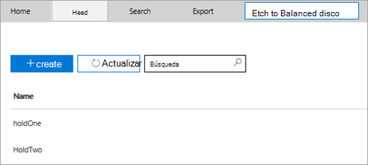
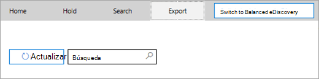
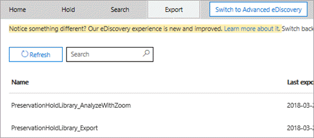
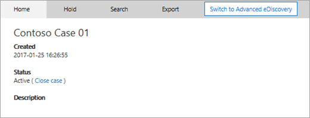

# <a name="manage-ediscovery-cases-in-the-security--compliance-center"></a><span data-ttu-id="5fe92-105">Administrar casos de exhibición de documentos electrónicos en el Centro de seguridad y cumplimiento</span><span class="sxs-lookup"><span data-stu-id="5fe92-105">Manage eDiscovery cases in the Security & Compliance Center</span></span>

<span data-ttu-id="5fe92-106">Puede usar casos de eDiscovery en el centro de cumplimiento de Office 365 y Microsoft 365 para controlar quién puede crear, tener acceso y administrar casos de eDiscovery en su organización.</span><span class="sxs-lookup"><span data-stu-id="5fe92-106">You can use eDiscovery cases in the compliance center in Office 365 and Microsoft 365 to control who can create, access, and manage eDiscovery cases in your organization.</span></span> <span data-ttu-id="5fe92-107">Si su organización tiene una suscripción a Office 365 E5, también puede usar casos de exhibición de documentos electrónicos para analizar los resultados de la búsqueda con Office 365 Advanced eDiscovery.</span><span class="sxs-lookup"><span data-stu-id="5fe92-107">If your organization has an Office 365 E5 subscription, you can also use eDiscovery cases to analyze search results by using Office 365 Advanced eDiscovery.</span></span>
  
<span data-ttu-id="5fe92-108">Un caso de exhibición de documentos electrónicos permite agregar miembros a un caso, controlar qué tipos de acciones pueden realizar determinados miembros del caso, colocar una suspensión en ubicaciones de contenido relevantes a un proceso legal y asociar varias búsquedas de contenido con un solo caso.</span><span class="sxs-lookup"><span data-stu-id="5fe92-108">An eDiscovery case allows you to add members to a case, control what types of actions that specific case members can perform, place a hold on content locations relevant to a legal case, and associate multiple Content Searches with a single case.</span></span> <span data-ttu-id="5fe92-109">También puede exportar los resultados de cualquier búsqueda de contenido que esté asociado a un caso o preparar los resultados de búsqueda para analizarlos en la exhibición avanzada de documentos electrónicos.</span><span class="sxs-lookup"><span data-stu-id="5fe92-109">You can also export the results of any Content Search that is associated with a case or prepare search results for analysis in Advanced eDiscovery.</span></span> <span data-ttu-id="5fe92-110">Los casos de exhibición de documentos electrónicos son una buena manera de limitar quién puede tener acceso a los resultados de búsqueda y a las búsquedas de contenido de un caso legal específico de la organización.</span><span class="sxs-lookup"><span data-stu-id="5fe92-110">eDiscovery cases are a good way to limit who has access to Content Searches and search results for a specific legal case in your organization.</span></span>
  
<span data-ttu-id="5fe92-111">Use el siguiente flujo de trabajo para configurar y usar casos de exhibición de documentos electrónicos en el centro de seguridad & cumplimiento y la exhibición avanzada de documentos electrónicos.</span><span class="sxs-lookup"><span data-stu-id="5fe92-111">Use the following workflow to set-up and use eDiscovery cases in the Security & Compliance Center and Advanced eDiscovery.</span></span>

[<span data-ttu-id="5fe92-112">Step 1: Assign eDiscovery permissions to potential case members</span><span class="sxs-lookup"><span data-stu-id="5fe92-112">Step 1: Assign eDiscovery permissions to potential case members</span></span>](#step-1-assign-ediscovery-permissions-to-potential-case-members)

[<span data-ttu-id="5fe92-113">Paso 2: crear un nuevo caso</span><span class="sxs-lookup"><span data-stu-id="5fe92-113">Step 2: Create a new case</span></span>](#step-2-create-a-new-case)

[<span data-ttu-id="5fe92-114">Paso 3: agregar miembros a un caso</span><span class="sxs-lookup"><span data-stu-id="5fe92-114">Step 3: Add members to a case</span></span>](#step-3-add-members-to-a-case)

[<span data-ttu-id="5fe92-115">Paso 4: poner las ubicaciones de contenido en retención</span><span class="sxs-lookup"><span data-stu-id="5fe92-115">Step 4: Place content locations on hold</span></span>](#step-4-place-content-locations-on-hold)

[<span data-ttu-id="5fe92-116">Paso 5: crear y ejecutar una búsqueda de contenido asociada a un caso</span><span class="sxs-lookup"><span data-stu-id="5fe92-116">Step 5: Create and run a Content Search associated with a case</span></span>](#step-5-create-and-run-a-content-search-associated-with-a-case)

[<span data-ttu-id="5fe92-117">Paso 6: exportar los resultados de una búsqueda de contenido asociada a un caso</span><span class="sxs-lookup"><span data-stu-id="5fe92-117">Step 6: Export the results of a Content Search associated with a case</span></span>](#step-6-export-the-results-of-a-content-search-associated-with-a-case)

[<span data-ttu-id="5fe92-118">Paso 7: preparar los resultados de búsqueda para la exhibición avanzada de documentos electrónicos</span><span class="sxs-lookup"><span data-stu-id="5fe92-118">Step 7: Prepare search results for Advanced eDiscovery</span></span>](#step-7-prepare-search-results-for-advanced-ediscovery)

[<span data-ttu-id="5fe92-119">Paso 8: ir al caso en la exhibición avanzada de documentos electrónicos</span><span class="sxs-lookup"><span data-stu-id="5fe92-119">Step 8: Go to the case in Advanced eDiscovery</span></span>](#step-8-go-to-the-case-in-advanced-ediscovery)

[<span data-ttu-id="5fe92-120">Opcional Paso 9: cerrar un caso</span><span class="sxs-lookup"><span data-stu-id="5fe92-120">(Optional) Step 9: Close a case</span></span>](#optional-step-9-close-a-case)

[<span data-ttu-id="5fe92-121">Opcional Paso 10: volver a abrir un caso cerrado</span><span class="sxs-lookup"><span data-stu-id="5fe92-121">(Optional) Step 10: Re-open a closed case</span></span>](#optional-step-10-re-open-a-closed-case)

[<span data-ttu-id="5fe92-122">Más información</span><span class="sxs-lookup"><span data-stu-id="5fe92-122">More information</span></span>](#more-information)
  
## <a name="step-1-assign-ediscovery-permissions-to-potential-case-members"></a><span data-ttu-id="5fe92-123">Paso 1: Asignar permisos de exhibición de documentos electrónicos a posibles miembros del caso</span><span class="sxs-lookup"><span data-stu-id="5fe92-123">Step 1: Assign eDiscovery permissions to potential case members</span></span>

<span data-ttu-id="5fe92-124">El primer paso consiste en asignar los permisos adecuados relacionados con eDiscovery a los usuarios para que pueda agregarlos a un caso de exhibición de documentos electrónicos en el paso 2.</span><span class="sxs-lookup"><span data-stu-id="5fe92-124">The first step is to assign the appropriate eDiscovery-related permissions to people so you can add them to an eDiscovery case in Step 2.</span></span> <span data-ttu-id="5fe92-125">Debe ser miembro del grupo de roles de administración de la organización (o tener asignado el rol de administración de roles) en el centro de seguridad & cumplimiento para asignar permisos de exhibición de documentos electrónicos.</span><span class="sxs-lookup"><span data-stu-id="5fe92-125">You have to be a member of the Organization Management role group (or be assigned the Role Management role) in the Security & Compliance Center to assign eDiscovery permissions.</span></span> <span data-ttu-id="5fe92-126">En la lista siguiente se describen los grupos de roles relacionados con la exhibición de documentos electrónicos en el centro de seguridad & cumplimiento.</span><span class="sxs-lookup"><span data-stu-id="5fe92-126">The following list describes the eDiscovery-related role groups in the Security & Compliance Center.</span></span> 
  
- <span data-ttu-id="5fe92-127">**Revisor.**</span><span class="sxs-lookup"><span data-stu-id="5fe92-127">**Reviewer.**</span></span> <span data-ttu-id="5fe92-128">Este grupo de roles tiene los permisos más restrictivos relacionados con la exhibición de documentos electrónicos.</span><span class="sxs-lookup"><span data-stu-id="5fe92-128">This role group has the most restrictive eDiscovery-related permissions.</span></span> <span data-ttu-id="5fe92-129">El objetivo principal de este grupo de roles es permitir a los miembros ver y obtener acceso a los datos de caso en [eDiscovery avanzado (](office-365-advanced-ediscovery.md) también conocido como *eDiscovery avanzado v1*).</span><span class="sxs-lookup"><span data-stu-id="5fe92-129">The primary purpose of this role group is to allow members to view and access case data in [Advanced eDiscovery (classic)](office-365-advanced-ediscovery.md) (also known as *Advanced eDiscovery v1*).</span></span> <span data-ttu-id="5fe92-130">Los miembros de este grupo solo pueden ver y abrir la lista de los casos en la página de **exhibición** de documentos electrónicos en el centro de seguridad & cumplimiento del que son miembros.</span><span class="sxs-lookup"><span data-stu-id="5fe92-130">Members of this group can only see and open the list of the cases on the **eDiscovery** page in the Security & Compliance Center that they are members of.</span></span> <span data-ttu-id="5fe92-131">Una vez que el usuario tiene acceso a un caso en el centro de seguridad y cumplimiento, puede hacer clic en **cambiar a eDiscovery avanzado** para acceder y analizar los datos del caso en eDiscovery avanzado.</span><span class="sxs-lookup"><span data-stu-id="5fe92-131">After the user accesses a case in the security and compliance center, they can click **Switch to Advanced eDiscovery** to access and analyze the case data in Advanced eDiscovery.</span></span> <span data-ttu-id="5fe92-132">No pueden crear casos, agregar miembros a un caso, crear suspensiones, crear búsquedas, obtener una vista previa de los resultados de la búsqueda, exportar resultados de la búsqueda o preparar los resultados para la exhibición avanzada de documentos electrónicos.</span><span class="sxs-lookup"><span data-stu-id="5fe92-132">They can't create cases, add members to a case, create holds, create searches, preview search results, export search results, or prepare results for Advanced eDiscovery.</span></span> 

   > [!NOTE]
   > <span data-ttu-id="5fe92-133">En este momento, los usuarios que son miembros del grupo de roles Reviewer no pueden tener acceso a los datos de [eDiscovery avanzado en Microsoft 365](overview-ediscovery-20.md) (también conocido como *eDiscovery avanzado V2*).</span><span class="sxs-lookup"><span data-stu-id="5fe92-133">At this time, users who are member of the Reviewer role group can't access data in [Advanced eDiscovery in Microsoft 365](overview-ediscovery-20.md) (also known as *Advanced eDiscovery v2*).</span></span> <span data-ttu-id="5fe92-134">Para agregar miembros a un caso en eDiscovery avanzado v2 para que puedan revisar los datos de caso, un usuario debe ser miembro del grupo de roles eDiscovery Manager.</span><span class="sxs-lookup"><span data-stu-id="5fe92-134">To add members to a case in Advanced eDiscovery v2 so that they can review case data, a user must be a member of the eDiscovery Manager role group.</span></span>
    
- <span data-ttu-id="5fe92-135">**Administrador de exhibición de documentos electrónicos.**</span><span class="sxs-lookup"><span data-stu-id="5fe92-135">**eDiscovery Manager.**</span></span> <span data-ttu-id="5fe92-136">Los miembros de este grupo de roles pueden crear y administrar casos de exhibición de documentos electrónicos.</span><span class="sxs-lookup"><span data-stu-id="5fe92-136">Members of this role group can create and manage eDiscovery cases.</span></span> <span data-ttu-id="5fe92-137">Pueden agregar y quitar miembros, poner ubicaciones de contenido en suspensión, crear y editar búsquedas de contenido asociadas a un caso, exportar los resultados de una búsqueda de contenido y preparar los resultados de la búsqueda para analizarlos en la exhibición avanzada de documentos electrónicos.</span><span class="sxs-lookup"><span data-stu-id="5fe92-137">They can add and remove members, place content locations on hold, create and edit Content Searches associated with a case, export the results of a Content Search, and prepare search results for analysis in Advanced eDiscovery.</span></span> <span data-ttu-id="5fe92-138">Hay dos subgrupos en este grupo de roles.</span><span class="sxs-lookup"><span data-stu-id="5fe92-138">There are two subgroups in this role group.</span></span> <span data-ttu-id="5fe92-139">La diferencia entre estos subgrupos se basa en el ámbito.</span><span class="sxs-lookup"><span data-stu-id="5fe92-139">The difference between these subgroups is based on scope.</span></span>
    
  - <span data-ttu-id="5fe92-140">**Administrador de exhibición de documentos electrónicos.**</span><span class="sxs-lookup"><span data-stu-id="5fe92-140">**eDiscovery Manager.**</span></span> <span data-ttu-id="5fe92-141">Puede ver y administrar los casos de exhibición de documentos electrónicos que cree o de los que sea miembro.</span><span class="sxs-lookup"><span data-stu-id="5fe92-141">Can view and manage the eDiscovery cases they create or are a member of.</span></span> <span data-ttu-id="5fe92-142">Si otro administrador de exhibición de documentos electrónicos crea un caso pero no agrega un segundo administrador de eDiscovery como miembro de ese caso, el segundo administrador de eDiscovery no podrá ver ni abrir el caso en la página de **exhibición** de documentos electrónicos en el centro de seguridad & cumplimiento.</span><span class="sxs-lookup"><span data-stu-id="5fe92-142">If another eDiscovery Manager creates a case but doesn't add a second eDiscovery Manager as a member of that case, the second eDiscovery Manager won't be able to view or open the case on the **eDiscovery** page in the Security & Compliance Center.</span></span> <span data-ttu-id="5fe92-143">los administradores de eDiscovery también pueden acceder a sus casos en eDiscovery avanzado para realizar tareas de análisis.</span><span class="sxs-lookup"><span data-stu-id="5fe92-143">eDiscovery Managers can also access their cases in Advanced eDiscovery to perform analysis tasks.</span></span> 
    
  - <span data-ttu-id="5fe92-144">\**Administrador de exhibición de documentos electrónicos *.**</span><span class="sxs-lookup"><span data-stu-id="5fe92-144">**eDiscovery Administrator\*.**</span></span> <span data-ttu-id="5fe92-145">Puede realizar todas las tareas de administración de casos que un administrador de exhibición de documentos electrónicos puede hacer.</span><span class="sxs-lookup"><span data-stu-id="5fe92-145">Can perform all case management tasks that an eDiscovery Manager can do.</span></span> <span data-ttu-id="5fe92-146">Además, un administrador de exhibición de documentos electrónicos puede:</span><span class="sxs-lookup"><span data-stu-id="5fe92-146">Additionally, an eDiscovery Administrator can:</span></span>
    
    - <span data-ttu-id="5fe92-147">Ver todos los casos que se enumeran en la página **Exhibición de documentos electrónicos**.</span><span class="sxs-lookup"><span data-stu-id="5fe92-147">View all cases that are listed on the **eDiscovery** page.</span></span> 
    
    - <span data-ttu-id="5fe92-148">Administrar cualquier caso en la organización después de que se agreguen como miembro del caso.</span><span class="sxs-lookup"><span data-stu-id="5fe92-148">Manage any case in the organization after they add themself as a member of the case.</span></span>
    
    - <span data-ttu-id="5fe92-149">Obtenga acceso a los datos de caso en eDiscovery avanzado para cualquier caso de la organización.</span><span class="sxs-lookup"><span data-stu-id="5fe92-149">Access case data in Advanced eDiscovery for any case in the organization.</span></span>
    
    <span data-ttu-id="5fe92-150">Consulte la sección [More information](#more-information) para saber por qué quizás quiera tener un administrador de exhibición de documentos electrónicos en su organización.</span><span class="sxs-lookup"><span data-stu-id="5fe92-150">See the [More information](#more-information) section for reasons why you may want an eDiscovery Administrator in your organization.</span></span> 

<span data-ttu-id="5fe92-151">Para obtener más información sobre los permisos de exhibición de documentos electrónicos, consulte [asignar permisos de exhibición](assign-ediscovery-permissions.md)de documentos electrónicos.</span><span class="sxs-lookup"><span data-stu-id="5fe92-151">For more information about eDiscovery permissions, see [Assign eDiscovery permissions](assign-ediscovery-permissions.md).</span></span>
  
 <span data-ttu-id="5fe92-152">**Para asignar permisos de exhibición de documentos electrónicos:**</span><span class="sxs-lookup"><span data-stu-id="5fe92-152">**To assign eDiscovery permissions:**</span></span>
  
1. <span data-ttu-id="5fe92-153">Vaya a [https://protection.office.com](https://protection.office.com).</span><span class="sxs-lookup"><span data-stu-id="5fe92-153">Go to [https://protection.office.com](https://protection.office.com).</span></span>
    
2. <span data-ttu-id="5fe92-154">Inicie sesión en Office 365 con su cuenta profesional o educativa.</span><span class="sxs-lookup"><span data-stu-id="5fe92-154">Sign in to Office 365 using your work or school account.</span></span>
    
3. <span data-ttu-id="5fe92-155">En el centro de seguridad & cumplimiento, haga clic en **permisos**y, a continuación, realice una de las siguientes acciones en función de los permisos de exhibición de documentos electrónicos que desee asignar.</span><span class="sxs-lookup"><span data-stu-id="5fe92-155">In the Security & Compliance Center, click **Permissions**, and then do one of the following based on the eDiscovery permissions that you want to assign.</span></span>
    
    - <span data-ttu-id="5fe92-156">Para asignar permisos de revisor, seleccione el grupo de roles de **Revisor** y, a continuación, junto a **miembros**, haga clic en **Editar**.</span><span class="sxs-lookup"><span data-stu-id="5fe92-156">To assign Reviewer permissions, select the **Reviewer** role group, and then next to **Members**, click **Edit**.</span></span> <span data-ttu-id="5fe92-157">Haga clic en **seleccionar miembros**, haga clic en **Editar**,  **Agregar**, seleccione el usuario que desea agregar al grupo de funciones de revisor y, a continuación, haga clic en **Agregar**.</span><span class="sxs-lookup"><span data-stu-id="5fe92-157">Click **Choose members**, click **Edit**, click  **Add**, select the user that you want to add to the Reviewer role group, and then click **Add**.</span></span>
    
    - <span data-ttu-id="5fe92-158">Para asignar permisos de administrador de eDiscovery, seleccione el grupo de roles **eDiscovery Manager** y, a continuación, junto a **eDiscovery Manager**, haga clic en **Editar**.</span><span class="sxs-lookup"><span data-stu-id="5fe92-158">To assign eDiscovery Manager permissions, select the **eDiscovery Manager** role group, and then next to **eDiscovery Manager**, click **Edit**.</span></span> <span data-ttu-id="5fe92-159">Haga clic en **elegir administrador de exhibición**de documentos  haga clic en **Editar**, haga clic en agregar icono \* \* Agregar \* \*, seleccione el usuario que desea agregar como administrador de exhibición de documentos electrónicos y, a continuación, haga clic en **Agregar**.</span><span class="sxs-lookup"><span data-stu-id="5fe92-159">Click **Choose eDiscovery Manager**, click **Edit**, click  \*\* Add \*\*, select the user that you want to add as an eDiscovery Manager, and then click **Add**.</span></span>
    
    - <span data-ttu-id="5fe92-160">Para asignar permisos de administrador de eDiscovery, seleccione el grupo de roles **eDiscovery Manager** y, a continuación, junto a **Administrador de exhibición**de documentos electrónicos, haga clic en **Editar**.</span><span class="sxs-lookup"><span data-stu-id="5fe92-160">To assign eDiscovery Administrator permissions, select the **eDiscovery Manager** role group, and then next to **eDiscovery Administrator**, click **Edit**.</span></span> <span data-ttu-id="5fe92-161">Haga clic en **elegir administrador de eDiscovery**, haga  **Editar**, haga clic en agregar icono **Agregar**, seleccione el usuario que desea agregar como administrador de exhibición de documentos electrónicos y, a continuación, haga clic en **Agregar**.</span><span class="sxs-lookup"><span data-stu-id="5fe92-161">Click **Choose eDiscovery Administrator**, click **Edit**, click  **Add**, select the user that you want to add as an eDiscovery Administrator, and then click **Add**.</span></span>
    
4. <span data-ttu-id="5fe92-162">Una vez que haya agregado todos los usuarios, haga clic en **listo**, haga clic en **Guardar** para guardar los cambios en el grupo de roles y, a continuación, haga clic en **cerrar**.</span><span class="sxs-lookup"><span data-stu-id="5fe92-162">After you have added all the users, click **Done**, click **Save** to save the changes to the role group, and then click **Close**.</span></span>

## <a name="step-2-create-a-new-case"></a><span data-ttu-id="5fe92-163">Paso 2: crear un nuevo caso</span><span class="sxs-lookup"><span data-stu-id="5fe92-163">Step 2: Create a new case</span></span>

<span data-ttu-id="5fe92-164">El paso siguiente es crear un caso de exhibición de documentos electrónicos.</span><span class="sxs-lookup"><span data-stu-id="5fe92-164">The next step is to create a eDiscovery case.</span></span> <span data-ttu-id="5fe92-165">Debe ser miembro del grupo de roles Administrador de exhibición de documentos electrónicos para crear casos de exhibición de documentos electrónicos.</span><span class="sxs-lookup"><span data-stu-id="5fe92-165">You must be a member of the eDiscovery Managers role group to create eDiscovery cases.</span></span> <span data-ttu-id="5fe92-166">Como se ha explicado anteriormente, después de crear un caso en el centro de seguridad & cumplimiento, usted (y otros miembros de mayúsculas y minúsculas) podrá tener acceso al mismo caso en eDiscovery avanzado si su organización tiene una suscripción a Office 365 E5.</span><span class="sxs-lookup"><span data-stu-id="5fe92-166">As previously explained, after you create a case in the Security & Compliance Center, you (and other case members) will be able to access that same case in Advanced eDiscovery if your organization has an Office 365 E5 subscription.</span></span>
  
1. <span data-ttu-id="5fe92-167">Vaya a [https://protection.office.com](https://protection.office.com).</span><span class="sxs-lookup"><span data-stu-id="5fe92-167">Go to [https://protection.office.com](https://protection.office.com).</span></span>
    
2. <span data-ttu-id="5fe92-168">Inicie sesión en Office 365 con su cuenta profesional o educativa.</span><span class="sxs-lookup"><span data-stu-id="5fe92-168">Sign in to Office 365 using your work or school account.</span></span>
    
3. <span data-ttu-id="5fe92-169">En el centro de seguridad & cumplimiento, **haga clic en** \> **exhibición de**documentos  y, a continuación, en agregar icono **crear un caso**.</span><span class="sxs-lookup"><span data-stu-id="5fe92-169">In the Security & Compliance Center, click **eDiscovery** \> **eDiscovery**, and then click  **Create a case**.</span></span>
    
4. <span data-ttu-id="5fe92-170">En la página **nuevo caso** , indique el caso como un nombre, escriba una descripción opcional y, a continuación, haga clic en **Guardar**.</span><span class="sxs-lookup"><span data-stu-id="5fe92-170">On the **New Case** page, give the case a name, type an optional description, and then click **Save**.</span></span> <span data-ttu-id="5fe92-171">El nombre del caso debe ser único en la organización.</span><span class="sxs-lookup"><span data-stu-id="5fe92-171">The case name must be unique in your organization.</span></span>
    
    
  
    <span data-ttu-id="5fe92-173">El nuevo caso se muestra en la lista de casos de la página de **exhibición** de documentos electrónicos.</span><span class="sxs-lookup"><span data-stu-id="5fe92-173">The new case is displayed in the list of cases on the **eDiscovery** page.</span></span> <span data-ttu-id="5fe92-174">Puede desplazar el cursor sobre un nombre de caso para mostrar información sobre el caso, incluido el estado del caso (**activo** o **cerrado**), la descripción del caso (creado en el paso anterior) y cuándo se modificó el caso la última vez y quién lo modificó.</span><span class="sxs-lookup"><span data-stu-id="5fe92-174">You can hover the cursor over a case name to display information about the case, including the status of the case (**Active** or **Closed**), the description of the case (that was created in the previous step), and when the case was changed last and who changed it.</span></span>
    
    > [!TIP]
    > <span data-ttu-id="5fe92-175">Después de crear un nuevo caso, puede cambiarle el nombre en cualquier momento.</span><span class="sxs-lookup"><span data-stu-id="5fe92-175">After you create a new case, you can rename it anytime.</span></span> <span data-ttu-id="5fe92-176">Solo tiene que hacer clic en el nombre del caso en la página de **exhibición** de documentos electrónicos.</span><span class="sxs-lookup"><span data-stu-id="5fe92-176">Just click the name of the case on the **eDiscovery** page.</span></span> <span data-ttu-id="5fe92-177">En la página desplegable **administrar este caso** , cambie el nombre que se muestra en el cuadro de **nombre**y, a continuación, guarde el cambio.</span><span class="sxs-lookup"><span data-stu-id="5fe92-177">On the **Manage this case** flyout page, change the name displayed in the box under **Name**, and then save the change.</span></span> 
## <a name="step-3-add-members-to-a-case"></a><span data-ttu-id="5fe92-178">Paso 3: agregar miembros a un caso</span><span class="sxs-lookup"><span data-stu-id="5fe92-178">Step 3: Add members to a case</span></span>

<span data-ttu-id="5fe92-179">Después de crear un caso, el siguiente paso consiste en Agregar miembros al caso.</span><span class="sxs-lookup"><span data-stu-id="5fe92-179">After you create a case, the next step is to add members to the case.</span></span> <span data-ttu-id="5fe92-180">El administrador de eDiscovery que ha creado el caso se agrega automáticamente como miembro.</span><span class="sxs-lookup"><span data-stu-id="5fe92-180">The eDiscovery Manager who created the case is automatically added as a member.</span></span> <span data-ttu-id="5fe92-181">Como se ha explicado anteriormente, los miembros tienen que asignar los permisos de eDiscovery apropiados para que puedan tener acceso al caso después de agregarlos.</span><span class="sxs-lookup"><span data-stu-id="5fe92-181">As previously explained, members have to assign the appropriate eDiscovery permissions so they can access the case after you add them.</span></span>
  
1. <span data-ttu-id="5fe92-182">En el centro de seguridad & cumplimiento, **haga clic en** \> eDiscovery **eDiscovery** para mostrar la lista de casos de su organización.</span><span class="sxs-lookup"><span data-stu-id="5fe92-182">In the Security & Compliance Center, click **eDiscovery** \> **eDiscovery** to display the list of cases in your organization.</span></span> 

2. <span data-ttu-id="5fe92-183">Haga clic en el nombre del caso al que desea agregar miembros.</span><span class="sxs-lookup"><span data-stu-id="5fe92-183">Click the name of the case that you want to add members to.</span></span>

    <span data-ttu-id="5fe92-184">Se muestra la página flotante **administrar este caso** .</span><span class="sxs-lookup"><span data-stu-id="5fe92-184">The **Manage this case** flyout page is displayed.</span></span> 

    
  
3. <span data-ttu-id="5fe92-186">En **administrar miembros**, haga  agregar icono **Agregar** para agregar miembros al caso.</span><span class="sxs-lookup"><span data-stu-id="5fe92-186">Under **Manage members**, click  **Add** to add members to the case.</span></span> 

    <span data-ttu-id="5fe92-187">También puede optar por agregar un grupo de funciones al caso.</span><span class="sxs-lookup"><span data-stu-id="5fe92-187">You can also choose to add a role group to the case.</span></span> <span data-ttu-id="5fe92-188">En **administrar grupos de roles**,  en agregar icono **Agregar**.</span><span class="sxs-lookup"><span data-stu-id="5fe92-188">Under **Manage role groups**, click  **Add**.</span></span>

    > [!NOTE]
    > <span data-ttu-id="5fe92-189">Los grupos de roles controlan quién puede asignar miembros a un caso de exhibición de documentos electrónicos.</span><span class="sxs-lookup"><span data-stu-id="5fe92-189">Role groups control who can assign members to an eDiscovery case.</span></span> <span data-ttu-id="5fe92-190">Esto significa que solo puede asignar a un caso los grupos de roles de los que es miembro.</span><span class="sxs-lookup"><span data-stu-id="5fe92-190">That means you can only assign the role groups that you are a member of to a case.</span></span>

4. <span data-ttu-id="5fe92-191">En la lista de personas o grupos de roles que se pueden agregar como miembros del caso, haga clic en la casilla situada junto a los nombres de los grupos de personas o roles que desea agregar.</span><span class="sxs-lookup"><span data-stu-id="5fe92-191">In the list of people or role groups that can be added as members of the case, click the check box next to the names of the people or role groups that you want to add.</span></span>

    > [!TIP]
    > <span data-ttu-id="5fe92-192">Si tiene una lista grande de personas que pueden agregarse como miembros, use el cuadro de **búsqueda** para buscar una persona específica en la lista.</span><span class="sxs-lookup"><span data-stu-id="5fe92-192">If you have a large list of people who can added as members, use the **Search** box to search for a specific person in the list.</span></span> 
  
5. <span data-ttu-id="5fe92-193">Después de seleccionar los grupos de personas o roles que se agregarán como miembros del grupo, haga clic en **Agregar**.</span><span class="sxs-lookup"><span data-stu-id="5fe92-193">After you select the people or role groups to add as members of the group, click **Add**.</span></span>
    
    <span data-ttu-id="5fe92-194">En **administrar este caso**, haga clic en **Guardar** para guardar la nueva lista de miembros de mayúsculas y minúsculas.</span><span class="sxs-lookup"><span data-stu-id="5fe92-194">In **Manage this case**, click **Save** to save the new list of case members.</span></span> 
    
6. <span data-ttu-id="5fe92-195">Haga clic en **Guardar** para guardar la nueva lista de miembros de caso.</span><span class="sxs-lookup"><span data-stu-id="5fe92-195">Click **Save** to save the new list of case members.</span></span> 
  
## <a name="step-4-place-content-locations-on-hold"></a><span data-ttu-id="5fe92-196">Paso 4: poner las ubicaciones de contenido en retención</span><span class="sxs-lookup"><span data-stu-id="5fe92-196">Step 4: Place content locations on hold</span></span>

<span data-ttu-id="5fe92-197">Puede usar un caso de exhibición de documentos electrónicos para crear suspensiones con el fin de conservar el contenido que pueda ser relevante para el caso.</span><span class="sxs-lookup"><span data-stu-id="5fe92-197">You can use an eDiscovery case to create holds to preserve content that might be relevant to the case.</span></span> <span data-ttu-id="5fe92-198">Puede retener una retención en los buzones y en los sitios de OneDrive para la empresa de las personas que son custodios en el caso.</span><span class="sxs-lookup"><span data-stu-id="5fe92-198">You can place a hold on the mailboxes and OneDrive for Business sites of people who are custodians in the case.</span></span> <span data-ttu-id="5fe92-199">También puede poner una retención en el buzón de grupo, el sitio de SharePoint y el sitio de OneDrive para la empresa para un grupo de Office 365.</span><span class="sxs-lookup"><span data-stu-id="5fe92-199">You can also place a hold on the group mailbox, SharePoint site, and OneDrive for Business site for an Office 365 Group.</span></span> <span data-ttu-id="5fe92-200">De forma similar, puede retener una retención en los buzones de correo y sitios asociados a Microsoft Teams o a los grupos de Yammer.</span><span class="sxs-lookup"><span data-stu-id="5fe92-200">Similarly, you can place a hold on the mailboxes and sites that are associated with Microsoft Teams or Yammer Groups.</span></span> <span data-ttu-id="5fe92-201">Cuando se colocan ubicaciones de contenido en retención, el contenido se conserva hasta que se quita la retención de la ubicación del contenido o hasta que se elimina la suspensión.</span><span class="sxs-lookup"><span data-stu-id="5fe92-201">When you place content locations on hold, content is held until you remove the hold from the content location or until you delete the hold.</span></span>

> [!NOTE]
> <span data-ttu-id="5fe92-202">Después de poner una ubicación de contenido en retención, la retención tarda hasta 24 horas en surtir efecto.</span><span class="sxs-lookup"><span data-stu-id="5fe92-202">After you place a content location on hold, it takes up to 24 hours for the hold to take effect.</span></span> 

<span data-ttu-id="5fe92-203">Al crear una suspensión, tiene las siguientes opciones para limitar el contenido que se almacena en las ubicaciones de contenido especificadas:</span><span class="sxs-lookup"><span data-stu-id="5fe92-203">When you create a hold, you have the following options to scope the content that is held in the specified content locations:</span></span>
  
- <span data-ttu-id="5fe92-204">Se crea una retención infinita en la que todo el contenido se coloca en retención.</span><span class="sxs-lookup"><span data-stu-id="5fe92-204">You create an infinite hold where all content is placed on hold.</span></span> <span data-ttu-id="5fe92-205">Como alternativa, puede crear una retención basada en consultas en la que solo se coloca en retención el contenido que coincide con una consulta de búsqueda.</span><span class="sxs-lookup"><span data-stu-id="5fe92-205">Alternatively, you can create a query-based hold where only content that matches a search query is placed on hold.</span></span>
    
- <span data-ttu-id="5fe92-206">Puede especificar un intervalo de fechas para contener solo el contenido enviado, recibido o creado dentro del intervalo de fechas.</span><span class="sxs-lookup"><span data-stu-id="5fe92-206">You can specify a date range to hold only the content that was sent, received, or created within that date range.</span></span> <span data-ttu-id="5fe92-207">Como alternativa, puede retener todo el contenido independientemente de Cuándo se haya enviado, recibido o creado.</span><span class="sxs-lookup"><span data-stu-id="5fe92-207">Alternatively, you can hold all content regardless of when it was sent, received, or created.</span></span>
    
> [!NOTE]
> <span data-ttu-id="5fe92-208">Puede tener un máximo de 10.000 directivas de retención en todos los casos de eDiscovery de su organización.</span><span class="sxs-lookup"><span data-stu-id="5fe92-208">You can have a maximum of 10,000 hold policies across all eDiscovery cases in your organization.</span></span> 
  
<span data-ttu-id="5fe92-209">Para crear una suspensión para un caso de exhibición de documentos electrónicos:</span><span class="sxs-lookup"><span data-stu-id="5fe92-209">To create a hold for an eDiscovery case:</span></span>
  
1. <span data-ttu-id="5fe92-210">En el centro de seguridad & cumplimiento, **haga clic en** \> eDiscovery **eDiscovery** para mostrar la lista de casos de su organización.</span><span class="sxs-lookup"><span data-stu-id="5fe92-210">In the Security & Compliance Center, click **eDiscovery** \> **eDiscovery** to display the list of cases in your organization.</span></span> 
    
2. <span data-ttu-id="5fe92-211">Haga clic en **abrir** junto al caso en el que desea crear las suspensiones.</span><span class="sxs-lookup"><span data-stu-id="5fe92-211">Click **Open** next to the case that you want to create the holds in.</span></span> 
    
3. <span data-ttu-id="5fe92-212">En la página **principal** del caso, haga clic en la pestaña **retención** .</span><span class="sxs-lookup"><span data-stu-id="5fe92-212">On the **Home** page for the case, click the **Hold** tab.</span></span> 
    
    
  
4. <span data-ttu-id="5fe92-214">En la página **suspensión** , haga  agregar icono **crear**.</span><span class="sxs-lookup"><span data-stu-id="5fe92-214">On the **Hold** page, click  **Create**.</span></span>
    
5. <span data-ttu-id="5fe92-215">En la página nombre de la **retención** , asigne un nombre a la retención.</span><span class="sxs-lookup"><span data-stu-id="5fe92-215">On the **Name your hold** page, give the hold a name.</span></span> <span data-ttu-id="5fe92-216">El nombre de la suspensión debe ser exclusivo en la organización.</span><span class="sxs-lookup"><span data-stu-id="5fe92-216">The name of the hold must be unique in your organization.</span></span> 
    
    
  
6. <span data-ttu-id="5fe92-218">Opcional En el cuadro **Descripción** , agregue una descripción de la suspensión.</span><span class="sxs-lookup"><span data-stu-id="5fe92-218">(Optional) In the **Description** box, add a description of the hold.</span></span> 
    
7. <span data-ttu-id="5fe92-219">Haga clic en **Siguiente**.</span><span class="sxs-lookup"><span data-stu-id="5fe92-219">Click **Next**.</span></span>
    
8. <span data-ttu-id="5fe92-220">Elija las ubicaciones de contenido que desea poner en retención.</span><span class="sxs-lookup"><span data-stu-id="5fe92-220">Choose the content locations that you want to place on hold.</span></span> <span data-ttu-id="5fe92-221">Puede poner buzones de correo, sitios y carpetas públicas en retención.</span><span class="sxs-lookup"><span data-stu-id="5fe92-221">You can place mailboxes, sites, and public folders on hold.</span></span>
    
    
  
   <span data-ttu-id="5fe92-223">a.</span><span class="sxs-lookup"><span data-stu-id="5fe92-223">a.</span></span> <span data-ttu-id="5fe92-224">**Correo electrónico de Exchange** : haga clic en **elegir usuarios, grupos o equipos** y, a continuación, haga clic en **elegir usuarios, grupos o equipos** de nuevo.</span><span class="sxs-lookup"><span data-stu-id="5fe92-224">**Exchange email** - Click **Choose users, groups, or teams** and then click **Choose users, groups, or teams** again.</span></span> <span data-ttu-id="5fe92-225">para especificar los buzones que se deben poner en retención.</span><span class="sxs-lookup"><span data-stu-id="5fe92-225">to specify mailboxes to place on hold.</span></span> <span data-ttu-id="5fe92-226">Use el cuadro de búsqueda para buscar los buzones de usuario y los grupos de distribución (para poner una retención en los buzones de los miembros del grupo) para ponerlos en retención.</span><span class="sxs-lookup"><span data-stu-id="5fe92-226">Use the search box to find user mailboxes and distribution groups (to place a hold on the mailboxes of group members) to place on hold.</span></span> <span data-ttu-id="5fe92-227">También puede poner una retención en el buzón asociado para un equipo de Microsoft, un grupo de Yammer o un grupo de Office 365.</span><span class="sxs-lookup"><span data-stu-id="5fe92-227">You can also place a hold on the associated mailbox for a Microsoft Team, a Yammer Group, or an Office 365 Group.</span></span> <span data-ttu-id="5fe92-228">Active la casilla de verificación usuario, grupo, equipo, haga clic en **elegir**y, a continuación, haga clic en **listo**.</span><span class="sxs-lookup"><span data-stu-id="5fe92-228">Select the user, group, team check box, click **Choose**, and then click **Done**.</span></span>
    
    > [!NOTE]
    > <span data-ttu-id="5fe92-229">Al hacer clic en **elegir usuarios, grupos o equipos** para especificar los buzones que se deben poner en espera, el selector de buzón mostrado está vacío.</span><span class="sxs-lookup"><span data-stu-id="5fe92-229">When you click **Choose users, groups, or teams** to specify mailboxes to place on hold, the mailbox picker that's displayed is empty.</span></span> <span data-ttu-id="5fe92-230">Esto se ha diseñado así para mejorar el rendimiento.</span><span class="sxs-lookup"><span data-stu-id="5fe92-230">This is by design to enhance performance.</span></span> <span data-ttu-id="5fe92-231">Para agregar personas a esta lista, escriba un nombre (un mínimo de 3 caracteres) en el cuadro de búsqueda.</span><span class="sxs-lookup"><span data-stu-id="5fe92-231">To add people to this list, type a name (a minimum of 3 characters) in the search box.</span></span> 

   <span data-ttu-id="5fe92-232">b.</span><span class="sxs-lookup"><span data-stu-id="5fe92-232">b.</span></span> <span data-ttu-id="5fe92-233">**Sitios de SharePoint** : haga clic en **elegir sitios** y, a continuación, haga clic en **elegir sitios** de nuevo para especificar que los sitios de SharePoint y OneDrive para la empresa se retienen en suspensión.</span><span class="sxs-lookup"><span data-stu-id="5fe92-233">**SharePoint sites** - Click **Choose sites** and then click **Choose sites** again to specify SharePoint and OneDrive for Business sites to place on hold.</span></span> <span data-ttu-id="5fe92-234">Escriba la dirección URL de cada sitio que quiere suspender.</span><span class="sxs-lookup"><span data-stu-id="5fe92-234">Type the URL for each site that you want to place on hold.</span></span> <span data-ttu-id="5fe92-235">También puede Agregar la dirección URL del sitio de SharePoint para un equipo de Microsoft, un grupo de Yammer o un grupo de Office 365.</span><span class="sxs-lookup"><span data-stu-id="5fe92-235">You can also add the URL for the SharePoint site for a Microsoft Team, a Yammer Group, or a, Office 365 Group.</span></span> <span data-ttu-id="5fe92-236">Haga clic en **elegir**y, a continuación, en **listo**.</span><span class="sxs-lookup"><span data-stu-id="5fe92-236">Click **Choose**, and then click **Done**.</span></span>
    
    <span data-ttu-id="5fe92-237">Consulte la sección [más información](#more-information) para obtener sugerencias sobre cómo poner Microsoft Teams, grupos de Yammer y grupos de Office 365 en suspensión.</span><span class="sxs-lookup"><span data-stu-id="5fe92-237">See the [More information](#more-information) section for tips on putting Microsoft Teams, Yammer Groups, and Office 365 Groups on hold.</span></span> 
    
    > [!NOTE]
    > <span data-ttu-id="5fe92-238">En el caso poco probable de que se cambie el nombre principal de usuario (UPN) de una persona, también se cambiará la dirección URL de su cuenta de OneDrive para incorporar el nuevo UPN.</span><span class="sxs-lookup"><span data-stu-id="5fe92-238">In the rare case that a person's user principal name (UPN) is changed, the URL for their OneDrive account will also be changed to incorporate the new UPN.</span></span> <span data-ttu-id="5fe92-239">Si esto ocurre, tendrá que modificar la retención agregando la nueva dirección URL de OneDrive del usuario y quitando la antigua.</span><span class="sxs-lookup"><span data-stu-id="5fe92-239">If this happens, you'll have to modify the hold by adding the user's new OneDrive URL and removing the old one.</span></span> <span data-ttu-id="5fe92-240">Para obtener más información, vea [cómo los cambios UPN afectan a la dirección URL de OneDrive](https://docs.microsoft.com/onedrive/upn-changes).</span><span class="sxs-lookup"><span data-stu-id="5fe92-240">For more information, see [How UPN changes affect the OneDrive URL](https://docs.microsoft.com/onedrive/upn-changes).</span></span>
  
   <span data-ttu-id="5fe92-241">c.</span><span class="sxs-lookup"><span data-stu-id="5fe92-241">c.</span></span> <span data-ttu-id="5fe92-242">**Carpetas públicas de Exchange.**</span><span class="sxs-lookup"><span data-stu-id="5fe92-242">**Exchange public folders.**</span></span> <span data-ttu-id="5fe92-243">Mueva el control](../media/963dfcd0-1765-4306-bcce-c3008c4406b9.png) de alternancia  to the **All** position to put all public folders in your Exchange Online organization on hold.</span></span> <span data-ttu-id="5fe92-244">No puede elegir carpetas públicas específicas que poner en retención.</span><span class="sxs-lookup"><span data-stu-id="5fe92-244">You can't choose specific public folders to put on hold.</span></span> <span data-ttu-id="5fe92-245">Deje el modificador de alternancia establecido en **ninguno** si no desea mantener una retención en las carpetas públicas.</span><span class="sxs-lookup"><span data-stu-id="5fe92-245">Leave the toggle switch set to **None** if you don't want to put a hold on public folders.</span></span>
    
9. <span data-ttu-id="5fe92-246">Cuando haya acabado de agregar ubicaciones de contenido a la suspensión, haga clic en **siguiente**.</span><span class="sxs-lookup"><span data-stu-id="5fe92-246">When you're done adding content locations to the hold, click **Next**.</span></span>
    
10. <span data-ttu-id="5fe92-247">Para crear una retención basada en consultas con condiciones, realice lo siguiente.</span><span class="sxs-lookup"><span data-stu-id="5fe92-247">To create a query-based hold with conditions, complete the following.</span></span> <span data-ttu-id="5fe92-248">De lo contrario, haga clic en **siguiente**</span><span class="sxs-lookup"><span data-stu-id="5fe92-248">Otherwise, click **Next**</span></span>
    
    
  
    
       <span data-ttu-id="5fe92-250">a.</span><span class="sxs-lookup"><span data-stu-id="5fe92-250">a.</span></span> <span data-ttu-id="5fe92-251">En el cuadro debajo de **palabras clave**, escriba una consulta de búsqueda en el cuadro para que solo se coloque en retención el contenido que cumpla los criterios de búsqueda.</span><span class="sxs-lookup"><span data-stu-id="5fe92-251">In the box under **Keywords**, type a search query in the box so that only the content that meets the search criteria is placed on hold.</span></span> <span data-ttu-id="5fe92-252">Puede especificar palabras clave, propiedades de mensaje o propiedades de documento, como nombres de archivo.</span><span class="sxs-lookup"><span data-stu-id="5fe92-252">You can specify keywords, message properties, or document properties, such as file names.</span></span> <span data-ttu-id="5fe92-253">También puede usar consultas más complejas que usen un operador booleano, como **and**, **or**o **Not**.</span><span class="sxs-lookup"><span data-stu-id="5fe92-253">You can also use more complex queries that use a Boolean operator, such as **AND**, **OR**, or **NOT**.</span></span> <span data-ttu-id="5fe92-254">Si deja vacío el cuadro palabra clave, todo el contenido ubicado en las ubicaciones de contenido especificadas se colocará en retención.</span><span class="sxs-lookup"><span data-stu-id="5fe92-254">If you leave the keyword box empty, then all content located in the specified content locations will be placed on hold.</span></span>
    
    <span data-ttu-id="5fe92-255">b.</span><span class="sxs-lookup"><span data-stu-id="5fe92-255">b.</span></span> <span data-ttu-id="5fe92-256">Haga  agregar icono **Agregar condiciones** para agregar una o más condiciones para restringir la consulta de búsqueda para la retención.</span><span class="sxs-lookup"><span data-stu-id="5fe92-256">Click  **Add conditions** to add one or more conditions to narrow the search query for the hold.</span></span> <span data-ttu-id="5fe92-257">Cada condición agrega una cláusula a la consulta de búsqueda de KQL que se crea y se ejecuta cuando se crea la suspensión.</span><span class="sxs-lookup"><span data-stu-id="5fe92-257">Each condition adds a clause to the KQL search query that is created and run when you create the hold.</span></span> <span data-ttu-id="5fe92-258">Por ejemplo, puede especificar un intervalo de fechas para que los documentos de correo electrónico o de sitio creados en el intervalo de fechas se coloquen en suspensión.</span><span class="sxs-lookup"><span data-stu-id="5fe92-258">For example, you can specify a date range so that email or site documents that were created within the date ranged are placed on hold.</span></span> <span data-ttu-id="5fe92-259">Una condición se conecta lógicamente a la consulta de palabra clave (especificada en el cuadro de palabra clave) mediante el operador **AND**.</span><span class="sxs-lookup"><span data-stu-id="5fe92-259">A condition is logically connected to the keyword query (specified in the keyword box) by the **AND** operator.</span></span> <span data-ttu-id="5fe92-260">Esto significa que los elementos deben cumplir con la consulta de palabras clave y la condición que se va a poner en retención.</span><span class="sxs-lookup"><span data-stu-id="5fe92-260">That means that items have to satisfy both the keyword query and the condition to be placed on hold.</span></span>

    <span data-ttu-id="5fe92-261">Para obtener más información acerca de la creación de una consulta de búsqueda y el uso de condiciones, consulte [Keyword queries and search conditions for Content Search](keyword-queries-and-search-conditions.md).</span><span class="sxs-lookup"><span data-stu-id="5fe92-261">For more information about creating a search query and using conditions, see [Keyword queries and search conditions for Content Search](keyword-queries-and-search-conditions.md).</span></span>
    
11. <span data-ttu-id="5fe92-262">Después de configurar una retención basada en consultas, haga clic en **siguiente**.</span><span class="sxs-lookup"><span data-stu-id="5fe92-262">After configuring a query-based hold, click **Next**.</span></span>
    
12. <span data-ttu-id="5fe92-263">Revise la configuración y, a continuación, haga clic en **crear esta suspensión**.</span><span class="sxs-lookup"><span data-stu-id="5fe92-263">Review your settings, and then click **Create this hold**.</span></span>
    
### <a name="hold-statistics"></a><span data-ttu-id="5fe92-264">Almacenar estadísticas</span><span class="sxs-lookup"><span data-stu-id="5fe92-264">Hold statistics</span></span>

<span data-ttu-id="5fe92-265">Después de un rato, se muestra información sobre la nueva retención en el panel de detalles de la página **suspensiones** para la suspensión seleccionada.</span><span class="sxs-lookup"><span data-stu-id="5fe92-265">After a while, information about the new hold is displayed in the details pane on the **Holds** page for the selected hold.</span></span> <span data-ttu-id="5fe92-266">Esta información incluye el número de buzones de correo y sitios en espera y estadísticas sobre el contenido que se ha puesto en suspensión, como el número total y el tamaño de los elementos que se encuentran en suspensión y la última vez que se calcularon las estadísticas de retención.</span><span class="sxs-lookup"><span data-stu-id="5fe92-266">This information includes the number of mailboxes and sites on hold and statistics about the content that was placed on hold, such as the total number and size of items placed on hold and the last time the hold statistics were calculated.</span></span> <span data-ttu-id="5fe92-267">Estas estadísticas de retención ayudan a identificar cuánto contenido está relacionado con el caso de exhibición de documentos electrónicos.</span><span class="sxs-lookup"><span data-stu-id="5fe92-267">These hold statistics help you identify how much content that's related to the eDiscovery case is being held.</span></span> 
  

  
<span data-ttu-id="5fe92-269">Tenga en cuenta lo siguiente en cuanto a la retención de estadísticas:</span><span class="sxs-lookup"><span data-stu-id="5fe92-269">Keep the following things in mind about hold statistics:</span></span>
  
- <span data-ttu-id="5fe92-270">El número total de elementos en espera indica el número de elementos de todos los orígenes de contenido que se encuentran en retención.</span><span class="sxs-lookup"><span data-stu-id="5fe92-270">The total number of items on hold indicates the number of items from all content sources that are placed on hold.</span></span> <span data-ttu-id="5fe92-271">Si ha creado una suspensión basada en consulta, esta estadística indica el número de elementos que coinciden con la consulta.</span><span class="sxs-lookup"><span data-stu-id="5fe92-271">If you've created a query-based hold, this statistic indicates the number of items that match the query.</span></span>
    
- <span data-ttu-id="5fe92-272">El número de elementos en espera también incluye los elementos sin indexar encontrados en las ubicaciones de contenido.</span><span class="sxs-lookup"><span data-stu-id="5fe92-272">The number of items on hold also includes unindexed items found in the content locations.</span></span> <span data-ttu-id="5fe92-273">Si crea una suspensión basada en consulta, todos los elementos sin indexar en las ubicaciones de contenido se colocan en retención.</span><span class="sxs-lookup"><span data-stu-id="5fe92-273">If you create a query-based hold, all unindexed items in the content locations are placed on hold.</span></span> <span data-ttu-id="5fe92-274">Esto incluye los elementos sin indexar que no coinciden con los criterios de búsqueda de una retención basada en consultas y los elementos sin indexar que podrían estar fuera de una condición de intervalo de fechas.</span><span class="sxs-lookup"><span data-stu-id="5fe92-274">This includes unindexed items that don't match the search criteria of a query-based hold and unindexed items that might fall outside of a date range condition.</span></span> <span data-ttu-id="5fe92-275">Esto es diferente a lo que sucede cuando se ejecuta una búsqueda de contenido, en la que los elementos no indexados que no coinciden con la consulta de búsqueda o se excluyen por una condición de intervalo de fechas no se incluyen en los resultados de la búsqueda.</span><span class="sxs-lookup"><span data-stu-id="5fe92-275">This is different than what happens when you run a Content Search, in which unindexed items that don't match the search query or are excluded by a date range condition aren't included in the search results.</span></span> <span data-ttu-id="5fe92-276">Para obtener más información acerca de los elementos sin indexar, vea [elementos parcialmente indizados en la búsqueda de contenido en Office 365](partially-indexed-items-in-content-search.md).</span><span class="sxs-lookup"><span data-stu-id="5fe92-276">For more information about unindexed items, see [Partially indexed items in Content Search in Office 365](partially-indexed-items-in-content-search.md).</span></span>
    
- <span data-ttu-id="5fe92-277">Puede obtener las estadísticas de retención más recientes haciendo clic en **actualizar estadísticas** para volver a ejecutar una estimación de búsqueda que calcula el número actual de elementos en espera.</span><span class="sxs-lookup"><span data-stu-id="5fe92-277">You can get the latest hold statistics by clicking **Update statistics** to re-run a search estimate that calculates the current number of items on hold.</span></span> <span data-ttu-id="5fe92-278">Si es necesario, **Refresh** actualizar icono de actualización en la barra de herramientas para actualizar las estadísticas de retención en el panel de detalles.</span><span class="sxs-lookup"><span data-stu-id="5fe92-278">If necessary, click **Refresh** in the toolbar to update the hold statistics in the details pane.</span></span> 
    
- <span data-ttu-id="5fe92-279">Es normal que el número de elementos que se retengan se incremente con el transcurso del tiempo porque los usuarios cuyo buzón o sitio está en espera suelen enviar o recibir nuevos mensajes de correo electrónico y crear nuevos documentos de SharePoint y OneDrive para la empresa.</span><span class="sxs-lookup"><span data-stu-id="5fe92-279">It's normal for the number of items on hold to increase over time because users whose mailbox or site is on hold are typically sending or receiving new email message and creating new SharePoint and OneDrive for Business documents.</span></span>
    
> [!NOTE]
> <span data-ttu-id="5fe92-280">Si un sitio de SharePoint o una cuenta de OneDrive se mueven a otra región en un entorno multigeográfico, las estadísticas de ese sitio no se incluirán en las estadísticas de retención.</span><span class="sxs-lookup"><span data-stu-id="5fe92-280">If a SharePoint site or OneDrive account is moved to a different region in a multi-geo environment, the statistics for that site won't be included in the hold statistics.</span></span> <span data-ttu-id="5fe92-281">Sin embargo, el contenido del sitio seguirá en espera.</span><span class="sxs-lookup"><span data-stu-id="5fe92-281">However, the content in the site will still be on hold.</span></span> <span data-ttu-id="5fe92-282">Además, si un sitio se mueve a otra región, la dirección URL que se muestra en la retención no se actualizará.</span><span class="sxs-lookup"><span data-stu-id="5fe92-282">Also, if a site is moved to a different region the URL that's displayed in the hold will not be updated.</span></span> <span data-ttu-id="5fe92-283">Tendrá que editar la retención y actualizar la dirección URL.</span><span class="sxs-lookup"><span data-stu-id="5fe92-283">You'll have to edit the hold and update the URL.</span></span> 
  
## <a name="step-5-create-and-run-a-content-search-associated-with-a-case"></a><span data-ttu-id="5fe92-284">Paso 5: crear y ejecutar una búsqueda de contenido asociada a un caso</span><span class="sxs-lookup"><span data-stu-id="5fe92-284">Step 5: Create and run a Content Search associated with a case</span></span>

<span data-ttu-id="5fe92-285">Después de haber creado un caso de exhibición de documentos electrónicos y que cualquier administrador relacionado con el caso se haya suspendido, puede crear y ejecutar una o varias búsquedas de contenido asociadas al caso.</span><span class="sxs-lookup"><span data-stu-id="5fe92-285">After an eDiscovery case is created and any custodians related to the case are placed on hold, you can create and run one or more Content Searches that are associated with the case.</span></span> <span data-ttu-id="5fe92-286">Las búsquedas de contenido asociadas a un caso no se enumeran en la página de **búsqueda** del centro de seguridad & cumplimiento.</span><span class="sxs-lookup"><span data-stu-id="5fe92-286">Content Searches associated with a case aren't listed on the **Search** page in the Security & Compliance Center.</span></span> <span data-ttu-id="5fe92-287">Esto significa que solo los miembros del caso que sean también miembros del grupo de roles Administrador de exhibición de documentos electrónicos pueden tener acceso a las búsquedas de contenido asociadas al caso.</span><span class="sxs-lookup"><span data-stu-id="5fe92-287">This means that Content Searches associated with a case can only be accessed by case members who are also members of the eDiscovery Manager role group.</span></span> 
  
1. <span data-ttu-id="5fe92-288">En el centro de seguridad & cumplimiento, **haga clic en** \> eDiscovery **eDiscovery** para mostrar la lista de casos de su organización.</span><span class="sxs-lookup"><span data-stu-id="5fe92-288">In the Security & Compliance Center, click **eDiscovery** \> **eDiscovery** to display the list of cases in your organization.</span></span> 
    
2. <span data-ttu-id="5fe92-289">Haga clic en **abrir** junto al caso en el que desea crear una búsqueda de contenido.</span><span class="sxs-lookup"><span data-stu-id="5fe92-289">Click **Open** next to the case that you want to create a Content Search in.</span></span> 
    
3. <span data-ttu-id="5fe92-290">En la página **principal** del caso, haga clic en la ficha **búsqueda** .</span><span class="sxs-lookup"><span data-stu-id="5fe92-290">On the **Home** page for the case, click the **Search** tab.</span></span> 
    
    
  
4. <span data-ttu-id="5fe92-292">En la página **Buscar** , haga  agregar icono **nueva búsqueda**.</span><span class="sxs-lookup"><span data-stu-id="5fe92-292">On the **Search** page, click  **New search**.</span></span> 
    
5. <span data-ttu-id="5fe92-293">En la página **Nueva búsqueda**, puede agregar palabras clave y condiciones para crear la consulta de búsqueda.</span><span class="sxs-lookup"><span data-stu-id="5fe92-293">On the **New search** page, you can add keywords and conditions to create the search query.</span></span> 
    
    
  
6. <span data-ttu-id="5fe92-295">Puede especificar palabras clave, propiedades del mensaje, como las fechas de envío y recepción, o propiedades del documento, como nombres de archivo o la fecha en que se modificó por última vez un documento.</span><span class="sxs-lookup"><span data-stu-id="5fe92-295">You can specify keywords, message properties, such as sent and received dates, or document properties, such as file names or the date that a document was last changed.</span></span> <span data-ttu-id="5fe92-296">Puede usar consultas más complejas que usen un operador booleano, como **and**, **or**, **Not**, **Near**o **ONEAR**.</span><span class="sxs-lookup"><span data-stu-id="5fe92-296">You can use more complex queries that use a Boolean operator, such as **AND**, **OR**, **NOT**, **NEAR**, or **ONEAR**.</span></span> <span data-ttu-id="5fe92-297">Además, puede buscar información confidencial (como los números de la seguridad social) en documentos o buscar en documentos que se han compartido de forma externa.</span><span class="sxs-lookup"><span data-stu-id="5fe92-297">You can also search for sensitive information (such as social security numbers) in documents, or search for documents that have been shared externally.</span></span> <span data-ttu-id="5fe92-298">Si deja vacío el cuadro palabra clave, todo el contenido ubicado en las ubicaciones de contenido especificadas se incluirá en los resultados de la búsqueda.</span><span class="sxs-lookup"><span data-stu-id="5fe92-298">If you leave the keyword box empty, all content located in the specified content locations will be included in the search results.</span></span> 
    
7. <span data-ttu-id="5fe92-299">Puede hacer clic en la casilla **Mostrar lista de palabras clave** y escribir una palabra clave en cada fila.</span><span class="sxs-lookup"><span data-stu-id="5fe92-299">You can click the **Show keyword list** check box and the type a keyword in each row.</span></span> <span data-ttu-id="5fe92-300">Si hace esto, las palabras clave de cada fila están conectadas mediante el operador **or** en la consulta de búsqueda que se crea.</span><span class="sxs-lookup"><span data-stu-id="5fe92-300">If you do this, the keywords on each row are connected by the **OR** operator in the search query that's created.</span></span> 
    
    
  
    <span data-ttu-id="5fe92-302">¿Por qué usar la lista de palabras clave?</span><span class="sxs-lookup"><span data-stu-id="5fe92-302">Why use the keyword list?</span></span> <span data-ttu-id="5fe92-303">Puede obtener estadísticas que muestran cuántos elementos coinciden con cada palabra clave.</span><span class="sxs-lookup"><span data-stu-id="5fe92-303">You can get statistics that show how many items match each keyword.</span></span> <span data-ttu-id="5fe92-304">Esto le ayudará a identificar rápidamente las palabras clave más (y menos) efectivas.</span><span class="sxs-lookup"><span data-stu-id="5fe92-304">This can help you quickly identify which keywords are the most (and least) effective.</span></span> <span data-ttu-id="5fe92-305">También puede usar una frase de palabras clave (entre paréntesis) en una fila.</span><span class="sxs-lookup"><span data-stu-id="5fe92-305">You can also use a keyword phrase (surrounded by parentheses) in a row.</span></span> <span data-ttu-id="5fe92-306">Para saber más sobre las estadísticas de búsqueda, consulte [Ver estadísticas de palabras clave para resultados de búsqueda de contenido](view-keyword-statistics-for-content-search.md).</span><span class="sxs-lookup"><span data-stu-id="5fe92-306">For more information about search statistics, see [View keyword statistics for Content Search results](view-keyword-statistics-for-content-search.md).</span></span>
    
    <span data-ttu-id="5fe92-307">Para obtener más información acerca del uso de la lista de palabras clave, vea [Building a Search Query](content-search.md#building-a-search-query).</span><span class="sxs-lookup"><span data-stu-id="5fe92-307">For more information about using the keywords list, see [Building a search query](content-search.md#building-a-search-query).</span></span>
    
8. <span data-ttu-id="5fe92-308">En **condiciones**, agregue condiciones a una consulta de búsqueda para restringir una búsqueda y devolver un conjunto de resultados más refinado.</span><span class="sxs-lookup"><span data-stu-id="5fe92-308">Under **Conditions**, add conditions to a search query to narrow a search and return a more refined set of results.</span></span> <span data-ttu-id="5fe92-309">Con cada condición, se agrega una cláusula a la consulta de búsqueda KQL que se crea y se ejecuta al iniciar la búsqueda.</span><span class="sxs-lookup"><span data-stu-id="5fe92-309">Each condition adds a clause to the KQL search query that is created and run when you start the search.</span></span> <span data-ttu-id="5fe92-310">Una condición está conectada de forma lógica con la consulta por palabra clave (especificada en el cuadro de palabra clave) mediante el operador **AND**.</span><span class="sxs-lookup"><span data-stu-id="5fe92-310">A condition is logically connected to the keyword query (specified in the keyword box) by the **AND** operator.</span></span> <span data-ttu-id="5fe92-311">Eso significa que los elementos tienen que satisfacer la consulta de palabra clave y la condición para que se incluyan en los resultados.</span><span class="sxs-lookup"><span data-stu-id="5fe92-311">That means that items have to satisfy both the keyword query and the condition to be included in the results.</span></span> <span data-ttu-id="5fe92-312">De esta manera, las condiciones permiten restringir los resultados.</span><span class="sxs-lookup"><span data-stu-id="5fe92-312">This is how conditions help to narrow your results.</span></span> 
    
    <span data-ttu-id="5fe92-313">Para obtener más información sobre cómo crear una consulta de búsqueda y el uso de las condiciones, consulte [Keyword queries for Content Search](keyword-queries-and-search-conditions.md).</span><span class="sxs-lookup"><span data-stu-id="5fe92-313">For more information about creating a search query and using conditions, see [Keyword queries for Content Search](keyword-queries-and-search-conditions.md).</span></span>
    
9. <span data-ttu-id="5fe92-314">En **ubicaciones: ubicaciones en espera**, elija las ubicaciones de contenido en las que desea realizar la búsqueda.</span><span class="sxs-lookup"><span data-stu-id="5fe92-314">Under **Locations: locations on hold**, choose the content locations that you want to search.</span></span> <span data-ttu-id="5fe92-315">Puede buscar buzones de correo, sitios y carpetas públicas en la misma búsqueda.</span><span class="sxs-lookup"><span data-stu-id="5fe92-315">You can search mailboxes, sites, and public folders in the same search.</span></span>
    
    
  
    - <span data-ttu-id="5fe92-317">**Todas las ubicaciones** : Seleccione esta opción para buscar en todas las ubicaciones de contenido de la organización.</span><span class="sxs-lookup"><span data-stu-id="5fe92-317">**All locations** - Select this option to search all content locations in your organization.</span></span> <span data-ttu-id="5fe92-318">Si selecciona esta opción, puede elegir buscar todos los buzones de Exchange (que incluye los buzones de todos los grupos de Microsoft Teams, Yammer y Office 365), todos los sitios de SharePoint y OneDrive para la empresa (que incluye los sitios de todos los grupos de Microsoft Teams, Yammer y Office 365) y todas las carpetas públicas.</span><span class="sxs-lookup"><span data-stu-id="5fe92-318">When you select this option, you can choose to search all Exchange mailboxes (which includes the mailboxes for all Microsoft Teams, Yammer Groups, and Office 365 Groups), all SharePoint and OneDrive for Business sites (which includes the sites for all Microsoft Teams, Yammer Groups, and Office 365 Groups), and all public folders.</span></span>
    
    - <span data-ttu-id="5fe92-319">**Todas las ubicaciones en espera.**</span><span class="sxs-lookup"><span data-stu-id="5fe92-319">**All locations on hold.**</span></span> <span data-ttu-id="5fe92-320">Seleccione esta opción para buscar en todas las ubicaciones de contenido que se encuentran en espera en el caso.</span><span class="sxs-lookup"><span data-stu-id="5fe92-320">Select this option to search all the content locations that have been placed on hold in the case.</span></span> <span data-ttu-id="5fe92-321">Si el caso contiene varias suspensiones, las ubicaciones de contenido de todas las suspensiones se buscarán cuando seleccione esta opción.</span><span class="sxs-lookup"><span data-stu-id="5fe92-321">If the case contains multiple holds, the content locations from all holds will be searched when you select this option.</span></span> <span data-ttu-id="5fe92-322">Además, si se colocó una ubicación de contenido en una suspensión basada en consulta, solo se buscará en los elementos que están en espera cuando ejecute la búsqueda de contenido que está creando en este paso.</span><span class="sxs-lookup"><span data-stu-id="5fe92-322">Additionally, if a content location was placed on a query-based hold, only the items that are on hold will be searched when you run the content search that you're creating in this step.</span></span> <span data-ttu-id="5fe92-323">Por ejemplo, si un usuario se colocó en la suspensión de casos basada en consultas y conserva los elementos que se enviaron o crearon antes de una fecha específica, solo se buscarían en esos elementos usando los criterios de búsqueda de la búsqueda de contenido.</span><span class="sxs-lookup"><span data-stu-id="5fe92-323">For example, if a user was placed on query-based case hold that preserves items that were sent or created before a specific date, only those items would be searched by using the search criteria of the content search.</span></span> <span data-ttu-id="5fe92-324">Esto se logra conectando la consulta de suspensión de casos y la consulta de búsqueda de contenido por un operador **and** .</span><span class="sxs-lookup"><span data-stu-id="5fe92-324">This is accomplished by connecting the case hold query and the content search query by an **AND** operator.</span></span> <span data-ttu-id="5fe92-325">Consulte la sección [más información](#more-information) al final de este artículo para obtener más información sobre cómo buscar contenido de casos.</span><span class="sxs-lookup"><span data-stu-id="5fe92-325">See the [More information](#more-information) section at the end of this article for more details about searching case content.</span></span> 
    
    - <span data-ttu-id="5fe92-326">**Ubicaciones específicas.**</span><span class="sxs-lookup"><span data-stu-id="5fe92-326">**Specific locations.**</span></span> <span data-ttu-id="5fe92-327">Seleccione esta opción para seleccionar los buzones y sitios en los que desea buscar.</span><span class="sxs-lookup"><span data-stu-id="5fe92-327">Select this option to select the mailboxes and sites that you want to search.</span></span> <span data-ttu-id="5fe92-328">Cuando seleccione esta opción y haga clic en **modificar**, aparecerá una lista de ubicaciones.</span><span class="sxs-lookup"><span data-stu-id="5fe92-328">When you select this option and click **Modify**, a list of locations appears.</span></span> <span data-ttu-id="5fe92-329">Puede elegir buscar en cualquiera o todos los usuarios, grupos, equipos o ubicaciones de sitio.</span><span class="sxs-lookup"><span data-stu-id="5fe92-329">You can choose to search any or all users, groups, teams, or site locations.</span></span>
    
      
  
      <span data-ttu-id="5fe92-331">También puede optar por buscar en todas las carpetas públicas de la organización, pero si selecciona esta opción y busca en cualquier ubicación de contenido que esté en espera, cualquier consulta de una suspensión de casos basada en consultas no se aplicará a la consulta de búsqueda.</span><span class="sxs-lookup"><span data-stu-id="5fe92-331">You can also choose to search all public folders in your organization, but if you select this option and search any content location that's on hold, any query from a query-based case hold won't be applied to the search query.</span></span> <span data-ttu-id="5fe92-332">En otras palabras, se busca en todo el contenido de una ubicación, no solo en el contenido que se conserva mediante una retención de casos basada en la consulta.</span><span class="sxs-lookup"><span data-stu-id="5fe92-332">In other words, all content in a location is searched, not just the content that is preserved by a query-based case hold.</span></span>
    
      <span data-ttu-id="5fe92-333">Puede quitar las ubicaciones de contenido de casos rellenados previamente o agregar otros nuevos.</span><span class="sxs-lookup"><span data-stu-id="5fe92-333">You can remove the pre-populated case content locations or add new ones.</span></span> <span data-ttu-id="5fe92-334">Si elige esta opción, también tendrá flexibilidad para buscar en todas las ubicaciones de contenido de un servicio específico (como buscar en todos los buzones de Exchange) o puede buscar ubicaciones de contenido específicas para un servicio.</span><span class="sxs-lookup"><span data-stu-id="5fe92-334">If you choose this option, you also have flexibility to search all content locations for a specific service (such as searching all Exchange mailboxes) or you can search specific content locations for a service.</span></span> <span data-ttu-id="5fe92-335">También puede elegir si desea buscar en las carpetas públicas de su organización.</span><span class="sxs-lookup"><span data-stu-id="5fe92-335">You can also choose whether to search the public folders in your organization.</span></span>
    
      <span data-ttu-id="5fe92-336">Tenga en cuenta lo siguiente al agregar ubicaciones de contenido a la búsqueda:</span><span class="sxs-lookup"><span data-stu-id="5fe92-336">Keep these things in mind when adding content locations to search:</span></span>
    
      - <span data-ttu-id="5fe92-337">Al hacer clic en **elegir usuarios, grupos o equipos** para especificar los buzones en los que se va a buscar, el selector de buzones que se muestra está vacío.</span><span class="sxs-lookup"><span data-stu-id="5fe92-337">When you click **Choose users, groups, or teams** to specify mailboxes to search, the mailbox picker that's displayed is empty.</span></span> <span data-ttu-id="5fe92-338">Esto se ha diseñado así para mejorar el rendimiento.</span><span class="sxs-lookup"><span data-stu-id="5fe92-338">This is by design to enhance performance.</span></span> <span data-ttu-id="5fe92-339">Para agregar destinatarios a esta lista, haga clic en **elegir usuarios, grupos o equipos**, escriba un nombre (un mínimo de 3 caracteres) en el cuadro de búsqueda, active la casilla de verificación situada junto al nombre y, a continuación, haga clic en **elegir**.</span><span class="sxs-lookup"><span data-stu-id="5fe92-339">To add recipients to this list, click **Choose users, groups, or teams**, type a name (a minimum of 3 characters) in the search box, select the check box next to the name, and then click **Choose**.</span></span> 
    
      - <span data-ttu-id="5fe92-340">Puede Agregar buzones inactivos, Microsoft Teams, grupos de Yammer, grupos de Office 365 y grupos de distribución a la lista de buzones de correo para la búsqueda.</span><span class="sxs-lookup"><span data-stu-id="5fe92-340">You can add inactive mailboxes, Microsoft Teams, Yammer Groups, Office 365 Groups, and distribution groups to the list of mailboxes to search.</span></span> <span data-ttu-id="5fe92-341">No se admiten grupos de distribución dinámicos.</span><span class="sxs-lookup"><span data-stu-id="5fe92-341">Dynamic distribution groups aren't supported.</span></span> <span data-ttu-id="5fe92-342">Si agrega Microsoft Teams, grupos de Yammer o grupos de Office 365, se busca en el buzón de grupo o de equipo; no se busca en los buzones de los miembros del grupo.</span><span class="sxs-lookup"><span data-stu-id="5fe92-342">If you add Microsoft Teams, Yammer Groups, or Office 365 Groups, the group or team mailbox is searched; the mailboxes of the group members aren't searched.</span></span>
    
      - <span data-ttu-id="5fe92-343">Para agregar sitios, haga clic en **elegir sitios**, haga clic en **elegir sitios** de nuevo y, a continuación, escriba la dirección URL de cada sitio que desee buscar.</span><span class="sxs-lookup"><span data-stu-id="5fe92-343">To add sites click **Choose sites**, click **Choose sites** again, and then type the URL for each site that you want to search.</span></span> <span data-ttu-id="5fe92-344">También puede Agregar la dirección URL del sitio de SharePoint para un equipo de Microsoft, un grupo de Yammer o un grupo de Office 365.</span><span class="sxs-lookup"><span data-stu-id="5fe92-344">You can also add the URL for the SharePoint site for a Microsoft Team, a Yammer Group, or an Office 365 Group.</span></span> 
    
10. <span data-ttu-id="5fe92-345">Una vez seleccionadas las ubicaciones de contenido para buscar, haga clic en **listo** y, a continuación, en **Guardar**.</span><span class="sxs-lookup"><span data-stu-id="5fe92-345">After you select the content locations to search, click **Done** and then click **Save**.</span></span>
    
11. <span data-ttu-id="5fe92-346">En la página **nueva búsqueda** , haga clic en **Guardar** y, a continuación, escriba un nombre para la búsqueda.</span><span class="sxs-lookup"><span data-stu-id="5fe92-346">On the **New search** page, click **Save** and then type a name for the search.</span></span> <span data-ttu-id="5fe92-347">Las búsquedas de contenido asociadas a un caso deben tener nombres únicos en la organización de Office 365.</span><span class="sxs-lookup"><span data-stu-id="5fe92-347">Content Searches associated with a case must have names that are unique within your Office 365 organization.</span></span> 
    
12. <span data-ttu-id="5fe92-348">Haga clic en **Guardar &amp; ejecución** para guardar la configuración de búsqueda.</span><span class="sxs-lookup"><span data-stu-id="5fe92-348">Click **Save &amp; run** to save the search settings.</span></span> 
    
13. <span data-ttu-id="5fe92-349">Escriba un nombre único para la búsqueda y haga clic en **Guardar** para iniciar la búsqueda.</span><span class="sxs-lookup"><span data-stu-id="5fe92-349">Enter a unique name for the search, and click **Save** to start the search.</span></span> 
    
    <span data-ttu-id="5fe92-350">Se inicia la búsqueda.</span><span class="sxs-lookup"><span data-stu-id="5fe92-350">The search begins.</span></span> <span data-ttu-id="5fe92-351">Después de un rato, se muestra una estimación de los resultados de la búsqueda en el panel de detalles.</span><span class="sxs-lookup"><span data-stu-id="5fe92-351">After a while, an estimate of the search results is displayed in the details pane.</span></span> <span data-ttu-id="5fe92-352">La estimación incluye el tamaño total y el número de elementos que coinciden con los criterios de búsqueda.</span><span class="sxs-lookup"><span data-stu-id="5fe92-352">The estimate includes the total size and number of items that matched the search criteria.</span></span> <span data-ttu-id="5fe92-353">La estimación de la búsqueda también incluye el número de elementos sin indexar en las ubicaciones de contenido en las que se realizó la búsqueda.</span><span class="sxs-lookup"><span data-stu-id="5fe92-353">The search estimate also includes the number of unindexed items in the content locations that were searched.</span></span> <span data-ttu-id="5fe92-354">El número de elementos no indexados que no cumplen los criterios de búsqueda se incluirán en las estadísticas de búsqueda que se muestran en el panel de detalles.</span><span class="sxs-lookup"><span data-stu-id="5fe92-354">The number of unindexed items that don't meet the search criteria will be included in the search statistics displayed in the details pane.</span></span> <span data-ttu-id="5fe92-355">Si un elemento sin indizar coincide con la consulta de búsqueda (porque otras propiedades de mensaje o documento cumplen los criterios de búsqueda), no se incluirá en el número estimado de elementos sin indexar.</span><span class="sxs-lookup"><span data-stu-id="5fe92-355">If an unindexed item matches the search query (because other message or document properties meet the search criteria), it won't be included in the estimated number of unindexed items.</span></span> <span data-ttu-id="5fe92-356">Si un elemento sin indexar se excluye por los criterios de búsqueda, tampoco se incluirá en la estimación de los elementos sin indexar.</span><span class="sxs-lookup"><span data-stu-id="5fe92-356">If an unindexed item is excluded by the search criteria, it also won't be included in the estimate of unindexed items.</span></span>
    
  <span data-ttu-id="5fe92-357">Una vez finalizada la búsqueda, puede obtener una vista previa de los resultados de la búsqueda.</span><span class="sxs-lookup"><span data-stu-id="5fe92-357">After the search is completed, you can preview the search results.</span></span> <span data-ttu-id="5fe92-358">Si es necesario, **Refresh** actualizar icono de actualización para actualizar la información en el panel de detalles.</span><span class="sxs-lookup"><span data-stu-id="5fe92-358">If necessary, click **Refresh** to update the information in the details pane.</span></span> 
    
## <a name="step-6-export-the-results-of-a-content-search-associated-with-a-case"></a><span data-ttu-id="5fe92-359">Paso 6: exportar los resultados de una búsqueda de contenido asociada a un caso</span><span class="sxs-lookup"><span data-stu-id="5fe92-359">Step 6: Export the results of a Content Search associated with a case</span></span>

<span data-ttu-id="5fe92-360">Una vez ejecutada correctamente la búsqueda, puede exportar los resultados de la búsqueda.</span><span class="sxs-lookup"><span data-stu-id="5fe92-360">After a search is successfully run, you can export the search results.</span></span> <span data-ttu-id="5fe92-361">Al exportar los resultados de la búsqueda, los elementos del buzón se descargan en archivos PST o como mensajes individuales.</span><span class="sxs-lookup"><span data-stu-id="5fe92-361">When you export search results, mailbox items are downloaded in PST files or as individual messages.</span></span> <span data-ttu-id="5fe92-362">Al exportar contenido de sitios de SharePoint y OneDrive para la empresa, se exportan copias de documentos nativos de Office y otros documentos.</span><span class="sxs-lookup"><span data-stu-id="5fe92-362">When you export content from SharePoint and OneDrive for Business sites, copies of native Office documents and other documents are exported.</span></span> <span data-ttu-id="5fe92-363">También se exporta un archivo de manifiesto (en formato XML) que contiene información sobre todos los resultados de búsqueda.</span><span class="sxs-lookup"><span data-stu-id="5fe92-363">A manifest file (in XML format) that contains information about every search result is also exported.</span></span>
  
<span data-ttu-id="5fe92-364">Puede exportar los resultados de una [sola búsqueda asociada a un caso](#export-the-results-of-a-single-search-associated-with-a-case) o puede exportar los resultados de [varias búsquedas asociadas a un caso](#export-the-results-of-multiple-searches-associated-with-a-case).</span><span class="sxs-lookup"><span data-stu-id="5fe92-364">You can export the results of a [single search associated with a case](#export-the-results-of-a-single-search-associated-with-a-case) or you can export the results of [multiple searches associated with a case](#export-the-results-of-multiple-searches-associated-with-a-case).</span></span>
  
### <a name="export-the-results-of-a-single-search-associated-with-a-case"></a><span data-ttu-id="5fe92-365">Exportar los resultados de una sola búsqueda asociada a un caso</span><span class="sxs-lookup"><span data-stu-id="5fe92-365">Export the results of a single search associated with a case</span></span>

1. <span data-ttu-id="5fe92-366">En el centro de seguridad & cumplimiento, **haga clic en** \> eDiscovery **eDiscovery** para mostrar la lista de casos de su organización.</span><span class="sxs-lookup"><span data-stu-id="5fe92-366">In the Security & Compliance Center, click **eDiscovery** \> **eDiscovery** to display the list of cases in your organization.</span></span> 
    
2. <span data-ttu-id="5fe92-367">Haga clic en **abrir** junto al caso en el que desea exportar la búsqueda.</span><span class="sxs-lookup"><span data-stu-id="5fe92-367">Click **Open** next to the case that you want to export search from.</span></span> 
    
3. <span data-ttu-id="5fe92-368">En la página **principal** del caso, haga clic en **Buscar**.</span><span class="sxs-lookup"><span data-stu-id="5fe92-368">On the **Home** page for the case, click **Search**.</span></span>
    
4. <span data-ttu-id="5fe92-369">En la lista de búsquedas del caso, haga clic en la búsqueda de la que desea exportar resultados de búsqueda,  resultados de búsqueda **más**y, a continuación, seleccione **exportar resultados** en la lista desplegable.</span><span class="sxs-lookup"><span data-stu-id="5fe92-369">In the list of searches for the case, click the search that you want to export search results from, click  **More**, and then select **Export results** from the drop-down list.</span></span> 
    
    <span data-ttu-id="5fe92-370">Se mostrará la página resultados de la **exportación** .</span><span class="sxs-lookup"><span data-stu-id="5fe92-370">The **Export results** page is displayed.</span></span> 
    
    
  
    <span data-ttu-id="5fe92-372">El flujo de trabajo para exportar los resultados de una búsqueda de contenido asociada a un caso es el mismo que para exportar los resultados de búsqueda de una búsqueda en la página **Búsqueda de contenido**.</span><span class="sxs-lookup"><span data-stu-id="5fe92-372">The workflow to export the results from a Content Search associated with a case is that same as exporting the search results for a search on the **Content search** page.</span></span> <span data-ttu-id="5fe92-373">Para obtener instrucciones paso a paso, consulte [exportar resultados](export-search-results.md)de la búsqueda de contenido.</span><span class="sxs-lookup"><span data-stu-id="5fe92-373">For step-by-step instructions, see [Export Content Search results](export-search-results.md).</span></span>
    
    > [!NOTE]
    > <span data-ttu-id="5fe92-374">Al exportar los resultados de búsqueda, tiene la opción de habilitar la desduplicación para que solo se exporte una copia de un mensaje de correo electrónico, aunque se hayan encontrado varias instancias del mismo mensaje en los buzones en los que se realizó la búsqueda.</span><span class="sxs-lookup"><span data-stu-id="5fe92-374">When you export search results, you have the option to enable de-duplication so that only one copy of an email message is exported even though multiple instances of the same message might have been found in the mailboxes that were searched.</span></span> <span data-ttu-id="5fe92-375">Para obtener más información acerca de la desduplicación y cómo se identifican los elementos duplicados, vea [desduplicación en resultados de la búsqueda de exhibición](de-duplication-in-ediscovery-search-results.md)de documentos electrónicos.</span><span class="sxs-lookup"><span data-stu-id="5fe92-375">For more information about de-duplication and how duplicate items are identified, see [De-duplication in eDiscovery search results](de-duplication-in-ediscovery-search-results.md).</span></span> 
  
5. <span data-ttu-id="5fe92-376">Haga clic en la pestaña **exportar** para mostrar la lista de trabajos de exportación que existen en ese caso.</span><span class="sxs-lookup"><span data-stu-id="5fe92-376">Click the **Export** tab to display the list of export jobs that exist for that case.</span></span> 
    
    
  
    <span data-ttu-id="5fe92-378">Es posible que deba hacer **Refresh** icono de actualización para actualizar la lista de trabajos de exportación de modo que muestre el trabajo de exportación que ha creado.</span><span class="sxs-lookup"><span data-stu-id="5fe92-378">You might have to click **Refresh** to update the list of export jobs so that it shows the export job that you created.</span></span> <span data-ttu-id="5fe92-379">Los trabajos de exportación tienen el mismo nombre que la búsqueda de contenido correspondiente con **_Export** anexado al final del nombre de búsqueda.</span><span class="sxs-lookup"><span data-stu-id="5fe92-379">Export jobs have the same name as the corresponding Content Search with **_Export** appended to the end of search name.</span></span> 
    
6. <span data-ttu-id="5fe92-380">Haga clic en el trabajo de exportación que acaba de crear para mostrar la información de estado en el panel de detalles.</span><span class="sxs-lookup"><span data-stu-id="5fe92-380">Click the export job that you just created to display status information in the details pane.</span></span> <span data-ttu-id="5fe92-381">Esta información incluye el porcentaje de elementos que se han transferido a un área de almacenamiento de Azure en la nube de Microsoft.</span><span class="sxs-lookup"><span data-stu-id="5fe92-381">This information includes the percentage of items that have been transferred to an Azure Storage area in the Microsoft cloud.</span></span>
    
    <span data-ttu-id="5fe92-382">Una vez transferidos todos los elementos, haga clic en **Descargar resultados** para descargar los resultados de la búsqueda en el equipo local.</span><span class="sxs-lookup"><span data-stu-id="5fe92-382">After all items have been transferred, click **Download results** to download the search results to your local computer.</span></span> <span data-ttu-id="5fe92-383">Para obtener más información, consulte el paso 2 en [exportar resultados](export-search-results.md) de la búsqueda de contenido</span><span class="sxs-lookup"><span data-stu-id="5fe92-383">For more information, see Step 2 in [Export Content Search results](export-search-results.md)</span></span>
    
### <a name="export-the-results-of-multiple-searches-associated-with-a-case"></a><span data-ttu-id="5fe92-384">Exportar los resultados de varias búsquedas asociadas a un caso</span><span class="sxs-lookup"><span data-stu-id="5fe92-384">Export the results of multiple searches associated with a case</span></span>

<span data-ttu-id="5fe92-385">Como alternativa a la exportación de los resultados de una sola búsqueda de contenido asociada a un caso, puede exportar los resultados de varias búsquedas desde el mismo caso en una sola exportación.</span><span class="sxs-lookup"><span data-stu-id="5fe92-385">As an alternative to exporting the results of a single Content Search associated with a case, you can export the results of multiple searches from the same case in a single export.</span></span> <span data-ttu-id="5fe92-386">Exportar los resultados de varias búsquedas es más rápido y sencillo que exportar los resultados una búsqueda cada vez.</span><span class="sxs-lookup"><span data-stu-id="5fe92-386">Exporting the results of multiple searches is faster and easier than exporting the results one search at a time.</span></span>
  
> [!NOTE]
> <span data-ttu-id="5fe92-387">No puede exportar los resultados de varias búsquedas si una de esas búsquedas se configuró para buscar en todo el contenido de caso.</span><span class="sxs-lookup"><span data-stu-id="5fe92-387">You can't export the results of multiple searches if one of those searches was configured to search all case content.</span></span> <span data-ttu-id="5fe92-388">exportar solo los resultados de varias búsquedas de búsquedas asociadas a un caso de exhibición de documentos electrónicos.</span><span class="sxs-lookup"><span data-stu-id="5fe92-388">only export the results of multiple searches for searches that are associated with an eDiscovery case.</span></span> <span data-ttu-id="5fe92-389">No puede exportar los resultados de varias búsquedas que aparecen en la página de **búsqueda de contenido** en el centro de seguridad & cumplimiento.</span><span class="sxs-lookup"><span data-stu-id="5fe92-389">You can't export the results of multiple searches listed on the **Content search** page in the Security & Compliance Center.</span></span> 
  
1. <span data-ttu-id="5fe92-390">En el centro de seguridad & cumplimiento, **haga clic en** \> eDiscovery **eDiscovery** para mostrar la lista de casos de su organización.</span><span class="sxs-lookup"><span data-stu-id="5fe92-390">In the Security & Compliance Center, click **eDiscovery** \> **eDiscovery** to display the list of cases in your organization.</span></span> 
    
2. <span data-ttu-id="5fe92-391">Haga clic en **abrir** junto al caso desde el que desea exportar los resultados de la búsqueda.</span><span class="sxs-lookup"><span data-stu-id="5fe92-391">Click **Open** next to the case that you want to export search results from.</span></span> 
    
3. <span data-ttu-id="5fe92-392">En la página **principal** del caso, haga clic en **Buscar**.</span><span class="sxs-lookup"><span data-stu-id="5fe92-392">On the **Home** page for the case, click **Search**.</span></span>
    
4. <span data-ttu-id="5fe92-393">En la lista de búsquedas del caso, seleccione dos o más búsquedas de las que desee exportar resultados de la búsqueda.</span><span class="sxs-lookup"><span data-stu-id="5fe92-393">In the list of searches for the case, select two or more searches that you want to export search results from.</span></span>
    
    > [!NOTE]
    > <span data-ttu-id="5fe92-394">Para seleccionar varias búsquedas, mantenga presionada la tecla Ctrl mientras hace clic en cada búsqueda.</span><span class="sxs-lookup"><span data-stu-id="5fe92-394">To select multiple searches, press Ctrl as you click each search.</span></span> <span data-ttu-id="5fe92-395">O bien, puede seleccionar varias búsquedas adyacentes si hace clic en la primera búsqueda, mantiene presionada la tecla Mayús y, a continuación, hace clic en la última búsqueda.</span><span class="sxs-lookup"><span data-stu-id="5fe92-395">Or you can select multiple adjacent searches by clicking the first search, holding down the Shift key, and then clicking the last search.</span></span> 
  
5. <span data-ttu-id="5fe92-396">Después de seleccionar las búsquedas, aparece la página **acciones en masa** .</span><span class="sxs-lookup"><span data-stu-id="5fe92-396">After you select the searches, the **Bulk actions** page appears.</span></span> 
    
    
  
    
6. <span data-ttu-id="5fe92-398">Haga  **resultados**de búsqueda.</span><span class="sxs-lookup"><span data-stu-id="5fe92-398">Click  **Export results**.</span></span>

7. <span data-ttu-id="5fe92-399">En la página **exportar resultados** , asigne un nombre único a la exportación, seleccione Opciones de resultados y elija cómo se exportará el contenido.</span><span class="sxs-lookup"><span data-stu-id="5fe92-399">On the **Export results** page, give the export a unique name, select output options, and choose how your content will be exported.</span></span> <span data-ttu-id="5fe92-400">Haga clic en **Exportar**.</span><span class="sxs-lookup"><span data-stu-id="5fe92-400">Click **Export**.</span></span>
    
    <span data-ttu-id="5fe92-401">El flujo de trabajo para exportar los resultados de varias búsquedas de contenido asociadas a un caso es el mismo que exportar los resultados de la búsqueda para una sola búsqueda.</span><span class="sxs-lookup"><span data-stu-id="5fe92-401">The workflow to export the results from multiple content searches associated with a case is the same as exporting the search results for a single search.</span></span> <span data-ttu-id="5fe92-402">Para obtener instrucciones paso a paso, consulte [exportar resultados](export-search-results.md)de la búsqueda de contenido.</span><span class="sxs-lookup"><span data-stu-id="5fe92-402">For step-by-step instructions, see [Export Content Search results](export-search-results.md).</span></span>
    
    > [!NOTE]
    > <span data-ttu-id="5fe92-403">Al exportar los resultados de búsqueda de varias búsquedas asociadas a un caso, también tiene la opción de habilitar la desduplicación para que solo se exporte una copia de un mensaje de correo electrónico, aunque se hayan encontrado varias instancias del mismo mensaje en los buzones en los que se buscó en una o varias de las búsquedas.</span><span class="sxs-lookup"><span data-stu-id="5fe92-403">When you export search results from multiple searches associated with a case, you also have the option to enable de-duplication so that only one copy of an email message is exported even though multiple instances of the same message might have been found in the mailboxes that were searched in one or more of the searches.</span></span> <span data-ttu-id="5fe92-404">Para obtener más información acerca de la desduplicación y cómo se identifican los elementos duplicados, vea [desduplicación en resultados de la búsqueda de exhibición](de-duplication-in-ediscovery-search-results.md)de documentos electrónicos.</span><span class="sxs-lookup"><span data-stu-id="5fe92-404">For more information about de-duplication and how duplicate items are identified, see [De-duplication in eDiscovery search results](de-duplication-in-ediscovery-search-results.md).</span></span> 
  
8. <span data-ttu-id="5fe92-405">Después de iniciar la exportación, haga clic en la pestaña **exportar** para mostrar la lista de trabajos de exportación para ese caso.</span><span class="sxs-lookup"><span data-stu-id="5fe92-405">After you start the export, click the **Export** tab to display the list of export jobs for that case.</span></span> 
    
    
  
    <span data-ttu-id="5fe92-407">Puede que tenga que hacer **Refresh**  icono para actualizar la lista de trabajos de exportación para mostrar el trabajo de exportación que ha creado.</span><span class="sxs-lookup"><span data-stu-id="5fe92-407">You might have to click **Refresh**  to update the list of export jobs to display the export job that you created.</span></span> <span data-ttu-id="5fe92-408">Las búsquedas incluidas en el trabajo de exportación se enumeran en la columna **búsquedas** .</span><span class="sxs-lookup"><span data-stu-id="5fe92-408">The searches that were included in the export job are listed in the **Searches** column.</span></span> 
    
8. <span data-ttu-id="5fe92-409">Haga clic en el trabajo de exportación que acaba de crear para mostrar la información de estado en el panel de detalles.</span><span class="sxs-lookup"><span data-stu-id="5fe92-409">Click the export job that you just created to display status information in the details pane.</span></span> <span data-ttu-id="5fe92-410">Esta información incluye el porcentaje de elementos que se han transferido a un área de almacenamiento de Azure en la nube de Microsoft.</span><span class="sxs-lookup"><span data-stu-id="5fe92-410">This information includes the percentage of items that have been transferred to an Azure Storage area in the Microsoft cloud.</span></span>
    
9. <span data-ttu-id="5fe92-411">Una vez transferidos todos los elementos, haga clic en **Descargar resultados** para descargar los resultados de la búsqueda en el equipo local.</span><span class="sxs-lookup"><span data-stu-id="5fe92-411">After all items have been transferred, click **Download results** to download the search results to your local computer.</span></span> <span data-ttu-id="5fe92-412">Para obtener más información, vea el paso 2 en [exportar resultados](export-search-results.md)de la búsqueda de contenido.</span><span class="sxs-lookup"><span data-stu-id="5fe92-412">For more information, see Step 2 in [Export Content Search results](export-search-results.md).</span></span>
    
#### <a name="more-information-about-exporting-the-results-of-multiple-searches"></a><span data-ttu-id="5fe92-413">Más información sobre cómo exportar los resultados de varias búsquedas</span><span class="sxs-lookup"><span data-stu-id="5fe92-413">More information about exporting the results of multiple searches</span></span>

- <span data-ttu-id="5fe92-414">Cuando se exportan los resultados de varias búsquedas, las consultas de búsqueda de todas las búsquedas se combinan mediante operadores **or** y, a continuación, se inicia la búsqueda combinada.</span><span class="sxs-lookup"><span data-stu-id="5fe92-414">When you export the results of multiple searches, the search queries from all the searches are combined by using **OR** operators, and then the combined search is started.</span></span> <span data-ttu-id="5fe92-415">Los resultados estimados de la búsqueda combinada se muestran en el panel de detalles del trabajo de exportación seleccionado.</span><span class="sxs-lookup"><span data-stu-id="5fe92-415">The estimated results of the combined search are displayed in the details pane of the selected export job.</span></span> <span data-ttu-id="5fe92-416">A continuación, los resultados de la búsqueda se transfieren al área de almacenamiento de Azure en la nube de Microsoft.</span><span class="sxs-lookup"><span data-stu-id="5fe92-416">The search results are then transferred to the Azure Storage area in the Microsoft cloud.</span></span> <span data-ttu-id="5fe92-417">El estado de la transferencia también se muestra en el panel de detalles.</span><span class="sxs-lookup"><span data-stu-id="5fe92-417">The status of the transfer is also displayed in the details pane.</span></span> <span data-ttu-id="5fe92-418">Como se mencionó anteriormente, una vez que se han transferido todos los resultados de búsqueda, puede descargarlos en el equipo local.</span><span class="sxs-lookup"><span data-stu-id="5fe92-418">As previously stated, after all the search results have been transferred, you can download them to your local computer.</span></span> 
    
- <span data-ttu-id="5fe92-419">El número máximo de palabras clave de las consultas de búsqueda para todas las búsquedas que desea exportar es de 500.</span><span class="sxs-lookup"><span data-stu-id="5fe92-419">The maximum number of keywords from the search queries for all searches that you want to export is 500.</span></span> <span data-ttu-id="5fe92-420">(este es el mismo límite para una sola búsqueda de contenido).</span><span class="sxs-lookup"><span data-stu-id="5fe92-420">(this is the same limit for a single Content Search).</span></span> <span data-ttu-id="5fe92-421">Esto se debe a que el trabajo de exportación combina todas las consultas de búsqueda mediante el operador **or** .</span><span class="sxs-lookup"><span data-stu-id="5fe92-421">That's because the export job combines all the search queries by using the **OR** operator.</span></span> <span data-ttu-id="5fe92-422">Si supera este límite, se devolverá un error.</span><span class="sxs-lookup"><span data-stu-id="5fe92-422">If you exceed this limit, an error will be returned.</span></span> <span data-ttu-id="5fe92-423">En este caso, tiene que exportar los resultados de menos búsquedas o simplificar las consultas de búsqueda de las búsquedas que desea exportar.</span><span class="sxs-lookup"><span data-stu-id="5fe92-423">In this case, you have to export the results from fewer searches or simplify the search queries of the searches that you want to export.</span></span> 
    
- <span data-ttu-id="5fe92-424">Los resultados de la búsqueda que se exportan están organizados por el origen de contenido en el que se encontró el elemento.</span><span class="sxs-lookup"><span data-stu-id="5fe92-424">The search results that are exported are organized by the content source the item was found in.</span></span> <span data-ttu-id="5fe92-425">Esto significa que un origen de contenido en los resultados de la exportación puede tener elementos devueltos por diferentes búsquedas.</span><span class="sxs-lookup"><span data-stu-id="5fe92-425">That means a content source in the export results might have items returned by different searches.</span></span> <span data-ttu-id="5fe92-426">Por ejemplo, si decide exportar los mensajes de correo electrónico de un archivo PST para cada buzón, el archivo PST podría tener resultados de varias búsquedas.</span><span class="sxs-lookup"><span data-stu-id="5fe92-426">For example, if you chose to export email messages in one PST file for each mailbox, the PST file might have results from multiple searches.</span></span>
    
- <span data-ttu-id="5fe92-427">Si más de una de las búsquedas que se exportan devuelven el mismo documento o elemento de correo electrónico de la misma ubicación de contenido, solo se exportará una copia del elemento.</span><span class="sxs-lookup"><span data-stu-id="5fe92-427">If the same email item or document from the same content location is returned by more than one of the searches that you export, only one copy of the item will be exported.</span></span>
    
- <span data-ttu-id="5fe92-428">No puede editar una exportación para varias búsquedas después de crearla.</span><span class="sxs-lookup"><span data-stu-id="5fe92-428">You can't edit an export for multiple searches after you create it.</span></span> <span data-ttu-id="5fe92-429">Por ejemplo, no puede agregar ni quitar búsquedas de la exportación.</span><span class="sxs-lookup"><span data-stu-id="5fe92-429">For example, you can't add or remove searches from the export.</span></span> <span data-ttu-id="5fe92-430">Tiene que crear un trabajo de exportación para cambiar los resultados de la búsqueda que se van a exportar.</span><span class="sxs-lookup"><span data-stu-id="5fe92-430">You have to create an export job to change which search results are exported.</span></span> <span data-ttu-id="5fe92-431">Después de crear un trabajo de exportación, solo puede descargar los resultados en un equipo, reiniciar la exportación o eliminar el trabajo de exportación.</span><span class="sxs-lookup"><span data-stu-id="5fe92-431">After an export job is created, you only can download the results to a computer, restart the export, or delete the export job.</span></span>
    
- <span data-ttu-id="5fe92-432">Si reinicia la exportación, los cambios en las consultas de las búsquedas que componen el trabajo de exportación no afectarán a los resultados de la búsqueda que se recuperarán.</span><span class="sxs-lookup"><span data-stu-id="5fe92-432">If you restart the export, any changes to the queries of the searches that make up the export job won't affect the search results that will be retrieved.</span></span> <span data-ttu-id="5fe92-433">Cuando se reinicia una exportación, se ejecutará de nuevo el mismo trabajo de consulta de búsqueda combinado que se ejecutó al crear el trabajo de exportación.</span><span class="sxs-lookup"><span data-stu-id="5fe92-433">When you restart an export, the same combined search query job that was run when the export job was created will be run again.</span></span>
    
- <span data-ttu-id="5fe92-434">Si reinicia una exportación desde la página **exportaciones** en un caso de exhibición de documentos electrónicos, los resultados de la búsqueda que se transfieren al área de almacenamiento de Azure sobrescribirán los resultados anteriores.</span><span class="sxs-lookup"><span data-stu-id="5fe92-434">If you restart an export from the **Exports** page in an eDiscovery case, the search results that are transferred to the Azure Storage area overwrites the previous results.</span></span> <span data-ttu-id="5fe92-435">Los resultados anteriores que haya transferido no estarán disponibles para su descarga.</span><span class="sxs-lookup"><span data-stu-id="5fe92-435">The previous results there were transferred won't be available to be downloaded.</span></span> 
    
- <span data-ttu-id="5fe92-436">No está disponible la preparación de los resultados de varias búsquedas para el análisis en la exhibición avanzada de documentos electrónicos.</span><span class="sxs-lookup"><span data-stu-id="5fe92-436">Preparing the results of multiple searches for analysis in Advanced eDiscovery isn't available.</span></span> <span data-ttu-id="5fe92-437">Solo puede preparar los resultados de una sola búsqueda para el análisis en la exhibición avanzada de documentos electrónicos.</span><span class="sxs-lookup"><span data-stu-id="5fe92-437">You can only prepare the results of a single search for analysis in Advanced eDiscovery.</span></span>

## <a name="step-7-prepare-search-results-for-advanced-ediscovery"></a><span data-ttu-id="5fe92-438">Paso 7: preparar los resultados de búsqueda para la exhibición avanzada de documentos electrónicos</span><span class="sxs-lookup"><span data-stu-id="5fe92-438">Step 7: Prepare search results for Advanced eDiscovery</span></span>

<span data-ttu-id="5fe92-439">Si su organización tiene una suscripción de Office 365 E5, puede preparar los resultados de las búsquedas de contenido asociadas a un caso para el análisis en la exhibición avanzada de documentos electrónicos.</span><span class="sxs-lookup"><span data-stu-id="5fe92-439">If your organization has an Office 365 E5 subscription, you can prepare the results of Content Searches associated with a case for analysis in Advanced eDiscovery.</span></span> <span data-ttu-id="5fe92-440">Después de preparar los resultados de la búsqueda, puede ir a la exhibición avanzada de documentos electrónicos (vea [el paso 8: ir al caso en la exhibición avanzada](#step-8-go-to-the-case-in-advanced-ediscovery)de documentos electrónicos) y procesar los datos de los resultados de búsqueda para realizar más análisis en la exhibición avanzada de documentos electrónicos.</span><span class="sxs-lookup"><span data-stu-id="5fe92-440">After you prepare search results, you can go to Advanced eDiscovery (see [Step 8: Go to the case in Advanced eDiscovery](#step-8-go-to-the-case-in-advanced-ediscovery)) and process the search result data for further analysis in Advanced eDiscovery.</span></span>
  
<span data-ttu-id="5fe92-441">Al preparar los resultados de búsqueda para la exhibición avanzada de documentos electrónicos, la funcionalidad de reconocimiento óptico de caracteres (OCR) extrae automáticamente el texto de las imágenes.</span><span class="sxs-lookup"><span data-stu-id="5fe92-441">When you prepare search results for Advanced eDiscovery, optical character recognition (OCR) functionality automatically extracts text from images.</span></span> <span data-ttu-id="5fe92-442">OCR es compatible con archivos sueltos, datos adjuntos de correo electrónico e imágenes incrustadas.</span><span class="sxs-lookup"><span data-stu-id="5fe92-442">OCR is supported for loose files, email attachments, and embedded images.</span></span> <span data-ttu-id="5fe92-443">Esto le permite aplicar las capacidades de análisis de texto de eDiscovery avanzado (casi duplicados, subprocesamiento de correo electrónico, temas y codificación de predicción) a cualquier texto de los archivos de imagen.</span><span class="sxs-lookup"><span data-stu-id="5fe92-443">This allows you to apply the text analytic capabilities of Advanced eDiscovery (near-duplicates, email threading, themes, and predictive coding) to any text in image files.</span></span>
  
> [!NOTE]
> <span data-ttu-id="5fe92-444">Para analizar los datos de un usuario con la exhibición avanzada de documentos electrónicos, el usuario (el custodio de los datos) debe tener asignada una licencia de Office 365 E5.</span><span class="sxs-lookup"><span data-stu-id="5fe92-444">To analyze a user's data using Advanced eDiscovery, the user (the custodian of the data) must be assigned an Office 365 E5 license.</span></span> <span data-ttu-id="5fe92-445">Como alternativa, se puede asignar una licencia independiente de eDiscovery avanzado a los usuarios con una licencia de Office 365 E1 o E3.</span><span class="sxs-lookup"><span data-stu-id="5fe92-445">Alternatively, users with an Office 365 E1 or E3 license can be assigned an Advanced eDiscovery standalone license.</span></span> <span data-ttu-id="5fe92-446">Los administradores y los responsables de cumplimiento que se asignan a los casos y usan la exhibición avanzada de documentos electrónicos para analizar los datos no necesitan una licencia E5.</span><span class="sxs-lookup"><span data-stu-id="5fe92-446">Administrators and compliance officers who are assigned to cases and use Advanced eDiscovery to analyze data don't need an E5 license.</span></span> 
  
1. <span data-ttu-id="5fe92-447">En el centro de seguridad & cumplimiento, **haga clic en** \> eDiscovery **eDiscovery** para mostrar la lista de casos de su organización.</span><span class="sxs-lookup"><span data-stu-id="5fe92-447">In the Security & Compliance Center, click **eDiscovery** \> **eDiscovery** to display the list of cases in your organization.</span></span> 
    
2. <span data-ttu-id="5fe92-448">Haga clic en **abrir** junto al caso en el que desea preparar los resultados de búsqueda para el análisis en la exhibición avanzada de documentos electrónicos.</span><span class="sxs-lookup"><span data-stu-id="5fe92-448">Click **Open** next to the case that you want to prepare search results for analysis in Advanced eDiscovery.</span></span> 
    
3. <span data-ttu-id="5fe92-449">En la página **principal** del caso, haga clic en **Buscar**y, a continuación, seleccione la búsqueda.</span><span class="sxs-lookup"><span data-stu-id="5fe92-449">On the **Home** page for the case, click **Search**, and then select the search.</span></span>
    
4. <span data-ttu-id="5fe92-450">En el panel de detalles,  resultados de búsqueda **más**y, a continuación, haga clic en **preparar exhibición avanzada de**documentos electrónicos.</span><span class="sxs-lookup"><span data-stu-id="5fe92-450">In the details pane, click  **More**, and then click **Prepare for Advanced eDiscovery**.</span></span>
    
    
  
5. <span data-ttu-id="5fe92-452">En la página **preparar para la exhibición avanzada** de documentos electrónicos, elija preparar una de las siguientes opciones:</span><span class="sxs-lookup"><span data-stu-id="5fe92-452">On the **Prepare for Advanced eDiscovery** page, choose to prepare one of the following:</span></span> 
    
    - <span data-ttu-id="5fe92-453">Todos los elementos, excluidos los que tienen formato no reconocido, están cifrados o no se indizaron por otros motivos.</span><span class="sxs-lookup"><span data-stu-id="5fe92-453">All items, excluding those with unrecognized format, are encrypted, or weren't indexed for other reasons.</span></span>
    
    - <span data-ttu-id="5fe92-454">Todos los elementos, incluidos los que tienen un formato no reconocido, están cifrados o no se indizaron por otros motivos.</span><span class="sxs-lookup"><span data-stu-id="5fe92-454">All items, including those that have unrecognized format, are encrypted, or weren't indexed for other reasons.</span></span>
    
    - <span data-ttu-id="5fe92-455">Solo los elementos que tienen un formato irreconocible, están cifrados o no se indizaron por otros motivos.</span><span class="sxs-lookup"><span data-stu-id="5fe92-455">Only items that have an unrecognizable format, are encrypted, or weren't indexed for other reasons.</span></span>
    
6. <span data-ttu-id="5fe92-456">Opcional Haga clic en la casilla de verificación **incluir versiones de los archivos de SharePoint** .</span><span class="sxs-lookup"><span data-stu-id="5fe92-456">(Optional) Click the **Include versions for SharePoint files** check box.</span></span> 
    
7. <span data-ttu-id="5fe92-457">Haga clic en **Preparar**.</span><span class="sxs-lookup"><span data-stu-id="5fe92-457">Click **Prepare**.</span></span>
    
    <span data-ttu-id="5fe92-458">Los resultados de la búsqueda están preparados para el análisis con eDiscovery avanzado.</span><span class="sxs-lookup"><span data-stu-id="5fe92-458">The search results are prepared for analysis with Advanced eDiscovery.</span></span>
    
8. <span data-ttu-id="5fe92-459">Haga clic en **cerrar** para cerrar el panel de detalles.</span><span class="sxs-lookup"><span data-stu-id="5fe92-459">Click **Close** to close the details pane.</span></span> 
    
## <a name="step-8-go-to-the-case-in-advanced-ediscovery"></a><span data-ttu-id="5fe92-460">Paso 8: ir al caso en la exhibición avanzada de documentos electrónicos</span><span class="sxs-lookup"><span data-stu-id="5fe92-460">Step 8: Go to the case in Advanced eDiscovery</span></span>

<span data-ttu-id="5fe92-461">Después de crear un caso en el centro de seguridad & cumplimiento, puede ir al mismo caso en la exhibición avanzada de documentos electrónicos.</span><span class="sxs-lookup"><span data-stu-id="5fe92-461">After you create a case in the Security & Compliance Center, you can go to the same case in Advanced eDiscovery.</span></span>
  
<span data-ttu-id="5fe92-462">Para ir a un caso en eDiscovery avanzado:</span><span class="sxs-lookup"><span data-stu-id="5fe92-462">To go to a case in Advanced eDiscovery:</span></span>
  
1. <span data-ttu-id="5fe92-463">En el centro de seguridad & cumplimiento, **haga clic en** \> eDiscovery **eDiscovery** para mostrar la lista de casos de su organización.</span><span class="sxs-lookup"><span data-stu-id="5fe92-463">In the Security & Compliance Center, click **eDiscovery** \> **eDiscovery** to display the list of cases in your organization.</span></span> 
    
2. <span data-ttu-id="5fe92-464">Haga clic en **abrir** junto al caso al que desea ir en la exhibición avanzada de documentos electrónicos.</span><span class="sxs-lookup"><span data-stu-id="5fe92-464">Click **Open** next to the case that you want to go to in Advanced eDiscovery.</span></span> 
    
3. <span data-ttu-id="5fe92-465">En la página **principal** del caso, haga clic en **cambiar a exhibición avanzada**de documentos electrónicos.</span><span class="sxs-lookup"><span data-stu-id="5fe92-465">On the **Home** page for the case, click **Switch to Advanced eDiscovery**.</span></span>
    
    
  
    <span data-ttu-id="5fe92-467">Se muestra la barra de progreso **conectarse a la exhibición avanzada de** documentos electrónicos.</span><span class="sxs-lookup"><span data-stu-id="5fe92-467">The **Connecting to Advanced eDiscovery** progress bar is displayed.</span></span> <span data-ttu-id="5fe92-468">Cuando está conectado a la exhibición avanzada de documentos electrónicos, se muestra una lista de contenedores en la página.</span><span class="sxs-lookup"><span data-stu-id="5fe92-468">When you're connected to Advanced eDiscovery, a list of containers is displayed on the page.</span></span> 
    
    
  
    <span data-ttu-id="5fe92-470">Estos contenedores representan los resultados de búsqueda que ha preparado para el análisis en la exhibición avanzada de documentos electrónicos en el paso 7.</span><span class="sxs-lookup"><span data-stu-id="5fe92-470">These containers represent the search results that you prepared for analysis in Advanced eDiscovery in Step 7.</span></span> <span data-ttu-id="5fe92-471">El nombre del contenedor tiene el mismo nombre que la búsqueda de contenido en el caso del centro de seguridad & cumplimiento.</span><span class="sxs-lookup"><span data-stu-id="5fe92-471">The name of the container has the same name as Content Search in the case in the Security & Compliance Center.</span></span> <span data-ttu-id="5fe92-472">Los contenedores de la lista son los que ha preparado.</span><span class="sxs-lookup"><span data-stu-id="5fe92-472">The containers in the list are the ones that you prepared.</span></span> <span data-ttu-id="5fe92-473">Si un usuario diferente ha preparado los resultados de búsqueda para la exhibición avanzada de documentos electrónicos, los contenedores correspondientes no se incluirán en la lista.</span><span class="sxs-lookup"><span data-stu-id="5fe92-473">If a different user prepared search results for Advanced eDiscovery, the corresponding containers won't be included in the list.</span></span>
    
4. <span data-ttu-id="5fe92-474">Para cargar los datos de los resultados de búsqueda de un contenedor en el caso de la exhibición avanzada de documentos electrónicos, seleccione un contenedor y haga clic en **proceso**.</span><span class="sxs-lookup"><span data-stu-id="5fe92-474">To load the search result data from a container to the case in Advanced eDiscovery, select a container and click **Process**.</span></span>
    
    <span data-ttu-id="5fe92-475">Para obtener información sobre cómo procesar contenedores, consulte [ejecutar el módulo de proceso y cargar datos en la exhibición avanzada de documentos electrónicos de Office 365](run-the-process-module-and-load-data-in-advanced-ediscovery.md).</span><span class="sxs-lookup"><span data-stu-id="5fe92-475">For information about how to process containers, see [Run the Process module and load data in Office 365 Advanced eDiscovery](run-the-process-module-and-load-data-in-advanced-ediscovery.md).</span></span>
    
> [!TIP]
> <span data-ttu-id="5fe92-476">Haga clic en **cambiar a eDiscovery** para volver al mismo caso en el centro de seguridad & cumplimiento.</span><span class="sxs-lookup"><span data-stu-id="5fe92-476">Click **Switch to eDiscovery** to go back to the same case in the Security & Compliance Center.</span></span> 
  
## <a name="optional-step-9-close-a-case"></a><span data-ttu-id="5fe92-477">Opcional Paso 9: cerrar un caso</span><span class="sxs-lookup"><span data-stu-id="5fe92-477">(Optional) Step 9: Close a case</span></span>

<span data-ttu-id="5fe92-478">Cuando se completa el caso legal o la investigación admitidos por un caso de exhibición de documentos electrónicos, puede cerrar el caso.</span><span class="sxs-lookup"><span data-stu-id="5fe92-478">When the legal case or investigation supported by an eDiscovery case is completed, you can close the case.</span></span> <span data-ttu-id="5fe92-479">Esto es lo que sucede cuando se cierra un caso:</span><span class="sxs-lookup"><span data-stu-id="5fe92-479">Here's what happens when you close a case:</span></span>
  
- <span data-ttu-id="5fe92-480">Si el caso contiene ubicaciones de contenido en suspensión, dichas suspensiones se desactivarán.</span><span class="sxs-lookup"><span data-stu-id="5fe92-480">If the case contains any content locations on hold, those holds will be turned off.</span></span> <span data-ttu-id="5fe92-481">Esto puede dar lugar a que el usuario o un proceso automatizado eliminen o purguen permanentemente el contenido, como una directiva de eliminación.</span><span class="sxs-lookup"><span data-stu-id="5fe92-481">This might result in content being permanently deleted or purged, either by the user or by an automated process, such as a deletion policy.</span></span>
    
- <span data-ttu-id="5fe92-482">Si se cierra un caso, sólo se desactivan las suspensiones asociadas a ese caso.</span><span class="sxs-lookup"><span data-stu-id="5fe92-482">Closing a case only turns off the holds that are associated with that case.</span></span> <span data-ttu-id="5fe92-483">Si otras suspensiones se colocan en una ubicación de contenido (como una retención por juicio.</span><span class="sxs-lookup"><span data-stu-id="5fe92-483">If other holds are place on a content location (such as a Litigation Hold.</span></span> <span data-ttu-id="5fe92-484">una directiva de conservación o una retención de un caso de exhibición de documentos electrónicos diferente, se conservarán las suspensiones.</span><span class="sxs-lookup"><span data-stu-id="5fe92-484">a Preservation Policy, or a hold from a different eDiscovery case) those holds will still be maintained.</span></span>
    
- <span data-ttu-id="5fe92-485">El caso todavía aparece en la página exhibición de documentos electrónicos del centro de seguridad & cumplimiento.</span><span class="sxs-lookup"><span data-stu-id="5fe92-485">The case is still listed on the eDiscovery page in the Security & Compliance Center.</span></span> <span data-ttu-id="5fe92-486">Se conservan los detalles, las suspensiones, las búsquedas y los miembros de un caso cerrado.</span><span class="sxs-lookup"><span data-stu-id="5fe92-486">The details, holds, searches, and members of a closed case are retained.</span></span>
    
- <span data-ttu-id="5fe92-487">Puede editar un caso después de cerrarlo.</span><span class="sxs-lookup"><span data-stu-id="5fe92-487">You can edit a case after it's closed.</span></span> <span data-ttu-id="5fe92-488">Por ejemplo, puede Agregar o quitar miembros, crear búsquedas, exportar resultados de búsqueda y preparar los resultados de búsqueda para el análisis en la exhibición avanzada de documentos electrónicos.</span><span class="sxs-lookup"><span data-stu-id="5fe92-488">For example, you can add or removing members, create searches, export search results, and prepare search result for analysis in Advanced eDiscovery.</span></span> <span data-ttu-id="5fe92-489">La principal diferencia entre los casos activos y cerrados es que las suspensiones se desactivan cuando se cierra un caso.</span><span class="sxs-lookup"><span data-stu-id="5fe92-489">The primary difference between active and closed cases is that holds are turned off when a case is closed.</span></span>
    
<span data-ttu-id="5fe92-490">Para cerrar un caso:</span><span class="sxs-lookup"><span data-stu-id="5fe92-490">To close a case:</span></span>
  
1. <span data-ttu-id="5fe92-491">En el centro de seguridad & cumplimiento, **haga clic en** \> eDiscovery **eDiscovery** para mostrar la lista de casos de su organización.</span><span class="sxs-lookup"><span data-stu-id="5fe92-491">In the Security & Compliance Center, click **eDiscovery** \> **eDiscovery** to display the list of cases in your organization.</span></span> 
    
2. <span data-ttu-id="5fe92-492">Haga clic en el nombre del caso que desea cerrar.</span><span class="sxs-lookup"><span data-stu-id="5fe92-492">Click the name of the case that you want to close.</span></span>
    
    <span data-ttu-id="5fe92-493">Se muestra la página flotante **administrar este caso** .</span><span class="sxs-lookup"><span data-stu-id="5fe92-493">The **Manage this case** flyout page is displayed.</span></span> 
    
3. <span data-ttu-id="5fe92-494">En **administrar estado de caso**,  el **cierre de mayúsculas**del botón de inspección.</span><span class="sxs-lookup"><span data-stu-id="5fe92-494">Under **Manage case status**, click  **Close case**.</span></span>
    
    <span data-ttu-id="5fe92-495">Se muestra una advertencia que indica que las suspensiones asociadas con el caso se desactivarán.</span><span class="sxs-lookup"><span data-stu-id="5fe92-495">A warning is displayed saying that the holds associated with the case will be turned off.</span></span>
    
4. <span data-ttu-id="5fe92-496">Haga clic en **sí** para cerrar el caso.</span><span class="sxs-lookup"><span data-stu-id="5fe92-496">Click **Yes** to close the case.</span></span> 
    
    <span data-ttu-id="5fe92-497">El estado de la página desplegable **administrar este caso** se cambia de **activo** a **cierre**.</span><span class="sxs-lookup"><span data-stu-id="5fe92-497">The status on the **Manage this case** flyout page is changed from **Active** to **Closing**.</span></span>
    
5. <span data-ttu-id="5fe92-498">Cierre la página **administrar este caso** .</span><span class="sxs-lookup"><span data-stu-id="5fe92-498">Close the **Manage this case** page.</span></span> 
    
6. <span data-ttu-id="5fe92-499">En la **Página exhibición** de documentos  haga clic en actualizar icono **Actualizar** para actualizar el estado del caso cerrado.</span><span class="sxs-lookup"><span data-stu-id="5fe92-499">On the **eDiscovery** page, click  **Refresh** to update the status of the closed case.</span></span> <span data-ttu-id="5fe92-500">El proceso de cierre puede tardar hasta 60 minutos en completarse.</span><span class="sxs-lookup"><span data-stu-id="5fe92-500">It might take up to 60 minutes for the closing process to complete.</span></span> 
    
    <span data-ttu-id="5fe92-501">Una vez finalizado el proceso, el estado del caso cambia a **cerrado** en la página de **exhibición** de documentos electrónicos.</span><span class="sxs-lookup"><span data-stu-id="5fe92-501">When the process is complete, the status of the case is changed to **Closed** on the **eDiscovery** page.</span></span> <span data-ttu-id="5fe92-502">Vuelva a hacer clic en el nombre del caso para mostrar la página flotante **administrar este caso** , que contiene información sobre cuándo se cerró el caso y quién lo cerró.</span><span class="sxs-lookup"><span data-stu-id="5fe92-502">Click the name of the case again to display the **Manage this case** flyout page, which contains information about when the case was closed and who closed it.</span></span> 
     
## <a name="optional-step-10-re-open-a-closed-case"></a><span data-ttu-id="5fe92-503">Opcional Paso 10: volver a abrir un caso cerrado</span><span class="sxs-lookup"><span data-stu-id="5fe92-503">(Optional) Step 10: Re-open a closed case</span></span>

<span data-ttu-id="5fe92-504">Cuando vuelva a abrir un caso, las suspensiones que estuvieran en su ubicación cuando se cerró el caso no se restituyerán automáticamente.</span><span class="sxs-lookup"><span data-stu-id="5fe92-504">When you reopen a case, any holds that were in place when the case was closed won't be automatically reinstated.</span></span> <span data-ttu-id="5fe92-505">Después de volver a abrir el caso, tendrá que ir a la página de **retención** y activar las suspensiones anteriores.</span><span class="sxs-lookup"><span data-stu-id="5fe92-505">After the case is reopened, you'll have to go to the **Hold** page and turn on the previous holds.</span></span> <span data-ttu-id="5fe92-506">Para activar una retención, selecciónela y haga clic en **Activar** en el panel de detalles.</span><span class="sxs-lookup"><span data-stu-id="5fe92-506">To turn on a hold, select it and click **Turn it on** in the details pane.</span></span> 
  
1. <span data-ttu-id="5fe92-507">En el centro de seguridad & cumplimiento, **haga clic en** \> eDiscovery **eDiscovery** para mostrar la lista de casos de su organización.</span><span class="sxs-lookup"><span data-stu-id="5fe92-507">In the Security & Compliance Center, click **eDiscovery** \> **eDiscovery** to display the list of cases in your organization.</span></span> 
    
2. <span data-ttu-id="5fe92-508">Haga clic en el nombre del caso que desea volver a abrir.</span><span class="sxs-lookup"><span data-stu-id="5fe92-508">Click the name of the case that you want to reopen.</span></span>
    
    <span data-ttu-id="5fe92-509">Se muestra la página flotante **administrar este caso** .</span><span class="sxs-lookup"><span data-stu-id="5fe92-509">The **Manage this case** flyout page is displayed.</span></span> 
    
3. <span data-ttu-id="5fe92-510">En **administrar estado de caso**, haga clic en **volver a abrir el caso**.</span><span class="sxs-lookup"><span data-stu-id="5fe92-510">Under **Manage case status**, click **Reopen case**.</span></span>
    
    <span data-ttu-id="5fe92-511">Se muestra una advertencia que indica que las suspensiones asociadas con el caso cuando se cerró no se activarán automáticamente.</span><span class="sxs-lookup"><span data-stu-id="5fe92-511">A warning is displayed saying that the holds that were associated with the case when it was closed won't be turned on automatically.</span></span>
    
4. <span data-ttu-id="5fe92-512">Haga clic en **sí** para volver a abrir el caso.</span><span class="sxs-lookup"><span data-stu-id="5fe92-512">Click **Yes** to reopen the case.</span></span> 
    
    <span data-ttu-id="5fe92-513">El estado de la página desplegable **administrar este caso** se ha cambiado de **cerrado** a **activo**.</span><span class="sxs-lookup"><span data-stu-id="5fe92-513">The status on the **Manage this case** flyout page is changed from **Closed** to **Active**.</span></span>
    
5. <span data-ttu-id="5fe92-514">Cierre la página **administrar este caso** .</span><span class="sxs-lookup"><span data-stu-id="5fe92-514">Close the **Manage this case** page.</span></span> 
    
6. <span data-ttu-id="5fe92-515">En la **Página exhibición** de documentos  haga clic en actualizar icono **Actualizar** para actualizar el estado del caso reabierto.</span><span class="sxs-lookup"><span data-stu-id="5fe92-515">On the **eDiscovery** page, click  **Refresh** to update the status of the reopened case.</span></span> <span data-ttu-id="5fe92-516">El proceso de reapertura puede tardar hasta 60 minutos en completarse.</span><span class="sxs-lookup"><span data-stu-id="5fe92-516">It might take up to 60 minutes for the reopening process to complete.</span></span> 
    
    <span data-ttu-id="5fe92-517">Una vez finalizado el proceso, el estado del caso cambia a **activo** en la página de **exhibición** de documentos electrónicos.</span><span class="sxs-lookup"><span data-stu-id="5fe92-517">When the process is complete, the status of the case is changed to **Active** on the **eDiscovery** page.</span></span> 
  
## <a name="optional-step-11-delete-a-case"></a><span data-ttu-id="5fe92-518">Opcional Paso 11: eliminar un caso</span><span class="sxs-lookup"><span data-stu-id="5fe92-518">(Optional) Step 11: Delete a case</span></span>

<span data-ttu-id="5fe92-519">También puede eliminar los casos activos y cerrados.</span><span class="sxs-lookup"><span data-stu-id="5fe92-519">You can also delete active and closed cases.</span></span> <span data-ttu-id="5fe92-520">Cuando se elimina un caso, se eliminan todas las búsquedas y exportaciones en el caso y se quita de la lista de casos de la página **exhibición** de documentos electrónicos del centro de seguridad & cumplimiento.</span><span class="sxs-lookup"><span data-stu-id="5fe92-520">When you delete a case all searches and exports in the case are deleted, and it's removed from the list of cases on the **eDiscovery** page in the Security & Compliance Center.</span></span> <span data-ttu-id="5fe92-521">No se puede volver a abrir un caso eliminado.</span><span class="sxs-lookup"><span data-stu-id="5fe92-521">You can't re-open a deleted case.</span></span> 

<span data-ttu-id="5fe92-522">Antes de que pueda eliminar un caso (ya sea activo o cerrado), primero debe eliminar *todas las* suspensiones asociadas con el caso.</span><span class="sxs-lookup"><span data-stu-id="5fe92-522">Before you can delete a case (whether it's active or closed), you must first delete *all* holds associated with the case.</span></span> <span data-ttu-id="5fe92-523">Esto incluye la eliminación de suspensiones con el estado **desactivado**.</span><span class="sxs-lookup"><span data-stu-id="5fe92-523">That includes deleting holds with a status of **Off**.</span></span> 

<span data-ttu-id="5fe92-524">Para eliminar una suspensión:</span><span class="sxs-lookup"><span data-stu-id="5fe92-524">To delete a hold:</span></span>

1. <span data-ttu-id="5fe92-525">Vaya a la pestaña **suspensiones** en caso de que desee eliminar.</span><span class="sxs-lookup"><span data-stu-id="5fe92-525">Go the **Holds** tab in case that you want to delete.</span></span>

2. <span data-ttu-id="5fe92-526">Haga clic en la suspensión que desee eliminar.</span><span class="sxs-lookup"><span data-stu-id="5fe92-526">Click the hold that you want to delete.</span></span>

3. <span data-ttu-id="5fe92-527">En la página flotante, haga clic en **eliminar suspensión**.</span><span class="sxs-lookup"><span data-stu-id="5fe92-527">On the flyout page, click **Delete hold**.</span></span>

<span data-ttu-id="5fe92-528">Para eliminar un caso:</span><span class="sxs-lookup"><span data-stu-id="5fe92-528">To delete a case:</span></span>

1. <span data-ttu-id="5fe92-529">En el centro de seguridad & cumplimiento, **haga clic en** \> eDiscovery **eDiscovery** para mostrar la lista de casos de su organización.</span><span class="sxs-lookup"><span data-stu-id="5fe92-529">In the Security & Compliance Center, click **eDiscovery** \> **eDiscovery** to display the list of cases in your organization.</span></span> 
    
2. <span data-ttu-id="5fe92-530">Haga clic en el nombre del caso que desea eliminar.</span><span class="sxs-lookup"><span data-stu-id="5fe92-530">Click the name of the case that you want to delete.</span></span>

3. <span data-ttu-id="5fe92-531">En **administrar estado de caso** en la página flotante, haga clic en **eliminar caso**.</span><span class="sxs-lookup"><span data-stu-id="5fe92-531">Under **Manage case status** on the flyout page, click **Delete case**.</span></span>

<span data-ttu-id="5fe92-532">Si el caso que está intentando eliminar todavía contiene suspensiones, recibirá un mensaje de error.</span><span class="sxs-lookup"><span data-stu-id="5fe92-532">If the case you're trying to delete still contains holds, you'll receive an error message.</span></span> <span data-ttu-id="5fe92-533">Tendrá que eliminar todas las suspensiones asociadas con el caso y, a continuación, volver a intentar eliminar el caso.</span><span class="sxs-lookup"><span data-stu-id="5fe92-533">You'll have to delete all holds associated with the case and then try again to delete the case.</span></span>

## <a name="more-information"></a><span data-ttu-id="5fe92-534">Más información</span><span class="sxs-lookup"><span data-stu-id="5fe92-534">More information</span></span>

- <span data-ttu-id="5fe92-535">**¿Hay algún límite para casos de eDiscovery o suspensiones asociados a un caso de exhibición de documentos electrónicos?**</span><span class="sxs-lookup"><span data-stu-id="5fe92-535">**Are there any limits for eDiscovery cases or holds associated with an eDiscovery case?**</span></span> <span data-ttu-id="5fe92-536">En la siguiente tabla se enumeran los límites de casos de eDiscovery y suspensiones de casos.</span><span class="sxs-lookup"><span data-stu-id="5fe92-536">The following table lists the limits for eDiscovery cases and case holds.</span></span>
    
  |<span data-ttu-id="5fe92-537">**Descripción del límite**</span><span class="sxs-lookup"><span data-stu-id="5fe92-537">**Description of limit**</span></span>|<span data-ttu-id="5fe92-538">**Límite**</span><span class="sxs-lookup"><span data-stu-id="5fe92-538">**Limit**</span></span>|
  |:-----|:-----|
  |<span data-ttu-id="5fe92-539">Número máximo de casos para una organización</span><span class="sxs-lookup"><span data-stu-id="5fe92-539">Maximum number of cases for an organization</span></span>  <br/> |<span data-ttu-id="5fe92-540">Sin límite</span><span class="sxs-lookup"><span data-stu-id="5fe92-540">No limit</span></span>  <br/> |
  |<span data-ttu-id="5fe92-541">Número máximo de retenciones de casos para una organización</span><span class="sxs-lookup"><span data-stu-id="5fe92-541">Maximum number of case holds for an organization</span></span>  <br/> |<span data-ttu-id="5fe92-542">10 000</span><span class="sxs-lookup"><span data-stu-id="5fe92-542">10,000</span></span>  <br/> |
  |<span data-ttu-id="5fe92-543">Número máximo de buzones en una sola suspensión de casos</span><span class="sxs-lookup"><span data-stu-id="5fe92-543">Maximum number of mailboxes in a single case hold</span></span>  <br/> |<span data-ttu-id="5fe92-544">1.000</span><span class="sxs-lookup"><span data-stu-id="5fe92-544">1,000</span></span>  <br/> |
  |<span data-ttu-id="5fe92-545">Número máximo de sitios de SharePoint y OneDrive para la empresa en una sola suspensión de mayúsculas y minúsculas</span><span class="sxs-lookup"><span data-stu-id="5fe92-545">Maximum number of SharePoint and OneDrive for Business sites in a single case hold</span></span>  <br/> |<span data-ttu-id="5fe92-546">100</span><span class="sxs-lookup"><span data-stu-id="5fe92-546">100</span></span>  <br/> |
  |<span data-ttu-id="5fe92-547">Número máximo de escenarios mostrados en la Página principal de eDiscovery y el número máximo de elementos que se muestran en las pestañas suspensiones, búsquedas y exportación en un caso.</span><span class="sxs-lookup"><span data-stu-id="5fe92-547">Maximum number of cases displayed on the eDiscovery home page, and the maximum number of items displayed on the Holds, Searches, and Export tabs within a case.</span></span> <span data-ttu-id="5fe92-548"><sup>1</sup></span><span class="sxs-lookup"><span data-stu-id="5fe92-548"><sup>1</sup></span></span> |<span data-ttu-id="5fe92-549">1.000</span><span class="sxs-lookup"><span data-stu-id="5fe92-549">1,000</span></span>|
  |||

   > [!NOTE]
   > <span data-ttu-id="5fe92-550"><sup>1</sup> para ver una lista de más de 1.000 casos, suspensiones, búsquedas o exportaciones, puede usar el cmdlet de PowerShell de cumplimiento de & de seguridad de Office 365:</span><span class="sxs-lookup"><span data-stu-id="5fe92-550"><sup>1</sup> To view a list of more than 1,000 cases, holds, searches, or exports, you can use the corresponding Office 365 Security & Compliance PowerShell cmdlet:</span></span><br/> [<span data-ttu-id="5fe92-551">Get-ComplianceCase</span><span class="sxs-lookup"><span data-stu-id="5fe92-551">Get-ComplianceCase</span></span>](https://docs.microsoft.com/powershell/module/exchange/policy-and-compliance-ediscovery/get-compliancecase) <br/> [<span data-ttu-id="5fe92-552">Get-CaseHoldPolicy</span><span class="sxs-lookup"><span data-stu-id="5fe92-552">Get-CaseHoldPolicy</span></span>](https://docs.microsoft.com/powershell/module/exchange/policy-and-compliance-ediscovery/get-caseholdpolicy)<br/> [<span data-ttu-id="5fe92-553">Get-ComplianceSearch</span><span class="sxs-lookup"><span data-stu-id="5fe92-553">Get-ComplianceSearch</span></span>](https://docs.microsoft.com/powershell/module/exchange/policy-and-compliance-content-search/get-compliancesearch)<br/> [<span data-ttu-id="5fe92-554">Get-ComplianceSearchAction</span><span class="sxs-lookup"><span data-stu-id="5fe92-554">Get-ComplianceSearchAction</span></span>](https://docs.microsoft.com/powershell/module/exchange/policy-and-compliance-content-search/get-compliancesearchaction)


- <span data-ttu-id="5fe92-555">**¿Qué ocurre con los casos creados en la página Administración de casos en eDiscovery avanzado?**</span><span class="sxs-lookup"><span data-stu-id="5fe92-555">**What about cases that were created on the case management page in Advanced eDiscovery?**</span></span> <span data-ttu-id="5fe92-556">Puede obtener acceso a una lista de casos de eDiscovery avanzados más antiguos si hace clic en el vínculo que se encuentra en la parte inferior de la página **eDiscovery** en el centro de seguridad & cumplimiento.</span><span class="sxs-lookup"><span data-stu-id="5fe92-556">You can access a list of older Advanced eDiscovery cases by clicking the link at the bottom on the **eDiscovery** page in the Security & Compliance Center.</span></span> <span data-ttu-id="5fe92-557">Sin embargo, para realizar cualquier trabajo en un caso anterior, debe ponerse en contacto con el soporte técnico de Office 365 y solicitar que el caso se mueva a un nuevo caso de exhibición de documentos electrónicos en el centro de seguridad & cumplimiento.</span><span class="sxs-lookup"><span data-stu-id="5fe92-557">However, to do any work in an older case, you have to contact Office 365 Support and request that the case be moved to a new eDiscovery case in the Security & Compliance Center.</span></span> 
    
- <span data-ttu-id="5fe92-558">\*\*¿Por qué debería crear un administrador de exhibición de documentos electrónicos? \*\*</span><span class="sxs-lookup"><span data-stu-id="5fe92-558">**Why create an eDiscovery Administrator?**</span></span> <span data-ttu-id="5fe92-559">Tal como se explicó anteriormente, un administrador de exhibición de documentos electrónicos es miembro del Grupo de roles de administrador de exhibición de documentos electrónicos, que puede ver y tener acceso a todos los casos de exhibición de documentos electrónicos de la organización.</span><span class="sxs-lookup"><span data-stu-id="5fe92-559">As previously explained, an eDiscovery Administrator is member of the eDiscovery Manager role group who can view and access all eDiscovery cases in your organization.</span></span> <span data-ttu-id="5fe92-560">Esta capacidad para tener acceso a todos los casos de exhibición de documentos electrónicos tiene dos fines importantes:</span><span class="sxs-lookup"><span data-stu-id="5fe92-560">This ability to access all the eDiscovery cases has two important purposes:</span></span>
    
  - <span data-ttu-id="5fe92-561">Si un usuario es el único miembro de un caso de exhibición de documentos electrónicos y abandona la organización, ningún usuario (ni siquiera los miembros del grupo de roles Administración de la organización ni otro miembro del grupo de roles Administrador de exhibición de documentos electrónicos) puede tener acceso a ese caso de exhibición de documentos electrónicos, ya que no es miembro del caso.</span><span class="sxs-lookup"><span data-stu-id="5fe92-561">If a person who is the only member of an eDiscovery case leaves your organization, no one (including members of the Organization Management role group or another member of the eDiscovery Manager role group) can access that eDiscovery case because they aren't a member of a case.</span></span> <span data-ttu-id="5fe92-562">En esta situación, no habría ninguna manera de tener acceso a los datos del caso.</span><span class="sxs-lookup"><span data-stu-id="5fe92-562">In this situation, there would be no way to access the data in the case.</span></span> <span data-ttu-id="5fe92-563">Pero como un administrador de eDiscovery puede tener acceso a todos los casos de eDiscovery de la organización, puede ver el caso en el centro de seguridad & cumplimiento y agregarse a sí mismos o a otro administrador de eDiscovery como miembro del caso.</span><span class="sxs-lookup"><span data-stu-id="5fe92-563">But because an eDiscovery Administrator can access all eDiscovery cases in the organization, they can view the case in the Security & Compliance Center and add themselves or another eDiscovery manager as a member of the case.</span></span>
    
  - <span data-ttu-id="5fe92-564">Dado que un administrador de eDiscovery puede ver y tener acceso a todos los casos de eDiscovery, puede auditar y supervisar todos los casos y las búsquedas de contenido asociadas.</span><span class="sxs-lookup"><span data-stu-id="5fe92-564">Because an eDiscovery Administrator can view and access all eDiscovery cases, they can audit and oversee all cases and associated Content Searches.</span></span> <span data-ttu-id="5fe92-565">Esto puede ayudar a evitar el uso indebido de las búsquedas de contenido o los casos de exhibición de documentos electrónicos.</span><span class="sxs-lookup"><span data-stu-id="5fe92-565">This can help to prevent any misuse of Content Searches or eDiscovery cases.</span></span> <span data-ttu-id="5fe92-566">Además, dado que los administradores de exhibición de documentos electrónicos pueden tener acceso a información potencialmente confidencial en los resultados de una búsqueda de contenido, hay que limitar el número de administradores de exhibición de documentos electrónicos.</span><span class="sxs-lookup"><span data-stu-id="5fe92-566">And because eDiscovery Administrators can access potentially sensitive information in the results of a Content Search, you should limit the number of people who are eDiscovery Administrators.</span></span>
    
    <span data-ttu-id="5fe92-567">Por último, como se explicó anteriormente, los administradores de eDiscovery en el centro de seguridad & cumplimiento se agregan automáticamente como administradores en eDiscovery avanzado.</span><span class="sxs-lookup"><span data-stu-id="5fe92-567">Finally, as previous explained, eDiscovery Administrators in the Security & Compliance Center are automatically added as administrators in Advanced eDiscovery.</span></span> <span data-ttu-id="5fe92-568">Eso significa que una persona que es un administrador de eDiscovery puede realizar tareas administrativas en eDiscovery avanzado, como configurar usuarios, crear casos y agregar datos a los casos.</span><span class="sxs-lookup"><span data-stu-id="5fe92-568">That means a person who is an eDiscovery Administrator can perform administrative tasks in Advanced eDiscovery, such as setting up users, creating cases, and adding data to cases.</span></span>
    
- <span data-ttu-id="5fe92-569">**¿Cuáles son los requisitos de licencia para poner las ubicaciones de contenido en retención?**</span><span class="sxs-lookup"><span data-stu-id="5fe92-569">**What are the licensing requirements to place content locations on hold?**</span></span> <span data-ttu-id="5fe92-570">En general, las organizaciones requieren una suscripción a Office 365 E3 o una versión superior para poner las ubicaciones de contenido en suspensión.</span><span class="sxs-lookup"><span data-stu-id="5fe92-570">In general, organizations require an Office 365 E3 subscription or higher to place content locations on hold.</span></span> <span data-ttu-id="5fe92-571">Para poner buzones en retención, se necesita una licencia de Exchange Online (plan 2) para el buzón que desea poner en retención.</span><span class="sxs-lookup"><span data-stu-id="5fe92-571">To place mailboxes on hold, an Exchange Online Plan 2 license is required for the mailbox you want to place on hold.</span></span>
    
- <span data-ttu-id="5fe92-572">**¿Qué más debe saber sobre cómo buscar en todo el contenido del caso en el paso 5?**</span><span class="sxs-lookup"><span data-stu-id="5fe92-572">**What else should you know about searching all case content in Step 5?**</span></span> <span data-ttu-id="5fe92-573">Como se ha explicado anteriormente, puede buscar en las ubicaciones de contenido que se han puesto en espera en el caso.</span><span class="sxs-lookup"><span data-stu-id="5fe92-573">As previously explained, you can search the content locations that have been placed on hold in the case.</span></span> <span data-ttu-id="5fe92-574">Cuando lo haga, solo se buscará el contenido que coincida con los criterios de retención.</span><span class="sxs-lookup"><span data-stu-id="5fe92-574">When you do this, only the content that matches the hold criteria is search.</span></span> <span data-ttu-id="5fe92-575">Si no hay ningún criterio de retención, se busca en todo el contenido.</span><span class="sxs-lookup"><span data-stu-id="5fe92-575">If there is no hold criteria, all content is searched.</span></span> <span data-ttu-id="5fe92-576">Si el contenido se encuentra en una suspensión basada en consulta, solo se devuelve con los resultados de la búsqueda el contenido que coincide con los dos criterios de retención (de la retención realizada en el paso 4) y los criterios de búsqueda (de la búsqueda en el paso 5).</span><span class="sxs-lookup"><span data-stu-id="5fe92-576">If contents are on a query-based hold, only the content that matches both hold criteria (from the hold placed in Step 4) and the search criteria (from the search in Step 5) is returned with the search results.</span></span>
    
    <span data-ttu-id="5fe92-577">Estas son algunas otras cosas que debe tener en cuenta al buscar todo el contenido del caso:</span><span class="sxs-lookup"><span data-stu-id="5fe92-577">Here are some other things to keep in mind when searching all case content:</span></span>
    
  - <span data-ttu-id="5fe92-578">Si una ubicación de contenido forma parte de varias suspensiones en el mismo caso, las consultas de retención se combinan mediante un operador **or** cuando busca en esa ubicación de contenido con la opción de contenido All Case.</span><span class="sxs-lookup"><span data-stu-id="5fe92-578">If a content location is part of multiple holds within the same case, the hold queries are combined by an **OR** operator when you search that content location using the all case content option.</span></span> <span data-ttu-id="5fe92-579">De forma similar, si una ubicación de contenido forma parte de dos suspensiones diferentes, donde una se basa en la consulta y la otra es una retención infinita (donde todo el contenido se coloca en retención), todo el contenido se busca a causa de la suspensión infinita.</span><span class="sxs-lookup"><span data-stu-id="5fe92-579">Similarly, if a content location is part of two different holds, where one is query-based and the other is an infinite hold (where all content is placed on hold), then all content is search because of the infinite hold.</span></span> 
    
  - <span data-ttu-id="5fe92-580">Si una búsqueda de contenido es para un caso y se ha configurado para buscar en todo el contenido de caso y, a continuación, se cambia una retención (agregando o quitando una ubicación de contenido o cambiando la consulta de retención), la configuración de búsqueda se actualizará con dichos cambios.</span><span class="sxs-lookup"><span data-stu-id="5fe92-580">If a content search is for a case and you've configured it to search all case content and then you change a hold (by adding or removing a content location or changing the hold query), the search configuration is updated with those changes.</span></span> <span data-ttu-id="5fe92-581">Sin embargo, tiene que volver a ejecutar la búsqueda una vez cambiada la retención para actualizar los resultados de la búsqueda.</span><span class="sxs-lookup"><span data-stu-id="5fe92-581">However, you have to re-run the search after the hold is changed to update the search results.</span></span>
    
  - <span data-ttu-id="5fe92-582">Si se colocan varios casos en una ubicación de contenido en un caso de exhibición de documentos electrónicos y selecciona buscar en todo el contenido de caso, el número máximo de palabras clave para esa consulta de búsqueda es de 500.</span><span class="sxs-lookup"><span data-stu-id="5fe92-582">If multiple case holds are placed on a content location in an eDiscovery case and you select to search all case content, the maximum number of keywords for that search query is 500.</span></span> <span data-ttu-id="5fe92-583">Esto se debe a que la búsqueda de contenido combina todas las retenciones basadas en consultas mediante el operador **or** .</span><span class="sxs-lookup"><span data-stu-id="5fe92-583">That's because the content search combines all the query-based holds by using the **OR** operator.</span></span> <span data-ttu-id="5fe92-584">Si hay más de 500 palabras clave en las consultas de retención combinada y la consulta de búsqueda de contenido, se buscará en todo el contenido del buzón, no solo ese contenido que coincida con cualquier caso basado en consultas.</span><span class="sxs-lookup"><span data-stu-id="5fe92-584">If there are more than 500 keywords in the combined hold queries and the content search query, then all content in the mailbox is searched, not just that content that matches any query-based case holds.</span></span> 
    
  - <span data-ttu-id="5fe92-585">Si una suspensión de casos tiene un estado de **activación**, puede seguir buscando en las ubicaciones de contenido de caso mientras se activa la suspensión.</span><span class="sxs-lookup"><span data-stu-id="5fe92-585">If a case hold has a status of **Turning on**, you can still search the case content locations while the hold is being turned on.</span></span>
    
  - <span data-ttu-id="5fe92-586">Como se mencionó anteriormente, si una búsqueda se configura para buscar en todo el contenido del caso, no podrá incluir esa búsqueda si desea exportar los resultados de varias búsquedas.</span><span class="sxs-lookup"><span data-stu-id="5fe92-586">As previously stated, if a search is configured to search all case content, then you can't include that search if you want to export the results of multiple searches.</span></span> <span data-ttu-id="5fe92-587">Si una búsqueda está configurada para realizar búsquedas en todo el contenido del caso, tendrá que exportar los resultados de esa búsqueda única.</span><span class="sxs-lookup"><span data-stu-id="5fe92-587">If a search is configured to search all case content, then you have to export the results of that single search.</span></span>
    
- <span data-ttu-id="5fe92-588">**Si un buzón, un sitio de SharePoint o una cuenta de OneDrive que se encuentra en suspensión se mueven a otra región en un entorno multigeográfico, ¿se seguirá aplicando la retención?**</span><span class="sxs-lookup"><span data-stu-id="5fe92-588">**If a mailbox, SharePoint site, or OneDrive account that is on hold is moved to a different region in a multi-geo environment, will the hold still apply?**</span></span> <span data-ttu-id="5fe92-589">En todos los casos, el contenido de un buzón de correo, un sitio o una cuenta de OneDrive se conservará de todos modos.</span><span class="sxs-lookup"><span data-stu-id="5fe92-589">In all cases, the content in a mailbox, site, or OneDrive account will still be retained.</span></span> <span data-ttu-id="5fe92-590">Sin embargo, las estadísticas de retención ya no incluirán elementos de una ubicación de contenido que se haya movido a otra región.</span><span class="sxs-lookup"><span data-stu-id="5fe92-590">However, the hold statistics will no longer include items from a content location that's been moved to a different region.</span></span> <span data-ttu-id="5fe92-591">Para incluir estadísticas de retención para una ubicación de contenido que se ha movido, tiene que editar la retención y actualizar la dirección URL (o la dirección SMTP de un buzón) para que la ubicación del contenido vuelva a estar incluida en las estadísticas de retención.</span><span class="sxs-lookup"><span data-stu-id="5fe92-591">To include hold statistics for a content location that's been moved, you have to edit the hold and update the URL (or SMTP address of a mailbox) so that the content location is once again included in the hold statistics.</span></span> 
    
- <span data-ttu-id="5fe92-592">**¿Qué ocurre al realizar una retención en grupos de Office 365 y Microsoft Teams?**</span><span class="sxs-lookup"><span data-stu-id="5fe92-592">**What about placing a hold on Office 365 Groups and Microsoft Teams?**</span></span> <span data-ttu-id="5fe92-593">Microsoft Teams se basa en grupos de Office 365.</span><span class="sxs-lookup"><span data-stu-id="5fe92-593">Microsoft Teams is built on Office 365 Groups.</span></span> <span data-ttu-id="5fe92-594">Por lo tanto, colocarlos en espera en un caso de exhibición de documentos electrónicos es similar.</span><span class="sxs-lookup"><span data-stu-id="5fe92-594">Therefore, placing them on hold in an eDiscovery case is similar.</span></span> <span data-ttu-id="5fe92-595">Tenga en cuenta lo siguiente cuando coloque los grupos de Office 365 y Microsoft Teams en espera.</span><span class="sxs-lookup"><span data-stu-id="5fe92-595">Keep the following things in mind when placing Office 365 Groups and Microsoft Teams on hold.</span></span> 
    
  - <span data-ttu-id="5fe92-596">Para colocar contenido ubicado en Office 365 grupos y Microsoft Teams en espera, tiene que especificar el buzón de correo y el sitio de SharePoint que están asociados con un grupo o un equipo.</span><span class="sxs-lookup"><span data-stu-id="5fe92-596">To place content located in Office 365 Groups and Microsoft Teams on hold, you have to specify the mailbox and SharePoint site that associated with a group or team.</span></span>
    
  - <span data-ttu-id="5fe92-597">Ejecute el cmdlet **Get-UnifiedGroup** en Exchange Online para ver las propiedades de un grupo de Office 365 o un equipo de Microsoft.</span><span class="sxs-lookup"><span data-stu-id="5fe92-597">Run the **Get-UnifiedGroup** cmdlet in Exchange Online to view properties for an Office 365 Group or Microsoft Team.</span></span> <span data-ttu-id="5fe92-598">Esta es una buena forma de obtener la dirección URL del sitio que está asociada con un grupo de Office 365 o un equipo de Microsoft.</span><span class="sxs-lookup"><span data-stu-id="5fe92-598">This is a good way to get the URL for the site that's associated with an Office 365 Group or a Microsoft Team.</span></span> <span data-ttu-id="5fe92-599">Por ejemplo, el comando siguiente muestra las propiedades seleccionadas de un grupo de Office365 denominado Senior Leadership Team:</span><span class="sxs-lookup"><span data-stu-id="5fe92-599">For example, the following command displays selected properties for an Office 365 Group named Senior Leadership Team:</span></span> 
    
       ```text
       Get-UnifiedGroup "Senior Leadership Team" | FL DisplayName,Alias,PrimarySmtpAddress,SharePointSiteUrl

       DisplayName            : Senior Leadership Team
       Alias                  : seniorleadershipteam
       PrimarySmtpAddress     : seniorleadershipteam@contoso.onmicrosoft.com
       SharePointSiteUrl      : https://contoso.sharepoint.com/sites/seniorleadershipteam
       ```

    > [!NOTE]
    > <span data-ttu-id="5fe92-600">Para ejecutar el cmdlet **Get-UnifiedGroup** debe tener asignado el rol de destinatarios con permiso de vista en Exchange Online o ser un miembro de un grupo de roles que tenga asignado el rol de destinatarios con permiso de vista.</span><span class="sxs-lookup"><span data-stu-id="5fe92-600">To run the **Get-UnifiedGroup** cmdlet, you have to be assigned the View-Only Recipients role in Exchange Online or be a member of a role group that's assigned the View-Only Recipients role.</span></span> 
  
  - <span data-ttu-id="5fe92-601">Cuando se realiza una búsqueda en el buzón de un usuario, no se buscará ningún grupo de Office 365 o equipo de Microsoft del que el usuario sea miembro.</span><span class="sxs-lookup"><span data-stu-id="5fe92-601">When a user's mailbox is searched, any Office 365 Group or Microsoft Team that the user is a member of won't be searched.</span></span> <span data-ttu-id="5fe92-602">De forma similar, cuando se coloca un grupo de Office 365 o una retención en Microsoft Team, solo el buzón de grupo y el sitio de grupo se colocan en retención.</span><span class="sxs-lookup"><span data-stu-id="5fe92-602">Similarly, when you place an Office 365 Group or Microsoft Team hold, only the group mailbox and group site are placed on hold.</span></span> <span data-ttu-id="5fe92-603">Los buzones y los sitios de OneDrive para la empresa de los miembros del grupo no se colocan en suspensión a menos que los agregue explícitamente a la suspensión.</span><span class="sxs-lookup"><span data-stu-id="5fe92-603">The mailboxes and OneDrive for Business sites of group members aren't placed on hold unless you explicitly add them to the hold.</span></span> <span data-ttu-id="5fe92-604">Por lo tanto, si tiene que poner un grupo de Office 365 o un equipo de Microsoft en suspensión por un motivo legal, considere la posibilidad de agregar los buzones y los sitios de OneDrive para la empresa a los miembros de grupo y de equipo en la misma retención.</span><span class="sxs-lookup"><span data-stu-id="5fe92-604">Therefore, if you the need to place an Office 365 Group or Microsoft Team on hold for a legal reason, consider adding the mailboxes and OneDrive for Business sites for group and team members on the same hold.</span></span>
    
  - <span data-ttu-id="5fe92-605">Para obtener una lista de los miembros de un grupo de Office 365 o de Microsoft Team, puede ver las propiedades de la página de \*\*grupos principales \> \*\* en el centro de administración de Microsoft 365.</span><span class="sxs-lookup"><span data-stu-id="5fe92-605">To get a list of the members of an Office 365 Group or Microsoft Team, you can view the properties on the **Home \> Groups** page in the Microsoft 365 admin center.</span></span> <span data-ttu-id="5fe92-606">Además, puede ejecutar el comando siguiente en PowerShell de Exchange Online:</span><span class="sxs-lookup"><span data-stu-id="5fe92-606">Alternatively, you can run the following command in Exchange Online PowerShell:</span></span> 
    
    ```powershell
    Get-UnifiedGroupLinks <group or team name> -LinkType Members | FL DisplayName,PrimarySmtpAddress 
    ```

    > [!NOTE]
    > <span data-ttu-id="5fe92-607">Para ejecutar el cmdlet **Get-UnifiedGroupLinks** debe tener asignado el rol de destinatarios con permiso de vista en Exchange Online o ser un miembro de un grupo de roles que tenga asignado el rol de destinatarios con permiso de vista.</span><span class="sxs-lookup"><span data-stu-id="5fe92-607">To run the **Get-UnifiedGroupLinks** cmdlet, you have to be assigned the View-Only Recipients role in Exchange Online or be a member of a role group that's assigned the View-Only Recipients role.</span></span> 
  
  - <span data-ttu-id="5fe92-608">Las conversaciones que forman parte de un canal de Microsoft Teams se almacenan en el buzón de correo asociado con el equipo de Microsoft.</span><span class="sxs-lookup"><span data-stu-id="5fe92-608">Conversations that are part of a Microsoft Teams channel are stored in the mailbox that's associated with the Microsoft Team.</span></span> <span data-ttu-id="5fe92-609">Asimismo, los archivos que los miembros del equipo comparten en un canal se almacenan en el sitio de SharePoint del equipo.</span><span class="sxs-lookup"><span data-stu-id="5fe92-609">Similarly, files that team members share in a channel are stored on the team's SharePoint site.</span></span> <span data-ttu-id="5fe92-610">Por lo tanto, tiene que poner el buzón de Microsoft Team y el sitio de SharePoint en espera para conservar conversaciones y archivos en un canal.</span><span class="sxs-lookup"><span data-stu-id="5fe92-610">Therefore, you have to place the Microsoft Team mailbox and SharePoint site on hold to retain conversations and files in a channel.</span></span>
    
    <span data-ttu-id="5fe92-611">Como alternativa, las conversaciones que forman parte de la lista de chats en Microsoft Teams se almacenan en el buzón de correo del usuario que participa en el chat.</span><span class="sxs-lookup"><span data-stu-id="5fe92-611">Alternatively, conversations that are part of the Chat list in Microsoft Teams are stored in the mailbox of the user's who participate in the chat.</span></span> <span data-ttu-id="5fe92-612">Y los archivos que un usuario comparte en conversaciones de chat se almacenan en el sitio de OneDrive para la empresa del usuario que comparte el archivo.</span><span class="sxs-lookup"><span data-stu-id="5fe92-612">And files that a user shares in Chat conversations are stored in the OneDrive for Business site of the user who shares the file.</span></span> <span data-ttu-id="5fe92-613">Por lo tanto, tiene que poner los buzones de usuario individuales y los sitios de OneDrive para la empresa en espera para conservar conversaciones y archivos de la lista de chats.</span><span class="sxs-lookup"><span data-stu-id="5fe92-613">Therefore, you have to place the individual user mailboxes and OneDrive for Business sites on hold to retain conversations and files in the Chat list.</span></span> <span data-ttu-id="5fe92-614">Por eso es una buena idea retener una retención de los buzones de los miembros de un equipo de Microsoft, además de colocar el buzón de equipo (y el sitio) en retención.</span><span class="sxs-lookup"><span data-stu-id="5fe92-614">That's why it's a good idea to place a hold on the mailboxes of members of a Microsoft Team in addition to placing the team mailbox (and site) on hold.</span></span>
    
    > [!IMPORTANT]
    > <span data-ttu-id="5fe92-615">Los usuarios que participan en conversaciones que forman parte de la lista de chats en Microsoft Teams deben tener un buzón de correo de Exchange Online (basado en la nube) para conservar las conversaciones de chat cuando el buzón de correo se coloca en una suspensión de eDiscovery.</span><span class="sxs-lookup"><span data-stu-id="5fe92-615">Users who participate in conversations that are part of the Chat list in Microsoft Teams must have an Exchange Online (cloud-based) mailbox in order to retain chat conversations when the mailbox is placed on an eDiscovery hold.</span></span> <span data-ttu-id="5fe92-616">Esto se debe a que las conversaciones que forman parte de la lista de chats se almacenan en buzones de correo basados en la nube de los participantes del chat.</span><span class="sxs-lookup"><span data-stu-id="5fe92-616">That's because conversations that are part of the Chat list are stored in the cloud-based mailboxes of the chat participants.</span></span> <span data-ttu-id="5fe92-617">Si un participante de chat no tiene un buzón de correo de Exchange Online, no podrá conservar las conversaciones de chat.</span><span class="sxs-lookup"><span data-stu-id="5fe92-617">If a chat participant doesn't have an Exchange Online mailbox, you won't be able to retain chat conversations.</span></span> <span data-ttu-id="5fe92-618">Por ejemplo, en una implementación híbrida de Exchange, es posible que los usuarios con un buzón local puedan participar en conversaciones que formen parte de la lista de chats de Microsoft Teams.</span><span class="sxs-lookup"><span data-stu-id="5fe92-618">For example, in an Exchange hybrid deployment, users with an on-premises mailbox might be able to participate in conversations that are part of the Chat list in Microsoft Teams.</span></span> <span data-ttu-id="5fe92-619">Sin embargo, en este caso, el contenido de esta conversación no se puede conservar porque los usuarios no tienen buzones de correo basados en la nube.</span><span class="sxs-lookup"><span data-stu-id="5fe92-619">However in this case, content from these conversation can't be retained because the users don't have cloud-based mailboxes.</span></span> 
  
  - <span data-ttu-id="5fe92-620">Todos los canales de equipo o equipo de Microsoft contienen un wiki para la toma de notas y la colaboración.</span><span class="sxs-lookup"><span data-stu-id="5fe92-620">Every Microsoft Team or team channel contains a Wiki for note-taking and collaboration.</span></span> <span data-ttu-id="5fe92-621">El contenido de esta se guarda automáticamente en un archivo con un formato .mht.</span><span class="sxs-lookup"><span data-stu-id="5fe92-621">The Wiki content is automatically saved to a file with a .mht format.</span></span> <span data-ttu-id="5fe92-622">Este archivo se almacena en la biblioteca de documentos de Datos Wiki de Teams en el sitio de SharePoint del equipo.</span><span class="sxs-lookup"><span data-stu-id="5fe92-622">This file is stored in the Teams Wiki Data document library on the team's SharePoint site.</span></span> <span data-ttu-id="5fe92-623">Puede colocar el contenido en el sitio Wiki en espera colocando el sitio de SharePoint del equipo en retención.</span><span class="sxs-lookup"><span data-stu-id="5fe92-623">You can place the content in the Wiki on hold by placing the team's SharePoint site on hold.</span></span>
    
    > [!NOTE]
    > <span data-ttu-id="5fe92-624">La capacidad de retener contenido de wiki para un canal de equipo o equipo de Microsoft (cuando se ubica el sitio de SharePoint del equipo en espera) se presentó el 22 de junio de 2017.</span><span class="sxs-lookup"><span data-stu-id="5fe92-624">The capability to retain Wiki content for a Microsoft Team or team channel (when you place the team's SharePoint site on hold) was released on June 22, 2017.</span></span> <span data-ttu-id="5fe92-625">Si un sitio de grupo está en suspensión, el contenido de la wiki se conservará a partir de esa fecha.</span><span class="sxs-lookup"><span data-stu-id="5fe92-625">If a team site is on hold, the Wiki content will be retained starting on that date.</span></span> <span data-ttu-id="5fe92-626">Sin embargo, si un sitio de grupo está en suspensión y el contenido de la wiki se eliminó antes del 22 de junio de 2017, no se conservó el contenido de la wiki.</span><span class="sxs-lookup"><span data-stu-id="5fe92-626">However, if a team site is on hold and the Wiki content was deleted before June 22, 2017, the Wiki content was not retained.</span></span> 

- <span data-ttu-id="5fe92-627">**¿Cómo encuentro la dirección URL de los sitios de OneDrive para la empresa?**</span><span class="sxs-lookup"><span data-stu-id="5fe92-627">**How do I find the URL for OneDrive for Business sites?**</span></span> <span data-ttu-id="5fe92-628">Para recopilar una lista de las direcciones URL de los sitios de OneDrive para la empresa de su organización para que pueda agregarlas a una suspensión o una búsqueda asociada a un caso de exhibición de documentos electrónicos, vea [crear una lista de todas las ubicaciones de OneDrive en la organización](https://support.office.com/article/8e200cb2-c768-49cb-88ec-53493e8ad80a).</span><span class="sxs-lookup"><span data-stu-id="5fe92-628">To collect a list of the URLs for the OneDrive for Business sites in your organization so you can add them to a hold or search associated with an eDiscovery case, see [Create a list of all OneDrive locations in your organization](https://support.office.com/article/8e200cb2-c768-49cb-88ec-53493e8ad80a).</span></span> <span data-ttu-id="5fe92-629">El script en este artículo crea un archivo de texto que contiene una lista de todos los sitios de OneDrive.</span><span class="sxs-lookup"><span data-stu-id="5fe92-629">This script in this article creates a text file that contains a list of all OneDrive sites.</span></span> <span data-ttu-id="5fe92-630">Para ejecutar este script, tiene que instalar y usar el Shell de SharePoint Online Management.</span><span class="sxs-lookup"><span data-stu-id="5fe92-630">To run this script, you have to install and use the SharePoint Online Management Shell.</span></span> <span data-ttu-id="5fe92-631">Asegúrese de anexar la dirección URL para el dominio MiSitio de su organización a cada sitio de OneDrive que quiera buscar.</span><span class="sxs-lookup"><span data-stu-id="5fe92-631">Be sure to append the URL for your organization's MySite domain to each OneDrive site that you want to search.</span></span> <span data-ttu-id="5fe92-632">Este es el dominio que contiene todos los sitios OneDrive; por ejemplo, `https://contoso-my.sharepoint.com`.</span><span class="sxs-lookup"><span data-stu-id="5fe92-632">This is the domain that contains all your OneDrive; for example,  `https://contoso-my.sharepoint.com`.</span></span> <span data-ttu-id="5fe92-633">Este es un ejemplo de una dirección URL para un sitio de usuario de OneDrive: `https://contoso-my.sharepoint.com/personal/sarad_contoso_onmicrosoft.com`.</span><span class="sxs-lookup"><span data-stu-id="5fe92-633">Here's an example of a URL for a user's OneDrive site:  `https://contoso-my.sharepoint.com/personal/sarad_contoso_onmicrosoft.com`.</span></span>
