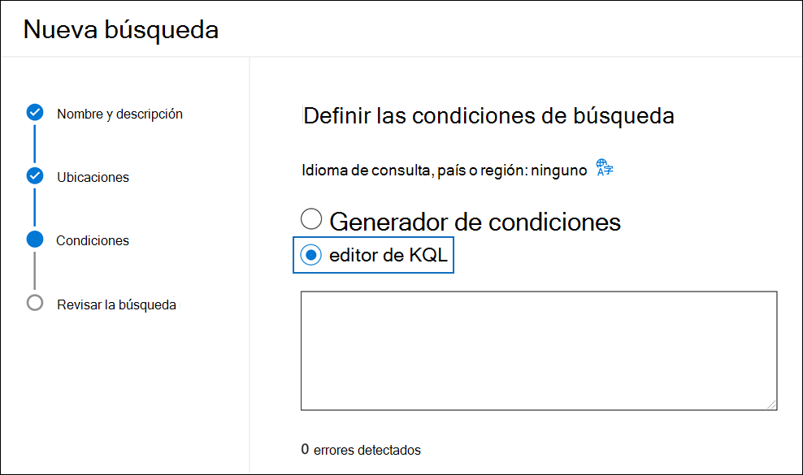
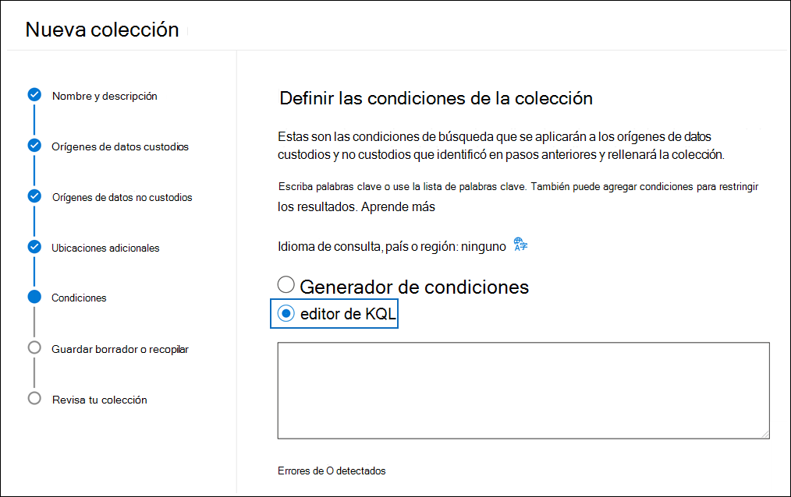
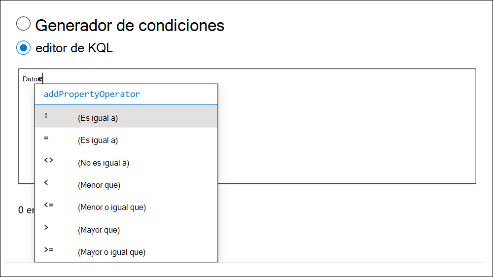

# Uso del editor de KQL para crear consultas de búsqueda

La nueva experiencia de consulta KQL en Microsoft 365 búsqueda de herramientas de exhibición de documentos electrónicos proporciona comentarios e instrucciones al compilar consultas de búsqueda en Búsqueda de contenido, Exhibición de documentos electrónicos de Microsoft Purview (estándar) y eDiscovery (Premium). Al escribir consultas en el editor, proporciona autocompletar para las propiedades y condiciones que se pueden buscar admitidas y proporciona listas de valores admitidos para las propiedades y condiciones estándar. Por ejemplo, si especifica la propiedad email en la `kind` consulta, el editor presentará una lista de valores admitidos que puede seleccionar. El editor de KQL también muestra posibles errores de consulta en tiempo real que puede corregir antes de ejecutar la búsqueda. Lo mejor de todo es que puede pegar consultas complejas directamente en el editor sin tener que compilar manualmente consultas mediante las tarjetas de palabras clave y condiciones del generador de condiciones estándar.
  
Estas son las principales ventajas de usar el editor de KQL:

- Proporciona instrucciones y le ayuda a crear consultas de búsqueda desde cero.

- Permite pegar rápidamente consultas largas y complejas directamente en el editor. Por ejemplo, si recibe una consulta compleja de un abogado contrario, puede pegarla en el editor de KQL en lugar de tener que usar el generador de condiciones.

- Identifica rápidamente posibles errores y muestra sugerencias sobre cómo resolver problemas.

El editor de KQL también está disponible al crear retenciones basadas en consultas en eDiscovery (estándar) y eDiscovery (Premium).

## Mostrar el editor de KQL

Al crear o editar una búsqueda de exhibición de documentos electrónicos, la opción para mostrar y usar el editor de KQL se encuentra en la página **Condiciones** del Asistente para búsquedas o colecciones.

### KQL editor en Búsqueda de contenido y exhibición de documentos electrónicos (estándar)

### editor de KQL en eDiscovery (Premium)

## Uso del editor de KQL

En las secciones siguientes se muestran ejemplos de cómo el editor de KQL proporciona sugerencias y detecta posibles errores.

### Autocompletar de propiedades y operadores de búsqueda

Al empezar a escribir una consulta de búsqueda en el editor de KQL, el editor muestra la autocompletación sugerida de las propiedades de búsqueda *admitidas (también denominadas restricciones de propiedades*) que puede seleccionar. Tiene que escribir un mínimo de dos caracteres para mostrar una lista de propiedades admitidas que comiencen por esos dos caracteres. Por ejemplo, en la captura de pantalla siguiente se muestran las propiedades de búsqueda sugeridas que comienzan por `Se`.

Además, el editor también sugiere proporcionar una lista de operadores admitidos (como `:`, `=` y `<>`) al escribir un nombre de propiedad completo. Por ejemplo, en la captura de pantalla siguiente se muestran los operadores sugeridos para la `Date` propiedad .

Para obtener más información sobre las propiedades y operadores de búsqueda admitidos, vea [Consultas de palabras clave y condiciones de búsqueda para eDiscovery](keyword-queries-and-search-conditions.md).

### Sugerencias de valor de propiedad

El editor de KQL proporciona sugerencias para los posibles valores de algunas propiedades. Por ejemplo, en la captura de pantalla siguiente se muestran los valores sugeridos para la `Kind` propiedad .

El editor también sugiere una lista de usuarios (en formato UPN) al escribir propiedades de destinatario de correo electrónico, como `From`, `To``Recipients` y `Participants`.

### Detección de posibles errores

El editor de KQL detecta posibles errores en las consultas de búsqueda y proporciona una sugerencia de lo que provoca el error para ayudarle a resolver el error. El editor también indica un posible error cuando una propiedad no tiene una operación o un valor correspondientes. Los posibles errores de la consulta se resaltan en texto rojo y las explicaciones y posibles correcciones para el error se muestran en la sección desplegable **Posibles errores** . Por ejemplo, si pega la siguiente consulta en el editor de KQL, se detectarán cuatro posibles errores.

En este caso, puede usar las posibles sugerencias de error para solucionar problemas y corregir la consulta.

## Más información

- Puede alternar entre el generador de condiciones y el editor de KQL. Por ejemplo, si usa el generador de condiciones para configurar una consulta mediante el cuadro Palabras clave y varias tarjetas de condición, puede mostrar la consulta resultante en el editor de KQL. Sin embargo, si crea una consulta compleja (con palabras clave y condiciones) en el editor de KQL, la consulta resultante solo se muestra en el cuadro Palabras clave al verla en el generador de condiciones.

- Si pega una consulta compleja en el editor de KQL, el editor detecta posibles errores y sugiere posibles soluciones para resolver errores.
